# 🏯 TTNDD_OPS — MASTER SPEC (PRODUCT-FIRST, RESEARCH-AUGMENTED, ALL-IN-ONE + CONTRACT PACK) v13.0 TECH STACK + AI-DRIVEN DELIVERY MODEL RELEASE

> **Nền tảng**: Thanh Thiếu Niên Đại Đạo — Hệ thống Quản lý & Vận hành (Power Platform ERP)  
> **Triết lý**: *Business first → System design → Technical contract*  
> **Kiến trúc mục tiêu**: Modular Monolith · Multi-Tenant · Event-Driven · Google Cloud Native  
> **Ngân sách GCP (Hard cap)**: **≤ 800.000 VND/tháng** (thiết lập guardrails + auto actions)  
> **Phiên bản**: **13.0** — Ngày: **06/03/2026** (Asia/Ho_Chi_Minh) (Asia/Ho_Chi_Minh)

---

## CÁCH DÙNG TÀI LIỆU (2 “VIEW” RÕ RÀNG)

### ✅ PRODUCT VIEW (dành cho LĐT + Product Team)
- Bức tranh tổng thể platform (giống ERP game/MMORPG)
- Module map, user journeys, page map, workflow, business rules, user stories, acceptance criteria
- Không sa vào tech stack / code chi tiết

### ✅ ENGINEERING VIEW (dành cho Dev/AI-Agent/Tech Lead)
- Architecture chuẩn hoá + bounded context + data contract
- Database schema, RLS policies, event catalog, integration, API, LLD
- GCP deploy + budget guardrails + observability
- Roadmap Jira-structured (Story → Phase → Work Package → Milestone → Task)

---

## CHANGE LOG

- **v13.0 (06/03/2026): Technical Stack (Full‑stack AI) + AI‑Driven Delivery Operating Model**  
  - Bổ sung **PHẦN II.1 — Technical Stack (GCP‑native, budget‑aware)**: monorepo, FE/BE, DB, event bus, CI/CD, security, testing.  
  - Bổ sung **PHẦN II.2 — AI‑Driven Delivery Operating Model**: luân phiên vai trò theo team Product chuẩn; SSOT + Sync Gate + CR bám chặt.  
  - Nâng SSOT từ **7 → 8 artifacts**: thêm **ADR/Tech Stack Decisions** để chặn lệch pha công nghệ.  

- **v12.0 (06/03/2026): UI MMORPG “thật sự” — Screen Map theo module + Design Tokens JSON (DTCG) + Sync update**  
  - Bổ sung **UI Screen Map chi tiết theo từng module**: route map + wireframe text + component mapping (HUD/Quest/Inventory/Skill Tree/Boards…).  
  - Thêm **Design Tokens JSON** theo chuẩn **Design Tokens Community Group (DTCG)** để FE import thẳng, và hướng dẫn build ra CSS variables/Tailwind bằng Style Dictionary.  
  - Cập nhật **Spec Sync System**: SSOT tăng từ **6 → 7 artifacts**, thêm **UI Contract (Screen Map + Tokens)** để chặn lệch pha.  

- **v11.0 (06/03/2026): UI/UX MMORPG + Fix Markdown Tables**  
  - Sửa toàn bộ **bảng (tables) bị vỡ format**: chuyển các “inline table 1 dòng” thành markdown table đúng chuẩn.  
  - Nâng cấp lớn **PHẦN V — UI/UX**: đặc tả như game MMORPG (*Tu tiên × Hướng đạo × Cao Đài × Việt Nam*), thêm HUD layout, design tokens, component kit, camp/offline mode, accessibility.  
  - Chuẩn hoá thêm các liên kết tiêu chuẩn (WCAG 2.2, prefers-reduced-motion, PWA caching).  


- **v10.0 (05/03/2026): BIG SYNC RELEASE (Consistency-first)**  
  - Thêm **Spec Sync System** (SSOT 8 artifacts + CI Sync Gate + CR template) để loại bỏ “lệch pha” giữa PRD ↔ contract ↔ schema ↔ tests ↔ roadmap.  
  - Nâng cấp **PHẦN VIII Roadmap**: thêm cột **Dev Notes (Implementation)** cho từng Work Package để AI Agent/Dev bám vào mà code.  
  - Chuẩn hoá cách ghi ngân sách: **≤ 800.000 VND/tháng** và runbook Budget Guardrails (50/80/100/120).  
  - Chuẩn hoá thuật ngữ & liên kết chéo (Module 8 hợp nhất Sessions/Events/Spiritual; Safe-from-Harm; contract-first gate).  

- **v9.0 (05/03/2026): FINAL RELEASE**
  - Hợp nhất “điểm mạnh đối thủ” (bản TTNDD_OPS_v8) vào bản chuẩn: thêm **Success Metrics + Non‑Goals** rõ ràng, chuẩn hoá cách trình bày & liên kết phần Product↔Engineering.
  - Nâng cấp **Child Safety & Safe-from-Harm**: bổ sung ràng buộc **2‑adult rule**, luồng **Incident Reporting** (ẩn danh/nhạy cảm), và checklist/DoD bắt buộc.
  - Nâng cấp **Budget Guardrails ≤ 800.000 VND/tháng**: thêm tuỳ chọn **hard kill-switch** (disable billing bằng notifications) + runbook “throttle” mặc định.
  - Chuẩn hoá **SPICES coverage enforcement**: mọi Activity/Lesson/Skill phải gắn tag SPICES để đo tác động giáo dục + analytics.
  - “Freeze” **Engineering Contract Pack**: thêm trường **Cost impact + SPICES tags + Safety gates** vào mẫu; đủ để AI Agent code/build/deploy theo contract.

- **v7.0 (05/03/2026):**
  - Đối chiếu và đồng bộ hoá với **TTNDD_OPS_v3_AllInOne_Updated** (bản công ty ngoài): giữ cấu trúc PRD A→E cho từng module, tăng độ rõ/đầy đủ.
  - Biến tài liệu thành **ALL‑IN‑ONE thật sự**: nhúng **đầy đủ State Machines + Checklists** (không còn “tham khảo v2”).
  - Chuẩn hoá “AI‑Agent build spec”: coding conventions, repo map, module contract, test strategy, definition of done.
- **v6.0 (05/03/2026):**
  - Bổ sung **research baseline** cho các module (OrangeHRM/BambooHR, Plane/OpenProject, ERPNext, Snipe‑IT, Moodle/Kahoot/Duolingo, Zammad/Freshworks).
  - Nâng cấp **Gamification** bằng khung **SDT + Flow + meta‑analysis** và guardrails chống lạm dụng.
- **v5.0 (05/03/2026):**
  - Tái cấu trúc theo **PRODUCT-FIRST**: đưa **Platform + Modules PRD** lên trước, kỹ thuật xuống sau.
  - Bổ sung **Platform Product Blueprint**: page map toàn hệ thống + user journeys lõi.
  - Chuẩn hoá “Engineering Contract”: **Core App Engine module map** + **Budget Guardrails** + **Module 8 implementation contract** (OpenAPI + SQL + RLS).

---


## PHẦN A — PLATFORM PRODUCT BLUEPRINT (TỔNG THỂ SẢN PHẨM)

### A.1 North Star (mục tiêu sản phẩm)
TTNDD_OPS là “**bộ não vận hành + tấm gương tiến bộ**” của ĐTNĐĐ:
- **Giảm hành chính** để Trưởng tập trung giáo dục và an toàn
- **Giữ tính kế thừa dữ liệu** khi thay đổi Trưởng/đổi nhiệm kỳ
- **Ghi nhận tiến bộ công bằng** qua đẳng thứ – chuyên hiệu – khen thưởng
- **Tăng động lực học tập & rèn luyện** (MMORPG gamification có kiểm soát)
- **Minh bạch** với phụ huynh và Ban Cai Quản

### A.2 4 loại tài khoản (multi-tenant)
- `super_admin`: Liên Đoàn Trưởng / Liên Đoàn Phó — cấu hình Org + phê duyệt + toàn quyền theo chính sách
- `admin`: Trưởng Ngành / Trưởng Ban chuyên môn — vận hành module theo phạm vi
- `user`: Đoàn sinh — học tập, rèn luyện, nộp minh chứng, xem tiến bộ
- `guest`: Phụ huynh — xem tiến bộ, ký consent, nhận thông báo

### A.3 Global Navigation (một “Game Hub” cho toàn bộ ERP)
**Core layout**: Sidebar “Guild Menu” + Topbar + Breadcrumb + Quick Actions

**Trang Global (bắt buộc có)**
1. **Home Dashboard (Org)** — tóm tắt 10 module, alerts, upcoming events
2. **My Dashboard (Personal)** — nhiệm vụ, học tập, kỹ năng, streak, thông báo
3. **Global Search** — tìm người/kỹ năng/task/ticket/tài sản/bài học
4. **Inbox/Notifications** — in-app + lịch sử Zalo
5. **Activity Timeline** — feed hoạt động của cá nhân & Org (audit-friendly)
6. **Files & Attachments** — quản lý file theo module & quyền
7. **Reports Center** — PDF/Excel exports theo role

### A.4 Core User Journeys (đường đi “đúng” để product/dev cùng hiểu)
**J1 — Onboard 1 Org mới (Super Admin)**
- Tạo Org → cấu hình Ngành & độ tuổi → tạo user admin → bật/tắt module → set theme → set Zalo OA → go-live

**J2 — Onboard 1 Đoàn sinh (Admin)**
- Tạo hồ sơ (kèm phụ huynh nếu <18) → phân Đơn vị (Hàng/Đội/Nhóm) → mở Skill Tree → cấp “nhân vật” → bắt đầu LMS/Scout

**J3 — Sinh hoạt tuần (Scout)**
- Tạo Session + Lesson Plan → điểm danh → ghi nhận kỹ năng rèn → publish events → Reward tính EXP/Badge → Parent nhận tóm tắt

**J4 — Sự kiện/Trại (Scout)**
- Tạo Event → (nếu qua đêm) HIRARC + kế hoạch an toàn → mở đăng ký → gửi consent phụ huynh → check-in/out → event completed → báo cáo

**J5 — Kế hoạch → Dự án (PM)**
- Soạn kế hoạch 9 phần → submit → LĐT duyệt → auto-generate dự án (OKR → tasks) → nhắc việc → hoàn thành → nhận thưởng

**J6 — Tiến bộ & Thăng đẳng (Scout)**
- Đoàn sinh nộp minh chứng → Trưởng verify tiêu chí → hoàn tất kỹ năng/đẳng thứ → đề xuất → phê duyệt → thông báo + nghi thức

### A.5 Cross-cutting Product Requirements (yêu cầu xuyên module)
- **P0 Child Safety**: consent, 2-adult rule, privacy-by-default, no 1:1 private chat
- **Data Consistency**: một “Person/Member” canonical, timeline event store, RLS
- **Offline-friendly** (PWA): cache read-only pages, upload queue (optional)
- **Exports**: CSV/Excel/PDF có watermark + TTL download
- **Config-first**: mỗi Org tự cấu hình theme, EXP, badge, module toggles
- **Budget-first**: mọi feature tốn tiền phải có “kill switch” (khi chạm 100% budget)


### A.6 (Platform) Success Metrics (KPI đo lường thành công)
**Org-level (hàng tuần/tháng)**
- % Trưởng active hằng tuần (WAU) / tổng Trưởng
- % kế hoạch được duyệt đúng hạn; % task hoàn thành đúng hạn
- Attendance rate trung bình theo Ngành; số buổi sinh hoạt được ghi nhận đầy đủ
- Tỷ lệ phụ huynh ký consent đúng hạn; tỷ lệ thu phí đúng hạn
- Số sự cố an toàn được báo cáo & xử lý theo SLA (P0)

**Member-level (học tập & phát triển)**
- % kỹ năng/đẳng thứ hoàn tất theo quý; thời gian trung bình để hoàn tất 1 bậc
- XP earned (có cap), badge earned, streak habits (không khuyến khích nghiện)
- SPICES balance score: phân bổ hoạt động trên 6 chiều (không lệch 1 chiều)

### A.7 (Platform) Non-Goals v1 (Không làm trong Phase 1)
- Không xây **mạng xã hội công khai** (newsfeed public), không DM 1‑1 Trưởng↔Đoàn sinh.
- Không làm **payroll/phúc lợi phức tạp** như doanh nghiệp (Finance chỉ ở mức Đoàn).
- Không làm **real-time location tracking** của trẻ em.
- Không tối ưu cho >10.000 concurrent users (phase 1 target: vài trăm concurrent).

### A.8 (Platform) SPICES Coverage Enforcement (bắt buộc)
- Mọi **Activity / Session / Event / Lesson / Skill / Badge** phải gắn **SPICES tags**: `SOCIAL, PHYSICAL, INTELLECTUAL, CHARACTER, EMOTIONAL, SPIRITUAL`.
- Dashboard Org phải có **SPICES coverage widget**: % hoạt động theo 6 chiều, cảnh báo lệch.
- Data model: trường `spices_tags text[]` (PostgreSQL) hoặc join table `entity_spices(entity_type, entity_id, spices)`.
- Analytics: dùng SPICES để đối chiếu mục tiêu giáo dục, không dùng để “xếp hạng làm nhục” (child safety).

---

## PHẦN B — PRODUCT VIEW: PRD (NỘI DUNG + TÍNH NĂNG + LUỒNG)

> Phần này **chỉ** tập trung nghiệp vụ để Product Team “nhìn thấy sản phẩm”.
> Chi tiết kiến trúc / schema / API / code nằm ở **PHẦN C**.

## PHẦN I — BỐI CẢNH CHIẾN LƯỢC & TỔNG QUAN HỆ THỐNG

### 1.1 Tuyên bố Tầm nhìn Sản phẩm

**Vấn đề**: Đoàn Thiếu Nhi Đạo Đức (DTNDD) — đơn vị thanh thiếu niên của Tôn giáo Cao Đài — hiện vận hành hoàn toàn bằng giấy tờ và bảng tính. Quản lý hồ sơ đoàn sinh, theo dõi tiến trình đẳng thứ, lập kế hoạch hoạt động, quản lý tài chính, và giao tiếp với phụ huynh đều thủ công. Điều này dẫn đến:

- Mất dữ liệu khi Trưởng thay đổi, không có tính kế thừa
- Không theo dõi được tiến trình phát triển toàn diện của đoàn sinh qua các năm
- Thiếu minh bạch tài chính với phụ huynh và Ban Cai Quản
- Không có cơ chế tạo động lực (gamification) cho thế hệ Gen Z/Alpha quen thuộc với công nghệ
- Tốn nhiều thời gian hành chính, giảm thời gian dành cho giáo dục thực tế

**Giải pháp**: TTNDD_OPS — một nền tảng Power Platform dạng ERP, tích hợp ba trụ cột: Giáo lý Cao Đài + Phương pháp Hướng Đạo WOSM + Gamification MMORPG (Thiện Tâm Kỳ Truyện), triển khai 100% trên Google Cloud trong ngân sách 800.000 VND/tháng.

**Tầm nhìn**: *"Mỗi Đoàn sinh là một nhân vật trong hành trình tu luyện — Thiện Tâm Kỳ Truyện. Mỗi kỹ năng học được là một bước tiến trên Cây Kỹ năng. Mỗi bậc Đẳng thứ đạt được là một cấp độ mới trong cuộc phiêu lưu. Hệ thống ghi nhận, khích lệ và tôn vinh hành trình đó — không phải thay thế, mà là tấm gương kỹ thuật số phản chiếu triết lý giáo dục Hướng Đạo."*

### 1.2 Phân tích Các bên Liên quan (Stakeholders)

| Vai trò | Người dùng | Nhu cầu chính | Quyền trong hệ thống |
| ---------|-----------|--------------|--------------------- |
| **Ban Cai Quản Thánh Thất** | Chức sắc Cao Đài | Giám sát tổng quan, đảm bảo phù hợp Giáo lý | Xem báo cáo tổng hợp |
| **Liên Đoàn Trưởng (LĐT)** | 1 người/Liên Đoàn | Quản trị toàn bộ, lập chiến lược, phê duyệt | `super_admin` |
| **Liên Đoàn Phó** | 1-2 người/LĐ | Hỗ trợ LĐT, thay mặt khi vắng | `super_admin` (giới hạn) |
| **Trưởng Ngành** | 1 người/Ngành | Quản lý đoàn sinh ngành, lập kế hoạch, giáo án | `admin` |
| **Phó Ngành + Trưởng phụ tá** | 2-4 người/Ngành | Hỗ trợ Trưởng Ngành, điểm danh, hướng dẫn | `admin` (giới hạn theo ngành) |
| **Trưởng Ban Chuyên Môn** | Theo nhu cầu | Quản lý lĩnh vực chuyên môn (huấn luyện, truyền thông, quản cụ...) | `admin` (theo chức năng) |
| **Đoàn sinh** | 20-100+ em/LĐ | Xem tiến trình, học bài, nhận EXP, tham gia đấu trường | `user` |
| **Phụ huynh** | 1-2 người/em | Xem tiến bộ con em, nhận thông báo, đồng ý sự kiện | `guest` |
| **Ban Cố Vấn** | Cựu Trưởng | Tư vấn, hỗ trợ khi được mời | Xem báo cáo |

### 1.3 Ba Trụ cột Giáo dục

DTNDD xây dựng chương trình giáo dục dựa trên ba trụ cột đồng bộ hóa:

**Trụ cột 1 — Đạo Đức Cao Đài (Tam Giáo Quy Nguyên)**
- Ngũ Giới Cấm: Bất sát sinh, Bất du đạo, Bất tà dâm, Bất vọng ngữ, Bất ẩm tửu
- Ngũ Thường: Nhân, Nghĩa, Lễ, Trí, Tín
- Tứ Đại Điều Quy: Vâng lời, Khiêm tốn, Trung thực, Nhất quán
- Tam Lập: Lập Đức, Lập Công, Lập Ngôn

**Trụ cột 2 — Phương pháp Hướng Đạo (WOSM Scout Method)**
- 8 yếu tố: Lời Hứa & Luật, Học qua Hành động, Hệ thống Nhóm nhỏ (Hàng đội), Khung Biểu tượng, Thiên nhiên, Tiến bộ Cá nhân, Hỗ trợ từ Trưởng, Phụng sự Cộng đồng
- SPICES: Social (Xã hội), Physical (Thể chất), Intellectual (Trí tuệ), Character (Nhân cách), Emotional (Cảm xúc), Spiritual (Tâm linh)

**Trụ cột 3 — Giáo dục Hiện đại + Gamification MMORPG**
- Thiện Tâm Kỳ Truyện: Khung tường thuật (narrative framework) chuyển đổi sinh hoạt hướng đạo thành hành trình RPG
- Lý thuyết Tự Quyết (Self-Determination Theory): Tự chủ (Autonomy), Năng lực (Competence), Gắn kết (Relatedness)
- Microlearning, spaced repetition, dopamine loops có kiểm soát (không gây nghiện)

### 1.4 Mô hình SPICES × Cao Đài × MMORPG — Lợi thế Cạnh tranh

**Không có nền tảng nào trên thế giới kết hợp cả ba yếu tố này.** Các nền tảng hiện có (Scoutbook, OSM, TroopTrack, Scouts Terrain) chỉ giải quyết quản lý hành chính. TTNDD_OPS tạo bước nhảy bằng cách:

| SPICES | Giáo lý Cao Đài | Gamification MMORPG | Tính năng Hệ thống |
| --------|----------------|--------------------|-------------------- |
| **Social** | Tứ Đại Điều Quy, Tứ Hải Giai Huynh Đệ | Guild/Party system (Hàng/Đội/Nhóm) | Cộng đồng, thi đấu đội, bảng xếp hạng đội |
| **Physical** | Ngũ Giới (giữ gìn thân thể) | Chỉ số Thể Lực trong Character Sheet | Theo dõi hoạt động ngoài trời, trại, thể dục |
| **Intellectual** | Trí (Ngũ Thường) | Skill Tree, Quiz Battle Arena | LMS, bài kiểm tra, kho tri thức |
| **Character** | Ngũ Thường (Nhân, Nghĩa, Lễ, Tín) | Achievement System, Badge Gallery | Đẳng thứ, chuyên hiệu, đánh giá 5 chiều |
| **Emotional** | Thiền định, Tĩnh tâm | EXP từ nhật ký tâm linh | Nhật ký cảm xúc, self-assessment |
| **Spiritual** | Thiên Nhãn, Ngũ Chi, Thánh Ngôn | Spiritual Quest Line | Nhật ký tâm linh, Ngũ Giới tracking |

### 1.5 Cấu trúc 10 Module & Phụ thuộc Liên Module

```
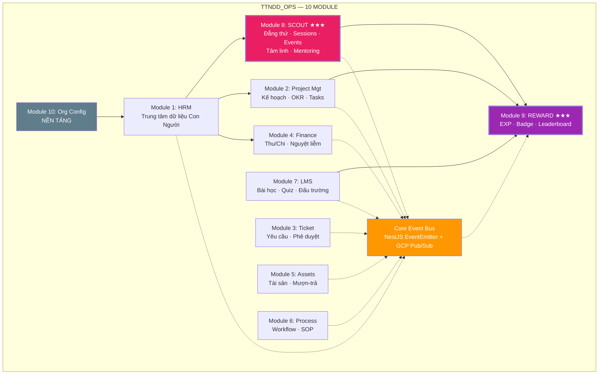

**Chuỗi phụ thuộc**: Module 10 → Module 1 → Module 9 → Module 8 → Module 7 → Module 2 → [3,4,5,6]

**Quy tắc liên module**: Mọi module giao tiếp qua Event Bus. Không module nào gọi trực tiếp service module khác. Mỗi thay đổi trạng thái = 1 DB Transaction + 1 Domain Event.

### 1.6 Quyết định Kiến trúc (ADR)

| # | Quyết định | Lý do | Hệ quả |
| ---|-----------|-------|-------- |
| ADR-01 | **Modular Monolith** thay vì Microservices | Team nhỏ, AI Agent code, tránh network overhead | Deploy 1 container, chia module rõ ràng |
| ADR-02 | **Row-Level Multi-Tenancy** (`org_id`) | Đơn giản, hiệu quả cho ~100 orgs, overhead 2-5% | Mọi bảng đều có `org_id`, PostgreSQL RLS |
| ADR-03 | **Event-Driven Inter-Module** | Nhất quán dữ liệu, loose coupling | Module A publish event → Module B subscribe |
| ADR-04 | **PostgreSQL 16** làm Primary DB | ACID, JSONB, RLS, GCP Cloud SQL | Cloud SQL db-f1-micro |
| ADR-05 | **In-Process Cache** thay Memorystore Redis | Tiết kiệm ~$30/tháng cho ngân sách 800.000 VND/tháng VND | NestJS CacheManager + node-cache + Redis Cloud Free 30MB |
| ADR-06 | **NestJS + Next.js 15** fullstack | TypeScript end-to-end, AI Agent friendly | Monorepo Turborepo |
| ADR-07 | **100% Google Cloud — Budget-Optimized** | Tương thích GCP, tận dụng free tier | Cloud Run min=0, Cloud SQL micro |
| ADR-08 | **Module 11+12 sáp nhập vào Module 8** | Sessions/Events là hoạt động cốt lõi Hướng Đạo, không tách rời Scout Management | Module 8 trở thành mega-module |
| ADR-09 | **PRD-first, Code-second** | Team product cần hiểu "xây cái gì" trước "xây bằng gì" | Mỗi module có PRD ~10+ trang trước khi viết code |


---

## PHẦN IV — KIẾN TRÚC BẢO MẬT & AN TOÀN TRẺ EM

### 4.1 Mô hình Xác thực & Phân quyền

**Xác thực (Authentication)**: Firebase Auth → Firebase ID Token → Backend verify → Custom JWT (Access: 15min, Refresh: 7 ngày trong HttpOnly Cookie)

**Phân quyền (Authorization)**: RBAC (4 role) + ABAC (org_id isolation qua RLS) + Resource-based (Trưởng chỉ quản lý Ngành mình)

### 4.2 An toàn Trẻ em — Ưu tiên P0

> **DTNDD phục vụ trẻ em từ 5-25 tuổi. An toàn trẻ em là đạo đức và trách nhiệm tôn giáo.**

| # | Hạng mục | Biện pháp |
| ---|---------|---------- |
| CS-01 | Consent phụ huynh bắt buộc cho < 13 tuổi (COPPA) và < 16 tuổi (PDPD VN) | Form đồng ý + e-signature |
| CS-02 | Ảnh đoàn sinh không public | Signed URL có TTL, private by default |
| CS-03 | Content moderation | Filter ngôn từ trong comment, báo cáo vi phạm |
| CS-04 | Không chat riêng 1-1 Trưởng ↔ Đoàn sinh | Mọi giao tiếp qua channel có audit trail |
| CS-05 | Quyền xóa dữ liệu | Soft delete + hard delete sau 90 ngày |
| CS-06 | Giới hạn thời gian sử dụng | Không push notification ban đêm (22:00-07:00) |
| CS-07 | Không dark patterns | Không kỹ thuật nudge làm suy yếu quyền riêng tư |
| CS-08 | **Nguyên tắc 2 người lớn (2‑adult rule)** | Session/Event (đặc biệt qua đêm) bắt buộc ≥2 Trưởng được assign; thiếu thì không cho approve |
| CS-09 | Safe-from-Harm incident reporting | Ticket “Incident” bảo mật + escalation + audit log; có SLA xử lý |
| CS-10 | Theo dõi huấn luyện/kiểm tra lý lịch Trưởng | Lưu chứng chỉ + nhắc gia hạn; hạn chế phạm vi nếu chưa đạt |
| CS-11 | Minh bạch truy cập dữ liệu trẻ em | Audit log “ai xem dữ liệu con”; phụ huynh xem được lịch sử |


> Liên kết chuẩn: DTNDD quy định ưu tiên **an toàn – bảo vệ trẻ em**, có **nguyên tắc hai người lớn**, và quy trình quản lý rủi ro cho hoạt động. Đồng thời tham chiếu chính sách quốc tế “Safe from Harm” của phong trào Hướng đạo để chuẩn hoá quy trình.


### 4.3 Bảo mật API & Dữ liệu

- Rate limiting: 100 req/min per user, 2000 req/min per org
- Input validation: Zod + class-validator trên TẤT CẢ endpoints
- SQL injection: Prisma parameterized queries (không raw SQL)
- XSS: DOMPurify (FE) + sanitize-html (BE)
- File upload: MIME check (magic bytes), max 50MB
- HTTPS only, HSTS, Helmet.js
- PII mã hóa: pgcrypto AES-256 tại column level
- Tín ngưỡng = dữ liệu nhạy cảm → cần explicit consent (PDPD VN)

---

### 4.4 Tiêu chuẩn & Kiểm chứng bảo mật (Security Standards & Verification)
- **OWASP Top 10**: dùng làm “baseline awareness” cho team (đặc biệt A01 Broken Access Control, A02 Cryptographic Failures, A03 Injection, Logging/Monitoring…).  
- **OWASP ASVS**: dùng như checklist kiểm chứng controls theo level (khuyến nghị Level 2 cho hệ thống có dữ liệu nhạy cảm trẻ em).  
- **Contract‑first security**: mọi endpoint phải có validation + auth scope trong OpenAPI, và có test (integration/contract).

### 4.5 Edge protection & rate limiting (GCP)
- Ưu tiên chặn/throttle ở edge bằng **Google Cloud Armor rate limiting** trước khi request vào Cloud Run (giảm chi phí & giảm nguy cơ DoS).  
- Rate policy tách theo: per-client (IP/user) + per-org; log sampling để tránh “đốt” budget.
- Authentication: nếu dùng **Firebase Auth**, backend bắt buộc **verify Firebase ID token** server-side trước khi issue session/access token nội bộ.

> Tham khảo: OWASP Top 10; OWASP ASVS; Firebase verify ID tokens; Cloud Armor rate limiting.

## PHẦN V — HỆ THỐNG THIẾT KẾ UI/UX (MMORPG)
> **Tôn chỉ**: UI/UX phải “đã như game” nhưng vẫn **dễ dùng như ERP**, ưu tiên **an toàn trẻ em (P0)** và **tối ưu chi phí (≤ 800k VND/tháng)**.  
> **Thẩm mỹ**: *Tu tiên (xianxia/cultivation) × Hướng đạo × Cao Đài × Việt Nam*.

### 5.1 Mục tiêu thiết kế (Design Goals)
1. **Immersive như MMORPG**: người dùng cảm giác đang “đi quest”, “lên cấp”, “mở khóa kỹ năng”.
2. **Rõ ràng & học nhanh**: dù giao diện phong cách game, luồng thao tác phải ngắn, ít nhầm.
3. **An toàn trẻ em & đạo đức**: không dark patterns, không “shame ranking”, luôn có kiểm soát phụ huynh.
4. **Budget-aware**: mọi hiệu ứng/ảnh/asset có chế độ *low-cost mode* để không “đốt” log, bandwidth, compute.
5. **Nhất quán xuyên module**: một design system, một vocabulary, một pattern library.

### 5.2 Art Direction — “Tu tiên × Hướng đạo × Cao Đài × Việt Nam”
#### 5.2.1 DNA thẩm mỹ (4 lớp)
- **Tu tiên/cultivation**: tầng cảnh giới, linh khí, pháp bảo, vòng sáng “độ kiếp” → dùng để biểu đạt **tiến bộ/level**.
- **Hướng đạo**: la bàn, bản đồ, cắm trại, huy hiệu, “party 4–8”, “guild”, sổ tay.
- **Cao Đài**: **Thiên Nhãn** (Divine Eye) là biểu tượng trung tâm; dùng như “Seal/Oracle UI” (không lạm dụng, chỉ đặt ở các màn hình nghi lễ/đánh dấu milestone).
- **Việt Nam**: chất liệu **sơn mài**, **giấy dó**, họa tiết **vân mây**, **hoa sen**, **chim Lạc/Đông Sơn**.

> Gợi ý biểu tượng Cao Đài: “God is represented as an eye in a triangle” (Thiên Nhãn) — dùng như *core emblem* ở header/temple scenes.  
> Gợi ý họa tiết Đông Sơn: “repeated patterns… complex architecture” trên trống đồng — phù hợp làm pattern nền/viền khung.

#### 5.2.2 “Map” chất liệu vào UI
- **Nền (Backgrounds)**: dark navy + noise nhẹ (giấy dó), gradient “linh khí”.
- **Card surfaces**: hiệu ứng “sơn mài” bóng nhẹ, viền cánh sen + vân mây.
- **Divider/Frame**: motif Đông Sơn (chim Lạc, vòng tròn đồng tâm) ở “Rank/Skillbook”.
- **Milestone screens**: dùng “Temple UI” (Thiên Nhãn + ánh vàng) cho: lên bậc, hoàn tất đẳng thứ, bàn giao ngành.

### 5.3 Từ ERP → MMORPG: Bản đồ ẩn dụ (UI Metaphor Map)
| Khái niệm hệ thống | Ẩn dụ MMORPG | UI pattern |
|---|---|---|
| Organization (Org) | **Guild / Bang hội** | Guild hall dashboard + roster |
| Branch/Unit (Ngành/Đội/Nhóm) | **Party / Squad** | Party panel (4–8) + group progress |
| Project/Plan | **Questline / Campaign** | Quest chain + checklist + timeline |
| Ticket/Approval | **Request Scroll / Seal** | “scroll card” + approval stamps |
| Skillbook/Rank | **Skill tree / Level** | Skill map (nodes + locks) |
| Rewards/EXP | **Currency/XP + Loot** | Inventory + XP bar + badges |

### 5.4 Information Architecture (IA) — Layout như HUD game
#### 5.4.1 Layout chuẩn (desktop)
```
┌─────────────────────────────────────────────────────────────────────┐
│ TOP HUD: Avatar · Tên · Ngành/Bậc · EXP Bar · Currency · Quick Nav   │
├───────────────┬───────────────────────────────────────────┬──────────┤
│ LEFT NAV      │ MAIN CANVAS (Module Scene)                 │ RIGHT    │
│ World Map     │ - Dashboard / List / Board / Skill Tree    │ QUEST &  │
│ (Modules)     │ - Detail Panels                            │ ALERTS   │
│               │ - Contextual Actions                        │ (Queue)  │
├───────────────┴───────────────────────────────────────────┴──────────┤
│ BOTTOM ACTION BAR: Primary actions + shortcuts + “Camp Mode” toggle  │
└─────────────────────────────────────────────────────────────────────┘
```

#### 5.4.2 Layout chuẩn (mobile)
- 1 cột, **Bottom Tab** 5 mục: Home · Map · Quest · Character · Inbox  
- “Camp Mode” (offline-first): tải pack, giảm animation, ưu tiên checklist + attendance.

### 5.5 Design Tokens (Design System) — chuẩn hoá để không lệch pha
#### 5.5.1 Core palette (dark MMORPG)
| Token | Hex | Usage | Notes |
|---|---|---|---|
| `bg.world` | `#0B1220` | nền chính | dark navy |
| `bg.panel` | `#111A2E` | panel / sidebar | sâu hơn nền |
| `surface.card` | `#141F36` | card | “sơn mài” bóng nhẹ |
| `stroke.soft` | `#2A3A64` | viền | không quá gắt |
| `text.primary` | `#E8EEF9` | chữ chính | |
| `text.muted` | `#AAB8D6` | chữ phụ | |

#### 5.5.2 Branch palette (ngành)
| Ngành | Token | Màu | Ý nghĩa |
|---|---|---|---|
| Đồng | `accent.dong` | `#DC2626` | nhiệt huyết, bình minh |
| Thiếu | `accent.thieu` | `#16A34A` | phát triển, thiên nhiên |
| Thanh | `accent.thanh` | `#3B82F6` | lý tưởng, trí tuệ |
| Trưởng | `accent.leader` | `#7C3AED` | khai sáng, dẫn dắt |

#### 5.5.3 “Tam Giáo” (theme overlay)
| Truyền thống | Màu gợi ý | Dùng ở đâu |
|---|---|---|
| Phật | `#F4C430` | milestone / “merit” |
| Lão | `#2563EB` | meditation / flow |
| Nho | `#DC2626` | duty / discipline |

### 5.6 Typography & Grid
- Font UI: **Be Vietnam Pro** (fallback: system-ui)  
- Heading: 600–700, body: 400–500, line-height 1.4–1.6  
- Grid: 12 columns (desktop), 4 columns (mobile)  
- Spacing tokens: 4/8/12/16/24/32

### 5.7 Iconography & Motifs (không “Tây hóa”)
- **Thiên Nhãn**: đặt đúng chỗ (Temple/Milestone), tránh spam.
- **Hoa sen + vân mây**: frame, divider, header ornaments.
- **Chim Lạc/Đông Sơn**: rank ring, achievement border.
- **Hướng đạo**: la bàn, lều, dây thừng, nút dây, lửa trại.
- Icon style: 2px stroke + fill tối giản; dùng SVG sprite để nhẹ.

### 5.8 Component Library (MMORPG UI Kit) — “có thể build”
**Core HUD**
- `HUDTopBar` (avatar, exp bar, currency, quick nav)
- `QuestTrackerPanel` (right panel queue)
- `ActionBar` (bottom actions + shortcuts)

**Progression**
- `ExpBar`, `LevelBadge`, `RankRing` (Đông Sơn ring)
- `SkillTree` (nodes: locked/unlocked/in-progress/verified)
- `AchievementCard` + `RarityFrame` (common/rare/epic/legendary)

**Org Social**
- `PartyPanel` (4–8 members, roles)
- `GuildRoster` (Org members, filters)
- `MentorCard` (mentor/coach)

**Work & Ops**
- `KanbanBoard`, `WorkItemTree`, `Checklist`
- `ApprovalStamp` (approve/reject seals)
- `InvoiceCard`, `AssetLoanTicket`

**Safety/Parents**
- `GuardianConsentModal` (e-sign / confirmation)
- `ChildDataAccessLog` (phụ huynh xem lịch sử truy cập)
- `QuietHoursBanner` (22:00–07:00)

### 5.9 Micro‑interactions & Motion (đẹp nhưng không gây nghiện)
- Feedback bắt buộc: **rõ – nhanh – đúng** (toast, haptic nhẹ trên mobile, sound optional).
- “Level up” chỉ 1–2s, không loop; milestone có “ceremony screen” nhưng có nút Skip.
- Bắt buộc hỗ trợ **Reduced Motion** (`prefers-reduced-motion`) để tắt animation.  
- Progress bars phải **chính xác**, tránh “fake progress”.

### 5.10 Accessibility & Comfort (P0)
- Tuân thủ **WCAG 2.2 AA** cho các màn hình chính (contrast, focus, keyboard).  
- Có chế độ **Large Text / High Contrast**.  
- Không dùng animation “flash” nhanh; có “reduce motion”.

### 5.11 Offline & Camp Mode (đi trại)
- “Camp Mode”:  
  - tải **offline packs** cho LMS/Skill checklists;  
  - caching assets + dữ liệu cần thiết bằng Service Worker + Cache Storage;  
  - sync lại khi có mạng (background sync hạn chế).
- Ưu tiên checklist, attendance, consent forms, emergency contacts.

### 5.12 UI by Module — screen map tối thiểu (P0)
| Module | Screen P0 (phải có) | Game metaphor |
|---|---|---|
| HRM | Roster, Profile, Org chart | Guild roster |
| Project | Kanban/List/Tree + Plan template | Quest board |
| Ticket | Ticket inbox + approvals | Scroll requests |
| Finance | Fees, ledger, reports | Treasury |
| Assets | Inventory + loan workflow | Armory/Storehouse |
| LMS | Course list + quiz + offline pack | Academy |
| Scout Core | Skill map + verification queue + handover | Character progression |
| Rewards | XP ledger + badges + leaderboard | Inventory & rankings |


### 5.13 UI Screen Map (CHI TIẾT) — theo từng module (wireframe text + component mapping)

> **Nguyên tắc**  
> 1) **Một App Shell, nhiều “Zone/Scene”**: mọi module chạy trong cùng HUD để không “đứt mạch game”.  
> 2) **Cùng một vocabulary UI**: “Quest/Checklist”, “Inventory”, “Character Sheet”, “Guild/Party”, “Seal/Approval”.  
> 3) **Safety + Budget luôn hiện hữu**: mọi màn hình có thể bật **low‑cost mode**; dữ liệu trẻ em luôn “privacy-by-default”.

#### 5.13.1 Global App Shell (route & layout)
**Routes (chuẩn hoá)**  
- `/world` — World Map (hub)  
- `/character/:memberId` — Character Sheet (profile MMORPG)  
- `/quest` — Quest Log (projects/plans/tasks/approvals)  
- `/inbox` — Inbox (tickets/approvals/notifications)  
- `/guild` — Guild Hall (org dashboards, rosters)  
- `/settings` — Settings (org/user/budget/flags)

**Wireframe (desktop)**
```
┌──────────────────────────────────────────────────────────────────────────────┐
│ HUDTopBar  [Org Crest] [World ▾] [Search]     [EXP][Currency][Notif][Profile] │
├───────────────┬───────────────────────────────────────────────┬──────────────┤
│ LeftRailNav   │ MainCanvas (Scene)                              │ RightPanel  │
│ - World Map   │ - Lists / Boards / Skill Tree / Forms           │ - Quest     │
│ - Guild Hall  │ - Detail Drawer (side sheet)                    │ - Verify Q  │
│ - Academy     │ - Contextual Action Bar                         │ - Alerts    │
│ - Armory      │                                                 │ - Parents   │
├───────────────┴───────────────────────────────────────────────┴──────────────┤
│ ActionBar (Primary actions + shortcuts + Camp Mode + Low-cost Mode status)    │
└──────────────────────────────────────────────────────────────────────────────┘
```

**Wireframe (mobile)**
- Bottom Tabs: `Home · Map · Quest · Character · Inbox`  
- RightPanel → chuyển thành “Quest Drawer” dạng swipe.

#### 5.13.2 Component ID Map (SSOT cho FE)
> Component IDs dùng xuyên suốt screen map (để mapping vào code/components).  
| Component ID | Tên | Mục đích | Gợi ý implement (FE) |
|---|---|---|---|
| `C-AppShell` | App Shell | Khung HUD chung | Next.js layout + CSS variables tokens |
| `C-HUDTopBar` | Top HUD | avatar/exp/currency/search/notif | sticky header + responsive slots |
| `C-LeftRailNav` | World Map Nav | nav modules | icon + badge + role gating |
| `C-RightQuestPanel` | Quest/Queue | quest tracker + verify queue | collapsible; on mobile → drawer |
| `C-ActionBar` | Action Bar | CTA theo context | keyboard shortcuts + safe confirm |
| `C-SceneHeader` | Scene Header | tên scene + breadcrumbs | includes SPICES + cost tags |
| `C-CardLacquer` | Lacquer Card | card “sơn mài” | shadow+border tokens |
| `C-DrawerDetail` | Detail Drawer | xem/điều chỉnh entity | Headless UI dialog/sheet |
| `C-QuestChain` | Quest Chain | chuỗi questline | tree view + checklist |
| `C-Checklist` | Checklist | tick tasks/criteria | optimistic UI + audit |
| `C-SkillTree` | Skill Tree | map kỹ năng | nodes + locks + tooltips |
| `C-CharacterSheet` | Character Sheet | profile dạng game | stats + rank + badges |
| `C-ExpBar` | EXP Bar | tiến độ lên cấp | accurate progress only |
| `C-InventoryPanel` | Inventory | currencies/loot | ledger-backed view |
| `C-ApprovalStamp` | Seal/Stamp | phê duyệt | approve/reject with reasons |
| `C-PartyPanel` | Party 4–8 | nhóm nhỏ | roles + progress rollup |
| `C-GuildRoster` | Guild roster | danh sách thành viên | filter + search + export gated |
| `C-SafeBanner` | Safety banner | quiet hours/safety gates | always visible when active |
| `C-LowCostBadge` | Low-cost badge | trạng thái tiết kiệm | driven by feature flags |
| `C-SPICESTag` | SPICES tag | hiển thị SPICES | required for activities/lessons |
| `C-ConsentModal` | Consent | đồng ý phụ huynh | e-sign + audit log |
| `C-IncidentReport` | Incident | báo cáo sự cố | restricted visibility |

---

### 5.14 Screen Map theo module (P0 → P1), kèm wireframe & component mapping

> Format: **Screen → Route → Primary components → Data sources (API tags) → Events → Roles → Cost impact**  
> **Cost impact**: LOW/MED/HIGH để gắn kill-switch theo Budget Guardrails.

#### Module 10 — Org Config & IAM (Guild Admin)
| Screen | Route | Primary components | API tags | Events | Roles | Cost |
|---|---|---|---|---|---|---|
| Org Overview | `/settings/org` | `C-SceneHeader`, `C-CardLacquer` | Org/IAM | `cfg.updated` | SuperAdmin | LOW |
| Roles & Scopes | `/settings/iam` | `C-DrawerDetail`, tables | IAM | `iam.role.granted` | SuperAdmin | LOW |
| Module Toggles | `/settings/modules` | toggles + `C-LowCostBadge` | Config | `cfg.updated` | SuperAdmin | LOW |
| Budget Guardrails | `/settings/budget` | charts + runbook panel | Budget | budget alerts | SuperAdmin | LOW |
| Audit Log | `/settings/audit` | table + filters | Audit | — | SuperAdmin | MED (export gated) |

**Wireframe: Roles & Scopes**
```
[SceneHeader: IAM]  [Search]  [Create Role]
------------------------------------------------
[Role List] | [Permissions Matrix] | [Scope Preview]
```

#### Module 1 — HRM (Roster & Character)
| Screen | Route | Primary components | API tags | Events | Roles | Cost |
|---|---|---|---|---|---|---|
| Member Roster | `/guild/roster` | `C-GuildRoster`, `C-DrawerDetail` | HRM | `hrm.*` | Admin/Leader | MED |
| Character Sheet | `/character/:id` | `C-CharacterSheet`, `C-ExpBar`, `C-InventoryPanel` | HRM/Scout/Reward | `reward.*` | Admin/Leader/User/Parent (limited) | MED |
| Org Chart | `/guild/org-chart` | tree + `C-CardLacquer` | Org/HRM | `org.assignment.changed` | Admin/Leader | LOW |
| Compliance Center | `/guild/compliance` | table + `C-SafeBanner` | HRM | compliance events | Admin | LOW |
| Transfers | `/guild/transfers` | wizard + `C-ApprovalStamp` | HRM | `hrm.member_transferred` | SuperAdmin | LOW |

#### Module 2 — Project/Planning (Quest Board)
| Screen | Route | Primary components | API tags | Events | Roles | Cost |
|---|---|---|---|---|---|---|
| Quest Dashboard | `/quest` | `C-QuestChain`, `C-RightQuestPanel` | PM | `pm.*` | Admin/Leader | MED |
| Plan Composer | `/quest/plans/new` | form blocks + `C-Checklist` | PM | `pm.plan.submitted` | Admin/Leader | LOW |
| Kanban Board | `/quest/projects/:id/board` | `C-KanbanBoard` | PM | `pm.task.*` | Admin/Leader | MED |
| Work Item Tree | `/quest/projects/:id/tree` | `C-QuestChain` | PM | — | Admin/Leader | LOW |
| Gantt | `/quest/projects/:id/gantt` | gantt canvas | PM | — | Admin/Leader | HIGH (kill-switch) |
| Wiki | `/quest/projects/:id/wiki` | editor | PM | — | Admin/Leader | MED |

#### Module 3 — Ticket/Approval (Scroll Inbox)
| Screen | Route | Primary components | API tags | Events | Roles | Cost |
|---|---|---|---|---|---|---|
| Inbox | `/inbox/tickets` | list + `C-ApprovalStamp` | Ticket | `ticket.*` | Admin/Leader | LOW |
| New Request | `/inbox/tickets/new` | form + upload | Ticket/File | `ticket.submitted` | All | MED (uploads gated) |
| Ticket Detail | `/inbox/tickets/:id` | timeline + drawer | Ticket | — | scoped | LOW |
| Approval Flow Builder | `/inbox/approvals/builder` | flow canvas | Ticket/Proc | — | SuperAdmin | MED |

#### Module 4 — Finance (Treasury)
| Screen | Route | Primary components | API tags | Events | Roles | Cost |
|---|---|---|---|---|---|---|
| Treasury Dashboard | `/guild/treasury` | cards + charts | Finance | `fin.*` | Admin/SuperAdmin | MED |
| Fees & Invoices | `/guild/treasury/fees` | invoice list + `C-ApprovalStamp` | Finance | `fin.fee.*` | Admin | LOW |
| Ledger | `/guild/treasury/ledger` | table + filters | Finance | — | Admin | LOW |
| Budget & Cost Centers | `/guild/treasury/budgets` | tree + charts | Finance | — | SuperAdmin | MED |
| Fundraising | `/guild/treasury/fundraising` | event cards | Finance/PM | — | Admin | LOW |

#### Module 5 — Assets (Armory/Storehouse)
| Screen | Route | Primary components | API tags | Events | Roles | Cost |
|---|---|---|---|---|---|---|
| Inventory | `/guild/armory` | table + `C-DrawerDetail` | Assets | `asset.*` | Admin/Leader | LOW |
| Loan Requests | `/guild/armory/loans` | queue + `C-ApprovalStamp` | Assets | `asset.loan.*` | Admin/Leader | LOW |
| Camp Kits | `/guild/armory/kits` | kit builder | Assets | — | Admin | MED |
| Uniform Issue | `/guild/armory/uniform` | issue form | Assets/HRM | — | Admin | LOW |
| Maintenance | `/guild/armory/maintenance` | schedule | Assets | — | Admin | LOW |

#### Module 6 — Process & SOP (Automation Shrine)
| Screen | Route | Primary components | API tags | Events | Roles | Cost |
|---|---|---|---|---|---|---|
| Workflow Library | `/guild/process/workflows` | catalog | Process | `proc.*` | SuperAdmin/Admin | LOW |
| Workflow Builder | `/guild/process/builder/:id` | node canvas | Process | `proc.workflow.executed` | SuperAdmin | MED |
| SOP Library | `/guild/process/sop` | docs list | Process | — | Admin | LOW |
| SOP Viewer | `/guild/process/sop/:id` | reader | Process | — | All (scoped) | LOW |

#### Module 7 — LMS (Academy)
| Screen | Route | Primary components | API tags | Events | Roles | Cost |
|---|---|---|---|---|---|---|
| Academy Home | `/academy` | cards + progress | LMS | `lms.*` | User/Parent | MED |
| Course Catalog | `/academy/courses` | filters + cards | LMS | — | User | LOW |
| Lesson Player | `/academy/courses/:id/lessons/:lid` | player + checklist | LMS/File | `lms.lesson_completed` | User | HIGH (video gated) |
| Quiz Arena | `/academy/quizzes/:id` | `C-QuizArena` | LMS | `lms.quiz_passed` | User | MED |
| Mentor Grading | `/academy/mentor/queue` | queue + drawer | LMS | — | Leader | LOW |
| Offline Packs | `/academy/offline` | download list | LMS | — | User | MED (bandwidth gated) |

#### Module 8 — Scout Core (Character Progression)
| Screen | Route | Primary components | API tags | Events | Roles | Cost |
|---|---|---|---|---|---|---|
| Scout Dashboard | `/guild/scout` | `C-PartyPanel`, `C-QuestChain` | Scout | `scout.*` | Leader | MED |
| Skill Tree Map | `/character/:id/skills` | `C-SkillTree` | Scout | `scout.skill.*` | User/Leader | MED |
| Skill Detail | `/character/:id/skills/:skillId` | criteria + evidence | Scout/File | `scout.skill.submitted` | User | MED (uploads gated) |
| Verify Queue | `/guild/scout/verify` | queue + `C-ApprovalStamp` | Scout | `scout.skill.verified` | Leader | LOW |
| Achievements Hall | `/character/:id/achievements` | cards + rarity frames | Scout/Reward | `scout.achievement.awarded` | User/Parent | LOW |
| Habit Tracker | `/character/:id/habits` | streak calendar | Scout/Reward | `scout.habit.*` | User | LOW |
| Service Log | `/character/:id/service` | activity list | Scout/PM | `scout.activity.*` | User/Leader | LOW |
| Handover (Cầu Trưởng Thành) | `/guild/scout/handover/:caseId` | ceremony screen | Scout/HRM | `scout.handover.*` | Leader | LOW |
| Incident Report | `/inbox/incidents` | `C-IncidentReport` | Ticket/Scout | `incident.*` | Restricted | LOW |

**Wireframe: Skill Detail**
```
[SceneHeader: Skill] [SPICES Tags] [Cost: MED] [Safety: Evidence private]
--------------------------------------------------------------
[Skill Lore Card]   [Criteria Checklist]
[Evidence Upload]   [Submit for Verification]
[History Timeline]  [Guardian View (read-only)]
```

#### Module 9 — Rewards/EXP (Inventory & Rankings)
| Screen | Route | Primary components | API tags | Events | Roles | Cost |
|---|---|---|---|---|---|---|
| Inventory | `/character/:id/inventory` | `C-InventoryPanel` | Reward | `reward.*` | User | LOW |
| Badge Catalog | `/guild/rewards/badges` | catalog | Reward | `reward.badge_awarded` | All | LOW |
| Leaderboard | `/guild/rewards/leaderboard` | table + filters | Reward | — | All | MED (anti-shame) |
| Penalties & Remediation | `/guild/rewards/penalties` | cases | Reward/Proc | `reward.penalty.*` | Leader | LOW |
| Shop | `/guild/rewards/shop` | items + redeem | Reward | `reward.redemption.*` | User | MED |

---

### 5.15 Design Tokens JSON (DTCG) — file để FE import thẳng

> **Vì sao dùng DTCG**: chuẩn hoá trao đổi token giữa tools và codebase; DTCG dùng các field `$type`, `$value`, `$description` trong JSON.  
> Tham chiếu: Design Tokens Format spec & W3C Design Tokens CG.  
> - DTCG format draft: https://www.designtokens.org/tr/drafts/format/  
> - W3C Design Tokens CG: https://www.w3.org/community/design-tokens/  
> - Style Dictionary hỗ trợ DTCG (v4): https://styledictionary.com/info/dtcg/ ; repo: https://github.com/style-dictionary/style-dictionary  
> - Material Design tokens overview: https://m3.material.io/foundations/design-tokens

#### 5.15.1 `ttnddops.tokens.json` (DTCG)
```json
{
  "$schema": "https://www.designtokens.org/tr/drafts/format/",
  "$description": "TTNDD_OPS Design Tokens — Tu tiên × Hướng đạo × Cao Đài × Việt Nam (Dark-first, MMORPG HUD).",
  "color": {
    "bg": {
      "world": { "$type": "color", "$value": "#0B1220", "$description": "World background (dark navy)." },
      "panel": { "$type": "color", "$value": "#111A2E", "$description": "HUD panels / sidebars." }
    },
    "surface": {
      "card": { "$type": "color", "$value": "#141F36", "$description": "Card surface (lacquer feel)." }
    },
    "stroke": {
      "soft": { "$type": "color", "$value": "#2A3A64", "$description": "Soft borders (not too harsh)." }
    },
    "text": {
      "primary": { "$type": "color", "$value": "#E8EEF9" },
      "muted": { "$type": "color", "$value": "#AAB8D6" },
      "danger": { "$type": "color", "$value": "{color.state.danger}" }
    },
    "accent": {
      "dong": { "$type": "color", "$value": "#DC2626", "$description": "Ngành Đồng." },
      "thieu": { "$type": "color", "$value": "#16A34A", "$description": "Ngành Thiếu." },
      "thanh": { "$type": "color", "$value": "#3B82F6", "$description": "Ngành Thanh." },
      "leader": { "$type": "color", "$value": "#7C3AED", "$description": "Trưởng." },
      "phat": { "$type": "color", "$value": "#F4C430", "$description": "Tam Giáo overlay — Phật (merit/milestone)." },
      "lao": { "$type": "color", "$value": "#2563EB", "$description": "Tam Giáo overlay — Lão (flow/meditation)." },
      "nho": { "$type": "color", "$value": "#DC2626", "$description": "Tam Giáo overlay — Nho (duty/discipline)." }
    },
    "state": {
      "success": { "$type": "color", "$value": "#22C55E" },
      "warning": { "$type": "color", "$value": "#F59E0B" },
      "danger": { "$type": "color", "$value": "#EF4444" },
      "info": { "$type": "color", "$value": "#60A5FA" }
    },
    "semantic": {
      "primary": { "$type": "color", "$value": "{color.accent.thanh}", "$description": "Primary action default." },
      "secondary": { "$type": "color", "$value": "{color.accent.thieu}" },
      "highlight": { "$type": "color", "$value": "{color.accent.phat}" }
    }
  },
  "radius": {
    "sm": { "$type": "dimension", "$value": "8px" },
    "md": { "$type": "dimension", "$value": "12px" },
    "lg": { "$type": "dimension", "$value": "16px" }
  },
  "spacing": {
    "1": { "$type": "dimension", "$value": "4px" },
    "2": { "$type": "dimension", "$value": "8px" },
    "3": { "$type": "dimension", "$value": "12px" },
    "4": { "$type": "dimension", "$value": "16px" },
    "6": { "$type": "dimension", "$value": "24px" },
    "8": { "$type": "dimension", "$value": "32px" }
  },
  "shadow": {
    "card": {
      "$type": "shadow",
      "$value": [
        { "color": "rgba(0,0,0,0.35)", "offsetX": "0px", "offsetY": "10px", "blur": "30px", "spread": "-10px" }
      ]
    }
  },
  "motion": {
    "duration": {
      "fast": { "$type": "duration", "$value": "120ms" },
      "base": { "$type": "duration", "$value": "180ms" },
      "slow": { "$type": "duration", "$value": "260ms" }
    },
    "easing": {
      "standard": { "$type": "cubicBezier", "$value": [0.2, 0.0, 0.0, 1.0] }
    },
    "reduced": {
      "$type": "boolean",
      "$value": false,
      "$description": "Runtime flag should respect prefers-reduced-motion."
    }
  },
  "layout": {
    "hud": {
      "topbarHeight": { "$type": "dimension", "$value": "64px" },
      "rightPanelWidth": { "$type": "dimension", "$value": "360px" },
      "leftRailWidth": { "$type": "dimension", "$value": "84px" }
    }
  },
  "typography": {
    "fontFamily": {
      "ui": { "$type": "fontFamily", "$value": "Be Vietnam Pro, system-ui, -apple-system, Segoe UI, Roboto, Arial" }
    },
    "size": {
      "sm": { "$type": "fontSize", "$value": "12px" },
      "base": { "$type": "fontSize", "$value": "14px" },
      "lg": { "$type": "fontSize", "$value": "16px" },
      "xl": { "$type": "fontSize", "$value": "20px" },
      "2xl": { "$type": "fontSize", "$value": "24px" }
    },
    "weight": {
      "regular": { "$type": "fontWeight", "$value": "400" },
      "medium": { "$type": "fontWeight", "$value": "500" },
      "semibold": { "$type": "fontWeight", "$value": "600" },
      "bold": { "$type": "fontWeight", "$value": "700" }
    },
    "lineHeight": {
      "tight": { "$type": "lineHeight", "$value": "1.2" },
      "base": { "$type": "lineHeight", "$value": "1.5" }
    }
  }
}
```

#### 5.15.2 FE import path (khuyến nghị)
- Lưu token JSON tại: `packages/tokens/ttnddops.tokens.json`  
- Dùng **Style Dictionary** để build ra:
  - `packages/tokens/dist/tokens.css` (CSS variables)
  - `packages/tokens/dist/tailwind.tokens.js` (mapping Tailwind)

**Example `style-dictionary.config.js` (rút gọn)**
```js
import StyleDictionary from "style-dictionary";

export default {
  source: ["packages/tokens/ttnddops.tokens.json"],
  platforms: {
    css: {
      transformGroup: "css",
      buildPath: "packages/tokens/dist/",
      files: [{ destination: "tokens.css", format: "css/variables" }]
    }
  }
};
```

**Reduced motion rule (P0)**
- Tất cả animation/motion phải respect `prefers-reduced-motion`.  
  (Technique C39/Understanding SC 2.3.3).  


### 5.16 Nguồn tham khảo (UI/UX & Tokens) — để team Design/Dev thống nhất
- Cao Đài (Thiên Nhãn): Encyclopaedia Britannica — “God is represented as an eye in a triangle”. https://www.britannica.com/topic/Cao-Dai  
- Đông Sơn drums (motif/pattern): Smarthistory — Đông Sơn drums overview. https://smarthistory.org/dong-son-drums/  
- Design Tokens (DTCG) format draft: https://www.designtokens.org/tr/drafts/format/  
- W3C Design Tokens Community Group: https://www.w3.org/community/design-tokens/  
- Style Dictionary (tokens build system, supports DTCG): https://github.com/style-dictionary/style-dictionary ; https://styledictionary.com/info/dtcg/  
- Material Design tokens (naming/semantic roles): https://m3.material.io/foundations/design-tokens  
- Accessibility: W3C WCAG 2.2 Recommendation. https://www.w3.org/TR/WCAG22/  
- Reduced motion technique: WCAG 2.2 CSS technique C39. https://www.w3.org/WAI/WCAG22/Techniques/css/C39  
- Reduced motion (MDN): https://developer.mozilla.org/en-US/docs/Web/CSS/@media/prefers-reduced-motion  
- Offline/PWA caching: web.dev Cache Storage & Service Workers. https://web.dev/learn/pwa/caching ; https://web.dev/learn/pwa/service-workers  
- Moodle offline inspiration (LMS camp mode): Moodle Docs offline features. https://docs.moodle.org/en/Moodle_app_offline_features

- Cao Đài (Thiên Nhãn): Encyclopaedia Britannica — “God is represented as an eye in a triangle”. https://www.britannica.com/topic/Cao-Dai  
- Đông Sơn drums (motif/pattern): Smarthistory — Đông Sơn drums overview. https://smarthistory.org/dong-son-drums/  
- Accessibility: W3C WCAG 2.2 Recommendation. https://www.w3.org/TR/WCAG22/  
- Reduced motion: MDN `prefers-reduced-motion`. https://developer.mozilla.org/en-US/docs/Web/CSS/@media/prefers-reduced-motion  
- Offline/PWA caching: web.dev Cache Storage & Service Workers. https://web.dev/learn/pwa/caching ; https://web.dev/learn/pwa/service-workers  
- Moodle offline inspiration (LMS camp mode): Moodle Docs offline features. https://docs.moodle.org/en/Moodle_app_offline_features

## PHẦN VI — TÍCH HỢP

### 6.1 Zalo OA Notification

Chuỗi ưu tiên: **Zalo ZNS → Zalo OA → Firebase FCM → SMS Brandname**

Templates: Thăng bậc, task sắp hạn, kế hoạch được duyệt, báo cáo tiến bộ phụ huynh (Thứ 2 hàng tuần, 8h sáng)

### 6.2 Tuân thủ PDPD Việt Nam

- Nghị định 13/2023/NĐ-CP + Luật PDPD (01/01/2026)
- Lưu trữ: `asia-southeast1` (Singapore)
- Consent management: Đồng ý rõ ràng, 72h phản hồi yêu cầu
- Dual consent (7-15 tuổi): CẢ trẻ VÀ phụ huynh đồng ý
- DPO: Bắt buộc cho dữ liệu nhạy cảm (tín ngưỡng, trẻ em)
- PII mã hóa at rest, right to erasure (90 ngày)

---

## PHẦN III — PRD CÁC MODULE

> **Quy ước đọc**: Mỗi module tuân theo cấu trúc 5 phần:
> - **(A) Tổng quan**: Mục đích, phạm vi, đối tượng, vị trí trong hệ thống
> - **(B) Tính năng & Chức năng**: Mô tả chi tiết với đề mục lớn/nhỏ/bullets
> - **(C) Luồng Quy trình & Logic Nghiệp vụ**: Flowchart, business rules
> - **(D) User Stories & Tiêu chí Chấp nhận**: As/I want/So that + Given/When/Then
> - **(E) Đặc tả Kỹ thuật**: Schema SQL, API endpoints, State Machine

---

### MODULE 1 — QUẢN LÝ NHÂN SỰ (HRM)

#### A. TỔNG QUAN MODULE

**Mục đích**: Module HRM là **trung tâm dữ liệu Con Người** của toàn bộ hệ thống. Mọi module khác (Scout, LMS, Finance, Reward...) đều tham chiếu đến dữ liệu thành viên từ HRM. Module quản lý toàn bộ vòng đời (lifecycle) của thành viên: từ khi gia nhập Đoàn, phát triển qua các Ngành, cho đến khi rời Đoàn hoặc trở thành Trưởng.

**Phạm vi**:
- Quản lý hồ sơ cá nhân Đoàn sinh, Trưởng, Phụ huynh
- Cơ cấu tổ chức: Liên Đoàn → Ngành → Đơn vị (Hàng/Đội/Nhóm)
- Chuyển ngành khi đủ tuổi (data migration)
- Sơ đồ tổ chức (Org Chart) tương tác
- Hồ sơ phụ huynh & liên kết với đoàn sinh
- Cựu thành viên & theo dõi alumni

**Đối tượng sử dụng**:
- `super_admin` (LĐT): Quản lý toàn bộ nhân sự, phê duyệt chuyển ngành
- `admin` (Trưởng Ngành): Quản lý đoàn sinh trong ngành phụ trách
- `user` (Đoàn sinh): Xem và cập nhật hồ sơ cá nhân
- `guest` (Phụ huynh): Xem thông tin đoàn sinh được liên kết

**Phụ thuộc**: Module 10 (Org Config) phải có trước. HRM cung cấp dữ liệu cho TẤT CẢ module khác.

#### B. TÍNH NĂNG & CHỨC NĂNG

**B.0 Baseline HRM (tham chiếu OrangeHRM/BambooHR) + thích ứng DTNDD/Hướng đạo**

> Mục tiêu: HRM của TTNDD_OPS **không chỉ “lưu hồ sơ”**, mà là **hệ sinh thái quản trị con người** tương đương một HR platform hiện đại (OrangeHRM/BambooHR), được “điều chỉnh” cho đặc thù thanh thiếu niên – tình nguyện viên – phụ huynh.

**B.0.1 14 phân hệ phụ cần có (định hướng roadmap)**
1) **Quản lý Thông tin Nhân sự (Core HR)**: hồ sơ, custom fields, sơ đồ tổ chức, tài liệu/giấy tờ.  
2) **Nghỉ phép/PTO** (cho Trưởng/tình nguyện viên).  
3) **Chấm công & Điểm danh**: clock-in/out web; timesheet; lịch ca (đặc thù: lịch sinh hoạt/đi công tác).  
4) **Tuyển dụng/ATS** (tuyển Trưởng/tình nguyện viên).  
5) **Onboarding/Offboarding**: nhập môn Trưởng mới; bàn giao nhiệm kỳ; thôi sinh hoạt.  
6) **Quản lý Hiệu suất**: OKR, đánh giá 360, 1:1 check-ins (dành cho Trưởng).  
7) **Kế hoạch Kế nhiệm & Phát triển**: 9-box, IDP, lộ trình năng lực.  
8) **Đào tạo/Học tập**: liên kết LMS (bắt buộc các khoá an toàn trẻ em).  
9) **Đi lại & Chi phí**: hoàn ứng, chi phí sự kiện.  
10) **Tiền lương & Phúc lợi** (tuỳ Org; có thể tắt): phụ cấp/công tác phí.  
11) **Cổng Tự phục vụ**: cập nhật hồ sơ, xin nghỉ, đăng ký lịch.  
12) **Helpdesk Nhân sự**: ticket nội bộ HR (liên kết Module 3).  
13) **Báo cáo & Phân tích**: headcount, retention, compliance training.  
14) **Kỷ luật**: log vi phạm, quy trình xử lý, mức độ (liên kết Reward/EXP trừ điểm).

**B.0.2 Thích ứng riêng cho DTNDD/Hướng đạo (P0)**
- **Quản lý tình nguyện viên**: theo dõi **lịch rảnh** + lịch trực sinh hoạt + phân công theo thời hạn (from/to).  
- **Theo dõi trình độ/chuyên hiệu của Trưởng**: “năng lực hướng dẫn” liên kết Scout Core (Module 8) & LMS (Module 7).  
- **Kiểm tra lý lịch & nhắc gia hạn**: background check (nếu Org áp dụng) + expiry alerts.  
- **Tuân thủ đào tạo “bảo vệ thanh thiếu niên”**: bắt buộc hoàn thành khoá trước khi được cấp quyền quản lý.  
- **Hồ sơ y tế & liên hệ khẩn cấp**: field riêng + quyền truy cập hạn chế (trưởng y tế, trưởng trại).  
- **Guardian/Parent link**: phụ huynh xem tiến bộ; phê duyệt consent cho sự kiện/ảnh.

**B.0.3 Feature parity (nguồn tham chiếu)**
- OrangeHRM mô tả các mảng: employee management, recruitment, onboarding, performance, leave/time & attendance (tương đương các nhóm tính năng trên).  
- BambooHR mô tả platform gồm payroll/time/benefits, time-off tracking, performance management, onboarding.

**Tài liệu tham chiếu**
- OrangeHRM (overview): https://www.orangehrm.com/  
- BambooHR (platform/time-off/performance/onboarding): https://www.bamboohr.com/


**B.1 Quản lý Hồ sơ Thành viên**

- **B.1.1 Thêm mới thành viên**
  - Đăng ký Đoàn sinh mới: Trưởng nhập thông tin hoặc phụ huynh tự đăng ký qua form
  - Thông tin bắt buộc: Họ tên, ngày sinh, giới tính, ngành (tự động theo tuổi), đơn vị
  - Thông tin phụ huynh: Bắt buộc nếu Đoàn sinh < 18 tuổi (tên, SĐT, Zalo, email, quan hệ)
  - Thông tin y tế: Dị ứng, bệnh lý, thuốc đang dùng, liên hệ khẩn cấp
  - Thông tin Hướng Đạo: Tên Hướng Đạo (scout name), tên nhân vật TTKТ (hero name)
  - Ảnh đại diện: Upload + crop, private URL (signed URL có TTL cho an toàn trẻ em)
  - Trạng thái khởi tạo: `pending` → chờ Trưởng duyệt

- **B.1.2 Cập nhật & quản lý hồ sơ**
  - Đoàn sinh/Phụ huynh tự cập nhật: SĐT, địa chỉ, thông tin y tế, ảnh đại diện
  - Trưởng cập nhật: Trạng thái, đơn vị, ghi chú, đánh giá
  - Lịch sử thay đổi: Mọi chỉnh sửa đều ghi audit log (ai sửa, sửa gì, lúc nào)
  - Soft delete: Khi đoàn sinh rời Đoàn → `status = 'left'`, dữ liệu giữ 90 ngày rồi xóa cứng

- **B.1.3 Trang Chi tiết Thành viên (Cross-Module Aggregation)**
  - **Thông tin cá nhân**: Hồ sơ, ảnh, thông tin liên hệ
  - **Tổng hợp từ Module 8 (Scout)**: Bậc đẳng thứ hiện tại, kỹ năng đang học, chuyên hiệu đạt được
  - **Tổng hợp từ Module 9 (Reward)**: Tổng EXP, số ngọc (visual), badge collection
  - **Tổng hợp từ Module 7 (LMS)**: Khóa học đã hoàn thành, đang học, điểm trung bình
  - **Tổng hợp từ Module 2 (Project)**: Task đang thực hiện, dự án đã hoàn thành
  - **Tổng hợp từ Module 4 (Finance)**: Tình trạng đóng phí (đã đóng/nợ/miễn)
  - **Tổng hợp từ Module 8-Sessions**: Tỉ lệ chuyên cần, chuỗi tham gia liên tục
  - **Timeline hoạt động**: Dòng thời gian tổng hợp tất cả sự kiện quan trọng

- **B.1.4 Tìm kiếm & Lọc nâng cao**
  - Tìm kiếm: Theo tên, mã thành viên, SĐT, tên Hướng Đạo
  - Lọc: Theo ngành, đơn vị, bậc đẳng thứ, trạng thái, độ tuổi, giới tính
  - Xuất dữ liệu: CSV, Excel, PDF (danh sách có lọc)

**B.2 Quản lý Cơ cấu Tổ chức**

- **B.2.1 Sơ đồ tổ chức (Org Chart)**
  - Sơ đồ dạng cây tương tác (drag-drop): Ban Cai Quản → Hội Đồng Liên Đoàn → Ban Thường Vụ → Ngành → Đơn vị
  - Hiển thị ảnh + tên + chức vụ cho mỗi node
  - Click node → xem chi tiết thành viên
  - Trưởng có thể chỉnh sửa sơ đồ (thêm/xóa/di chuyển node)

- **B.2.2 Quản lý Đơn vị (Hàng/Đội/Nhóm)**
  - Tạo đơn vị: Tên (theo quy ước ngành), totem/biểu tượng, số thành viên tối đa (6-8)
  - Phân bổ đoàn sinh vào đơn vị
  - Chỉ định Đơn vị Trưởng (Hàng Trưởng, Đội Trưởng, Nhóm Trưởng) — do Trưởng ngành chọn
  - Đơn vị Phó — do Đơn vị Trưởng chọn hoặc đoàn sinh tự bầu
  - Xem thống kê đơn vị: Số thành viên, tỉ lệ chuyên cần, EXP trung bình

**B.3 Chuyển Ngành (Branch Transition)**

- **B.3.1 Cơ chế chuyển ngành bắt buộc**
  - Hệ thống tự động phát hiện đoàn sinh đạt đến độ tuổi giới hạn của ngành hiện tại
  - Thông báo cho Trưởng Ngành hiện tại + Trưởng Ngành tiếp nhận + Phụ huynh
  - Trưởng Ngành hiện tại chuẩn bị hồ sơ chuyển: tổng kết thành tích, đẳng thứ đạt được
  - Trưởng Ngành tiếp nhận duyệt → hệ thống thực hiện chuyển

- **B.3.2 Quy tắc bảo toàn dữ liệu khi chuyển ngành**
  - EXP: **Giữ nguyên tổng EXP** — tên hiển thị thay đổi theo ngành mới (ví dụ: "hạt mầm" → "ngọc")
  - Kỹ năng: Archive kỹ năng ngành cũ → mở khóa Skill Tree ngành mới
  - Đẳng thứ: Bắt đầu lại từ bậc 1 của ngành mới, nhưng có thể rút ngắn thời gian nếu có kỹ năng nền tảng
  - Badge: Tất cả badge giữ nguyên (thành tích vĩnh viễn)
  - Lịch sử: Ghi nhận đầy đủ trong `member_branch_history`

**B.4 Quản lý Phụ huynh**

- Liên kết 1 phụ huynh → nhiều đoàn sinh (nếu có anh chị em)
- Phụ huynh nhận thông báo: Tiến bộ, điểm danh, sự kiện, phí
- Phụ huynh ký đồng ý: Sự kiện qua đêm, trại, hoạt động ngoài trời
- Portal riêng cho phụ huynh (role `guest`): Dashboard con em, lịch sử, đóng phí

**B.5 Cựu thành viên & Alumni**

- Đoàn sinh rời Đoàn → chuyển sang trạng thái `left` → vẫn xem được lịch sử
- Có thể quay lại: `left` → `active` (nếu còn trong độ tuổi)
- Báo cáo alumni: Số lượng, lý do rời, tỉ lệ quay lại

#### C. LUỒNG QUY TRÌNH & LOGIC NGHIỆP VỤ

**C.1 Luồng chính: Vòng đời Thành viên**

```text
[Đăng ký] → pending → [Trưởng duyệt + Tuyên Hứa] → active
                                                        │
                    ┌───────────────────────────────────┤
                    │              │              │     │
                suspended     inactive     transferred  left
                (vi phạm)    (tạm nghỉ)   (chuyển ngành) (rời Đoàn)
                    │              │              │
                    └──→ active ←──┘     active (ngành mới)
```

**C.2 Quy tắc nghiệp vụ (Business Rules)**

| # | Quy tắc | Mô tả |
| ---|---------|------- |
| BR-HRM-01 | Ngành tự động theo tuổi | Đồng: 5-10, Thiếu: 11-15, Thanh: 16-25 |
| BR-HRM-02 | Phụ huynh bắt buộc < 18 tuổi | Không tạo được hồ sơ đoàn sinh < 18 mà không có phụ huynh |
| BR-HRM-03 | Chuyển ngành bắt buộc | Hệ thống cảnh báo khi đoàn sinh đạt giới hạn tuổi, chuyển trong 3 tháng |
| BR-HRM-04 | Soft delete 90 ngày | Dữ liệu giữ 90 ngày sau khi rời, sau đó xóa cứng (tuân thủ PDPD) |
| BR-HRM-05 | 1 profile active/thời điểm | Unique constraint `(user_id, status='active')` |
| BR-HRM-06 | Audit mọi thay đổi | Mọi chỉnh sửa hồ sơ đều ghi `actor_id`, `before`, `after`, `timestamp` |

#### D. USER STORIES & TIÊU CHÍ CHẤP NHẬN

**US-HRM-01**: *Là Trưởng Ngành, tôi muốn thêm đoàn sinh mới vào hệ thống, để quản lý hồ sơ tập trung.*
- AC: Given thông tin đoàn sinh hợp lệ + phụ huynh (nếu < 18), When Trưởng submit form, Then hồ sơ được tạo với status `pending`, Trưởng cấp trên nhận thông báo.

**US-HRM-02**: *Là Phụ huynh, tôi muốn xem tiến bộ tổng hợp của con tôi, để theo dõi sự phát triển.*
- AC: Given phụ huynh đã đăng nhập + đã liên kết đoàn sinh, When vào Dashboard, Then thấy tổng hợp: chuyên cần, EXP, đẳng thứ, badge, phí.

**US-HRM-03**: *Là LĐT, tôi muốn xem sơ đồ tổ chức tổng quan, để nắm bắt nhân sự toàn Liên Đoàn.*
- AC: Given LĐT đăng nhập, When vào Org Chart, Then hiển thị cây tổ chức đầy đủ, click node → xem chi tiết.

**US-HRM-04**: *Là hệ thống, khi đoàn sinh đạt 11 tuổi ở Ngành Đồng, tôi cần thông báo chuyển ngành.*
- AC: Given đoàn sinh ngành Đồng, birth_date cho thấy đã 11 tuổi, When chạy cron hàng ngày, Then gửi thông báo cho Trưởng Đồng + Trưởng Thiếu + phụ huynh.


### MODULE 2 — QUẢN LÝ DỰ ÁN & KẾ HOẠCH (Project Management)

#### A. TỔNG QUAN MODULE

**Mục đích**: Module Project Management là **trung tâm lập kế hoạch và theo dõi thực thi** của toàn Liên Đoàn. Mọi hoạt động của DTNDD — từ chương trình năm, kế hoạch ngành, đến từng sự kiện cụ thể — đều cần được lập kế hoạch có hệ thống, phê duyệt, triển khai và đánh giá. Module này số hóa toàn bộ quy trình đó.

**Phạm vi**:
- Soạn Kế hoạch theo chuẩn 9 phần của DTNDD (Mô tả → Mục tiêu → Kết quả → Hoạt động → Nhân sự → Nội dung → Tiến độ → Đề xuất → Kinh phí)
- Phê duyệt kế hoạch theo quy trình phân cấp
- Tự động tạo Dự án từ kế hoạch được duyệt (Plan → Project Auto-Generation)
- Quản lý dự án kiểu Jira: Project → Phase → Sprint → Work Package → Task
- Theo dõi OKR (Objectives & Key Results)
- Nhiều góc nhìn: Kanban Board, Gantt Chart, Backlog Table, Calendar

**Đối tượng sử dụng**:
- `super_admin`: Phê duyệt kế hoạch, giám sát tổng quan dự án, báo cáo
- `admin`: Lập kế hoạch, quản lý dự án, phân công task
- `user`: Nhận task, cập nhật tiến độ, báo cáo hoàn thành
- `guest`: Không truy cập module này

#### B. TÍNH NĂNG & CHỨC NĂNG

**B.0 Baseline Project Management (tham chiếu Plane.so + OpenProject) + thích ứng DTNDD/Hướng đạo**

> Mục tiêu: Module 2 phải “đủ lực” như một PM tool hiện đại: nhiều view, nhiều cấp phân rã công việc, có wiki/tài liệu, có cycle/sprint, có template, có time tracking — nhưng được “dịch” sang **kế hoạch hoạt động Đoàn**.

**B.0.1 Phân cấp tham chiếu (định hướng thiết kế)**
- **Workspace → Portfolio → Project → Epics → Work items → Sub-items**  
- Tổ chức song song theo **Cycles/Sprints** (timebox) và **Modules** (nhóm theo chủ đề).  

**B.0.2 Tính năng thiết yếu (baseline)**
- **Portfolio management**: nhìn toàn cảnh nhiều dự án (năm/quý/tháng/sự kiện).  
- **Nhiều góc nhìn**: List/Table · Kanban/Board · Gantt · Calendar · Timeline.  
- **Wiki/Tài liệu**: gắn trực tiếp với dự án/work items; embed bảng công việc/Gantt.  
- **Cộng tác**: activity stream, comments, @mentions, updates.  
- **Methodologies**: Scrum, Kanban, Waterfall, Hybrid (tuỳ Org).  
- **Integrations**: file storage, API, (phase sau) Git/ChatOps.  
- **Time tracking & cost** (đặc biệt cho sự kiện/trại): giờ công, chi phí dự kiến, chi phí thực tế.

**B.0.3 Thích ứng riêng cho DTNDD/Hướng đạo (P0)**
- **Plan templates chuẩn** cho: cắm trại, lễ hội, công tác xã hội, khóa tu/giáo lý.  
  - Mỗi template có checklist: di chuyển, ăn uống, thiết bị, giấy phép, y tế, bảo hiểm, danh sách người tham gia, consent phụ huynh.  
- **Risk register** cho hoạt động ngoài trời: rủi ro thời tiết, an toàn nước, cháy nổ, y tế, hành trình.  
- **Chu kỳ chương trình**: theo dõi chu kỳ rèn luyện/thăng tiến (gắn Module 8).  

**Tài liệu tham chiếu**
- Plane docs: Epics & Cycles: https://docs.plane.so/ (ví dụ: https://docs.plane.so/core-concepts/issues/epics ; https://plane.so/cycles)  
- OpenProject: work packages, views, Gantt, Wiki:  
  - https://www.openproject.org/docs/getting-started/work-packages-introduction/  
  - https://www.openproject.org/docs/user-guide/work-packages/work-package-views/  
  - https://www.openproject.org/docs/user-guide/gantt-chart/  
  - https://www.openproject.org/docs/user-guide/wiki/


**B.1 Soạn Kế hoạch (Plan Builder)**

- **B.1.1 Form soạn kế hoạch 9 phần**
  - Phần I — Mô tả dự án: Bối cảnh, lý do, phạm vi
  - Phần II — Mục tiêu (Objectives): SMART goals, có thể map thành OKR
  - Phần III — Kết quả mong đợi (Outcomes/Key Results)
  - Phần IV — Hoạt động trọng tâm: Danh sách hoạt động cần thực hiện
  - Phần V — Nhân sự & Phân công: Vai trò, trách nhiệm (RACI matrix)
  - Phần VI — Nội dung chi tiết: Breakdown hoạt động thành task cụ thể
  - Phần VII — Tiến độ thực hiện: Timeline, milestone
  - Phần VIII — Đề xuất: Kiến nghị đặc biệt
  - Phần IX — Dự trù kinh phí: Chi phí ước tính cho từng hạng mục
  - Auto-save draft: Lưu tự động mỗi 30 giây
  - Template: Bộ mẫu kế hoạch (Sinh hoạt tuần, Trại ngắn ngày, Lễ hội, Dự án năm)

- **B.1.2 Phê duyệt kế hoạch**
  - Luồng: `draft → submitted → {approved | rejected}`
  - Trưởng Ngành soạn → nộp lên LĐT
  - LĐT xem xét → phê duyệt hoặc từ chối (kèm lý do)
  - Từ chối → trả về draft → Trưởng sửa → nộp lại
  - Thông báo Zalo khi được duyệt/từ chối

- **B.1.3 Plan → Project Auto-Generation**
  - Khi kế hoạch được approve → hệ thống TỰ ĐỘNG tạo dự án:
    - Mỗi Mục tiêu (Phần II) → Phase
    - Mỗi Kết quả (Phần III) → Sprint
    - Mỗi Hoạt động (Phần IV) → Work Package
    - Mỗi Nội dung (Phần VI) → Task (gán assignee từ Phần V)
    - Timeline từ Phần VII → set due dates
    - Kinh phí từ Phần IX → budget của dự án

**B.2 Quản lý Dự án**

- **B.2.1 Phân cấp dự án**: Project → Phase → Sprint → Work Package → Task
- **B.2.2 Kanban Board**: Drag-drop card giữa các cột (To Do / In Progress / Review / Done)
- **B.2.3 Gantt Chart**: Timeline dạng thanh ngang, milestone markers, dependencies
- **B.2.4 Backlog Table**: Bảng dữ liệu với cột tùy chỉnh, inline edit, filter/sort
- **B.2.5 OKR Dashboard**: Objective + Key Results + % hoàn thành
- **B.2.6 Task Detail**: Assignee(s), due date, priority, story points, attachments, comments, sub-tasks

**B.3 Tự động hóa & Thông báo**

- Task sắp hết hạn (D-1, D-day): Thông báo in-app + Zalo cho assignee
- Task hoàn thành → publish event `projects.task_completed` → Module 9 grant EXP
- Project hoàn thành → publish event `projects.project_completed` → EXP + Badge

#### C. LUỒNG QUY TRÌNH

**C.1 Luồng Kế hoạch → Dự án → Hoàn thành**

```text
[Trưởng soạn KH] → draft → [Nộp lên LĐT] → submitted
                                                │
                              ┌─────────────────┤
                              │                 │
                          approved          rejected
                              │                 │
                    [Auto-generate Project]   [Sửa → nộp lại]
                              │
                          active
                              │
                    [Thực thi tasks]
                              │
                        completed
```

**C.2 Quy tắc nghiệp vụ**

| # | Quy tắc |
| ---|--------- |
| BR-PM-01 | Chỉ `admin` trở lên mới được tạo kế hoạch |
| BR-PM-02 | Chỉ `super_admin` mới được phê duyệt kế hoạch |
| BR-PM-03 | Kế hoạch đã approved không được sửa (tạo bản sửa đổi mới) |
| BR-PM-04 | Task hoàn thành → auto publish event cho Module 9 |
| BR-PM-05 | Mỗi task có tối đa 5 assignees |

#### D. USER STORIES

**US-PM-01**: *Là Trưởng Ngành, tôi muốn soạn kế hoạch sinh hoạt quý theo mẫu 9 phần, để nộp LĐT phê duyệt.*

**US-PM-02**: *Là LĐT, tôi muốn phê duyệt kế hoạch và hệ thống tự động tạo dự án, để giảm thời gian hành chính.*

**US-PM-03**: *Là Đoàn sinh được giao task, tôi muốn cập nhật tiến độ trên Kanban board, để Trưởng biết tôi đang làm gì.*


### MODULE 3 — PHIẾU YÊU CẦU & PHÊ DUYỆT (Ticket & Approval)

#### A. TỔNG QUAN MODULE

**Mục đích**: Module Ticket là **hệ thống yêu cầu và phê duyệt tổng quát** — xử lý mọi loại yêu cầu không thuộc quy trình cố định của module khác. Ví dụ: đoàn sinh xin nghỉ, Trưởng đề xuất mua vật dụng, phụ huynh phản hồi, khiếu nại, hoặc bất kỳ yêu cầu nào cần phê duyệt.

**Phạm vi**: Tạo ticket, phân loại, chuyển tiếp, phê duyệt nhiều cấp, theo dõi trạng thái, lịch sử thảo luận (comment thread), đính kèm file.

#### B. TÍNH NĂNG & CHỨC NĂNG

**B.0 Baseline Ticket/Approval (tham chiếu Zammad + Freshdesk/Freshservice) + 5 mẫu phê duyệt**

> Mục tiêu: Module 3 phải là “xương sống vận hành” cho mọi yêu cầu: xin phép, chi phí, sự cố, kỷ luật, bàn giao, duyệt kế hoạch, consent phụ huynh.

**B.0.1 5 mẫu quy trình phê duyệt (bắt buộc hỗ trợ)**
1) **Tuần tự (Sequential)**: A → B → C (phân cấp rõ ràng).  
2) **Song song (Parallel)**: nhiều người/phòng ban duyệt cùng lúc.  
3) **Có điều kiện (Conditional)**: đổi luồng theo thuộc tính (ngưỡng tiền, loại sự kiện, rủi ro).  
4) **Đa cấp độ (Multi-level)**: tuần tự theo lớp, đặc biệt cho khoản lớn.  
5) **Hỗn hợp (Hybrid)**: kết hợp tuần tự + song song + điều kiện.

**B.0.2 Thích ứng riêng cho DTNDD/Hướng đạo (P0)**
- **Consent phụ huynh**: mẫu đơn điện tử + chữ ký số (hoặc xác nhận OTP) + lưu trữ chứng cứ.  
- **Phê duyệt thăng tiến**: quy trình nhiều bước qua “Hội đồng Duyệt xét”.  
- **Chuỗi phê duyệt sự kiện**: Đội trưởng → LĐT → Trưởng ban/Ủy ban → (tuỳ Org).  
- **Luồng chi phí có điều kiện**: theo ngưỡng (ví dụ 1M/3M/5M VND).  
- **Phê duyệt cố vấn chuyên hiệu**: gắn LMS/Scout.  
- **Kiểm tra lý lịch tình nguyện viên**: approval + expiry reminders.  
- **Báo cáo sự cố/khiếu nại**: escalation ladder + SLA.

**B.0.3 Feature baseline từ hệ thống tham chiếu**
- Zammad hỗ trợ automation theo “if-this-then-that” qua **Triggers** và cấu hình **Core Workflows** (dynamic field rules theo nhóm).  
- Freshworks có hướng dẫn **multi-level approval workflows** (hierarchical approvals) và **parallel approvals** (phê duyệt song song).

**Tài liệu tham chiếu**
- Zammad Triggers: https://admin-docs.zammad.org/en/latest/manage/trigger.html  
- Zammad Core Workflows: https://zammad.com/en/product/features/core-workflows  
- Freshservice hierarchical approvals (Workflow Automator): https://support.freshservice.com/support/solutions/articles/211198-setting-hierarchical-approvals-for-service-requests-using-workflow-automator-  
- Freshservice parallel approvals (FAQ): https://support.freshservice.com/support/solutions/articles/50000011703-new-approvals-process-frequently-asked-questions  
- Freshdesk approval workflow (KB articles): https://support.freshdesk.com/support/solutions/folders/50000000131


**B.1 Tạo & Quản lý Ticket**

- **B.1.1 Tạo ticket**: Form với tiêu đề, mô tả, danh mục (yêu cầu/phê duyệt/báo cáo/khiếu nại), mức ưu tiên, file đính kèm
- **B.1.2 Tự động đánh số**: TKT-2026-001, TKT-2026-002...
- **B.1.3 Phân loại & routing**: Tự động chuyển đến Trưởng phụ trách dựa trên danh mục
- **B.1.4 Comment thread**: Thảo luận trên ticket, ghi chú nội bộ (chỉ Trưởng thấy)
- **B.1.5 Lịch sử trạng thái**: Mỗi chuyển trạng thái → ghi log + thông báo Zalo

**B.2 Phê duyệt Workflow**

- **Sequential**: A → B → C (phê duyệt theo thứ tự cấp bậc)
- **Conditional**: Nếu yêu cầu > 500.000 VND → cần thêm LĐT duyệt
- **Batch approval**: Trưởng duyệt nhiều ticket cùng lúc

**B.3 Dashboard Ticket**

- Tổng quan: Open, In Progress, Resolved, Closed (theo số lượng + biểu đồ)
- Lọc: Theo danh mục, priority, assignee, ngày tạo
- SLA tracking: Thời gian phản hồi trung bình, ticket quá hạn

#### C. LUỒNG QUY TRÌNH

```text
[Tạo] → open → [Gán Trưởng] → assigned → [Xem xét] → in_review
                                                          │
                                            ┌─────────────┤
                                        approved      rejected
                                            │              │
                                         closed     [Phản hồi lại] → open
```

#### D. USER STORIES

**US-TK-01**: *Là Đoàn sinh, tôi muốn tạo phiếu xin nghỉ sinh hoạt, để Trưởng biết lý do tôi vắng.*

**US-TK-02**: *Là Trưởng, tôi muốn duyệt hàng loạt ticket xin nghỉ, để tiết kiệm thời gian.*

---

### MODULE 4 — QUẢN LÝ TÀI CHÍNH (Financial Management)

#### A. TỔNG QUAN MODULE

**Mục đích**: Module Finance quản lý **toàn bộ dòng tiền của Liên Đoàn**: thu (nguyệt liễm, trại phí, đóng góp), chi (hoạt động, mua sắm, từ thiện), và tồn quỹ. Đảm bảo minh bạch tài chính với Ban Cai Quản và phụ huynh.

**Phạm vi**: 2 cấp quỹ (Liên Đoàn + Ngành), thu/chi, Mạnh Thường Quân, đóng góp hiện vật, phí thành viên (nguyệt liễm, trại phí, đồng phục), báo cáo tài chính.

#### B. TÍNH NĂNG & CHỨC NĂNG

**B.0 Baseline Finance (tham chiếu ERPNext) + thích ứng DTNDD/Hướng đạo**

> Mục tiêu: Module 4 phải “ledger-first” và có **cây trung tâm chi phí + budgeting** để minh bạch theo đơn vị/ngành/sự kiện.

**B.0.1 Baseline (ERPNext-style)**
- **Cost Center Tree**: phân cấp trung tâm chi phí để “roll up” báo cáo.  
- **Budgeting**: đặt ngân sách theo cost center, theo dõi chênh lệch (variance) theo thời gian.  
- **Tagging transactions** theo cost center/dimension để báo cáo đúng.

**B.0.2 Thích ứng riêng cho DTNDD/Hướng đạo (P0)**
- **Phí đoàn viên** theo cá nhân/đơn vị: hóa đơn tự động, nhắc đóng phí.  
- **Phí cắm trại**: cho phép **đóng từng phần**; có **campership/quỹ hỗ trợ**.  
- **Gây quỹ theo sự kiện**: báo cáo thu/chi minh bạch (phi lợi nhuận).  
- **Đóng góp vật chất (in‑kind)**: ghi nhận hiện vật (lều, gạo, nước…), quy đổi (tuỳ Org) để minh bạch.

**Tài liệu tham chiếu**
- ERPNext Cost Center & Budgeting (docs): https://docs.frappe.io/erpnext/user/manual/en/cost-center-and-budgeting


**B.1 Quản lý Tài khoản/Quỹ**

- **B.1.1 Quỹ Liên Đoàn** (super_admin quản lý): Quỹ chính của toàn Đoàn
- **B.1.2 Quỹ Ngành** (admin quản lý): Quỹ riêng của từng Ngành (nếu có)
- **B.1.3 Quỹ Sự kiện**: Tạm thời, gắn với sự kiện cụ thể
- Mỗi quỹ có số dư hiện tại, cập nhật real-time khi có giao dịch

**B.2 Giao dịch Thu/Chi**

- **B.2.1 Ghi nhận thu**: Loại (nguyệt liễm, trại phí, đóng góp, tài trợ), số tiền, người nộp, chứng từ (ảnh biên lai), ngày giao dịch
- **B.2.2 Ghi nhận chi**: Loại (hoạt động, mua sắm, in ấn, từ thiện), số tiền, người thực hiện, chứng từ, ngày giao dịch
- **B.2.3 Phê duyệt**: Mọi giao dịch cần Trưởng/LĐT duyệt trước khi cập nhật số dư
- **B.2.4 Đảo bút toán**: Nếu phát hiện sai → tạo giao dịch ngược + link đến giao dịch gốc

**B.3 Phí Thành viên (Nguyệt liễm)**

- **B.3.1 Tạo kỳ đóng phí**: Theo tháng hoặc quý, áp dụng cho toàn ngành hoặc cá nhân
- **B.3.2 Theo dõi**: Đã đóng / Đóng một phần / Chưa đóng / Quá hạn / Miễn phí
- **B.3.3 Nhắc nhở tự động**: Khi quá hạn → Zalo notification cho phụ huynh
- **B.3.4 Miễn phí**: LĐT có quyền miễn cho hoàn cảnh đặc biệt

**B.4 Mạnh Thường Quân & Đóng góp Hiện vật**

- **B.4.1 Hồ sơ Mạnh Thường Quân**: Tên, liên hệ, loại tài trợ, tổng đóng góp
- **B.4.2 Đóng góp hiện vật**: Tên vật phẩm, số lượng, giá trị ước tính, ảnh

**B.5 Báo cáo Tài chính**

- Dashboard: Biểu đồ thu/chi theo tháng, số dư quỹ, top danh mục chi
- Báo cáo PDF: Xuất báo cáo tài chính định kỳ (tháng/quý/năm) cho Ban Cai Quản
- Bảng theo dõi phí: Hiển thị tất cả đoàn sinh với trạng thái đóng phí (đã/chưa/nợ)

#### C. LUỒNG QUY TRÌNH

**Giao dịch**: `pending → {approved | rejected} → completed → [có thể reversed]`

**Phí thành viên**: `unpaid → {partial | paid | overdue} → [paid | waived]`

#### D. USER STORIES

**US-FIN-01**: *Là Trưởng, tôi muốn ghi nhận thu nguyệt liễm từ đoàn sinh, kèm ảnh biên lai, để minh bạch.*

**US-FIN-02**: *Là Phụ huynh, khi con tôi chưa đóng phí quá hạn, tôi muốn nhận nhắc nhở qua Zalo.*

**US-FIN-03**: *Là LĐT, tôi muốn xem báo cáo thu/chi tổng hợp theo quý để báo cáo Ban Cai Quản.*

---

---

### MODULE 5 — QUẢN LÝ TÀI SẢN (Assets Management)

#### A. TỔNG QUAN MODULE

**Mục đích**: Quản lý **trang thiết bị, dụng cụ sinh hoạt** của Liên Đoàn: lều, gậy, dây thừng, bộ nấu ăn, dụng cụ y tế, đồng phục... Hệ thống mượn-trả có kiểm soát, QR code cho mỗi tài sản.

**Phạm vi**: Danh mục tài sản (Đoàn + Ngành), thêm/sửa/xóa tài sản, mượn-trả (request → approve → borrow → return), QR code, bảo trì, thanh lý.

#### B. TÍNH NĂNG & CHỨC NĂNG

**B.0 Baseline Assets (tham chiếu Snipe‑IT) + thích ứng DTNDD/Hướng đạo**

> Mục tiêu: Module 5 phải “inventory + custody + condition + audit trail” cho tài sản Đoàn & tài sản Ngành.

**B.0.1 Baseline (Snipe‑IT-style)**
- Theo dõi **asset assigned → to whom → where**.  
- **One-click checkin/checkout**, lịch sử mượn‑trả.  
- **Custom fields** để theo dõi thuộc tính đặc thù.  
- **Email alerts** cho bảo hành/giấy phép hết hạn.  
- **User acceptance** khi checkout (EULA/terms acceptance).  

**B.0.2 Thích ứng riêng cho DTNDD/Hướng đạo (P0)**
- **Thiết bị cắm trại**: theo dõi tình trạng, xuất kho theo mùa.  
- **Đồng phục**: cấp phát theo size, tình trạng, hoàn trả.  
- **Vật tư tiêu hao** (chuyên hiệu): tồn kho + định mức theo chương trình.  
- **Cơ sở vật chất/đất trại**: booking/maintenance.  
- **Xe cộ**: lịch bảo dưỡng + số km.  
- **Camp kits**: bộ dụng cụ đóng gói sẵn cho trại/sự kiện.  
- **Guardian assignment**: chỉ định phụ huynh/giám hộ khi tài sản được giao cho trẻ vị thành niên.

**Tài liệu tham chiếu**
- Snipe‑IT product features: https://snipeitapp.com/product


**B.1 Danh mục & Hồ sơ Tài sản**

- **B.1.1 Phân loại**: Lều trại, Gậy, Dây thừng, Dụng cụ Y tế, Dụng cụ Nấu ăn, Đồng phục, Tài liệu, Khác
- **B.1.2 Thuộc tính**: Mã tài sản, tên, danh mục, sở hữu (Đoàn/Ngành), số lượng, số lượng khả dụng, tình trạng (tốt/khá/kém/hỏng), ngày mua, giá mua, vị trí lưu trữ, ảnh, ghi chú
- **B.1.3 QR Code**: Tự động tạo QR cho mỗi tài sản, in và dán lên vật phẩm, scan bằng điện thoại → xem thông tin

**B.2 Mượn-Trả (Checkout/Checkin)**

- **B.2.1 Yêu cầu mượn**: Đoàn sinh/Trưởng chọn tài sản → nhập mục đích + ngày trả dự kiến
- **B.2.2 Phê duyệt**: Trưởng/Quản cụ duyệt → giao tài sản
- **B.2.3 Theo dõi**: Đang mượn, sắp đến hạn, quá hạn (tự động nhắc nhở)
- **B.2.4 Trả**: Ghi nhận tình trạng khi trả (tốt/hư hỏng), ghi chú
- **B.2.5 Hư hỏng/Mất**: Báo cáo hư hỏng → chuyển sang bảo trì hoặc thanh lý

**B.3 Dashboard & Báo cáo**

- Tổng quan: Tồn kho, đang mượn, quá hạn, bảo trì, thanh lý
- Cảnh báo: Tài sản quá hạn mượn, tài sản sắp hết (số lượng thấp)
- Lịch sử: Toàn bộ lịch sử mượn-trả của mỗi tài sản

#### C. LUỒNG QUY TRÌNH

```
available → [Yêu cầu mượn] → requested → [Duyệt] → checked_out
                                                        │
                               ┌────────────────────────┤
                           returned                  overdue
                               │                        │
                           available               [Trả muộn] → available
                                                   [Hư hỏng] → under_repair → {available | disposed}
                                                   [Mất] → disposed
```

---

---

### MODULE 6 — QUẢN LÝ QUY TRÌNH (Process Management)

#### A. TỔNG QUAN MODULE

**Mục đích**: Xây dựng và lưu trữ **các quy trình chuẩn (SOP)** và **workflow tự động hóa** của Liên Đoàn. Giúp đảm bảo tính nhất quán trong vận hành khi Trưởng thay đổi.

**Phạm vi**: Thư viện SOP (tài liệu quy trình), Workflow Builder (tự động hóa), quản lý phiên bản tài liệu.

#### B. TÍNH NĂNG & CHỨC NĂNG

**B.1 Thư viện SOP (Standard Operating Procedures)**

- **B.1.1 Tạo SOP**: Rich text editor (TipTap), đính kèm file/ảnh/video
- **B.1.2 Phân loại**: Quy trình tổ chức (sinh hoạt, trại, lễ), Quy trình hành chính (đăng ký, chuyển ngành), Quy trình an toàn (sơ cứu, cháy nổ, thời tiết)
- **B.1.3 Quản lý phiên bản**: Mỗi SOP có version, lịch sử thay đổi, người phê duyệt
- **B.1.4 Tìm kiếm**: Full-text search trong nội dung SOP

**B.2 Workflow Builder (Visual)**

- **B.2.1 Builder kéo-thả** (React Flow): Tạo workflow bằng cách kéo các node
- **B.2.2 Node types**:
  - Trigger: Sự kiện kích hoạt (event, lịch, thủ công)
  - Condition: Điều kiện rẽ nhánh (if/else)
  - Action: Gửi thông báo, tạo task, cập nhật trạng thái, gán EXP, tạo ticket
  - Delay: Chờ N giờ/ngày
- **B.2.3 Lưu & chạy**: Lưu workflow dạng JSON, executor service chạy khi trigger events

**B.3 Tài liệu Quy trình**

- Văn bản ban hành chính thức (nội quy, thông báo)
- Phân quyền xem: Toàn Đoàn, theo Ngành, theo vai trò


---

---

### MODULE 7 — HỆ THỐNG QUẢN LÝ HỌC TẬP (LMS)

#### A. TỔNG QUAN MODULE

**Mục đích**: Module LMS là **kho tri thức số và trung tâm học tập** của DTNDD. Tích hợp: (1) nội dung giáo lý Cao Đài, (2) kỹ năng Hướng Đạo, (3) kỹ năng đời sống, (4) bài kiểm tra gamified kiểu Kahoot, và (5) Đấu Trường (Battle Arena) — quiz real-time thi đấu trực tiếp. Module tham chiếu kiến trúc Moodle (competency frameworks, course-module-lesson hierarchy) và Duolingo (microlearning, streaks, XP per lesson).

**Phạm vi**:
- Quản lý khóa học, bài học, nội dung đa phương tiện
- Bài kiểm tra (quiz) với nhiều dạng câu hỏi
- Đấu Trường (Battle Arena) — quiz real-time thi đấu Kahoot-style
- Theo dõi tiến độ học tập cá nhân
- Gán bài học/kiểm tra cho Đoàn sinh hoặc Ngành
- Kho tri thức chung (tài liệu chia sẻ giữa các Liên Đoàn)

**Cơ sở khoa học**: Nghiên cứu meta-analysis (Sailer & Homner, 2020) cho thấy gamification trong giáo dục có hiệu ứng tích cực với g = 0.49 cho nhận thức và 0.36 cho động lực. Kurnaz (2025) tìm thấy g = 0.654 cho động lực K-12, với hiệu ứng lớn hơn ở lứa tuổi tiểu học — đúng đối tượng Ngành Đồng.

#### B. TÍNH NĂNG & CHỨC NĂNG

**B.0 Baseline LMS (tham chiếu Moodle + Kahoot + Duolingo) + thích ứng DTNDD/Hướng đạo**

> Mục tiêu: LMS của TTNDD_OPS phải vừa “chuẩn LMS” (course/quiz/badges/competency) vừa có “dopamine loop” an toàn kiểu Duolingo/Kahoot.

**B.0.1 Baseline (Moodle-style)**
- Course/lesson/quiz/gradebook/completion tracking.  
- Mobile app hỗ trợ **offline access**: download tài nguyên & học offline (hữu ích khi cắm trại).  
- Badge system + progress tracking.

**B.0.2 Kahoot-style “campfire quiz” (P0)**
- Quiz realtime, phản hồi tức thì, bảng xếp hạng buổi học/sinh hoạt.  
- Dùng cho “đố vui quanh lửa trại” hoặc kiểm tra nhanh.

**B.0.3 Duolingo-style habit loop (P0)**
- **XP**, **streak**, **leaderboards/leagues**, **milestones**.  
- Có cơ chế anti‑abuse và cho phép opt‑out cạnh tranh.

**B.0.4 Thích ứng riêng cho DTNDD/Hướng đạo**
- **Mỗi chuyên hiệu** = 1 course có activity bắt buộc + evidence (liên kết Scout Core).  
- Khung năng lực (competency) để theo dõi thăng tiến theo chương trình.  
- Danh mục học **Giáo lý Cao Đài** chuyên biệt.  
- **Parent dashboard**: xem tiến độ học tập, thành tích.  
- **Mentor/Advisor**: cố vấn chuyên hiệu như “giáo viên”, chấm minh chứng năng lực.

**Tài liệu tham chiếu**
- Moodle app offline features: https://docs.moodle.org/en/Moodle_app_offline_features  
- Moodle mobile download/feature list: https://download.moodle.org/mobile  
- Kahoot (what is): https://kahoot.com/what-is-kahoot/  
- Duolingo XP & leaderboards (official blog/help):  
  - https://blog.duolingo.com/duolingo-101-how-to-learn-a-language-on-duolingo/  
  - https://blog.duolingo.com/duolingo-leagues-leaderboards/


**B.1 Quản lý Khóa học & Bài học**

- **B.1.1 Phân cấp nội dung**: Khóa học → Module → Bài học → Hoạt động
- **B.1.2 Tạo bài học** (dành cho Trưởng):
  - Rich text editor (TipTap) với hỗ trợ ảnh, video, nhúng link
  - Cấu trúc bài học kích thích học tập:
    - **Hook** (Mở đầu): Câu hỏi gợi mở, video ngắn, tình huống
    - **Nội dung chính**: Text, ảnh, video, interactive H5P
    - **Thực hành**: Quiz nhỏ, checklist, bài tập phản hồi
    - **Tóm tắt**: Điểm chính cần nhớ
    - **Lời kêu gọi hành động**: Áp dụng trong sinh hoạt thực tế
  - Phân loại: Kỹ năng Hướng Đạo, Giáo lý Cao Đài, Kỹ năng sống, An toàn
  - Mức độ: Beginner / Intermediate / Advanced
  - Target Ngành: Có thể gán cho 1 hoặc nhiều Ngành
  - EXP reward: Cấu hình EXP khi hoàn thành bài / khóa

- **B.1.3 Kho tri thức chung**: Bài học đánh dấu `is_public = true` → chia sẻ giữa các Liên Đoàn

**B.2 Bài Kiểm tra (Quiz)**

- **B.2.1 Dạng câu hỏi**: Trắc nghiệm 1 đáp án, trắc nghiệm nhiều đáp án, Đúng/Sai, Điền vào chỗ trống
- **B.2.2 Cấu hình quiz**: Thời gian giới hạn (mỗi câu hoặc toàn bài), điểm đạt (mặc định 70%), ngẫu nhiên hóa câu hỏi, số lần làm lại tối đa
- **B.2.3 Kết quả & phản hồi**: Chấm tự động (trắc nghiệm), hiển thị đáp án đúng + giải thích, EXP + Badge tự động nếu đạt
- **B.2.4 Bài kiểm tra đánh giá** (có Trưởng chấm): Dạng tự luận → Trưởng review và chấm điểm

**B.3 Đấu Trường (Battle Arena) — Tính năng Đặc biệt**

Lấy cảm hứng từ Kahoot — quiz real-time competitive, thi đấu trực tiếp trong buổi sinh hoạt.

- **B.3.1 Tạo phòng đấu**: Trưởng chọn bộ quiz → hệ thống tạo game code 6 ký tự → chia sẻ cho Đoàn sinh
- **B.3.2 Tham gia**: Đoàn sinh nhập game code → join lobby → chờ host bắt đầu
- **B.3.3 Luồng thi đấu**:
  - Host bấm Start → đếm ngược 3s → hiển thị câu hỏi
  - Mỗi câu hỏi: Hiển thị câu hỏi + 4 đáp án (2×2 grid, 4 màu kiểu Kahoot) + timer đếm ngược
  - Đoàn sinh chọn đáp án → lock → chờ kết quả
  - Hết giờ → reveal đáp án đúng + bảng xếp hạng top 5 sau mỗi câu
  - Kết thúc → victory screen với confetti + xếp hạng chung cuộc
- **B.3.4 Tính điểm**: `điểm = base_points × (1 + timeBonus)` trong đó `timeBonus = (timeLimit - responseTime) / timeLimit`
- **B.3.5 Kỹ thuật**: Socket.IO WebSocket gateway, phòng tối đa 30 người
- **B.3.6 Events**: Người thắng → `lms.battle_won` → EXP bonus. Tất cả người đạt → `lms.quiz_passed`

**B.4 Tiến độ Học tập**

- **B.4.1 Dashboard cá nhân**: Khóa học đang học, % hoàn thành, chuỗi học liên tục (streak)
- **B.4.2 Tracking**: Bài học nào đã hoàn thành, điểm quiz, thời gian học
- **B.4.3 Gán bài**: Trưởng gán khóa học/quiz cho Đoàn sinh hoặc Ngành → thông báo

**B.5 Thiết kế Dopamine Loop (Có kiểm soát)**

Dựa trên Self-Determination Theory (SDT), tránh gây nghiện cho trẻ em:

- **Tự chủ (Autonomy)**: Đoàn sinh chọn khóa học, không bắt buộc thứ tự
- **Năng lực (Competence)**: Phản hồi tức thì, tiến trình rõ ràng, badge khi hoàn thành
- **Gắn kết (Relatedness)**: Đấu Trường đội, leaderboard theo Đội (không cá nhân)
- **Giới hạn an toàn**: Giới hạn EXP từ quiz mỗi ngày (max_per_day), không có variable-ratio rewards, có natural stopping points ("chương" kết thúc)

#### C. LUỒNG QUY TRÌNH

**C.1 Luồng học bài**: Đoàn sinh → Chọn khóa → Học bài → Làm quiz → Đạt → +EXP → Unlock bài tiếp

**C.2 Luồng Đấu Trường**: Trưởng tạo phòng → Đoàn sinh join → Thi đấu → Xếp hạng → +EXP

**C.3 Quiz State Machine**: `not_started → in_progress → submitted → {graded → passed | failed} → [retry | locked]`

#### D. USER STORIES

**US-LMS-01**: *Là Trưởng, tôi muốn tạo bài học về nút dây với video và quiz, để Đoàn sinh tự học trước buổi sinh hoạt.*

**US-LMS-02**: *Là Đoàn sinh, tôi muốn tham gia Đấu Trường và thi đấu quiz với các bạn, để vừa học vừa vui.*

**US-LMS-03**: *Là Trưởng, tôi muốn gán khóa học Giáo lý cho toàn Ngành Thiếu, để các em học trước lễ Tuyên Hứa.*


---

### MODULE 8 — QUẢN LÝ HƯỚNG ĐẠO SINH (Scout Management) — ★★★ MODULE LÕI ★★★

> **Đây là module lớn nhất và quan trọng nhất** — trung tâm của toàn bộ hành trình giáo dục DTNDD. Module bao gồm 5 miền chức năng: (8A) Đẳng thứ & Kỹ năng, (8B) Buổi Sinh hoạt & Điểm danh, (8C) Sự kiện & Trại, (8D) Phát triển Tâm linh & Đánh giá Năng lực, (8E) Mentoring.

#### A. TỔNG QUAN MODULE

**Mục đích**: Module Scout Management là **tấm gương kỹ thuật số** phản chiếu hành trình phát triển toàn diện của mỗi Đoàn sinh theo 6 chiều SPICES (Social, Physical, Intellectual, Character, Emotional, Spiritual) + trụ cột Đạo Đức Cao Đài. Mọi hoạt động — từ sinh hoạt tuần, trại, kỹ năng, đến thiền định — đều được ghi nhận và chuyển thành dữ liệu phát triển có thể đo lường.

**Phạm vi**:
- **8A**: Hệ thống Đẳng thứ (4 bậc/ngành), Cây Kỹ năng (Skill Tree), Chuyên hiệu, Theo dõi thói quen (Habit Tracker)
- **8B**: Quản lý buổi sinh hoạt tuần, giáo án, điểm danh, chương trình năm
- **8C**: Sự kiện & Trại: lập kế hoạch, đăng ký, HIRARC, phiếu phụ huynh, y tế, điểm danh
- **8D**: Nhật ký tâm linh, Ngũ Giới self-assessment, Đánh giá năng lực 5 chiều
- **8E**: Quan hệ Mentoring Trưởng ↔ Đoàn sinh

**Vị trí trong hệ thống**: Module 8 là nguồn phát event LỚN NHẤT → Module 9 (Reward) subscribe tất cả event từ Module 8 để tính EXP/Badge.

---

#### 8A. ĐẲNG THỨ, KỸ NĂNG & CHUYÊN HIỆU

##### B. TÍNH NĂNG & CHỨC NĂNG

**B.1 Hệ thống Đẳng thứ (Rank Progression)**

- **B.1.1 Cấu hình đẳng thứ theo Ngành** (admin):
  Mỗi Ngành có 4 bậc, tùy chỉnh tên + yêu cầu:

| Ngành | Bậc 1 | Bậc 2 | Bậc 3 | Bậc 4 |
| -------|-------|-------|-------|------- |
| **Đồng** | Mầm Măng | Măng Non | Lột Bẹ | Vươn Thẳng |
| **Thiếu** | Tân Sinh | Thiếu Sinh | Thiếu Sinh Cấp 1 | Thiếu Sinh Cấp 2 |
| **Thanh** | Tân Thanh | Thanh Sinh | Tự Lực | Phụng Sự |

- **B.1.2 Yêu cầu thăng bậc**: Mỗi bậc có yêu cầu cụ thể:
  - Số buổi sinh hoạt tham gia (ví dụ: ≥ 80%)
  - Kỹ năng bắt buộc hoàn thành (required skills)
  - Số chuyên hiệu đạt (ví dụ: bậc 3 Thanh cần ≥ 3 chuyên hiệu chuyên sâu)
  - EXP tối thiểu
  - Thời gian tối thiểu ở bậc hiện tại
  - Thực hiện dự án phụng sự (bậc cao)
  - Vai trò lãnh đạo (bậc cao)

- **B.1.3 Luồng thăng bậc**:
  - Hệ thống tự động kiểm tra eligibility hàng ngày (cron job)
  - Khi đủ điều kiện → flag "Eligible for rank advancement"
  - Trưởng Ngành review → đề xuất lên LĐT
  - LĐT phê duyệt → Hệ thống cập nhật + thông báo + event `scout.rank_achieved`
  - Tổ chức Lễ Thăng Đẳng (có thể ghi nhận trong calendar)

- **B.1.4 Quy tắc KHÔNG HẠ BẬC**: Đoàn sinh KHÔNG BAO GIỜ bị hạ bậc đẳng thứ. Vi phạm → suspend hoặc kỷ luật riêng.

**B.2 Cây Kỹ năng (Skill Tree)**

- **B.2.1 Nhóm kỹ năng**: Tổ chức theo 3 trụ (Đức/Trí/Thể) hoặc 6 chiều SPICES
  - Mỗi ngành có bộ kỹ năng riêng, tên theo Thiện Tâm Kỳ Truyện:
    - Đồng: "Thảo Mộc Thần Dược", "Bàn Tay Sạch Thơm", "Thiên Thanh Nhã Nhạc"...
    - Thiếu: "Hàng Yêu Trận Pháp" (nút dây), "Mật Thư Thiên Biến" (mật mã), "Thiên Lý Nhãn" (định hướng)...
    - Thanh: "Đạo Tâm Chưởng" (lãnh đạo), "Minh Tâm Kiến Tánh" (tư duy phản biện), "Thiên Âm Truyền Đạo" (truyền thông)...

- **B.2.2 Cấp độ kỹ năng (LV1-LV4)**:
  - LV1 — Nhận Biết: Biết khái niệm, quy tắc cơ bản
  - LV2 — Thực Hành: Áp dụng được trong tình huống hướng dẫn
  - LV3 — Thành Thạo: Tự thực hiện độc lập, chính xác
  - LV4 — Gương Mẫu: Có thể hướng dẫn người khác

- **B.2.3 Tiêu chí hoàn thành**: Mỗi level có danh sách tiêu chí cụ thể (checklist)
  - Trưởng xác nhận từng tiêu chí → khi đủ → level up
  - Một số tiêu chí có thể liên kết với bài học LMS (Module 7)

- **B.2.4 Giao diện Skill Tree**:
  - Dạng cây/mạng lưới (D3.js hoặc React Flow)
  - Kỹ năng locked = xám + biểu tượng khóa
  - Kỹ năng unlocked = màu + glow
  - Click kỹ năng → xem chi tiết + tiêu chí + progress bar
  - Prerequisites: Có thể yêu cầu hoàn thành kỹ năng A trước khi mở khóa B

**B.3 Chuyên hiệu (Specialty Badges)**

- **B.3.1 Danh mục chuyên hiệu** (theo Quy chế DTNDD):
  - Ngành Đồng: Chuyên hiệu cơ bản (Nấu ăn nhí, Quan sát viên, Nhạc sĩ nhí...)
  - Ngành Thiếu: Chuyên hiệu trung cấp (Sơ cứu, Truyền tin, Dẫn đường, Cắm trại...)
  - Ngành Thanh: Chuyên hiệu chuyên sâu (Lãnh đạo, Quản lý dự án, Gây quỹ, An toàn thông tin, Tổ chức sự kiện...)
- **B.3.2 Yêu cầu đạt chuyên hiệu**: Danh sách tiêu chí + phương pháp xác nhận
- **B.3.3 Luồng**: Đoàn sinh đăng ký → thực hiện yêu cầu → Trưởng xác nhận → Trao chuyên hiệu

**B.4 Theo dõi Thói quen (Habit Tracker)**

- **B.4.1 Tạo thói quen cá nhân**: Mỗi đoàn sinh tự đặt thói quen (đọc sách, tập thể dục, thiền...)
- **B.4.2 Check-in hàng ngày/tuần**: Đánh dấu hoàn thành
- **B.4.3 Streak (chuỗi)**: Liên tục N ngày → bonus EXP
- **B.4.4 Heatmap calendar**: Hiển thị lịch sử thói quen dạng heatmap (xanh = đã làm, trống = chưa)

---

#### 8B. BUỔI SINH HOẠT & ĐIỂM DANH (Session Management)

> *Cựu Module 11, nay sáp nhập vào Module 8 vì buổi sinh hoạt là hoạt động cốt lõi của Hướng Đạo.*

##### B. TÍNH NĂNG & CHỨC NĂNG

**B.5 Quản lý Buổi Sinh hoạt**

- **B.5.1 Tạo buổi sinh hoạt**: Ngày, giờ bắt đầu/kết thúc, địa điểm, loại (thường kỳ/đặc biệt/lễ nghi), chủ đề
- **B.5.2 Tam Trụ tracking**: Mỗi buổi sinh hoạt PHẢI bao phủ cả 3 trụ:
  - Trụ Đạo Đức Cao Đài: Nội dung giáo lý, thánh ngôn, cầu nguyện
  - Trụ Phương pháp Hướng Đạo: Kỹ năng thực hành, trò chơi, outdoor
  - Trụ Giáo dục Hiện đại: Kỹ năng sống, tư duy, sáng tạo
- **B.5.3 Giáo án (Lesson Plan)**:
  - Cấu trúc buổi sinh hoạt theo chuẩn WOSM (90 phút):
    - Gathering/Pre-opening (5-10 phút)
    - Opening Ceremony: Chào cờ, điểm danh (5 phút)
    - Announcements: Thông báo, chia sẻ (5-10 phút)
    - Skills Instruction: Kỹ năng chính (15-20 phút)
    - Patrol Activity: Hoạt động hàng đội (10-15 phút)
    - Game/Inter-patrol Activity: Trò chơi lớn (15-20 phút)
    - Closing: Lời Trưởng, cầu nguyện (5 phút)
  - Mục tiêu học tập, vật liệu cần chuẩn bị, phân công Trưởng
  - Liên kết với kỹ năng trong Skill Tree (kỹ năng nào được rèn)

- **B.5.4 Đánh giá sau buổi (Debrief)**:
  - Trưởng đánh giá: Năng lượng (1-5), mức tham gia (1-5), ghi chú
  - Phương pháp 4F: Facts (sự kiện), Feelings (cảm xúc), Findings (phát hiện), Future (tương lai)

**B.6 Điểm danh**

- **B.6.1 Điểm danh buổi sinh hoạt**: Trưởng check-in/check-out cho Đoàn sinh
- **B.6.2 Trạng thái**: Có mặt (present), Trễ (late), Về sớm (early_leave), Vắng có phép (excused), Vắng không phép (absent)
- **B.6.3 Tự động hóa**:
  - Có mặt → event `session.attendance_marked` → Module 9: +5 EXP
  - Có mặt liên tục 4 tuần → event `session.perfect_month` → Badge
  - Vắng 3 buổi liên tục → cảnh báo cho Trưởng + Phụ huynh

**B.7 Chương trình Năm (Annual Program)**

- **B.7.1 Lập chương trình năm**: Chủ đề hàng tháng, đảm bảo phủ đủ kỹ năng theo Đẳng thứ
- **B.7.2 Template**: Mỗi tháng có theme → buổi sinh hoạt của tháng đó xoay quanh theme
- **B.7.3 Theo dõi**: % hoàn thành chương trình năm, kỹ năng nào đã cover, kỹ năng nào còn thiếu

**B.8 Calendar & Lịch Sinh hoạt**

- Calendar view (tuần/tháng): Hiển thị tất cả buổi sinh hoạt, sự kiện, trại
- Sync Google Calendar (nếu tích hợp)
- Báo cáo chuyên cần: Theo cá nhân, theo đơn vị, theo ngành

---

#### 8C. SỰ KIỆN & TRẠI (Events & Camp Management)

> *Cựu Module 12, nay sáp nhập vào Module 8 vì trại là hoạt động đặc thù Hướng Đạo.*

##### B. TÍNH NĂNG & CHỨC NĂNG

**B.9 Tạo & Quản lý Sự kiện/Trại**

- **B.9.1 Loại sự kiện**: Trại qua đêm, trại ngày, dã ngoại, lễ hội, tập huấn, liên ngành, lễ nghi Cao Đài
- **B.9.2 Thông tin sự kiện**: Tên, ngày giờ, địa điểm (có GPS), số lượng tối đa, ngành tham gia, EXP reward
- **B.9.3 Lịch trình chi tiết (Block-Time based)**:
  - Chia theo khung giờ: 08:00-09:00 Chào cờ, 09:00-10:30 Kỹ năng, 10:30-12:00 Trò chơi lớn...
  - Phân công: Ai phụ trách khung giờ nào
- **B.9.4 Ma trận RACI**: Responsible (thực hiện), Accountable (chịu trách nhiệm), Consulted (tham vấn), Informed (thông báo) — cho từng nhiệm vụ

**B.10 Đánh giá Rủi ro (HIRARC)**

- **B.10.1 Quy trình 5 bước**:
  - Nhận diện mối nguy (Hazard Identification)
  - Xác định ai/cái gì có thể bị ảnh hưởng
  - Đánh giá rủi ro: Likelihood × Severity = Risk Level
  - Biện pháp kiểm soát (Control Measures)
  - Ghi nhận & rà soát định kỳ
- **B.10.2 Kế hoạch dự phòng**: Kế hoạch B nếu mưa, kế hoạch khẩn cấp, người phụ trách sơ cứu
- **B.10.3 Bắt buộc**: Sự kiện qua đêm PHẢI có HIRARC hoàn chỉnh trước khi được duyệt

**B.11 Đăng ký & Phiếu Phụ huynh**

- **B.11.1 Form đăng ký**: Đoàn sinh đăng ký tham gia sự kiện
- **B.11.2 Phiếu đồng ý Phụ huynh**: Bắt buộc cho Đoàn sinh < 18 tuổi
  - Thông tin sự kiện, rủi ro, biện pháp an toàn
  - E-signature (chữ ký điện tử) của phụ huynh
  - Ghi nhận: consent pending → approved / rejected / expired
  - Đoàn sinh < 18 PHẢI có consent trước khi status = `confirmed`
- **B.11.3 Thông tin y tế**: Dị ứng, thuốc đang dùng, bệnh lý, liên hệ khẩn cấp, chế độ ăn đặc biệt
- **B.11.4 Waitlist**: Nếu vượt số lượng → danh sách chờ

**B.12 Điểm danh Sự kiện & Check-in**

- Check-in / Check-out tại sự kiện
- Trạng thái: registered → confirmed → checked_in → checked_out
- Sau sự kiện: Trưởng đánh giá + báo cáo
- Event `events.event_completed` → EXP cho tất cả người tham dự

---

#### 8D. PHÁT TRIỂN TÂM LINH & ĐÁNH GIÁ NĂNG LỰC

##### B. TÍNH NĂNG & CHỨC NĂNG

**B.13 Nhật ký Tâm linh**

- **B.13.1 Ghi nhật ký hàng ngày**: Loại (thiền định, cầu nguyện, suy ngẫm, phụng sự, đọc Thánh Ngôn)
- **B.13.2 Thời gian**: Duration (phút)
- **B.13.3 Cảm xúc**: Trước và sau (1-5 scale) — giúp Đoàn sinh nhận thức sự thay đổi tâm lý
- **B.13.4 Thánh Ngôn tham chiếu**: Câu Thánh Ngôn suy ngẫm trong ngày
- **B.13.5 EXP**: +3 EXP/lần, cap mỗi ngày (chống lạm dụng)
- **B.13.6 Streak bonus**: Thiền 7 ngày liên tục → Badge "Tĩnh Tâm Tuần"; 30 ngày → Badge "Định Tâm Tháng"

**B.14 Ngũ Giới Self-Assessment (Tuần)**

- **B.14.1 Đánh giá 5 giới hàng tuần**: Mỗi giới 1-5 scale (1=rất khó giữ, 5=giữ tốt)
  - Bất Sát Sinh: Có từ bi với mọi loài không?
  - Bất Du Đạo: Có trung thực trong mọi việc không?
  - Bất Tà Dâm: Có giữ gìn trong lời nói, hành vi không?
  - Bất Vọng Ngữ: Có nói thật, không nói xấu không?
  - Bất Ẩm Tửu: Có giữ thân thể khỏe mạnh không?
- **B.14.2 Phản hồi cá nhân (Reflection)**: Tự viết suy ngẫm
- **B.14.3 Radar chart**: Hiển thị xu hướng Ngũ Giới qua thời gian
- **B.14.4 Chỉ dành cho cá nhân**: Trưởng KHÔNG xem chi tiết — chỉ xem có hoàn thành hay không (bảo vệ quyền riêng tư)

**B.15 Đánh giá Năng lực 5 Chiều**

- **B.15.1 Ai đánh giá**: Trưởng đánh giá Đoàn sinh (định kỳ: hàng quý hoặc trước khi xét thăng bậc)
- **B.15.2 5 chiều đánh giá** (1-5 scale, mapping Ngũ Thường → Scout Law):
  - Đạo Đức (Nhân + Nghĩa → Kind + Trustworthy)
  - Kỹ Năng (Trí → Thrifty/Wise)
  - Thể Chất (Physically Strong)
  - Lãnh Đạo (Lễ + Tín → Courteous + Loyal)
  - Phụng Sự (Tam Lập: Lập Công → Helpful)
- **B.15.3 Tự đánh giá (Gen Z cần điều này)**: Đoàn sinh tự đánh giá + viết phản hồi
- **B.15.4 So sánh**: Radar chart so sánh đánh giá Trưởng vs Tự đánh giá
- **B.15.5 Lịch sử**: Xu hướng phát triển qua các kỳ đánh giá

---

#### 8E. MENTORING & QUAN HỆ TRƯỞNG-ĐOÀN SINH

##### B. TÍNH NĂNG & CHỨC NĂNG

**B.16 Mentoring**

- **B.16.1 Thiết lập quan hệ**: Trưởng → Đoàn sinh (1:many), hoặc Đoàn sinh lớn → Đoàn sinh nhỏ
- **B.16.2 Nhật ký Mentoring**: Ghi nhận: Ngày gặp, chủ đề thảo luận, kết quả, hành động tiếp theo
- **B.16.3 Không lưu nội dung riêng tư**: Chỉ ghi tóm tắt (bảo vệ quyền riêng tư đoàn sinh)
- **B.16.4 Dashboard Trưởng**: Xem tất cả đoàn sinh mình mentor, tiến trình, lần gặp gần nhất

#### C. LUỒNG QUY TRÌNH TỔNG HỢP MODULE 8

**C.1 Luồng xuyên suốt: Buổi sinh hoạt → EXP → Skill → Rank**

```
[Buổi sinh hoạt] → session.completed
        │
        ▼
[Điểm danh] → session.attendance_marked → Module 9: +5 EXP
        │
        ▼
[Kỹ năng được rèn] → Trưởng xác nhận tiêu chí
        │
        ▼
scout.skill_level_completed → Module 9: +EXP (theo level/ngành)
        │
        ▼
[Tất cả kỹ năng bắt buộc hoàn thành?] → scout.rank_achieved
        │
        ▼
Module 9: +EXP + Badge → Notification → Lễ Thăng Đẳng
```

**C.2 Quy tắc nghiệp vụ Module 8**

| # | Quy tắc |
| ---|--------- |
| BR-SC-01 | KHÔNG hạ bậc đẳng thứ — chỉ suspend/kỷ luật |
| BR-SC-02 | Chuyển ngành: EXP giữ, skills archive, rank reset, badge giữ |
| BR-SC-03 | Mỗi buổi sinh hoạt phải cover 3 trụ (Đạo Đức/Phương pháp/Giáo dục) |
| BR-SC-04 | Sự kiện qua đêm: PHẢI có HIRARC + consent phụ huynh |
| BR-SC-05 | Đoàn sinh < 18: consent phụ huynh bắt buộc cho sự kiện ngoài sinh hoạt thường kỳ |
| BR-SC-06 | Ngũ Giới assessment: Chỉ cá nhân xem — Trưởng chỉ thấy "đã hoàn thành" |
| BR-SC-07 | Skill level chỉ tăng, không giảm tự động |
| BR-SC-08 | EXP từ nhật ký tâm linh: cap 1 lần/ngày (chống lạm dụng) |

#### D. USER STORIES

**US-SC-01**: *Là Trưởng Thiếu, tôi muốn xem Cây Kỹ năng của một Đoàn sinh, để biết em đang ở đâu và cần rèn luyện gì tiếp theo.*

**US-SC-02**: *Là Đoàn sinh Ngành Thanh, tôi muốn ghi nhật ký thiền định hàng ngày, để nhận EXP và theo dõi streak.*

**US-SC-03**: *Là Trưởng, tôi muốn tạo buổi sinh hoạt với giáo án đầy đủ 7 phần, liên kết với kỹ năng trong Skill Tree.*

**US-SC-04**: *Là Phụ huynh, khi Đoàn có trại qua đêm, tôi muốn nhận phiếu đồng ý qua Zalo và ký điện tử.*

**US-SC-05**: *Là LĐT, tôi muốn xem báo cáo chuyên cần tổng quan toàn Liên Đoàn, theo Ngành và Đơn vị.*

**US-SC-06**: *Là hệ thống, khi Đoàn sinh hoàn thành tất cả kỹ năng bắt buộc cho bậc hiện tại, tôi cần flag "Eligible for rank advancement".*


---

### MODULE 9 — PHẦN THƯỞNG & GAMIFICATION — ★★★ MODULE LÕI ★★★ (Reward Engine)

#### A. TỔNG QUAN MODULE

**Mục đích**: Module Reward Engine là **bộ não gamification** của toàn hệ thống. Nó SUBSCRIBE tất cả domain events từ mọi module khác, tính toán EXP, đánh giá điều kiện Badge, cập nhật Bảng xếp hạng, và quản lý cửa hàng đổi thưởng. Thiết kế dựa trên Self-Determination Theory (SDT) và kiến trúc OASIS Gamification Engine.

**Phạm vi**: EXP Engine (tính EXP), Badge Engine (đánh giá + trao badge), Hình tượng hóa EXP (Ngọc visual), Leaderboard (BXH), Cửa hàng Đổi thưởng, Cơ chế phạt (có kiểm soát), Khen ngợi đồng đội.

**Nguyên tắc thiết kế cho trẻ em (dựa trên nghiên cứu)**:
- Ưu tiên **fixed-ratio rewards** (thưởng sau N hành động) thay vì variable-ratio (gây nghiện)
- Có **natural stopping points** ("chương" kết thúc) — không khuyến khích chơi vô tận
- **Daily caps**: Giới hạn EXP/ngày để tránh lạm dụng
- **Real-world focus**: EXP chủ yếu đến từ hoạt động thực tế (sinh hoạt, trại, kỹ năng) — KHÔNG từ screen time
- **Parental dashboard**: Phụ huynh có thể xem tổng quan EXP nhưng không can thiệp
- **Patrol > Individual**: Leaderboard ưu tiên theo Đội hơn cá nhân (giảm áp lực cá nhân)

#### B. TÍNH NĂNG & CHỨC NĂNG

**B.0 Gamification “có khoa học” (SDT + Flow) — cơ chế hiệu quả & rủi ro cần chặn**

> Mục tiêu: Game hoá để tăng học tập & rèn luyện, **không** biến thành “nghiện điểm”.  
> Nền tảng: **Self‑Determination Theory (SDT)** + **Flow theory**, và các meta‑analysis gamification.

**B.0.1 SDT (Ryan & Deci, 2000) — 3 nhu cầu tâm lý**
- **Autonomy (Tự chủ):** cho phép chọn quest/đường đi/cá nhân hoá avatar.  
- **Competence (Năng lực):** mục tiêu rõ, độ khó tăng dần, phản hồi nhanh, badge có ý nghĩa.  
- **Relatedness (Gắn kết):** đội nhóm, nhiệm vụ hợp tác, công nhận xã hội.

**B.0.2 Flow — điều kiện tạo “dòng chảy”**
- Mục tiêu rõ ràng, phản hồi tức thì, thử thách cân bằng với kỹ năng (challenge-skill balance).  

**B.0.3 Hiệu quả (evidence)**
- Meta‑analysis cho thấy gamification có tác động tích cực (mức nhỏ‑vừa) lên kết quả học tập/động lực/hành vi; hiệu quả phụ thuộc bối cảnh và thiết kế (có fiction & social interaction sẽ tốt hơn ở hành vi).  
- Một số nghiên cứu cho thấy points/levels/leaderboards có thể tăng performance mà không nhất thiết làm giảm intrinsic motivation.

**B.0.4 Rủi ro & guardrails bắt buộc**
- **Overjustification effect**: phần thưởng ngoại tại có thể làm giảm động lực nội tại nếu thiết kế sai → ưu tiên “informational feedback” hơn “controlling reward”.  
- **Novelty effect**: tương tác cao ban đầu rồi giảm → cần chương/season + nội dung mới.  
- **Leaderboard anxiety**: người thấp điểm lo lắng → có chế độ opt‑out, nhóm theo hạng, tập trung team score.  
- **Anti‑abuse**: cap XP/day, stamina/energy, phát hiện gian lận XP.

**B.0.5 Ánh xạ game đề xuất cho TTNDD_OPS**
- Chuyên hiệu → Achievement; Rank tier → Level; Domain → Skill trees.  
- Đội = Party (4–8), Đoàn = Guild; Trưởng = Game Masters/NPC.

**Tài liệu tham chiếu**
- SDT paper (Ryan & Deci, 2000): https://selfdeterminationtheory.org/SDT/documents/2000_RyanDeci_SDT.pdf  
- Flow antecedents (review): https://pmc.ncbi.nlm.nih.gov/articles/PMC7033418/  
- Gamification meta-analysis (Sailer, 2020): https://link.springer.com/article/10.1007/s10648-019-09498-w  
- Gamification meta-analysis (Kim, 2021): https://pmc.ncbi.nlm.nih.gov/articles/PMC8037535/  
- Overjustification hypothesis (Lepper et al., 1973): https://www.heartofcharacter.org/wp-content/uploads/Undermining_Childrens_Intrinsic_Interest_with_Ext-1.pdf  
- Gamification mechanisms (Mekler et al., 2017): https://www.sciencedirect.com/science/article/abs/pii/S0747563215301229  
- Duolingo leagues anti-cheat & opt-out patterns: https://blog.duolingo.com/duolingo-leagues-leaderboards/


**B.1 EXP Engine**

- **B.1.1 Cấu hình EXP (admin)**:
  - Mỗi loại event → EXP amount (cấu hình trong bảng `exp_configs`)
  - Ví dụ: `session.attendance_marked` = +5 EXP, `scout.skill_level_completed` (Đồng) = +10, (Thiếu) = +15, (Thanh) = +20
  - Cap: `max_per_day`, `max_per_week` (ngăn spam)

- **B.1.2 Hình tượng hóa EXP theo Ngành (TTKТ)**:
  - Mỗi Ngành có hệ thống tên EXP visual riêng:
    - Đồng: "Hạt Mầm" → 10 Hạt Mầm = 1 Mầm Xanh → 10 Mầm Xanh = 1 Mầm Vàng...
    - Thiếu: "Ngọc Xanh" → Ngọc Vàng → Ngọc Đỏ → Ngọc Trắng
    - Thanh: "Đạo Tâm" → cấu hình tùy chỉnh
  - Admin cấu hình: tên tier, icon, tỉ lệ quy đổi, hình ảnh

- **B.1.3 EXP Ledger (Sổ cái bất biến)**:
  - Mỗi giao dịch EXP → record bất biến: ai, bao nhiêu, từ event nào, thời gian, balance sau
  - Không bao giờ sửa/xóa record cũ — chỉ tạo record mới (audit trail)

- **B.1.4 EXP Summary (Materialized)**:
  - Bảng tổng hợp: `total_exp`, `available_exp` (sau khi trừ đã đổi), visual tiers, penalty count
  - Cập nhật atomic sau mỗi transaction

**B.2 Badge Engine**

- **B.2.1 Định nghĩa Badge**:
  - Code, tên, mô tả, hình ảnh, độ hiếm (common/uncommon/rare/epic/legendary)
  - Trigger: event type + điều kiện (threshold, count, manual)
  - Auto-award: Tự động trao khi đủ điều kiện

- **B.2.2 Đánh giá tự động**:
  - Khi `rewards.exp_earned` hoặc domain event → check tất cả badge definitions matching
  - Condition types:
    - `threshold`: total_exp >= X → trao badge
    - `count`: Hoàn thành Y courses → trao badge
    - `streak`: Thiền N ngày liên tục → trao badge
    - `manual`: Trưởng trao tay (lễ đặc biệt)

- **B.2.3 Badge Collection**: Đoàn sinh xem bộ sưu tập badge dạng hexagonal grid (earned = full color, unearned = greyed out + hover xem yêu cầu)

**B.3 Cơ chế Phạt (Có kiểm soát — QUAN TRỌNG)**

- **B.3.1 Nguyên tắc**: Phạt là GIÁO DỤC, không phải trừng phạt
- **B.3.2 Ngọc Đen (Penalty)**:
  - Trưởng ghi nhận vi phạm → -EXP (Ngọc Đen)
  - **KHÔNG bao giờ hạ bậc đẳng thứ** (BR-SC-01)
  - Giới hạn: Tối đa 20% EXP/kỳ đánh giá
- **B.3.3 Cơ chế sửa lỗi**:
  - Mỗi Ngọc Đen kèm "Công việc sửa lỗi" (correction_task)
  - Đoàn sinh hoàn thành công việc → Trưởng xác nhận → gỡ Ngọc Đen
  - Ý nghĩa giáo dục: Vi phạm → nhận thức → hành động sửa → phục hồi

**B.4 Bảng xếp hạng (Leaderboard)**

- **B.4.1 Scope**: Theo Đoàn, Ngành, Đơn vị (Hàng/Đội/Nhóm)
- **B.4.2 Period**: Tuần, tháng, toàn bộ
- **B.4.3 Kỹ thuật**: Redis Sorted Sets (O(log N)), key pattern: `leaderboard:{orgId}:{scope}:{scopeId}:{period}`
- **B.4.4 Ưu tiên leaderboard ĐỘI**: Giảm áp lực cá nhân, khuyến khích teamwork
- **B.4.5 Snapshot**: Cron job snapshot hàng ngày → lưu vào DB (lịch sử xếp hạng)

**B.5 Cửa hàng Đổi thưởng**

- **B.5.1 Reward Catalog**: Admin tạo phần thưởng (tên, mô tả, giá EXP, số lượng, hạn dùng)
- **B.5.2 Đổi thưởng**: Đoàn sinh chọn → trừ EXP → Trưởng duyệt → giao thưởng
- **B.5.3 Ví dụ phần thưởng**: Sticker TTKТ, chọn vị trí ngồi, quyền chọn trò chơi tuần tới, badge vật lý, dụng cụ Hướng Đạo

**B.6 Khen ngợi Đồng đội (Peer Recognition)**

- **B.6.1 Ngân sách ngọc hàng tháng**: Mỗi đoàn sinh nhận 50 ngọc/tháng để tặng bạn
- **B.6.2 Cấp độ**: Cảm ơn (1 ngọc), Giỏi lắm (5 ngọc), Xuất sắc (10 ngọc)
- **B.6.3 Feed**: Hiển thị khen ngợi trên feed chung → tạo văn hóa tích cực

#### C. LUỒNG QUY TRÌNH

```
[Hoạt động bất kỳ] → Domain Event
        │
        ▼
[Reward Module subscribe] → Tìm exp_config matching
        │
        ▼
[Tính EXP] → Kiểm tra daily/weekly cap → Tạo exp_transaction
        │
        ▼
[Cập nhật member_exp_summary] → Tính visual tiers (Ngọc)
        │
        ▼
[Badge Engine check] → Có badge nào đủ điều kiện?
        │                      │
        ▼                      ▼
[Nếu có → Trao badge]   [Cập nhật Leaderboard]
        │                      │
        ▼                      ▼
[Notification in-app + Zalo]  [Redis ZADD]
```

#### D. USER STORIES

**US-RW-01**: *Là Đoàn sinh, tôi muốn xem tổng EXP dạng Ngọc visual (Ngọc Xanh/Vàng/Đỏ/Trắng), để thấy tiến trình như trong game.*

**US-RW-02**: *Là Đoàn sinh, tôi muốn tặng ngọc khen ngợi cho bạn cùng Đội, để ghi nhận sự giúp đỡ.*

**US-RW-03**: *Là Trưởng, tôi muốn ghi Ngọc Đen cho đoàn sinh vi phạm kèm công việc sửa lỗi, để giáo dục.*

**US-RW-04**: *Là Đoàn sinh, tôi muốn đổi EXP lấy sticker TTKТ trong cửa hàng, để sưu tập.*

---

### MODULE 10 — QUẢN LÝ TỔ CHỨC & CẤU HÌNH (Org Config)

#### A. TỔNG QUAN MODULE

**Mục đích**: Module nền tảng — cấu hình toàn bộ hệ thống cho một Liên Đoàn. **Phải triển khai ĐẦU TIÊN** trước tất cả module khác.

**Phạm vi**: Thông tin tổ chức, quản lý tài khoản người dùng, phân quyền (RBAC), cấu hình Ngành, bật/tắt module, branding, nhật ký hệ thống.

#### B. TÍNH NĂNG & CHỨC NĂNG

**B.1 Thông tin Tổ chức**: Tên, slug, logo, mô tả, kế hoạch subscription

**B.2 Cấu hình Ngành**: Tạo/sửa Ngành (Đồng/Thiếu/Thanh), độ tuổi min/max, màu theme, tên TTKТ

**B.3 Quản lý Tài khoản**: Tạo/mời user, gán role, kích hoạt/vô hiệu hóa, reset password

**B.4 Phân quyền**: 4 role (super_admin, admin, user, guest), có thể tạo role custom trong tương lai

**B.5 Bật/tắt Module**: LĐT chọn module nào kích hoạt cho Liên Đoàn (không cần dùng tất cả)

**B.6 Cấu hình hệ thống**: JSONB settings (branding, exp_config defaults, modules_enabled, notification_preferences)

**B.7 Nhật ký Hệ thống (Audit Log)**: Ghi nhận tất cả hành động quan trọng — ai làm gì, lúc nào, dữ liệu trước/sau

**B.8 Tích hợp**: Cấu hình Zalo OA, Google Calendar, kết nối bên ngoài


---
-e 
---


---

## PHẦN C — ENGINEERING VIEW (ARCHITECTURE + TECHNICAL CONTRACT)

> Phần này là “đường ray kỹ thuật” để AI Agent/Dev build đúng.
> Các nội dung dưới đây bao gồm: kiến trúc tổng thể, bounded context, data contract, RLS, event-driven, API, DB schema, deploy GCP & budget guardrails.

### C.0 Core App Engine — Module Map (Bounded Context + Schema) — *Source of Truth*

## 2.6 Core App Engine — “Module Map” chuẩn hoá (Bounded Context + DB Schema + Key Entities)

> Mục tiêu: **chốt** bản đồ module để đội AI Agent có “source of truth” khi code, đảm bảo dữ liệu **nhất quán – liên kết – đồng bộ** giữa các module.

### 2.6.1 Nguyên tắc DDD / Bounded Context
- Mỗi module là **1 bounded context** (BC), sở hữu dữ liệu của mình (write ownership).
- Module khác chỉ **đọc** qua API hoặc **subscribe domain events**, không viết chéo DB.
- Monolith nhưng **module boundary** phải “hard” (package boundaries + ACL).

### 2.6.2 Schema naming (PostgreSQL)
- `core.*` (tenant/org/users/events)  
- `iam.*` (roles/permissions/scopes)  
- `org.*` (org chart, branches, units)  
- `hrm.*`  
- `pm.*`  
- `ticket.*`  
- `fin.*`  
- `asset.*`  
- `proc.*`  
- `lms.*`  
- `scout.*`  (**Module 8**)  
- `reward.*` (**Module 9**)  
- `cfg.*`  
- `msg.*`  
- `file.*`  
- `audit.*`

> **Multi-tenant**: mọi bảng **bắt buộc** có `org_id` + PostgreSQL **Row Level Security (RLS)**; app layer phải `SET LOCAL app.org_id` cho mỗi transaction (chi tiết ở Appendix).

### 2.6.3 Module Map (chốt)

| BC | Module | Schema | Write-Owner | Key entities (chính) | Emits events (chính) | Consumes (chính) |
| ---|---|---|---|---|---|--- |
| BC-00 | Org Config (M10) | `core, cfg, iam` | Settings/roles/modules | organizations, branches, units, users, org_members, settings, role_scope | `cfg.updated`, `iam.role.granted` | — |
| BC-01 | HRM (M1) | `hrm, org` | Con người & membership | person_profile, guardian_link, membership, transfer_case, org_chart | `hrm.member_joined`, `hrm.member_transferred`, `hrm.member_left` | `scout.*`, `reward.*`, `fin.*`, `lms.*`, `pm.*` (read) |
| BC-02 | Project (M2) | `pm` | Plans/Projects/Tasks | plans, projects, phases, sprints, work_packages, tasks | `pm.task_completed`, `pm.project_completed`, `pm.plan_approved` | `hrm.*` (assignees), `reward.*` |
| BC-03 | Ticket (M3) | `ticket` | Requests/Approvals | ticket, comment, status_history | `ticket.approved` (optional), `ticket.closed` | `msg.*`, `hrm.*` |
| BC-04 | Finance (M4) | `fin` | Ledger/Fees | accounts, transactions, member_fees, sponsors, in_kind | `fin.fee_paid`, `fin.fee_overdue` | `msg.*`, `hrm.*` |
| BC-05 | Assets (M5) | `asset` | Inventory/Loans | assets, categories, loans, maintenance | `asset.loan.checked_out`, `asset.loan.returned` | `msg.*`, `hrm.*` |
| BC-06 | Process (M6) | `proc` | Workflow/SOP | workflow_def, workflow_run, sop_doc, sop_version | `proc.workflow.executed` | mọi events |
| BC-07 | LMS (M7) | `lms` | Courses/Quizzes | courses, lessons, quizzes, attempts, battles, progress | `lms.lesson_completed`, `lms.quiz_passed`, `lms.battle_won` | `reward.*`, `scout.*` |
| **BC-08** | **Scout Core (M8)** | **`scout`** | **Skillbook/Progress/Sessions/Events/Spiritual/Mentoring** | program_version, rank, domain, skill, criteria, progress, evidence, session, attendance, event, consent, evaluation, habit | **`scout.*` + `session.*` + `event.*`** | `hrm.*`, `reward.*`, `lms.*`, `pm.*`, `fin.*`, `asset.*` |
| **BC-09** | **Reward Engine (M9)** | **`reward`** | EXP/Badges/Shop/Leaderboard | exp_config, exp_txn, badge_def, badge_award, leaderboard | `reward.exp_earned`, `reward.badge_awarded` | **all events** |

### 2.6.4 Canonical IDs (data consistency)
- **Person ID (HRM)** là canonical cho “con người” (đoàn sinh/trưởng).
- **Event Store** (`core.domain_events`) lưu tất cả domain events (để audit + rebuild dashboard).
- Mọi module cần “cross module dashboard” **đọc** từ: (1) view/materialized view trong OLTP, hoặc (2) event store.

## PHẦN II — THIẾT KẾ HỆ THỐNG & CÔNG NGHỆ

## PHẦN II-A — TECHNICAL STACK & AI‑DRIVEN DELIVERY MODEL (Full‑stack AI)

### 2.1 Sơ đồ Kiến trúc Tổng thể

### 2.1 Sơ đồ Kiến trúc Tổng thể

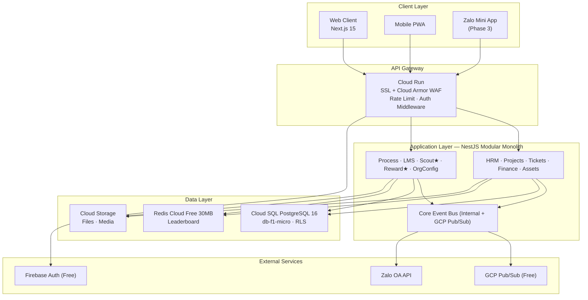


**Backend**: NestJS 10, TypeScript 5.x, Prisma 5.x, class-validator + Zod, REST + WebSocket (Socket.io gateway), Firebase Auth + CASL v6, Bull (Redis-backed queues), @nestjs/schedule, Multer + GCS, Puppeteer (PDF), ExcelJS, Jest + Supertest, Playwright

**Infrastructure (Budget-Optimized)**: Cloud SQL PostgreSQL 16 (db-f1-micro), NestJS CacheManager + Redis Cloud Free 30MB, Cloud Storage Standard, Cloud Run (min=0, max=3), Cloud Build (free 120min/day), Firebase Auth (free 10K MAU), Pub/Sub (free 10GB), Secret Manager (free 6 secrets)

### 2.3 Cấu trúc Monorepo

```text
ttndd-ops/
├── apps/
│   ├── web/                    # Next.js 15 frontend
│   │   ├── app/(auth)/         # Login, register
│   │   ├── app/(dashboard)/    # 10 module routes
│   │   ├── components/ui/      # shadcn base
│   │   ├── components/game/    # MMORPG UI
│   │   └── styles/themes/      # dong.css, thieu.css, thanh.css
│   └── api/                    # NestJS backend
│       ├── src/modules/        # 10 module directories
│       ├── src/core/           # auth, events, notifications, storage, database
│       ├── src/common/         # decorators, guards, interceptors, pipes
│       └── prisma/schema.prisma
├── packages/
│   ├── types/                  # Shared TypeScript types
│   ├── utils/                  # Shared utilities
│   ├── ui/                     # Shared UI components
│   └── constants/              # Events, EXP values, etc.
├── turbo.json
├── docker-compose.yml
└── AGENTS.md                   # AI Agent coding conventions
```

### 2.4 Kiến trúc Dữ liệu Lõi

*(Chi tiết SQL schema được đặt trong phần E — Đặc tả Kỹ thuật của từng Module PRD)*

**Bảng lõi chung** (tất cả module phụ thuộc): `organizations`, `branches`, `units`, `users`, `org_members`, `domain_events`

**Chiến lược Multi-Tenant**: Shared database, shared schema + PostgreSQL Row-Level Security. Mọi bảng có cột `org_id`. Middleware NestJS đặt `SET LOCAL app.current_org_id` trước mỗi request. RLS tự động lọc dữ liệu theo tenant.

### 2.5 Kiến trúc Event-Driven & Event Catalog

Mọi thay đổi trạng thái trong hệ thống → phát Domain Event → các module khác subscribe và xử lý. Chi tiết Event Catalog nằm trong PRD Module 9 (Reward Engine — module subscribe nhiều nhất).

**Nguyên tắc vàng**: 1 DB Transaction (atomicity) + 1 Domain Event (cross-module sync). Không module nào gọi trực tiếp service module khác.


---

---


### 2.1 Technical Stack (Full‑stack AI, GCP‑native, budget‑aware)

> **Mục tiêu**: Vì platform “AI‑Driven Code” → cần 1 tech stack **rõ ràng, chốt chuẩn**, để AI Agents/Dev không lệch pha.  
> **Nguyên tắc**: (1) GCP‑native, (2) Low‑ops, (3) Contract‑first (OpenAPI), (4) Multi‑tenant + RLS, (5) Budget guardrails ≤ 800k.

#### 2.1.1 Monorepo & Package Management
- **Monorepo**: Turborepo (task graph + caching, CI không chạy lại việc cũ).  
- **Package manager**: pnpm workspaces (`pnpm-workspace.yaml`, `workspace:` protocol).  
- **Code quality**: ESLint + Prettier + Husky pre-commit + commitlint (conventional commits).

Repo layout (chuẩn):
```
/apps
  /web        # Next.js (App Router) - MMORPG UI
  /api        # NestJS (REST + domain events + RLS context)
  /worker     # Cloud Run Jobs/Consumers (Pub/Sub, outbox)
  /gateway    # OpenAPI specs for API Gateway
/packages
  /shared     # types, DTOs, validators, utils
  /tokens     # Design Tokens (DTCG JSON) + build output
  /ui         # shared UI components (HUD, SkillTree, QuestChain)
 /contracts
  /openapi    # SSOT: API surface
  /events     # SSOT: event catalog
  /db         # migrations (SQL) + seed
  /tests      # contract tests, pact (optional)
```

#### 2.1.2 Frontend (MMORPG UI)
- **Framework**: Next.js (App Router) — layouts/pages/route handlers.
- **UI**: React + TailwindCSS + shadcn/ui (UI primitives) + Framer Motion (motion, but obey reduced‑motion).
- **State**: TanStack Query (server state), Zustand (client UI state).
- **Form validation**: Zod (shared schemas FE/BE).
- **Design tokens**: DTCG JSON → build CSS variables/Tailwind mapping (Style Dictionary).

#### 2.1.3 Backend (Core App Engine)
- **Framework**: NestJS (modular monolith) — controllers/providers/modules + DI.
- **API style**: REST (OpenAPI SSOT) + API Gateway front door.
- **DB access**: Prisma ORM + Prisma Migrate (migrations) + raw SQL ONLY when needed for RLS/policies.
- **Validation**:
  - DTO validation: Nest ValidationPipe + class-validator (DTOs).  
  - Config validation: Zod (flags/config JSON).
- **Authorization**: RBAC + ABAC (scope) + resource checks:
  - RBAC/ABAC rules: CASL Ability (role+resource attributes).
  - Tenant isolation: PostgreSQL RLS (CREATE POLICY).

#### 2.1.4 Identity & Access (Multi‑tenant)
- **Identity**: Google Cloud Identity Platform multi‑tenancy (tenant silos users/config).  
- **Auth flow** (web):
  - Client obtains ID token (Firebase/Auth compatible SDK).
  - Backend verifies ID token, maps to org_id + roles/scopes, issues **short-lived access token** + refresh cookie (HttpOnly).
  - DB layer sets `SET LOCAL app.org_id` per request for RLS enforcement.

#### 2.1.5 Event Bus & Async
- **Internal**: NestJS EventEmitter (in-process) for local domain events (dev speed).
- **Outbox**: `core.domain_events` table; publisher reads outbox and publishes once.
- **External**: Cloud Pub/Sub for async fan-out (notifications, rewards, warehouse sync).

#### 2.1.6 Storage & Files
- **Binary**: Cloud Storage (private by default).
- **Upload**: signed URLs (short TTL); store file refs in `file.object_ref`.
- **Scanning/limits**: MIME sniff (magic bytes) + max size (default 50MB) + moderation hooks.

#### 2.1.7 Observability & Security (Budget-aware)
- **Logs**: Cloud Logging with exclusions (reduce spend).
- **Metrics**: Cloud Monitoring; budget dashboards.
- **Security headers**: Helmet (CSP/HSTS/etc).
- **Rate limiting**: Cloud Armor rate limiting for API edge.
- **Secrets**: Secret Manager for API keys/secrets.
- **Artifacts**: Artifact Registry for container images & packages.
- **CI/CD**: Cloud Build → Artifact Registry → Cloud Run deploy.

#### 2.1.8 Runtime Targets (GCP)
- **Compute**: Cloud Run services (api/web/worker) + Cloud Run Jobs.
- **DB**: Cloud SQL for PostgreSQL.
- **Gateway**: API Gateway (OpenAPI + extensions).
- **Budget guardrails**:
  - Cloud Run: set **max instances** as cost-safety limit; tune concurrency.
  - Billing Budgets: 50/80/100/120 alerts + Pub/Sub notifications + auto actions.

---

### 2.2 AI‑Driven Delivery Operating Model (Luân phiên vai trò team Product chuẩn)

> **Mục tiêu**: AI Agents/Dev làm việc như “một team product tiêu chuẩn” nhưng chạy theo **contract‑first** và **SSOT** để không lệch pha.

#### 2.2.1 Team roles (rotation)
- **Role A — Product Manager (PM/BA)**: PRD, user stories, acceptance criteria, scope P0/P1.
- **Role B — UX/UI Game Designer**: screen map, wireframe text, component mapping, tokens usage.
- **Role C — System Architect**: bounded context, event catalog, ADR decisions, budget/safety invariants.
- **Role D — Backend Engineer**: OpenAPI, controllers/services, Prisma schema/migrations, RLS, outbox, tests.
- **Role E — Frontend Engineer**: route implementation, HUD components, data fetching, forms, a11y.
- **Role F — QA/Release Engineer**: test plan (unit/integration/contract/e2e), regression, release notes.
- **Role G — SRE/Security**: Cloud Run configs, budgets, log exclusions, secrets, rate limiting, runbooks.

> **Luân phiên**: mỗi Work Package phải “đi qua” A→G (nhanh hay chậm tuỳ P0/P1), nhưng không được bỏ qua “contract gates”.

#### 2.2.2 SSOT artifacts (8) — “đụng đâu update đó”
1) PRD/Workflow (Product View)  
2) UI Contract (Screen Map + Component mapping + Tokens)  
3) OpenAPI Contract (`/contracts/openapi/*.yaml`)  
4) Event Catalog (`/contracts/events/catalog.json`)  
5) DB Schema/Migrations (`/contracts/db/migrations/*`)  
6) Tests (unit/integration/contract/e2e)  
7) Roadmap row IDs (Work Package table)  
8) **ADR/Tech Stack Decisions** (version pinning + rationale)

#### 2.2.3 Work Package execution recipe (AI‑friendly)
**Input**: WP scope + constraints (budget 800k + child safety P0 + SPICES).  
**Output**: mergeable PR with SSOT updates + passing gates.

Step-by-step:
1) **PM/BA**: cập nhật PRD (what/why), define ACs + non-goals.
2) **UX**: cập nhật screen map + component mapping + cost impact tags.
3) **Architect**: cập nhật ADR (tech choice), event catalog, data boundaries.
4) **BE**: update OpenAPI → generate stubs → implement handlers → migrations + RLS.
5) **FE**: implement routes/components; connect API; add a11y + reduced motion.
6) **QA**: add tests; run e2e smoke; ensure no table/token drift.
7) **SRE/Sec**: update IaC/runbook; budget thresholds; log exclusions; Cloud Armor rules.

#### 2.2.4 CI Sync Gates (không pass → không merge)
- OpenAPI validate + diff check (breaking changes blocked).
- Event schema compatibility check.
- Migration smoke test against local Postgres (RLS on).
- Contract tests (optional Pact).
- E2E smoke (Playwright): login → open world map → complete 1 action.

#### 2.2.5 “Prompt pack” cho AI Agents (gợi ý)
- **PM prompt**: “từ PRD hiện có, viết user stories + ACs cho WP‑x, đảm bảo safety P0 + SPICES tags”.  
- **UX prompt**: “vẽ wireframe text + component mapping + routes; xác định cost impact tags”.  
- **BE prompt**: “tạo/đổi OpenAPI, update event catalog, migrations + RLS + tests”.  
- **FE prompt**: “implement screen theo tokens; obey reduced-motion; integrate API; add empty/loading/error states”.  

---

### 2.3 ADR/Tech Stack Decisions Registry (SSOT)
- `ADR-TS-01`: Monorepo (Turborepo + pnpm)  
- `ADR-TS-02`: FE Next.js App Router + Tailwind + Tokens  
- `ADR-TS-03`: BE NestJS + Prisma + PostgreSQL RLS  
- `ADR-TS-04`: Identity Platform multi‑tenancy + custom session tokens  
- `ADR-TS-05`: API Gateway OpenAPI as SSOT  
- `ADR-TS-06`: Outbox + Pub/Sub for async  
- `ADR-TS-07`: Cloud Build + Artifact Registry + Cloud Run CI/CD  
- `ADR-TS-08`: Budget guardrails & low-cost mode (max instances, log exclusions)

> Mỗi ADR có: Context → Decision → Alternatives → Consequences → Rollout plan.


## PHẦN II-B — KIẾN TRÚC KỸ THUẬT CHI TIẾT (Developer & Product Team Reference)

> **Phần này dành cho Developer Team và Product Team** — mô tả chi tiết kiến trúc kỹ thuật, data architecture, integration patterns, và system diagrams ở cấp độ implementation.

### 2B.1 Core App Engine — Tổng quan Kỹ thuật

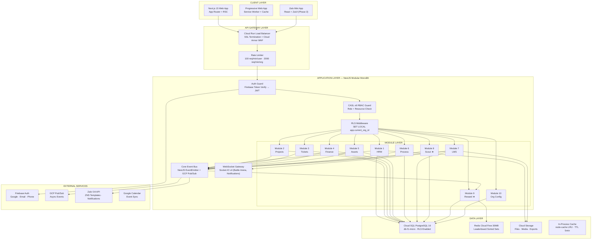

### 2B.2 Request Processing Pipeline

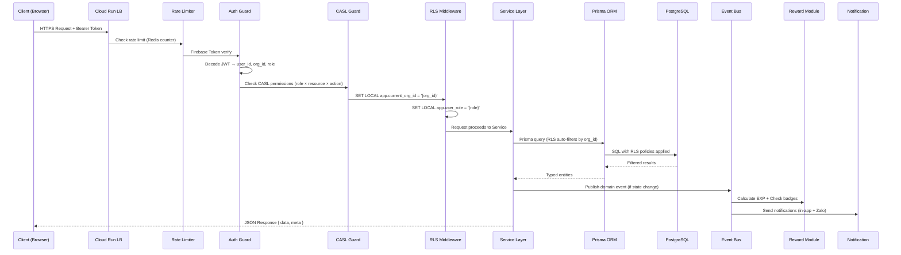

### 2B.3 Data Architecture — Tổng thể

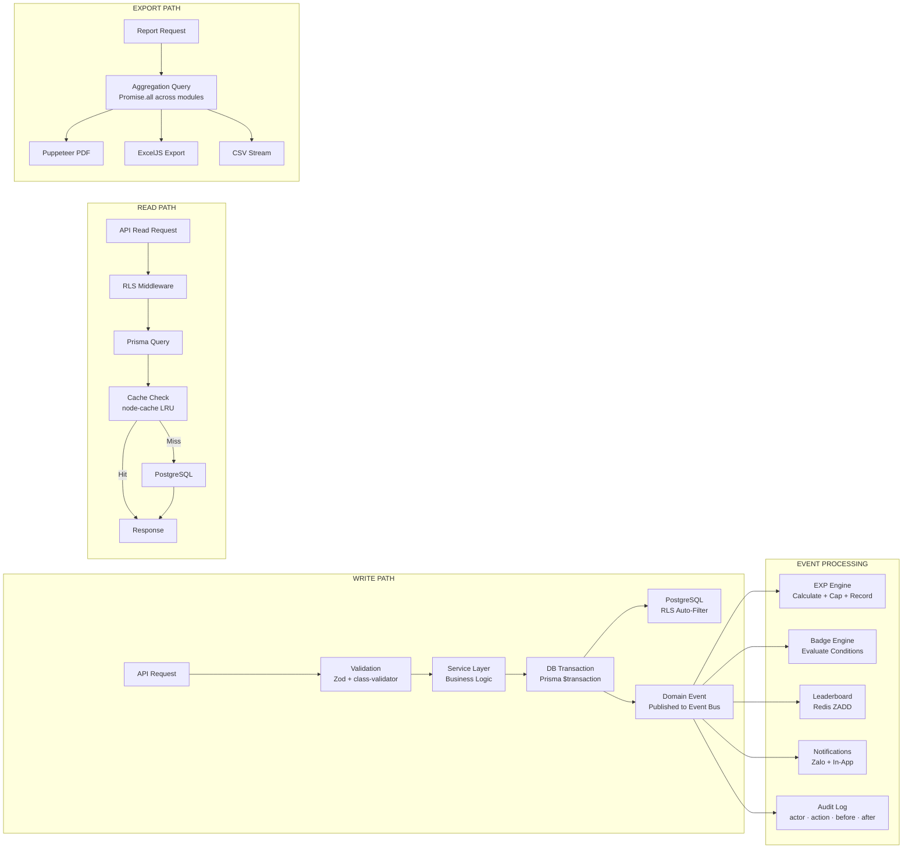

### 2B.4 Data Model — Entity Relationship Overview

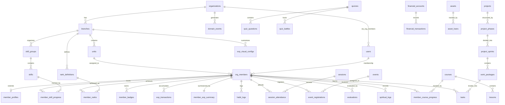

### 2B.5 Integration Architecture

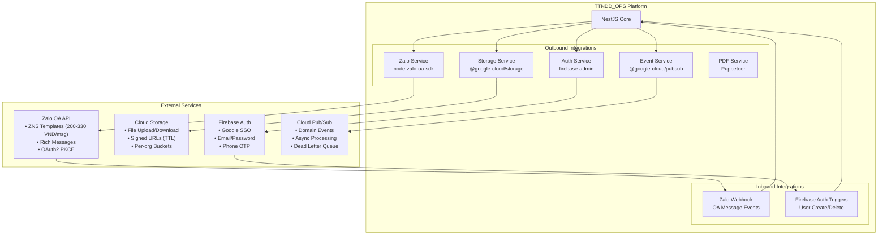

### 2B.6 Event-Driven Architecture — Toàn bộ Event Flow

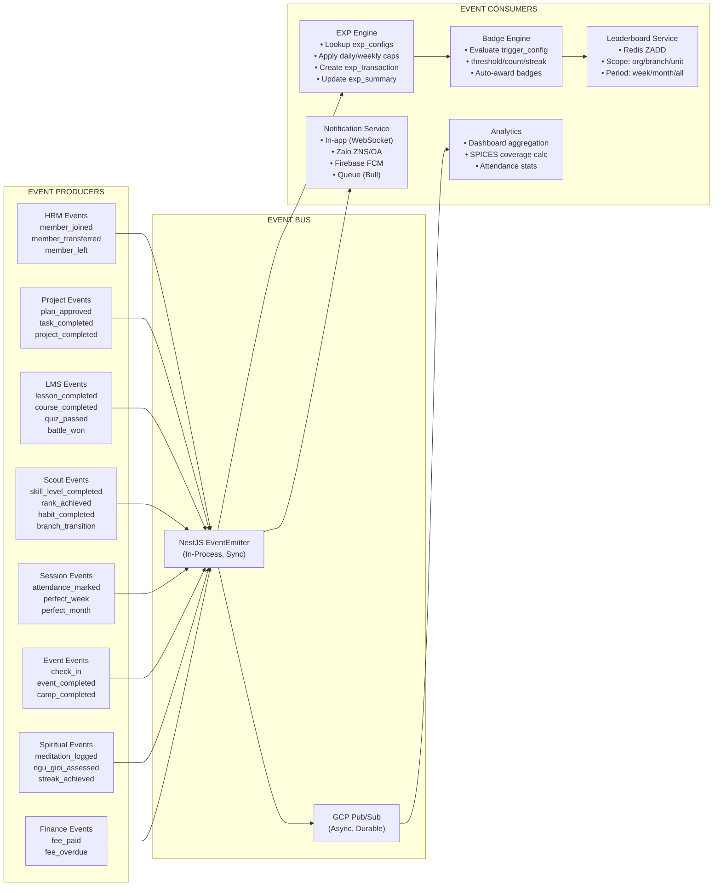

### 2B.7 Identity & Access Control — Chi tiết

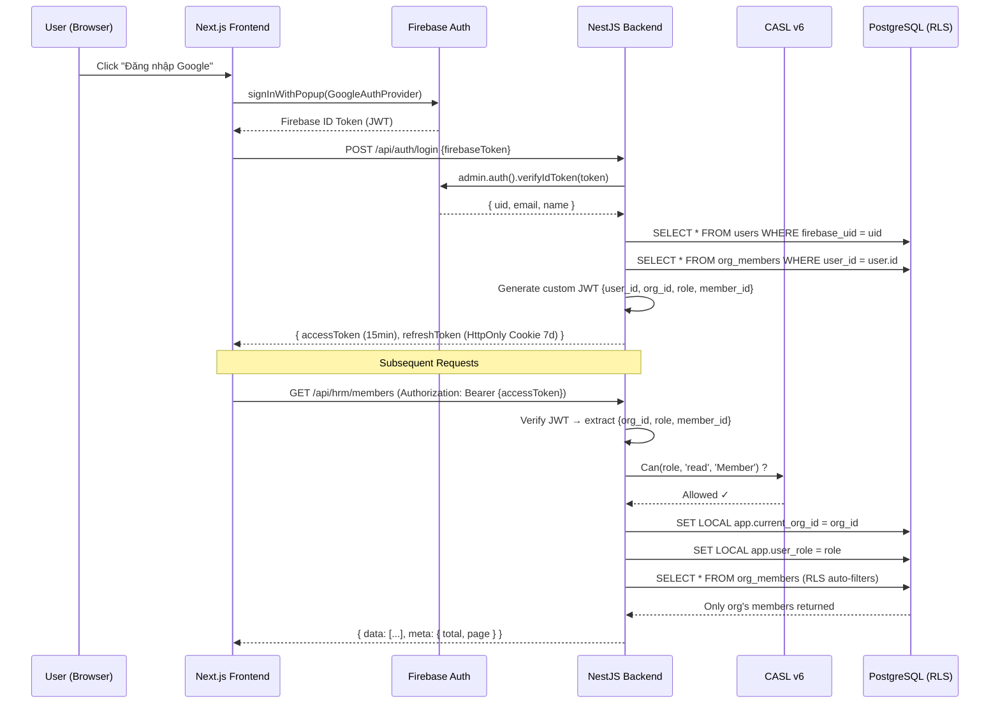

### 2B.8 File Storage Architecture

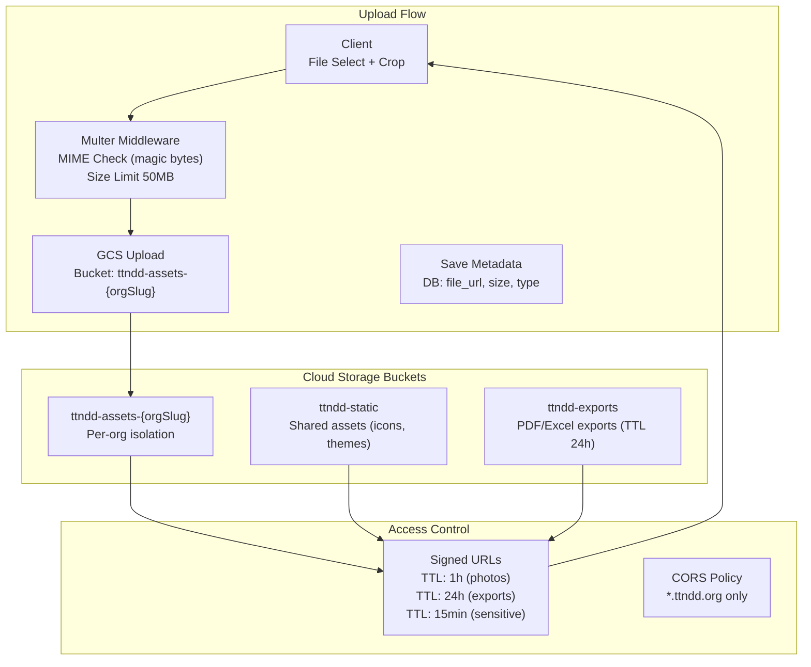

### 2B.9 Frontend Architecture — Component Hierarchy

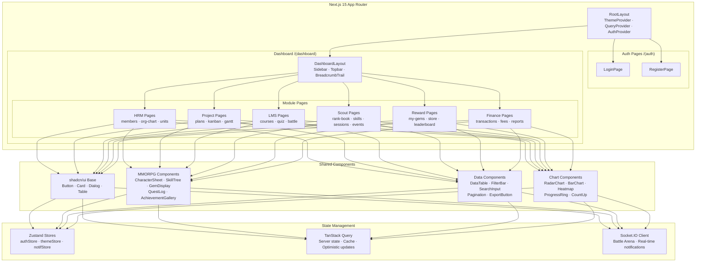

### 2B.10 Backend Module Architecture — NestJS Pattern

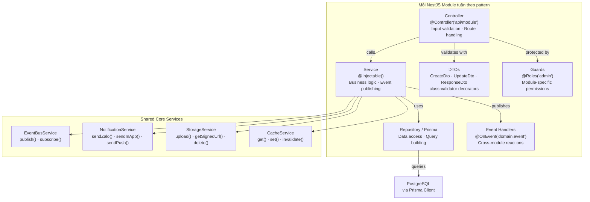

### 2B.11 Data Sync & Logic — Cross-Module Data Flow

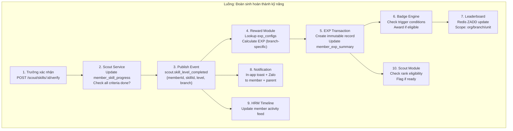

### 2B.12 API Gateway — Middleware Chain

```text
Request Flow (mọi API call đều đi qua):

  ┌──────────────────────────────────────────────────────┐
  │ 1. Helmet.js         (HTTP Security Headers)         │
  │ 2. CORS Guard        (Whitelist *.ttndd.org)         │
  │ 3. Rate Limiter      (Redis counter per user/org/IP) │
  │ 4. Body Parser       (JSON, max 10MB)                │
  │ 5. Firebase Auth     (verifyIdToken → decode JWT)    │
  │ 6. User Resolver     (JWT → user + org_member)       │
  │ 7. CASL Guard        (role × resource × action)      │
  │ 8. RLS Middleware     (SET LOCAL app.current_org_id)  │
  │ 9. Validation Pipe   (class-validator + Zod)         │
  │ 10. Controller       (Route handler)                 │
  │ 11. Service           (Business logic)               │
  │ 12. Event Publisher   (Domain event if state change) │
  │ 13. Response Interceptor (format { data, meta })     │
  │ 14. Exception Filter  (Consistent error format)      │
  └──────────────────────────────────────────────────────┘

Response Format (chuẩn hóa):
  Success: { data: T | T[], meta?: { total, page, limit } }
  Error:   { error: { code, message, details, request_id, timestamp } }
```

### 2B.13 Database Architecture — Index Strategy & Partitioning

```text
INDEX STRATEGY (Performance-Critical):

  -- Mọi bảng: org_id (RLS filter)
  CREATE INDEX idx_{table}_org ON {table}(org_id);

  -- Lookup thường xuyên
  CREATE INDEX idx_org_members_user ON org_members(org_id, user_id);
  CREATE INDEX idx_org_members_branch ON org_members(org_id, branch_id, status);
  CREATE INDEX idx_exp_transactions_member ON exp_transactions(org_id, org_member_id, created_at DESC);
  CREATE INDEX idx_domain_events_type ON domain_events(org_id, event_type, processed);
  CREATE INDEX idx_session_attendance_session ON session_attendance(session_id, org_member_id);
  CREATE INDEX idx_member_skill_progress_member ON member_skill_progress(org_member_id, skill_id);

  -- Full-text search
  CREATE INDEX idx_member_profiles_search ON member_profiles
    USING GIN(to_tsvector('simple', full_name || ' ' || COALESCE(scout_name, '')));

CONNECTION POOLING:
  - Prisma connection limit: 5 (db-f1-micro max 25)
  - Pool timeout: 10s
  - Query timeout: 15s

BACKUP STRATEGY:
  - Daily automated backup (Cloud SQL built-in)
  - 7-day retention
  - Point-in-time recovery enabled
```

## C.5 Module Technical Specs (per module)

#### E. ĐẶC TẢ KỸ THUẬT — MODULE 1: HRM

##### E.1 Module Architecture

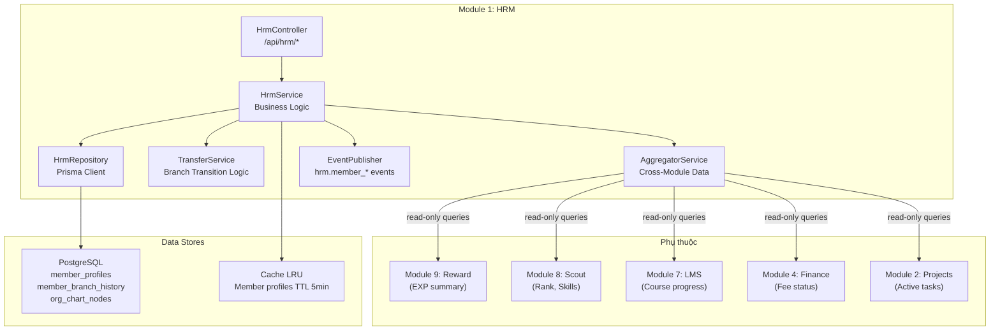

##### E.2 Data Model — HRM

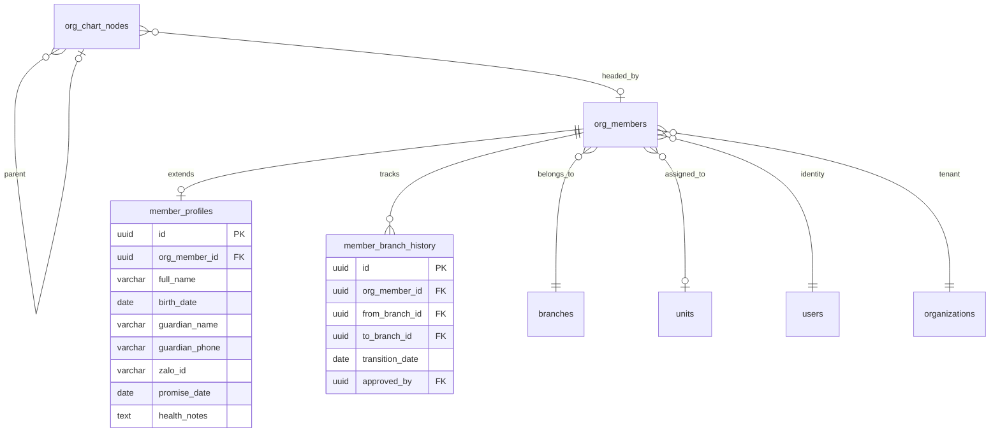

##### E.3 Data Flow — HRM

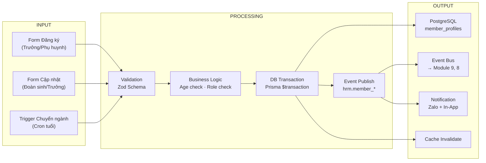

##### E.4 Data Processing Flow — Chuyển Ngành

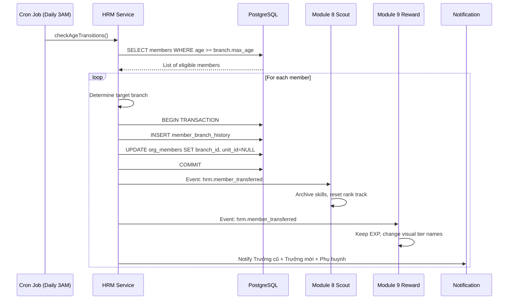

##### E.5 Connection Flow — HRM ↔ Other Modules

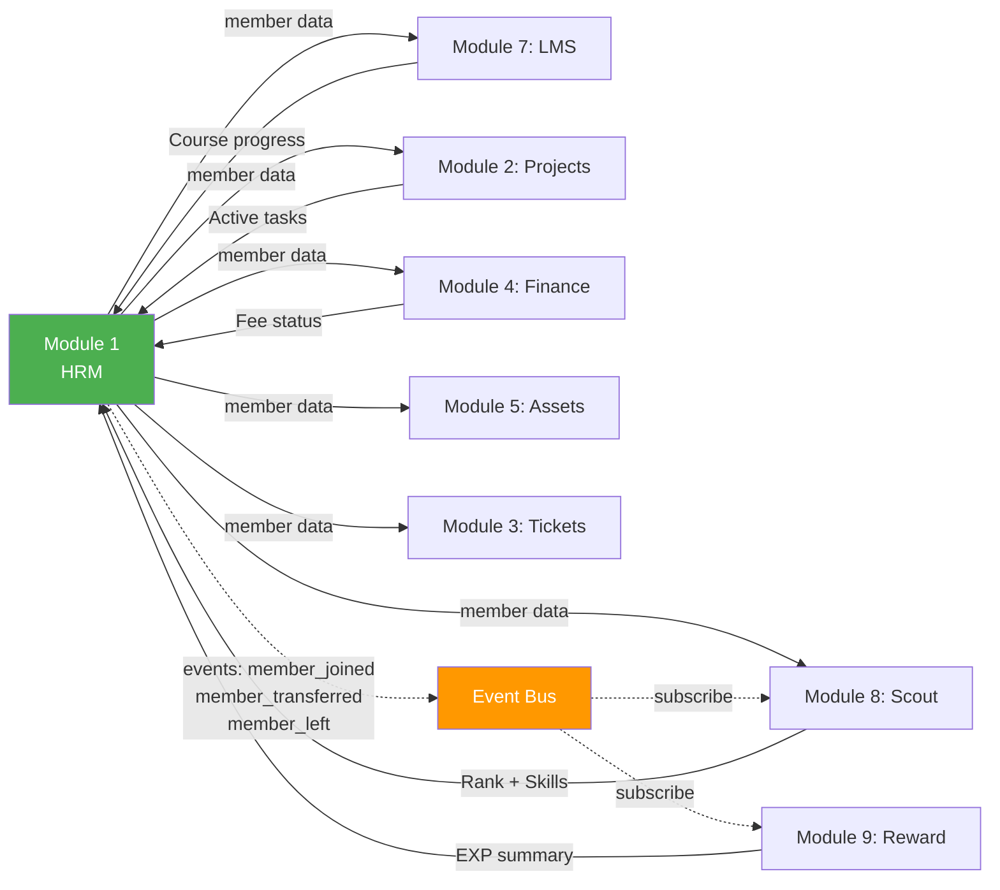

##### E.6 API Specification

```yaml
Endpoints:
  POST   /api/hrm/members:
    Body: CreateMemberDto {full_name, birth_date, gender, branch_id, guardian_*}
    Auth: admin+
    Response: {data: Member, meta: null}
    Events: hrm.member_joined

  GET    /api/hrm/members:
    Query: {branch_id?, unit_id?, status?, search?, page, limit}
    Auth: admin+ (all), user (self only), guest (linked only)
    Response: {data: Member[], meta: {total, page, limit}}

  GET    /api/hrm/members/:id:
    Auth: admin+ (any), user (self), guest (linked)
    Response: {data: MemberDetail} (cross-module aggregation)

  PUT    /api/hrm/members/:id:
    Auth: admin+ (all fields), user (personal fields only)
    Events: audit_log

  POST   /api/hrm/members/:id/transfer:
    Body: {to_branch_id, to_unit_id?, reason}
    Auth: super_admin only
    Events: hrm.member_transferred
    Side Effects: Scout skill archive, Reward visual change

  GET    /api/hrm/org-chart:
    Auth: all roles
    Response: {data: OrgChartNode[]} (tree structure)

  GET    /api/hrm/members/:id/timeline:
    Auth: admin+ (any), user (self)
    Response: {data: TimelineEvent[]} (cross-module aggregation)
    Sources: HRM + Scout + LMS + Projects + Finance + Reward events

  GET    /api/hrm/stats:
    Auth: admin+
    Response: {total_members, by_branch, by_status, by_gender, attendance_rate}
```

##### E.7 Services & Components

```yaml
Services:
  HrmService:
    - createMember(dto): Validate age → assign branch → create profile → publish event
    - updateMember(id, dto): Validate permissions → update → audit log → cache invalidate
    - transferMember(id, dto): Transaction {history + update branch + event} → notify
    - getMemberDetail(id): Aggregate from 6 modules via Promise.all
    - softDelete(id): Set status='left' → schedule hard delete 90 days

  TransferService:
    - checkAgeTransitions(): Cron daily → find eligible → batch transfer
    - executeTransfer(memberId, toBranch): Transaction + events + notifications

  AggregatorService:
    - aggregateMemberDetail(memberId): Query Scout + Reward + LMS + Projects + Finance
    - buildTimeline(memberId): Merge events from domain_events table

  OrgChartService:
    - getTree(orgId): Recursive query org_chart_nodes
    - updateNode(nodeId, dto): Update position/title + audit log

Components (Frontend):
  MemberListPage: DataTable + FilterBar + SearchInput + ExportButton
  MemberDetailPage: ProfileCard + CrossModuleSummary + Timeline + RadarChart
  OrgChartPage: ReactFlow interactive tree + drag-drop reorder
  TransferDialog: Branch selector + confirmation + reason input
  ParentPortal: Dashboard cards (attendance, EXP, rank, fees)
```

##### E.8 Event-Driven Architecture — HRM

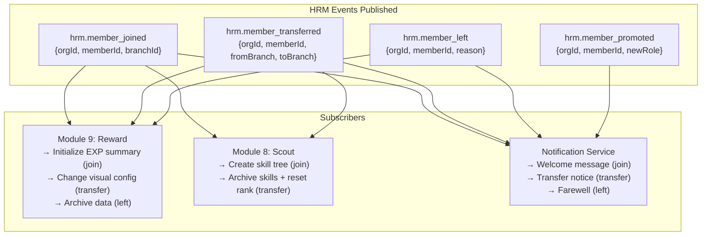

-e 
---

---

#### E. ĐẶC TẢ KỸ THUẬT — MODULE 2: PROJECT MANAGEMENT

##### E.1 Module Architecture

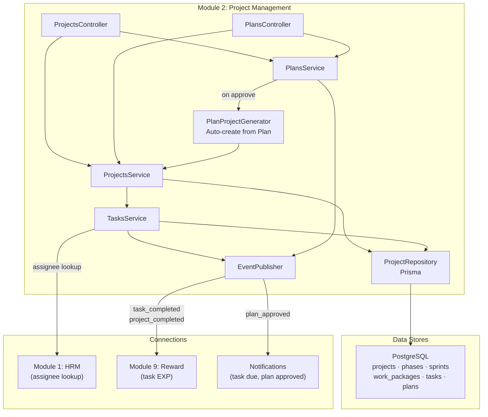

##### E.2 Data Flow — Plan → Project Auto-Generation

```mermaid
sequenceDiagram
    participant TR as Trưởng Ngành
    participant PL as PlansService
    participant LDT as LĐT (Approver)
    participant GEN as PlanProjectGenerator
    participant PM as ProjectsService
    participant DB as PostgreSQL
    participant EB as Event Bus

    TR->>PL: POST /api/projects/plans {9 sections}
    PL->>DB: INSERT plans (status=draft)
    TR->>PL: POST /api/projects/plans/:id/submit
    PL->>DB: UPDATE status=submitted
    PL->>EB: Notify LĐT via Zalo

    LDT->>PL: POST /api/projects/plans/:id/approve
    PL->>DB: UPDATE status=approved
    PL->>GEN: generateProjectFromPlan(planId)

    GEN->>DB: INSERT project
    loop For each Objective (Phần II)
        GEN->>DB: INSERT phase
        loop For each Outcome (Phần III)
            GEN->>DB: INSERT sprint
            loop For each Activity (Phần IV)
                GEN->>DB: INSERT work_package
                loop For each Content (Phần VI)
                    GEN->>DB: INSERT task (assignee from Phần V)
                end
            end
        end
    end
    GEN->>EB: projects.plan_approved
    EB->>EB: Notify all assignees
```

##### E.3 Logic Flow — Task Lifecycle

```mermaid
stateDiagram-v2
    [*] --> todo : Task created
    todo --> in_progress : Assignee starts
    todo --> blocked : Dependency unmet
    in_progress --> review : Submit for review
    in_progress --> blocked : Blocked by other task
    blocked --> todo : Unblocked
    review --> done : Trưởng approves
    review --> in_progress : Revisions needed
    done --> [*]

    done --> EventBus : projects.task_completed
    note right of EventBus
        → Module 9: +EXP for assignee
        → Module 1: Update member timeline
    end note
```

##### E.4 Data Model — Projects

```mermaid
erDiagram
    plans ||--o| projects : generates
    projects ||--o{ project_phases : contains
    project_phases ||--o{ project_sprints : divided_into
    project_sprints ||--o{ work_packages : contains
    work_packages ||--o{ tasks : breaks_into
    tasks }o--o| tasks : parent_subtask
    tasks }o--o{ org_members : assigned_to

    plans {
        uuid id PK
        varchar title
        varchar status "draft|submitted|approved|rejected"
        jsonb section_II_objectives
        jsonb section_IX_budget
        uuid approved_by FK
    }

    projects {
        uuid id PK
        varchar status "planning|active|on_hold|completed|cancelled"
        jsonb objectives
        uuid source_plan_id FK
    }

    tasks {
        uuid id PK
        varchar status "todo|in_progress|review|blocked|done"
        varchar priority "low|medium|high|critical"
        uuid work_package_id FK
        uuid parent_task_id FK
    }
```

##### E.5 API, Services & Components

```yaml
API Endpoints:
  Plans: POST|GET /api/projects/plans, POST /:id/submit, POST /:id/approve, POST /:id/reject
  Projects: POST|GET /api/projects, GET /:id, PUT /:id
  Tasks: POST|GET /api/projects/:projectId/tasks, PUT /tasks/:id, PATCH /tasks/:id/status
  Views: GET /api/projects/:id/kanban, GET /:id/gantt, GET /:id/okr

Services:
  PlansService: CRUD + submit + approve/reject + version tracking
  PlanProjectGenerator: Parse 9 sections → create hierarchy atomically
  ProjectsService: CRUD + status transitions + progress calculation
  TasksService: CRUD + assignee management + status machine + due date cron
  GanttService: Calculate dependencies, critical path, timeline data
  OkrService: Aggregate key results progress from tasks

Components (Frontend):
  PlanBuilderPage: 9-section form (TipTap rich editor) + auto-save
  KanbanBoard: @dnd-kit drag-drop + swimlanes by Sprint
  GanttChart: react-gantt-chart + milestone markers
  BacklogTable: TanStack Table + custom columns + inline edit
  TaskDetailDrawer: Slide-over panel + comments + attachments
```

-e 
---

---

#### E. ĐẶC TẢ KỸ THUẬT — MODULE 3: TICKET & APPROVAL

##### E.1 Module Architecture & Data Flow

```mermaid
graph TB
    subgraph "Module 3: Tickets"
        CTRL["TicketsController"]
        SVC["TicketsService"]
        SM["StateMachine<br/>open→assigned→in_review<br/>→approved/rejected→closed"]
        CMT["CommentsService"]
        REPO["TicketRepository"]
    end

    subgraph "Logic Flow"
        CREATE["Tạo Ticket"] --> ROUTE["Auto-Route<br/>by category"]
        ROUTE --> ASSIGN["Gán Trưởng"]
        ASSIGN --> REVIEW["Xem xét"]
        REVIEW --> APPROVE["Approve"] & REJECT["Reject"]
        APPROVE --> CLOSE["Close + Notify"]
        REJECT --> REOPEN["Reopen / Feedback"]
    end

    subgraph "Connections"
        M1["Module 1: HRM<br/>(requester/assignee info)"]
        NTF["Notifications<br/>(Zalo + In-App)"]
        AUDIT["Audit: ticket_status_history"]
    end

    CTRL --> SVC --> SM --> REPO
    SVC --> CMT
    SM -->|"every transition"| AUDIT
    SM -->|"every transition"| NTF
    SVC -->|"lookup members"| M1
```

##### E.2 Data Model

```mermaid
erDiagram
    tickets ||--o{ ticket_comments : has
    tickets ||--o{ ticket_status_history : tracks
    tickets }o--|| org_members : requester
    tickets }o--o| org_members : assignee

    tickets {
        uuid id PK
        varchar ticket_number "TKT-2026-001"
        varchar status "open|assigned|in_review|approved|rejected|closed"
        varchar priority "low|medium|high|critical"
        varchar category "request|approval|report|complaint"
    }
```

##### E.3 API & Services

```yaml
API: POST|GET /api/tickets, GET|PUT /:id, POST /:id/comments, POST /:id/approve, POST /:id/reject, PATCH /:id/assign
Services: TicketsService (CRUD + state machine), CommentsService (thread + internal notes), AutoRouterService (category → assignee mapping)
Components: TicketListPage (Kanban + Table view), TicketDetailPage (timeline + comment thread), CreateTicketDialog (form + file upload)
Events Published: None (internal module — does not trigger EXP)
Events Consumed: None
```

---

#### E. ĐẶC TẢ KỸ THUẬT — MODULE 4: FINANCIAL MANAGEMENT

##### E.1 Module Architecture & Data Flow

```mermaid
graph TB
    subgraph "Module 4: Finance"
        CTRL["FinanceController"]
        SVC_TXN["TransactionService"]
        SVC_FEE["MemberFeeService"]
        SVC_RPT["ReportService"]
        SVC_SPO["SponsorService"]
        REPO["FinanceRepository"]
    end

    subgraph "Data Processing Flow"
        INPUT["Ghi nhận Thu/Chi"] --> VAL["Validate + Receipt"]
        VAL --> APPROVE["Trưởng/LĐT Duyệt"]
        APPROVE --> PROCESS["Update Balance<br/>DB Transaction"]
        PROCESS --> LEDGER["Immutable Ledger Entry"]
        PROCESS --> REPORT["Dashboard Update"]
    end

    subgraph "Fee Auto-Collection"
        CRON["Cron Monthly"] --> CREATE["Create fee records<br/>for all members"]
        CREATE --> TRACK["Track payment status"]
        TRACK --> OVERDUE["Overdue detection"]
        OVERDUE --> ZALO["Zalo notify parents"]
    end

    CTRL --> SVC_TXN & SVC_FEE & SVC_RPT & SVC_SPO --> REPO
    SVC_TXN -->|"fee_paid<br/>fee_overdue"| EB["Event Bus"]
    SVC_RPT -->|"PDF export"| PDF["Puppeteer"]
```

##### E.2 Data Model

```mermaid
erDiagram
    financial_accounts ||--o{ financial_transactions : records
    financial_accounts }o--o| branches : per_branch
    org_members ||--o{ member_fees : owes
    member_fees }o--o| financial_transactions : paid_via
    sponsors ||--o{ financial_transactions : donates
    organizations ||--o{ material_contributions : receives

    financial_transactions {
        uuid id PK
        varchar transaction_type "income|expense|transfer"
        decimal amount
        varchar status "pending|approved|rejected|completed|reversed"
        date transaction_date
    }

    member_fees {
        uuid id PK
        varchar fee_type "nguyet_liem|trai_phi|dong_phuc"
        varchar status "unpaid|partial|paid|overdue|waived"
        decimal amount_due
        decimal amount_paid
    }
```

##### E.3 API & Services

```yaml
API: 
  Accounts: GET /api/finance/accounts
  Transactions: POST|GET /api/finance/transactions, POST /:id/approve, POST /:id/reverse
  Fees: GET /api/finance/fees, POST /api/finance/fees/batch-create, PUT /:id/pay
  Sponsors: POST|GET /api/finance/sponsors
  Reports: GET /api/finance/reports/summary, GET /reports/pdf
Services: TransactionService, MemberFeeService (+ cron overdue), ReportService (PDF + Excel), SponsorService
Events: finance.fee_paid → Module 1 HRM (update fee status), finance.fee_overdue → Notification (Zalo parents)
```

---

#### E. ĐẶC TẢ KỸ THUẬT — MODULE 5: ASSETS MANAGEMENT

##### E.1 Data Flow & Logic

```mermaid
sequenceDiagram
    participant DS as Đoàn sinh/Trưởng
    participant API as Assets API
    participant DB as PostgreSQL
    participant QR as QR Generator

    DS->>API: POST /api/assets (create)
    API->>DB: INSERT asset
    API->>QR: Generate QR Code (asset_code)
    QR-->>API: QR image URL
    API->>DB: UPDATE asset.qr_url

    DS->>API: POST /api/assets/:id/loan/request
    API->>DB: INSERT asset_loan (status=pending)
    API->>API: Notify Quản cụ

    Note over API: Quản cụ approves
    API->>DB: UPDATE asset_loan status=checked_out
    API->>DB: UPDATE asset.available_qty -= loan.quantity

    Note over API: Return flow
    DS->>API: POST /api/assets/loans/:id/return
    API->>DB: UPDATE loan (actual_return, condition)
    API->>DB: UPDATE asset.available_qty += quantity
```

##### E.2 Data Model

```mermaid
erDiagram
    asset_categories ||--o{ assets : categorizes
    assets ||--o{ asset_loans : tracked_by
    asset_loans }o--|| org_members : borrower
    assets }o--o| org_members : managed_by

    assets {
        uuid id PK
        varchar asset_code UK "LT-001"
        varchar status "available|borrowed|maintenance|damaged|disposed"
        varchar condition "excellent|good|fair|poor"
        integer quantity
        integer available_qty
    }
```

```yaml
API: POST|GET /api/assets, GET /:id, POST /:id/loan/request, POST /loans/:id/approve, POST /loans/:id/return
QR Code: Generated per asset via qrcode npm package → stored in GCS
Events: None (internal) — asset loan does not trigger EXP
```

---

#### E. ĐẶC TẢ KỸ THUẬT — MODULE 6: PROCESS MANAGEMENT

##### E.1 Architecture & Workflow Engine

```mermaid
graph TB
    subgraph "Module 6: Process"
        SOP["SOP Library<br/>Rich Text + Versioning"]
        WFB["Workflow Builder<br/>React Flow + JSON"]
        WFE["Workflow Executor<br/>Event-triggered runner"]
    end

    subgraph "Workflow Node Types"
        TRIG["Trigger Nodes<br/>event | schedule | manual"]
        COND["Condition Nodes<br/>if/else (field compare)"]
        ACT["Action Nodes<br/>notify | create_task | update_status<br/>assign_exp | send_zalo | create_ticket"]
        DELAY["Delay Nodes<br/>wait N hours/days"]
    end

    subgraph "Storage"
        DB["PostgreSQL<br/>workflow_definitions (JSONB)<br/>sop_documents (versioned)"]
    end

    WFB -->|"save as JSON"| DB
    TRIG -->|"domain event fires"| WFE
    WFE -->|"read definition"| DB
    WFE --> COND --> ACT & DELAY
    SOP --> DB
```

```yaml
API: POST|GET /api/processes/workflows, POST /workflows/:id/execute
     POST|GET /api/processes/sop, GET /sop/:id/versions
Services: WorkflowBuilderService (CRUD JSON), WorkflowExecutorService (event-triggered), SopService (CRUD + versioning)
Components: WorkflowBuilderPage (React Flow node editor), SopLibraryPage (searchable + categorized), DocumentPage (rich text viewer)
```

-e 
---


---

---

#### E. ĐẶC TẢ KỸ THUẬT — MODULE 7: LMS

##### E.1 Module Architecture

```mermaid
graph TB
    subgraph "Module 7: LMS"
        CTRL_C["CoursesController"]
        CTRL_Q["QuizzesController"]
        CTRL_B["BattleController<br/>(WebSocket Gateway)"]
        SVC_C["CoursesService"]
        SVC_L["LessonsService"]
        SVC_Q["QuizService"]
        SVC_BA["BattleArenaService<br/>Socket.IO rooms"]
        SVC_PRG["ProgressService"]
        SVC_ASG["AssignmentService"]
    end

    subgraph "Real-time Layer"
        WS["WebSocket Gateway<br/>Socket.IO v4"]
        ROOMS["Game Rooms<br/>Max 30 players/room"]
        TIMER["Question Timer<br/>Server-side countdown"]
    end

    subgraph "Data Stores"
        PG["PostgreSQL<br/>courses · lessons · quizzes<br/>quiz_questions · quiz_battles<br/>member_course_progress"]
        REDIS["Redis (Cache)<br/>Battle state · Scores"]
    end

    CTRL_C --> SVC_C --> SVC_L
    CTRL_Q --> SVC_Q
    CTRL_B --> WS --> SVC_BA --> ROOMS & TIMER
    SVC_C & SVC_Q --> PG
    SVC_BA --> REDIS
    SVC_PRG -->|"track completion"| PG
    SVC_Q -->|"quiz_passed"| EB["Event Bus → Module 9"]
    SVC_BA -->|"battle_won"| EB
```

##### E.2 Data Processing Flow — Battle Arena

```mermaid
sequenceDiagram
    participant HOST as Trưởng (Host)
    participant SVC as BattleArenaService
    participant WS as WebSocket Gateway
    participant P1 as Player 1
    participant P2 as Player 2
    participant REDIS as Redis
    participant DB as PostgreSQL

    HOST->>SVC: POST /api/lms/battles/create {quizId}
    SVC->>DB: INSERT quiz_battles (game_code=ABC123)
    SVC-->>HOST: {gameCode: "ABC123"}

    P1->>WS: join_battle("ABC123")
    WS->>REDIS: Add player to room
    WS-->>P1: player_joined(playerList)
    P2->>WS: join_battle("ABC123")
    WS->>REDIS: Add player to room
    WS-->>P1: player_joined(playerList)
    WS-->>P2: player_joined(playerList)

    HOST->>WS: start_game
    WS->>WS: game_starting(countdown: 3)

    loop For each question
        WS->>P1: question_show(question, timeLimit)
        WS->>P2: question_show(question, timeLimit)
        P1->>WS: submit_answer(answerId, timeMs)
        WS->>REDIS: Calculate score = base × (1 + timeBonus)
        WS-->>P1: answer_result(correct, points)
        Note over WS: Wait for timeout
        WS->>P1: time_up(correctAnswer, leaderboard)
        WS->>P2: time_up(correctAnswer, leaderboard)
    end

    WS->>P1: game_over(finalRankings)
    WS->>P2: game_over(finalRankings)
    SVC->>DB: UPDATE quiz_battles SET results, status=finished
    SVC-->>WS: Publish lms.battle_won (winner) + lms.quiz_passed (all passed)
```

##### E.3 Connection Flow — LMS

```mermaid
graph LR
    LMS["Module 7<br/>LMS"]

    LMS -->|"course completion<br/>quiz passed<br/>battle won"| EB["Event Bus"]
    EB -->|"EXP + Badge"| M9["Module 9: Reward"]

    M8["Module 8: Scout"] -->|"skill linked to course"| LMS
    M1["Module 1: HRM"] -->|"member info<br/>branch filter"| LMS

    LMS -->|"progress data"| M1
    LMS -->|"skill unlock trigger"| M8

    style LMS fill:#2196F3,color:#fff
    style EB fill:#FF9800,color:#fff
```

##### E.4 API, Services & Components

```yaml
API:
  Courses: POST|GET /api/lms/courses, GET /:id, POST /:id/enroll
  Lessons: GET /api/lms/courses/:courseId/lessons/:id, POST /:id/complete
  Quizzes: GET /api/lms/quizzes/:id, POST /:id/attempt, GET /:id/results
  Battles: POST /api/lms/battles/create, POST /battles/:code/join (WebSocket upgrade)
  Assignments: POST /api/lms/assignments, GET /api/lms/assignments/my
  Progress: GET /api/lms/progress/my, GET /progress/:memberId (admin)

Services:
  CoursesService: CRUD + enrollment + branch-based filtering
  LessonsService: Content CRUD (JSONB structured) + media upload (GCS)
  QuizService: Question CRUD + attempt recording + auto-grading + retry logic
  BattleArenaService: Room management + real-time scoring + WebSocket events
  ProgressService: Track per-member completion + streak calculation
  AssignmentService: Assign courses/quizzes to members or branches

WebSocket Events (Battle Arena):
  Client→Server: join_battle, submit_answer, leave_game
  Server→Client: player_joined, player_left, game_starting, question_show, answer_result, time_up, game_over

Components:
  CourseListPage: Card grid + category/difficulty filter
  LessonViewPage: Scroll-based content (Hook→Main→Practice→Summary)
  QuizPage: Question cards + timer ring (Framer Motion) + instant feedback
  BattleArenaLobby: Game code input + player avatars
  BattleArenaGame: Full-screen 2×2 answer grid (Kahoot style) + scoreboard
```

-e 
---

---

#### E. ĐẶC TẢ KỸ THUẬT — MODULE 8: SCOUT MANAGEMENT (MEGA MODULE)

##### E.1 Module Architecture — Tổng thể 5 Sub-Modules

```mermaid
graph TB
    subgraph "Module 8: Scout Management — MEGA MODULE"
        direction TB

        subgraph "8A: Đẳng thứ & Kỹ năng"
            CTRL_R["RanksController"]
            CTRL_S["SkillsController"]
            SVC_R["RankService"]
            SVC_S["SkillProgressService"]
            SVC_SP["SpecialtyBadgeService"]
            SVC_H["HabitService"]
        end

        subgraph "8B: Sessions & Attendance"
            CTRL_SS["SessionsController"]
            SVC_SS["SessionsService"]
            SVC_AT["AttendanceService"]
            SVC_AP["AnnualProgramService"]
        end

        subgraph "8C: Events & Camps"
            CTRL_EV["EventsController"]
            SVC_EV["EventsService"]
            SVC_REG["RegistrationService"]
            SVC_RISK["RiskAssessmentService"]
            SVC_CON["ConsentService"]
        end

        subgraph "8D: Spiritual & Evaluation"
            CTRL_SPR["SpiritualController"]
            SVC_SPR["SpiritualLogService"]
            SVC_NGG["NguGioiService"]
            SVC_EVAL["EvaluationService"]
        end

        subgraph "8E: Mentoring"
            CTRL_MNT["MentoringController"]
            SVC_MNT["MentoringService"]
        end
    end

    subgraph "Shared Dependencies"
        EB["Event Bus<br/>15+ event types"]
        M1["Module 1: HRM<br/>(member data)"]
        M9["Module 9: Reward<br/>(EXP/Badge)"]
    end

    SVC_S & SVC_R & SVC_AT & SVC_EV & SVC_SPR & SVC_H -->|"publish events"| EB
    EB -->|"subscribe"| M9
    CTRL_R & CTRL_S & CTRL_SS & CTRL_EV & CTRL_SPR & CTRL_MNT -->|"member lookup"| M1
```

##### E.2 Data Flow — Kỹ năng → EXP → Đẳng thứ (Core Logic)

```mermaid
sequenceDiagram
    participant TR as Trưởng
    participant SKILL as SkillProgressService
    participant DB as PostgreSQL
    participant EB as Event Bus
    participant EXP as Module 9: EXP Engine
    participant BADGE as Module 9: Badge Engine
    participant RANK as RankService
    participant LDB as Leaderboard (Redis)
    participant NTF as Notification

    TR->>SKILL: POST /scout/skills/:skillId/verify {memberId, level, criteria}
    SKILL->>DB: UPDATE member_skill_progress SET criteria_completed
    SKILL->>SKILL: Check all criteria for level done?

    alt All criteria complete
        SKILL->>DB: UPDATE current_level += 1
        SKILL->>EB: scout.skill_level_completed {memberId, skillId, level, branchId}

        EB->>EXP: Lookup exp_configs for event
        EXP->>EXP: Calculate: Đồng=10, Thiếu=15, Thanh=20 EXP
        EXP->>EXP: Check daily/weekly cap
        EXP->>DB: INSERT exp_transaction (immutable)
        EXP->>DB: UPDATE member_exp_summary

        EB->>BADGE: Evaluate badge triggers
        BADGE->>BADGE: Check threshold/count conditions
        opt Badge earned
            BADGE->>DB: INSERT member_badges
            BADGE->>NTF: Badge notification + animation
        end

        EB->>LDB: ZADD leaderboard:{org}:{branch} score member
        EB->>NTF: In-app toast + Zalo (member + parent)

        alt Max level reached (LV4)
            SKILL->>DB: SET completed_at = NOW()
            SKILL->>EB: scout.skill_fully_completed
        end

        SKILL->>RANK: checkRankEligibility(memberId)
        RANK->>DB: Check all required skills + min EXP + min time
        opt Eligible
            RANK->>DB: Flag member as rank_eligible
            RANK->>NTF: Notify Trưởng Ngành
        end
    end
```

##### E.3 Data Flow — Buổi Sinh hoạt → Điểm danh → EXP

```mermaid
sequenceDiagram
    participant TR as Trưởng
    participant SS as SessionsService
    participant AT as AttendanceService
    participant DB as PostgreSQL
    participant EB as Event Bus
    participant M9 as Module 9: Reward

    TR->>SS: POST /scout/sessions {date, theme, lesson_plan, 3 pillars}
    SS->>DB: INSERT sessions (status=planned)

    Note over TR: Buổi sinh hoạt diễn ra

    TR->>AT: POST /scout/sessions/:id/attendance {members[{id, status}]}
    loop For each member
        AT->>DB: UPSERT session_attendance
        alt status = present
            AT->>EB: session.attendance_marked {memberId, sessionId}
            EB->>M9: +5 EXP
        end
    end

    AT->>AT: Check weekly streak
    alt 4 consecutive weeks present
        AT->>EB: session.perfect_month {memberId}
        EB->>M9: Badge "Chuyên Cần Tháng"
    end

    TR->>SS: POST /scout/sessions/:id/debrief {energy, engagement, notes}
    SS->>DB: UPDATE sessions SET debrief_*, status=debriefed
```

##### E.4 Data Flow — Sự kiện/Trại (HIRARC + Consent)

```mermaid
flowchart TB
    CREATE["Trưởng tạo sự kiện"] --> INFO["Nhập thông tin:<br/>loại, ngày, địa điểm, ngành"]
    INFO --> SCHEDULE["Lập lịch trình<br/>block-time based"]
    SCHEDULE --> RACI["Ma trận RACI<br/>phân công trách nhiệm"]
    RACI --> HIRARC{"Sự kiện qua đêm?"}

    HIRARC -->|"Có"| RISK["HIRARC bắt buộc:<br/>1. Nhận diện mối nguy<br/>2. Đánh giá rủi ro<br/>3. Biện pháp kiểm soát<br/>4. Kế hoạch khẩn cấp<br/>5. Người sơ cứu"]
    HIRARC -->|"Không"| PUBLISH["Publish sự kiện"]
    RISK --> PUBLISH

    PUBLISH --> REGISTER["Đoàn sinh đăng ký"]
    REGISTER --> AGE{"Dưới 18 tuổi?"}
    AGE -->|"Có"| CONSENT["Gửi phiếu phụ huynh<br/>qua Zalo"]
    AGE -->|"Không"| CONFIRM["Confirmed"]
    CONSENT --> SIGN["Phụ huynh e-sign"]
    SIGN --> MEDICAL["Thu thập thông tin y tế:<br/>dị ứng, thuốc, khẩn cấp"]
    MEDICAL --> CONFIRM

    CONFIRM --> CHECKIN["Check-in tại sự kiện"]
    CHECKIN --> COMPLETE["Sự kiện hoàn thành"]
    COMPLETE --> EXP["Event: events.event_completed<br/>→ +EXP cho tất cả"]
    COMPLETE --> REPORT["Trưởng viết báo cáo"]
```

##### E.5 Connection Flow — Module 8 ↔ Tất cả Modules

```mermaid
graph TB
    M8["Module 8<br/>SCOUT ★★★"]

    M8 -->|"15+ event types"| EB["Event Bus"]

    EB -->|"skill/rank/session/event<br/>spiritual events"| M9["Module 9: Reward<br/>EXP + Badge + Leaderboard"]
    EB -->|"attendance/progress<br/>for timeline"| M1["Module 1: HRM<br/>Member Detail aggregation"]
    EB -->|"parent notifications"| NTF["Notification Service<br/>Zalo + In-App"]

    M7["Module 7: LMS"] -->|"course completion<br/>unlocks skills"| M8
    M2["Module 2: Projects"] -->|"plan → session schedule"| M8
    M4["Module 4: Finance"] -->|"trại phí tracking"| M8
    M5["Module 5: Assets"] -->|"equipment checkout<br/>for camp"| M8
    M1 -->|"member data<br/>branch, unit, age"| M8

    style M8 fill:#E91E63,color:#fff,stroke-width:3px
    style EB fill:#FF9800,color:#fff
    style M9 fill:#9C27B0,color:#fff
```

##### E.6 API Specification — Module 8

```yaml
# 8A: Đẳng thứ & Kỹ năng
GET    /api/scout/ranks                         # Rank definitions per branch
GET    /api/scout/ranks/:memberId/eligibility   # Check rank eligibility
POST   /api/scout/ranks/:memberId/advance       # Submit rank advancement
GET    /api/scout/skills                        # Skill tree (branch filter)
POST   /api/scout/skills/:skillId/verify        # Trưởng verify criteria
GET    /api/scout/members/:id/progress          # Full progress dashboard
GET    /api/scout/members/:id/skill-tree        # Visual skill tree data
GET    /api/scout/specialty-badges              # Catalog
POST   /api/scout/specialty-badges/:id/earn     # Submit for earning
GET    /api/scout/habits                        # My habits
POST   /api/scout/habits                        # Create habit
POST   /api/scout/habits/:id/log               # Daily check-in

# 8B: Sessions & Attendance
GET    /api/scout/sessions                      # List (calendar data)
POST   /api/scout/sessions                      # Create session + lesson plan
GET    /api/scout/sessions/:id                  # Detail
POST   /api/scout/sessions/:id/attendance       # Bulk attendance marking
POST   /api/scout/sessions/:id/debrief          # Post-session evaluation
GET    /api/scout/annual-program                # Current year program
POST   /api/scout/annual-program                # Create/update program
GET    /api/scout/attendance/report             # Attendance report

# 8C: Events & Camps
GET    /api/scout/events                        # List
POST   /api/scout/events                        # Create event/camp
GET    /api/scout/events/:id                    # Detail + schedule + RACI
PUT    /api/scout/events/:id/risk-assessment    # HIRARC data
POST   /api/scout/events/:id/register           # Register for event
POST   /api/scout/events/:id/consent            # Parent consent (e-sign)
POST   /api/scout/events/:id/check-in           # Event day check-in
POST   /api/scout/events/:id/report             # Post-event report

# 8D: Spiritual & Evaluation
POST   /api/scout/spiritual/log                 # Daily spiritual log
GET    /api/scout/spiritual/logs                # My logs
POST   /api/scout/spiritual/ngu-gioi            # Weekly Ngũ Giới assessment
GET    /api/scout/spiritual/ngu-gioi/history    # Trend over time
POST   /api/scout/evaluations                   # Trưởng evaluate member
POST   /api/scout/evaluations/self              # Self-assessment
GET    /api/scout/evaluations/:memberId         # History + radar chart

# 8E: Mentoring
POST   /api/scout/mentoring                     # Create relationship
GET    /api/scout/mentoring/my-mentees          # Trưởng's mentees
GET    /api/scout/mentoring/my-mentor           # Đoàn sinh's mentor
POST   /api/scout/mentoring/:id/log             # Log session
```

##### E.7 Services & Components

```yaml
Services (Backend):
  # 8A
  RankDefinitionService: CRUD rank definitions per branch
  SkillProgressService: Verify criteria → level up → event publish → rank check
  SpecialtyBadgeService: Definition CRUD + earning workflow
  HabitService: CRUD habits + daily log + streak calculation

  # 8B
  SessionsService: CRUD + lesson plan (JSONB) + 3-pillar tracking
  AttendanceService: Bulk mark + streak detection + absence alert
  AnnualProgramService: Year plan + monthly themes + skills coverage check

  # 8C
  EventsService: CRUD + schedule builder + status machine
  RegistrationService: Register + waitlist + capacity check
  RiskAssessmentService: HIRARC JSONB + validation (required for overnight)
  ConsentService: Generate consent form → Zalo send → e-sign verify → medical collect

  # 8D
  SpiritualLogService: Daily log + EXP (cap 1/day) + streak badge
  NguGioiService: Weekly 5-scale assessment + trend calculation
  EvaluationService: 5-dimension scoring + self-assessment + radar chart data

  # 8E
  MentoringService: Relationship CRUD + session logs

Components (Frontend):
  # 8A
  SkillTreePage: D3.js/React Flow interactive tree (locked/unlocked/current/completed)
  RankBookPage: MMORPG Character Sheet (avatar + stats + inventory + equipped badges)
  HabitTrackerPage: Heatmap calendar + streak counter + daily check-in

  # 8B
  SessionCalendar: FullCalendar (week/month) + create/edit modal
  LessonPlanBuilder: 7-section form (Gathering → Opening → Skills → Patrol → Game → Closing → Debrief)
  AttendanceSheet: Member grid + quick-mark (present/late/absent/excused)

  # 8C
  EventDetailPage: Schedule timeline + RACI matrix + HIRARC panel
  ConsentFormViewer: Parent-facing form + e-signature canvas
  EventCheckInPage: Member list + scan/tap check-in

  # 8D
  SpiritualJournalPage: Calendar + daily entry form + emotion tracker
  NguGioiPage: 5-slider assessment + reflection textarea + radar chart trend
  EvaluationPage: 5-dimension sliders (Trưởng) + comparison radar (self vs Trưởng)

  # 8E
  MentoringDashboard: Mentee cards + last session + next actions
```

##### E.8 Event-Driven Architecture — Module 8

```mermaid
graph LR
    subgraph "Module 8 Events (15 types)"
        E1["scout.skill_level_completed"]
        E2["scout.skill_fully_completed"]
        E3["scout.rank_achieved"]
        E4["scout.specialty_badge_earned"]
        E5["scout.habit_completed"]
        E6["scout.branch_transition"]
        E7["session.attendance_marked"]
        E8["session.perfect_week"]
        E9["session.perfect_month"]
        E10["events.check_in"]
        E11["events.event_completed"]
        E12["events.camp_completed"]
        E13["spiritual.meditation_logged"]
        E14["spiritual.ngu_gioi_assessed"]
        E15["spiritual.streak_achieved"]
    end

    subgraph "Module 9 Reactions"
        R1["+10/15/20 EXP<br/>(branch-specific)"]
        R2["+EXP + Badge"]
        R3["+EXP + Badge<br/>+ Ceremony notify"]
        R4["+EXP"]
        R5["+5 EXP (capped)"]
        R6["Change visual config"]
        R7["+5 EXP"]
        R8["+bonus EXP"]
        R9["Badge 'Chuyên Cần'"]
        R10["+EXP"]
        R11["+EXP for all"]
        R12["+EXP×2 + Badge"]
        R13["+3 EXP (cap 1/day)"]
        R14["+EXP (weekly)"]
        R15["Badge 'Tĩnh Tâm'"]
    end

    E1-->R1
    E2-->R2
    E3-->R3
    E4-->R4
    E5-->R5
    E6-->R6
    E7-->R7
    E8-->R8
    E9-->R9
    E10-->R10
    E11-->R11
    E12-->R12
    E13-->R13
    E14-->R14
    E15-->R15
```

-e 
---

---

#### E. ĐẶC TẢ KỸ THUẬT — MODULE 9: REWARD & GAMIFICATION ENGINE

##### E.1 Module Architecture

```mermaid
graph TB
    subgraph "Module 9: Reward Engine"
        direction TB
        EXP_E["EXP Engine<br/>Calculate + Cap + Record"]
        BADGE_E["Badge Engine<br/>Evaluate + Auto-Award"]
        LDB_S["LeaderboardService<br/>Redis Sorted Sets"]
        SHOP_S["RewardShopService<br/>Catalog + Redemption"]
        PEER_S["PeerRecognitionService<br/>Monthly gem budget"]
        PENALTY_S["PenaltyService<br/>Ngọc Đen + Correction"]
        VIS_S["VisualConfigService<br/>EXP names per branch"]
    end

    subgraph "Event Subscribers"
        SUB["@OnEvent('*')<br/>Subscribe to ALL<br/>domain events"]
    end

    subgraph "Data Stores"
        PG["PostgreSQL<br/>exp_configs · exp_transactions<br/>member_exp_summary · badge_*<br/>reward_items · redemptions"]
        REDIS["Redis Cloud Free<br/>Sorted Sets (leaderboard)<br/>Counters (daily/weekly cap)"]
    end

    SUB --> EXP_E --> BADGE_E --> LDB_S
    EXP_E --> PG
    LDB_S --> REDIS
    SHOP_S --> PG
    PEER_S --> PG
    PENALTY_S --> PG & EXP_E
    VIS_S --> PG
```

##### E.2 Data Processing Flow — EXP Calculation

```mermaid
sequenceDiagram
    participant EB as Event Bus
    participant EXP as EXP Engine
    participant REDIS as Redis (Cap Counter)
    participant DB as PostgreSQL
    participant BADGE as Badge Engine
    participant LDB as Leaderboard

    EB->>EXP: Domain Event {type, memberId, orgId, payload}
    EXP->>DB: SELECT exp_configs WHERE event_type = type AND org_id = orgId
    DB-->>EXP: {exp_amount: 15, max_per_day: 3, max_per_week: -1}

    EXP->>REDIS: GET daily_cap:{memberId}:{eventType}:{date}
    REDIS-->>EXP: current_count = 2

    alt count < max_per_day (2 < 3)
        EXP->>DB: BEGIN TRANSACTION
        EXP->>DB: INSERT exp_transactions (immutable ledger)
        EXP->>DB: UPDATE member_exp_summary SET total_exp += 15
        EXP->>DB: Recalculate visual tiers (Ngọc Xanh/Vàng/Đỏ/Trắng)
        EXP->>DB: COMMIT
        EXP->>REDIS: INCR daily_cap:{memberId}:{eventType}:{date} EX 86400

        EXP->>EB: rewards.exp_earned {memberId, amount: 15, total: 1500}

        EB->>BADGE: Check all badge_definitions
        BADGE->>DB: SELECT badge_definitions WHERE trigger_event matches
        loop For each matching badge
            BADGE->>BADGE: Evaluate trigger_config
            Note over BADGE: threshold: total_exp >= 1000 ✓<br/>count: courses_completed >= 5 ?<br/>streak: meditation_days >= 7 ?
            opt Condition met AND not already awarded
                BADGE->>DB: INSERT member_badges
                BADGE->>EB: rewards.badge_awarded
            end
        end

        EB->>LDB: ZADD leaderboard:{orgId}:branch:{branchId}:month 1500 memberId
    else cap reached
        EXP->>EXP: Skip (log: "Daily cap reached")
    end
```

##### E.3 Logic Flow — Penalty & Correction

```mermaid
flowchart TB
    VIO["Trưởng ghi nhận vi phạm"] --> CREATE["Tạo Ngọc Đen<br/>exp_transaction type=deduct"]
    CREATE --> DEDUCT["Trừ EXP<br/>(max 20% per evaluation period)"]
    DEDUCT --> TASK["Ghi correction_task<br/>'Viết bài học rút kinh nghiệm'"]
    TASK --> ASSIGN["Đoàn sinh nhận nhiệm vụ sửa lỗi"]

    ASSIGN --> COMPLETE{"Hoàn thành<br/>correction_task?"}
    COMPLETE -->|"Có"| VERIFY["Trưởng xác nhận"]
    VERIFY --> RESTORE["SET is_corrected = true<br/>Gỡ penalty_count -= 1"]
    COMPLETE -->|"Chưa"| REMIND["Nhắc nhở định kỳ"]
    REMIND --> ASSIGN

    RESTORE --> LEARN["Ý nghĩa giáo dục:<br/>Vi phạm → Nhận thức<br/>→ Hành động sửa → Phục hồi"]

    style VIO fill:#f44336,color:#fff
    style LEARN fill:#4CAF50,color:#fff
```

##### E.4 Data Model — Reward

```mermaid
erDiagram
    exp_configs ||--o{ exp_transactions : configures
    org_members ||--o{ exp_transactions : earns
    org_members ||--|| member_exp_summary : summarized
    org_members ||--o{ member_badges : collects
    badge_definitions ||--o{ member_badges : awards
    reward_items ||--o{ reward_redemptions : redeems
    org_members ||--o{ reward_redemptions : shops
    branches ||--|| exp_visual_configs : customizes
    leaderboard_snapshots }o--|| organizations : belongs_to

    exp_transactions {
        uuid id PK
        varchar transaction_type "earn|deduct|adjust|redeem"
        integer exp_amount "positive or negative"
        varchar event_type "source event"
        integer balance_after "snapshot"
        boolean is_corrected "for penalties"
    }

    member_exp_summary {
        uuid id PK
        integer total_exp
        integer available_exp
        integer tier_1_count "Ngọc Xanh"
        integer tier_2_count "Ngọc Vàng"
        integer tier_3_count "Ngọc Đỏ"
        integer tier_4_count "Ngọc Trắng"
        integer penalty_count "Ngọc Đen"
    }

    badge_definitions {
        uuid id PK
        varchar rarity "common|uncommon|rare|epic|legendary"
        varchar trigger_event
        jsonb trigger_config "threshold|count|streak|manual"
        boolean is_auto_award
    }
```

##### E.5 API, Services & Components

```yaml
API:
  Config: GET|POST|PUT /api/rewards/exp-configs, GET|POST|PUT /api/rewards/visual-configs
  Badges: GET|POST /api/rewards/badges, GET /badges/my
  Shop: GET /api/rewards/store, POST /store/:id/redeem, GET /redemptions/my
  Leaderboard: GET /api/rewards/leaderboard?scope=branch&period=month
  Penalties: POST /api/rewards/penalties, POST /penalties/:id/correct
  Peer: POST /api/rewards/peer-recognize {targetId, amount, message}

Services:
  ExpEngine: Event subscriber → config lookup → cap check → transaction → summary update
  BadgeEngine: Event subscriber → condition evaluator → auto-award
  LeaderboardService: Redis ZADD/ZREVRANGE → daily snapshot cron
  RewardShopService: Catalog CRUD + redemption workflow (pending → approved → fulfilled)
  PenaltyService: Create deduction + correction task + verify correction
  PeerRecognitionService: Monthly budget (50 gems) + give to peers

Components:
  MyGemsPage: Visual gem display (Ngọc icons × count) + tier progress bars
  BadgeGalleryPage: Hexagonal grid (earned=color, unearned=grey+lock) + rarity glow
  LeaderboardPage: Rank cards + period filter + scope toggle (Đoàn/Ngành/Đội)
  RewardStorePage: Card grid + EXP price + redeem button
  PenaltyManagerPage: Active penalties + correction status + resolve button
```

---

#### E. ĐẶC TẢ KỸ THUẬT — MODULE 10: ORG CONFIG

##### E.1 Module Architecture

```mermaid
graph TB
    subgraph "Module 10: Org Config (NỀN TẢNG)"
        CTRL["OrgConfigController"]
        SVC_ORG["OrgService<br/>Organization CRUD"]
        SVC_BR["BranchService<br/>Ngành CRUD + Theme"]
        SVC_USR["UserService<br/>Account management"]
        SVC_MOD["ModuleToggleService<br/>Enable/disable modules"]
        SVC_SET["SettingsService<br/>JSONB config"]
        SVC_AUD["AuditLogService<br/>System-wide logging"]
    end

    subgraph "Used By ALL Modules"
        M1["Module 1"] & M2["Module 2"] & M3["Module 3"] & M4["Module 4"] & M5["Module 5"] & M6["Module 6"] & M7["Module 7"] & M8["Module 8"] & M9["Module 9"]
    end

    M1 & M2 & M3 & M4 & M5 & M6 & M7 & M8 & M9 -->|"org_id, branches<br/>roles, settings"| SVC_ORG & SVC_BR & SVC_SET
    SVC_AUD -->|"logs from"| M1 & M2 & M3 & M4 & M5 & M6 & M7 & M8 & M9
```

##### E.2 Data Flow

```mermaid
flowchart LR
    SETUP["Initial Setup"] --> ORG["Create Organization<br/>name, slug, logo"]
    ORG --> BRANCH["Configure Branches<br/>Đồng (5-10), Thiếu (11-15), Thanh (16-25)"]
    BRANCH --> MODULES["Enable Modules<br/>Choose which to activate"]
    MODULES --> USERS["Create Admin Users<br/>LĐT, Trưởng Ngành"]
    USERS --> SETTINGS["Configure Settings<br/>Theme, notifications, EXP defaults"]
    SETTINGS --> READY["Platform Ready<br/>→ Module 1 HRM begins"]

    style READY fill:#4CAF50,color:#fff
```

```yaml
API:
  Org: GET|PUT /api/org/info, PUT /api/org/appearance
  Branches: GET|POST|PUT /api/org/branches
  Users: GET|POST /api/org/users, PUT /:id/role, POST /:id/deactivate
  Modules: GET|PUT /api/org/modules (toggle on/off)
  Settings: GET|PUT /api/org/settings
  Audit: GET /api/org/audit-log?actor=&action=&from=&to= (paginated)

Services:
  OrgService: Tenant CRUD + subscription management
  BranchService: Ngành config + color theme + narrative name (TTKТ)
  UserService: Account CRUD + role assignment + Firebase Auth sync
  ModuleToggleService: Enable/disable modules per org (JSONB settings.modules_enabled)
  SettingsService: JSONB config (branding, exp defaults, notification prefs)
  AuditLogService: Record all sensitive actions across ALL modules
```

-e 
---

## PHẦN VII — TRIỂN KHAI GOOGLE CLOUD (Giới hạn 800.000 VND/tháng)

### 7.1 Chi phí Ước tính

```
┌──────────────────────────────────────────┐
│ Cloud Run API (min=0, max=3):  $5-12     │
│ Cloud Run Web (min=0, max=3):  $3-8      │
│ Cloud SQL db-f1-micro:         $9-12     │
│ Cloud Storage Standard:        $0.50-2   │
│ Pub/Sub:                       FREE      │
│ Firebase Auth:                 FREE      │
│ Cloud Build:                   FREE      │
│ Secret Manager:                FREE      │
│ Monitoring:                    FREE      │
│ Redis Cloud Free:              FREE      │
├──────────────────────────────────────────┤
│ TỔNG: ~$17.50-34/tháng                  │
│       ~428K-832K VND ✅ TRONG NGÂN SÁCH  │
└──────────────────────────────────────────┘
```

### 7.2 Budget Alerts (4 ngưỡng)

| Ngưỡng | Số tiền | Hành động |
| --------|---------|----------- |
| 50% | 400.000 VND | Email thông báo |
| 80% | 640.000 VND | Email + SMS khẩn cấp |
| 100% | 800.000 VND/tháng | Alert critical + Telegram |
| 120% | 960.000 VND | Auto-shutdown Cloud Function: giảm max-instances=1 |

---

## 7.3 Budget Guardrails 800.000 VND/tháng — cấu hình “đúng chuẩn” trên Google Cloud (bắt buộc)

> Mục tiêu: **không bao giờ vượt ngưỡng 800.000 VND/tháng** (hoặc tương đương theo currency billing account).  
> Công cụ chính: **Cloud Billing Budgets** + **email alerts** + **Pub/Sub programmatic notifications** + **auto actions**.

### 7.3.1 Cấu hình Budget & Alert thresholds (Console)
1. Billing → **Budgets & alerts** → Create budget.  
2. Budget amount: **800.000 VND/tháng** (hoặc amount tương đương).  
3. Alert threshold rules: **50% / 80% / 100% / 120%** (đúng như v3), tick cả “actual” + “forecasted” để nhận cảnh báo sớm.  
4. Link budget với email notification channels (Cloud Monitoring) để thêm recipients (tối đa 5 channels/budget).  

> Tham khảo: tạo/sửa budgets và alert thresholds; và cách thêm email recipients.  
> - Cloud Billing Budgets: https://docs.cloud.google.com/billing/docs/how-to/budgets  
> - Notification recipients: https://docs.cloud.google.com/billing/docs/how-to/budgets-notification-recipients  

### 7.3.2 Programmatic notifications (Pub/Sub) — để “auto-thắt” chi phí
Thiết lập để Budget gửi JSON message vào Pub/Sub:
1. Tạo Pub/Sub topic: `billing-budget-alerts`.  
2. Trong Budget → Manage notifications → chọn Pub/Sub topic.  
3. Tạo subscriber (Cloud Run function / Cloud Functions) để nhận message.  

Tham khảo chính thức:
- Set up programmatic notifications: https://docs.cloud.google.com/billing/docs/how-to/budgets-programmatic-notifications  
- Listen to notifications (reference architecture): https://docs.cloud.google.com/billing/docs/how-to/listen-to-notifications  
- Control resource usage with notifications (chiến lược giảm chi phí mà không tắt billing): https://docs.cloud.google.com/billing/docs/how-to/control-usage  

### 7.3.3 Auto-actions (Runbook) — phản ứng theo ngưỡng

| Ngưỡng | Trigger | Auto action (ưu tiên “giảm thiểu” trước “shutdown”) |
| ---:|---|--- |
| 50% | spend ≥ 400K | Gửi email + in-app alert; bật “cost watch” dashboard; hạ log verbosity xuống INFO |
| 80% | spend ≥ 640K | Giảm **Cloud Run max-instances** về 1; giảm concurrency; tắt các scheduled jobs không thiết yếu |
| 100% | spend ≥ 800.000 VND/tháng | Khóa các tính năng “tốn tiền” (PDF export, video upload lớn); bật maintenance banner; set max-instances=1 (hard) |
| 120% | spend ≥ 960K | “Emergency mode”: disable background workers; chỉ để HRM + Scout read-only; cân nhắc tạm dừng Cloud SQL nếu không dùng |

> Cloud Run max-instances (docs): https://docs.cloud.google.com/run/docs/configuring/max-instances  

### 7.3.4 Sample implementation (Cloud Run Function - Node.js) — cập nhật max-instances
> Ý tưởng: Budget Pub/Sub message → Cloud Run Job/Function gọi Cloud Run Admin API cập nhật service revision flags.

```ts
/**
 * Pseudo-code (AI Agent implement):
 * - Trigger: Pub/Sub push subscription to Cloud Run endpoint
 * - Parse: costAmount, budgetAmount, thresholdPercent
 * - If threshold >= 0.8: set Cloud Run services max instances = 1
 */
import express from "express";

const app = express();
app.use(express.json());

app.post("/budget-alert", async (req, res) => {
  const msg = req.body?.message?.data
    ? Buffer.from(req.body.message.data, "base64").toString("utf8")
    : null;

  if (!msg) return res.status(400).send("missing data");

  const payload = JSON.parse(msg);
  const costAmount = Number(payload?.costAmount ?? 0);
  const budgetAmount = Number(payload?.budgetAmount ?? 0);
  const threshold = budgetAmount > 0 ? costAmount / budgetAmount : 0;

  // Decide actions
  if (threshold >= 0.8) {
    // call Cloud Run Admin API to update services:
    // - api service maxInstances=1
    // - web service maxInstances=1
    // - worker service maxInstances=0 (or disable)
    // Use service account with least privilege.
  }

  return res.status(204).send();
});

export default app;
```

### 7.3.5 Cost “leaks” cần chặn (P0)
- **Cloud Logging**: log volume có thể “đốt tiền”. Dùng **exclusions** để loại log low-value.  
  - Docs exclusions: https://docs.cloud.google.com/logging/docs/reference/v2/rest/v2/exclusions  
  - Observability cost optimization: https://docs.cloud.google.com/stackdriver/docs/observability/pricing-optimize-and-monitor  
- **Audit Logs**: một số audit logs không tắt được, nhưng có thể exclude phần lưu trữ tuỳ trường hợp.  
  - Audit logs overview: https://docs.cloud.google.com/logging/docs/audit  
- **Cloud SQL**: db-f1-micro là nhỏ nhất, shared core không có SLA (chấp nhận trong budget).  
  - Cloud SQL FAQ: https://docs.cloud.google.com/sql/docs/postgres/faq


### 7.3.6 Hard kill-switch (tuỳ chọn) — disable billing bằng notifications
> **Cảnh báo:** Disable billing sẽ khiến **dịch vụ dừng** và một số tài nguyên có thể bị thu hồi/xoá theo cơ chế của GCP. Chỉ dùng khi vượt ngân sách nghiêm trọng.
1) Dùng **Cloud Billing Budget** + **Pub/Sub** trigger.
2) Cloud Run Function nhận message ở ngưỡng 120% → gọi Cloud Billing API để **unlink billing account** khỏi project.
3) Runbook phục hồi: re‑link billing → redeploy Cloud Run → restore DB nếu cần.
Tham khảo chính thức: https://docs.cloud.google.com/billing/docs/how-to/disable-billing-with-notifications


### 7.4 Feature Kill-Switch Matrix (để giữ trần 800.000 VND/tháng)

> Nguyên tắc: Khi chạm ngưỡng 80%/100%, hệ thống tự chuyển “Low-cost mode” bằng cách tắt/bóp các tính năng tốn CPU/IO.

| Feature | Cost driver | Default | Low-cost mode (≥80%) | Emergency (≥120%) |
| ---|---|---:|---:|---: |
| PDF Export (Puppeteer) | CPU + memory + time | ON | OFF (queue + limit 3/day/org) | OFF |
| Video upload evidence | GCS storage + bandwidth | ON | Limit 25MB/file | OFF (image/link only) |
| Real-time Battle Arena | WS + CPU | ON | Limit room 15 users | OFF |
| BigQuery sync | query cost | OFF (phase 2) | OFF | OFF |
| Full audit payload | log volume | ON (minimal) | reduce verbosity | reduce verbosity |
| Leaderboard recalculation | Redis ops | ON | snapshot daily only | pause snapshots |


## PHẦN VIII — LỘ TRÌNH TRIỂN KHAI (Jira-Structured Roadmap)

> **Mục tiêu của PHẦN VIII** (để khớp với v10 “Big Sync Release”):
> - Roadmap phải phản ánh **4 nâng cấp (đã chốt) + đồng bộ v10**: *(1) Budget Guardrails + hard kill-switch, (2) Child Safety/Safe-from-Harm + Incident Reporting, (3) SPICES coverage enforcement, (4) Engineering Contract Pack (module-by-module).*
> - Mỗi Work Package đều có **“Contract‑First Gate”**: *Service list → API (OpenAPI) → Event catalog → DB schema → Test cases → DoD* rồi mới code.


### 8.0 Cơ chế ĐỒNG BỘ & NHẤT QUÁN (Spec Sync System) — “Không còn chỗ lệch pha”

> **Vấn đề đã thấy ở v9.x:** cập nhật module/contract nhiều, nhưng các phần còn lại (roadmap/ops/SSOT artifacts) chưa “kéo theo” ⇒ gây lệch pha khi AI Agent/Dev bám vào.
>
> **Giải pháp v10:** áp dụng **Spec Sync System** với 3 tầng: **(A) Single Source of Truth (SSOT)**, **(B) Sync Gates trong CI**, **(C) Change Request (CR) bắt buộc**.

#### 8.0.1 SSOT (Single Source of Truth) — 8 artifacts phải luôn đồng bộ
Mỗi thay đổi sản phẩm/kỹ thuật **BẮT BUỘC** cập nhật đủ 6 artifacts sau (thiếu 1 = coi như chưa hoàn thành):
1) **PRD/Workflow** (luồng nghiệp vụ + acceptance criteria)  
2) **Service list** (controllers/services/handlers/jobs)  
3) **OpenAPI contract** (`/contracts/openapi/ttnddops.yaml`)  
4) **Event catalog** (`/contracts/events/catalog.json`)  
5) **DB schema & migrations** (`/contracts/db/migrations/*`)  
6) **Tests + DoD** (`/contracts/tests/*` + checklist DoD)

#### 8.0.2 Sync Gate (CI) — “Không merge nếu lệch”
Trong CI (GitHub Actions/Cloud Build):
- Validate OpenAPI (schema + lint) và check breaking change.  
- Validate Event catalog (schema + backward compatibility rules).  
- Migration smoke test (apply up/down trên DB test có RLS).  
- Contract tests (OpenAPI → generated tests; optional Pact).  
- DoD gate (auto-check: budget tags, safety gates, audit, RLS).

#### 8.0.3 Change Request (CR) — mẫu bắt buộc khi đổi yêu cầu
CR phải ghi rõ:
- **What changed** (tính năng/logic), **Why**, **Impact** (cost, safety, data, UX).  
- **Mapping SSOT**: PRD + API + Event + Schema + Tests + Roadmap row ids.  
- **Rollback plan** và **Data migration plan** (nếu có).

#### 8.0.4 Canonical Invariants (bất biến toàn hệ thống)
- **Tenant isolation**: mọi record có `org_id`; truy vấn phải chịu RLS; API phải set `org_id` theo token scope.  
- **Event envelope** thống nhất (event_id, org_id, actor, entity, occurred_at).  
- **Budget guardrails**: mọi feature có `cost_impact` tag (LOW/MED/HIGH) và tuân theo low-cost mode.  
- **Child safety**: consent, 2-adult rule, quiet hours, incident reporting (restricted), privacy-by-default.  
- **SPICES**: mọi activity/lesson/event phải có tag SPICES; analytics chỉ để cân bằng giáo dục, không “shame ranking”.

---

### 8.1 Phân cấp Công việc

```
STORY (Mục tiêu chiến lược)
  └── PHASE (Giai đoạn triển khai)
       └── WORK PACKAGE (Gói công việc — nhóm tasks liên quan)
            └── MILESTONE (Cột mốc kiểm tra)
                 └── TASK (Công việc cụ thể)
```

### 8.2 Chi tiết Lộ trình

---

#### STORY-001: "XÂY DỰNG NỀN TẢNG TTNDD_OPS v1.0 (FINAL RELEASE READY)"

---

**PHASE 0 — Hạ tầng, Guardrails & Contract Framework (Tuần 1-2)**

| Work Package | Milestone | Tasks | Dev Notes (Implementation) |
| -------------|-----------|-------|--------------------------- |
| WP-0.1: Monorepo & Dev Environment | M0.1: Turborepo + Docker chạy local thành công | T-001→T-007: Init Turborepo, NestJS api, Next.js web, shared packages/types, ESLint+Prettier, Docker Compose (postgres), Husky pre-commit | Repo cấu trúc monorepo (Turborepo).<br>Code: tạo `/apps/api` (NestJS), `/apps/web` (Next.js), `/packages/shared` (types, validators).<br>Thiết lập `pnpm workspace`, `tsconfig paths`, Docker Compose (postgres+redis), Husky hooks. |
| WP-0.2: Database & Prisma + RLS | M0.2: Core schema migrate + seed + RLS pass | T-008→T-014: Prisma config, core tables, RLS policies (org_id), seed data DTNDD, migration test, audit schema baseline | Prisma schema + migrations (Flyway/Prisma).<br>DB: tạo core tables (`organizations`, `users`, `org_members`, `audit_log`, `domain_events`).<br>RLS: `ALTER TABLE ... ENABLE ROW LEVEL SECURITY`; `CREATE POLICY` theo `org_id`; middleware `SET LOCAL app.current_org_id` mỗi request. |
| WP-0.3: Auth & Multi-tenant (IAM) | M0.3: Login/logout + RBAC/ABAC hoạt động | T-015→T-022: Firebase Auth, JWT middleware, CASL policies, RLS middleware (SET LOCAL), role scopes, guest/parent linking | Auth: verify Firebase ID token (Firebase Admin SDK) → issue short-lived Access JWT + Refresh cookie.<br>RBAC/ABAC: CASL Ability factories theo role+scope; guard layer ở NestJS; enforce org_id in queries.<br>Guest/Parent linking: table `guardian_links` + policy chỉ xem con mình. |
| WP-0.4: Event Bus (Internal + Pub/Sub) | M0.4: Publish/subscribe + outbox hoạt động | T-023→T-030: NestJS EventEmitter, domain_events outbox, Pub/Sub adapter, retry+DLQ strategy (soft), event logger, idempotency keys | Event bus: Outbox pattern (`domain_events`) + publisher worker (on-demand/cron).<br>Adapter Pub/Sub: publish envelope, retry+DLQ; consumers idempotent bằng `event_id` + unique index.<br>Idempotency-Key cho POST critical endpoints. |
| **WP-0.5: Budget Guardrails ≤ 800.000 VND/tháng + Observability** | **M0.5: Budget alerts + auto-actions + runbooks** | **T-031→T-040**: Billing Budget 50/80/100/120; alert routing; **throttle runbook** (Cloud Run max-instances); **hard kill-switch runbook** (disable billing); log-based metrics; error budget dashboard; cost-impact tagging guideline | GCP budget: Billing Budget 50/80/100/120% + Pub/Sub programmatic notifications + Cloud Run subscriber. <br>Auto-actions: (1) throttle bằng Cloud Run `max-instances`, (2) bật “low-cost mode” flags, (3) runbook hard kill-switch (disable billing) (manual step). <br>Observability: log-based metrics, SLO dashboard, cost-impact tagging cho mỗi feature. |
| **WP-0.6: Engineering Contract Pack Framework** | **M0.6: “Contract‑First Gate” chạy trong CI** | **T-041→T-052**: Contract Pack template (per-module); OpenAPI scaffold; event-catalog registry; schema migration conventions; Pact/contract test harness; DoD checklist runner; repo structure `/contracts/*` + `/migrations/*` | Khung Contract Pack: tạo `/contracts/openapi/*.yaml`, `/contracts/events/catalog.json`, `/contracts/db/migrations`.<br>CI gate: OpenAPI validate + diff check; event schema compatibility; migration smoke test; (optional) Pact provider verification. |

---

**PHASE 1 — Core Modules (Tuần 3-8)**

| Work Package | Milestone | Tasks | Dev Notes (Implementation) |
| -------------|-----------|-------|--------------------------- |
| WP-1.1: Module 10 (Org Config) ← PHẢI TRƯỚC | M1.1: Org CRUD + branch config + module toggles | T-053→T-062: **Contract pack M10**; Org CRUD; branch age rules; theme; module toggles; settings JSONB; audit log; org-level quotas & safety flags | Module 10 Org/IAM: implement controllers/services theo contract; Prisma models (`organizations`, `branches`, `units`, `users`, `org_settings`).<br>Logic: module toggles + quotas + safety flags; audit write ops; RLS isolation. |
| WP-1.2: Module 1 (HRM) | M1.2: Member lifecycle + Org Chart + Parent Portal | T-063→T-078: **Contract pack M1**; member CRUD; guardian link; emergency contacts; org chart+units; transfer workflow; alumni; exports; compliance flags (YPT training status, background-check expiry – optional config) | HRM: lifecycle state machine (active/suspended/alumni), guardian linking, emergency contacts, medical profile, org chart queries.<br>APIs: bulk import/export guarded; compliance fields (YPT/background-check) optional. |
| WP-1.3: Module 9 (Reward Engine) ← PHẢI TRƯỚC Scout/LMS | M1.3: EXP/Badge/Leaderboard stable | T-079→T-098: **Contract pack M9**; exp_config CRUD; ledger immutable; caps; visual tiers; badge definitions+auto evaluator; leaderboard redis; shop+redemption; penalty+correction; anti-abuse logs | Reward Engine: subscribe domain events; evaluator rules → write immutable `exp_transactions` + `member_exp_summary` (materialized).<br>Caps: Redis counters `cap:daily:*`; leaderboard snapshots; anti-abuse detection. |
| WP-1.4: Module 8 Scout Core (Đẳng thứ/Kỹ năng) | M1.4: Skill Tree + Rank Progression + Evidence | T-099→T-124: **Contract pack M8A**; rank/skill/criteria CRUD; progress tracking; verification; eligibility cron; specialty; habit tracker; **evidence submission + moderation**; privacy controls; spam limits | Scout Skillbook: program versioning (`program_versions`) + entities Rank/Domain/Skill/Criteria.<br>Progress state machine: `not_started→in_progress→submitted→verified→awarded`.<br>Evidence: upload signed URL, moderation queue, verify flow emits events to rewards. |
| WP-1.5: Module 8 Sessions (Buổi sinh hoạt) | M1.5: Session CRUD + Attendance + SPICES tags | T-125→T-141: **Contract pack Sessions**; session CRUD; lesson plan builder; attendance; reports; annual program; calendar; debrief; **SPICES tags required** + coverage calc hooks | Sessions: session templates + attendance bulk endpoint (idempotent).<br>SPICES tags required field; coverage calculator writes `spices_coverage_daily` aggregate. |
| WP-1.6: Module 8 Events (Sự kiện/Trại) + Safe-from-Harm | M1.6: Event/Camp CRUD + HIRARC + Consent + 2‑adult gate | T-142→T-165: **Contract pack Events**; event CRUD; schedule blocks; RACI; HIRARC; registration+waitlist; parent consent e‑signature; medical data; check‑in/out; **2‑adult rule validation**; safety checklist gate; export “camp pack” PDF | Events/Camps: HIRARC forms + consent e-sign (parent).<br>Validation: enforce 2-adult rule at approve/go-live; check-in/out workflow; generate camp pack export (PDF async job). |

---

**PHASE 2 — Supporting Modules + Safety/Compliance (Tuần 9-14)**

| Work Package | Milestone | Tasks | Dev Notes (Implementation) |
| -------------|-----------|-------|--------------------------- |
| WP-2.1: Module 7 (LMS) | M2.1: Course/Lesson/Quiz + Battle Arena | T-166→T-190: **Contract pack M7**; course/lesson builder; quiz engine; attempts+grading; battle arena (Socket.IO); progress; assignment; streak/caps; **SPICES tags required** for lessons/quizzes | LMS: course/lesson/quiz schema; grading engine; battle arena Socket.IO rooms; streak/caps.<br>SPICES tags required for lesson/quiz to feed analytics. |
| WP-2.2: Module 8 Enrichment (Tâm linh/Đánh giá/Mentoring) | M2.2: Spiritual + Evaluation + Mentoring + Service Hours | T-191→T-210: spiritual journal; Ngũ Giới assessment (privacy); 5-dimension eval + self-eval; mentoring logs; **service hours ledger + dashboard**; **handover/graduation case** export; **program versioning** engine | Spiritual/Eval/Mentoring: spiritual logs privacy-by-default; Ngũ Giới self-assessment hidden from leaders; 5-dim evaluation rubric; service hours ledger; handover/graduation exporter; program versioning finalize. |
| WP-2.3: Module 2 (Projects) | M2.3: Plan→Project + Kanban + Gantt | T-211→T-232: **Contract pack M2**; plan builder; approval; auto-generator; hierarchy CRUD; Kanban; backlog; Gantt; OKR; reminders; task EXP events | Projects: plan builder → generator tạo project tree (OKR → epics → tasks).<br>Views: Kanban, Gantt (server computed), reminders; emits events for rewards. |
| WP-2.4: Modules 3,4,5,6 | M2.4: Ticket + Finance + Asset + Process “usable” | T-233→T-275: **Contract packs M3/M4/M5/M6**; Ticket workflows (sequential/parallel/conditional); Finance ledger/fees/reports; Assets+QR+loans; Process SOP+workflow builder | Tickets/Finance/Assets/Process: implement core workflows + approval patterns; finance immutable ledger; asset loans state machine + QR; SOP/workflow builder with safe limits. |
| **WP-2.5: Child Safety Incident Reporting (P0)** | **M2.5: Sensitive reporting + escalation + retention** | **T-276→T-292**: incident ticket type (sensitive); anonymous option; restricted RBAC; encryption-at-rest fields; evidence redaction; SLA+escalation; audit trail; retention policy; export for council review | Incident Reporting: sensitive ticket type with restricted scopes; field-level encryption; anonymous option; evidence redaction; escalation SLA + retention policy. |

---

**PHASE 3 — Integration, QA Gates, Release (Tuần 15-20)**

| Work Package | Milestone | Tasks | Dev Notes (Implementation) |
| -------------|-----------|-------|--------------------------- |
| WP-3.1: Cross-Module Dashboards & Reports | M3.1: Org Dashboard + SPICES analytics + exports | T-293→T-312: aggregation APIs; widgets; **SPICES coverage dashboard**; progress report; finance report; PDF/CSV/Excel; watermark+TTL downloads | Cross-module reporting: read-model/warehouse tables; aggregation APIs; exports (CSV/PDF) with TTL signed links; watermark; consistency checks across modules. |
| WP-3.2: Notifications (In-app + Zalo) | M3.2: Notification center + templates + quiet hours | T-313→T-330: notif center; preferences; Zalo OA setup; weekly parent report cron; level-up realtime; fee reminders; quiet hours (child safety) | Notifications: in-app inbox + template engine; quiet hours; Zalo OA integration behind feature flag; delivery logs + retries. |
| **WP-3.3: Contract Tests + CI/CD Gates** | **M3.3: “No contract break” policy** | **T-331→T-346**: pact tests; OpenAPI diff checks; event schema compatibility checks; migration smoke tests; E2E test suite (Playwright); DoD gate in CI | QA gates: OpenAPI schema validation & breaking-change detection; event catalog compatibility; migrations smoke; E2E Playwright; DoD checklist runner. |
| WP-3.4: PWA + Performance + Security | M3.4: Lighthouse ≥ 85, k6 pass, security checklist pass | T-347→T-365: next-pwa; offline fallback; caching; query optimization; bundle analysis; k6; security headers; WAF rules; DPIA checklist pack | PWA/performance: caching strategy, offline fallback, query/index optimization; k6 load tests; security headers; WAF baseline; DPIA checklist. |
| WP-3.5: Pilot & Go-live | M3.5: Pilot org + rollout playbook | T-366→T-380: pilot onboarding; training materials; data import; go-live checklist; rollback plan; monitoring runbooks; cost guardrails drill | Pilot/go-live: org bootstrap, training & data import; monitoring runbooks; cost drill (simulate budget alerts) + rollback plan. |

---

**TỔNG KẾT LỘ TRÌNH (v10 đề xuất)**

```text
📦 Total: ~380 Tasks (bao gồm contract-first + safety + budget guardrails)
⏱️ Estimated: 20 tuần (5 tháng) với AI Agent coding (có thể rút ngắn nếu giảm phạm vi Phase 3)
📊 Chuỗi phụ thuộc: WP-0 → (WP-0.5/0.6) → WP-1.1 → WP-1.2 → WP-1.3 → WP-1.4/1.5/1.6 → WP-2 → WP-3
✅ Release Gates: Budget guardrails OK · Child Safety P0 OK · Contract tests OK · RLS OK · Load test OK
```

---

## PHẦN IX — STATE MACHINE DIAGRAMS (FULL)

> Mục tiêu: Product + Dev đều thống nhất “đời sống” (lifecycle) của các đối tượng chính.
> Mọi state transition **phải**: (1) validate permissions, (2) ghi audit, (3) emit domain event (nếu có sync liên module).

### SM-1 — Member Lifecycle (HRM)
```mermaid
stateDiagram-v2
  [*] --> pending: register/create
  pending --> active: approve + promise
  pending --> rejected: reject
  rejected --> [*]

  active --> inactive: voluntary_pause
  inactive --> active: resume

  active --> suspended: discipline
  suspended --> active: reinstate

  active --> transferred: branch_transition
  transferred --> active: accept_in_new_branch

  active --> left: offboarding
  left --> [*]
```

### SM-2 — Plan Approval (Project / Planning)
```mermaid
stateDiagram-v2
  [*] --> draft: create
  draft --> submitted: submit
  submitted --> approved: approve
  submitted --> rejected: reject(reason)
  rejected --> draft: revise
  approved --> locked: lock_for_execution
  locked --> revised: create_revision
  revised --> submitted: submit_revision
  locked --> archived: end_of_period
  archived --> [*]
```

### SM-3 — Project Lifecycle
```mermaid
stateDiagram-v2
  [*] --> planning
  planning --> active: start
  planning --> cancelled: cancel
  active --> on_hold: pause
  on_hold --> active: resume
  active --> completed: done
  on_hold --> cancelled: cancel
  completed --> [*]
  cancelled --> [*]
```

### SM-4 — Task Lifecycle
```mermaid
stateDiagram-v2
  [*] --> todo: created
  todo --> in_progress: start
  todo --> blocked: blocked
  blocked --> todo: unblock

  in_progress --> review: submit_review
  review --> done: approve
  review --> in_progress: request_changes

  todo --> cancelled: cancel
  in_progress --> cancelled: cancel
  blocked --> cancelled: cancel
  done --> [*]
  cancelled --> [*]
```

### SM-5 — Ticket / Request & Approval
```mermaid
stateDiagram-v2
  [*] --> open: created
  open --> assigned: route/assign
  assigned --> in_review: start_review
  in_review --> approved: approve
  in_review --> rejected: reject
  rejected --> open: rework
  approved --> closed: close
  closed --> [*]
```

### SM-6 — Financial Transaction (Ledger-first)
```mermaid
stateDiagram-v2
  [*] --> pending: created
  pending --> approved: approve
  pending --> rejected: reject
  approved --> completed: post_to_ledger
  completed --> reversed: reverse_entry
  rejected --> [*]
  reversed --> [*]
  completed --> [*]
```

### SM-7 — Member Fee (Nguyệt liễm / Trại phí / ...)
```mermaid
stateDiagram-v2
  [*] --> unpaid: created
  unpaid --> partial: pay_partial
  unpaid --> paid: pay_full
  partial --> paid: pay_remaining
  unpaid --> overdue: due_passed
  partial --> overdue: due_passed
  overdue --> paid: pay
  unpaid --> waived: waive
  overdue --> waived: waive
  paid --> [*]
  waived --> [*]
```

### SM-8 — Asset Loan (Checkout/Checkin)
```mermaid
stateDiagram-v2
  [*] --> requested: request
  requested --> approved: approve
  requested --> rejected: reject
  approved --> checked_out: checkout
  checked_out --> returned: return_ok
  checked_out --> overdue: due_passed
  overdue --> returned: return_late
  checked_out --> damaged: return_damaged
  checked_out --> lost: report_lost
  damaged --> maintenance: send_maintenance
  maintenance --> available: repaired
  returned --> available: restock
  rejected --> [*]
  lost --> [*]
  available --> [*]
```

### SM-9 — Quiz Attempt (LMS)
```mermaid
stateDiagram-v2
  [*] --> not_started
  not_started --> in_progress: start
  in_progress --> submitted: submit
  submitted --> graded: auto_grade/manual_grade
  graded --> passed: score>=passing
  graded --> failed: score<passing
  failed --> in_progress: retry(if_allowed)
  failed --> locked: retries_exhausted
  passed --> [*]
  locked --> [*]
```

### SM-10 — Skill Progress (Scout Skillbook)
```mermaid
stateDiagram-v2
  [*] --> not_started
  not_started --> in_progress: start
  in_progress --> submitted: submit_evidence
  submitted --> verified: leader_verify
  verified --> awarded: award
  submitted --> in_progress: reject_and_rework
  awarded --> [*]
```

### SM-11 — Rank Progression (Scout)
```mermaid
stateDiagram-v2
  [*] --> in_progress
  in_progress --> eligible: auto_check
  eligible --> proposed: leader_submit
  proposed --> approved: council/ldt_approve
  approved --> ceremonied: ceremony_done
  ceremonied --> completed: finalize
  in_progress --> in_progress: continue_progress
  completed --> [*]
```

### SM-12 — Session (Buổi Sinh hoạt)
```mermaid
stateDiagram-v2
  [*] --> planned: create
  planned --> published: publish
  published --> running: start
  running --> debriefed: debrief
  debriefed --> archived: archive
  planned --> cancelled: cancel
  published --> cancelled: cancel
  cancelled --> [*]
  archived --> [*]
```

### SM-13 — Event/Camp
```mermaid
stateDiagram-v2
  [*] --> planning: create
  planning --> published: publish
  published --> registration_open: open_registration
  registration_open --> registration_closed: close_registration
  registration_closed --> confirmed: confirm_list + consent_done
  confirmed --> checked_in: event_day_checkin
  checked_in --> completed: checkout + complete
  completed --> reported: post_report
  planning --> cancelled: cancel
  published --> cancelled: cancel
  registration_open --> cancelled: cancel
  cancelled --> [*]
  reported --> [*]
```

### SM-14 — Cross-module Event Sync (conceptual)
```mermaid
flowchart TB
  A[State change in Module X] --> B[DB Transaction committed]
  B --> C[Domain Event written to core.domain_events]
  C --> D[Publish to Event Bus]
  D --> E[Consumers handle event]
  E --> F[Update projections: dashboards, leaderboard, exp]
  E --> G[Send notifications: in-app + Zalo]
  E --> H[Write audit log]
```


---

## PHẦN X — CHECKLISTS (FULL)

### 10.0 Data Consistency Checklist

| # | Checklist | Owner | DoD |
| ---|---|---|--- |
| DC-01 | Mọi bảng có `org_id` + RLS enable | Backend/DB | Không query nào leak cross-org |
| DC-02 | Canonical IDs: `person_id` (HRM) dùng xuyên module | Backend | Không tạo “member_id” chồng chéo |
| DC-03 | Transaction + Event: “1 DB TX + 1 Domain Event” | Backend | Event store có record cho mọi state change |
| DC-04 | Idempotency cho endpoints tạo/verify/award | Backend | Re-run request không tạo double |
| DC-05 | Data ownership theo bounded context | Tech Lead | Không module nào write DB của module khác |
| DC-06 | Migrations có version + rollback | DevOps | Flyway/Liquibase/Prisma migrate chạy CI |
| DC-07 | Seed data tối thiểu (Org demo) | Backend | E2E smoke chạy được trên seed |
| DC-08 | Referential integrity + indexes | DB | EXPLAIN không full-scan các query chính |

### 10.1 Error Handling Checklist

| # | Checklist | Owner | DoD |
| ---|---|---|--- |
| ER-01 | Error format chuẩn `{code,message,details,request_id}` | Backend | Tất cả controllers dùng filter chung |
| ER-02 | Request tracing: `X-Request-Id` | Backend/DevOps | Logs có request_id, user_id, org_id |
| ER-03 | Retry + DLQ cho worker | DevOps | Pub/Sub DLQ/Dead-letter policy |
| ER-04 | Timeout budgets (DB/API) | Backend | timeouts rõ ràng, không treo |
| ER-05 | Validation fail returns 400 w/ fields | Backend | Zod/class-validator mapping |
| ER-06 | File upload errors safe | Backend | MIME sniff + size limit + safe delete |

### 10.2 Security Checklist (Child Safety = P0)

| # | Checklist | Owner | DoD |
| ---|---|---|--- |
| SE-01 | Firebase/Identity verify token server-side | Backend | Reject invalid/expired tokens |
| SE-02 | RBAC + scope (Org/Branch/Unit) | Backend | CASL policies test coverage |
| SE-03 | RLS enforced in DB | DB | policies exist for all tables |
| SE-04 | Audit log for sensitive actions | Backend | verify/award/approval/config changes logged |
| SE-05 | PII encryption at rest for sensitive fields | DB | pgcrypto/KMS plan defined |
| SE-06 | Signed URLs for child media | Backend | TTL enforced; no public bucket |
| SE-07 | Content moderation (comments/uploads) | Backend | basic profanity + report/flag |
| SE-08 | Notification quiet hours for <18 | Product/Backend | 22:00–07:00 default |
| SE-09 | Data retention & erasure flow | Product/Backend | 90‑day retention + delete workflow |

### 10.3 Performance Checklist

| # | Checklist | Owner | DoD |
| ---|---|---|--- |
| PF-01 | Cloud Run `max-instances` guardrail | DevOps | max set (cost control) |
| PF-02 | Connection pool limit (Cloud SQL micro) | Backend | Prisma pool <= 5 |
| PF-03 | Hot paths cached (LRU TTL) | Backend | cache hit ratio tracked |
| PF-04 | Leaderboard in Redis ZSET | Backend | query < 100ms for top 100 |
| PF-05 | Export jobs async (queue) | Backend | no long request > 30s |
| PF-06 | Index strategy for org_id filters | DB | p95 query time < 200ms |

### 10.4 Testing Checklist

| # | Checklist | Owner | DoD |
| ---|---|---|--- |
| TS-01 | Unit tests for state transitions | Backend | SM-1..SM-13 transitions covered |
| TS-02 | Contract tests for events | Backend | schema validated in CI |
| TS-03 | API tests (Supertest) | Backend | basic CRUD per module |
| TS-04 | E2E tests (Playwright) | QA | login + core journeys J1–J5 |
| TS-05 | Load test (k6) | DevOps | p95 latency under target |
| TS-06 | Security test (OWASP checks) | DevSecOps | baseline scan ok |

### 10.5 Go-Live Checklist

| # | Checklist | Owner | DoD |
| ---|---|---|--- |
| GL-01 | Billing budget ≤ 800.000 VND/tháng + alerts + Pub/Sub | DevOps | 50/80/100/120% actions set |
| GL-02 | Monitoring dashboards + alerts | DevOps | error rate, latency, spend, DB conn |
| GL-03 | Backup + restore drill | DevOps | restore works on staging |
| GL-04 | Data import plan (members/assets) | Product/Backend | CSV import validated |
| GL-05 | Training materials for Trưởng | Product | 1h onboarding script + SOP |
| GL-06 | Rollback plan | DevOps | previous revision deployable |


---

## PHỤ LỤC A — DATABASE SCHEMAS ĐẦY ĐỦ (All Modules)

> **Tất cả bảng đều có `org_id`** (multi-tenant) và **RLS enabled**. Schema dưới đây là source of truth cho Prisma migration.

### A.1 Core Tables (Nền tảng — Module 10)

```sql
-- ============================================================
-- CORE: Multi-Tenant Foundation
-- ============================================================

CREATE TABLE organizations (
    id              UUID PRIMARY KEY DEFAULT gen_random_uuid(),
    slug            VARCHAR(100) UNIQUE NOT NULL,
    name            VARCHAR(255) NOT NULL,
    full_name       TEXT,
    logo_url        TEXT,
    settings        JSONB DEFAULT '{}',
    subscription_plan VARCHAR(50) DEFAULT 'basic',
    is_active       BOOLEAN DEFAULT TRUE,
    created_at      TIMESTAMPTZ DEFAULT NOW(),
    updated_at      TIMESTAMPTZ DEFAULT NOW()
);

CREATE TABLE branches (
    id              UUID PRIMARY KEY DEFAULT gen_random_uuid(),
    org_id          UUID NOT NULL REFERENCES organizations(id) ON DELETE CASCADE,
    code            VARCHAR(50) NOT NULL,
    name            VARCHAR(100) NOT NULL,
    min_age         INTEGER,
    max_age         INTEGER,
    color_theme     VARCHAR(50),
    narrative_name  VARCHAR(100),
    settings        JSONB DEFAULT '{}',
    UNIQUE(org_id, code)
);

CREATE TABLE units (
    id              UUID PRIMARY KEY DEFAULT gen_random_uuid(),
    org_id          UUID NOT NULL REFERENCES organizations(id),
    branch_id       UUID NOT NULL REFERENCES branches(id),
    name            VARCHAR(100) NOT NULL,
    totem_name      VARCHAR(100),
    unit_type       VARCHAR(50),
    parent_unit_id  UUID REFERENCES units(id),
    leader_user_id  UUID,
    created_at      TIMESTAMPTZ DEFAULT NOW()
);

CREATE TABLE users (
    id              UUID PRIMARY KEY DEFAULT gen_random_uuid(),
    firebase_uid    VARCHAR(128) UNIQUE NOT NULL,
    email           VARCHAR(255) UNIQUE,
    phone           VARCHAR(20),
    display_name    VARCHAR(255),
    avatar_url      TEXT,
    is_active       BOOLEAN DEFAULT TRUE,
    created_at      TIMESTAMPTZ DEFAULT NOW(),
    updated_at      TIMESTAMPTZ DEFAULT NOW()
);

CREATE TABLE org_members (
    id              UUID PRIMARY KEY DEFAULT gen_random_uuid(),
    org_id          UUID NOT NULL REFERENCES organizations(id) ON DELETE CASCADE,
    user_id         UUID NOT NULL REFERENCES users(id) ON DELETE CASCADE,
    role            VARCHAR(50) NOT NULL CHECK (role IN ('super_admin','admin','user','guest')),
    truong_level    VARCHAR(50),
    branch_id       UUID REFERENCES branches(id),
    unit_id         UUID REFERENCES units(id),
    member_code     VARCHAR(50),
    joined_date     DATE,
    status          VARCHAR(50) DEFAULT 'active',
    linked_member_id UUID,
    scout_name      VARCHAR(100),
    hero_name       VARCHAR(100),
    meta            JSONB DEFAULT '{}',
    created_at      TIMESTAMPTZ DEFAULT NOW(),
    UNIQUE(org_id, user_id)
);

-- Domain Events (Event Sourcing)
CREATE TABLE domain_events (
    id              UUID PRIMARY KEY DEFAULT gen_random_uuid(),
    org_id          UUID NOT NULL REFERENCES organizations(id),
    event_type      VARCHAR(200) NOT NULL,
    aggregate_id    UUID NOT NULL,
    aggregate_type  VARCHAR(100) NOT NULL,
    payload         JSONB NOT NULL,
    actor_user_id   UUID REFERENCES users(id),
    processed       BOOLEAN DEFAULT FALSE,
    processed_at    TIMESTAMPTZ,
    created_at      TIMESTAMPTZ DEFAULT NOW()
);

-- RLS Policies
ALTER TABLE organizations ENABLE ROW LEVEL SECURITY;
ALTER TABLE branches ENABLE ROW LEVEL SECURITY;
ALTER TABLE units ENABLE ROW LEVEL SECURITY;
ALTER TABLE org_members ENABLE ROW LEVEL SECURITY;

CREATE POLICY "org_isolation" ON org_members
    USING (org_id = current_setting('app.current_org_id')::uuid);

CREATE POLICY "user_own_data" ON org_members
    USING (
        org_id = current_setting('app.current_org_id')::uuid
        AND (
            current_setting('app.user_role') IN ('super_admin', 'admin')
            OR id = current_setting('app.current_member_id')::uuid
            OR id IN (
                SELECT linked_member_id FROM org_members
                WHERE id = current_setting('app.current_member_id')::uuid
            )
        )
    );
```

### A.2 Module 1 — HRM

```sql
CREATE TABLE member_profiles (
    id              UUID PRIMARY KEY DEFAULT gen_random_uuid(),
    org_id          UUID NOT NULL REFERENCES organizations(id),
    org_member_id   UUID UNIQUE NOT NULL REFERENCES org_members(id),
    full_name       VARCHAR(255) NOT NULL,
    birth_date      DATE,
    gender          VARCHAR(20),
    id_card         VARCHAR(50),
    address         TEXT,
    photo_url       TEXT,
    personal_phone  VARCHAR(20),
    personal_email  VARCHAR(255),
    zalo_id         VARCHAR(100),
    guardian_name   VARCHAR(255),
    guardian_phone  VARCHAR(20),
    guardian_relation VARCHAR(50),
    guardian_zalo   VARCHAR(100),
    promise_date    DATE,
    uniform_size    VARCHAR(20),
    health_notes    TEXT,
    emergency_contact TEXT,
    wood_badge_level VARCHAR(50),
    specializations  TEXT[],
    join_reason     TEXT,
    created_by      UUID REFERENCES users(id),
    created_at      TIMESTAMPTZ DEFAULT NOW(),
    updated_at      TIMESTAMPTZ DEFAULT NOW()
);

CREATE TABLE member_branch_history (
    id              UUID PRIMARY KEY DEFAULT gen_random_uuid(),
    org_id          UUID NOT NULL,
    org_member_id   UUID NOT NULL REFERENCES org_members(id),
    from_branch_id  UUID REFERENCES branches(id),
    to_branch_id    UUID REFERENCES branches(id),
    from_unit_id    UUID REFERENCES units(id),
    to_unit_id      UUID REFERENCES units(id),
    transition_date DATE NOT NULL,
    reason          TEXT,
    approved_by     UUID REFERENCES users(id),
    created_at      TIMESTAMPTZ DEFAULT NOW()
);

CREATE TABLE org_chart_nodes (
    id              UUID PRIMARY KEY DEFAULT gen_random_uuid(),
    org_id          UUID NOT NULL REFERENCES organizations(id),
    node_type       VARCHAR(50) NOT NULL,
    name            VARCHAR(255) NOT NULL,
    parent_node_id  UUID REFERENCES org_chart_nodes(id),
    org_member_id   UUID REFERENCES org_members(id),
    position_title  VARCHAR(100),
    display_order   INTEGER DEFAULT 0,
    metadata        JSONB DEFAULT '{}',
    created_at      TIMESTAMPTZ DEFAULT NOW()
);
```

### A.3 Module 2 — Project Management

```sql
CREATE TABLE projects (
    id UUID PRIMARY KEY DEFAULT gen_random_uuid(),
    org_id UUID NOT NULL REFERENCES organizations(id),
    title VARCHAR(500) NOT NULL, description TEXT,
    project_type VARCHAR(50), status VARCHAR(50) DEFAULT 'planning',
    source_plan_id UUID, objectives JSONB DEFAULT '[]', key_results JSONB DEFAULT '[]',
    owner_id UUID REFERENCES org_members(id),
    start_date DATE, end_date DATE, settings JSONB DEFAULT '{}',
    created_by UUID REFERENCES users(id),
    created_at TIMESTAMPTZ DEFAULT NOW(), updated_at TIMESTAMPTZ DEFAULT NOW()
);

CREATE TABLE project_phases (
    id UUID PRIMARY KEY DEFAULT gen_random_uuid(), org_id UUID NOT NULL,
    project_id UUID NOT NULL REFERENCES projects(id) ON DELETE CASCADE,
    title VARCHAR(255) NOT NULL, description TEXT, order_index INTEGER DEFAULT 0,
    status VARCHAR(50) DEFAULT 'not_started', start_date DATE, end_date DATE,
    created_at TIMESTAMPTZ DEFAULT NOW()
);

CREATE TABLE project_sprints (
    id UUID PRIMARY KEY DEFAULT gen_random_uuid(), org_id UUID NOT NULL,
    phase_id UUID NOT NULL REFERENCES project_phases(id) ON DELETE CASCADE,
    title VARCHAR(255) NOT NULL, goal TEXT, status VARCHAR(50) DEFAULT 'planned',
    start_date DATE, end_date DATE, created_at TIMESTAMPTZ DEFAULT NOW()
);

CREATE TABLE work_packages (
    id UUID PRIMARY KEY DEFAULT gen_random_uuid(), org_id UUID NOT NULL,
    sprint_id UUID REFERENCES project_sprints(id),
    phase_id UUID REFERENCES project_phases(id),
    project_id UUID NOT NULL REFERENCES projects(id),
    title VARCHAR(500) NOT NULL, description TEXT,
    status VARCHAR(50) DEFAULT 'todo',
    assignee_id UUID REFERENCES org_members(id),
    start_date DATE, due_date DATE,
    estimated_hours DECIMAL(6,2), actual_hours DECIMAL(6,2),
    progress INTEGER DEFAULT 0 CHECK (progress BETWEEN 0 AND 100),
    priority VARCHAR(20) DEFAULT 'medium', custom_fields JSONB DEFAULT '{}',
    created_at TIMESTAMPTZ DEFAULT NOW(), updated_at TIMESTAMPTZ DEFAULT NOW()
);

CREATE TABLE tasks (
    id UUID PRIMARY KEY DEFAULT gen_random_uuid(), org_id UUID NOT NULL,
    work_package_id UUID REFERENCES work_packages(id),
    project_id UUID NOT NULL REFERENCES projects(id),
    title VARCHAR(500) NOT NULL, description TEXT,
    status VARCHAR(50) DEFAULT 'todo', type VARCHAR(50) DEFAULT 'task',
    assignee_ids UUID[], reporter_id UUID REFERENCES org_members(id),
    start_date DATE, due_date DATE, story_points INTEGER,
    priority VARCHAR(20) DEFAULT 'medium', tags TEXT[],
    attachments JSONB DEFAULT '[]',
    parent_task_id UUID REFERENCES tasks(id),
    custom_fields JSONB DEFAULT '{}', position FLOAT DEFAULT 0,
    created_by UUID REFERENCES users(id),
    created_at TIMESTAMPTZ DEFAULT NOW(), updated_at TIMESTAMPTZ DEFAULT NOW()
);

CREATE TABLE plans (
    id UUID PRIMARY KEY DEFAULT gen_random_uuid(),
    org_id UUID NOT NULL REFERENCES organizations(id),
    title VARCHAR(500) NOT NULL, plan_type VARCHAR(50),
    section_I_description TEXT, section_II_objectives JSONB,
    section_III_outcomes JSONB, section_IV_activities JSONB,
    section_V_personnel JSONB, section_VI_content JSONB,
    section_VII_timeline JSONB, section_VIII_proposal TEXT,
    section_IX_budget JSONB,
    status VARCHAR(50) DEFAULT 'draft',
    submitted_by UUID REFERENCES org_members(id), submitted_at TIMESTAMPTZ,
    approved_by UUID REFERENCES org_members(id), approved_at TIMESTAMPTZ,
    rejection_reason TEXT,
    generated_project_id UUID REFERENCES projects(id),
    created_at TIMESTAMPTZ DEFAULT NOW(), updated_at TIMESTAMPTZ DEFAULT NOW()
);
```

### A.4 Module 3 — Tickets

```sql
CREATE TABLE tickets (
    id UUID PRIMARY KEY DEFAULT gen_random_uuid(), org_id UUID NOT NULL REFERENCES organizations(id),
    ticket_number VARCHAR(50) NOT NULL, title VARCHAR(500) NOT NULL, description TEXT,
    category VARCHAR(100), priority VARCHAR(20) DEFAULT 'medium', status VARCHAR(50) DEFAULT 'open',
    requester_id UUID NOT NULL REFERENCES org_members(id),
    assignee_id UUID REFERENCES org_members(id),
    attachments JSONB DEFAULT '[]', approval_notes TEXT, resolved_at TIMESTAMPTZ,
    due_date DATE, tags TEXT[], custom_fields JSONB DEFAULT '{}',
    created_at TIMESTAMPTZ DEFAULT NOW(), updated_at TIMESTAMPTZ DEFAULT NOW()
);

CREATE TABLE ticket_comments (
    id UUID PRIMARY KEY DEFAULT gen_random_uuid(), org_id UUID NOT NULL,
    ticket_id UUID NOT NULL REFERENCES tickets(id) ON DELETE CASCADE,
    author_id UUID NOT NULL REFERENCES org_members(id),
    content TEXT NOT NULL, attachments JSONB DEFAULT '[]',
    is_internal BOOLEAN DEFAULT FALSE, created_at TIMESTAMPTZ DEFAULT NOW()
);

CREATE TABLE ticket_status_history (
    id UUID PRIMARY KEY DEFAULT gen_random_uuid(),
    ticket_id UUID NOT NULL REFERENCES tickets(id),
    from_status VARCHAR(50), to_status VARCHAR(50) NOT NULL,
    changed_by UUID REFERENCES users(id), notes TEXT,
    created_at TIMESTAMPTZ DEFAULT NOW()
);
```

### A.5 Module 4 — Finance

```sql
CREATE TABLE financial_accounts (
    id UUID PRIMARY KEY DEFAULT gen_random_uuid(), org_id UUID NOT NULL REFERENCES organizations(id),
    name VARCHAR(255) NOT NULL, account_type VARCHAR(50),
    branch_id UUID REFERENCES branches(id),
    current_balance DECIMAL(15,2) DEFAULT 0, currency VARCHAR(10) DEFAULT 'VND',
    description TEXT, is_active BOOLEAN DEFAULT TRUE, created_at TIMESTAMPTZ DEFAULT NOW()
);

CREATE TABLE financial_transactions (
    id UUID PRIMARY KEY DEFAULT gen_random_uuid(), org_id UUID NOT NULL REFERENCES organizations(id),
    account_id UUID NOT NULL REFERENCES financial_accounts(id),
    transaction_type VARCHAR(20) NOT NULL, category VARCHAR(100),
    amount DECIMAL(15,2) NOT NULL, currency VARCHAR(10) DEFAULT 'VND',
    source_type VARCHAR(50), source_id UUID, description TEXT NOT NULL,
    recorded_by UUID NOT NULL REFERENCES org_members(id),
    approved_by UUID REFERENCES org_members(id), status VARCHAR(50) DEFAULT 'pending',
    receipt_urls TEXT[], reference_no VARCHAR(100), transaction_date DATE NOT NULL,
    created_at TIMESTAMPTZ DEFAULT NOW()
);

CREATE TABLE sponsors (
    id UUID PRIMARY KEY DEFAULT gen_random_uuid(), org_id UUID NOT NULL REFERENCES organizations(id),
    name VARCHAR(255) NOT NULL, contact_info JSONB DEFAULT '{}',
    sponsor_type VARCHAR(50), total_contributed DECIMAL(15,2) DEFAULT 0,
    is_active BOOLEAN DEFAULT TRUE, notes TEXT, created_at TIMESTAMPTZ DEFAULT NOW()
);

CREATE TABLE material_contributions (
    id UUID PRIMARY KEY DEFAULT gen_random_uuid(), org_id UUID NOT NULL REFERENCES organizations(id),
    contributor_type VARCHAR(50), contributor_id UUID,
    item_name VARCHAR(255) NOT NULL, quantity DECIMAL(10,2), unit VARCHAR(50),
    estimated_value DECIMAL(15,2), received_date DATE, description TEXT, photo_urls TEXT[],
    created_at TIMESTAMPTZ DEFAULT NOW()
);

CREATE TABLE member_fees (
    id UUID PRIMARY KEY DEFAULT gen_random_uuid(), org_id UUID NOT NULL,
    org_member_id UUID NOT NULL REFERENCES org_members(id),
    fee_type VARCHAR(50), fee_period VARCHAR(20),
    amount_due DECIMAL(15,2) NOT NULL, amount_paid DECIMAL(15,2) DEFAULT 0,
    due_date DATE, paid_date DATE, status VARCHAR(50) DEFAULT 'unpaid',
    transaction_id UUID REFERENCES financial_transactions(id), notes TEXT,
    created_at TIMESTAMPTZ DEFAULT NOW()
);
```

### A.6 Module 5 — Assets

```sql
CREATE TABLE asset_categories (
    id UUID PRIMARY KEY DEFAULT gen_random_uuid(), org_id UUID NOT NULL REFERENCES organizations(id),
    name VARCHAR(100) NOT NULL, description TEXT,
    owner_type VARCHAR(20), branch_id UUID REFERENCES branches(id),
    icon VARCHAR(50), created_at TIMESTAMPTZ DEFAULT NOW()
);

CREATE TABLE assets (
    id UUID PRIMARY KEY DEFAULT gen_random_uuid(), org_id UUID NOT NULL REFERENCES organizations(id),
    asset_code VARCHAR(100) UNIQUE NOT NULL, name VARCHAR(255) NOT NULL,
    category_id UUID NOT NULL REFERENCES asset_categories(id),
    owner_type VARCHAR(20) DEFAULT 'org', branch_id UUID REFERENCES branches(id),
    status VARCHAR(50) DEFAULT 'available', condition VARCHAR(50) DEFAULT 'good',
    quantity INTEGER DEFAULT 1, available_qty INTEGER DEFAULT 1, unit VARCHAR(50),
    purchase_date DATE, purchase_price DECIMAL(15,2), serial_number VARCHAR(100),
    location VARCHAR(255), photo_urls TEXT[], notes TEXT,
    managed_by UUID REFERENCES org_members(id), co_managed_by UUID REFERENCES org_members(id),
    created_at TIMESTAMPTZ DEFAULT NOW(), updated_at TIMESTAMPTZ DEFAULT NOW()
);

CREATE TABLE asset_loans (
    id UUID PRIMARY KEY DEFAULT gen_random_uuid(), org_id UUID NOT NULL,
    asset_id UUID NOT NULL REFERENCES assets(id), quantity INTEGER DEFAULT 1,
    borrower_id UUID NOT NULL REFERENCES org_members(id), purpose TEXT,
    status VARCHAR(50) DEFAULT 'pending',
    requested_at TIMESTAMPTZ DEFAULT NOW(), approved_at TIMESTAMPTZ,
    approved_by UUID REFERENCES org_members(id),
    expected_return DATE NOT NULL, actual_return DATE,
    condition_on_return VARCHAR(50), return_notes TEXT,
    created_at TIMESTAMPTZ DEFAULT NOW()
);
```

### A.7 Module 7 — LMS

```sql
CREATE TABLE courses (
    id UUID PRIMARY KEY DEFAULT gen_random_uuid(), org_id UUID NOT NULL REFERENCES organizations(id),
    title VARCHAR(500) NOT NULL, description TEXT, cover_image_url TEXT,
    category VARCHAR(100), difficulty VARCHAR(20), target_branches UUID[],
    is_public BOOLEAN DEFAULT TRUE, exp_reward INTEGER DEFAULT 0, badge_id UUID,
    created_by UUID REFERENCES org_members(id), status VARCHAR(50) DEFAULT 'draft',
    total_duration INTEGER, created_at TIMESTAMPTZ DEFAULT NOW()
);

CREATE TABLE lessons (
    id UUID PRIMARY KEY DEFAULT gen_random_uuid(), org_id UUID NOT NULL,
    course_id UUID NOT NULL REFERENCES courses(id) ON DELETE CASCADE,
    title VARCHAR(500) NOT NULL, order_index INTEGER DEFAULT 0,
    lesson_type VARCHAR(50),
    content JSONB NOT NULL DEFAULT '{}',
    video_url TEXT, duration INTEGER, exp_reward INTEGER DEFAULT 0,
    is_required BOOLEAN DEFAULT TRUE, created_at TIMESTAMPTZ DEFAULT NOW()
);

CREATE TABLE quizzes (
    id UUID PRIMARY KEY DEFAULT gen_random_uuid(), org_id UUID NOT NULL REFERENCES organizations(id),
    title VARCHAR(500) NOT NULL, description TEXT,
    quiz_type VARCHAR(50), time_limit INTEGER, passing_score INTEGER DEFAULT 70,
    randomize_q BOOLEAN DEFAULT FALSE, max_retries INTEGER DEFAULT 3,
    course_id UUID REFERENCES courses(id),
    exp_reward INTEGER DEFAULT 0, badge_id UUID,
    created_by UUID REFERENCES org_members(id), created_at TIMESTAMPTZ DEFAULT NOW()
);

CREATE TABLE quiz_questions (
    id UUID PRIMARY KEY DEFAULT gen_random_uuid(), org_id UUID NOT NULL,
    quiz_id UUID NOT NULL REFERENCES quizzes(id) ON DELETE CASCADE,
    question_text TEXT NOT NULL, question_type VARCHAR(50),
    options JSONB NOT NULL, correct_answer JSONB, explanation TEXT,
    points INTEGER DEFAULT 10, time_limit INTEGER, media_url TEXT,
    order_index INTEGER DEFAULT 0, created_at TIMESTAMPTZ DEFAULT NOW()
);

CREATE TABLE quiz_battles (
    id UUID PRIMARY KEY DEFAULT gen_random_uuid(), org_id UUID NOT NULL,
    quiz_id UUID NOT NULL REFERENCES quizzes(id),
    host_id UUID NOT NULL REFERENCES org_members(id),
    game_code VARCHAR(10) UNIQUE NOT NULL, status VARCHAR(50) DEFAULT 'waiting',
    max_players INTEGER DEFAULT 30, current_question INTEGER DEFAULT 0,
    started_at TIMESTAMPTZ, ended_at TIMESTAMPTZ, results JSONB DEFAULT '{}',
    created_at TIMESTAMPTZ DEFAULT NOW()
);

CREATE TABLE member_course_progress (
    id UUID PRIMARY KEY DEFAULT gen_random_uuid(), org_id UUID NOT NULL,
    org_member_id UUID NOT NULL REFERENCES org_members(id),
    course_id UUID NOT NULL REFERENCES courses(id),
    status VARCHAR(50) DEFAULT 'not_started', progress_pct INTEGER DEFAULT 0,
    started_at TIMESTAMPTZ, completed_at TIMESTAMPTZ,
    score DECIMAL(5,2), exp_earned INTEGER DEFAULT 0,
    UNIQUE(org_member_id, course_id)
);
```

### A.8 Module 8 — Scout (8A: Rank/Skill, 8B: Sessions, 8C: Events, 8D: Spiritual, 8E: Mentoring)

```sql
-- 8A: Đẳng thứ & Kỹ năng
CREATE TABLE rank_definitions (
    id UUID PRIMARY KEY DEFAULT gen_random_uuid(), org_id UUID NOT NULL REFERENCES organizations(id),
    branch_id UUID NOT NULL REFERENCES branches(id),
    rank_code VARCHAR(100) NOT NULL, rank_name VARCHAR(255) NOT NULL,
    narrative_name VARCHAR(255), rank_order INTEGER NOT NULL,
    description TEXT, icon_url TEXT, badge_image_url TEXT, min_exp INTEGER DEFAULT 0,
    UNIQUE(org_id, branch_id, rank_code)
);

CREATE TABLE skill_groups (
    id UUID PRIMARY KEY DEFAULT gen_random_uuid(), org_id UUID NOT NULL REFERENCES organizations(id),
    branch_id UUID REFERENCES branches(id), name VARCHAR(255) NOT NULL,
    narrative_name VARCHAR(255), description TEXT, icon VARCHAR(100),
    color VARCHAR(20), order_index INTEGER DEFAULT 0
);

CREATE TABLE skills (
    id UUID PRIMARY KEY DEFAULT gen_random_uuid(), org_id UUID NOT NULL REFERENCES organizations(id),
    skill_group_id UUID NOT NULL REFERENCES skill_groups(id),
    branch_id UUID REFERENCES branches(id), rank_id UUID REFERENCES rank_definitions(id),
    skill_code VARCHAR(100) NOT NULL, name VARCHAR(255) NOT NULL,
    narrative_name VARCHAR(255), description TEXT,
    levels JSONB NOT NULL, max_level INTEGER DEFAULT 4, icon_url TEXT,
    is_required BOOLEAN DEFAULT FALSE,
    required_for_rank_id UUID REFERENCES rank_definitions(id),
    exp_per_level INTEGER DEFAULT 10, created_at TIMESTAMPTZ DEFAULT NOW()
);

CREATE TABLE member_skill_progress (
    id UUID PRIMARY KEY DEFAULT gen_random_uuid(), org_id UUID NOT NULL,
    org_member_id UUID NOT NULL REFERENCES org_members(id),
    skill_id UUID NOT NULL REFERENCES skills(id),
    current_level INTEGER DEFAULT 0, criteria_completed JSONB DEFAULT '{}',
    verified_levels JSONB DEFAULT '{}', completed_at TIMESTAMPTZ,
    UNIQUE(org_member_id, skill_id)
);

CREATE TABLE member_ranks (
    id UUID PRIMARY KEY DEFAULT gen_random_uuid(), org_id UUID NOT NULL,
    org_member_id UUID NOT NULL REFERENCES org_members(id),
    branch_id UUID NOT NULL REFERENCES branches(id),
    rank_id UUID NOT NULL REFERENCES rank_definitions(id),
    status VARCHAR(50) DEFAULT 'in_progress',
    started_at DATE, completed_at DATE,
    verified_by UUID REFERENCES org_members(id), ceremony_date DATE, notes TEXT,
    UNIQUE(org_member_id, branch_id, rank_id)
);

CREATE TABLE specialty_badge_definitions (
    id UUID PRIMARY KEY DEFAULT gen_random_uuid(), org_id UUID NOT NULL REFERENCES organizations(id),
    branch_id UUID REFERENCES branches(id), code VARCHAR(100) NOT NULL,
    name VARCHAR(255) NOT NULL, description TEXT, category VARCHAR(100),
    requirements JSONB NOT NULL, badge_image_url TEXT, exp_reward INTEGER DEFAULT 50
);

CREATE TABLE member_specialty_badges (
    id UUID PRIMARY KEY DEFAULT gen_random_uuid(), org_id UUID NOT NULL,
    org_member_id UUID NOT NULL REFERENCES org_members(id),
    specialty_badge_id UUID NOT NULL REFERENCES specialty_badge_definitions(id),
    status VARCHAR(50) DEFAULT 'in_progress', earned_date DATE,
    verified_by UUID REFERENCES org_members(id), notes TEXT,
    UNIQUE(org_member_id, specialty_badge_id)
);

CREATE TABLE habit_definitions (
    id UUID PRIMARY KEY DEFAULT gen_random_uuid(), org_id UUID NOT NULL,
    org_member_id UUID NOT NULL REFERENCES org_members(id),
    habit_name VARCHAR(255) NOT NULL, description TEXT, frequency VARCHAR(50),
    target_count INTEGER DEFAULT 1, exp_per_completion INTEGER DEFAULT 5,
    color VARCHAR(20), icon VARCHAR(50), is_active BOOLEAN DEFAULT TRUE,
    created_at TIMESTAMPTZ DEFAULT NOW()
);

CREATE TABLE habit_logs (
    id UUID PRIMARY KEY DEFAULT gen_random_uuid(), org_id UUID NOT NULL,
    habit_id UUID NOT NULL REFERENCES habit_definitions(id),
    org_member_id UUID NOT NULL REFERENCES org_members(id),
    logged_date DATE NOT NULL, completed BOOLEAN DEFAULT FALSE, notes TEXT,
    UNIQUE(habit_id, logged_date)
);

-- 8B: Sessions & Attendance
CREATE TABLE sessions (
    id UUID PRIMARY KEY DEFAULT gen_random_uuid(), org_id UUID NOT NULL REFERENCES organizations(id),
    branch_id UUID NOT NULL REFERENCES branches(id),
    title VARCHAR(500) NOT NULL, session_date DATE NOT NULL,
    start_time TIME, end_time TIME, location VARCHAR(255),
    session_type VARCHAR(50), theme VARCHAR(255),
    pillar_dao_duc TEXT, pillar_phuong_phap TEXT, pillar_giao_duc TEXT,
    lesson_plan JSONB, materials JSONB,
    debrief_notes TEXT,
    energy_rating INTEGER CHECK (energy_rating BETWEEN 1 AND 5),
    engagement_rating INTEGER CHECK (engagement_rating BETWEEN 1 AND 5),
    status VARCHAR(50) DEFAULT 'planned',
    created_by UUID REFERENCES org_members(id), exp_reward INTEGER DEFAULT 5,
    created_at TIMESTAMPTZ DEFAULT NOW(), updated_at TIMESTAMPTZ DEFAULT NOW()
);

CREATE TABLE session_attendance (
    id UUID PRIMARY KEY DEFAULT gen_random_uuid(), org_id UUID NOT NULL,
    session_id UUID NOT NULL REFERENCES sessions(id),
    org_member_id UUID NOT NULL REFERENCES org_members(id),
    check_in_time TIMESTAMPTZ, check_out_time TIMESTAMPTZ,
    status VARCHAR(50) DEFAULT 'present', excused_reason TEXT,
    noted_by UUID REFERENCES org_members(id),
    UNIQUE(session_id, org_member_id)
);

CREATE TABLE annual_programs (
    id UUID PRIMARY KEY DEFAULT gen_random_uuid(), org_id UUID NOT NULL,
    branch_id UUID NOT NULL REFERENCES branches(id), year INTEGER NOT NULL,
    title VARCHAR(255), monthly_themes JSONB, objectives JSONB,
    status VARCHAR(50) DEFAULT 'draft', approved_by UUID REFERENCES org_members(id),
    created_at TIMESTAMPTZ DEFAULT NOW(),
    UNIQUE(org_id, branch_id, year)
);

-- 8C: Events & Camps
CREATE TABLE events (
    id UUID PRIMARY KEY DEFAULT gen_random_uuid(), org_id UUID NOT NULL REFERENCES organizations(id),
    title VARCHAR(500) NOT NULL, event_type VARCHAR(50),
    start_date TIMESTAMPTZ NOT NULL, end_date TIMESTAMPTZ NOT NULL,
    location VARCHAR(255), location_coords POINT,
    max_participants INTEGER, target_branches UUID[],
    schedule JSONB, raci_matrix JSONB, risk_assessment JSONB,
    weather_backup TEXT, emergency_plan TEXT,
    first_aid_officer UUID REFERENCES org_members(id),
    budget JSONB, actual_cost DECIMAL(15,2),
    status VARCHAR(50) DEFAULT 'planning', registration_deadline DATE,
    exp_reward INTEGER DEFAULT 20,
    created_by UUID REFERENCES org_members(id),
    created_at TIMESTAMPTZ DEFAULT NOW(), updated_at TIMESTAMPTZ DEFAULT NOW()
);

CREATE TABLE event_registrations (
    id UUID PRIMARY KEY DEFAULT gen_random_uuid(), org_id UUID NOT NULL,
    event_id UUID NOT NULL REFERENCES events(id),
    org_member_id UUID NOT NULL REFERENCES org_members(id),
    status VARCHAR(50) DEFAULT 'registered',
    parent_consent BOOLEAN DEFAULT FALSE, consent_form_url TEXT, consent_signed_at TIMESTAMPTZ,
    medical_notes TEXT, allergies TEXT, medications TEXT,
    emergency_contact_name VARCHAR(255), emergency_contact_phone VARCHAR(50),
    dietary_restrictions TEXT,
    checked_in_at TIMESTAMPTZ, checked_out_at TIMESTAMPTZ,
    UNIQUE(event_id, org_member_id)
);

-- 8D: Spiritual & Evaluation
CREATE TABLE evaluations (
    id UUID PRIMARY KEY DEFAULT gen_random_uuid(), org_id UUID NOT NULL,
    org_member_id UUID NOT NULL REFERENCES org_members(id),
    evaluator_id UUID NOT NULL REFERENCES org_members(id),
    branch_id UUID NOT NULL REFERENCES branches(id),
    evaluation_type VARCHAR(50),
    score_dao_duc INTEGER CHECK (score_dao_duc BETWEEN 1 AND 5),
    score_ky_nang INTEGER CHECK (score_ky_nang BETWEEN 1 AND 5),
    score_the_chat INTEGER CHECK (score_the_chat BETWEEN 1 AND 5),
    score_lanh_dao INTEGER CHECK (score_lanh_dao BETWEEN 1 AND 5),
    score_phung_su INTEGER CHECK (score_phung_su BETWEEN 1 AND 5),
    strengths TEXT, areas_to_improve TEXT, recommendations TEXT,
    self_assessment JSONB, evaluation_date DATE NOT NULL,
    status VARCHAR(50) DEFAULT 'draft', created_at TIMESTAMPTZ DEFAULT NOW()
);

CREATE TABLE spiritual_logs (
    id UUID PRIMARY KEY DEFAULT gen_random_uuid(), org_id UUID NOT NULL,
    org_member_id UUID NOT NULL REFERENCES org_members(id),
    log_date DATE NOT NULL, log_type VARCHAR(50), duration_minutes INTEGER,
    notes TEXT, thanh_ngon_ref TEXT,
    emotion_before INTEGER CHECK (emotion_before BETWEEN 1 AND 5),
    emotion_after INTEGER CHECK (emotion_after BETWEEN 1 AND 5),
    exp_earned INTEGER DEFAULT 3,
    UNIQUE(org_member_id, log_date, log_type)
);

CREATE TABLE ngu_gioi_assessments (
    id UUID PRIMARY KEY DEFAULT gen_random_uuid(), org_id UUID NOT NULL,
    org_member_id UUID NOT NULL REFERENCES org_members(id),
    week_start DATE NOT NULL,
    bat_sat_sinh INTEGER CHECK (bat_sat_sinh BETWEEN 1 AND 5),
    bat_du_dao INTEGER CHECK (bat_du_dao BETWEEN 1 AND 5),
    bat_ta_dam INTEGER CHECK (bat_ta_dam BETWEEN 1 AND 5),
    bat_tuu_nhuc INTEGER CHECK (bat_tuu_nhuc BETWEEN 1 AND 5),
    bat_vong_ngu INTEGER CHECK (bat_vong_ngu BETWEEN 1 AND 5),
    reflection TEXT,
    UNIQUE(org_member_id, week_start)
);

-- 8E: Mentoring
CREATE TABLE mentoring_relationships (
    id UUID PRIMARY KEY DEFAULT gen_random_uuid(), org_id UUID NOT NULL,
    mentor_id UUID NOT NULL REFERENCES org_members(id),
    mentee_id UUID NOT NULL REFERENCES org_members(id),
    start_date DATE, status VARCHAR(50) DEFAULT 'active',
    UNIQUE(org_id, mentor_id, mentee_id)
);

CREATE TABLE mentoring_logs (
    id UUID PRIMARY KEY DEFAULT gen_random_uuid(), org_id UUID NOT NULL,
    relationship_id UUID NOT NULL REFERENCES mentoring_relationships(id),
    session_date DATE NOT NULL, topic VARCHAR(255),
    outcome TEXT, follow_up TEXT, created_at TIMESTAMPTZ DEFAULT NOW()
);
```

### A.9 Module 9 — Reward & Gamification

```sql
CREATE TABLE exp_configs (
    id UUID PRIMARY KEY DEFAULT gen_random_uuid(), org_id UUID NOT NULL REFERENCES organizations(id),
    event_type VARCHAR(200) NOT NULL, source_module VARCHAR(100) NOT NULL,
    action_name VARCHAR(255) NOT NULL, exp_amount INTEGER NOT NULL,
    max_per_day INTEGER DEFAULT -1, max_per_week INTEGER DEFAULT -1,
    is_active BOOLEAN DEFAULT TRUE, description TEXT,
    created_at TIMESTAMPTZ DEFAULT NOW(),
    UNIQUE(org_id, event_type)
);

CREATE TABLE exp_visual_configs (
    id UUID PRIMARY KEY DEFAULT gen_random_uuid(), org_id UUID NOT NULL,
    branch_id UUID NOT NULL REFERENCES branches(id),
    tier_1_name VARCHAR(50) DEFAULT 'Ngọc Xanh', tier_1_icon_url TEXT, tier_1_base_exp INTEGER DEFAULT 10,
    tier_2_name VARCHAR(50) DEFAULT 'Ngọc Vàng', tier_2_icon_url TEXT, tier_2_conversion INTEGER DEFAULT 10,
    tier_3_name VARCHAR(50) DEFAULT 'Ngọc Đỏ', tier_3_icon_url TEXT, tier_3_conversion INTEGER DEFAULT 10,
    tier_4_name VARCHAR(50) DEFAULT 'Ngọc Trắng', tier_4_icon_url TEXT, tier_4_conversion INTEGER DEFAULT 10,
    UNIQUE(org_id, branch_id)
);

CREATE TABLE exp_transactions (
    id UUID PRIMARY KEY DEFAULT gen_random_uuid(), org_id UUID NOT NULL,
    org_member_id UUID NOT NULL REFERENCES org_members(id),
    transaction_type VARCHAR(20) NOT NULL, exp_amount INTEGER NOT NULL,
    event_type VARCHAR(200), source_module VARCHAR(100), source_entity_id UUID,
    deduction_reason TEXT, deduction_item VARCHAR(100),
    correction_task TEXT, is_corrected BOOLEAN DEFAULT FALSE,
    corrected_at TIMESTAMPTZ, corrected_by UUID REFERENCES org_members(id),
    balance_after INTEGER, recorded_by UUID REFERENCES users(id),
    notes TEXT, created_at TIMESTAMPTZ DEFAULT NOW()
);

CREATE TABLE member_exp_summary (
    id UUID PRIMARY KEY DEFAULT gen_random_uuid(), org_id UUID NOT NULL,
    org_member_id UUID UNIQUE NOT NULL REFERENCES org_members(id),
    total_exp INTEGER DEFAULT 0, available_exp INTEGER DEFAULT 0,
    tier_1_count INTEGER DEFAULT 0, tier_2_count INTEGER DEFAULT 0,
    tier_3_count INTEGER DEFAULT 0, tier_4_count INTEGER DEFAULT 0,
    penalty_count INTEGER DEFAULT 0, last_updated TIMESTAMPTZ DEFAULT NOW()
);

CREATE TABLE badge_definitions (
    id UUID PRIMARY KEY DEFAULT gen_random_uuid(), org_id UUID NOT NULL REFERENCES organizations(id),
    badge_code VARCHAR(100) NOT NULL, name VARCHAR(255) NOT NULL,
    description TEXT, badge_type VARCHAR(50), image_url TEXT NOT NULL,
    rarity VARCHAR(20) DEFAULT 'common',
    trigger_event VARCHAR(200), trigger_config JSONB DEFAULT '{}',
    exp_reward INTEGER DEFAULT 0, is_auto_award BOOLEAN DEFAULT TRUE,
    UNIQUE(org_id, badge_code)
);

CREATE TABLE member_badges (
    id UUID PRIMARY KEY DEFAULT gen_random_uuid(), org_id UUID NOT NULL,
    org_member_id UUID NOT NULL REFERENCES org_members(id),
    badge_id UUID NOT NULL REFERENCES badge_definitions(id),
    earned_at TIMESTAMPTZ DEFAULT NOW(),
    source_event_id UUID REFERENCES domain_events(id), notes TEXT,
    UNIQUE(org_member_id, badge_id)
);

CREATE TABLE reward_items (
    id UUID PRIMARY KEY DEFAULT gen_random_uuid(), org_id UUID NOT NULL REFERENCES organizations(id),
    name VARCHAR(255) NOT NULL, description TEXT, cost_exp INTEGER NOT NULL,
    category VARCHAR(100), image_url TEXT,
    quantity_available INTEGER DEFAULT -1, is_active BOOLEAN DEFAULT TRUE,
    valid_until DATE, created_at TIMESTAMPTZ DEFAULT NOW()
);

CREATE TABLE reward_redemptions (
    id UUID PRIMARY KEY DEFAULT gen_random_uuid(), org_id UUID NOT NULL,
    org_member_id UUID NOT NULL REFERENCES org_members(id),
    reward_id UUID NOT NULL REFERENCES reward_items(id),
    exp_spent INTEGER NOT NULL, status VARCHAR(50) DEFAULT 'pending',
    approved_by UUID REFERENCES org_members(id), redeemed_at TIMESTAMPTZ DEFAULT NOW()
);

CREATE TABLE leaderboard_snapshots (
    id UUID PRIMARY KEY DEFAULT gen_random_uuid(), org_id UUID NOT NULL,
    scope VARCHAR(50) NOT NULL, scope_id UUID, period VARCHAR(50),
    snapshot_date DATE NOT NULL, rankings JSONB NOT NULL,
    created_at TIMESTAMPTZ DEFAULT NOW()
);
```

## PHẦN XI — KIỂM SOÁT TÀI LIỆU

### 11.1 Lịch sử Phiên bản

| Phiên bản | Ngày | Thay đổi |
| -----------|------|--------- |
| v1.0 | 03/2026 | Bản gốc (công ty ngoài) — 10 modules, chỉ kỹ thuật |
| v2.0 | 04/03/2026 | Hợp nhất + Budget 800.000 VND/tháng VND + Module 11+12 + State Machines + Checklists |
| **v3.0** | **05/03/2026** | **PRD hoàn chỉnh** — Mỗi module có lớp nghiệp vụ (tính năng, luồng, logic, user stories) TRƯỚC kỹ thuật. Module 11+12 sáp nhập vào Module 8. Roadmap Jira-structured (Story→Phase→WP→Milestone→Task). Child Safety Checklist. Tham chiếu nghiên cứu quốc tế (WOSM SPICES, SDT, IEEE 29148) |

### 11.2 Tài liệu Liên quan

| Tài liệu | Mã số |
| ----------|------- |
| Quy chế Tổ chức và Hoạt động DTNDD | DTNDD-QC-001 |
| Thiện Tâm Kỳ Truyện — Quy tắc Thiết kế Nhiệm vụ | TTNDD-QUEST-001 |
| Nguyên lý Hướng Đạo 2017 | HVN-NL-2017 |
| Phương pháp Hướng Đạo (WOSM) | WOSM-METHOD-001 |
| Nghiên cứu PRD Foundation (Deep Research) | TTNDD-RESEARCH-001 |

---

> **📋 GHI CHÚ CUỐI TÀI LIỆU:**
>
> Tài liệu này là **tài liệu sống** — phải cập nhật khi có thay đổi kiến trúc hoặc business logic. Mọi thay đổi qua **Change Request (CR)** phê duyệt bởi LĐT và Tech Lead.
>
> **Ba nguyên tắc thiết kế xuyên suốt:**
> 1. **Business first, Tech second**: Hiểu "xây cái gì" trước "xây bằng gì"
> 2. **Child Safety = P0**: Mọi lỗ hổng an toàn trẻ em → fix ngay lập tức
> 3. **SPICES coverage**: Mọi tính năng phải map được vào ít nhất 1 chiều phát triển SPICES
>
> **Ngân sách**: ≤ 800.000 VND/tháng. Budget alerts 50%/80%/100%/120% với auto-shutdown.

---

**— Hết TTNDD_OPS v3.0 — Tài liệu Đặc tả Sản phẩm & Kỹ thuật Toàn diện —**

_"Cung Kiếm Trí Tuệ — Xây Nền Vững Chắc Cho Hành Trình Thiện Tâm"_

```


---

## APPENDIX X — Module 8 (Scout Core) Implementation Contract (OpenAPI + SQL + RLS)

# TTNDD_OPS — Core App Engine Module Map + PRD (Module 8: Scout Core)
**Project:** Thanh Thiếu Niên Đại Đạo — Operations Platform (TTNDD_OPS)  
**Audience:** LDT‑DTNDD (nghiệp vụ), PM‑SDT + AI Agents (thiết kế/thi công)  
**Version:** v1.0 (Baseline)  
**Last updated:** 2026‑03‑05 (Asia/Ho_Chi_Minh)

---

## 0) “Không được làm sai” — ràng buộc từ Quy chế DTNDD (nền tảng nghiệp vụ)
> Mọi quyết định kiến trúc & module đều phải đáp ứng các yêu cầu cốt lõi sau (trích Quy chế Tổ chức & Hoạt động ĐTNĐĐ, 04/2025):
- **Kênh chính thức vs kênh hỗ trợ:** thông tin quan trọng phải xác thực lại từ kênh chính thức; kênh hỗ trợ có thể là Facebook/Zalo.  
- **CSDL thành viên tập trung + số hoá hồ sơ thành tích/khen thưởng/kỷ luật** để truy xuất và tổng hợp nhanh/chính xác.  
- **Bảo mật & phân quyền truy cập**: chỉ người có thẩm quyền được xem dữ liệu trong phạm vi quản lý.  
- **Chuyển đơn vị/ngành**: phải chuyển hồ sơ điện tử trên hệ thống, hồ sơ giấy sao lưu theo quy định.  
- **Nghi thức chuyển ngành (“Cầu Trưởng Thành”)** là một “milestone” nghiệp vụ quan trọng: phải được hỗ trợ bằng checklist + gói bàn giao.

> Các điểm trên quyết định vì sao “Scout Core” phải là **data hub** (nguồn sự thật) của toàn hệ thống.

---

## 1) Architecture Overview (AO) — quyết định kiến trúc

### 1.1. Kiểu kiến trúc
**Modular Monolith + Event‑Driven nội bộ**
- Monolith để **giữ nhất quán dữ liệu OLTP** (ERP‑style).
- Modular để có “bounded context”, dễ mở rộng.
- Event‑Driven để tách xử lý async (nhắc việc, leaderboard, DWH sync…): dùng Pub/Sub khi cần.

**Nguồn tham khảo kỹ thuật (web):**
- Identity Platform Multi‑tenancy: https://docs.cloud.google.com/identity-platform/docs/multi-tenancy  
- PostgreSQL Row Level Security + CREATE POLICY: https://www.postgresql.org/docs/current/ddl-rowsecurity.html , https://www.postgresql.org/docs/current/sql-createpolicy.html  
- API Gateway + OpenAPI: https://docs.cloud.google.com/api-gateway/docs/openapi-overview  
- Event‑Driven với Pub/Sub: https://docs.cloud.google.com/solutions/event-driven-architecture-pubsub  
- Signed URLs (GCS): https://docs.cloud.google.com/storage/docs/access-control/signed-urls

### 1.2. Multi‑tenant (Org) — “defense in depth”
- **Identity tenant**: mỗi Org là một tenant (silo users/config) trong Identity Platform.
- **Data tenant**: mọi record có `org_id` + **RLS** ở PostgreSQL (chặn cross‑Org ngay tại DB).
- **Scope tenant**: quyền theo Org/Ngành/Đội/Nhóm.

> Lưu ý: backend phải `SET LOCAL app.org_id`, `SET LOCAL app.user_id`, `SET LOCAL app.roles` cho mỗi request/transaction để RLS chạy đúng.

### 1.3. GCP deployment baseline (khuyến nghị)
- **Cloud Run** (API + Web + workers)  
- **Cloud SQL (PostgreSQL)** (OLTP)  
- **Cloud Storage** (File evidence) + Signed URLs  
- **API Gateway** (OpenAPI contract)  
- **Pub/Sub** (domain events)  
- **BigQuery** (DWH/reporting)  
- **Secret Manager** (secrets)  
- **Cloud Audit Logs + app audit** (truy vết)

---

## 2) Core App Engine — Module Map (Bounded Contexts + schema chính)

### 2.1. Canonical Core (bắt buộc có trước)

| BC | Domain | “Owner data” | DB schema | Key entities | Key events |
| ---|---|---|---|---|--- |
| BC‑00 | Tenant & IAM | Auth, tenant mapping, RBAC/Scope | `iam.*` | org, user, role, permission, user_role_scope | `iam.user.created`, `iam.role.granted` |
| BC‑01 | Org Structure | Liên đoàn/Ngành/Đội/Nhóm, org chart, assignment | `org.*` | unit, unit_assignment, election_record | `org.unit.created`, `org.assignment.changed` |
| BC‑02 | HRM | hồ sơ người, membership, guardian, transfer lifecycle | `hrm.*` | person_profile, membership, guardian_link, transfer_case | `hrm.member.joined`, `hrm.member.transferred` |
| BC‑A0 | Audit | bất biến truy vết | `audit.*` | audit_log | `audit.logged` |

### 2.2. Business Modules (ERP modules)

| BC | Module | DB schema | Notes |
| ---|---|---|--- |
| BC‑03 | Project + Planning | `pm.*` | Clone Jira‑like hierarchy bằng tree work_items; tham chiếu “Work Packages” của OpenProject |
| BC‑04 | Ticket/Request + Approval | `ticket.*` | Clone osTicket/Zammad pattern; loop approve/reject |
| BC‑05 | Finance | `fin.*` | Ledger‑first + in‑kind contributions |
| BC‑06 | Assets | `asset.*` | Clone Snipe‑IT checkin/checkout |
| BC‑07 | Process & SOP | `proc.*` | workflow builder + SOP doc |
| BC‑08 | LMS | `lms.*` | course/quiz/badges (Moodle‑style) |
| **BC‑09** | **Scout Core (Module 8)** | **`scout.*`** | **Linh hồn: sổ đẳng thứ + tiến bộ + phụng sự + bàn giao** |
| BC‑10 | Rewards/EXP | `reward.*` | exp ledger + badge rules + shop |
| BC‑11 | Org Config/System | `cfg.*` | module configs, metrics, theming |
| BC‑12 | Comms/Notification | `msg.*` | template + delivery logs (Zalo) |
| BC‑13 | File/Content | `file.*` | object references, signed URLs |

---

## 3) PRD — Module 8 (Scout Core)

### 3.1. Product statement
**Scout Core** là hệ thống “hành trình trưởng thành” cho Đoàn sinh:
- Tracking **đẳng thứ → domain → kỹ năng → tiêu chí đo lường → minh chứng → xác nhận**.
- Tổng hợp **tiến bộ – thành tựu – phụng sự – thói quen**.
- Hỗ trợ **bàn giao ngành/đơn vị** (handover package) & nghi thức “Cầu Trưởng Thành”.
- Là **data hub** cho Rewards/EXP, Ranking, Dashboard toàn Org.

### 3.2. Goals & Success Metrics
- **G1 (Coverage):** 95% đoàn sinh có “hồ sơ tiến bộ số” sau 6 tháng rollout.
- **G2 (Handover):** 100% chuyển ngành/đơn vị có gói bàn giao được tạo & hoàn tất trong 7 ngày.
- **G3 (Engagement):** +30% hoàn thành kỹ năng/thử thách theo tháng sau 3 tháng.
- **G4 (Security):** 0 lỗi truy cập cross‑Org; 100% hành động nhạy cảm có audit.

### 3.3. Personas & permissions
- **Super Admin (LĐT Org):** cấu hình chương trình đẳng thứ, domain, metric; xem toàn Org.
- **Admin/Trưởng:** xác nhận kỹ năng, duyệt thành tựu, quản lý ngành/đội/nhóm.
- **User/Đoàn sinh:** xem hành trình, nộp minh chứng, theo dõi “còn thiếu gì”.
- **Guest/Phụ huynh:** xem tiến bộ + lịch sử công nhận; nhận nhắc việc.

### 3.4. Non‑Goals (v1)
- AI chấm điểm video tự động (phase sau).
- Arena realtime (thuộc LMS; phase sau).

---

## 4) Scope (v1) — Epics, Features, Acceptance Criteria

### Epic E1 — Skillbook (Sổ đẳng thứ) + Versioning
**FR**
1. Cấu trúc: Branch → Rank Tier → Domain → Skill → Criteria (≥4 criteria/skill).
2. Skill có trạng thái: `not_started → in_progress → submitted → verified → awarded`.
3. Versioning: mọi thay đổi “program structure” tạo **program_version**; dữ liệu progress giữ nguyên.
4. Đoàn sinh thấy “bậc hiện tại, đã đạt, còn thiếu, bậc kế tiếp”.

**AC**
- Kỹ năng chỉ “awarded” khi có `verifier_id` + đủ criteria.
- Cấu trúc thay đổi không làm mất lịch sử.

### Epic E2 — Evidence submission & Verification workflow
**FR**
- Đoàn sinh nộp minh chứng (ảnh/video/file/link) → tạo case “submitted”.
- Trưởng duyệt/không duyệt (reject reasons); đoàn sinh có thể nộp lại.
- SLA nhắc việc theo config Org (msg module).

### Epic E3 — Progress dashboards (cá nhân & trưởng)
**FR**
- Dashboard cá nhân: % domain, % bậc, streak habit, giờ phụng sự.
- Dashboard trưởng: aggregate theo ngành/đội/nhóm (6–8).
- Drill down đến từng em + lịch sử xác nhận.

### Epic E4 — Achievements / Specialities / Awards
**FR**
- Catalog achievement_def (rarity, icon).
- Award history (nguồn: skill awarded / event / project / phụng sự).
- Xuất “chứng nhận” theo template Org.

### Epic E5 — Habit tracking
**FR**
- Habit template theo ngành/bậc; cadence daily/weekly.
- Check‑in; streak; milestone.
- Liên kết “remediation” cho điểm trừ (phối hợp Rewards/EXP).

### Epic E6 — Activity & Service log
**FR**
- Ghi nhận hoạt động: sinh hoạt, trại, phụng sự, dự án.
- Link project/work items, link attendance.
- Tổng hợp giờ phụng sự (service hours).

### Epic E7 — Evaluation rubric
**FR**
- Rubric theo ngành/bậc: đạo đức, kỹ năng, hợp tác, phụng sự.
- Dữ liệu đầu vào từ nhiều module (Scout/LMS/PM/Ticket…).
- Xuất “Báo cáo phát triển cá nhân” (IDP report).

### Epic E8 — Ranking / Leaderboard
**FR**
- Ranking theo: EXP, badges, giờ phụng sự, streak.
- Anti‑abuse: cap/period, suspicious flags.

### Epic E9 — Handover & Graduation (Chuyển ngành/đơn vị)
**FR**
- Điều kiện chuyển ngành tạo `handover_case` + summary_json (progress highlights + recommendations).
- Checklist nghi thức “Cầu Trưởng Thành”.
- Chuyển quyền xác nhận từ trưởng ngành cũ → trưởng ngành mới (scope).

---

## 5) UX Spec (MMORPG‑style) — Minimum screens (v1)
1. **Scout Profile Card**: stats/EXP/branch/rank + huy hiệu.
2. **Skill Map**: cây kỹ năng theo branch/rank/domain.
3. **Skill Detail**: criteria checklist + submit evidence.
4. **Verify Queue (Leader)**: list submitted; approve/reject; bulk actions.
5. **Progress Dashboard**: charts/percentages + group roll‑up.
6. **Handover Page**: “package” + checklist nghi thức.

---

## 6) Data Model (LLD‑ready) — `scout.*` schema

### 6.1. Program structure
- `scout.program_branch(id, org_id, code, name, order_no, is_active)`
- `scout.program_version(id, org_id, version_name, status, effective_from, effective_to, notes)`
- `scout.rank_tier(id, org_id, branch_id, code, name, order_no, version_id)`
- `scout.domain(id, org_id, rank_tier_id, code, name, description, order_no, version_id)`
- `scout.skill(id, org_id, domain_id, code, name, description, difficulty, evidence_required, order_no, version_id)`
- `scout.skill_criteria(id, org_id, skill_id, metric_type, target_value, unit, text, order_no, version_id)`

### 6.2. Progress & verification
- `scout.scout_skill_progress(id, org_id, person_id, skill_id, status, started_at, submitted_at, verified_at, awarded_at)`
- `scout.skill_evidence(id, org_id, progress_id, file_object_id, url, note, captured_at)`
- `scout.skill_verification(id, org_id, progress_id, verifier_person_id, decision, comment, decided_at)`

### 6.3. Achievements
- `scout.achievement_def(id, org_id, key, name, description, rarity, icon_file_object_id)`
- `scout.achievement_award(id, org_id, person_id, achievement_def_id, awarded_by_person_id, awarded_at, source_event_id)`

### 6.4. Habit
- `scout.habit_def(id, org_id, key, name, cadence, scoring_rule_json, is_active)`
- `scout.habit_log(id, org_id, person_id, habit_def_id, log_date, status, note)`

### 6.5. Activity & service
- `scout.activity_log(id, org_id, person_id, activity_type, project_id, work_item_id, hours, location, note, happened_at)`
- `scout.attendance(id, org_id, event_id, person_id, status, checkin_at, checkout_at)`

### 6.6. Evaluation
- `scout.rubric_def(id, org_id, branch_id, version_id, name, scale_min, scale_max)`
- `scout.rubric_item(id, org_id, rubric_def_id, dimension, description, weight)`
- `scout.evaluation(id, org_id, person_id, evaluator_person_id, rubric_def_id, period_from, period_to, overall_note, created_at)`
- `scout.evaluation_score(id, org_id, evaluation_id, rubric_item_id, score, note)`

### 6.7. Handover
- `scout.handover_case(id, org_id, person_id, from_branch_code, to_branch_code, status, summary_json, created_at, completed_at)`
- `scout.handover_ack(id, org_id, handover_case_id, from_leader_person_id, to_leader_person_id, acknowledged_at)`

> **File objects** được tham chiếu qua `file.object_ref` (BC‑13), dùng Signed URL để upload/download (GCS).

---

## 7) Domain Events (contract) — phục vụ đồng bộ module khác
**Topic naming:** `ttndd.<org_id>.<domain>.<event>` (hoặc `ttndd.shared.<domain>.<event>` nếu multi‑tenant routing ở payload)

### 7.1. Events publish từ Scout Core
- `scout.skill.submitted`
- `scout.skill.verified`
- `scout.skill.awarded`
- `scout.rank.completed`
- `scout.achievement.awarded`
- `scout.habit.streak.milestone`
- `scout.handover.initiated`
- `scout.handover.completed`

**Base envelope (JSON)**
```json
{
  "event_id": "uuid",
  "event_type": "scout.skill.awarded",
  "org_id": "uuid",
  "occurred_at": "2026-03-05T12:34:56Z",
  "actor": { "user_id": "uuid", "person_id": "uuid", "roles": ["LEADER"] },
  "entity": { "type": "scout_skill_progress", "id": "uuid" },
  "data": { }
}
```

---

## 8) Flows (Mermaid)

### 8.1. Submit evidence → verify → award → notify → reward
```mermaid
sequenceDiagram
  autonumber
  participant S as Scout (User)
  participant API as TTNDD_OPS API (Scout Core)
  participant FS as File Service (GCS Signed URL)
  participant L as Leader (Verifier)
  participant EV as Event Bus (Pub/Sub)
  participant RW as Rewards Service
  participant MSG as Notification Service

  S->>API: POST /scout/skills/{skillId}/progress:start
  API-->>S: progress_id

  S->>API: POST /files/signed-url (upload intent)
  API->>FS: Generate Signed URL
  FS-->>API: signed_url
  API-->>S: signed_url
  S->>FS: PUT file to signed_url
  S->>API: POST /scout/progress/{progressId}/evidence (file_object_id)

  S->>API: POST /scout/progress/{progressId}/submit
  API->>EV: Publish scout.skill.submitted
  EV->>MSG: notify Leader queue

  L->>API: POST /scout/progress/{progressId}/verify (approve/reject)
  API->>EV: Publish scout.skill.verified
  alt approved
    API->>EV: Publish scout.skill.awarded
    EV->>RW: apply exp/badge rules
    EV->>MSG: notify Scout + Parent
  else rejected
    EV->>MSG: notify Scout (rework)
  end
```

### 8.2. Handover (chuyển ngành/đơn vị)
```mermaid
flowchart LR
  A[Eligibility rule hit] --> B[Create handover_case]
  B --> C[Generate summary_json + checklist]
  C --> D[Notify from_leader & to_leader]
  D --> E[Ack by both leaders]
  E --> F[Transfer verifier scope]
  F --> G[handover_completed event]
```

---

# PART B — API CONTRACT (OpenAPI 3.0)

> Dùng cho API Gateway + codegen.  
> Tham khảo: OpenAPI overview (API Gateway) + OASv3 extensions.  
> - https://docs.cloud.google.com/api-gateway/docs/openapi-overview  
> - https://docs.cloud.google.com/api-gateway/docs/oasv3-extensions

## 9) API Conventions
### 9.1. Auth & tenant resolution
- `Authorization: Bearer <JWT>`
- `X-Org-Id`: bắt buộc cho superadmin khi “switch Org”; optional với user thường (backend có thể tự suy ra).
- Backend **phải validate**: token ↔ org_id ↔ scope.

### 9.2. Idempotency & tracing
- `Idempotency-Key` (optional) cho POST “award/verify/create”.
- `X-Request-Id` (optional) để trace logs.

### 9.3. Pagination & filtering
- `page`, `page_size`, `sort`, `filter[...]`
- Response trả `meta: { page, page_size, total }`

---

## 10) OpenAPI (YAML) — Scout Core (v1)
> **Ghi chú:** Đây là bản đầy đủ “đủ để AI Agent code” (controllers/services/DTOs/migrations).  
> Bạn có thể tách file sau này; hiện tại giữ chung trong MD theo yêu cầu.

```yaml
openapi: 3.0.3
info:
  title: TTNDD_OPS Scout Core API
  version: "1.0.0"
  description: >
    Scout Core (Module 8): Skillbook, Progress, Verification, Achievements, Habits,
    Activity/Service, Evaluation, Leaderboard, Handover.
servers:
  - url: https://api.ttnddops.example.com/v1
security:
  - bearerAuth: []

tags:
  - name: Program
  - name: Skillbook
  - name: Evidence
  - name: Verification
  - name: Achievements
  - name: Habits
  - name: Activities
  - name: Evaluation
  - name: Leaderboard
  - name: Handover
  - name: Admin

components:
  securitySchemes:
    bearerAuth:
      type: http
      scheme: bearer
      bearerFormat: JWT

  parameters:
    XOrgId:
      name: X-Org-Id
      in: header
      required: false
      schema: { type: string, format: uuid }
      description: Optional; required for superadmin org switching.
    IdempotencyKey:
      name: Idempotency-Key
      in: header
      required: false
      schema: { type: string, maxLength: 128 }

  schemas:
    ErrorResponse:
      type: object
      required: [code, message]
      properties:
        code: { type: string, example: "SCOUT_403_FORBIDDEN" }
        message: { type: string }
        details: { type: object, additionalProperties: true }
        request_id: { type: string }

    PageMeta:
      type: object
      properties:
        page: { type: integer, minimum: 1 }
        page_size: { type: integer, minimum: 1, maximum: 200 }
        total: { type: integer, minimum: 0 }

    PagedResponse:
      type: object
      properties:
        meta: { $ref: "#/components/schemas/PageMeta" }
        data:
          type: array
          items: { type: object }

    ProgramBranch:
      type: object
      required: [id, code, name, order_no, is_active]
      properties:
        id: { type: string, format: uuid }
        code: { type: string, example: "DONG" }
        name: { type: string, example: "Ngành Đồng" }
        order_no: { type: integer }
        is_active: { type: boolean }

    ProgramVersion:
      type: object
      required: [id, version_name, status, effective_from]
      properties:
        id: { type: string, format: uuid }
        version_name: { type: string, example: "2026-Q1" }
        status: { type: string, enum: [DRAFT, ACTIVE, RETIRED] }
        effective_from: { type: string, format: date }
        effective_to: { type: string, format: date, nullable: true }
        notes: { type: string, nullable: true }

    RankTier:
      type: object
      required: [id, branch_id, code, name, order_no, version_id]
      properties:
        id: { type: string, format: uuid }
        branch_id: { type: string, format: uuid }
        code: { type: string, example: "TANSINH" }
        name: { type: string, example: "Tân Sinh" }
        order_no: { type: integer }
        version_id: { type: string, format: uuid }

    Domain:
      type: object
      required: [id, rank_tier_id, code, name, order_no, version_id]
      properties:
        id: { type: string, format: uuid }
        rank_tier_id: { type: string, format: uuid }
        code: { type: string, example: "GIAOLY" }
        name: { type: string, example: "Giáo lý Cao Đài" }
        description: { type: string, nullable: true }
        order_no: { type: integer }
        version_id: { type: string, format: uuid }

    Skill:
      type: object
      required: [id, domain_id, code, name, order_no, version_id, evidence_required]
      properties:
        id: { type: string, format: uuid }
        domain_id: { type: string, format: uuid }
        code: { type: string, example: "GL-01" }
        name: { type: string }
        description: { type: string, nullable: true }
        difficulty: { type: integer, minimum: 1, maximum: 5, nullable: true }
        evidence_required: { type: boolean }
        order_no: { type: integer }
        version_id: { type: string, format: uuid }

    SkillCriteria:
      type: object
      required: [id, skill_id, metric_type, text, order_no, version_id]
      properties:
        id: { type: string, format: uuid }
        skill_id: { type: string, format: uuid }
        metric_type:
          type: string
          enum: [CHECKLIST, COUNT, DURATION_MINUTES, SCORE, TEXT_CONFIRM]
        target_value: { type: number, nullable: true }
        unit: { type: string, nullable: true }
        text: { type: string }
        order_no: { type: integer }
        version_id: { type: string, format: uuid }

    SkillMapNode:
      type: object
      properties:
        rank_tier: { $ref: "#/components/schemas/RankTier" }
        domains:
          type: array
          items:
            type: object
            properties:
              domain: { $ref: "#/components/schemas/Domain" }
              skills:
                type: array
                items: { $ref: "#/components/schemas/Skill" }

    ProgressStatus:
      type: string
      enum: [NOT_STARTED, IN_PROGRESS, SUBMITTED, VERIFIED, AWARDED]

    ScoutSkillProgress:
      type: object
      required: [id, person_id, skill_id, status]
      properties:
        id: { type: string, format: uuid }
        person_id: { type: string, format: uuid }
        skill_id: { type: string, format: uuid }
        status: { $ref: "#/components/schemas/ProgressStatus" }
        started_at: { type: string, format: date-time, nullable: true }
        submitted_at: { type: string, format: date-time, nullable: true }
        verified_at: { type: string, format: date-time, nullable: true }
        awarded_at: { type: string, format: date-time, nullable: true }

    EvidenceCreateRequest:
      type: object
      required: [file_object_id]
      properties:
        file_object_id: { type: string, format: uuid }
        url: { type: string, nullable: true }
        note: { type: string, nullable: true }
        captured_at: { type: string, format: date-time, nullable: true }

    Evidence:
      type: object
      required: [id, progress_id, file_object_id]
      properties:
        id: { type: string, format: uuid }
        progress_id: { type: string, format: uuid }
        file_object_id: { type: string, format: uuid }
        url: { type: string, nullable: true }
        note: { type: string, nullable: true }
        captured_at: { type: string, format: date-time, nullable: true }

    SubmitProgressRequest:
      type: object
      properties:
        note: { type: string, nullable: true }

    VerifyRequest:
      type: object
      required: [decision]
      properties:
        decision: { type: string, enum: [APPROVE, REJECT] }
        comment: { type: string, nullable: true }

    AchievementDef:
      type: object
      required: [id, key, name, rarity]
      properties:
        id: { type: string, format: uuid }
        key: { type: string }
        name: { type: string }
        description: { type: string, nullable: true }
        rarity: { type: string, enum: [COMMON, RARE, EPIC, LEGENDARY] }
        icon_file_object_id: { type: string, format: uuid, nullable: true }

    AchievementAward:
      type: object
      required: [id, person_id, achievement_def_id, awarded_at]
      properties:
        id: { type: string, format: uuid }
        person_id: { type: string, format: uuid }
        achievement_def_id: { type: string, format: uuid }
        awarded_by_person_id: { type: string, format: uuid, nullable: true }
        awarded_at: { type: string, format: date-time }
        source_event_id: { type: string, format: uuid, nullable: true }

    HabitDef:
      type: object
      required: [id, key, name, cadence, is_active]
      properties:
        id: { type: string, format: uuid }
        key: { type: string }
        name: { type: string }
        cadence: { type: string, enum: [DAILY, WEEKLY] }
        scoring_rule_json: { type: object, additionalProperties: true }
        is_active: { type: boolean }

    HabitLog:
      type: object
      required: [id, person_id, habit_def_id, log_date, status]
      properties:
        id: { type: string, format: uuid }
        person_id: { type: string, format: uuid }
        habit_def_id: { type: string, format: uuid }
        log_date: { type: string, format: date }
        status: { type: string, enum: [DONE, SKIPPED, MISSED] }
        note: { type: string, nullable: true }

    ActivityLog:
      type: object
      required: [id, person_id, activity_type, happened_at]
      properties:
        id: { type: string, format: uuid }
        person_id: { type: string, format: uuid }
        activity_type: { type: string, enum: [MEETING, CAMP, SERVICE, PROJECT, OTHER] }
        project_id: { type: string, format: uuid, nullable: true }
        work_item_id: { type: string, format: uuid, nullable: true }
        hours: { type: number, nullable: true }
        location: { type: string, nullable: true }
        note: { type: string, nullable: true }
        happened_at: { type: string, format: date-time }

    LeaderboardEntry:
      type: object
      required: [person_id, score, rank]
      properties:
        person_id: { type: string, format: uuid }
        score: { type: number }
        rank: { type: integer }

    HandoverCase:
      type: object
      required: [id, person_id, from_branch_code, to_branch_code, status, created_at]
      properties:
        id: { type: string, format: uuid }
        person_id: { type: string, format: uuid }
        from_branch_code: { type: string, example: "DONG" }
        to_branch_code: { type: string, example: "THIEU" }
        status: { type: string, enum: [DRAFT, IN_PROGRESS, ACKED, COMPLETED, CANCELLED] }
        summary_json: { type: object, additionalProperties: true, nullable: true }
        created_at: { type: string, format: date-time }
        completed_at: { type: string, format: date-time, nullable: true }

paths:
  /scout/program/branches:
    get:
      tags: [Program]
      summary: List program branches
      parameters: [ { $ref: "#/components/parameters/XOrgId" } ]
      responses:
        "200":
          description: OK
          content:
            application/json:
              schema:
                type: object
                properties:
                  data:
                    type: array
                    items: { $ref: "#/components/schemas/ProgramBranch" }
        "401": { description: Unauthorized }
        "403": { description: Forbidden }

  /scout/program/versions:
    get:
      tags: [Program]
      summary: List program versions
      parameters: [ { $ref: "#/components/parameters/XOrgId" } ]
      responses:
        "200":
          description: OK
          content:
            application/json:
              schema:
                type: object
                properties:
                  data:
                    type: array
                    items: { $ref: "#/components/schemas/ProgramVersion" }

    post:
      tags: [Admin, Program]
      summary: Create a program version (DRAFT)
      parameters:
        - { $ref: "#/components/parameters/XOrgId" }
        - { $ref: "#/components/parameters/IdempotencyKey" }
      requestBody:
        required: true
        content:
          application/json:
            schema:
              type: object
              required: [version_name, effective_from]
              properties:
                version_name: { type: string }
                effective_from: { type: string, format: date }
                notes: { type: string, nullable: true }
      responses:
        "201":
          description: Created
          content:
            application/json:
              schema: { $ref: "#/components/schemas/ProgramVersion" }

  /scout/skillmap:
    get:
      tags: [Skillbook]
      summary: Get skill map for a branch + active version
      parameters:
        - { $ref: "#/components/parameters/XOrgId" }
        - name: branch_code
          in: query
          required: true
          schema: { type: string, example: "THIEU" }
      responses:
        "200":
          description: OK
          content:
            application/json:
              schema:
                type: object
                properties:
                  data:
                    type: array
                    items: { $ref: "#/components/schemas/SkillMapNode" }

  /scout/people/{personId}/progress:
    get:
      tags: [Skillbook]
      summary: Get progress overview for a person
      parameters:
        - { $ref: "#/components/parameters/XOrgId" }
        - name: personId
          in: path
          required: true
          schema: { type: string, format: uuid }
      responses:
        "200":
          description: OK
          content:
            application/json:
              schema:
                type: object
                properties:
                  data:
                    type: object
                    properties:
                      person_id: { type: string, format: uuid }
                      branch_code: { type: string }
                      rank_tier_code: { type: string }
                      overall_percent: { type: number }
                      domains:
                        type: array
                        items:
                          type: object
                          properties:
                            domain_id: { type: string, format: uuid }
                            percent: { type: number }
                      skills:
                        type: array
                        items: { $ref: "#/components/schemas/ScoutSkillProgress" }

  /scout/skills/{skillId}/progress:start:
    post:
      tags: [Skillbook]
      summary: Start a skill (create progress if missing)
      parameters:
        - { $ref: "#/components/parameters/XOrgId" }
        - { $ref: "#/components/parameters/IdempotencyKey" }
        - name: skillId
          in: path
          required: true
          schema: { type: string, format: uuid }
      requestBody:
        required: true
        content:
          application/json:
            schema:
              type: object
              required: [person_id]
              properties:
                person_id: { type: string, format: uuid }
      responses:
        "201":
          description: Created/OK
          content:
            application/json:
              schema: { $ref: "#/components/schemas/ScoutSkillProgress" }

  /scout/progress/{progressId}/evidence:
    post:
      tags: [Evidence]
      summary: Add evidence to a progress
      parameters:
        - { $ref: "#/components/parameters/XOrgId" }
        - { $ref: "#/components/parameters/IdempotencyKey" }
        - name: progressId
          in: path
          required: true
          schema: { type: string, format: uuid }
      requestBody:
        required: true
        content:
          application/json:
            schema: { $ref: "#/components/schemas/EvidenceCreateRequest" }
      responses:
        "201":
          description: Created
          content:
            application/json:
              schema: { $ref: "#/components/schemas/Evidence" }

    get:
      tags: [Evidence]
      summary: List evidence of a progress
      parameters:
        - { $ref: "#/components/parameters/XOrgId" }
        - name: progressId
          in: path
          required: true
          schema: { type: string, format: uuid }
      responses:
        "200":
          description: OK
          content:
            application/json:
              schema:
                type: object
                properties:
                  data:
                    type: array
                    items: { $ref: "#/components/schemas/Evidence" }

  /scout/progress/{progressId}/submit:
    post:
      tags: [Verification]
      summary: Submit a progress for verification
      parameters:
        - { $ref: "#/components/parameters/XOrgId" }
        - { $ref: "#/components/parameters/IdempotencyKey" }
        - name: progressId
          in: path
          required: true
          schema: { type: string, format: uuid }
      requestBody:
        required: false
        content:
          application/json:
            schema: { $ref: "#/components/schemas/SubmitProgressRequest" }
      responses:
        "200":
          description: OK
          content:
            application/json:
              schema: { $ref: "#/components/schemas/ScoutSkillProgress" }

  /scout/verify/queue:
    get:
      tags: [Verification]
      summary: Get leader verification queue (by scope)
      parameters:
        - { $ref: "#/components/parameters/XOrgId" }
        - name: status
          in: query
          required: false
          schema: { type: string, enum: [SUBMITTED] }
        - name: page
          in: query
          required: false
          schema: { type: integer, minimum: 1, default: 1 }
        - name: page_size
          in: query
          required: false
          schema: { type: integer, minimum: 1, maximum: 200, default: 50 }
      responses:
        "200":
          description: OK
          content:
            application/json:
              schema:
                allOf:
                  - { $ref: "#/components/schemas/PagedResponse" }

  /scout/progress/{progressId}/verify:
    post:
      tags: [Verification]
      summary: Approve or reject a submitted progress
      parameters:
        - { $ref: "#/components/parameters/XOrgId" }
        - { $ref: "#/components/parameters/IdempotencyKey" }
        - name: progressId
          in: path
          required: true
          schema: { type: string, format: uuid }
      requestBody:
        required: true
        content:
          application/json:
            schema: { $ref: "#/components/schemas/VerifyRequest" }
      responses:
        "200":
          description: OK
          content:
            application/json:
              schema: { $ref: "#/components/schemas/ScoutSkillProgress" }
        "409":
          description: Conflict (already verified/awarded)
          content:
            application/json:
              schema: { $ref: "#/components/schemas/ErrorResponse" }

  /scout/achievements/defs:
    get:
      tags: [Achievements]
      summary: List achievement definitions
      parameters: [ { $ref: "#/components/parameters/XOrgId" } ]
      responses:
        "200":
          description: OK
          content:
            application/json:
              schema:
                type: object
                properties:
                  data:
                    type: array
                    items: { $ref: "#/components/schemas/AchievementDef" }

  /scout/people/{personId}/achievements:
    get:
      tags: [Achievements]
      summary: List achievements of a person
      parameters:
        - { $ref: "#/components/parameters/XOrgId" }
        - name: personId
          in: path
          required: true
          schema: { type: string, format: uuid }
      responses:
        "200":
          description: OK
          content:
            application/json:
              schema:
                type: object
                properties:
                  data:
                    type: array
                    items: { $ref: "#/components/schemas/AchievementAward" }

  /scout/habits/defs:
    get:
      tags: [Habits]
      summary: List habit definitions
      parameters: [ { $ref: "#/components/parameters/XOrgId" } ]
      responses:
        "200":
          description: OK
          content:
            application/json:
              schema:
                type: object
                properties:
                  data:
                    type: array
                    items: { $ref: "#/components/schemas/HabitDef" }

  /scout/people/{personId}/habits/logs:
    get:
      tags: [Habits]
      summary: List habit logs
      parameters:
        - { $ref: "#/components/parameters/XOrgId" }
        - name: personId
          in: path
          required: true
          schema: { type: string, format: uuid }
        - name: from
          in: query
          required: false
          schema: { type: string, format: date }
        - name: to
          in: query
          required: false
          schema: { type: string, format: date }
      responses:
        "200":
          description: OK
          content:
            application/json:
              schema:
                type: object
                properties:
                  data:
                    type: array
                    items: { $ref: "#/components/schemas/HabitLog" }

    post:
      tags: [Habits]
      summary: Create a habit log (check-in)
      parameters:
        - { $ref: "#/components/parameters/XOrgId" }
        - { $ref: "#/components/parameters/IdempotencyKey" }
        - name: personId
          in: path
          required: true
          schema: { type: string, format: uuid }
      requestBody:
        required: true
        content:
          application/json:
            schema:
              type: object
              required: [habit_def_id, log_date, status]
              properties:
                habit_def_id: { type: string, format: uuid }
                log_date: { type: string, format: date }
                status: { type: string, enum: [DONE, SKIPPED, MISSED] }
                note: { type: string, nullable: true }
      responses:
        "201":
          description: Created
          content:
            application/json:
              schema: { $ref: "#/components/schemas/HabitLog" }

  /scout/people/{personId}/activities:
    get:
      tags: [Activities]
      summary: List activity/service logs
      parameters:
        - { $ref: "#/components/parameters/XOrgId" }
        - name: personId
          in: path
          required: true
          schema: { type: string, format: uuid }
        - name: from
          in: query
          required: false
          schema: { type: string, format: date }
        - name: to
          in: query
          required: false
          schema: { type: string, format: date }
      responses:
        "200":
          description: OK
          content:
            application/json:
              schema:
                type: object
                properties:
                  data:
                    type: array
                    items: { $ref: "#/components/schemas/ActivityLog" }

    post:
      tags: [Activities]
      summary: Create an activity/service log
      parameters:
        - { $ref: "#/components/parameters/XOrgId" }
        - { $ref: "#/components/parameters/IdempotencyKey" }
        - name: personId
          in: path
          required: true
          schema: { type: string, format: uuid }
      requestBody:
        required: true
        content:
          application/json:
            schema:
              type: object
              required: [activity_type, happened_at]
              properties:
                activity_type: { type: string, enum: [MEETING, CAMP, SERVICE, PROJECT, OTHER] }
                happened_at: { type: string, format: date-time }
                hours: { type: number, nullable: true }
                location: { type: string, nullable: true }
                note: { type: string, nullable: true }
                project_id: { type: string, format: uuid, nullable: true }
                work_item_id: { type: string, format: uuid, nullable: true }
      responses:
        "201":
          description: Created
          content:
            application/json:
              schema: { $ref: "#/components/schemas/ActivityLog" }

  /scout/leaderboard:
    get:
      tags: [Leaderboard]
      summary: Get leaderboard entries
      parameters:
        - { $ref: "#/components/parameters/XOrgId" }
        - name: metric
          in: query
          required: true
          schema: { type: string, enum: [EXP, BADGES, SERVICE_HOURS, STREAK] }
        - name: scope_type
          in: query
          required: false
          schema: { type: string, enum: [ORG, BRANCH, UNIT] }
        - name: scope_id
          in: query
          required: false
          schema: { type: string, format: uuid }
      responses:
        "200":
          description: OK
          content:
            application/json:
              schema:
                type: object
                properties:
                  data:
                    type: array
                    items: { $ref: "#/components/schemas/LeaderboardEntry" }

  /scout/handover:
    post:
      tags: [Handover]
      summary: Create handover case
      parameters:
        - { $ref: "#/components/parameters/XOrgId" }
        - { $ref: "#/components/parameters/IdempotencyKey" }
      requestBody:
        required: true
        content:
          application/json:
            schema:
              type: object
              required: [person_id, from_branch_code, to_branch_code]
              properties:
                person_id: { type: string, format: uuid }
                from_branch_code: { type: string }
                to_branch_code: { type: string }
      responses:
        "201":
          description: Created
          content:
            application/json:
              schema: { $ref: "#/components/schemas/HandoverCase" }

  /scout/handover/{handoverId}:
    get:
      tags: [Handover]
      summary: Get handover case detail
      parameters:
        - { $ref: "#/components/parameters/XOrgId" }
        - name: handoverId
          in: path
          required: true
          schema: { type: string, format: uuid }
      responses:
        "200":
          description: OK
          content:
            application/json:
              schema: { $ref: "#/components/schemas/HandoverCase" }

  /scout/handover/{handoverId}/ack:
    post:
      tags: [Handover]
      summary: Acknowledge handover (from/to leader)
      parameters:
        - { $ref: "#/components/parameters/XOrgId" }
        - { $ref: "#/components/parameters/IdempotencyKey" }
        - name: handoverId
          in: path
          required: true
          schema: { type: string, format: uuid }
      requestBody:
        required: true
        content:
          application/json:
            schema:
              type: object
              required: [role]
              properties:
                role: { type: string, enum: [FROM_LEADER, TO_LEADER] }
                note: { type: string, nullable: true }
      responses:
        "200":
          description: OK
          content:
            application/json:
              schema: { $ref: "#/components/schemas/HandoverCase" }
```

---

# PART C — DATABASE (MIGRATIONS + RLS)

> Mục tiêu: tạo `scout.*` schema, indexes, constraints, và RLS policy templates.  
> DB engine: PostgreSQL (Cloud SQL).  
> **Khuyến nghị**: dùng SQL migrations (Flyway/Liquibase) để đảm bảo RLS/Policies được apply chuẩn.

## 11) SQL Migration — baseline (scout schema)
```sql
-- 00_extensions.sql
CREATE EXTENSION IF NOT EXISTS pgcrypto;

-- 01_schemas.sql
CREATE SCHEMA IF NOT EXISTS app;
CREATE SCHEMA IF NOT EXISTS scout;

-- 02_app_context.sql
-- These settings are set by the app per request/transaction:
--   SET LOCAL app.org_id   = '<uuid>';
--   SET LOCAL app.user_id  = '<uuid>';
--   SET LOCAL app.roles    = 'SUPER_ADMIN,ORG_ADMIN,LEADER,USER,GUEST';

CREATE OR REPLACE FUNCTION app.current_org_id()
RETURNS uuid
LANGUAGE sql
STABLE
AS $$
  SELECT nullif(current_setting('app.org_id', true), '')::uuid;
$$;

CREATE OR REPLACE FUNCTION app.current_user_id()
RETURNS uuid
LANGUAGE sql
STABLE
AS $$
  SELECT nullif(current_setting('app.user_id', true), '')::uuid;
$$;

CREATE OR REPLACE FUNCTION app.current_roles()
RETURNS text[]
LANGUAGE sql
STABLE
AS $$
  SELECT regexp_split_to_array(coalesce(current_setting('app.roles', true), ''), '\s*,\s*');
$$;

CREATE OR REPLACE FUNCTION app.has_any_role(required_roles text[])
RETURNS boolean
LANGUAGE sql
STABLE
AS $$
  SELECT EXISTS (
    SELECT 1 FROM unnest(app.current_roles()) r
    WHERE r = ANY(required_roles)
  );
$$;

-- 03_tables_program.sql
CREATE TABLE IF NOT EXISTS scout.program_branch (
  id uuid PRIMARY KEY DEFAULT gen_random_uuid(),
  org_id uuid NOT NULL,
  code text NOT NULL,
  name text NOT NULL,
  order_no int NOT NULL DEFAULT 0,
  is_active boolean NOT NULL DEFAULT true,
  created_at timestamptz NOT NULL DEFAULT now(),
  updated_at timestamptz NOT NULL DEFAULT now()
);

CREATE UNIQUE INDEX IF NOT EXISTS uq_branch_org_code ON scout.program_branch(org_id, code);

CREATE TABLE IF NOT EXISTS scout.program_version (
  id uuid PRIMARY KEY DEFAULT gen_random_uuid(),
  org_id uuid NOT NULL,
  version_name text NOT NULL,
  status text NOT NULL CHECK (status IN ('DRAFT','ACTIVE','RETIRED')),
  effective_from date NOT NULL,
  effective_to date NULL,
  notes text NULL,
  created_at timestamptz NOT NULL DEFAULT now(),
  updated_at timestamptz NOT NULL DEFAULT now()
);

CREATE UNIQUE INDEX IF NOT EXISTS uq_program_version_name ON scout.program_version(org_id, version_name);

CREATE TABLE IF NOT EXISTS scout.rank_tier (
  id uuid PRIMARY KEY DEFAULT gen_random_uuid(),
  org_id uuid NOT NULL,
  branch_id uuid NOT NULL REFERENCES scout.program_branch(id),
  code text NOT NULL,
  name text NOT NULL,
  order_no int NOT NULL DEFAULT 0,
  version_id uuid NOT NULL REFERENCES scout.program_version(id),
  created_at timestamptz NOT NULL DEFAULT now(),
  updated_at timestamptz NOT NULL DEFAULT now()
);

CREATE UNIQUE INDEX IF NOT EXISTS uq_rank_org_branch_code_ver
  ON scout.rank_tier(org_id, branch_id, code, version_id);

CREATE TABLE IF NOT EXISTS scout.domain (
  id uuid PRIMARY KEY DEFAULT gen_random_uuid(),
  org_id uuid NOT NULL,
  rank_tier_id uuid NOT NULL REFERENCES scout.rank_tier(id),
  code text NOT NULL,
  name text NOT NULL,
  description text NULL,
  order_no int NOT NULL DEFAULT 0,
  version_id uuid NOT NULL REFERENCES scout.program_version(id),
  created_at timestamptz NOT NULL DEFAULT now(),
  updated_at timestamptz NOT NULL DEFAULT now()
);

CREATE UNIQUE INDEX IF NOT EXISTS uq_domain_org_rank_code_ver
  ON scout.domain(org_id, rank_tier_id, code, version_id);

CREATE TABLE IF NOT EXISTS scout.skill (
  id uuid PRIMARY KEY DEFAULT gen_random_uuid(),
  org_id uuid NOT NULL,
  domain_id uuid NOT NULL REFERENCES scout.domain(id),
  code text NOT NULL,
  name text NOT NULL,
  description text NULL,
  difficulty int NULL CHECK (difficulty BETWEEN 1 AND 5),
  evidence_required boolean NOT NULL DEFAULT true,
  order_no int NOT NULL DEFAULT 0,
  version_id uuid NOT NULL REFERENCES scout.program_version(id),
  created_at timestamptz NOT NULL DEFAULT now(),
  updated_at timestamptz NOT NULL DEFAULT now()
);

CREATE UNIQUE INDEX IF NOT EXISTS uq_skill_org_domain_code_ver
  ON scout.skill(org_id, domain_id, code, version_id);

CREATE TABLE IF NOT EXISTS scout.skill_criteria (
  id uuid PRIMARY KEY DEFAULT gen_random_uuid(),
  org_id uuid NOT NULL,
  skill_id uuid NOT NULL REFERENCES scout.skill(id) ON DELETE CASCADE,
  metric_type text NOT NULL CHECK (metric_type IN ('CHECKLIST','COUNT','DURATION_MINUTES','SCORE','TEXT_CONFIRM')),
  target_value numeric NULL,
  unit text NULL,
  text text NOT NULL,
  order_no int NOT NULL DEFAULT 0,
  version_id uuid NOT NULL REFERENCES scout.program_version(id),
  created_at timestamptz NOT NULL DEFAULT now(),
  updated_at timestamptz NOT NULL DEFAULT now()
);

CREATE INDEX IF NOT EXISTS idx_criteria_skill ON scout.skill_criteria(skill_id);

-- 04_tables_progress.sql
-- NOTE: person_id references hrm.person_profile(id) in canonical core (BC-02).
CREATE TABLE IF NOT EXISTS scout.scout_skill_progress (
  id uuid PRIMARY KEY DEFAULT gen_random_uuid(),
  org_id uuid NOT NULL,
  person_id uuid NOT NULL,
  skill_id uuid NOT NULL REFERENCES scout.skill(id),
  status text NOT NULL CHECK (status IN ('NOT_STARTED','IN_PROGRESS','SUBMITTED','VERIFIED','AWARDED')),
  started_at timestamptz NULL,
  submitted_at timestamptz NULL,
  verified_at timestamptz NULL,
  awarded_at timestamptz NULL,
  created_at timestamptz NOT NULL DEFAULT now(),
  updated_at timestamptz NOT NULL DEFAULT now(),
  CONSTRAINT uq_progress_person_skill UNIQUE (org_id, person_id, skill_id)
);

CREATE INDEX IF NOT EXISTS idx_progress_person ON scout.scout_skill_progress(org_id, person_id);
CREATE INDEX IF NOT EXISTS idx_progress_skill ON scout.scout_skill_progress(org_id, skill_id);
CREATE INDEX IF NOT EXISTS idx_progress_status ON scout.scout_skill_progress(org_id, status);

-- NOTE: file_object_id references file.object_ref(id) in BC-13.
CREATE TABLE IF NOT EXISTS scout.skill_evidence (
  id uuid PRIMARY KEY DEFAULT gen_random_uuid(),
  org_id uuid NOT NULL,
  progress_id uuid NOT NULL REFERENCES scout.scout_skill_progress(id) ON DELETE CASCADE,
  file_object_id uuid NOT NULL,
  url text NULL,
  note text NULL,
  captured_at timestamptz NULL,
  created_at timestamptz NOT NULL DEFAULT now()
);

CREATE INDEX IF NOT EXISTS idx_evidence_progress ON scout.skill_evidence(progress_id);

CREATE TABLE IF NOT EXISTS scout.skill_verification (
  id uuid PRIMARY KEY DEFAULT gen_random_uuid(),
  org_id uuid NOT NULL,
  progress_id uuid NOT NULL REFERENCES scout.scout_skill_progress(id) ON DELETE CASCADE,
  verifier_person_id uuid NOT NULL,
  decision text NOT NULL CHECK (decision IN ('APPROVE','REJECT')),
  comment text NULL,
  decided_at timestamptz NOT NULL DEFAULT now()
);

CREATE UNIQUE INDEX IF NOT EXISTS uq_verification_progress ON scout.skill_verification(org_id, progress_id);

-- 05_tables_achievements.sql
CREATE TABLE IF NOT EXISTS scout.achievement_def (
  id uuid PRIMARY KEY DEFAULT gen_random_uuid(),
  org_id uuid NOT NULL,
  key text NOT NULL,
  name text NOT NULL,
  description text NULL,
  rarity text NOT NULL CHECK (rarity IN ('COMMON','RARE','EPIC','LEGENDARY')),
  icon_file_object_id uuid NULL,
  created_at timestamptz NOT NULL DEFAULT now(),
  updated_at timestamptz NOT NULL DEFAULT now()
);

CREATE UNIQUE INDEX IF NOT EXISTS uq_ach_def_org_key ON scout.achievement_def(org_id, key);

CREATE TABLE IF NOT EXISTS scout.achievement_award (
  id uuid PRIMARY KEY DEFAULT gen_random_uuid(),
  org_id uuid NOT NULL,
  person_id uuid NOT NULL,
  achievement_def_id uuid NOT NULL REFERENCES scout.achievement_def(id),
  awarded_by_person_id uuid NULL,
  awarded_at timestamptz NOT NULL DEFAULT now(),
  source_event_id uuid NULL,
  created_at timestamptz NOT NULL DEFAULT now()
);

CREATE INDEX IF NOT EXISTS idx_award_person ON scout.achievement_award(org_id, person_id);

-- 06_tables_habits.sql
CREATE TABLE IF NOT EXISTS scout.habit_def (
  id uuid PRIMARY KEY DEFAULT gen_random_uuid(),
  org_id uuid NOT NULL,
  key text NOT NULL,
  name text NOT NULL,
  cadence text NOT NULL CHECK (cadence IN ('DAILY','WEEKLY')),
  scoring_rule_json jsonb NOT NULL DEFAULT '{}'::jsonb,
  is_active boolean NOT NULL DEFAULT true,
  created_at timestamptz NOT NULL DEFAULT now(),
  updated_at timestamptz NOT NULL DEFAULT now()
);

CREATE UNIQUE INDEX IF NOT EXISTS uq_habit_def_org_key ON scout.habit_def(org_id, key);

CREATE TABLE IF NOT EXISTS scout.habit_log (
  id uuid PRIMARY KEY DEFAULT gen_random_uuid(),
  org_id uuid NOT NULL,
  person_id uuid NOT NULL,
  habit_def_id uuid NOT NULL REFERENCES scout.habit_def(id),
  log_date date NOT NULL,
  status text NOT NULL CHECK (status IN ('DONE','SKIPPED','MISSED')),
  note text NULL,
  created_at timestamptz NOT NULL DEFAULT now(),
  CONSTRAINT uq_habit_log UNIQUE (org_id, person_id, habit_def_id, log_date)
);

CREATE INDEX IF NOT EXISTS idx_habit_log_person_date ON scout.habit_log(org_id, person_id, log_date);

-- 07_tables_activities.sql
CREATE TABLE IF NOT EXISTS scout.activity_log (
  id uuid PRIMARY KEY DEFAULT gen_random_uuid(),
  org_id uuid NOT NULL,
  person_id uuid NOT NULL,
  activity_type text NOT NULL CHECK (activity_type IN ('MEETING','CAMP','SERVICE','PROJECT','OTHER')),
  project_id uuid NULL,
  work_item_id uuid NULL,
  hours numeric NULL,
  location text NULL,
  note text NULL,
  happened_at timestamptz NOT NULL,
  created_at timestamptz NOT NULL DEFAULT now()
);

CREATE INDEX IF NOT EXISTS idx_activity_person_time ON scout.activity_log(org_id, person_id, happened_at);

CREATE TABLE IF NOT EXISTS scout.attendance (
  id uuid PRIMARY KEY DEFAULT gen_random_uuid(),
  org_id uuid NOT NULL,
  event_id uuid NOT NULL,
  person_id uuid NOT NULL,
  status text NOT NULL CHECK (status IN ('INVITED','RSVP_YES','RSVP_NO','CHECKED_IN','NO_SHOW')),
  checkin_at timestamptz NULL,
  checkout_at timestamptz NULL,
  created_at timestamptz NOT NULL DEFAULT now(),
  CONSTRAINT uq_attendance UNIQUE (org_id, event_id, person_id)
);

-- 08_tables_evaluation.sql
CREATE TABLE IF NOT EXISTS scout.rubric_def (
  id uuid PRIMARY KEY DEFAULT gen_random_uuid(),
  org_id uuid NOT NULL,
  branch_id uuid NOT NULL REFERENCES scout.program_branch(id),
  version_id uuid NOT NULL REFERENCES scout.program_version(id),
  name text NOT NULL,
  scale_min int NOT NULL DEFAULT 1,
  scale_max int NOT NULL DEFAULT 5,
  created_at timestamptz NOT NULL DEFAULT now()
);

CREATE TABLE IF NOT EXISTS scout.rubric_item (
  id uuid PRIMARY KEY DEFAULT gen_random_uuid(),
  org_id uuid NOT NULL,
  rubric_def_id uuid NOT NULL REFERENCES scout.rubric_def(id) ON DELETE CASCADE,
  dimension text NOT NULL,
  description text NULL,
  weight numeric NOT NULL DEFAULT 1,
  created_at timestamptz NOT NULL DEFAULT now()
);

CREATE TABLE IF NOT EXISTS scout.evaluation (
  id uuid PRIMARY KEY DEFAULT gen_random_uuid(),
  org_id uuid NOT NULL,
  person_id uuid NOT NULL,
  evaluator_person_id uuid NOT NULL,
  rubric_def_id uuid NOT NULL REFERENCES scout.rubric_def(id),
  period_from date NOT NULL,
  period_to date NOT NULL,
  overall_note text NULL,
  created_at timestamptz NOT NULL DEFAULT now()
);

CREATE TABLE IF NOT EXISTS scout.evaluation_score (
  id uuid PRIMARY KEY DEFAULT gen_random_uuid(),
  org_id uuid NOT NULL,
  evaluation_id uuid NOT NULL REFERENCES scout.evaluation(id) ON DELETE CASCADE,
  rubric_item_id uuid NOT NULL REFERENCES scout.rubric_item(id),
  score int NOT NULL,
  note text NULL
);

-- 09_tables_handover.sql
CREATE TABLE IF NOT EXISTS scout.handover_case (
  id uuid PRIMARY KEY DEFAULT gen_random_uuid(),
  org_id uuid NOT NULL,
  person_id uuid NOT NULL,
  from_branch_code text NOT NULL,
  to_branch_code text NOT NULL,
  status text NOT NULL CHECK (status IN ('DRAFT','IN_PROGRESS','ACKED','COMPLETED','CANCELLED')),
  summary_json jsonb NULL,
  created_at timestamptz NOT NULL DEFAULT now(),
  completed_at timestamptz NULL
);

CREATE INDEX IF NOT EXISTS idx_handover_person ON scout.handover_case(org_id, person_id);

CREATE TABLE IF NOT EXISTS scout.handover_ack (
  id uuid PRIMARY KEY DEFAULT gen_random_uuid(),
  org_id uuid NOT NULL,
  handover_case_id uuid NOT NULL REFERENCES scout.handover_case(id) ON DELETE CASCADE,
  from_leader_person_id uuid NULL,
  to_leader_person_id uuid NULL,
  acknowledged_at timestamptz NOT NULL DEFAULT now()
);

CREATE UNIQUE INDEX IF NOT EXISTS uq_handover_ack_case ON scout.handover_ack(org_id, handover_case_id);
```

## 12) RLS Policies — Org isolation + role‑based writes
```sql
-- 10_rls_enable.sql
ALTER TABLE scout.program_branch ENABLE ROW LEVEL SECURITY;
ALTER TABLE scout.program_version ENABLE ROW LEVEL SECURITY;
ALTER TABLE scout.rank_tier ENABLE ROW LEVEL SECURITY;
ALTER TABLE scout.domain ENABLE ROW LEVEL SECURITY;
ALTER TABLE scout.skill ENABLE ROW LEVEL SECURITY;
ALTER TABLE scout.skill_criteria ENABLE ROW LEVEL SECURITY;
ALTER TABLE scout.scout_skill_progress ENABLE ROW LEVEL SECURITY;
ALTER TABLE scout.skill_evidence ENABLE ROW LEVEL SECURITY;
ALTER TABLE scout.skill_verification ENABLE ROW LEVEL SECURITY;
ALTER TABLE scout.achievement_def ENABLE ROW LEVEL SECURITY;
ALTER TABLE scout.achievement_award ENABLE ROW LEVEL SECURITY;
ALTER TABLE scout.habit_def ENABLE ROW LEVEL SECURITY;
ALTER TABLE scout.habit_log ENABLE ROW LEVEL SECURITY;
ALTER TABLE scout.activity_log ENABLE ROW LEVEL SECURITY;
ALTER TABLE scout.attendance ENABLE ROW LEVEL SECURITY;
ALTER TABLE scout.rubric_def ENABLE ROW LEVEL SECURITY;
ALTER TABLE scout.rubric_item ENABLE ROW LEVEL SECURITY;
ALTER TABLE scout.evaluation ENABLE ROW LEVEL SECURITY;
ALTER TABLE scout.evaluation_score ENABLE ROW LEVEL SECURITY;
ALTER TABLE scout.handover_case ENABLE ROW LEVEL SECURITY;
ALTER TABLE scout.handover_ack ENABLE ROW LEVEL SECURITY;

-- 11_rls_policies.sql
-- READ: anyone within org (still requires app-level RBAC for sensitive pages)
DO $$
DECLARE
  t regclass;
BEGIN
  FOREACH t IN ARRAY ARRAY[
    'scout.program_branch'::regclass,
    'scout.program_version'::regclass,
    'scout.rank_tier'::regclass,
    'scout.domain'::regclass,
    'scout.skill'::regclass,
    'scout.skill_criteria'::regclass,
    'scout.scout_skill_progress'::regclass,
    'scout.skill_evidence'::regclass,
    'scout.skill_verification'::regclass,
    'scout.achievement_def'::regclass,
    'scout.achievement_award'::regclass,
    'scout.habit_def'::regclass,
    'scout.habit_log'::regclass,
    'scout.activity_log'::regclass,
    'scout.attendance'::regclass,
    'scout.rubric_def'::regclass,
    'scout.rubric_item'::regclass,
    'scout.evaluation'::regclass,
    'scout.evaluation_score'::regclass,
    'scout.handover_case'::regclass,
    'scout.handover_ack'::regclass
  ]
  LOOP
    EXECUTE format('DROP POLICY IF EXISTS p_org_read ON %s', t);
    EXECUTE format($p$
      CREATE POLICY p_org_read ON %s
      FOR SELECT
      USING (org_id = app.current_org_id())
    $p$, t);

    EXECUTE format('DROP POLICY IF EXISTS p_org_write ON %s', t);
    EXECUTE format($p$
      CREATE POLICY p_org_write ON %s
      FOR INSERT, UPDATE, DELETE
      USING (
        org_id = app.current_org_id()
        AND app.has_any_role(ARRAY['SUPER_ADMIN','ORG_ADMIN','LEADER'])
      )
      WITH CHECK (
        org_id = app.current_org_id()
        AND app.has_any_role(ARRAY['SUPER_ADMIN','ORG_ADMIN','LEADER'])
      )
    $p$, t);
  END LOOP;
END $$;

-- OPTIONAL hardening (phase 2):
-- - add policies limiting leader reads/writes to their scope (branch/unit)
--   by joining hrm.membership + org.unit scope tables.
-- - keep current policy as baseline to enforce org isolation at DB layer.
```

---

# PART D — IMPLEMENTATION PLAYBOOK (AI‑AGENT FRIENDLY)

## 13) Repo & module layout (NestJS example)
```
apps/api/src/modules/scout/
  scout.module.ts
  controllers/
    program.controller.ts
    skillbook.controller.ts
    evidence.controller.ts
    verification.controller.ts
    achievements.controller.ts
    habits.controller.ts
    activities.controller.ts
    leaderboard.controller.ts
    handover.controller.ts
  services/
    program.service.ts
    skillbook.service.ts
    verification.service.ts
    handover.service.ts
  repos/
    program.repo.ts
    progress.repo.ts
  domain/
    events/
    policies/
    types/
  dto/
```

## 14) “SET LOCAL” middleware (bắt buộc để RLS chạy đúng)
Pseudo‑code:
```ts
// on request start (per transaction / per db connection)
await db.tx(async (tx) => {
  await tx.none("SET LOCAL app.org_id = $1", [orgId]);
  await tx.none("SET LOCAL app.user_id = $1", [userId]);
  await tx.none("SET LOCAL app.roles = $1", [roles.join(",")]);
  // proceed with queries under RLS
});
```

## 15) Worker subscriptions (Pub/Sub)
- Subscribe `scout.skill.awarded` → Rewards service applies rules.
- Subscribe `scout.skill.submitted` → Notification service pings verifier.

## 16) File evidence upload (Signed URLs)
- API creates signed URL for a specific object path and TTL.
- Browser uploads directly to GCS with `PUT`.
- Client posts `file_object_id` back to Scout Core as evidence.

---

# PART E — BACKLOG (Jira‑style)

## 17) Story → Phase → Sprint → Work Package → Task (Module 8)

### Story S8‑0: Scout Core Foundation
- Phase 8.0: Program structure + versioning
  - Sprint 8.0.1
    - WP 8.0.1‑DB: Create `scout.*` schema & RLS
      - Task: apply migrations 00‑11
      - Task: seed minimal data (1 branch, 1 rank, 2 domains, 6 skills)
    - WP 8.0.1‑API: Read endpoints
      - Task: GET /scout/program/branches
      - Task: GET /scout/skillmap
- Phase 8.1: Progress + evidence + verification
  - Sprint 8.1.1
    - WP: Start progress + evidence
      - Task: POST /skills/{id}/progress:start
      - Task: POST/GET evidence
    - WP: Submit + verify
      - Task: POST submit
      - Task: Verify queue
      - Task: POST verify (approve/reject)
- Phase 8.2: Handover
  - Sprint 8.2.1
    - WP: handover_case generator
      - Task: create + detail + ack
      - Task: publish events
- Phase 8.3: Dashboards & Leaderboard
  - Sprint 8.3.1
    - WP: progress aggregates + leaderboard endpoints

---

# PART F — APPENDIX: External inspiration (feature references)
- OpenProject “Work packages”: https://www.openproject.org/docs/user-guide/work-packages/  
- Moodle “Badges”: https://docs.moodle.org/en/Badges  
- Zalo Official Account API docs: https://developers.zalo.me/docs/sdk/php-sdk/tai-lieu/official-account-api  
- Snipe‑IT (asset checkin/checkout): https://snipeitapp.com/product  
- GCP Docs: Cloud Run / Cloud SQL / PubSub / API Gateway / BigQuery / Secret Manager / Audit Logs (see links above)

---

## 18) Definition of Done (DoD) — Scout Core v1
- API endpoints implemented per OpenAPI contract.
- DB migrations + RLS enabled and verified.
- Unit tests for: verification state transitions, idempotency, RLS isolation.
- Events emitted and consumed by stubs (Rewards/Msg) with contract tests.
- Audit logs recorded for verify/award/program config changes.
- Basic UI screens wired (web app) to demonstrate end‑to‑end flow.

---

# PHẦN XIII — MODULE‑BY‑MODULE ENGINEERING CONTRACT PACK (AI‑Agent/Dev “Bám vào là code được”)

> **Mục tiêu**: Chuẩn hoá “hợp đồng kỹ thuật” cho *từng module* theo một mẫu thống nhất:
> **Service list → API (OpenAPI) → Event catalog → Schema (DB) → Test cases → DoD**  
> Đây là “điểm neo” để team Product/Dev/AI Agent cùng nhìn một hướng: *Sản phẩm rõ trước, contract kỹ thuật rõ sau*.
>
> **Chuẩn tham chiếu**:
> - OpenAPI là “nguồn sự thật” mô tả surface của REST API. (OAS 3.0.3) https://spec.openapis.org/oas/v3.0.3.html  
> - API Gateway (GCP) dùng OpenAPI để định nghĩa endpoints/auth/quota & backend integration. https://docs.cloud.google.com/api-gateway/docs/openapi-overview  
> - Contract testing (consumer‑driven) giúp bảo vệ tích hợp API; có thể dùng Pact cho provider/consumer. https://pact.io/  
> - PostgreSQL Row Level Security & CREATE POLICY để cô lập tenant. https://www.postgresql.org/docs/current/ddl-rowsecurity.html , https://www.postgresql.org/docs/current/sql-createpolicy.html  

---

## 13.1 Quy ước Contract chung áp dụng cho TẤT CẢ modules (P0)

### 13.1.1 REST Contract rules
- **OpenAPI 3.x** là single source of truth (SSOT):
  - Mọi endpoint phải có: request schema, response schema, error schema, auth scope, rate limit tags.
- **Response format** chuẩn:
  - `200/201`: `{ "data": <T|T[]>, "meta": {...optional} }`
  - Error: `{ "error": { "code": string, "message": string, "details"?: any, "request_id": string } }`
- **Idempotency**: mọi POST có nguy cơ double‑submit (verify/approve/award/charge/pay/export) phải hỗ trợ `Idempotency-Key`.
- **Pagination**: `page`, `page_size`, `sort`, `filter[...]`.

### 13.1.2 Event Contract rules
- **Event envelope** (bắt buộc):
```json
{
  "event_id": "uuid",
  "event_type": "module.action.happened",
  "org_id": "uuid",
  "occurred_at": "ISO-8601",
  "actor": { "user_id": "uuid", "member_id": "uuid", "roles": ["admin"] },
  "entity": { "type": "table_or_aggregate", "id": "uuid" },
  "data": { }
}
```
- **Atomicity rule**: 1 state change = 1 DB transaction + 1 domain event.
- **Idempotent consumers**: xử lý event theo `event_id` (dedupe) để tránh double grant EXP/Badge.

### 13.1.3 Data Contract rules (DB)
- Mọi bảng: `org_id` + timestamps + audit fields.
- **RLS enabled** cho mọi bảng multi‑tenant; app phải `SET LOCAL app.current_org_id` (hoặc `app.org_id`) mỗi request/transaction.
- **Audit**: các action nhạy cảm phải ghi before/after diff.

### 13.1.4 Security & Child Safety gates (P0)
- Signed URL TTL cho ảnh/trẻ em; không public bucket.
- Role scopes: trưởng ngành chỉ xem ngành mình; phụ huynh chỉ xem dữ liệu con mình.
- Không chat riêng 1‑1 (nếu có messaging): mọi tương tác có audit trail.

### 13.1.5 Testing layers (bắt buộc)
- **Unit tests** (Service): state machine transitions, calculators (EXP, caps), validators.
- **Integration tests** (API): Supertest chạy against test DB + RLS on.
- **Contract tests**: validate OpenAPI schema + (tuỳ chọn) Pact provider verification.
- **E2E smoke**: Playwright cho 3 journeys: login → view dashboard → perform 1 action/module.

---

## 13.2 Template Engineering Contract Pack (mẫu chuẩn để nhân bản)

### 13.2.1 Module card (tối thiểu)
1) **Module boundary & responsibilities**  
2) **Service list** (Controllers/Services/Repositories/Handlers/Crons)  
3) **API Contract** (endpoints + permissions + idempotency)  
4) **Event Catalog** (produces/consumes + payload fields)  
5) **DB Schema** (tables + keys + constraints + indexes)  
6) **State Machines** (states + transitions + guards)  
7) **Test cases** (unit/integration/contract/e2e)  
8) **SPICES tags & measurement hooks** (module tạo dữ liệu SPICES thế nào?)
9) **Cost impact guardrail** (tác động chi phí + kill-switch)
10) **Definition of Done** (code + doc + ops + budget)

---

# 13.3 Engineering Contract Packs — theo từng Module

> **Ghi chú**: các endpoint/schema dưới đây là “contract layer”. Chi tiết PRD vẫn nằm ở PHẦN III.

---

## MODULE 10 — ORG CONFIG & IAM (BC‑00)

### (1) Service list
- `OrgController`, `BranchController`, `UnitController`, `UserAdminController`, `ModuleToggleController`, `IntegrationController`, `AuditController`
- Services:
  - `OrgService`, `BranchService`, `UnitService`, `UserService`, `RoleService`, `ModuleToggleService`, `SettingsService`
  - `AuditLogService`, `TenantBootstrapService`
- Repos: `OrgRepo`, `IamRepo`
- Handlers: `cfg.updated` (emit), `iam.role.granted` (emit)
- Crons: none (P0)

### (2) API Contract (OpenAPI tags: Org, IAM)
**Endpoints (P0)**
- `GET/PUT /api/org/info`
- `GET/PUT /api/org/settings`
- `GET/POST/PUT /api/org/branches`
- `GET/POST/PUT /api/org/units`
- `GET/POST /api/org/users` (invite/create)
- `PUT /api/org/users/:id/role`
- `PUT /api/org/modules` (toggle)
- `GET /api/org/audit-log` (paginated filters)

**Permissions**
- super_admin: full
- admin: read + limited writes (units members)
- user/guest: read org public info only

**Idempotency**
- `POST /users` invite, `PUT /modules`, `PUT /settings`

### (3) Event catalog
Produces:
- `cfg.updated {changed_keys[]}`
- `iam.role.granted {user_id, member_id, role, scope}`
- `org.branch.updated {branch_id}`
Consumes: none

### (4) DB Schema
Core tables: `organizations`, `branches`, `units`, `users`, `org_members`, `domain_events`, `audit_log`
Indexes (P0):
- `org_members(org_id, user_id)` unique
- `branches(org_id, code)` unique
- `units(org_id, branch_id, parent_unit_id)`

### (5) Test cases
- RBAC: super_admin can toggle module; admin cannot toggle org-wide modules.
- RLS: orgA cannot read orgB branches (hard fail).
- Idempotency: re‑sending invite same key returns same result.

### (6) DoD
- OpenAPI updated + codegen client
- Migrations applied + RLS verified
- Audit log for every write
- Budget guardrails unaffected (no always-on workers)

---

## MODULE 1 — HRM (BC‑01)

### (1) Service list
Controllers:
- `MembersController`, `ProfilesController`, `OrgChartController`, `TransfersController`, `GuardiansController`, `ComplianceController`
Services:
- `MemberLifecycleService`, `ProfileService`, `OrgChartService`, `TransferService`, `GuardianService`
- **Scout adaptation add-on**: `VolunteerAvailabilityService`, `BackgroundCheckService`, `YouthProtectionTrainingService`
Repos: `HrmRepo`
Handlers (emit):
- `hrm.member_joined`, `hrm.member_transferred`, `hrm.member_left`, `hrm.guardian_linked`

Crons:
- `checkAgeTransitions()` daily
- `backgroundCheckRenewalReminders()` weekly
- `yptTrainingExpiryReminders()` weekly

### (2) API Contract
P0:
- `POST/GET /api/hrm/members`
- `GET/PUT /api/hrm/members/:id`
- `GET /api/hrm/org-chart`
- `POST /api/hrm/members/:id/transfer` (super_admin)
- `GET /api/hrm/members/:id/timeline` (aggregated read)
P1 (safety/compliance):
- `GET/POST /api/hrm/compliance/background-check`
- `GET/POST /api/hrm/compliance/ypt-training`
- `GET/POST /api/hrm/availability`

### (3) Event catalog
Produces:
- `hrm.member_joined {member_id, branch_id, unit_id}`
- `hrm.member_transferred {member_id, from_branch, to_branch}`
- `hrm.member_left {member_id, reason}`
- `hrm.guardian_linked {guardian_member_id, child_member_id}`
Consumes:
- `reward.badge_awarded` (for timeline)
- `reward.exp_earned` (for profile summary)

### (4) DB Schema deltas (so với v7)
Add tables/columns (P1) để đạt “HRM 14 phân hệ phụ + Scout adaptation”:
- `hrm.volunteer_availability (member_id, weekday_slots_json, updated_at)`
- `hrm.background_checks (member_id, status, issued_at, expires_at, provider, doc_file_id)`
- `hrm.ypt_trainings (member_id, course_name, completed_at, expires_at, certificate_file_id)`
- `hrm.emergency_contacts (member_id, name, phone, relationship)`
- `hrm.medical_profile (member_id, allergies, meds, conditions, diet, physician_contact_json)`

Indexes:
- `(org_id, member_id)` across all new tables

### (5) Test cases
- Transfer: atomic update membership + publish event; Scout/Reward consume.
- Under‑18 creation requires guardian_link.
- Compliance expiry triggers notifications (dry-run test).

### (6) DoD
- member lifecycle state machine tests pass
- transfer generates audit diff + event
- parent portal read-only verified

---

## MODULE 2 — PROJECT & PLANNING (BC‑02)

### (1) Service list
Controllers:
- `PlanController`, `ProjectController`, `WorkItemController`, `BoardController`, `GanttController`, `WikiController`
Services:
- `PlanTemplateService`, `PlanApprovalService`, `PlanToProjectGenerator`
- `ProjectService`, `WorkItemService`, `TimeTrackingService` (P1), `CostTrackingService` (P1)
Repos: `PmRepo`
Handlers:
- emits `pm.plan.approved`, `pm.task.completed`, `pm.project.completed`
Crons:
- due date reminders daily

### (2) API Contract
P0:
- Plans: `POST/GET /api/pm/plans`, `POST /:id/submit`, `POST /:id/approve`, `POST /:id/reject`
- Projects: `POST/GET /api/pm/projects`, `GET/PUT /:id`
- Work items: `POST/GET /api/pm/projects/:id/items`, `PATCH /items/:id/status`
- Views: `GET /api/pm/projects/:id/kanban`, `GET /:id/gantt`, `GET /:id/calendar`
P1 (Plane/OpenProject parity):
- `GET/POST /api/pm/workspaces`, `GET/POST /api/pm/portfolios`, `GET/POST /api/pm/epics`
- `GET/POST /api/pm/wiki/pages`

### (3) Event catalog
Produces:
- `pm.plan.approved {plan_id, project_id}`
- `pm.task.completed {task_id, assignee_ids, points}`
- `pm.project.completed {project_id}`
Consumes:
- `hrm.member_transferred` (reassign tasks if needed)

### (4) DB Schema (P0)
Existing: `plans`, `projects`, `project_phases`, `project_sprints`, `work_packages`, `tasks`
Add (P1):
- `pm.workspaces`, `pm.portfolios`, `pm.epics`, `pm.wiki_pages`

### (5) Test cases
- Plan→Project generator determinism: same input yields same tree (idempotent).
- Kanban status transitions obey state machine.
- Task completion emits event once.

### (6) DoD
- Kanban + backlog + gantt endpoints stable
- Generator covered by integration tests
- Budget: no always-on gantt worker; compute on-demand

---

## MODULE 3 — TICKET & APPROVAL (BC‑03)

### (1) Service list
Controllers:
- `TicketController`, `ApprovalFlowController`, `AttachmentController`
Services:
- `TicketService`, `TicketRoutingService`, `ApprovalFlowService`, `SlaService`
Repos: `TicketRepo`
Handlers:
- emits `ticket.submitted`, `ticket.approved`, `ticket.rejected`, `ticket.closed`

### (2) API Contract
P0:
- `POST/GET /api/tickets`
- `GET/PUT /api/tickets/:id`
- `POST /api/tickets/:id/comments`
- `PATCH /api/tickets/:id/assign`
- `POST /api/tickets/:id/approve`, `POST /api/tickets/:id/reject`
P1:
- approval templates: `GET/POST /api/approvals/templates`
- conditional routing: `POST /api/approvals/evaluate`

### (3) Event catalog
Produces:
- `ticket.submitted {ticket_id, category, requester_id}`
- `ticket.approved/rejected {ticket_id, approver_id, reason?}`
Consumes:
- `hrm.member_left` (close outstanding tickets)

### (4) DB Schema
Existing: `tickets`, `ticket_comments`, `ticket_status_history`
Add P1:
- `ticket.approval_template`, `ticket.approval_step`, `ticket.approval_instance`

### (5) Test cases
- Sequential vs parallel approvals
- Conditional approval based on amount thresholds
- Attachment scanning validation (mime/size)

### (6) DoD
- Approval patterns covered
- Audit for transitions
- Zalo notify on state change (optional in low-cost mode)

---

## MODULE 4 — FINANCE (BC‑04)

### (1) Service list
Controllers:
- `AccountsController`, `TransactionsController`, `FeesController`, `SponsorsController`, `ReportsController`
Services:
- `LedgerService` (immutable), `TransactionApprovalService`, `FeeEngineService`, `BudgetService`, `CostCenterService`, `CampershipService`
Crons:
- monthly fee generation
- overdue reminders
Handlers:
- emits `fin.fee.paid`, `fin.fee.overdue`, `fin.txn.approved`

### (2) API Contract
P0:
- `GET/POST /api/fin/accounts`
- `POST/GET /api/fin/transactions`, `POST /transactions/:id/approve`, `POST /transactions/:id/reverse`
- `GET/POST /api/fin/fees`, `POST /fees/batch-create`, `PUT /fees/:id/pay`
- `GET/POST /api/fin/sponsors`, `GET/POST /api/fin/in-kind`
- `GET /api/fin/reports/summary` (+ export flag)
P1:
- `GET/POST /api/fin/cost-centers` (tree)
- `GET/POST /api/fin/budgets` (plan vs actual)

### (3) Event catalog
Produces:
- `fin.fee.paid {member_id, amount, period}`
- `fin.fee.overdue {member_id, period}`
Consumes:
- `hrm.member_left` (stop generating fees)

### (4) DB Schema
Existing: `financial_accounts`, `financial_transactions`, `member_fees`, `sponsors`, `material_contributions`
Add P1:
- `fin.cost_centers (parent_id)`, `fin.budgets (cost_center_id, period, amount)`

### (5) Test cases
- Ledger immutability (no update allowed)
- Reverse transaction correctness
- Fee overdue detection accuracy

### (6) DoD
- Reports consistent & export guarded by budget kill-switch
- Audit: all approvals

---

## MODULE 5 — ASSETS (BC‑05)

### (1) Service list
Controllers:
- `AssetsController`, `LoansController`, `MaintenanceController`, `QrController`
Services:
- `AssetInventoryService`, `LoanWorkflowService`, `MaintenanceService`, `UniformIssueService`, `KitService`
Handlers:
- emits `asset.loan.checked_out`, `asset.loan.returned`, `asset.damaged`

### (2) API Contract
P0:
- `POST/GET /api/assets`, `GET/PUT /api/assets/:id`
- `POST /api/assets/:id/loan/request`
- `POST /api/assets/loans/:id/approve`
- `POST /api/assets/loans/:id/return`
P1:
- `POST /api/assets/kits` (camp kits)
- `POST /api/assets/uniform/issue` (size/condition tracking)

### (3) Event catalog
Produces:
- `asset.loan.checked_out {asset_id, borrower_id, qty}`
- `asset.loan.returned {asset_id, borrower_id, condition}`
Consumes:
- `scout.event.created` (reserve assets for camp kits)

### (4) DB Schema
Existing: `asset_categories`, `assets`, `asset_loans`
Add P1:
- `asset.kits`, `asset.kit_items`, `asset.uniform_issue`

### (5) Test cases
- Quantity cannot go negative
- Overdue loan reminders
- QR lookup resolves correct asset

### (6) DoD
- Loan state machine tested
- Asset history immutable

---

## MODULE 6 — PROCESS & SOP (BC‑06)

### (1) Service list
Controllers:
- `WorkflowController`, `WorkflowRunController`, `SopController`
Services:
- `WorkflowBuilderService`, `WorkflowExecutorService`, `SopVersioningService`
Handlers:
- consumes “all events” via event bus hooks
Crons:
- scheduled workflows (nightly/weekly)

### (2) API Contract
P0:
- `POST/GET /api/proc/workflows`, `GET/PUT /workflows/:id`
- `POST /api/proc/workflows/:id/execute`
- `POST/GET /api/proc/sop`, `GET /api/proc/sop/:id/versions`

### (3) Event catalog
Consumes:
- any event matching workflow triggers
Produces:
- `proc.workflow.executed {workflow_id, run_id, result}`

### (4) DB Schema
Tables:
- `proc.workflow_definitions (jsonb)`, `proc.workflow_runs`, `proc.sop_documents`, `proc.sop_versions`

### (5) Test cases
- Deterministic executor for same inputs
- Safeguards: max depth, max runtime, rate limits

### (6) DoD
- Workflow JSON schema validated
- Executor has timeout & retry policy

---

## MODULE 7 — LMS (BC‑07)

### (1) Service list
Controllers:
- `CoursesController`, `LessonsController`, `QuizController`, `BattleController`, `AssignmentsController`
Services:
- `CourseService`, `LessonService`, `QuizService`, `AttemptService`, `BattleArenaService`, `ProgressService`, `OfflinePackService` (P1)
Handlers:
- emits `lms.lesson_completed`, `lms.quiz_passed`, `lms.battle_won`

### (2) API Contract
P0:
- Courses: `POST/GET /api/lms/courses`, `GET/PUT /:id`
- Lessons: `GET /courses/:courseId/lessons/:id`, `POST /lessons/:id/complete`
- Quiz: `GET /api/lms/quizzes/:id`, `POST /quizzes/:id/attempt`
- Battle: `POST /api/lms/battles/create`, WS join/submit
P1:
- Offline: `GET /api/lms/offline/packs?branch=...` (downloadable packs with TTL)

### (3) Event catalog
Produces:
- `lms.lesson_completed {member_id, lesson_id}`
- `lms.quiz_passed {member_id, quiz_id, score}`
- `lms.battle_won {member_id, battle_id}`
Consumes:
- `scout.skill.unlocked` (optional mapping)

### (4) DB Schema
Existing: `courses`, `lessons`, `quizzes`, `quiz_questions`, `quiz_battles`, `member_course_progress`
Add P1:
- `lms.offline_packs`, `lms.offline_pack_items`

### (5) Test cases
- Quiz grading correctness
- Battle room concurrency max 30
- XP caps for quiz

### (6) DoD
- Offline mode behind kill-switch (budget + safety)
- WebSocket load tests

---

## MODULE 8 — SCOUT (BC‑08) — MEGA MODULE

> Module 8 đã có **PRD + schema + event catalog** rất sâu trong PHẦN III. Ở đây bổ sung “contract pack” để AI Agent code theo module boundary.

### (1) Service list (5 sub-modules)
8A Skill/Rank:
- `RankDefinitionService`, `SkillProgressService`, `SpecialtyBadgeService`, `HabitService`
8B Sessions:
- `SessionsService`, `AttendanceService`, `AnnualProgramService`
8C Events/Camps:
- `EventsService`, `RegistrationService`, `RiskAssessmentService`, `ConsentService`
8D Spiritual/Evaluation:
- `SpiritualLogService`, `NguGioiService`, `EvaluationService`
8E Mentoring:
- `MentoringService`

### (2) API Contract
- Reuse endpoint list trong PHẦN III / Module 8E.  
- Quy tắc P0:
  - attendance bulk endpoint bắt buộc idempotency (double submit)
  - consent endpoints signed URL & audit
  - under‑18: enforce guardian consent gates

### (3) Event catalog (produces)
- `scout.skill_level_completed`, `scout.rank_achieved`, `session.attendance_marked`, `events.event_completed`,
  `spiritual.meditation_logged`, `spiritual.ngu_gioi_assessed`, `scout.branch_transition` …

Consumes:
- `hrm.member_transferred` (handover)
- `lms.quiz_passed` (optional unlock)

### (4) DB Schema
Source tables: `rank_definitions`, `skills`, `member_skill_progress`, `sessions`, `events`, `event_registrations`, `spiritual_logs`, `evaluations`, `mentoring_*`
Indexes: (org_id, member_id, date) for attendance/spiritual logs; (org_id, member_id, skill_id) unique.

### (5) Test cases
- overnight event requires HIRARC + consent
- spiritual privacy: leader cannot read content
- rank eligibility cron deterministic

### (6) DoD
- mega-module has internal package boundaries (`/scout/skill`, `/scout/session`, …)
- RLS + scope enforced
- emits events for reward engine

---

## MODULE 9 — REWARD ENGINE (BC‑09)

### (1) Service list
- `EventSubscriberService` (subscribe to all events)
- `ExpEngineService`, `BadgeEngineService`, `LeaderboardService`, `PenaltyService`, `ShopService`, `PeerRecognitionService`
- Redis adapters: `CapCounterStore`, `LeaderboardStore`

### (2) API Contract
P0:
- `GET/POST /api/rewards/exp-configs`
- `GET/POST /api/rewards/badges`
- `GET /api/rewards/leaderboard`
- `POST /api/rewards/penalties`, `POST /penalties/:id/correct`
- `GET/POST /api/rewards/store`, `POST /store/:id/redeem`

### (3) Event catalog
Consumes: **ALL domain events**
Produces:
- `reward.exp_earned`, `reward.badge_awarded`, `reward.penalty_applied`, `reward.redemption.requested`

### (4) DB Schema
- `exp_configs`, `exp_transactions` (immutable), `member_exp_summary`
- `badge_definitions`, `member_badges`
- `reward_items`, `reward_redemptions`
Redis keys:
- `cap:daily:{org}:{member}:{event}:{yyyy-mm-dd}`
- `lb:{org}:{scope}:{scopeId}:{period}`

### (5) Test cases
- cap enforcement (daily/weekly)
- ledger immutability
- dedupe: same event_id cannot generate 2 exp_txn

### (6) DoD
- contract tests for all public endpoints
- load test leaderboard retrieval
- anti-abuse rules documented and tested

---

## MODULE 11 (COMMS/NOTIFICATION) — HẠ TẦNG DÙNG CHUNG (Cross‑cutting)
> Trong v7, phần Notification nằm rải rác. Engineering contract pack chốt luôn “shared service”.

### Service list
- `NotificationService` (in-app, Zalo)
- `TemplateService`, `DeliveryLogService`, `PreferenceService`
- `BudgetGuardService` (kill-switch + low-cost mode)

### API
- `GET /api/notifications/my`
- `POST /api/notifications/read`
- `GET/PUT /api/notifications/preferences`

### Events consumed
- `*` (all events with notification rules)

### DoD
- Night quiet hours enforcement (child safety)
- opt-in/out per parent

---

## 13.4 Contract Pack Output Artifacts (để AI Agent “build right away”)
Trong monorepo, tạo bộ artifacts sau (generated/hand-maintained):
- `/contracts/openapi/ttnddops.yaml` (single consolidated; tags per module)
- `/contracts/events/catalog.json` (event types + schema)
- `/contracts/db/migrations/*.sql` (Flyway or Prisma migrations)
- `/contracts/tests/contract/*` (OpenAPI schema validation + optional Pact)
- `/AGENTS.md` (coding conventions + branching + review checklist)

---

## 13.5 Definition of Done (DoD) — áp dụng toàn platform
**Code**
- API passes OpenAPI validation; no undocumented endpoints.
- Migrations applied; RLS enabled; tenant isolation verified.

**Quality**
- Unit test coverage: ≥70% service layer (critical calculators ≥90%).
- Integration tests: all state machines transitions.
- Contract tests: OpenAPI schema checks in CI.

**Ops (Budget 800.000 VND/tháng)**
- Cloud Run `minInstances=0`, `maxInstances` bounded by budget runbook.
- Logging exclusions applied for noisy logs.
- Budget Pub/Sub alerts enabled; low-cost mode toggles verified.

**Security**
- Signed URL TTL, no public bucket.
- Role/scope enforced; PII encrypted at rest.
- Audit logs for sensitive actions.