# 🏯 TTNDD_OPS — MASTER SPEC V10 CANONICAL (PRODUCT-FIRST, IMPLEMENTATION-COMPLETE, MODULE-STORY-COVERED, ROADMAP-SYNCED, GO-LIVE-READY, ALL-IN-ONE + CONTRACT PACK)

> **Nền tảng**: Thanh Thiếu Niên Đại Đạo — Hệ thống Quản lý & Vận hành (Power Platform ERP)  
> **Triết lý**: _Business first → System design → Technical contract_  
> **Kiến trúc mục tiêu**: Modular Monolith · Multi-Tenant · Event-Driven · Google Cloud Native  
> **Ngân sách GCP (Hard cap)**: **≤ 800.000 VND/tháng** (thiết lập guardrails + auto actions)  
> **Phiên bản**: **V10 FINAL** — Ngày: **07/03/2026** (Asia/Ho_Chi_Minh)  
> **Nguồn hợp nhất**: V4.1 nội bộ + bản coverage/release dashboard + vòng rà soát đối chiếu cạnh tranh & sync audit toàn tài liệu

---

## CÁCH DÙNG TÀI LIỆU (2 “VIEW” RÕ RÀNG)

### ✅ PRODUCT VIEW (dành cho LĐT + Product Team)

- Bức tranh tổng thể platform (giống ERP game/MMORPG)
- Module map, user journeys, page map, workflow, business rules, user stories, acceptance criteria
- Không sa vào tech stack / code chi tiết

### ✅ ENGINEERING VIEW (dành cho Dev/AI-Agent/Tech Lead)

- Architecture chuẩn hoá + bounded context + data contract
- Database schema, RLS policies, event catalog, integration, API, LLD
- GCP deploy + budget guardrails + observability
- Roadmap Jira-structured (Story → Phase → Work Package → Milestone → Task)

---

## CHANGE LOG

- **v10.0 (07/03/2026): Module 8 Core Enhancement + 3D UX/UI & Animation Upgrade**
  - Nâng cấp sâu **MODULE 8 — Scout Management** theo benchmark từ **Scoutbook/Scoutplan/WOSM Youth Programme**: bổ sung **Character Sheet**, **Guardian Summary**, **Rank Review Packet**, **Handover Bridge**, **Meeting Planner**, **RSVP/consent/event organizer flows**, và các hard rules để tránh cập nhật đẳng thứ/kỹ năng kiểu thủ công.
  - Viết lại **STORY-017** để Module 8 có đường build dày hơn theo 3 lane: **advancement & verification**, **sessions/events/camp operations**, **spiritual/guardian/handover/analytics**, đảm bảo core module thật sự “playable”.
  - Nâng **PHẦN V — UI/UX** và **STORY-020** bằng lớp **3D animation / 3D scene system** cho các module trọng tâm **1, 7, 8, 9**, với chính sách **hero 3D nhưng transaction 2D rõ ràng**, có **reduced-motion** và **low-cost fallback**.
  - Mở rộng **Frontend Tech Stack**: bổ sung **three.js + @react-three/fiber + @react-three/drei + Motion for React / Motion for R3F** cho scene/celebration layer; giữ UI nghiệp vụ bằng React/Tailwind/shadcn để không làm nặng toàn hệ thống.

- **v9.0 (06/03/2026): Module Depth Enhancement + Roadmap Renumbering + Control Plane Story**
  - Đổi hệ đánh số roadmap từ **001/009 + 100/200** sang **001/009 + 010/019 + 020/025** để nhìn đúng phân tầng và dễ đọc hơn trong Jira/traceability.
  - Bổ sung **STORY-019** cho **Module 10 — Org Config & Control Plane**, để M10 không còn bị “ẩn” trong lớp foundation mà có đường build riêng đến production.
  - Mở rộng phần mô tả **Module 7 (LMS)**, **Module 9 (Reward Engine)** và **Module 10 (Org Config)** theo hướng product + sub-pages + capability + implementation hard requirements, tránh lược tả mỏng.
  - Đồng bộ lại **8.2 / 8.3 / 8.4**, phase lanes, coverage matrix và gate language để phản ánh đủ **10 module stories** + **6 engineering stories**.

- **v8.0 (06/03/2026): Module-Owned Stories + Cross-Cutting Engineering Tracks**
  - Giữ nguyên toàn bộ **story nền tảng STORY-001 → STORY-009**, đồng thời bổ sung **10 story mới theo từng module 1–10** để siết khả dụng, tính đầy đủ và khả năng go-live của từng module.
  - Bổ sung các **cross-cutting stories** riêng cho **UX/UI, Frontend, Backend, Database/Warehouse, API/Integration, Infrastructure/Security/Ops** để không còn khoảng trống giữa “mô tả sản phẩm” và “khả năng chạy production”.
  - Viết lại **PHẦN VIII — Lộ trình triển khai** theo logic coverage mới: **Foundation + Module-owned + Engineering tracks**, đồng bộ với sub-pages, services, workflows, state machines, OpenAPI, DB/RLS, tests, imports, release evidence và go-live gates.
  - Nâng **8.4 Coverage Matrix** để mỗi module phải đi qua cả lớp module story lẫn lớp engineering story trước khi được ACTIVE/GA.

- **v7.0 (06/03/2026): Implementation Completion + Roadmap/Contract Sync Release**
  - Sửa lại **PHẦN VIII** để bao phủ đủ **PHẦN IX, PHỤ LỤC A, PHỤ LỤC B, PHỤ LỤC C, PHẦN X** bằng một **parallel documentation-to-code story** có phase, work package, milestone và task chi tiết.
  - Hoàn thiện **PHỤ LỤC B — Module 8 backlog** từ 1 story rút gọn thành nhiều story bám sát Skillbook, Sessions, Events, Spiritual, Mentoring, Read Models.
  - Hoàn thiện **PHỤ LỤC C**: điền đầy đủ **13.5 DoD toàn platform**, thêm **13.6 Release Evidence Pack**, **13.7 Traceability Matrix**, **13.8 Module Readiness Manifest**, **13.9 CTO handoff checklist**, **13.10 Cutover & hypercare notes**.
  - Bổ sung **10.6/10.7** để checklist sync trực tiếp với roadmap, module contracts, release gates và owner thực thi.

- **v6.1 (06/03/2026): Roadmap Rebuild — multi-story, implementation-complete**
  - Viết lại **PHẦN VIII — Lộ trình triển khai** theo đúng cấu trúc **nhiều Story → nhiều Phase → nhiều Work Package → nhiều Milestone → nhiều Task**, thay cho cách gom logic cũ.
  - Bổ sung **Task Description & Developer Detail** ở cấp Work Package, mô tả rõ service, API, schema, event, UI state, test, migration, feature flags và logic xử lý.
  - Sửa lỗi format/heading khiến **PHẦN VIII** bị “lọt” vào mục 7.3.6; chuẩn hoá lại heading để roadmap là một phần high-level độc lập.
  - Thêm **Technical Stack Summary Table** để team Product, CTO và AI Agent cùng nhìn thấy baseline full-stack ngay ở PHẦN II-A.
  - Rà lại roadmap theo benchmark chính thống và nguồn mở: **OpenProject/Plane** (work packages, cycles, docs/wiki, Gantt), **Moodle** (offline, competencies), **Zammad** (triggers/core workflows), **ERPNext** (cost center/budget), **Snipe-IT** (checkin/checkout/custom fields/user acceptance), **React Flow** (workflow builder).

- **v6.0 (06/03/2026): Roadmap V6 — Multi-Story Production Delivery Rewrite**
  - Viết lại **PHẦN VIII — Lộ trình triển khai** từ mô hình “1 story bao trùm” sang **nhiều story theo capability**, để roadmap phản ánh đúng khối lượng build thực tế và đường go-live production.
  - Chuẩn hoá **8.6 Roadmap chỉnh để build đúng thứ mô tả** theo đúng cấu trúc **Story → Phase → Work Package → Milestone → Task** và bảng cột: **Work Package | Milestone | Tasks | Task Description & Developer Detail | Dev Notes (Implementation)**.
  - Bổ sung **Story Map**, **Module Coverage Matrix**, **Benchmark Delta Audit**, **Exit Criteria**, **Go-Live Hard Gates**, **E2E Gate Pack**, và **Module Not Empty Guarantee** để roadmap map thẳng sang module, state machine, contract, schema, tests, release dashboard.
  - Siết logic “đã mô tả gì thì roadmap phải build cái đó”: mỗi WP phải có UI + API + DB + Event + QA + Ops deliverables, không chấp nhận skeleton-only.

- **v5.1 (06/03/2026): Canonical Consistency Audit + Structural Normalization**
  - Chuẩn hoá lại thứ tự phần/mục để Product View → Technical Stack → PRD → Security/UI → Engineering → Budget → Roadmap → State Machines → Schemas → Contracts đi đúng luồng triển khai.
  - Đồng bộ lại các phần bị lệch: **PHẦN VIII — Lộ trình**, **PHẦN IX — State Machines**, **PHỤ LỤC A — Database Schemas**, **Appendix Module 8 Contract**, **OpenAPI Scout Core**, **RLS/Implementation Playbook**.
  - Bổ sung **Canonical State & Contract Registry**, **Schema Coverage Map**, **Roadmap-to-Contract Traceability** và chèn lại **Module 6 — Process schema** để loại bỏ tình trạng “có màn hình nhưng chưa build được lõi”.

- **V5 FINAL (06/03/2026): Big Sync Final Release — Product/Module First + Full Consistency Closure**
  - Rà soát lại toàn bộ MasterSpec theo hướng **product trước, module trước, technical contract sau**, đảm bảo mỗi module đều có mô tả mục đích → feature/function → workflow → UI → data/API/event/security → roadmap build tương ứng.
  - Hấp thụ các điểm mạnh của bản tham chiếu cạnh tranh: **release/dashboard hard gates, coverage automation, capability map, module development track, sync system**, nhưng giữ lõi DTNDD/TTNDD từ bản nghiên cứu nội bộ để không biến spec thành ERP generic.
  - **PHẦN VIII** được tái đồng bộ: roadmap chính + roadmap module đều có thêm cột **Task Description & Developer Detail** để team dev/AI Agent hiểu task làm gì, chạm đến code/hàm/logic/cấu trúc nào.
  - **PHẦN V UI/UX** được nâng lên cấp “game design bible” với scene grammar, asset pipeline, motion budget, performance budget, mobile/camp mode, accessibility, và quy tắc art direction _Tu tiên × Hướng đạo × Cao Đài × Việt Nam_.
  - Bổ sung **Cross-System Consistency Matrix** để khóa tính đồng bộ giữa Product View ↔ Screen Map ↔ API ↔ DB ↔ Events ↔ Security ↔ DWH ↔ Roadmap ↔ Release Gates.
  - Chuẩn hoá lại **Technical Stack** theo hướng full-stack AI-native: Next.js App Router, NestJS modular monolith, Prisma + PostgreSQL RLS, API Gateway/OpenAPI SSOT, Identity Platform multi-tenancy, Cloud Run/Pub/Sub/BigQuery/GCS, cùng guardrails chi phí ≤ 800.000 VND/tháng.

- **v17.0 (06/03/2026): Coverage Report Automation + Go‑Live Dashboard (Hard Gates)**
  - Thêm **Coverage Report Generator** (CI tự tạo báo cáo coverage theo module/capability + publish artifacts) và **hard gate**: fail coverage → block release.
  - Thêm **Release Gate Dashboard** trong Admin Settings: xem trạng thái pass/fail theo module, links tới missing items + E2E report.
  - Chuẩn hoá **/contracts/release/**: readiness manifest + capability manifest + coverage outputs (JSON/MD) để traceability.

- **v16.0 (06/03/2026): Module Capability‑Mapped Roadmap — “build đúng tính năng/mô tả”**
  - Thêm **Module Capability Map** (Feature/Workflow → Screens → APIs → DB → Events → Tests) và roadmap riêng **Module Development Track**.
  - Thêm **Technical Reference Index** (anchors) để cột **Dev Notes (Implementation)** link thẳng đến phần kỹ thuật (API/DB/Event/UI/SEC/DWH…).
  - Nâng hard gates: module ACTIVE bắt buộc pass **capability manifest** (không chỉ readiness manifest).

- **v15.0 (06/03/2026): Go‑live Hard Gates — KHÔNG cho phép module “trống”**
  - Bổ sung **Go‑Live Gate Manifest** (release profile → module readiness → required E2E) và **CI/CD hard checks**: nếu module đang **ACTIVE** mà chưa đạt “Playable MVP” thì **chặn release**.
  - Bổ sung **E2E Playwright Gate Pack** theo module (tag-based) + post-deploy canary checks.
  - Cập nhật PHẦN VIII: thêm WP cho Module Registry/Readiness + Go‑live gates (Cloud Deploy approval optional).

- **v14.0 (06/03/2026): Mainline Roadmap “Module Playable MVP”**
  - Nâng cấp PHẦN VIII: chuyển từ “có module” sang **Module Not Empty Guarantee** (Playable MVP) + seed data pack + demo scenarios + deliverables per WP.
  - Bổ sung **Module Readiness Matrix** để đối chiếu chéo module ↔ screens ↔ APIs ↔ schema ↔ WP.

- **v13.0 (06/03/2026): Technical Stack (Full‑stack AI) + AI‑Driven Delivery Operating Model**
  - Bổ sung **PHẦN II.1 — Technical Stack (GCP‑native, budget‑aware)**: monorepo, FE/BE, DB, event bus, CI/CD, security, testing.
  - Bổ sung **PHẦN II.2 — AI‑Driven Delivery Operating Model**: luân phiên vai trò theo team Product chuẩn; SSOT + Sync Gate + CR bám chặt.
  - Nâng SSOT từ **7 → 8 artifacts**: thêm **ADR/Tech Stack Decisions** để chặn lệch pha công nghệ.

- **v12.0 (06/03/2026): UI MMORPG “thật sự” — Screen Map theo module + Design Tokens JSON (DTCG) + Sync update**
  - Bổ sung **UI Screen Map chi tiết theo từng module**: route map + wireframe text + component mapping (HUD/Quest/Inventory/Skill Tree/Boards…).
  - Thêm **Design Tokens JSON** theo chuẩn **Design Tokens Community Group (DTCG)** để FE import thẳng, và hướng dẫn build ra CSS variables/Tailwind bằng Style Dictionary.
  - Cập nhật **Spec Sync System**: SSOT tăng từ **6 → 7 artifacts**, thêm **UI Contract (Screen Map + Tokens)** để chặn lệch pha.

- **v11.0 (06/03/2026): UI/UX MMORPG + Fix Markdown Tables**
  - Sửa toàn bộ **bảng (tables) bị vỡ format**: chuyển các “inline table 1 dòng” thành markdown table đúng chuẩn.
  - Nâng cấp lớn **PHẦN V — UI/UX**: đặc tả như game MMORPG (_Tu tiên × Hướng đạo × Cao Đài × Việt Nam_), thêm HUD layout, design tokens, component kit, camp/offline mode, accessibility.
  - Chuẩn hoá thêm các liên kết tiêu chuẩn (WCAG 2.2, prefers-reduced-motion, PWA caching).

- **v10.0 (05/03/2026): BIG SYNC RELEASE (Consistency-first)**
  - Thêm **Spec Sync System** (SSOT 8 artifacts + CI Sync Gate + CR template) để loại bỏ “lệch pha” giữa PRD ↔ contract ↔ schema ↔ tests ↔ roadmap.
  - Nâng cấp **PHẦN VIII Roadmap**: thêm cột **Dev Notes (Implementation)** cho từng Work Package để AI Agent/Dev bám vào mà code.
  - Chuẩn hoá cách ghi ngân sách: **≤ 800.000 VND/tháng** và runbook Budget Guardrails (50/80/100/120).
  - Chuẩn hoá thuật ngữ & liên kết chéo (Module 8 hợp nhất Sessions/Events/Spiritual; Safe-from-Harm; contract-first gate).

- **v9.0-baseline (05/03/2026): FINAL RELEASE**
  - Hợp nhất “điểm mạnh đối thủ” (bản TTNDD_OPS_v8) vào bản chuẩn: thêm **Success Metrics + Non‑Goals** rõ ràng, chuẩn hoá cách trình bày & liên kết phần Product↔Engineering.
  - Nâng cấp **Child Safety & Safe-from-Harm**: bổ sung ràng buộc **2‑adult rule**, luồng **Incident Reporting** (ẩn danh/nhạy cảm), và checklist/DoD bắt buộc.
  - Nâng cấp **Budget Guardrails ≤ 800.000 VND/tháng**: thêm tuỳ chọn **hard kill-switch** (disable billing bằng notifications) + runbook “throttle” mặc định.
  - Chuẩn hoá **SPICES coverage enforcement**: mọi Activity/Lesson/Skill phải gắn tag SPICES để đo tác động giáo dục + analytics.
  - “Freeze” **Engineering Contract Pack**: thêm trường **Cost impact + SPICES tags + Safety gates** vào mẫu; đủ để AI Agent code/build/deploy theo contract.

- **v7.0 (05/03/2026):**
  - Đối chiếu và đồng bộ hoá với **TTNDD_OPS_v3_AllInOne_Updated** (bản công ty ngoài): giữ cấu trúc PRD A→E cho từng module, tăng độ rõ/đầy đủ.
  - Biến tài liệu thành **ALL‑IN‑ONE thật sự**: nhúng **đầy đủ State Machines + Checklists** (không còn “tham khảo v2”).
  - Chuẩn hoá “AI‑Agent build spec”: coding conventions, repo map, module contract, test strategy, definition of done.
- **v6.0 (05/03/2026):**
  - Bổ sung **research baseline** cho các module (OrangeHRM/BambooHR, Plane/OpenProject, ERPNext, Snipe‑IT, Moodle/Kahoot/Duolingo, Zammad/Freshworks).
  - Nâng cấp **Gamification** bằng khung **SDT + Flow + meta‑analysis** và guardrails chống lạm dụng.
- **v5.0 (05/03/2026):**
  - Tái cấu trúc theo **PRODUCT-FIRST**: đưa **Platform + Modules PRD** lên trước, kỹ thuật xuống sau.
  - Bổ sung **Platform Product Blueprint**: page map toàn hệ thống + user journeys lõi.
  - Chuẩn hoá “Engineering Contract”: **Core App Engine module map** + **Budget Guardrails** + **Module 8 implementation contract** (OpenAPI + SQL + RLS).

---

## PHẦN 0 — ĐỐI CHIẾU CẠNH TRANH, HẤP THỤ Ý TƯỞNG & NGUYÊN TẮC NÂNG CẤP V5

### A0.1 Kết luận đối chiếu

Bản tham chiếu cạnh tranh mạnh hơn V4.1 ở 5 lớp sau:

1. **Cơ chế ép đồng bộ** giữa PRD, contracts, schema, tests, release gates.
2. **Roadmap có khả năng kiểm soát chất lượng go-live** chứ không chỉ liệt kê phase.
3. **Capability map & readiness manifest** giúp chứng minh module “có mô tả thì phải có màn hình, API, DB, event, test tương ứng”.
4. **Release dashboard / coverage report automation** giúp nhìn trạng thái release theo module thay vì đọc tài liệu thủ công.
5. **Engineering contract pack** chi tiết hơn cho AI Agent / Dev bám vào.

### A0.2 Điều chúng ta giữ lại làm lợi thế riêng

TTNDD_OPS vẫn vượt trội ở những phần đối thủ thường làm hời hợt:

- Mô tả **nghiệp vụ đặc thù DTNDD/Cao Đài/Hướng đạo** sâu hơn ERP thông thường.
- Hệ **Scout Core + Reward Engine** gắn với đẳng thứ, chuyên hiệu, SPICES, tự rèn luyện, mentoring, chuyển ngành.
- **Gamification có đạo đức** dựa trên SDT + Flow + anti-abuse + child safety.
- **Ngân sách Google Cloud ≤ 800.000 VND/tháng** được coi là constraint kiến trúc thật, không phải chú thích phụ.

### A0.3 Nguyên tắc hấp thụ ở V5

- Không sao chép nguyên xi đối thủ.
- Chỉ hấp thụ những thứ làm tăng: **tính rõ ràng**, **tính buildable**, **tính kiểm soát release**, **tính nhất quán xuyên tài liệu**.
- Mọi enhancement phải trả lời được 3 câu hỏi:
  1. Product team có hiểu sản phẩm rõ hơn không?
  2. Dev/AI Agent có build đúng hơn không?
  3. Release/go-live có được kiểm soát chặt hơn không?

### A0.4 Các nâng cấp bắt buộc đã khóa trong V5

| Chủ đề                    | V4.1 còn yếu                                            | V5 xử lý như thế nào                                                                             |
| ------------------------- | ------------------------------------------------------- | ------------------------------------------------------------------------------------------------ |
| Product-first consistency | Product view tốt nhưng roadmap/contract chưa bám hết    | Thêm Cross-System Consistency Matrix + capability closure                                        |
| Roadmap                   | Chưa phản ánh hết module/function mới cập nhật          | Rà lại PHẦN VIII, thêm Task Description & Developer Detail + deliverables + contract refs        |
| UI/UX MMORPG              | Đã có định hướng nhưng chưa thành design bible đủ build | Nâng thành scene grammar + art direction + performance budget + asset pipeline + interaction law |
| Technical Stack           | Có nhưng chưa đủ “pin” cho AI-driven code               | Thêm pinned baseline, package policy, module boundary rules, test/runtime policy                 |
| Release Control           | Chưa đủ hard-gate theo capability coverage              | Giữ coverage automation + release dashboard + readiness/capability manifests                     |

---

## PHẦN I — PLATFORM PRODUCT BLUEPRINT & BỐI CẢNH CHIẾN LƯỢC

### A.1 North Star (mục tiêu sản phẩm)

TTNDD_OPS là “**bộ não vận hành + tấm gương tiến bộ**” của ĐTNĐĐ:

- **Giảm hành chính** để Trưởng tập trung giáo dục và an toàn
- **Giữ tính kế thừa dữ liệu** khi thay đổi Trưởng/đổi nhiệm kỳ
- **Ghi nhận tiến bộ công bằng** qua đẳng thứ – chuyên hiệu – khen thưởng
- **Tăng động lực học tập & rèn luyện** (MMORPG gamification có kiểm soát)
- **Minh bạch** với phụ huynh và Ban Cai Quản

### A.2 4 loại tài khoản (multi-tenant)

- `super_admin`: Liên Đoàn Trưởng / Liên Đoàn Phó — cấu hình Org + phê duyệt + toàn quyền theo chính sách
- `admin`: Trưởng Ngành / Trưởng Ban chuyên môn — vận hành module theo phạm vi
- `user`: Đoàn sinh — học tập, rèn luyện, nộp minh chứng, xem tiến bộ
- `guest`: Phụ huynh — xem tiến bộ, ký consent, nhận thông báo

### A.3 Global Navigation (một “Game Hub” cho toàn bộ ERP)

**Core layout**: Sidebar “Guild Menu” + Topbar + Breadcrumb + Quick Actions

**Trang Global (bắt buộc có)**

1. **Home Dashboard (Org)** — tóm tắt 10 module, alerts, upcoming events
2. **My Dashboard (Personal)** — nhiệm vụ, học tập, kỹ năng, streak, thông báo
3. **Global Search** — tìm người/kỹ năng/task/ticket/tài sản/bài học
4. **Inbox/Notifications** — in-app + lịch sử Zalo
5. **Activity Timeline** — feed hoạt động của cá nhân & Org (audit-friendly)
6. **Files & Attachments** — quản lý file theo module & quyền
7. **Reports Center** — PDF/Excel exports theo role

### A.4 Core User Journeys (đường đi “đúng” để product/dev cùng hiểu)

**J1 — Onboard 1 Org mới (Super Admin)**

- Tạo Org → cấu hình Ngành & độ tuổi → tạo user admin → bật/tắt module → set theme → set Zalo OA → go-live

**J2 — Onboard 1 Đoàn sinh (Admin)**

- Tạo hồ sơ (kèm phụ huynh nếu <18) → phân Đơn vị (Hàng/Đội/Nhóm) → mở Skill Tree → cấp “nhân vật” → bắt đầu LMS/Scout

**J3 — Sinh hoạt tuần (Scout)**

- Tạo Session + Lesson Plan → điểm danh → ghi nhận kỹ năng rèn → publish events → Reward tính EXP/Badge → Parent nhận tóm tắt

**J4 — Sự kiện/Trại (Scout)**

- Tạo Event → (nếu qua đêm) HIRARC + kế hoạch an toàn → mở đăng ký → gửi consent phụ huynh → check-in/out → event completed → báo cáo

**J5 — Kế hoạch → Dự án (PM)**

- Soạn kế hoạch 9 phần → submit → LĐT duyệt → auto-generate dự án (OKR → tasks) → nhắc việc → hoàn thành → nhận thưởng

**J6 — Tiến bộ & Thăng đẳng (Scout)**

- Đoàn sinh nộp minh chứng → Trưởng verify tiêu chí → hoàn tất kỹ năng/đẳng thứ → đề xuất → phê duyệt → thông báo + nghi thức

### A.5 Cross-cutting Product Requirements (yêu cầu xuyên module)

- **P0 Child Safety**: consent, 2-adult rule, privacy-by-default, no 1:1 private chat
- **Data Consistency**: một “Person/Member” canonical, timeline event store, RLS
- **Offline-friendly** (PWA): cache read-only pages, upload queue (optional)
- **Exports**: CSV/Excel/PDF có watermark + TTL download
- **Config-first**: mỗi Org tự cấu hình theme, EXP, badge, module toggles
- **Budget-first**: mọi feature tốn tiền phải có “kill switch” (khi chạm 100% budget)

### A.6 (Platform) Success Metrics (KPI đo lường thành công)

**Org-level (hàng tuần/tháng)**

- % Trưởng active hằng tuần (WAU) / tổng Trưởng
- % kế hoạch được duyệt đúng hạn; % task hoàn thành đúng hạn
- Attendance rate trung bình theo Ngành; số buổi sinh hoạt được ghi nhận đầy đủ
- Tỷ lệ phụ huynh ký consent đúng hạn; tỷ lệ thu phí đúng hạn
- Số sự cố an toàn được báo cáo & xử lý theo SLA (P0)

**Member-level (học tập & phát triển)**

- % kỹ năng/đẳng thứ hoàn tất theo quý; thời gian trung bình để hoàn tất 1 bậc
- XP earned (có cap), badge earned, streak habits (không khuyến khích nghiện)
- SPICES balance score: phân bổ hoạt động trên 6 chiều (không lệch 1 chiều)

### A.7 (Platform) Non-Goals v1 (Không làm trong Phase 1)

- Không xây **mạng xã hội công khai** (newsfeed public), không DM 1‑1 Trưởng↔Đoàn sinh.
- Không làm **payroll/phúc lợi phức tạp** như doanh nghiệp (Finance chỉ ở mức Đoàn).
- Không làm **real-time location tracking** của trẻ em.
- Không tối ưu cho >10.000 concurrent users (phase 1 target: vài trăm concurrent).

### A.8 (Platform) SPICES Coverage Enforcement (bắt buộc)

- Mọi **Activity / Session / Event / Lesson / Skill / Badge** phải gắn **SPICES tags**: `SOCIAL, PHYSICAL, INTELLECTUAL, CHARACTER, EMOTIONAL, SPIRITUAL`.
- Dashboard Org phải có **SPICES coverage widget**: % hoạt động theo 6 chiều, cảnh báo lệch.
- Data model: trường `spices_tags text[]` (PostgreSQL) hoặc join table `entity_spices(entity_type, entity_id, spices)`.
- Analytics: dùng SPICES để đối chiếu mục tiêu giáo dục, không dùng để “xếp hạng làm nhục” (child safety).

---

### 1.1 Tuyên bố Tầm nhìn Sản phẩm

**Vấn đề**: Đoàn Thiếu Nhi Đạo Đức (DTNDD) — đơn vị thanh thiếu niên của Tôn giáo Cao Đài — hiện vận hành hoàn toàn bằng giấy tờ và bảng tính. Quản lý hồ sơ đoàn sinh, theo dõi tiến trình đẳng thứ, lập kế hoạch hoạt động, quản lý tài chính, và giao tiếp với phụ huynh đều thủ công. Điều này dẫn đến:

- Mất dữ liệu khi Trưởng thay đổi, không có tính kế thừa
- Không theo dõi được tiến trình phát triển toàn diện của đoàn sinh qua các năm
- Thiếu minh bạch tài chính với phụ huynh và Ban Cai Quản
- Không có cơ chế tạo động lực (gamification) cho thế hệ Gen Z/Alpha quen thuộc với công nghệ
- Tốn nhiều thời gian hành chính, giảm thời gian dành cho giáo dục thực tế

**Giải pháp**: TTNDD_OPS — một nền tảng Power Platform dạng ERP, tích hợp ba trụ cột: Giáo lý Cao Đài + Phương pháp Hướng Đạo WOSM + Gamification MMORPG (Thiện Tâm Kỳ Truyện), triển khai 100% trên Google Cloud trong ngân sách 800.000 VND/tháng.

**Tầm nhìn**: _"Mỗi Đoàn sinh là một nhân vật trong hành trình tu luyện — Thiện Tâm Kỳ Truyện. Mỗi kỹ năng học được là một bước tiến trên Cây Kỹ năng. Mỗi bậc Đẳng thứ đạt được là một cấp độ mới trong cuộc phiêu lưu. Hệ thống ghi nhận, khích lệ và tôn vinh hành trình đó — không phải thay thế, mà là tấm gương kỹ thuật số phản chiếu triết lý giáo dục Hướng Đạo."_

### 1.2 Phân tích Các bên Liên quan (Stakeholders)

| Vai trò                       | Người dùng        | Nhu cầu chính                                                      | Quyền trong hệ thống          |
| ----------------------------- | ----------------- | ------------------------------------------------------------------ | ----------------------------- |
| **Ban Cai Quản Thánh Thất**   | Chức sắc Cao Đài  | Giám sát tổng quan, đảm bảo phù hợp Giáo lý                        | Xem báo cáo tổng hợp          |
| **Liên Đoàn Trưởng (LĐT)**    | 1 người/Liên Đoàn | Quản trị toàn bộ, lập chiến lược, phê duyệt                        | `super_admin`                 |
| **Liên Đoàn Phó**             | 1-2 người/LĐ      | Hỗ trợ LĐT, thay mặt khi vắng                                      | `super_admin` (giới hạn)      |
| **Trưởng Ngành**              | 1 người/Ngành     | Quản lý đoàn sinh ngành, lập kế hoạch, giáo án                     | `admin`                       |
| **Phó Ngành + Trưởng phụ tá** | 2-4 người/Ngành   | Hỗ trợ Trưởng Ngành, điểm danh, hướng dẫn                          | `admin` (giới hạn theo ngành) |
| **Trưởng Ban Chuyên Môn**     | Theo nhu cầu      | Quản lý lĩnh vực chuyên môn (huấn luyện, truyền thông, quản cụ...) | `admin` (theo chức năng)      |
| **Đoàn sinh**                 | 20-100+ em/LĐ     | Xem tiến trình, học bài, nhận EXP, tham gia đấu trường             | `user`                        |
| **Phụ huynh**                 | 1-2 người/em      | Xem tiến bộ con em, nhận thông báo, đồng ý sự kiện                 | `guest`                       |
| **Ban Cố Vấn**                | Cựu Trưởng        | Tư vấn, hỗ trợ khi được mời                                        | Xem báo cáo                   |

### 1.3 Ba Trụ cột Giáo dục

DTNDD xây dựng chương trình giáo dục dựa trên ba trụ cột đồng bộ hóa:

**Trụ cột 1 — Đạo Đức Cao Đài (Tam Giáo Quy Nguyên)**

- Ngũ Giới Cấm: Bất sát sinh, Bất du đạo, Bất tà dâm, Bất vọng ngữ, Bất ẩm tửu
- Ngũ Thường: Nhân, Nghĩa, Lễ, Trí, Tín
- Tứ Đại Điều Quy: Vâng lời, Khiêm tốn, Trung thực, Nhất quán
- Tam Lập: Lập Đức, Lập Công, Lập Ngôn

**Trụ cột 2 — Phương pháp Hướng Đạo (WOSM Scout Method)**

- 8 yếu tố: Lời Hứa & Luật, Học qua Hành động, Hệ thống Nhóm nhỏ (Hàng đội), Khung Biểu tượng, Thiên nhiên, Tiến bộ Cá nhân, Hỗ trợ từ Trưởng, Phụng sự Cộng đồng
- SPICES: Social (Xã hội), Physical (Thể chất), Intellectual (Trí tuệ), Character (Nhân cách), Emotional (Cảm xúc), Spiritual (Tâm linh)

**Trụ cột 3 — Giáo dục Hiện đại + Gamification MMORPG**

- Thiện Tâm Kỳ Truyện: Khung tường thuật (narrative framework) chuyển đổi sinh hoạt hướng đạo thành hành trình RPG
- Lý thuyết Tự Quyết (Self-Determination Theory): Tự chủ (Autonomy), Năng lực (Competence), Gắn kết (Relatedness)
- Microlearning, spaced repetition, dopamine loops có kiểm soát (không gây nghiện)

### 1.4 Mô hình SPICES × Cao Đài × MMORPG — Lợi thế Cạnh tranh

**Không có nền tảng nào trên thế giới kết hợp cả ba yếu tố này.** Các nền tảng hiện có (Scoutbook, OSM, TroopTrack, Scouts Terrain) chỉ giải quyết quản lý hành chính. TTNDD_OPS tạo bước nhảy bằng cách:

| SPICES           | Giáo lý Cao Đài                       | Gamification MMORPG                  | Tính năng Hệ thống                           |
| ---------------- | ------------------------------------- | ------------------------------------ | -------------------------------------------- |
| **Social**       | Tứ Đại Điều Quy, Tứ Hải Giai Huynh Đệ | Guild/Party system (Hàng/Đội/Nhóm)   | Cộng đồng, thi đấu đội, bảng xếp hạng đội    |
| **Physical**     | Ngũ Giới (giữ gìn thân thể)           | Chỉ số Thể Lực trong Character Sheet | Theo dõi hoạt động ngoài trời, trại, thể dục |
| **Intellectual** | Trí (Ngũ Thường)                      | Skill Tree, Quiz Battle Arena        | LMS, bài kiểm tra, kho tri thức              |
| **Character**    | Ngũ Thường (Nhân, Nghĩa, Lễ, Tín)     | Achievement System, Badge Gallery    | Đẳng thứ, chuyên hiệu, đánh giá 5 chiều      |
| **Emotional**    | Thiền định, Tĩnh tâm                  | EXP từ nhật ký tâm linh              | Nhật ký cảm xúc, self-assessment             |
| **Spiritual**    | Thiên Nhãn, Ngũ Chi, Thánh Ngôn       | Spiritual Quest Line                 | Nhật ký tâm linh, Ngũ Giới tracking          |

### 1.5 Cấu trúc 10 Module & Phụ thuộc Liên Module

````
```mermaid
graph TB
    subgraph "TTNDD_OPS — 10 MODULE"
        M10["Module 10: Org Config<br/>NỀN TẢNG"] --> M1["Module 1: HRM<br/>Trung tâm dữ liệu Con Người"]

        M1 --> M8["Module 8: SCOUT ★★★<br/>Đẳng thứ · Sessions · Events<br/>Tâm linh · Mentoring"]
        M1 --> M2["Module 2: Project Mgt<br/>Kế hoạch · OKR · Tasks"]
        M1 --> M4["Module 4: Finance<br/>Thu/Chi · Nguyệt liễm"]

        M8 --> M9["Module 9: REWARD ★★★<br/>EXP · Badge · Leaderboard"]
        M7["Module 7: LMS<br/>Bài học · Quiz · Đấu trường"] --> M9
        M2 --> M9

        M3["Module 3: Ticket<br/>Yêu cầu · Phê duyệt"]
        M5["Module 5: Assets<br/>Tài sản · Mượn-trả"]
        M6["Module 6: Process<br/>Workflow · SOP"]

        EB["Core Event Bus<br/>NestJS EventEmitter + GCP Pub/Sub"]
    end

    M1 & M2 & M3 & M4 & M5 & M6 & M7 & M8 -.-> EB
    EB -.-> M9

    style M8 fill:#E91E63,color:#fff,stroke-width:3px
    style M9 fill:#9C27B0,color:#fff,stroke-width:3px
    style M10 fill:#607D8B,color:#fff
    style EB fill:#FF9800,color:#fff
````

**Chuỗi phụ thuộc**: Module 10 → Module 1 → Module 9 → Module 8 → Module 7 → Module 2 → [3,4,5,6]

**Quy tắc liên module**: Mọi module giao tiếp qua Event Bus. Không module nào gọi trực tiếp service module khác. Mỗi thay đổi trạng thái = 1 DB Transaction + 1 Domain Event.

### 1.6 Quyết định Kiến trúc (ADR)

| #      | Quyết định                                  | Lý do                                                                           | Hệ quả                                                   |
| ------ | ------------------------------------------- | ------------------------------------------------------------------------------- | -------------------------------------------------------- |
| ADR-01 | **Modular Monolith** thay vì Microservices  | Team nhỏ, AI Agent code, tránh network overhead                                 | Deploy 1 container, chia module rõ ràng                  |
| ADR-02 | **Row-Level Multi-Tenancy** (`org_id`)      | Đơn giản, hiệu quả cho ~100 orgs, overhead 2-5%                                 | Mọi bảng đều có `org_id`, PostgreSQL RLS                 |
| ADR-03 | **Event-Driven Inter-Module**               | Nhất quán dữ liệu, loose coupling                                               | Module A publish event → Module B subscribe              |
| ADR-04 | **PostgreSQL 16** làm Primary DB            | ACID, JSONB, RLS, GCP Cloud SQL                                                 | Cloud SQL db-f1-micro                                    |
| ADR-05 | **In-Process Cache** thay Memorystore Redis | Tiết kiệm ~$30/tháng cho ngân sách 800.000 VND/tháng VND                        | NestJS CacheManager + node-cache + Redis Cloud Free 30MB |
| ADR-06 | **NestJS + Next.js 15** fullstack           | TypeScript end-to-end, AI Agent friendly                                        | Monorepo Turborepo                                       |
| ADR-07 | **100% Google Cloud — Budget-Optimized**    | Tương thích GCP, tận dụng free tier                                             | Cloud Run min=0, Cloud SQL micro                         |
| ADR-08 | **Module 11+12 sáp nhập vào Module 8**      | Sessions/Events là hoạt động cốt lõi Hướng Đạo, không tách rời Scout Management | Module 8 trở thành mega-module                           |
| ADR-09 | **PRD-first, Code-second**                  | Team product cần hiểu "xây cái gì" trước "xây bằng gì"                          | Mỗi module có PRD ~10+ trang trước khi viết code         |

---

## PHẦN II — TECHNICAL STACK, CORE APP ENGINE & AI-DRIVEN DELIVERY MODEL

> Phần này được đặt **trước PRD chi tiết** để team product, CTO, tech lead và AI Agent dùng chung một “công nghệ nền” và một “cách build chuẩn”, tránh việc PRD đi một đường còn code/contracts đi đường khác.

### 2.1 Sơ đồ Kiến trúc Tổng thể

```mermaid
graph TB
    subgraph "Client Layer"
        WEB["Web Client<br/>Next.js 15"]
        PWA["Mobile PWA"]
        ZALO_APP["Zalo Mini App<br/>(Phase 3)"]
    end

    subgraph "API Gateway"
        LB["Cloud Run<br/>SSL + Cloud Armor WAF<br/>Rate Limit · Auth Middleware"]
    end

    subgraph "Application Layer — NestJS Modular Monolith"
        M_ROW1["HRM · Projects · Tickets · Finance · Assets"]
        M_ROW2["Process · LMS · Scout★ · Reward★ · OrgConfig"]
        EB_INT["Core Event Bus (Internal + GCP Pub/Sub)"]
    end

    subgraph "Data Layer"
        PG["Cloud SQL PostgreSQL 16<br/>db-f1-micro · RLS"]
        REDIS_EXT["Redis Cloud Free 30MB<br/>Leaderboard"]
        GCS["Cloud Storage<br/>Files · Media"]
    end

    subgraph "External Services"
        FB["Firebase Auth (Free)"]
        PS["GCP Pub/Sub (Free)"]
        ZALO_API["Zalo OA API"]
    end

    WEB & PWA & ZALO_APP --> LB --> M_ROW1 & M_ROW2
    M_ROW1 & M_ROW2 --> EB_INT
    M_ROW1 & M_ROW2 --> PG & REDIS_EXT & GCS
    LB --> FB
    EB_INT --> PS
    EB_INT --> ZALO_API
```

**Backend**: NestJS 10, TypeScript 5.x, Prisma 5.x, class-validator + Zod, REST + WebSocket (Socket.io gateway), Firebase Auth + CASL v6, Bull (Redis-backed queues), @nestjs/schedule, Multer + GCS, Puppeteer (PDF), ExcelJS, Jest + Supertest, Playwright

**Infrastructure (Budget-Optimized)**: Cloud SQL PostgreSQL 16 (db-f1-micro), NestJS CacheManager + Redis Cloud Free 30MB, Cloud Storage Standard, Cloud Run (min=0, max=3), Cloud Build (free 120min/day), Firebase Auth (free 10K MAU), Pub/Sub (free 10GB), Secret Manager (free 6 secrets)

### 2.2 Technical Stack (Full‑stack AI, GCP‑native, budget‑aware)

> **Mục tiêu**: Vì platform “AI‑Driven Code” → cần 1 tech stack **rõ ràng, chốt chuẩn**, để AI Agents/Dev không lệch pha.  
> **Nguyên tắc**: (1) GCP‑native, (2) Low‑ops, (3) Contract‑first (OpenAPI), (4) Multi‑tenant + RLS, (5) Budget guardrails ≤ 800k.

#### 2.2.0 Technical Stack Summary Table

| Layer        | Baseline chuẩn                                                                   | Vì sao chốt chuẩn này                                            | Guardrails / Notes                                                          |
| ------------ | -------------------------------------------------------------------------------- | ---------------------------------------------------------------- | --------------------------------------------------------------------------- |
| Monorepo     | **Turborepo + pnpm workspaces**                                                  | Dễ chia package, cache CI tốt, AI Agent đọc repo rõ              | Không trộn npm/yarn; package shared phải version theo workspace             |
| Frontend     | **Next.js App Router + React + Tailwind + shadcn/ui + TanStack Query + Zustand** | Full-stack TS, route/layout rõ, UI game hoá tốt, state tách biệt | Mọi screen phải có `loading/empty/error`; reduced-motion bắt buộc           |
| Backend      | **NestJS modular monolith**                                                      | Module boundary rõ, DI mạnh, hợp đồng API/event dễ kiểm soát     | Không gọi chéo DB giữa modules; chỉ giao tiếp qua service boundary + events |
| API Contract | **OpenAPI 3.x làm SSOT**                                                         | Map thẳng vào API Gateway, codegen client/server dễ              | Mọi endpoint state-changing phải có request/response schema + auth scope    |
| Database     | **PostgreSQL 16 + Prisma + raw SQL cho RLS/policies**                            | ACID, JSONB, RLS tốt cho multi-tenant                            | Mọi bảng business có `org_id`; migration phải có rollback note              |
| Auth/IAM     | **Identity Platform/Firebase-compatible SDK + JWT session nội bộ + CASL**        | Login nhanh, multi-tenant rõ, FE/BE dễ tích hợp                  | Không trust claims phía client; BE luôn verify token và resolve scope       |
| Eventing     | **Outbox table + Nest EventEmitter + Pub/Sub**                                   | Dev nhanh trong monolith nhưng vẫn có async fan-out              | Event name canonical, idempotent consumer, dead-letter cho job lỗi          |
| Files        | **Cloud Storage signed URLs**                                                    | Private-by-default, phù hợp evidence/avatar/export               | Scan MIME, TTL theo loại file, policy riêng cho file trẻ em                 |
| Realtime     | **Socket.IO**                                                                    | Đủ cho quiz arena / notifications / presence                     | Room size và frequency bị budget-gate; degrade về polling khi cần           |
| Reporting    | **OLTP read models + BigQuery optional sync**                                    | V1 vẫn chạy được trong budget; phase sau có warehouse            | BigQuery mặc định OFF ở org nhỏ; chỉ bật khi readiness pass                 |
| Testing      | **Vitest/Jest + Supertest + Playwright + contract checks**                       | Bao đủ unit/integration/e2e/contract                             | Module ACTIVE bắt buộc có Playwright gate pack                              |
| CI/CD        | **Cloud Build + Artifact Registry + Cloud Run**                                  | GCP-native, ít vận hành                                          | Release block nếu readiness/coverage/canary fail                            |

#### 2.2.1 Monorepo & Package Management

- **Monorepo**: Turborepo (task graph + caching, CI không chạy lại việc cũ).
- **Package manager**: pnpm workspaces (`pnpm-workspace.yaml`, `workspace:` protocol).
- **Code quality**: ESLint + Prettier + Husky pre-commit + commitlint (conventional commits).

Repo layout (chuẩn):

```
/apps
  /web        # Next.js (App Router) - MMORPG UI
  /api        # NestJS (REST + domain events + RLS context)
  /worker     # Cloud Run Jobs/Consumers (Pub/Sub, outbox)
  /gateway    # OpenAPI specs for API Gateway
/packages
  /shared     # types, DTOs, validators, utils
  /tokens     # Design Tokens (DTCG JSON) + build output
  /ui         # shared UI components (HUD, SkillTree, QuestChain)
 /contracts
  /openapi    # SSOT: API surface
  /events     # SSOT: event catalog
  /db         # migrations (SQL) + seed
  /tests      # contract tests, pact (optional)
```

#### 2.2.2 Frontend (MMORPG UI + 3D Scene Layer)

- **Framework**: Next.js (App Router) — layouts/pages/route handlers.
- **UI nghiệp vụ 2D**: React + TailwindCSS + shadcn/ui (UI primitives) + Motion for React (motion, obey reduced‑motion).
- **3D/Animation layer**: `three` + `@react-three/fiber` + `@react-three/drei` + Motion for React Three Fiber, chỉ dùng cho **scene header, celebration screen, hero module surfaces, character pedestal, reward forge, world map transitions**.
- **State**: TanStack Query (server state), Zustand (client UI state), route-scoped UI state machines khi cần.
- **Form validation**: Zod (shared schemas FE/BE).
- **Design tokens**: DTCG JSON → build CSS variables/Tailwind mapping (Style Dictionary).
- **Runtime policy**: 3D scene phải **lazy-load theo route**, có **static poster fallback**, respect `prefers-reduced-motion`, và tự tắt ở **low-cost / low-end device mode**.

#### 2.2.3 Backend (Core App Engine)

- **Framework**: NestJS (modular monolith) — controllers/providers/modules + DI.
- **API style**: REST (OpenAPI SSOT) + API Gateway front door.
- **DB access**: Prisma ORM + Prisma Migrate (migrations) + raw SQL ONLY when needed for RLS/policies.
- **Validation**:
  - DTO validation: Nest ValidationPipe + class-validator (DTOs).
  - Config validation: Zod (flags/config JSON).
- **Authorization**: RBAC + ABAC (scope) + resource checks:
  - RBAC/ABAC rules: CASL Ability (role+resource attributes).
  - Tenant isolation: PostgreSQL RLS (CREATE POLICY).

#### 2.2.4 Identity & Access (Multi‑tenant)

- **Identity**: Google Cloud Identity Platform multi‑tenancy (tenant silos users/config).
- **Auth flow** (web):
  - Client obtains ID token (Firebase/Auth compatible SDK).
  - Backend verifies ID token, maps to org_id + roles/scopes, issues **short-lived access token** + refresh cookie (HttpOnly).
  - DB layer sets `SET LOCAL app.org_id` per request for RLS enforcement.

#### 2.2.5 Event Bus & Async

- **Internal**: NestJS EventEmitter (in-process) for local domain events (dev speed).
- **Outbox**: `core.domain_events` table; publisher reads outbox and publishes once.
- **External**: Cloud Pub/Sub for async fan-out (notifications, rewards, warehouse sync).

#### 2.2.6 Storage & Files

- **Binary**: Cloud Storage (private by default).
- **Upload**: signed URLs (short TTL); store file refs in `file.object_ref`.
- **Scanning/limits**: MIME sniff (magic bytes) + max size (default 50MB) + moderation hooks.

#### 2.2.7 Observability & Security (Budget-aware)

- **Logs**: Cloud Logging with exclusions (reduce spend).
- **Metrics**: Cloud Monitoring; budget dashboards.
- **Security headers**: Helmet (CSP/HSTS/etc).
- **Rate limiting**: Cloud Armor rate limiting for API edge.
- **Secrets**: Secret Manager for API keys/secrets.
- **Artifacts**: Artifact Registry for container images & packages.
- **CI/CD**: Cloud Build → Artifact Registry → Cloud Run deploy.

#### 2.2.8 Runtime Targets (GCP)

- **Compute**: Cloud Run services (api/web/worker) + Cloud Run Jobs.
- **DB**: Cloud SQL for PostgreSQL.
- **Gateway**: API Gateway (OpenAPI + extensions).
- **Budget guardrails**:
  - Cloud Run: set **max instances** as cost-safety limit; tune concurrency.
  - Billing Budgets: 50/80/100/120 alerts + Pub/Sub notifications + auto actions.

---

#### 2.2.9 Pinned Baseline (để AI Agent/Dev không lệch stack)

- **Runtime**: Node.js LTS hiện hành cho Cloud Run; package manager chuẩn **pnpm**; monorepo **Turborepo**.
- **Frontend**: **Next.js App Router** + React + Tailwind CSS + shadcn/ui + TanStack Query + Zustand + Framer Motion (obey reduced-motion).
- **Backend**: **NestJS** modular monolith (controllers/providers/modules) + Prisma ORM + PostgreSQL 16 + Zod/class-validator + Socket.IO cho realtime tối thiểu.
- **Security & IAM**: Google Cloud Identity Platform multi-tenancy + JWT session nội bộ + CASL + PostgreSQL RLS.
- **Infra**: Cloud Run (web/api/worker), API Gateway (OpenAPI SSOT), Cloud SQL PostgreSQL, Pub/Sub, Cloud Storage, BigQuery, Cloud Logging/Monitoring, Secret Manager, Artifact Registry.
- **Testing**: Vitest/Jest cho unit, Supertest cho integration API, Playwright cho E2E/P0 gates, schema contract validation cho OpenAPI & event catalog.

#### 2.2.10 Software Mindset & Coding Law (áp dụng cho toàn team)

1. **Contract-first, code-second**: viết hoặc cập nhật OpenAPI/Event/Schema trước khi code handler/service.
2. **One module owns write**: module khác chỉ đọc qua API/read model/event, không viết chéo bảng.
3. **Transaction + event**: mọi state change quan trọng phải đi theo mẫu `BEGIN → write → outbox event → commit`.
4. **No smart UI without source of truth**: FE không tự “tính đại” progress/rank/ledger; mọi chỉ số phải có server contract hoặc read model.
5. **RLS before features**: dữ liệu multi-tenant phải an toàn trước khi làm UI đẹp.
6. **Feature flags for cost**: tính năng tốn CPU/bandwidth/logging phải có low-cost flag hoặc kill-switch.
7. **Child safety wins**: khi feature growth xung đột an toàn trẻ em, ưu tiên an toàn.

#### 2.2.11 Technical Stack Decision Criteria (để chọn lib/framework đúng)

- Chỉ chọn thư viện khi thỏa 5 tiêu chí: **official docs tốt**, **TypeScript tốt**, **community đủ lớn**, **AI Agent đọc/áp dụng dễ**, **không phá ngân sách GCP**.
- Ưu tiên các thư viện “boring but reliable”: routing rõ, testable, typed, ít magic.
- Hạn chế thêm dependency mới nếu chỉ để giải quyết vấn đề nhỏ có thể tự build trong bounded context.

#### 2.2.12 Technical Reference Pack (official-first)

- Next.js App Router & nested layouts/server components.
- NestJS modules/controllers/providers/authentication.
- Prisma client extensions & RLS isolation patterns.
- Tailwind responsive utilities.
- Google Cloud API Gateway (OpenAPI-based), Cloud Run max instances/concurrency, Billing budgets + Pub/Sub notifications, Identity Platform multi-tenancy.

#### 2.2.13 Official Docs Backbone (để tra cứu khi implement)

- Google Cloud API Gateway dùng OpenAPI làm mô tả API; API Gateway nhận các phiên bản OpenAPI được hỗ trợ.
- Cloud Billing budgets hỗ trợ email alerts và **Pub/Sub programmatic notifications**, từ đó mới tự động hóa phản ứng chi phí.
- Cloud Run cho phép đặt **maximum instances** và **maximum concurrent requests per instance**, phù hợp với chiến lược cost guardrails.
- Identity Platform hỗ trợ **multi-tenancy** bằng tenant silos trong một project.
- Next.js App Router hỗ trợ layouts, nested routing, loading/error states; NestJS tổ chức ứng dụng bằng modules/controllers/providers; Prisma có pattern client extensions cho RLS isolation; Tailwind hỗ trợ responsive utility classes.
- Design Tokens Community Group (DTCG) và WCAG 2.2 là xương sống để giữ UI kit đồng nhất và accessible.

<a id="REF-AIDELIVERY"></a>

### 2.3 Cấu trúc Monorepo

```text
ttndd-ops/
├── apps/
│   ├── web/                    # Next.js 15 frontend
│   │   ├── app/(auth)/         # Login, register
│   │   ├── app/(dashboard)/    # 10 module routes
│   │   ├── components/ui/      # shadcn base
│   │   ├── components/game/    # MMORPG UI
│   │   └── styles/themes/      # dong.css, thieu.css, thanh.css
│   └── api/                    # NestJS backend
│       ├── src/modules/        # 10 module directories
│       ├── src/core/           # auth, events, notifications, storage, database
│       ├── src/common/         # decorators, guards, interceptors, pipes
│       └── prisma/schema.prisma
├── packages/
│   ├── types/                  # Shared TypeScript types
│   ├── utils/                  # Shared utilities
│   ├── ui/                     # Shared UI components
│   └── constants/              # Events, EXP values, etc.
├── turbo.json
├── docker-compose.yml
└── AGENTS.md                   # AI Agent coding conventions
```

### 2.4 Kiến trúc Dữ liệu Lõi

_(Chi tiết SQL schema được đặt trong phần E — Đặc tả Kỹ thuật của từng Module PRD)_

**Bảng lõi chung** (tất cả module phụ thuộc): `organizations`, `branches`, `units`, `users`, `org_members`, `domain_events`

**Chiến lược Multi-Tenant**: Shared database, shared schema + PostgreSQL Row-Level Security. Mọi bảng có cột `org_id`. Middleware NestJS đặt `SET LOCAL app.current_org_id` trước mỗi request. RLS tự động lọc dữ liệu theo tenant.

<a id="REF-EVENT"></a>

### 2.5 Kiến trúc Event-Driven & Event Catalog

Mọi thay đổi trạng thái trong hệ thống → phát Domain Event → các module khác subscribe và xử lý. Chi tiết Event Catalog nằm trong PRD Module 9 (Reward Engine — module subscribe nhiều nhất).

**Nguyên tắc vàng**: 1 DB Transaction (atomicity) + 1 Domain Event (cross-module sync). Không module nào gọi trực tiếp service module khác.

---

---

<a id="REF-TECHSTACK"></a>

### 2.6 Core App Engine — Module Map (Bounded Context + Schema) — Source of Truth

<a id="REF-COREENGINE"></a>

> Mục tiêu: **chốt** bản đồ module để đội AI Agent có “source of truth” khi code, đảm bảo dữ liệu **nhất quán – liên kết – đồng bộ** giữa các module.

### 2.6.1 Nguyên tắc DDD / Bounded Context

- Mỗi module là **1 bounded context** (BC), sở hữu dữ liệu của mình (write ownership).
- Module khác chỉ **đọc** qua API hoặc **subscribe domain events**, không viết chéo DB.
- Monolith nhưng **module boundary** phải “hard” (package boundaries + ACL).

### 2.6.2 Schema naming (PostgreSQL)

- `core.*` (tenant/org/users/events)
- `iam.*` (roles/permissions/scopes)
- `org.*` (org chart, branches, units)
- `hrm.*`
- `pm.*`
- `ticket.*`
- `fin.*`
- `asset.*`
- `proc.*`
- `lms.*`
- `scout.*` (**Module 8**)
- `reward.*` (**Module 9**)
- `cfg.*`
- `msg.*`
- `file.*`
- `audit.*`

> **Multi-tenant**: mọi bảng **bắt buộc** có `org_id` + PostgreSQL **Row Level Security (RLS)**; app layer phải `SET LOCAL app.org_id` cho mỗi transaction (chi tiết ở Appendix).

### 2.6.3 Module Map (chốt)

| BC        | Module                 | Schema           | Write-Owner                                                | Key entities (chính)                                                                                                       | Emits events (chính)                                             | Consumes (chính)                                         |
| --------- | ---------------------- | ---------------- | ---------------------------------------------------------- | -------------------------------------------------------------------------------------------------------------------------- | ---------------------------------------------------------------- | -------------------------------------------------------- |
| BC-00     | Org Config (M10)       | `core, cfg, iam` | Settings/roles/modules                                     | organizations, branches, units, users, org_members, settings, role_scope                                                   | `cfg.updated`, `iam.role.granted`                                | —                                                        |
| BC-01     | HRM (M1)               | `hrm, org`       | Con người & membership                                     | person_profile, guardian_link, membership, transfer_case, org_chart                                                        | `hrm.member_joined`, `hrm.member_transferred`, `hrm.member_left` | `scout.*`, `reward.*`, `fin.*`, `lms.*`, `pm.*` (read)   |
| BC-02     | Project (M2)           | `pm`             | Plans/Projects/Tasks                                       | plans, projects, phases, sprints, work_packages, tasks                                                                     | `pm.task_completed`, `pm.project_completed`, `pm.plan_approved`  | `hrm.*` (assignees), `reward.*`                          |
| BC-03     | Ticket (M3)            | `ticket`         | Requests/Approvals                                         | ticket, comment, status_history                                                                                            | `ticket.approved` (optional), `ticket.closed`                    | `msg.*`, `hrm.*`                                         |
| BC-04     | Finance (M4)           | `fin`            | Ledger/Fees                                                | accounts, transactions, member_fees, sponsors, in_kind                                                                     | `fin.fee_paid`, `fin.fee_overdue`                                | `msg.*`, `hrm.*`                                         |
| BC-05     | Assets (M5)            | `asset`          | Inventory/Loans                                            | assets, categories, loans, maintenance                                                                                     | `asset.loan.checked_out`, `asset.loan.returned`                  | `msg.*`, `hrm.*`                                         |
| BC-06     | Process (M6)           | `proc`           | Workflow/SOP                                               | workflow_def, workflow_run, sop_doc, sop_version                                                                           | `proc.workflow.executed`                                         | mọi events                                               |
| BC-07     | LMS (M7)               | `lms`            | Courses/Quizzes                                            | courses, lessons, quizzes, attempts, battles, progress                                                                     | `lms.lesson_completed`, `lms.quiz_passed`, `lms.battle_won`      | `reward.*`, `scout.*`                                    |
| **BC-08** | **Scout Core (M8)**    | **`scout`**      | **Skillbook/Progress/Sessions/Events/Spiritual/Mentoring** | program_version, rank, domain, skill, criteria, progress, evidence, session, attendance, event, consent, evaluation, habit | **`scout.*` + `session.*` + `event.*`**                          | `hrm.*`, `reward.*`, `lms.*`, `pm.*`, `fin.*`, `asset.*` |
| **BC-09** | **Reward Engine (M9)** | **`reward`**     | EXP/Badges/Shop/Leaderboard                                | exp_config, exp_txn, badge_def, badge_award, leaderboard                                                                   | `reward.exp_earned`, `reward.badge_awarded`                      | **all events**                                           |

### 2.6.4 Canonical IDs (data consistency)

- **Person ID (HRM)** là canonical cho “con người” (đoàn sinh/trưởng).
- **Event Store** (`core.domain_events`) lưu tất cả domain events (để audit + rebuild dashboard).
- Mọi module cần “cross module dashboard” **đọc** từ: (1) view/materialized view trong OLTP, hoặc (2) event store.

### 2.7 AI‑Driven Delivery Operating Model (Luân phiên vai trò team Product chuẩn)

> **Mục tiêu**: AI Agents/Dev làm việc như “một team product tiêu chuẩn” nhưng chạy theo **contract‑first** và **SSOT** để không lệch pha.

#### 2.7.1 Team roles (rotation)

- **Role A — Product Manager (PM/BA)**: PRD, user stories, acceptance criteria, scope P0/P1.
- **Role B — UX/UI Game Designer**: screen map, wireframe text, component mapping, tokens usage.
- **Role C — System Architect**: bounded context, event catalog, ADR decisions, budget/safety invariants.
- **Role D — Backend Engineer**: OpenAPI, controllers/services, Prisma schema/migrations, RLS, outbox, tests.
- **Role E — Frontend Engineer**: route implementation, HUD components, data fetching, forms, a11y.
- **Role F — QA/Release Engineer**: test plan (unit/integration/contract/e2e), regression, release notes.
- **Role G — SRE/Security**: Cloud Run configs, budgets, log exclusions, secrets, rate limiting, runbooks.

> **Luân phiên**: mỗi Work Package phải “đi qua” A→G (nhanh hay chậm tuỳ P0/P1), nhưng không được bỏ qua “contract gates”.

#### 2.7.2 SSOT artifacts (8) — “đụng đâu update đó”

1. PRD/Workflow (Product View)
2. UI Contract (Screen Map + Component mapping + Tokens)
3. OpenAPI Contract (`/contracts/openapi/*.yaml`)
4. Event Catalog (`/contracts/events/catalog.json`)
5. DB Schema/Migrations (`/contracts/db/migrations/*`)
6. Tests (unit/integration/contract/e2e)
7. Roadmap row IDs (Work Package table)
8. **ADR/Tech Stack Decisions** (version pinning + rationale)

#### 2.7.3 Work Package execution recipe (AI‑friendly)

**Input**: WP scope + constraints (budget 800k + child safety P0 + SPICES).  
**Output**: mergeable PR with SSOT updates + passing gates.

Step-by-step:

1. **PM/BA**: cập nhật PRD (what/why), define ACs + non-goals.
2. **UX**: cập nhật screen map + component mapping + cost impact tags.
3. **Architect**: cập nhật ADR (tech choice), event catalog, data boundaries.
4. **BE**: update OpenAPI → generate stubs → implement handlers → migrations + RLS.
5. **FE**: implement routes/components; connect API; add a11y + reduced motion.
6. **QA**: add tests; run e2e smoke; ensure no table/token drift.
7. **SRE/Sec**: update IaC/runbook; budget thresholds; log exclusions; Cloud Armor rules.

#### 2.7.4 CI Sync Gates (không pass → không merge)

- OpenAPI validate + diff check (breaking changes blocked).
- Event schema compatibility check.
- Migration smoke test against local Postgres (RLS on).
- Contract tests (optional Pact).
- E2E smoke (Playwright): login → open world map → complete 1 action.

#### 2.7.5 “Prompt pack” cho AI Agents (gợi ý)

- **PM prompt**: “từ PRD hiện có, viết user stories + ACs cho WP‑x, đảm bảo safety P0 + SPICES tags”.
- **UX prompt**: “vẽ wireframe text + component mapping + routes; xác định cost impact tags”.
- **BE prompt**: “tạo/đổi OpenAPI, update event catalog, migrations + RLS + tests”.
- **FE prompt**: “implement screen theo tokens; obey reduced-motion; integrate API; add empty/loading/error states”.

### 2.8 ADR/Tech Stack Decisions Registry (SSOT)

- `ADR-TS-01`: Monorepo (Turborepo + pnpm)
- `ADR-TS-02`: FE Next.js App Router + Tailwind + Tokens
- `ADR-TS-03`: BE NestJS + Prisma + PostgreSQL RLS
- `ADR-TS-04`: Identity Platform multi‑tenancy + custom session tokens
- `ADR-TS-05`: API Gateway OpenAPI as SSOT
- `ADR-TS-06`: Outbox + Pub/Sub for async
- `ADR-TS-07`: Cloud Build + Artifact Registry + Cloud Run CI/CD
- `ADR-TS-08`: Budget guardrails & low-cost mode (max instances, log exclusions)

> Mỗi ADR có: Context → Decision → Alternatives → Consequences → Rollout plan.

### 2B.1 Core App Engine — Tổng quan Kỹ thuật

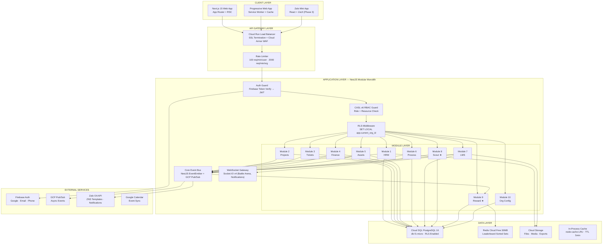

### 2B.2 Request Processing Pipeline

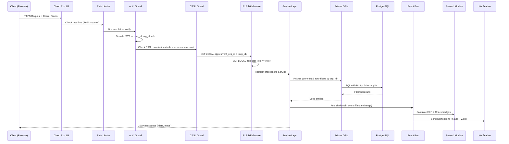

### 2B.3 Data Architecture — Tổng thể

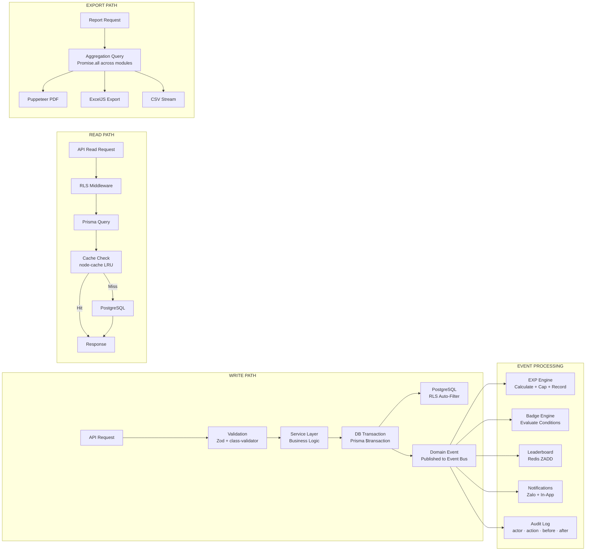

### 2B.4 Data Model — Entity Relationship Overview

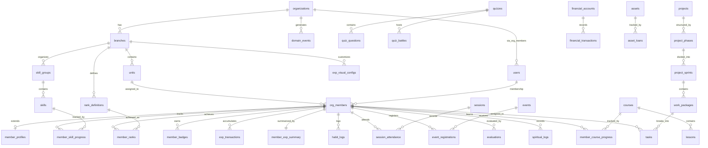

### 2B.5 Integration Architecture

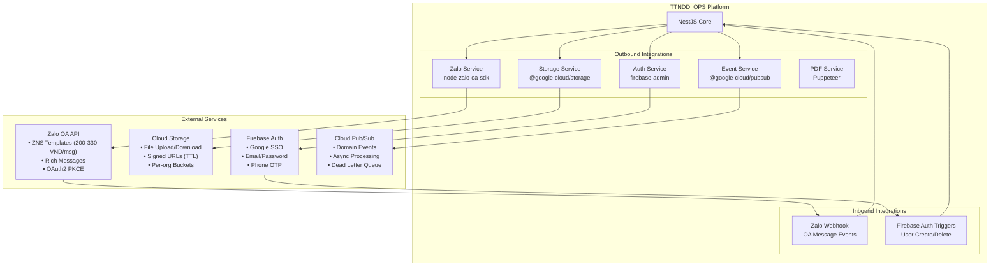

### 2B.6 Event-Driven Architecture — Toàn bộ Event Flow

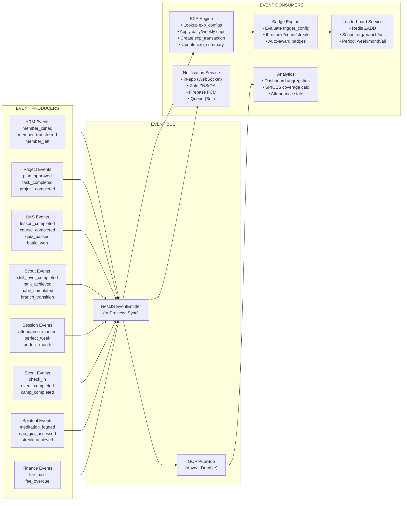

### 2B.7 Identity & Access Control — Chi tiết

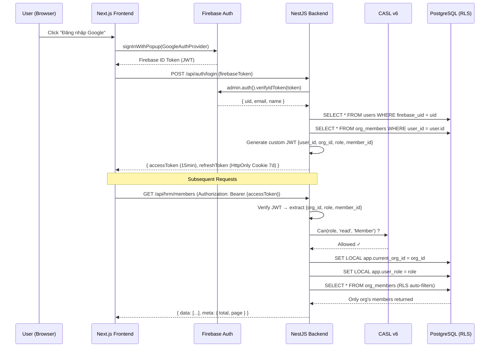

### 2B.8 File Storage Architecture

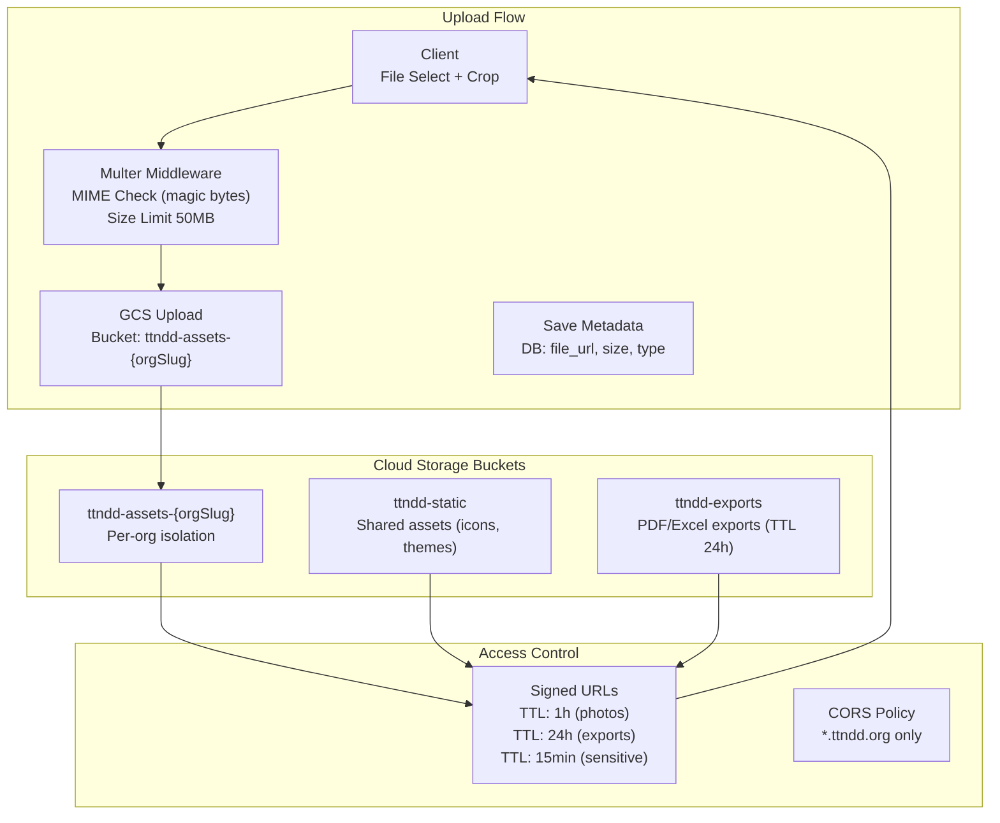

### 2B.9 Frontend Architecture — Component Hierarchy

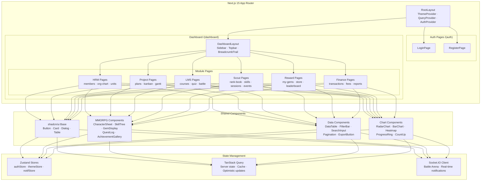

### 2B.10 Backend Module Architecture — NestJS Pattern

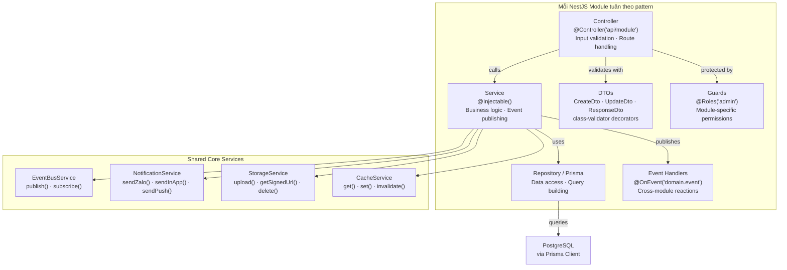

### 2B.11 Data Sync & Logic — Cross-Module Data Flow

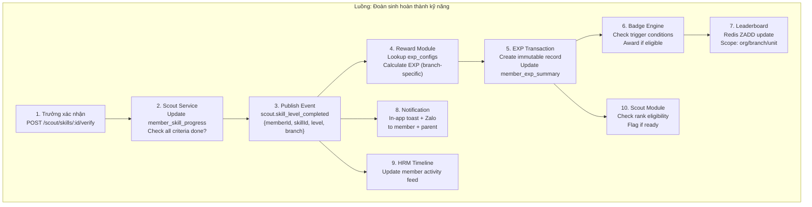

### 2B.12 API Gateway — Middleware Chain

```text
Request Flow (mọi API call đều đi qua):

  ┌──────────────────────────────────────────────────────┐
  │ 1. Helmet.js         (HTTP Security Headers)         │
  │ 2. CORS Guard        (Whitelist *.ttndd.org)         │
  │ 3. Rate Limiter      (Redis counter per user/org/IP) │
  │ 4. Body Parser       (JSON, max 10MB)                │
  │ 5. Firebase Auth     (verifyIdToken → decode JWT)    │
  │ 6. User Resolver     (JWT → user + org_member)       │
  │ 7. CASL Guard        (role × resource × action)      │
  │ 8. RLS Middleware     (SET LOCAL app.current_org_id)  │
  │ 9. Validation Pipe   (class-validator + Zod)         │
  │ 10. Controller       (Route handler)                 │
  │ 11. Service           (Business logic)               │
  │ 12. Event Publisher   (Domain event if state change) │
  │ 13. Response Interceptor (format { data, meta })     │
  │ 14. Exception Filter  (Consistent error format)      │
  └──────────────────────────────────────────────────────┘

Response Format (chuẩn hóa):
  Success: { data: T | T[], meta?: { total, page, limit } }
  Error:   { error: { code, message, details, request_id, timestamp } }
```

### 2B.13 Database Architecture — Index Strategy & Partitioning

```text
INDEX STRATEGY (Performance-Critical):

  -- Mọi bảng: org_id (RLS filter)
  CREATE INDEX idx_{table}_org ON {table}(org_id);

  -- Lookup thường xuyên
  CREATE INDEX idx_org_members_user ON org_members(org_id, user_id);
  CREATE INDEX idx_org_members_branch ON org_members(org_id, branch_id, status);
  CREATE INDEX idx_exp_transactions_member ON exp_transactions(org_id, org_member_id, created_at DESC);
  CREATE INDEX idx_domain_events_type ON domain_events(org_id, event_type, processed);
  CREATE INDEX idx_session_attendance_session ON session_attendance(session_id, org_member_id);
  CREATE INDEX idx_member_skill_progress_member ON member_skill_progress(org_member_id, skill_id);

  -- Full-text search
  CREATE INDEX idx_member_profiles_search ON member_profiles
    USING GIN(to_tsvector('simple', full_name || ' ' || COALESCE(scout_name, '')));

CONNECTION POOLING:
  - Prisma connection limit: 5 (db-f1-micro max 25)
  - Pool timeout: 10s
  - Query timeout: 15s

BACKUP STRATEGY:
  - Daily automated backup (Cloud SQL built-in)
  - 7-day retention
  - Point-in-time recovery enabled
```

## PHẦN III — PRD CÁC MODULE

### MODULE 1 — QUẢN LÝ NHÂN SỰ (HRM)

#### A. TỔNG QUAN MODULE

**Mục đích**: Module HRM là **trung tâm dữ liệu Con Người** của toàn bộ hệ thống. Mọi module khác (Scout, LMS, Finance, Reward...) đều tham chiếu đến dữ liệu thành viên từ HRM. Module quản lý toàn bộ vòng đời (lifecycle) của thành viên: từ khi gia nhập Đoàn, phát triển qua các Ngành, cho đến khi rời Đoàn hoặc trở thành Trưởng.

**Phạm vi**:

- Quản lý hồ sơ cá nhân Đoàn sinh, Trưởng, Phụ huynh
- Cơ cấu tổ chức: Liên Đoàn → Ngành → Đơn vị (Hàng/Đội/Nhóm)
- Chuyển ngành khi đủ tuổi (data migration)
- Sơ đồ tổ chức (Org Chart) tương tác
- Hồ sơ phụ huynh & liên kết với đoàn sinh
- Cựu thành viên & theo dõi alumni

**Đối tượng sử dụng**:

- `super_admin` (LĐT): Quản lý toàn bộ nhân sự, phê duyệt chuyển ngành
- `admin` (Trưởng Ngành): Quản lý đoàn sinh trong ngành phụ trách
- `user` (Đoàn sinh): Xem và cập nhật hồ sơ cá nhân
- `guest` (Phụ huynh): Xem thông tin đoàn sinh được liên kết

**Phụ thuộc**: Module 10 (Org Config) phải có trước. HRM cung cấp dữ liệu cho TẤT CẢ module khác.

#### B. TÍNH NĂNG & CHỨC NĂNG

**B.0 Baseline HRM (tham chiếu OrangeHRM/BambooHR) + thích ứng DTNDD/Hướng đạo**

> Mục tiêu: HRM của TTNDD_OPS **không chỉ “lưu hồ sơ”**, mà là **hệ sinh thái quản trị con người** tương đương một HR platform hiện đại (OrangeHRM/BambooHR), được “điều chỉnh” cho đặc thù thanh thiếu niên – tình nguyện viên – phụ huynh.

**B.0.1 14 phân hệ phụ cần có (định hướng roadmap)**

1. **Quản lý Thông tin Nhân sự (Core HR)**: hồ sơ, custom fields, sơ đồ tổ chức, tài liệu/giấy tờ.
2. **Nghỉ phép/PTO** (cho Trưởng/tình nguyện viên).
3. **Chấm công & Điểm danh**: clock-in/out web; timesheet; lịch ca (đặc thù: lịch sinh hoạt/đi công tác).
4. **Tuyển dụng/ATS** (tuyển Trưởng/tình nguyện viên).
5. **Onboarding/Offboarding**: nhập môn Trưởng mới; bàn giao nhiệm kỳ; thôi sinh hoạt.
6. **Quản lý Hiệu suất**: OKR, đánh giá 360, 1:1 check-ins (dành cho Trưởng).
7. **Kế hoạch Kế nhiệm & Phát triển**: 9-box, IDP, lộ trình năng lực.
8. **Đào tạo/Học tập**: liên kết LMS (bắt buộc các khoá an toàn trẻ em).
9. **Đi lại & Chi phí**: hoàn ứng, chi phí sự kiện.
10. **Tiền lương & Phúc lợi** (tuỳ Org; có thể tắt): phụ cấp/công tác phí.
11. **Cổng Tự phục vụ**: cập nhật hồ sơ, xin nghỉ, đăng ký lịch.
12. **Helpdesk Nhân sự**: ticket nội bộ HR (liên kết Module 3).
13. **Báo cáo & Phân tích**: headcount, retention, compliance training.
14. **Kỷ luật**: log vi phạm, quy trình xử lý, mức độ (liên kết Reward/EXP trừ điểm).

**B.0.2 Thích ứng riêng cho DTNDD/Hướng đạo (P0)**

- **Quản lý tình nguyện viên**: theo dõi **lịch rảnh** + lịch trực sinh hoạt + phân công theo thời hạn (from/to).
- **Theo dõi trình độ/chuyên hiệu của Trưởng**: “năng lực hướng dẫn” liên kết Scout Core (Module 8) & LMS (Module 7).
- **Kiểm tra lý lịch & nhắc gia hạn**: background check (nếu Org áp dụng) + expiry alerts.
- **Tuân thủ đào tạo “bảo vệ thanh thiếu niên”**: bắt buộc hoàn thành khoá trước khi được cấp quyền quản lý.
- **Hồ sơ y tế & liên hệ khẩn cấp**: field riêng + quyền truy cập hạn chế (trưởng y tế, trưởng trại).
- **Guardian/Parent link**: phụ huynh xem tiến bộ; phê duyệt consent cho sự kiện/ảnh.

**B.0.3 Feature parity (nguồn tham chiếu)**

- OrangeHRM mô tả các mảng: employee management, recruitment, onboarding, performance, leave/time & attendance (tương đương các nhóm tính năng trên).
- BambooHR mô tả platform gồm payroll/time/benefits, time-off tracking, performance management, onboarding.

**Tài liệu tham chiếu**

- OrangeHRM (overview): https://www.orangehrm.com/
- BambooHR (platform/time-off/performance/onboarding): https://www.bamboohr.com/

**B.1 Quản lý Hồ sơ Thành viên**

- **B.1.1 Thêm mới thành viên**
  - Đăng ký Đoàn sinh mới: Trưởng nhập thông tin hoặc phụ huynh tự đăng ký qua form
  - Thông tin bắt buộc: Họ tên, ngày sinh, giới tính, ngành (tự động theo tuổi), đơn vị
  - Thông tin phụ huynh: Bắt buộc nếu Đoàn sinh < 18 tuổi (tên, SĐT, Zalo, email, quan hệ)
  - Thông tin y tế: Dị ứng, bệnh lý, thuốc đang dùng, liên hệ khẩn cấp
  - Thông tin Hướng Đạo: Tên Hướng Đạo (scout name), tên nhân vật TTKТ (hero name)
  - Ảnh đại diện: Upload + crop, private URL (signed URL có TTL cho an toàn trẻ em)
  - Trạng thái khởi tạo: `pending` → chờ Trưởng duyệt

- **B.1.2 Cập nhật & quản lý hồ sơ**
  - Đoàn sinh/Phụ huynh tự cập nhật: SĐT, địa chỉ, thông tin y tế, ảnh đại diện
  - Trưởng cập nhật: Trạng thái, đơn vị, ghi chú, đánh giá
  - Lịch sử thay đổi: Mọi chỉnh sửa đều ghi audit log (ai sửa, sửa gì, lúc nào)
  - Soft delete: Khi đoàn sinh rời Đoàn → `status = 'left'`, dữ liệu giữ 90 ngày rồi xóa cứng

- **B.1.3 Trang Chi tiết Thành viên (Cross-Module Aggregation)**
  - **Thông tin cá nhân**: Hồ sơ, ảnh, thông tin liên hệ
  - **Tổng hợp từ Module 8 (Scout)**: Bậc đẳng thứ hiện tại, kỹ năng đang học, chuyên hiệu đạt được
  - **Tổng hợp từ Module 9 (Reward)**: Tổng EXP, số ngọc (visual), badge collection
  - **Tổng hợp từ Module 7 (LMS)**: Khóa học đã hoàn thành, đang học, điểm trung bình
  - **Tổng hợp từ Module 2 (Project)**: Task đang thực hiện, dự án đã hoàn thành
  - **Tổng hợp từ Module 4 (Finance)**: Tình trạng đóng phí (đã đóng/nợ/miễn)
  - **Tổng hợp từ Module 8-Sessions**: Tỉ lệ chuyên cần, chuỗi tham gia liên tục
  - **Timeline hoạt động**: Dòng thời gian tổng hợp tất cả sự kiện quan trọng

- **B.1.4 Tìm kiếm & Lọc nâng cao**
  - Tìm kiếm: Theo tên, mã thành viên, SĐT, tên Hướng Đạo
  - Lọc: Theo ngành, đơn vị, bậc đẳng thứ, trạng thái, độ tuổi, giới tính
  - Xuất dữ liệu: CSV, Excel, PDF (danh sách có lọc)

**B.2 Quản lý Cơ cấu Tổ chức**

- **B.2.1 Sơ đồ tổ chức (Org Chart)**
  - Sơ đồ dạng cây tương tác (drag-drop): Ban Cai Quản → Hội Đồng Liên Đoàn → Ban Thường Vụ → Ngành → Đơn vị
  - Hiển thị ảnh + tên + chức vụ cho mỗi node
  - Click node → xem chi tiết thành viên
  - Trưởng có thể chỉnh sửa sơ đồ (thêm/xóa/di chuyển node)

- **B.2.2 Quản lý Đơn vị (Hàng/Đội/Nhóm)**
  - Tạo đơn vị: Tên (theo quy ước ngành), totem/biểu tượng, số thành viên tối đa (6-8)
  - Phân bổ đoàn sinh vào đơn vị
  - Chỉ định Đơn vị Trưởng (Hàng Trưởng, Đội Trưởng, Nhóm Trưởng) — do Trưởng ngành chọn
  - Đơn vị Phó — do Đơn vị Trưởng chọn hoặc đoàn sinh tự bầu
  - Xem thống kê đơn vị: Số thành viên, tỉ lệ chuyên cần, EXP trung bình

**B.3 Chuyển Ngành (Branch Transition)**

- **B.3.1 Cơ chế chuyển ngành bắt buộc**
  - Hệ thống tự động phát hiện đoàn sinh đạt đến độ tuổi giới hạn của ngành hiện tại
  - Thông báo cho Trưởng Ngành hiện tại + Trưởng Ngành tiếp nhận + Phụ huynh
  - Trưởng Ngành hiện tại chuẩn bị hồ sơ chuyển: tổng kết thành tích, đẳng thứ đạt được
  - Trưởng Ngành tiếp nhận duyệt → hệ thống thực hiện chuyển

- **B.3.2 Quy tắc bảo toàn dữ liệu khi chuyển ngành**
  - EXP: **Giữ nguyên tổng EXP** — tên hiển thị thay đổi theo ngành mới (ví dụ: "hạt mầm" → "ngọc")
  - Kỹ năng: Archive kỹ năng ngành cũ → mở khóa Skill Tree ngành mới
  - Đẳng thứ: Bắt đầu lại từ bậc 1 của ngành mới, nhưng có thể rút ngắn thời gian nếu có kỹ năng nền tảng
  - Badge: Tất cả badge giữ nguyên (thành tích vĩnh viễn)
  - Lịch sử: Ghi nhận đầy đủ trong `member_branch_history`

**B.4 Quản lý Phụ huynh**

- Liên kết 1 phụ huynh → nhiều đoàn sinh (nếu có anh chị em)
- Phụ huynh nhận thông báo: Tiến bộ, điểm danh, sự kiện, phí
- Phụ huynh ký đồng ý: Sự kiện qua đêm, trại, hoạt động ngoài trời
- Portal riêng cho phụ huynh (role `guest`): Dashboard con em, lịch sử, đóng phí

**B.5 Cựu thành viên & Alumni**

- Đoàn sinh rời Đoàn → chuyển sang trạng thái `left` → vẫn xem được lịch sử
- Có thể quay lại: `left` → `active` (nếu còn trong độ tuổi)
- Báo cáo alumni: Số lượng, lý do rời, tỉ lệ quay lại

#### C. LUỒNG QUY TRÌNH & LOGIC NGHIỆP VỤ

**C.1 Luồng chính: Vòng đời Thành viên**

```text
[Đăng ký] → pending → [Trưởng duyệt + Tuyên Hứa] → active
                                                        │
                    ┌───────────────────────────────────┤
                    │              │              │     │
                suspended     inactive     transferred  left
                (vi phạm)    (tạm nghỉ)   (chuyển ngành) (rời Đoàn)
                    │              │              │
                    └──→ active ←──┘     active (ngành mới)
```

**C.2 Quy tắc nghiệp vụ (Business Rules)**

| #         | Quy tắc                      | Mô tả                                                                   |
| --------- | ---------------------------- | ----------------------------------------------------------------------- |
| BR-HRM-01 | Ngành tự động theo tuổi      | Đồng: 5-10, Thiếu: 11-15, Thanh: 16-25                                  |
| BR-HRM-02 | Phụ huynh bắt buộc < 18 tuổi | Không tạo được hồ sơ đoàn sinh < 18 mà không có phụ huynh               |
| BR-HRM-03 | Chuyển ngành bắt buộc        | Hệ thống cảnh báo khi đoàn sinh đạt giới hạn tuổi, chuyển trong 3 tháng |
| BR-HRM-04 | Soft delete 90 ngày          | Dữ liệu giữ 90 ngày sau khi rời, sau đó xóa cứng (tuân thủ PDPD)        |
| BR-HRM-05 | 1 profile active/thời điểm   | Unique constraint `(user_id, status='active')`                          |
| BR-HRM-06 | Audit mọi thay đổi           | Mọi chỉnh sửa hồ sơ đều ghi `actor_id`, `before`, `after`, `timestamp`  |

#### D. USER STORIES & TIÊU CHÍ CHẤP NHẬN

**US-HRM-01**: _Là Trưởng Ngành, tôi muốn thêm đoàn sinh mới vào hệ thống, để quản lý hồ sơ tập trung._

- AC: Given thông tin đoàn sinh hợp lệ + phụ huynh (nếu < 18), When Trưởng submit form, Then hồ sơ được tạo với status `pending`, Trưởng cấp trên nhận thông báo.

**US-HRM-02**: _Là Phụ huynh, tôi muốn xem tiến bộ tổng hợp của con tôi, để theo dõi sự phát triển._

- AC: Given phụ huynh đã đăng nhập + đã liên kết đoàn sinh, When vào Dashboard, Then thấy tổng hợp: chuyên cần, EXP, đẳng thứ, badge, phí.

**US-HRM-03**: _Là LĐT, tôi muốn xem sơ đồ tổ chức tổng quan, để nắm bắt nhân sự toàn Liên Đoàn._

- AC: Given LĐT đăng nhập, When vào Org Chart, Then hiển thị cây tổ chức đầy đủ, click node → xem chi tiết.

**US-HRM-04**: _Là hệ thống, khi đoàn sinh đạt 11 tuổi ở Ngành Đồng, tôi cần thông báo chuyển ngành._

- AC: Given đoàn sinh ngành Đồng, birth_date cho thấy đã 11 tuổi, When chạy cron hàng ngày, Then gửi thông báo cho Trưởng Đồng + Trưởng Thiếu + phụ huynh.

### MODULE 2 — QUẢN LÝ DỰ ÁN & KẾ HOẠCH (Project Management)

#### A. TỔNG QUAN MODULE

**Mục đích**: Module Project Management là **trung tâm lập kế hoạch và theo dõi thực thi** của toàn Liên Đoàn. Mọi hoạt động của DTNDD — từ chương trình năm, kế hoạch ngành, đến từng sự kiện cụ thể — đều cần được lập kế hoạch có hệ thống, phê duyệt, triển khai và đánh giá. Module này số hóa toàn bộ quy trình đó.

**Phạm vi**:

- Soạn Kế hoạch theo chuẩn 9 phần của DTNDD (Mô tả → Mục tiêu → Kết quả → Hoạt động → Nhân sự → Nội dung → Tiến độ → Đề xuất → Kinh phí)
- Phê duyệt kế hoạch theo quy trình phân cấp
- Tự động tạo Dự án từ kế hoạch được duyệt (Plan → Project Auto-Generation)
- Quản lý dự án kiểu Jira: Project → Phase → Sprint → Work Package → Task
- Theo dõi OKR (Objectives & Key Results)
- Nhiều góc nhìn: Kanban Board, Gantt Chart, Backlog Table, Calendar

**Đối tượng sử dụng**:

- `super_admin`: Phê duyệt kế hoạch, giám sát tổng quan dự án, báo cáo
- `admin`: Lập kế hoạch, quản lý dự án, phân công task
- `user`: Nhận task, cập nhật tiến độ, báo cáo hoàn thành
- `guest`: Không truy cập module này

#### B. TÍNH NĂNG & CHỨC NĂNG

**B.0 Baseline Project Management (tham chiếu Plane.so + OpenProject) + thích ứng DTNDD/Hướng đạo**

> Mục tiêu: Module 2 phải “đủ lực” như một PM tool hiện đại: nhiều view, nhiều cấp phân rã công việc, có wiki/tài liệu, có cycle/sprint, có template, có time tracking — nhưng được “dịch” sang **kế hoạch hoạt động Đoàn**.

**B.0.1 Phân cấp tham chiếu (định hướng thiết kế)**

- **Workspace → Portfolio → Project → Epics → Work items → Sub-items**
- Tổ chức song song theo **Cycles/Sprints** (timebox) và **Modules** (nhóm theo chủ đề).

**B.0.2 Tính năng thiết yếu (baseline)**

- **Portfolio management**: nhìn toàn cảnh nhiều dự án (năm/quý/tháng/sự kiện).
- **Nhiều góc nhìn**: List/Table · Kanban/Board · Gantt · Calendar · Timeline.
- **Wiki/Tài liệu**: gắn trực tiếp với dự án/work items; embed bảng công việc/Gantt.
- **Cộng tác**: activity stream, comments, @mentions, updates.
- **Methodologies**: Scrum, Kanban, Waterfall, Hybrid (tuỳ Org).
- **Integrations**: file storage, API, (phase sau) Git/ChatOps.
- **Time tracking & cost** (đặc biệt cho sự kiện/trại): giờ công, chi phí dự kiến, chi phí thực tế.

**B.0.3 Thích ứng riêng cho DTNDD/Hướng đạo (P0)**

- **Plan templates chuẩn** cho: cắm trại, lễ hội, công tác xã hội, khóa tu/giáo lý.
  - Mỗi template có checklist: di chuyển, ăn uống, thiết bị, giấy phép, y tế, bảo hiểm, danh sách người tham gia, consent phụ huynh.
- **Risk register** cho hoạt động ngoài trời: rủi ro thời tiết, an toàn nước, cháy nổ, y tế, hành trình.
- **Chu kỳ chương trình**: theo dõi chu kỳ rèn luyện/thăng tiến (gắn Module 8).

**Tài liệu tham chiếu**

- Plane docs: Epics & Cycles: https://docs.plane.so/ (ví dụ: https://docs.plane.so/core-concepts/issues/epics ; https://plane.so/cycles)
- OpenProject: work packages, views, Gantt, Wiki:
  - https://www.openproject.org/docs/getting-started/work-packages-introduction/
  - https://www.openproject.org/docs/user-guide/work-packages/work-package-views/
  - https://www.openproject.org/docs/user-guide/gantt-chart/
  - https://www.openproject.org/docs/user-guide/wiki/

**B.1 Soạn Kế hoạch (Plan Builder)**

- **B.1.1 Form soạn kế hoạch 9 phần**
  - Phần I — Mô tả dự án: Bối cảnh, lý do, phạm vi
  - Phần II — Mục tiêu (Objectives): SMART goals, có thể map thành OKR
  - Phần III — Kết quả mong đợi (Outcomes/Key Results)
  - Phần IV — Hoạt động trọng tâm: Danh sách hoạt động cần thực hiện
  - Phần V — Nhân sự & Phân công: Vai trò, trách nhiệm (RACI matrix)
  - Phần VI — Nội dung chi tiết: Breakdown hoạt động thành task cụ thể
  - Phần VII — Tiến độ thực hiện: Timeline, milestone
  - Phần VIII — Đề xuất: Kiến nghị đặc biệt
  - Phần IX — Dự trù kinh phí: Chi phí ước tính cho từng hạng mục
  - Auto-save draft: Lưu tự động mỗi 30 giây
  - Template: Bộ mẫu kế hoạch (Sinh hoạt tuần, Trại ngắn ngày, Lễ hội, Dự án năm)

- **B.1.2 Phê duyệt kế hoạch**
  - Luồng: `draft → submitted → {approved | rejected}`
  - Trưởng Ngành soạn → nộp lên LĐT
  - LĐT xem xét → phê duyệt hoặc từ chối (kèm lý do)
  - Từ chối → trả về draft → Trưởng sửa → nộp lại
  - Thông báo Zalo khi được duyệt/từ chối

- **B.1.3 Plan → Project Auto-Generation**
  - Khi kế hoạch được approve → hệ thống TỰ ĐỘNG tạo dự án:
    - Mỗi Mục tiêu (Phần II) → Phase
    - Mỗi Kết quả (Phần III) → Sprint
    - Mỗi Hoạt động (Phần IV) → Work Package
    - Mỗi Nội dung (Phần VI) → Task (gán assignee từ Phần V)
    - Timeline từ Phần VII → set due dates
    - Kinh phí từ Phần IX → budget của dự án

**B.2 Quản lý Dự án**

- **B.2.1 Phân cấp dự án**: Project → Phase → Sprint → Work Package → Task
- **B.2.2 Kanban Board**: Drag-drop card giữa các cột (To Do / In Progress / Review / Done)
- **B.2.3 Gantt Chart**: Timeline dạng thanh ngang, milestone markers, dependencies
- **B.2.4 Backlog Table**: Bảng dữ liệu với cột tùy chỉnh, inline edit, filter/sort
- **B.2.5 OKR Dashboard**: Objective + Key Results + % hoàn thành
- **B.2.6 Task Detail**: Assignee(s), due date, priority, story points, attachments, comments, sub-tasks

**B.3 Tự động hóa & Thông báo**

- Task sắp hết hạn (D-1, D-day): Thông báo in-app + Zalo cho assignee
- Task hoàn thành → publish event `projects.task_completed` → Module 9 grant EXP
- Project hoàn thành → publish event `projects.project_completed` → EXP + Badge

#### C. LUỒNG QUY TRÌNH

**C.1 Luồng Kế hoạch → Dự án → Hoàn thành**

```text
[Trưởng soạn KH] → draft → [Nộp lên LĐT] → submitted
                                                │
                              ┌─────────────────┤
                              │                 │
                          approved          rejected
                              │                 │
                    [Auto-generate Project]   [Sửa → nộp lại]
                              │
                          active
                              │
                    [Thực thi tasks]
                              │
                        completed
```

**C.2 Quy tắc nghiệp vụ**

| #        | Quy tắc                                                   |
| -------- | --------------------------------------------------------- |
| BR-PM-01 | Chỉ `admin` trở lên mới được tạo kế hoạch                 |
| BR-PM-02 | Chỉ `super_admin` mới được phê duyệt kế hoạch             |
| BR-PM-03 | Kế hoạch đã approved không được sửa (tạo bản sửa đổi mới) |
| BR-PM-04 | Task hoàn thành → auto publish event cho Module 9         |
| BR-PM-05 | Mỗi task có tối đa 5 assignees                            |

#### D. USER STORIES

**US-PM-01**: _Là Trưởng Ngành, tôi muốn soạn kế hoạch sinh hoạt quý theo mẫu 9 phần, để nộp LĐT phê duyệt._

**US-PM-02**: _Là LĐT, tôi muốn phê duyệt kế hoạch và hệ thống tự động tạo dự án, để giảm thời gian hành chính._

**US-PM-03**: _Là Đoàn sinh được giao task, tôi muốn cập nhật tiến độ trên Kanban board, để Trưởng biết tôi đang làm gì._

### MODULE 3 — PHIẾU YÊU CẦU & PHÊ DUYỆT (Ticket & Approval)

#### A. TỔNG QUAN MODULE

**Mục đích**: Module Ticket là **hệ thống yêu cầu và phê duyệt tổng quát** — xử lý mọi loại yêu cầu không thuộc quy trình cố định của module khác. Ví dụ: đoàn sinh xin nghỉ, Trưởng đề xuất mua vật dụng, phụ huynh phản hồi, khiếu nại, hoặc bất kỳ yêu cầu nào cần phê duyệt.

**Phạm vi**: Tạo ticket, phân loại, chuyển tiếp, phê duyệt nhiều cấp, theo dõi trạng thái, lịch sử thảo luận (comment thread), đính kèm file.

#### B. TÍNH NĂNG & CHỨC NĂNG

**B.0 Baseline Ticket/Approval (tham chiếu Zammad + Freshdesk/Freshservice) + 5 mẫu phê duyệt**

> Mục tiêu: Module 3 phải là “xương sống vận hành” cho mọi yêu cầu: xin phép, chi phí, sự cố, kỷ luật, bàn giao, duyệt kế hoạch, consent phụ huynh.

**B.0.1 5 mẫu quy trình phê duyệt (bắt buộc hỗ trợ)**

1. **Tuần tự (Sequential)**: A → B → C (phân cấp rõ ràng).
2. **Song song (Parallel)**: nhiều người/phòng ban duyệt cùng lúc.
3. **Có điều kiện (Conditional)**: đổi luồng theo thuộc tính (ngưỡng tiền, loại sự kiện, rủi ro).
4. **Đa cấp độ (Multi-level)**: tuần tự theo lớp, đặc biệt cho khoản lớn.
5. **Hỗn hợp (Hybrid)**: kết hợp tuần tự + song song + điều kiện.

**B.0.2 Thích ứng riêng cho DTNDD/Hướng đạo (P0)**

- **Consent phụ huynh**: mẫu đơn điện tử + chữ ký số (hoặc xác nhận OTP) + lưu trữ chứng cứ.
- **Phê duyệt thăng tiến**: quy trình nhiều bước qua “Hội đồng Duyệt xét”.
- **Chuỗi phê duyệt sự kiện**: Đội trưởng → LĐT → Trưởng ban/Ủy ban → (tuỳ Org).
- **Luồng chi phí có điều kiện**: theo ngưỡng (ví dụ 1M/3M/5M VND).
- **Phê duyệt cố vấn chuyên hiệu**: gắn LMS/Scout.
- **Kiểm tra lý lịch tình nguyện viên**: approval + expiry reminders.
- **Báo cáo sự cố/khiếu nại**: escalation ladder + SLA.

**B.0.3 Feature baseline từ hệ thống tham chiếu**

- Zammad hỗ trợ automation theo “if-this-then-that” qua **Triggers** và cấu hình **Core Workflows** (dynamic field rules theo nhóm).
- Freshworks có hướng dẫn **multi-level approval workflows** (hierarchical approvals) và **parallel approvals** (phê duyệt song song).

**Tài liệu tham chiếu**

- Zammad Triggers: https://admin-docs.zammad.org/en/latest/manage/trigger.html
- Zammad Core Workflows: https://zammad.com/en/product/features/core-workflows
- Freshservice hierarchical approvals (Workflow Automator): https://support.freshservice.com/support/solutions/articles/211198-setting-hierarchical-approvals-for-service-requests-using-workflow-automator-
- Freshservice parallel approvals (FAQ): https://support.freshservice.com/support/solutions/articles/50000011703-new-approvals-process-frequently-asked-questions
- Freshdesk approval workflow (KB articles): https://support.freshdesk.com/support/solutions/folders/50000000131

**B.1 Tạo & Quản lý Ticket**

- **B.1.1 Tạo ticket**: Form với tiêu đề, mô tả, danh mục (yêu cầu/phê duyệt/báo cáo/khiếu nại), mức ưu tiên, file đính kèm
- **B.1.2 Tự động đánh số**: TKT-2026-001, TKT-2026-002...
- **B.1.3 Phân loại & routing**: Tự động chuyển đến Trưởng phụ trách dựa trên danh mục
- **B.1.4 Comment thread**: Thảo luận trên ticket, ghi chú nội bộ (chỉ Trưởng thấy)
- **B.1.5 Lịch sử trạng thái**: Mỗi chuyển trạng thái → ghi log + thông báo Zalo

**B.2 Phê duyệt Workflow**

- **Sequential**: A → B → C (phê duyệt theo thứ tự cấp bậc)
- **Conditional**: Nếu yêu cầu > 500.000 VND → cần thêm LĐT duyệt
- **Batch approval**: Trưởng duyệt nhiều ticket cùng lúc

**B.3 Dashboard Ticket**

- Tổng quan: Open, In Progress, Resolved, Closed (theo số lượng + biểu đồ)
- Lọc: Theo danh mục, priority, assignee, ngày tạo
- SLA tracking: Thời gian phản hồi trung bình, ticket quá hạn

#### C. LUỒNG QUY TRÌNH

```text
[Tạo] → open → [Gán Trưởng] → assigned → [Xem xét] → in_review
                                                          │
                                            ┌─────────────┤
                                        approved      rejected
                                            │              │
                                         closed     [Phản hồi lại] → open
```

#### D. USER STORIES

**US-TK-01**: _Là Đoàn sinh, tôi muốn tạo phiếu xin nghỉ sinh hoạt, để Trưởng biết lý do tôi vắng._

**US-TK-02**: _Là Trưởng, tôi muốn duyệt hàng loạt ticket xin nghỉ, để tiết kiệm thời gian._

---

### MODULE 4 — QUẢN LÝ TÀI CHÍNH (Financial Management)

#### A. TỔNG QUAN MODULE

**Mục đích**: Module Finance quản lý **toàn bộ dòng tiền của Liên Đoàn**: thu (nguyệt liễm, trại phí, đóng góp), chi (hoạt động, mua sắm, từ thiện), và tồn quỹ. Đảm bảo minh bạch tài chính với Ban Cai Quản và phụ huynh.

**Phạm vi**: 2 cấp quỹ (Liên Đoàn + Ngành), thu/chi, Mạnh Thường Quân, đóng góp hiện vật, phí thành viên (nguyệt liễm, trại phí, đồng phục), báo cáo tài chính.

#### B. TÍNH NĂNG & CHỨC NĂNG

**B.0 Baseline Finance (tham chiếu ERPNext) + thích ứng DTNDD/Hướng đạo**

> Mục tiêu: Module 4 phải “ledger-first” và có **cây trung tâm chi phí + budgeting** để minh bạch theo đơn vị/ngành/sự kiện.

**B.0.1 Baseline (ERPNext-style)**

- **Cost Center Tree**: phân cấp trung tâm chi phí để “roll up” báo cáo.
- **Budgeting**: đặt ngân sách theo cost center, theo dõi chênh lệch (variance) theo thời gian.
- **Tagging transactions** theo cost center/dimension để báo cáo đúng.

**B.0.2 Thích ứng riêng cho DTNDD/Hướng đạo (P0)**

- **Phí đoàn viên** theo cá nhân/đơn vị: hóa đơn tự động, nhắc đóng phí.
- **Phí cắm trại**: cho phép **đóng từng phần**; có **campership/quỹ hỗ trợ**.
- **Gây quỹ theo sự kiện**: báo cáo thu/chi minh bạch (phi lợi nhuận).
- **Đóng góp vật chất (in‑kind)**: ghi nhận hiện vật (lều, gạo, nước…), quy đổi (tuỳ Org) để minh bạch.

**Tài liệu tham chiếu**

- ERPNext Cost Center & Budgeting (docs): https://docs.frappe.io/erpnext/user/manual/en/cost-center-and-budgeting

**B.1 Quản lý Tài khoản/Quỹ**

- **B.1.1 Quỹ Liên Đoàn** (super_admin quản lý): Quỹ chính của toàn Đoàn
- **B.1.2 Quỹ Ngành** (admin quản lý): Quỹ riêng của từng Ngành (nếu có)
- **B.1.3 Quỹ Sự kiện**: Tạm thời, gắn với sự kiện cụ thể
- Mỗi quỹ có số dư hiện tại, cập nhật real-time khi có giao dịch

**B.2 Giao dịch Thu/Chi**

- **B.2.1 Ghi nhận thu**: Loại (nguyệt liễm, trại phí, đóng góp, tài trợ), số tiền, người nộp, chứng từ (ảnh biên lai), ngày giao dịch
- **B.2.2 Ghi nhận chi**: Loại (hoạt động, mua sắm, in ấn, từ thiện), số tiền, người thực hiện, chứng từ, ngày giao dịch
- **B.2.3 Phê duyệt**: Mọi giao dịch cần Trưởng/LĐT duyệt trước khi cập nhật số dư
- **B.2.4 Đảo bút toán**: Nếu phát hiện sai → tạo giao dịch ngược + link đến giao dịch gốc

**B.3 Phí Thành viên (Nguyệt liễm)**

- **B.3.1 Tạo kỳ đóng phí**: Theo tháng hoặc quý, áp dụng cho toàn ngành hoặc cá nhân
- **B.3.2 Theo dõi**: Đã đóng / Đóng một phần / Chưa đóng / Quá hạn / Miễn phí
- **B.3.3 Nhắc nhở tự động**: Khi quá hạn → Zalo notification cho phụ huynh
- **B.3.4 Miễn phí**: LĐT có quyền miễn cho hoàn cảnh đặc biệt

**B.4 Mạnh Thường Quân & Đóng góp Hiện vật**

- **B.4.1 Hồ sơ Mạnh Thường Quân**: Tên, liên hệ, loại tài trợ, tổng đóng góp
- **B.4.2 Đóng góp hiện vật**: Tên vật phẩm, số lượng, giá trị ước tính, ảnh

**B.5 Báo cáo Tài chính**

- Dashboard: Biểu đồ thu/chi theo tháng, số dư quỹ, top danh mục chi
- Báo cáo PDF: Xuất báo cáo tài chính định kỳ (tháng/quý/năm) cho Ban Cai Quản
- Bảng theo dõi phí: Hiển thị tất cả đoàn sinh với trạng thái đóng phí (đã/chưa/nợ)

#### C. LUỒNG QUY TRÌNH

**Giao dịch**: `pending → {approved | rejected} → completed → [có thể reversed]`

**Phí thành viên**: `unpaid → {partial | paid | overdue} → [paid | waived]`

#### D. USER STORIES

**US-FIN-01**: _Là Trưởng, tôi muốn ghi nhận thu nguyệt liễm từ đoàn sinh, kèm ảnh biên lai, để minh bạch._

**US-FIN-02**: _Là Phụ huynh, khi con tôi chưa đóng phí quá hạn, tôi muốn nhận nhắc nhở qua Zalo._

**US-FIN-03**: _Là LĐT, tôi muốn xem báo cáo thu/chi tổng hợp theo quý để báo cáo Ban Cai Quản._

---

---

### MODULE 5 — QUẢN LÝ TÀI SẢN (Assets Management)

#### A. TỔNG QUAN MODULE

**Mục đích**: Quản lý **trang thiết bị, dụng cụ sinh hoạt** của Liên Đoàn: lều, gậy, dây thừng, bộ nấu ăn, dụng cụ y tế, đồng phục... Hệ thống mượn-trả có kiểm soát, QR code cho mỗi tài sản.

**Phạm vi**: Danh mục tài sản (Đoàn + Ngành), thêm/sửa/xóa tài sản, mượn-trả (request → approve → borrow → return), QR code, bảo trì, thanh lý.

#### B. TÍNH NĂNG & CHỨC NĂNG

**B.0 Baseline Assets (tham chiếu Snipe‑IT) + thích ứng DTNDD/Hướng đạo**

> Mục tiêu: Module 5 phải “inventory + custody + condition + audit trail” cho tài sản Đoàn & tài sản Ngành.

**B.0.1 Baseline (Snipe‑IT-style)**

- Theo dõi **asset assigned → to whom → where**.
- **One-click checkin/checkout**, lịch sử mượn‑trả.
- **Custom fields** để theo dõi thuộc tính đặc thù.
- **Email alerts** cho bảo hành/giấy phép hết hạn.
- **User acceptance** khi checkout (EULA/terms acceptance).

**B.0.2 Thích ứng riêng cho DTNDD/Hướng đạo (P0)**

- **Thiết bị cắm trại**: theo dõi tình trạng, xuất kho theo mùa.
- **Đồng phục**: cấp phát theo size, tình trạng, hoàn trả.
- **Vật tư tiêu hao** (chuyên hiệu): tồn kho + định mức theo chương trình.
- **Cơ sở vật chất/đất trại**: booking/maintenance.
- **Xe cộ**: lịch bảo dưỡng + số km.
- **Camp kits**: bộ dụng cụ đóng gói sẵn cho trại/sự kiện.
- **Guardian assignment**: chỉ định phụ huynh/giám hộ khi tài sản được giao cho trẻ vị thành niên.

**Tài liệu tham chiếu**

- Snipe‑IT product features: https://snipeitapp.com/product

**B.1 Danh mục & Hồ sơ Tài sản**

- **B.1.1 Phân loại**: Lều trại, Gậy, Dây thừng, Dụng cụ Y tế, Dụng cụ Nấu ăn, Đồng phục, Tài liệu, Khác
- **B.1.2 Thuộc tính**: Mã tài sản, tên, danh mục, sở hữu (Đoàn/Ngành), số lượng, số lượng khả dụng, tình trạng (tốt/khá/kém/hỏng), ngày mua, giá mua, vị trí lưu trữ, ảnh, ghi chú
- **B.1.3 QR Code**: Tự động tạo QR cho mỗi tài sản, in và dán lên vật phẩm, scan bằng điện thoại → xem thông tin

**B.2 Mượn-Trả (Checkout/Checkin)**

- **B.2.1 Yêu cầu mượn**: Đoàn sinh/Trưởng chọn tài sản → nhập mục đích + ngày trả dự kiến
- **B.2.2 Phê duyệt**: Trưởng/Quản cụ duyệt → giao tài sản
- **B.2.3 Theo dõi**: Đang mượn, sắp đến hạn, quá hạn (tự động nhắc nhở)
- **B.2.4 Trả**: Ghi nhận tình trạng khi trả (tốt/hư hỏng), ghi chú
- **B.2.5 Hư hỏng/Mất**: Báo cáo hư hỏng → chuyển sang bảo trì hoặc thanh lý

**B.3 Dashboard & Báo cáo**

- Tổng quan: Tồn kho, đang mượn, quá hạn, bảo trì, thanh lý
- Cảnh báo: Tài sản quá hạn mượn, tài sản sắp hết (số lượng thấp)
- Lịch sử: Toàn bộ lịch sử mượn-trả của mỗi tài sản

#### C. LUỒNG QUY TRÌNH

```
available → [Yêu cầu mượn] → requested → [Duyệt] → checked_out
                                                        │
                               ┌────────────────────────┤
                           returned                  overdue
                               │                        │
                           available               [Trả muộn] → available
                                                   [Hư hỏng] → under_repair → {available | disposed}
                                                   [Mất] → disposed
```

---

---

### MODULE 6 — QUẢN LÝ QUY TRÌNH (Process Management)

#### A. TỔNG QUAN MODULE

**Mục đích**: Xây dựng và lưu trữ **các quy trình chuẩn (SOP)** và **workflow tự động hóa** của Liên Đoàn. Giúp đảm bảo tính nhất quán trong vận hành khi Trưởng thay đổi.

**Phạm vi**: Thư viện SOP (tài liệu quy trình), Workflow Builder (tự động hóa), quản lý phiên bản tài liệu.

#### B. TÍNH NĂNG & CHỨC NĂNG

**B.1 Thư viện SOP (Standard Operating Procedures)**

- **B.1.1 Tạo SOP**: Rich text editor (TipTap), đính kèm file/ảnh/video
- **B.1.2 Phân loại**: Quy trình tổ chức (sinh hoạt, trại, lễ), Quy trình hành chính (đăng ký, chuyển ngành), Quy trình an toàn (sơ cứu, cháy nổ, thời tiết)
- **B.1.3 Quản lý phiên bản**: Mỗi SOP có version, lịch sử thay đổi, người phê duyệt
- **B.1.4 Tìm kiếm**: Full-text search trong nội dung SOP

**B.2 Workflow Builder (Visual)**

- **B.2.1 Builder kéo-thả** (React Flow): Tạo workflow bằng cách kéo các node
- **B.2.2 Node types**:
  - Trigger: Sự kiện kích hoạt (event, lịch, thủ công)
  - Condition: Điều kiện rẽ nhánh (if/else)
  - Action: Gửi thông báo, tạo task, cập nhật trạng thái, gán EXP, tạo ticket
  - Delay: Chờ N giờ/ngày
- **B.2.3 Lưu & chạy**: Lưu workflow dạng JSON, executor service chạy khi trigger events

**B.3 Tài liệu Quy trình**

- Văn bản ban hành chính thức (nội quy, thông báo)
- Phân quyền xem: Toàn Đoàn, theo Ngành, theo vai trò

---

---

### MODULE 7 — HỆ THỐNG QUẢN LÝ HỌC TẬP (LMS)

#### A. TỔNG QUAN MODULE

**Mục đích**: Module LMS là **kho tri thức số, học viện số và động cơ học tập liên tục** của DTNDD. Nó không chỉ là nơi lưu bài học, mà là nơi tổ chức toàn bộ trải nghiệm học tập cho Đoàn sinh, Trưởng, phụ huynh và cố vấn chuyên hiệu: từ học bài, làm quiz, nộp minh chứng, được mentor chấm, cho đến thi đấu quiz theo đội và đồng bộ thành tích sang Scout Core và Reward Engine.

**Vai trò trong platform**:

- là **learning engine** cho kỹ năng Hướng đạo, giáo lý Cao Đài, kỹ năng sống và an toàn;
- là nguồn dữ liệu chính cho **progress**, **competency mastery**, **lesson completion**, **quiz pass/fail**, **mentor evaluation**;
- là nơi tạo ra các tín hiệu học tập để đồng bộ sang **Scout Core (kỹ năng/đẳng thứ)** và **Reward Engine (EXP, badge, streak, leaderboard)**.

**Phạm vi**:

- Course catalog, course detail, lesson player, quiz engine, battle arena, mentor grading, parent dashboard, offline packs, content authoring, assignment theo Ngành/Đội/cá nhân.
- Quản lý khóa học, bài học, nội dung đa phương tiện, competency, completion rules, prerequisite, progress, certificates/badges.
- Quiz với nhiều dạng câu hỏi, quiz realtime kiểu Kahoot, self-paced quiz, manual grading, rubric, evidence review.
- Download/offline sync cho bối cảnh cắm trại hoặc vùng mạng yếu.

#### A.1 KẾ THỪA THAM CHIẾU & THÍCH ỨNG RIÊNG CHO DTNDD

**Nguồn tham chiếu chủ đạo**: Moodle, Kahoot, Duolingo.

**Khả năng chuẩn cần kế thừa**:

- **Moodle**: course hierarchy, completion tracking, competency frameworks, badges, grading, mobile/offline, progress plans, mentor/teacher roles.
- **Kahoot**: live quiz, question diversity, instant feedback, scoreboard theo phiên, team mode cho sinh hoạt tập thể.
- **Duolingo-style habit loop**: microlearning, streak, daily goal, lesson completion, nhẹ nhàng nhưng lặp lại đều.

**Thích ứng riêng cho DTNDD / Hướng đạo**:

- **Mỗi chuyên hiệu có thể là một khóa học** với lesson, checklist bằng chứng, người chấm và chuẩn đạt.
- **Đẳng thứ và tiến cấp** phải đi qua **khung năng lực** chứ không chỉ điểm quiz; LMS phải đẩy signal sang Module 8 để không xảy ra “học xong nhưng không ghi nhận vào sổ đẳng thứ”.
- Có **danh mục riêng cho giáo dục Cao Đài**: giáo lý, lễ nghi, lịch sử, đạo đức ứng dụng, bài học theo mùa lễ.
- Có **campfire quiz / Kahoot quanh lửa trại** và team challenge cho sinh hoạt tập thể.
- **Parent dashboard** là một sub-page thật, không phải ghi chú: phụ huynh xem tiến độ học, các khóa được giao, các bài còn thiếu, chứng chỉ/badge học tập.
- **Offline mobile access** là yêu cầu chức năng P1/P2 cho bối cảnh trại/ngoài trời, không chỉ nice-to-have.
- **Mentor/Advisor / merit badge counselor** được model như một role “teacher/evaluator” chuyên biệt.

#### A.2 SUB-PAGES BẮT BUỘC CỦA MODULE 7

| Sub-page                  | Mục đích                                                          | Người dùng chính   |
| ------------------------- | ----------------------------------------------------------------- | ------------------ |
| Academy Home              | Tổng quan học tập, shelf đang học, streak, nhiệm vụ học hôm nay   | User/Parent/Leader |
| Course Catalog            | Duyệt khóa theo domain, Ngành, độ khó, chuyên hiệu                | User/Leader        |
| Course Detail             | Xem syllabus, prerequisite, mentor, phần thưởng, completion rules | User/Leader        |
| Lesson Player             | Học bài, media, checklist, ghi chú, nộp phản hồi                  | User               |
| Quiz Arena                | Thi quiz realtime hoặc self-paced                                 | User/Leader        |
| Mentor Grading Queue      | Cố vấn chấm minh chứng, rubric, feedback                          | Leader/Mentor      |
| Assignment & Cohort       | Gán khóa cho Ngành/Đội/cá nhân                                    | Leader             |
| Parent Learning Dashboard | Phụ huynh xem tiến độ của con                                     | Parent             |
| Offline Packs             | Tải gói học offline và quản lý sync                               | User               |
| Authoring Studio          | Soạn course/lesson/quiz/template                                  | Leader/Admin       |

#### B. TÍNH NĂNG & CHỨC NĂNG

**B.0 Bản đồ năng lực chuẩn của LMS**

- **Course & content**: khóa học, module, bài học, media, prerequisites.
- **Assessment**: quiz, assignment, rubric, evidence review, mentor feedback.
- **Competency**: framework, mastery, progression, mapping sang rank/skill.
- **Social learning**: battle arena, team play, discussion/comment có kiểm duyệt.
- **Parent visibility**: dashboard và thông báo tiến độ.
- **Offline & field mode**: caching, download packs, delayed sync, conflict-safe re-submit.

**B.1 Quản lý Khóa học & Bài học**

- **B.1.1 Phân cấp nội dung**: Course → Section/Module → Lesson → Activity.
- **B.1.2 Authoring Studio** cho Trưởng: rich text, ảnh, video, H5P/embed, learning objectives, prerequisite, estimated time, target Ngành, EXP reward.
- **B.1.3 Completion rules**: lesson complete theo video watched %, checklist, quiz score, mentor approval hoặc phối hợp nhiều điều kiện.
- **B.1.4 Assignment engine**: gán khóa cho cá nhân, Đội, Ngành, cohort hoặc event; hỗ trợ due date, reminder, re-open.
- **B.1.5 Certificates/badges**: xuất badge/chứng chỉ và đồng bộ sang Module 9.

**B.2 Quiz & Assessment Engine**

- Dạng câu hỏi: single choice, multiple choice, true/false, fill-in, matching, ordering, short answer, upload evidence.
- Hỗ trợ: timer, randomization, attempts limit, pass score, review mode, manual grading, rubric, question bank, analytics theo câu hỏi.
- Quiz realtime: lobby, countdown, score từng câu, anti-cheat cơ bản, team mode, host controls.

**B.3 Competency & Scout Mapping**

- Mỗi lesson/quiz/evidence có thể map vào **competency**; mỗi competency map vào **skill criteria** hoặc **badge requirements**.
- Khi hoàn thành competency, hệ thống phát event `lms.lesson_completed`, `lms.quiz_passed`, `lms.competency_mastered` để Module 8/9 tiêu thụ.
- Không cho ghi nhận đẳng thứ trực tiếp từ FE; phải qua event + verification queue để tránh sai lệch dữ liệu.

**B.4 Parent/Mentor Experience**

- Parent chỉ xem read-only: tiến độ, lịch sử học, các khóa đang học, mức hoàn thành, chứng chỉ, cảnh báo chậm tiến độ.
- Mentor có grading queue, batch feedback, rubric, comment có audit, assignment re-open, escalation khi cần review thêm.

**B.5 Offline, Camp Mode & Field Constraints**

- Offline packs gồm metadata khóa học, lesson text/media đã nén, quiz config được phép offline, queue đồng bộ khi có mạng.
- Những activity cần real-time hoặc signed media lớn sẽ được gắn `online_only`.
- Có low-bandwidth mode: ưu tiên text/image nén, ẩn video HD, tắt arena/animation nặng khi budget/performance không cho phép.

#### C. LUỒNG NGHIỆP VỤ CHÍNH

1. Trưởng tạo course/quiz → publish → assign cho Ngành/Đội/cá nhân.
2. Đoàn sinh mở Academy Home → vào Lesson Player → học bài → làm quiz → nhận feedback.
3. Nếu lesson cần mentor verification, item đi vào **Mentor Grading Queue**.
4. Khi đủ điều kiện completion, LMS phát event sang Module 8 và Module 9.
5. Parent dashboard cập nhật tiến độ gần real-time theo read model.

#### D. YÊU CẦU TRIỂN KHAI CỨNG

- Không chấp nhận “chỉ có catalog và lesson page”; phải có đủ **catalog + lesson player + quiz engine + mentor queue + parent dashboard + offline packs + E2E**.
- Content authoring, delivery, grading và event sync phải đi chung một bundle trước khi gọi là ACTIVE.
- Arena phải có feature flag và degraded mode để bảo vệ chi phí/performance.

### MODULE 8 — QUẢN LÝ HƯỚNG ĐẠO SINH (Scout Management) — ★★★ MODULE LÕI ★★★

> **Đây là module lớn nhất và quan trọng nhất** — trung tâm của toàn bộ hành trình giáo dục DTNDD. Ở V10, module này được nâng từ “skill/rank tracker” thành **Scout Operating Core**. Module bao gồm 7 miền chức năng: (8A) Đẳng thứ & Kỹ năng, (8B) Buổi Sinh hoạt & Điểm danh, (8C) Sự kiện & Trại, (8D) Phát triển Tâm linh & Đánh giá Năng lực, (8E) Mentoring, (8F) Character Sheet & Guardian Visibility, (8G) Handover & Programme Transition.

#### A. TỔNG QUAN MODULE

**Mục đích**: Module Scout Management là **tấm gương kỹ thuật số** phản chiếu hành trình phát triển toàn diện của mỗi Đoàn sinh theo 6 chiều SPICES (Social, Physical, Intellectual, Character, Emotional, Spiritual) + trụ cột Đạo Đức Cao Đài. Mọi hoạt động — từ sinh hoạt tuần, trại, kỹ năng, đến thiền định — đều được ghi nhận và chuyển thành dữ liệu phát triển có thể đo lường, review được và bàn giao được giữa các ngành.

**Phạm vi**:

- **8A**: Hệ thống Đẳng thứ (4 bậc/ngành), Cây Kỹ năng (Skill Tree), Chuyên hiệu, Theo dõi thói quen (Habit Tracker)
- **8B**: Quản lý buổi sinh hoạt tuần, giáo án, điểm danh, chương trình năm, meeting planner
- **8C**: Sự kiện & Trại: lập kế hoạch, đăng ký, RSVP, HIRARC, phiếu phụ huynh, y tế, điểm danh, organizers
- **8D**: Nhật ký tâm linh, Ngũ Giới self-assessment, Đánh giá năng lực 5 chiều
- **8E**: Quan hệ Mentoring Trưởng ↔ Đoàn sinh
- **8F**: Character Sheet, timeline phát triển, phụ huynh/guardian summary, review packet
- **8G**: Handover giữa ngành, transition bridge, lịch sử phạm vi quản lý theo thời gian

**Nền benchmark để enhanced**:

- Lấy cảm hứng từ **Scoutbook** cho phần theo dõi advancement, awards, calendar/reminders, parent/leader visibility.
- Lấy cảm hứng từ **Scoutplan** cho phần RSVP reminders, event organizers, meeting planner, publishable calendar và operations around events.
- Lấy khung **WOSM Youth Programme / SPICES / age-section transition** để bảo đảm module không chỉ lưu dữ liệu mà còn phản ánh tiến trình giáo dục và bàn giao giữa các ngành.

**Vị trí trong hệ thống**: Module 8 là nguồn phát event LỚN NHẤT → Module 9 (Reward) subscribe tất cả event từ Module 8 để tính EXP/Badge; Module 7 cung cấp lesson/evidence/quiz linkage; Module 10 cấp registry ngành/đơn vị/quyền; Module 1 hiển thị character/progress summary trong hồ sơ người.

**Hard requirements V10**:

- Không cho phép cập nhật thăng bậc/kỹ năng trực tiếp kiểu “edit số liệu”; mọi tiến độ phải đi qua **evidence → verify/reject → recompute → review/approve** hoặc **admin adjustment có audit reason**.
- Mọi chuyển ngành phải có **handover packet** và **effective date range** để tránh mất lịch sử quản lý.
- Parent/guardian chỉ có **read-only summary + consent/medical confirmation surfaces**, không được can thiệp vào logic đánh giá chuyên môn.
- Session, event, attendance, consent và spiritual privacy phải có **state machine riêng** và **RLS/privacy scopes** rõ ràng.
- Module 8 phải có **Character Sheet** đủ dùng như “hồ sơ sống” của Đoàn sinh, không chỉ là cây kỹ năng.

**Sub-page map bắt buộc**:

- `/guild/scout/dashboard` — dashboard scout core theo vai trò
- `/guild/scout/character/:memberId` — character sheet + timeline + badges + ranks + progress radar
- `/guild/scout/skillbook` / `/guild/scout/skillbook/:skillId` — skill tree, criteria, evidence, history
- `/guild/scout/verification` — queue cho Trưởng/mentor/counselor
- `/guild/scout/rank-board` — packet xét đẳng thứ + kết luận hội đồng
- `/guild/scout/sessions` / `/guild/scout/calendar` / `/guild/scout/program-year`
- `/guild/scout/events` / `/guild/scout/camps` / `/guild/scout/consents` / `/guild/scout/medical`
- `/guild/scout/spiritual` / `/guild/scout/competency` / `/guild/scout/mentoring`
- `/guild/scout/guardian-summary` / `/guild/scout/handover` / `/guild/scout/reports`

---

#### 8A. ĐẲNG THỨ, KỸ NĂNG & CHUYÊN HIỆU

##### B. TÍNH NĂNG & CHỨC NĂNG

**B.1 Hệ thống Đẳng thứ (Rank Progression)**

- **B.1.1 Cấu hình đẳng thứ theo Ngành** (admin):
  Mỗi Ngành có 4 bậc, tùy chỉnh tên + yêu cầu:

| Ngành     | Bậc 1     | Bậc 2      | Bậc 3            | Bậc 4            |
| --------- | --------- | ---------- | ---------------- | ---------------- |
| **Đồng**  | Mầm Măng  | Măng Non   | Lột Bẹ           | Vươn Thẳng       |
| **Thiếu** | Tân Sinh  | Thiếu Sinh | Thiếu Sinh Cấp 1 | Thiếu Sinh Cấp 2 |
| **Thanh** | Tân Thanh | Thanh Sinh | Tự Lực           | Phụng Sự         |

- **B.1.2 Yêu cầu thăng bậc**: Mỗi bậc có yêu cầu cụ thể:
  - Số buổi sinh hoạt tham gia (ví dụ: ≥ 80%)
  - Kỹ năng bắt buộc hoàn thành (required skills)
  - Số chuyên hiệu đạt (ví dụ: bậc 3 Thanh cần ≥ 3 chuyên hiệu chuyên sâu)
  - EXP tối thiểu
  - Thời gian tối thiểu ở bậc hiện tại
  - Thực hiện dự án phụng sự (bậc cao)
  - Vai trò lãnh đạo (bậc cao)

- **B.1.3 Luồng thăng bậc**:
  - Hệ thống tự động kiểm tra eligibility hàng ngày (cron job)
  - Khi đủ điều kiện → flag "Eligible for rank advancement"
  - Trưởng Ngành review → đề xuất lên LĐT
  - LĐT phê duyệt → Hệ thống cập nhật + thông báo + event `scout.rank_achieved`
  - Tổ chức Lễ Thăng Đẳng (có thể ghi nhận trong calendar)

- **B.1.4 Quy tắc KHÔNG HẠ BẬC**: Đoàn sinh KHÔNG BAO GIỜ bị hạ bậc đẳng thứ. Vi phạm → suspend hoặc kỷ luật riêng.

**B.2 Cây Kỹ năng (Skill Tree)**

- **B.2.1 Nhóm kỹ năng**: Tổ chức theo 3 trụ (Đức/Trí/Thể) hoặc 6 chiều SPICES
  - Mỗi ngành có bộ kỹ năng riêng, tên theo Thiện Tâm Kỳ Truyện:
    - Đồng: "Thảo Mộc Thần Dược", "Bàn Tay Sạch Thơm", "Thiên Thanh Nhã Nhạc"...
    - Thiếu: "Hàng Yêu Trận Pháp" (nút dây), "Mật Thư Thiên Biến" (mật mã), "Thiên Lý Nhãn" (định hướng)...
    - Thanh: "Đạo Tâm Chưởng" (lãnh đạo), "Minh Tâm Kiến Tánh" (tư duy phản biện), "Thiên Âm Truyền Đạo" (truyền thông)...

- **B.2.2 Cấp độ kỹ năng (LV1-LV4)**:
  - LV1 — Nhận Biết: Biết khái niệm, quy tắc cơ bản
  - LV2 — Thực Hành: Áp dụng được trong tình huống hướng dẫn
  - LV3 — Thành Thạo: Tự thực hiện độc lập, chính xác
  - LV4 — Gương Mẫu: Có thể hướng dẫn người khác

- **B.2.3 Tiêu chí hoàn thành**: Mỗi level có danh sách tiêu chí cụ thể (checklist)
  - Trưởng xác nhận từng tiêu chí → khi đủ → level up
  - Một số tiêu chí có thể liên kết với bài học LMS (Module 7)

- **B.2.4 Giao diện Skill Tree**:
  - Dạng cây/mạng lưới (D3.js hoặc React Flow)
  - Kỹ năng locked = xám + biểu tượng khóa
  - Kỹ năng unlocked = màu + glow
  - Click kỹ năng → xem chi tiết + tiêu chí + progress bar
  - Prerequisites: Có thể yêu cầu hoàn thành kỹ năng A trước khi mở khóa B

**B.3 Chuyên hiệu (Specialty Badges)**

- **B.3.1 Danh mục chuyên hiệu** (theo Quy chế DTNDD):
  - Ngành Đồng: Chuyên hiệu cơ bản (Nấu ăn nhí, Quan sát viên, Nhạc sĩ nhí...)
  - Ngành Thiếu: Chuyên hiệu trung cấp (Sơ cứu, Truyền tin, Dẫn đường, Cắm trại...)
  - Ngành Thanh: Chuyên hiệu chuyên sâu (Lãnh đạo, Quản lý dự án, Gây quỹ, An toàn thông tin, Tổ chức sự kiện...)
- **B.3.2 Yêu cầu đạt chuyên hiệu**: Danh sách tiêu chí + phương pháp xác nhận
- **B.3.3 Luồng**: Đoàn sinh đăng ký → thực hiện yêu cầu → Trưởng xác nhận → Trao chuyên hiệu

**B.4 Theo dõi Thói quen (Habit Tracker)**

- **B.4.1 Tạo thói quen cá nhân**: Mỗi đoàn sinh tự đặt thói quen (đọc sách, tập thể dục, thiền...)
- **B.4.2 Check-in hàng ngày/tuần**: Đánh dấu hoàn thành
- **B.4.3 Streak (chuỗi)**: Liên tục N ngày → bonus EXP
- **B.4.4 Heatmap calendar**: Hiển thị lịch sử thói quen dạng heatmap (xanh = đã làm, trống = chưa)

---

#### 8B. BUỔI SINH HOẠT & ĐIỂM DANH (Session Management)

> _Cựu Module 11, nay sáp nhập vào Module 8 vì buổi sinh hoạt là hoạt động cốt lõi của Hướng Đạo._

##### B. TÍNH NĂNG & CHỨC NĂNG

**B.5 Quản lý Buổi Sinh hoạt**

- **B.5.1 Tạo buổi sinh hoạt**: Ngày, giờ bắt đầu/kết thúc, địa điểm, loại (thường kỳ/đặc biệt/lễ nghi), chủ đề
- **B.5.2 Tam Trụ tracking**: Mỗi buổi sinh hoạt PHẢI bao phủ cả 3 trụ:
  - Trụ Đạo Đức Cao Đài: Nội dung giáo lý, thánh ngôn, cầu nguyện
  - Trụ Phương pháp Hướng Đạo: Kỹ năng thực hành, trò chơi, outdoor
  - Trụ Giáo dục Hiện đại: Kỹ năng sống, tư duy, sáng tạo
- **B.5.3 Giáo án (Lesson Plan)**:
  - Cấu trúc buổi sinh hoạt theo chuẩn WOSM (90 phút):
    - Gathering/Pre-opening (5-10 phút)
    - Opening Ceremony: Chào cờ, điểm danh (5 phút)
    - Announcements: Thông báo, chia sẻ (5-10 phút)
    - Skills Instruction: Kỹ năng chính (15-20 phút)
    - Patrol Activity: Hoạt động hàng đội (10-15 phút)
    - Game/Inter-patrol Activity: Trò chơi lớn (15-20 phút)
    - Closing: Lời Trưởng, cầu nguyện (5 phút)
  - Mục tiêu học tập, vật liệu cần chuẩn bị, phân công Trưởng
  - Liên kết với kỹ năng trong Skill Tree (kỹ năng nào được rèn)

- **B.5.4 Đánh giá sau buổi (Debrief)**:
  - Trưởng đánh giá: Năng lượng (1-5), mức tham gia (1-5), ghi chú
  - Phương pháp 4F: Facts (sự kiện), Feelings (cảm xúc), Findings (phát hiện), Future (tương lai)

**B.6 Điểm danh**

- **B.6.1 Điểm danh buổi sinh hoạt**: Trưởng check-in/check-out cho Đoàn sinh
- **B.6.2 Trạng thái**: Có mặt (present), Trễ (late), Về sớm (early_leave), Vắng có phép (excused), Vắng không phép (absent)
- **B.6.3 Tự động hóa**:
  - Có mặt → event `session.attendance_marked` → Module 9: +5 EXP
  - Có mặt liên tục 4 tuần → event `session.perfect_month` → Badge
  - Vắng 3 buổi liên tục → cảnh báo cho Trưởng + Phụ huynh

**B.7 Chương trình Năm (Annual Program)**

- **B.7.1 Lập chương trình năm**: Chủ đề hàng tháng, đảm bảo phủ đủ kỹ năng theo Đẳng thứ
- **B.7.2 Template**: Mỗi tháng có theme → buổi sinh hoạt của tháng đó xoay quanh theme
- **B.7.3 Theo dõi**: % hoàn thành chương trình năm, kỹ năng nào đã cover, kỹ năng nào còn thiếu

**B.8 Calendar & Lịch Sinh hoạt**

- Calendar view (tuần/tháng): Hiển thị tất cả buổi sinh hoạt, sự kiện, trại
- Sync Google Calendar (nếu tích hợp)
- Báo cáo chuyên cần: Theo cá nhân, theo đơn vị, theo ngành

---

#### 8C. SỰ KIỆN & TRẠI (Events & Camp Management)

> _Cựu Module 12, nay sáp nhập vào Module 8 vì trại là hoạt động đặc thù Hướng Đạo._

##### B. TÍNH NĂNG & CHỨC NĂNG

**B.9 Tạo & Quản lý Sự kiện/Trại**

- **B.9.1 Loại sự kiện**: Trại qua đêm, trại ngày, dã ngoại, lễ hội, tập huấn, liên ngành, lễ nghi Cao Đài
- **B.9.2 Thông tin sự kiện**: Tên, ngày giờ, địa điểm (có GPS), số lượng tối đa, ngành tham gia, EXP reward
- **B.9.3 Lịch trình chi tiết (Block-Time based)**:
  - Chia theo khung giờ: 08:00-09:00 Chào cờ, 09:00-10:30 Kỹ năng, 10:30-12:00 Trò chơi lớn...
  - Phân công: Ai phụ trách khung giờ nào
- **B.9.4 Ma trận RACI**: Responsible (thực hiện), Accountable (chịu trách nhiệm), Consulted (tham vấn), Informed (thông báo) — cho từng nhiệm vụ

**B.10 Đánh giá Rủi ro (HIRARC)**

- **B.10.1 Quy trình 5 bước**:
  - Nhận diện mối nguy (Hazard Identification)
  - Xác định ai/cái gì có thể bị ảnh hưởng
  - Đánh giá rủi ro: Likelihood × Severity = Risk Level
  - Biện pháp kiểm soát (Control Measures)
  - Ghi nhận & rà soát định kỳ
- **B.10.2 Kế hoạch dự phòng**: Kế hoạch B nếu mưa, kế hoạch khẩn cấp, người phụ trách sơ cứu
- **B.10.3 Bắt buộc**: Sự kiện qua đêm PHẢI có HIRARC hoàn chỉnh trước khi được duyệt

**B.11 Đăng ký & Phiếu Phụ huynh**

- **B.11.1 Form đăng ký**: Đoàn sinh đăng ký tham gia sự kiện
- **B.11.2 Phiếu đồng ý Phụ huynh**: Bắt buộc cho Đoàn sinh < 18 tuổi
  - Thông tin sự kiện, rủi ro, biện pháp an toàn
  - E-signature (chữ ký điện tử) của phụ huynh
  - Ghi nhận: consent pending → approved / rejected / expired
  - Đoàn sinh < 18 PHẢI có consent trước khi status = `confirmed`
- **B.11.3 Thông tin y tế**: Dị ứng, thuốc đang dùng, bệnh lý, liên hệ khẩn cấp, chế độ ăn đặc biệt
- **B.11.4 Waitlist**: Nếu vượt số lượng → danh sách chờ

**B.12 Điểm danh Sự kiện & Check-in**

- Check-in / Check-out tại sự kiện
- Trạng thái: registered → confirmed → checked_in → checked_out
- Sau sự kiện: Trưởng đánh giá + báo cáo
- Event `events.event_completed` → EXP cho tất cả người tham dự

---

#### 8D. PHÁT TRIỂN TÂM LINH & ĐÁNH GIÁ NĂNG LỰC

##### B. TÍNH NĂNG & CHỨC NĂNG

**B.13 Nhật ký Tâm linh**

- **B.13.1 Ghi nhật ký hàng ngày**: Loại (thiền định, cầu nguyện, suy ngẫm, phụng sự, đọc Thánh Ngôn)
- **B.13.2 Thời gian**: Duration (phút)
- **B.13.3 Cảm xúc**: Trước và sau (1-5 scale) — giúp Đoàn sinh nhận thức sự thay đổi tâm lý
- **B.13.4 Thánh Ngôn tham chiếu**: Câu Thánh Ngôn suy ngẫm trong ngày
- **B.13.5 EXP**: +3 EXP/lần, cap mỗi ngày (chống lạm dụng)
- **B.13.6 Streak bonus**: Thiền 7 ngày liên tục → Badge "Tĩnh Tâm Tuần"; 30 ngày → Badge "Định Tâm Tháng"

**B.14 Ngũ Giới Self-Assessment (Tuần)**

- **B.14.1 Đánh giá 5 giới hàng tuần**: Mỗi giới 1-5 scale (1=rất khó giữ, 5=giữ tốt)
  - Bất Sát Sinh: Có từ bi với mọi loài không?
  - Bất Du Đạo: Có trung thực trong mọi việc không?
  - Bất Tà Dâm: Có giữ gìn trong lời nói, hành vi không?
  - Bất Vọng Ngữ: Có nói thật, không nói xấu không?
  - Bất Ẩm Tửu: Có giữ thân thể khỏe mạnh không?
- **B.14.2 Phản hồi cá nhân (Reflection)**: Tự viết suy ngẫm
- **B.14.3 Radar chart**: Hiển thị xu hướng Ngũ Giới qua thời gian
- **B.14.4 Chỉ dành cho cá nhân**: Trưởng KHÔNG xem chi tiết — chỉ xem có hoàn thành hay không (bảo vệ quyền riêng tư)

**B.15 Đánh giá Năng lực 5 Chiều**

- **B.15.1 Ai đánh giá**: Trưởng đánh giá Đoàn sinh (định kỳ: hàng quý hoặc trước khi xét thăng bậc)
- **B.15.2 5 chiều đánh giá** (1-5 scale, mapping Ngũ Thường → Scout Law):
  - Đạo Đức (Nhân + Nghĩa → Kind + Trustworthy)
  - Kỹ Năng (Trí → Thrifty/Wise)
  - Thể Chất (Physically Strong)
  - Lãnh Đạo (Lễ + Tín → Courteous + Loyal)
  - Phụng Sự (Tam Lập: Lập Công → Helpful)
- **B.15.3 Tự đánh giá (Gen Z cần điều này)**: Đoàn sinh tự đánh giá + viết phản hồi
- **B.15.4 So sánh**: Radar chart so sánh đánh giá Trưởng vs Tự đánh giá
- **B.15.5 Lịch sử**: Xu hướng phát triển qua các kỳ đánh giá

---

#### 8E. MENTORING & QUAN HỆ TRƯỞNG-ĐOÀN SINH

##### B. TÍNH NĂNG & CHỨC NĂNG

**B.16 Mentoring**

- **B.16.1 Thiết lập quan hệ**: Trưởng → Đoàn sinh (1:many), hoặc Đoàn sinh lớn → Đoàn sinh nhỏ
- **B.16.2 Nhật ký Mentoring**: Ghi nhận: Ngày gặp, chủ đề thảo luận, kết quả, hành động tiếp theo
- **B.16.3 Không lưu nội dung riêng tư**: Chỉ ghi tóm tắt (bảo vệ quyền riêng tư đoàn sinh)
- **B.16.4 Dashboard Trưởng**: Xem tất cả đoàn sinh mình mentor, tiến trình, lần gặp gần nhất

---

#### 8F. CHARACTER SHEET, TIMELINE & GUARDIAN VISIBILITY

##### B. TÍNH NĂNG & CHỨC NĂNG

**B.17 Character Sheet — “Hồ sơ sống” của Đoàn sinh**

- **B.17.1 Tổng quan nhân vật**: avatar, ngành, cấp đẳng thứ hiện tại, EXP, badges, chỉ số tiến bộ, streak, mentoring status.
- **B.17.2 Timeline phát triển**: mốc sinh hoạt, sự kiện, đẳng thứ, chuyên hiệu, đánh giá năng lực, phụng sự, vi phạm/khắc phục, mốc thăng ngành.
- **B.17.3 Review Packet**: sinh gói xét đẳng thứ từ evidence, attendance, badges, evaluation, service log và xác nhận mentor.
- **B.17.4 Counselor/Mentor notes summary**: chỉ hiện các note có flag “shareable”, không lộ nội dung riêng tư.
- **B.17.5 Parent-safe projection**: một bản rút gọn cho phụ huynh, bỏ các trường nhạy cảm và nội dung nội bộ hội đồng.

**B.18 Guardian / Parent Visibility**

- **B.18.1 Guardian summary dashboard**: chuyên cần, mốc tiến bộ, lịch sự kiện, consent pending, checklist cần xác nhận.
- **B.18.2 Consent center**: ký/xác nhận phiếu tham gia trại, cập nhật y tế, emergency contact, dietary notes.
- **B.18.3 Quiet-hours safe notifications**: gửi nhắc theo khung giờ an toàn, tránh spam.
- **B.18.4 Access log**: phụ huynh xem lịch sử đã ai xem/chỉnh dữ liệu của con trong phạm vi cho phép.

---

#### 8G. HANDOVER, TRANSITION & PROGRAMME CONTINUITY

##### B. TÍNH NĂNG & CHỨC NĂNG

**B.19 Handover giữa các Ngành / Đơn vị**

- **B.19.1 Transition bridge**: khi Đoàn sinh chuyển từ Đồng → Thiếu hoặc Thiếu → Thanh, hệ thống tạo bridge record với ngày hiệu lực, đơn vị cũ, đơn vị mới, Trưởng bàn giao, Trưởng tiếp nhận.
- **B.19.2 Handover packet**: auto-compile kỹ năng đã đạt, chuyên hiệu, thói quen, attendance trends, mentoring summary, y tế cần lưu ý, khuyến nghị phát triển tiếp.
- **B.19.3 Scope history**: lưu lịch sử ai quản lý em đó theo từng giai đoạn thời gian để audit.
- **B.19.4 Không reset vô lý**: dữ liệu rank/skill đã đạt không bị mất; chỉ các quyền/assignment hoạt động được đổi theo ngành mới.

**B.20 Programme Continuity Analytics**

- **B.20.1 Coverage heatmap**: ngành hiện tại còn thiếu domain/kỹ năng/chuyên hiệu nào cho lộ trình kế tiếp.
- **B.20.2 Early-risk flags**: ít tham gia, thiếu mentor follow-up, consent quá hạn, attendance tụt, stalled rank eligibility.
- **B.20.3 Recommendation engine (rules-based)**: gợi ý bài học LMS, buổi sinh hoạt, chuyên hiệu, mentoring topic tiếp theo.

#### C. LUỒNG QUY TRÌNH TỔNG HỢP MODULE 8

**C.1 Luồng xuyên suốt: Buổi sinh hoạt → EXP → Skill → Rank**

```
[Buổi sinh hoạt] → session.completed
        │
        ▼
[Điểm danh] → session.attendance_marked → Module 9: +5 EXP
        │
        ▼
[Kỹ năng được rèn] → Trưởng xác nhận tiêu chí
        │
        ▼
scout.skill_level_completed → Module 9: +EXP (theo level/ngành)
        │
        ▼
[Tất cả kỹ năng bắt buộc hoàn thành?] → scout.rank_achieved
        │
        ▼
Module 9: +EXP + Badge → Notification → Lễ Thăng Đẳng
```

**C.2 Quy tắc nghiệp vụ Module 8**

| #        | Quy tắc                                                                          |
| -------- | -------------------------------------------------------------------------------- |
| BR-SC-01 | KHÔNG hạ bậc đẳng thứ — chỉ suspend/kỷ luật                                      |
| BR-SC-02 | Chuyển ngành: EXP giữ, skills archive, rank reset, badge giữ                     |
| BR-SC-03 | Mỗi buổi sinh hoạt phải cover 3 trụ (Đạo Đức/Phương pháp/Giáo dục)               |
| BR-SC-04 | Sự kiện qua đêm: PHẢI có HIRARC + consent phụ huynh                              |
| BR-SC-05 | Đoàn sinh < 18: consent phụ huynh bắt buộc cho sự kiện ngoài sinh hoạt thường kỳ |
| BR-SC-06 | Ngũ Giới assessment: Chỉ cá nhân xem — Trưởng chỉ thấy "đã hoàn thành"           |
| BR-SC-07 | Skill level chỉ tăng, không giảm tự động                                         |
| BR-SC-08 | EXP từ nhật ký tâm linh: cap 1 lần/ngày (chống lạm dụng)                         |

#### D. USER STORIES

**US-SC-01**: _Là Trưởng Thiếu, tôi muốn xem Cây Kỹ năng của một Đoàn sinh, để biết em đang ở đâu và cần rèn luyện gì tiếp theo._

**US-SC-02**: _Là Đoàn sinh Ngành Thanh, tôi muốn ghi nhật ký thiền định hàng ngày, để nhận EXP và theo dõi streak._

**US-SC-03**: _Là Trưởng, tôi muốn tạo buổi sinh hoạt với giáo án đầy đủ 7 phần, liên kết với kỹ năng trong Skill Tree._

**US-SC-04**: _Là Phụ huynh, khi Đoàn có trại qua đêm, tôi muốn nhận phiếu đồng ý qua Zalo và ký điện tử._

**US-SC-05**: _Là LĐT, tôi muốn xem báo cáo chuyên cần tổng quan toàn Liên Đoàn, theo Ngành và Đơn vị._

**US-SC-06**: _Là hệ thống, khi Đoàn sinh hoàn thành tất cả kỹ năng bắt buộc cho bậc hiện tại, tôi cần flag "Eligible for rank advancement"._

---

### MODULE 9 — PHẦN THƯỞNG & GAMIFICATION — ★★★ MODULE LÕI ★★★ (Reward Engine)

#### A. TỔNG QUAN MODULE

**Mục đích**: Module Reward Engine là **hệ thần kinh phần thưởng và tín hiệu tiến bộ** của toàn platform. Nó SUBSCRIBE domain events từ mọi module khác, tính toán EXP, đánh giá điều kiện badge, cập nhật bảng xếp hạng, quản lý cửa hàng đổi thưởng, xử lý penalty/remediation và phát ra các tín hiệu level-up/achievement cho UI.

**Phạm vi**:

- **EXP engine**: event → exp txns → balance/projections.
- **Badge/achievement engine**: rule conditions, auto-award, manual-award, rarity, showcase.
- **Reward economy**: visual currencies theo ngành, redeem shop, stock, approval, anti-inflation.
- **Social & recognition**: leaderboard, guild/patrol score, peer kudos, season snapshots.
- **Penalty/remediation**: điểm trừ có nguyên nhân, nhiệm vụ sửa lỗi, hoàn nguyên theo quy trình.
- **Safety & ethics**: daily caps, cooldowns, anti-abuse, parent-safe read models.

#### A.1 NỀN TẢNG THIẾT KẾ DỰA TRÊN KHOA HỌC HÀNH VI

Mục tiêu của gamification trong TTNDD_OPS là **khích lệ hành vi tốt ngoài đời thực**, không phải tối ưu screen time. Vì vậy module này bám 3 lớp guardrail:

- **SDT**: autonomy, competence, relatedness.
- **Flow**: mục tiêu rõ, phản hồi nhanh, thử thách vừa sức.
- **Ethical gamification**: fixed-ratio ưu tiên hơn variable-ratio; natural stopping points; opt-out cạnh tranh; team-first ranking; anti-abuse và parent visibility.

**Ánh xạ game hóa chuẩn cho TTNDD_OPS**:

- Đẳng thứ = level progression.
- Chuyên hiệu/badge = achievements.
- Đội = party; Liên Đoàn = guild.
- Trưởng/mentor = NPC/Game Master/Evaluator.
- Skill tree nằm ở Module 8; Module 9 chịu trách nhiệm phần thưởng, tín hiệu tiến bộ, kinh tế phần thưởng và nghi thức ghi nhận.

#### A.2 SUB-PAGES BẮT BUỘC CỦA MODULE 9

| Sub-page              | Mục đích                                                 | Người dùng chính   |
| --------------------- | -------------------------------------------------------- | ------------------ |
| Reward Home           | Tổng quan EXP, badge mới, nhiệm vụ, level signal         | User               |
| Badge Gallery         | Danh mục badge, rarity, điều kiện, badge đã đạt/chưa đạt | User/Parent/Leader |
| Leaderboards          | BXH đội/cá nhân theo scope & season                      | User/Leader        |
| Reward Shop           | Đổi quà, xem stock, lịch sử đổi thưởng                   | User/Leader        |
| Penalty & Remediation | Quản lý điểm trừ và nhiệm vụ sửa lỗi                     | Leader/Admin       |
| Reward Rules Admin    | Cấu hình event→exp, caps, visuals, badges, season        | Admin              |
| Recognition Wall      | Kudos, thành tích, vinh danh theo kỳ                     | User/Leader        |

#### B. TÍNH NĂNG & CHỨC NĂNG

**B.0 Bản đồ năng lực chuẩn của Reward Engine**

- **Rules engine**: event → exp/badge/penalty.
- **Progress signaling**: progress bars, milestones, level-up moments, celebration packets.
- **Social layer**: team leaderboard, peer kudos, guild culture, season snapshots.
- **Reward economy**: redemption, scarcity, tiers, stock/approval, anti-inflation.
- **Safety & observability**: caps, cooldowns, anomaly detection, reconciliation, audit trail.

**B.1 EXP Engine**

- Immutable ledger `exp_txn` với source event idempotent key; summary projections riêng cho đọc nhanh.
- Cấu hình EXP theo event, scope, role, ngành, season, cap ngày/tuần/tháng.
- Hình tượng hóa EXP theo Ngành/Chi/Đội (ngọc, hạt mầm, đạo tâm...) với conversion rules rõ ràng nhưng không làm sai ledger gốc.
- Có distinction giữa **historical earned**, **available spendable**, **locked**, **penalty deducted**.

**B.2 Badge/Achievement Engine**

- Badge definitions gồm trigger condition, optional verification, rarity tier, visibility, expiry/season.
- Hỗ trợ auto-award từ events, manual-award có audit, retraction có lý do.
- Badge có thể map từ LMS completion, Scout milestone, Finance contribution campaign, volunteer service, attendance streak, conduct recognition.

**B.3 Leaderboard & Recognition**

- Ưu tiên **Đội/Ngành** hơn cá nhân; cá nhân chỉ hiển thị trong nhóm gần mình hoặc theo opt-in.
- Scope: day/week/month/season/event/camp.
- Snapshots theo kỳ để khóa lịch sử, tránh recompute nặng và tranh cãi hậu kỳ.
- Recognition wall hiển thị thành tích mới, badge hiếm, kudos từ Trưởng/đội.

**B.4 Reward Shop & Redemption**

- Shop items có stock, cost, cooldown, approval rule, pick-up workflow, inventory linkage.
- Redeem flow phải kiểm tra available spendable, không sửa lịch sử earned.
- Có loại quà số (badge frame/title) và quà vật lý (vật phẩm, ưu tiên hoạt động, quà ngành).

**B.5 Penalty, Remediation & Guardrails**

- Penalty luôn đi cùng case record, reason code, issuer, evidence và remediation plan.
- Remediation task có thể sinh sang Process/Ticket/Project để hoàn thành và gỡ penalty theo rule.
- Anti-abuse: duplicate event suppression, burst detection, suspicious pattern review queue.

#### C. TÍCH HỢP CHÉO BẮT BUỘC

- **Module 1 HRM**: lấy roster, guardian-safe visibility, branch/team scopes.
- **Module 7 LMS**: lesson/quiz completion, mentor grading outcomes.
- **Module 8 Scout**: skill verified, rank eligible, handover, camp attendance.
- **Module 4/5/2/3/6**: fundraising, asset stewardship, project completion, approval compliance, remediation tasks.
- **UI layer**: HUD progress, level-up modal, achievement toast, low-stimulus mode cho người dùng nhỏ tuổi.

#### D. YÊU CẦU TRIỂN KHAI CỨNG

- Không chấp nhận “chỉ có cộng/trừ điểm hiển thị”; phải có đủ **immutable ledger + rule engine + badge engine + leaderboard + shop + penalty/remediation + reconciliation + E2E**.
- Reward Engine phải chạy idempotent trước duplicate events và phải có runbook/manual replay.
- Team-first ranking, daily caps và anti-shame UX là hard requirement, không phải enhancement.

### MODULE 10 — QUẢN LÝ TỔ CHỨC & CẤU HÌNH (Org Config)

#### A. TỔNG QUAN MODULE

**Mục đích**: Module 10 không phải chỉ là “trang settings”, mà là **control plane** của toàn TTNDD_OPS cho từng Org. Mọi tenant bootstrap, identity, role, policy, module activation, connector, audit, budget guardrail và release readiness đều đi qua module này. Vì vậy nó **phải triển khai đầu tiên** và phải có story riêng để bảo đảm khả dụng production.

**Phạm vi**:

- Org profile, branding, branch/Ngành/unit registry.
- User lifecycle, invitations, guardian links, role templates, permission packs.
- Settings registry theo scope (org/module/branch/team/user).
- Module activation, feature flags, dependency graph, release toggles.
- Connector config (Zalo, email, storage, calendar, webhook, export jobs).
- Audit log, policy registry, security controls, budget guardrails, release dashboard.

#### A.1 TẠI SAO MODULE 10 LÀ MODULE LÕI HẠ TẦNG

Nếu M10 yếu, toàn platform sẽ rơi vào trạng thái “có module nhưng không quản trị được”. Vì vậy M10 phải cung cấp:

- **tenant bootstrap**: tạo Org, slug, default branches/roles/settings.
- **identity & access control**: invite, activate, suspend, reset, session policy, role bindings.
- **configuration registry**: nơi lưu đúng và version hóa các setting phục vụ module khác.
- **module dependency control**: bật/tắt module có kiểm tra dependency để không bật một module thiếu nền tảng.
- **operational control**: audit, release dashboard, budget alerts, feature flags, canary switches.

#### A.2 SUB-PAGES BẮT BUỘC CỦA MODULE 10

| Sub-page                          | Mục đích                                                          | Người dùng chính  |
| --------------------------------- | ----------------------------------------------------------------- | ----------------- |
| Org Overview                      | Thông tin tổ chức, logo, theme, plan, health status               | Super Admin       |
| Branch & Program Config           | Ngành/Đội/Chi, độ tuổi, màu, biểu tượng, tên gọi                  | Super Admin/Admin |
| User & Invitation Admin           | Mời user, kích hoạt, khóa, reset, guardian linking                | Super Admin/Admin |
| Roles & Permissions               | Role templates, grants, policy preview, permission diff           | Super Admin       |
| Module Activation & Feature Flags | Bật/tắt module, flags, dependency warnings                        | Super Admin       |
| Integrations & Connectors         | Zalo OA, email, webhook, storage, calendar, exports               | Super Admin       |
| Settings Registry                 | Xem/sửa settings theo namespace và scope                          | Super Admin       |
| Audit, Budget & Release Dashboard | Audit logs, budget guardrails, readiness status, release evidence | Super Admin/CTO   |

#### B. TÍNH NĂNG & CHỨC NĂNG

**B.1 Thông tin Tổ chức & Branding**

- Tên, slug, logo, mô tả, địa chỉ, thông tin pháp lý/nội bộ, timezone, locale, theme variants.
- Branding tokens phải chảy xuống FE qua settings registry, không hardcode.

**B.2 Branch / Program / Unit Registry**

- Tạo/sửa Ngành, độ tuổi min/max, màu theme, tên gọi TTKT, biểu tượng, policy packs áp dụng.
- Map đơn vị theo cấu trúc Liên Đoàn → Ngành → Hàng/Đội/Nhóm; versioned effective dates để phục vụ handover/chuyển đơn vị.

**B.3 Identity, User Lifecycle & Guardian Links**

- Invite user, activate, suspend, reactivate, reset password, revoke sessions.
- Link phụ huynh/guardian với trẻ; xác nhận consent và visibility scopes.
- Role templates: super_admin, admin, leader, mentor, parent, member, guest; có permission matrix và preview.

**B.4 Settings Registry & Feature Flags**

- JSON settings có namespace rõ (`core.*`, `reward.*`, `lms.*`, `scout.*`, ...), schema validation, version history, rollback.
- Feature flags per org/per branch/per environment; release toggles có mô tả, owner, expiry.
- Module activation phải có dependency validation, ví dụ không bật Reward shop nếu Finance/Assets linkage chưa sẵn sàng.

**B.5 Integrations & Operational Controls**

- Kết nối Zalo OA/ZNS, email, storage, export destinations, calendar, webhook subscriptions.
- Budget guardrail settings, threshold actions, degraded mode toggles, signed URL policies.
- Release dashboard hiển thị readiness by module/story/gate/evidence link.

**B.6 Audit, Policy & Compliance**

- Audit log cho actions quan trọng, trước/sau thay đổi, actor, scope, correlation id.
- Policy registry cho child safety, data retention, notification windows, file access policies.
- Security events và admin actions phải truy vấn được qua dashboard và export.

#### C. YÊU CẦU TRIỂN KHAI CỨNG

- Không chấp nhận “chỉ có CRUD org/user”; phải có đủ **tenant bootstrap + role/permission packs + settings registry + module flags + connectors + audit/budget/release dashboard + E2E**.
- M10 phải là nguồn truth cho config runtime của module khác; không cho module cất setting rải rác không version hóa.
- M10 phải có route, API, schema, audit và Playwright pack riêng trước khi gọi là production-ready.

## PHẦN IV — KIẾN TRÚC BẢO MẬT & AN TOÀN TRẺ EM

### 4.1 Mô hình Xác thực & Phân quyền

**Xác thực (Authentication)**: Firebase Auth → Firebase ID Token → Backend verify → Custom JWT (Access: 15min, Refresh: 7 ngày trong HttpOnly Cookie)

**Phân quyền (Authorization)**: RBAC (4 role) + ABAC (org_id isolation qua RLS) + Resource-based (Trưởng chỉ quản lý Ngành mình)

### 4.2 An toàn Trẻ em — Ưu tiên P0

> **DTNDD phục vụ trẻ em từ 5-25 tuổi. An toàn trẻ em là đạo đức và trách nhiệm tôn giáo.**

| #     | Hạng mục                                                                | Biện pháp                                                                                    |
| ----- | ----------------------------------------------------------------------- | -------------------------------------------------------------------------------------------- |
| CS-01 | Consent phụ huynh bắt buộc cho < 13 tuổi (COPPA) và < 16 tuổi (PDPD VN) | Form đồng ý + e-signature                                                                    |
| CS-02 | Ảnh đoàn sinh không public                                              | Signed URL có TTL, private by default                                                        |
| CS-03 | Content moderation                                                      | Filter ngôn từ trong comment, báo cáo vi phạm                                                |
| CS-04 | Không chat riêng 1-1 Trưởng ↔ Đoàn sinh                                 | Mọi giao tiếp qua channel có audit trail                                                     |
| CS-05 | Quyền xóa dữ liệu                                                       | Soft delete + hard delete sau 90 ngày                                                        |
| CS-06 | Giới hạn thời gian sử dụng                                              | Không push notification ban đêm (22:00-07:00)                                                |
| CS-07 | Không dark patterns                                                     | Không kỹ thuật nudge làm suy yếu quyền riêng tư                                              |
| CS-08 | **Nguyên tắc 2 người lớn (2‑adult rule)**                               | Session/Event (đặc biệt qua đêm) bắt buộc ≥2 Trưởng được assign; thiếu thì không cho approve |
| CS-09 | Safe-from-Harm incident reporting                                       | Ticket “Incident” bảo mật + escalation + audit log; có SLA xử lý                             |
| CS-10 | Theo dõi huấn luyện/kiểm tra lý lịch Trưởng                             | Lưu chứng chỉ + nhắc gia hạn; hạn chế phạm vi nếu chưa đạt                                   |
| CS-11 | Minh bạch truy cập dữ liệu trẻ em                                       | Audit log “ai xem dữ liệu con”; phụ huynh xem được lịch sử                                   |

> Liên kết chuẩn: DTNDD quy định ưu tiên **an toàn – bảo vệ trẻ em**, có **nguyên tắc hai người lớn**, và quy trình quản lý rủi ro cho hoạt động. Đồng thời tham chiếu chính sách quốc tế “Safe from Harm” của phong trào Hướng đạo để chuẩn hoá quy trình.

### 4.3 Bảo mật API & Dữ liệu

- Rate limiting: 100 req/min per user, 2000 req/min per org
- Input validation: Zod + class-validator trên TẤT CẢ endpoints
- SQL injection: Prisma parameterized queries (không raw SQL)
- XSS: DOMPurify (FE) + sanitize-html (BE)
- File upload: MIME check (magic bytes), max 50MB
- HTTPS only, HSTS, Helmet.js
- PII mã hóa: pgcrypto AES-256 tại column level
- Tín ngưỡng = dữ liệu nhạy cảm → cần explicit consent (PDPD VN)

---

### 4.4 Tiêu chuẩn & Kiểm chứng bảo mật (Security Standards & Verification)

- **OWASP Top 10**: dùng làm “baseline awareness” cho team (đặc biệt A01 Broken Access Control, A02 Cryptographic Failures, A03 Injection, Logging/Monitoring…).
- **OWASP ASVS**: dùng như checklist kiểm chứng controls theo level (khuyến nghị Level 2 cho hệ thống có dữ liệu nhạy cảm trẻ em).
- **Contract‑first security**: mọi endpoint phải có validation + auth scope trong OpenAPI, và có test (integration/contract).

### 4.5 Edge protection & rate limiting (GCP)

- Ưu tiên chặn/throttle ở edge bằng **Google Cloud Armor rate limiting** trước khi request vào Cloud Run (giảm chi phí & giảm nguy cơ DoS).
- Rate policy tách theo: per-client (IP/user) + per-org; log sampling để tránh “đốt” budget.
- Authentication: nếu dùng **Firebase Auth**, backend bắt buộc **verify Firebase ID token** server-side trước khi issue session/access token nội bộ.

> Tham khảo: OWASP Top 10; OWASP ASVS; Firebase verify ID tokens; Cloud Armor rate limiting.

<a id="REF-UX"></a>

## PHẦN V — HỆ THỐNG THIẾT KẾ UI/UX (MMORPG)

> **Tôn chỉ**: UI/UX phải “đã như game” nhưng vẫn **dễ dùng như ERP**, ưu tiên **an toàn trẻ em (P0)** và **tối ưu chi phí (≤ 800k VND/tháng)**.  
> **Thẩm mỹ**: _Tu tiên (xianxia/cultivation) × Hướng đạo × Cao Đài × Việt Nam_.

### 5.1 Mục tiêu thiết kế (Design Goals)

1. **Immersive như MMORPG**: người dùng cảm giác đang “đi quest”, “lên cấp”, “mở khóa kỹ năng”.
2. **Rõ ràng & học nhanh**: dù giao diện phong cách game, luồng thao tác phải ngắn, ít nhầm.
3. **An toàn trẻ em & đạo đức**: không dark patterns, không “shame ranking”, luôn có kiểm soát phụ huynh.
4. **Budget-aware**: mọi hiệu ứng/ảnh/asset có chế độ _low-cost mode_ để không “đốt” log, bandwidth, compute.
5. **Nhất quán xuyên module**: một design system, một vocabulary, một pattern library.

### 5.2 Art Direction — “Tu tiên × Hướng đạo × Cao Đài × Việt Nam”

#### 5.2.1 DNA thẩm mỹ (4 lớp)

- **Tu tiên/cultivation**: tầng cảnh giới, linh khí, pháp bảo, vòng sáng “độ kiếp” → dùng để biểu đạt **tiến bộ/level**.
- **Hướng đạo**: la bàn, bản đồ, cắm trại, huy hiệu, “party 4–8”, “guild”, sổ tay.
- **Cao Đài**: **Thiên Nhãn** (Divine Eye) là biểu tượng trung tâm; dùng như “Seal/Oracle UI” (không lạm dụng, chỉ đặt ở các màn hình nghi lễ/đánh dấu milestone).
- **Việt Nam**: chất liệu **sơn mài**, **giấy dó**, họa tiết **vân mây**, **hoa sen**, **chim Lạc/Đông Sơn**.

> Gợi ý biểu tượng Cao Đài: “God is represented as an eye in a triangle” (Thiên Nhãn) — dùng như _core emblem_ ở header/temple scenes.  
> Gợi ý họa tiết Đông Sơn: “repeated patterns… complex architecture” trên trống đồng — phù hợp làm pattern nền/viền khung.

#### 5.2.2 “Map” chất liệu vào UI

- **Nền (Backgrounds)**: dark navy + noise nhẹ (giấy dó), gradient “linh khí”.
- **Card surfaces**: hiệu ứng “sơn mài” bóng nhẹ, viền cánh sen + vân mây.
- **Divider/Frame**: motif Đông Sơn (chim Lạc, vòng tròn đồng tâm) ở “Rank/Skillbook”.
- **Milestone screens**: dùng “Temple UI” (Thiên Nhãn + ánh vàng) cho: lên bậc, hoàn tất đẳng thứ, bàn giao ngành.

### 5.3 Từ ERP → MMORPG: Bản đồ ẩn dụ (UI Metaphor Map)

| Khái niệm hệ thống           | Ẩn dụ MMORPG              | UI pattern                         |
| ---------------------------- | ------------------------- | ---------------------------------- |
| Organization (Org)           | **Guild / Bang hội**      | Guild hall dashboard + roster      |
| Branch/Unit (Ngành/Đội/Nhóm) | **Party / Squad**         | Party panel (4–8) + group progress |
| Project/Plan                 | **Questline / Campaign**  | Quest chain + checklist + timeline |
| Ticket/Approval              | **Request Scroll / Seal** | “scroll card” + approval stamps    |
| Skillbook/Rank               | **Skill tree / Level**    | Skill map (nodes + locks)          |
| Rewards/EXP                  | **Currency/XP + Loot**    | Inventory + XP bar + badges        |

### 5.4 Information Architecture (IA) — Layout như HUD game

#### 5.4.1 Layout chuẩn (desktop)

```
┌─────────────────────────────────────────────────────────────────────┐
│ TOP HUD: Avatar · Tên · Ngành/Bậc · EXP Bar · Currency · Quick Nav   │
├───────────────┬───────────────────────────────────────────┬──────────┤
│ LEFT NAV      │ MAIN CANVAS (Module Scene)                 │ RIGHT    │
│ World Map     │ - Dashboard / List / Board / Skill Tree    │ QUEST &  │
│ (Modules)     │ - Detail Panels                            │ ALERTS   │
│               │ - Contextual Actions                        │ (Queue)  │
├───────────────┴───────────────────────────────────────────┴──────────┤
│ BOTTOM ACTION BAR: Primary actions + shortcuts + “Camp Mode” toggle  │
└─────────────────────────────────────────────────────────────────────┘
```

#### 5.4.2 Layout chuẩn (mobile)

- 1 cột, **Bottom Tab** 5 mục: Home · Map · Quest · Character · Inbox
- “Camp Mode” (offline-first): tải pack, giảm animation, ưu tiên checklist + attendance.

### 5.5 Design Tokens (Design System) — chuẩn hoá để không lệch pha

#### 5.5.1 Core palette (dark MMORPG)

| Token          | Hex       | Usage           | Notes              |
| -------------- | --------- | --------------- | ------------------ |
| `bg.world`     | `#0B1220` | nền chính       | dark navy          |
| `bg.panel`     | `#111A2E` | panel / sidebar | sâu hơn nền        |
| `surface.card` | `#141F36` | card            | “sơn mài” bóng nhẹ |
| `stroke.soft`  | `#2A3A64` | viền            | không quá gắt      |
| `text.primary` | `#E8EEF9` | chữ chính       |                    |
| `text.muted`   | `#AAB8D6` | chữ phụ         |                    |

#### 5.5.2 Branch palette (ngành)

| Ngành  | Token           | Màu       | Ý nghĩa                 |
| ------ | --------------- | --------- | ----------------------- |
| Đồng   | `accent.dong`   | `#DC2626` | nhiệt huyết, bình minh  |
| Thiếu  | `accent.thieu`  | `#16A34A` | phát triển, thiên nhiên |
| Thanh  | `accent.thanh`  | `#3B82F6` | lý tưởng, trí tuệ       |
| Trưởng | `accent.leader` | `#7C3AED` | khai sáng, dẫn dắt      |

#### 5.5.3 “Tam Giáo” (theme overlay)

| Truyền thống | Màu gợi ý | Dùng ở đâu          |
| ------------ | --------- | ------------------- |
| Phật         | `#F4C430` | milestone / “merit” |
| Lão          | `#2563EB` | meditation / flow   |
| Nho          | `#DC2626` | duty / discipline   |

### 5.6 Typography & Grid

- Font UI: **Be Vietnam Pro** (fallback: system-ui)
- Heading: 600–700, body: 400–500, line-height 1.4–1.6
- Grid: 12 columns (desktop), 4 columns (mobile)
- Spacing tokens: 4/8/12/16/24/32

### 5.7 Iconography & Motifs (không “Tây hóa”)

- **Thiên Nhãn**: đặt đúng chỗ (Temple/Milestone), tránh spam.
- **Hoa sen + vân mây**: frame, divider, header ornaments.
- **Chim Lạc/Đông Sơn**: rank ring, achievement border.
- **Hướng đạo**: la bàn, lều, dây thừng, nút dây, lửa trại.
- Icon style: 2px stroke + fill tối giản; dùng SVG sprite để nhẹ.

### 5.8 Component Library (MMORPG UI Kit) — “có thể build”

**Core HUD**

- `HUDTopBar` (avatar, exp bar, currency, quick nav)
- `QuestTrackerPanel` (right panel queue)
- `ActionBar` (bottom actions + shortcuts)

**Progression**

- `ExpBar`, `LevelBadge`, `RankRing` (Đông Sơn ring)
- `SkillTree` (nodes: locked/unlocked/in-progress/verified)
- `AchievementCard` + `RarityFrame` (common/rare/epic/legendary)
- `CharacterPedestal3D`, `CampfireTimeline3D`, `RewardForge3D`, `ConstellationOrgChart3D` (hero surfaces only)

**Org Social**

- `PartyPanel` (4–8 members, roles)
- `GuildRoster` (Org members, filters)
- `MentorCard` (mentor/coach)

**Work & Ops**

- `KanbanBoard`, `WorkItemTree`, `Checklist`
- `ApprovalStamp` (approve/reject seals)
- `InvoiceCard`, `AssetLoanTicket`

**Safety/Parents**

- `GuardianConsentModal` (e-sign / confirmation)
- `ChildDataAccessLog` (phụ huynh xem lịch sử truy cập)
- `QuietHoursBanner` (22:00–07:00)

### 5.9 Micro‑interactions & Motion (đẹp nhưng không gây nghiện)

- Feedback bắt buộc: **rõ – nhanh – đúng** (toast, haptic nhẹ trên mobile, sound optional).
- “Level up” chỉ 1–2s, không loop; milestone có “ceremony screen” nhưng có nút Skip.
- Bắt buộc hỗ trợ **Reduced Motion** (`prefers-reduced-motion`) để tắt animation.
- Progress bars phải **chính xác**, tránh “fake progress”.

#### 5.9.1 3D Scene System — dùng để làm đẹp đúng chỗ, không phá nghiệp vụ

- Render stack chuẩn: `three` + `@react-three/fiber` + `@react-three/drei`; animation/gesture dùng Motion for React và Motion for R3F.
- 3D chỉ dùng cho **scene header**, **module hero surface**, **ceremony/reward screens**, **character pedestal**, **world map transitions**; **không** đặt 3D nặng vào form, ledger, bảng duyệt, bảng dữ liệu dày.
- Asset chuẩn: ưu tiên **GLB/GLTF** + texture nén; route phải có **static poster** hoặc 2D fallback.
- Mọi scene 3D phải có **lazy load**, **suspend fallback**, **reduced-motion fallback**, **low-cost mode fallback** và **mobile-low-end fallback**.

#### 5.9.2 Scene briefs bắt buộc cho các module trọng tâm

- **Module 1 — HRM / Guild Hall**: đại sảnh nhân sự với `Constellation Org Chart`, pedestal avatar, spotlight cho vai trò/đơn vị.
- **Module 7 — LMS / Celestial Academy**: cổng học viện, lesson portal, arena lobby, mentor podium, quiz reveal animation.
- **Module 8 — Scout Core / Campfire Shrine**: character pedestal, skill tree shrine, campfire session timeline, bridge of transition giữa các ngành.
- **Module 9 — Reward / Reward Forge**: forge/transmutation altar cho gem-currency, chest opening, badge reveal, leaderboard podium.
- Các scene trên đều phải có **2D fallback** để hệ thống vẫn chạy production khi budget/perf không cho phép 3D.

### 5.10 Accessibility & Comfort (P0)

- Tuân thủ **WCAG 2.2 AA** cho các màn hình chính (contrast, focus, keyboard).
- Có chế độ **Large Text / High Contrast**.
- Không dùng animation “flash” nhanh; có “reduce motion”.

### 5.11 Offline & Camp Mode (đi trại)

- “Camp Mode”:
  - tải **offline packs** cho LMS/Skill checklists;
  - caching assets + dữ liệu cần thiết bằng Service Worker + Cache Storage;
  - sync lại khi có mạng (background sync hạn chế).
- Ưu tiên checklist, attendance, consent forms, emergency contacts.

### 5.12 UI by Module — screen map tối thiểu (P0)

| Module     | Screen P0 (phải có)                       | Game metaphor         |
| ---------- | ----------------------------------------- | --------------------- |
| HRM        | Roster, Profile, Org chart                | Guild roster          |
| Project    | Kanban/List/Tree + Plan template          | Quest board           |
| Ticket     | Ticket inbox + approvals                  | Scroll requests       |
| Finance    | Fees, ledger, reports                     | Treasury              |
| Assets     | Inventory + loan workflow                 | Armory/Storehouse     |
| LMS        | Course list + quiz + offline pack         | Academy               |
| Scout Core | Skill map + verification queue + handover | Character progression |
| Rewards    | XP ledger + badges + leaderboard          | Inventory & rankings  |

### 5.13 UI Screen Map (CHI TIẾT) — theo từng module (wireframe text + component mapping)

> **Nguyên tắc**
>
> 1. **Một App Shell, nhiều “Zone/Scene”**: mọi module chạy trong cùng HUD để không “đứt mạch game”.
> 2. **Cùng một vocabulary UI**: “Quest/Checklist”, “Inventory”, “Character Sheet”, “Guild/Party”, “Seal/Approval”.
> 3. **Safety + Budget luôn hiện hữu**: mọi màn hình có thể bật **low‑cost mode**; dữ liệu trẻ em luôn “privacy-by-default”.

#### 5.13.1 Global App Shell (route & layout)

**Routes (chuẩn hoá)**

- `/world` — World Map (hub)
- `/character/:memberId` — Character Sheet (profile MMORPG)
- `/quest` — Quest Log (projects/plans/tasks/approvals)
- `/inbox` — Inbox (tickets/approvals/notifications)
- `/guild` — Guild Hall (org dashboards, rosters)
- `/settings` — Settings (org/user/budget/flags)

**Wireframe (desktop)**

```
┌──────────────────────────────────────────────────────────────────────────────┐
│ HUDTopBar  [Org Crest] [World ▾] [Search]     [EXP][Currency][Notif][Profile] │
├───────────────┬───────────────────────────────────────────────┬──────────────┤
│ LeftRailNav   │ MainCanvas (Scene)                              │ RightPanel  │
│ - World Map   │ - Lists / Boards / Skill Tree / Forms           │ - Quest     │
│ - Guild Hall  │ - Detail Drawer (side sheet)                    │ - Verify Q  │
│ - Academy     │ - Contextual Action Bar                         │ - Alerts    │
│ - Armory      │                                                 │ - Parents   │
├───────────────┴───────────────────────────────────────────────┴──────────────┤
│ ActionBar (Primary actions + shortcuts + Camp Mode + Low-cost Mode status)    │
└──────────────────────────────────────────────────────────────────────────────┘
```

**Wireframe (mobile)**

- Bottom Tabs: `Home · Map · Quest · Character · Inbox`
- RightPanel → chuyển thành “Quest Drawer” dạng swipe.

#### 5.13.2 Component ID Map (SSOT cho FE)

> Component IDs dùng xuyên suốt screen map (để mapping vào code/components).  
> | Component ID | Tên | Mục đích | Gợi ý implement (FE) |
> |---|---|---|---|
> | `C-AppShell` | App Shell | Khung HUD chung | Next.js layout + CSS variables tokens |
> | `C-HUDTopBar` | Top HUD | avatar/exp/currency/search/notif | sticky header + responsive slots |
> | `C-LeftRailNav` | World Map Nav | nav modules | icon + badge + role gating |
> | `C-RightQuestPanel` | Quest/Queue | quest tracker + verify queue | collapsible; on mobile → drawer |
> | `C-ActionBar` | Action Bar | CTA theo context | keyboard shortcuts + safe confirm |
> | `C-SceneHeader` | Scene Header | tên scene + breadcrumbs | includes SPICES + cost tags |
> | `C-CardLacquer` | Lacquer Card | card “sơn mài” | shadow+border tokens |
> | `C-DrawerDetail` | Detail Drawer | xem/điều chỉnh entity | Headless UI dialog/sheet |
> | `C-QuestChain` | Quest Chain | chuỗi questline | tree view + checklist |
> | `C-Checklist` | Checklist | tick tasks/criteria | optimistic UI + audit |
> | `C-SkillTree` | Skill Tree | map kỹ năng | nodes + locks + tooltips |
> | `C-CharacterSheet` | Character Sheet | profile dạng game | stats + rank + badges |
> | `C-ExpBar` | EXP Bar | tiến độ lên cấp | accurate progress only |
> | `C-InventoryPanel` | Inventory | currencies/loot | ledger-backed view |
> | `C-ApprovalStamp` | Seal/Stamp | phê duyệt | approve/reject with reasons |
> | `C-PartyPanel` | Party 4–8 | nhóm nhỏ | roles + progress rollup |
> | `C-GuildRoster` | Guild roster | danh sách thành viên | filter + search + export gated |
> | `C-SafeBanner` | Safety banner | quiet hours/safety gates | always visible when active |
> | `C-LowCostBadge` | Low-cost badge | trạng thái tiết kiệm | driven by feature flags |
> | `C-SPICESTag` | SPICES tag | hiển thị SPICES | required for activities/lessons |
> | `C-ConsentModal` | Consent | đồng ý phụ huynh | e-sign + audit log |
> | `C-IncidentReport` | Incident | báo cáo sự cố | restricted visibility |

---

<a id="REF-SCREENMAP"></a>

### 5.14 Screen Map theo module (P0 → P1), kèm wireframe & component mapping

> Format: **Screen → Route → Primary components → Data sources (API tags) → Events → Roles → Cost impact**  
> **Cost impact**: LOW/MED/HIGH để gắn kill-switch theo Budget Guardrails.

#### Module 10 — Org Config & IAM (Guild Admin)

| Screen                  | Route               | Primary components                                  | API tags       | Events             | Roles      | Cost               |
| ----------------------- | ------------------- | --------------------------------------------------- | -------------- | ------------------ | ---------- | ------------------ |
| Org Overview            | `/settings/org`     | `C-SceneHeader`, `C-CardLacquer`                    | Org/IAM        | `cfg.updated`      | SuperAdmin | LOW                |
| Roles & Scopes          | `/settings/iam`     | `C-DrawerDetail`, tables                            | IAM            | `iam.role.granted` | SuperAdmin | LOW                |
| Module Toggles          | `/settings/modules` | toggles + `C-LowCostBadge`                          | Config         | `cfg.updated`      | SuperAdmin | LOW                |
| Budget Guardrails       | `/settings/budget`  | charts + runbook panel                              | Budget         | budget alerts      | SuperAdmin | LOW                |
| Release Gates Dashboard | `/settings/release` | `C-ReleaseGateDashboard`, `C-ModuleReadinessMatrix` | System/Release | —                  | SuperAdmin | LOW                |
| Audit Log               | `/settings/audit`   | table + filters                                     | Audit          | —                  | SuperAdmin | MED (export gated) |

**Wireframe: Roles & Scopes**

```
[SceneHeader: IAM]  [Search]  [Create Role]
------------------------------------------------
[Role List] | [Permissions Matrix] | [Scope Preview]
```

#### Module 1 — HRM (Roster & Character)

| Screen            | Route               | Primary components                                 | API tags         | Events                   | Roles                              | Cost |
| ----------------- | ------------------- | -------------------------------------------------- | ---------------- | ------------------------ | ---------------------------------- | ---- |
| Member Roster     | `/guild/roster`     | `C-GuildRoster`, `C-DrawerDetail`                  | HRM              | `hrm.*`                  | Admin/Leader                       | MED  |
| Character Sheet   | `/character/:id`    | `C-CharacterSheet`, `C-ExpBar`, `C-InventoryPanel` | HRM/Scout/Reward | `reward.*`               | Admin/Leader/User/Parent (limited) | MED  |
| Org Chart         | `/guild/org-chart`  | tree + `C-CardLacquer`                             | Org/HRM          | `org.assignment.changed` | Admin/Leader                       | LOW  |
| Compliance Center | `/guild/compliance` | table + `C-SafeBanner`                             | HRM              | compliance events        | Admin                              | LOW  |
| Transfers         | `/guild/transfers`  | wizard + `C-ApprovalStamp`                         | HRM              | `hrm.member_transferred` | SuperAdmin                         | LOW  |

#### Module 2 — Project/Planning (Quest Board)

| Screen          | Route                       | Primary components                  | API tags | Events              | Roles        | Cost               |
| --------------- | --------------------------- | ----------------------------------- | -------- | ------------------- | ------------ | ------------------ |
| Quest Dashboard | `/quest`                    | `C-QuestChain`, `C-RightQuestPanel` | PM       | `pm.*`              | Admin/Leader | MED                |
| Plan Composer   | `/quest/plans/new`          | form blocks + `C-Checklist`         | PM       | `pm.plan.submitted` | Admin/Leader | LOW                |
| Kanban Board    | `/quest/projects/:id/board` | `C-KanbanBoard`                     | PM       | `pm.task.*`         | Admin/Leader | MED                |
| Work Item Tree  | `/quest/projects/:id/tree`  | `C-QuestChain`                      | PM       | —                   | Admin/Leader | LOW                |
| Gantt           | `/quest/projects/:id/gantt` | gantt canvas                        | PM       | —                   | Admin/Leader | HIGH (kill-switch) |
| Wiki            | `/quest/projects/:id/wiki`  | editor                              | PM       | —                   | Admin/Leader | MED                |

#### Module 3 — Ticket/Approval (Scroll Inbox)

| Screen                | Route                      | Primary components       | API tags    | Events             | Roles        | Cost                |
| --------------------- | -------------------------- | ------------------------ | ----------- | ------------------ | ------------ | ------------------- |
| Inbox                 | `/inbox/tickets`           | list + `C-ApprovalStamp` | Ticket      | `ticket.*`         | Admin/Leader | LOW                 |
| New Request           | `/inbox/tickets/new`       | form + upload            | Ticket/File | `ticket.submitted` | All          | MED (uploads gated) |
| Ticket Detail         | `/inbox/tickets/:id`       | timeline + drawer        | Ticket      | —                  | scoped       | LOW                 |
| Approval Flow Builder | `/inbox/approvals/builder` | flow canvas              | Ticket/Proc | —                  | SuperAdmin   | MED                 |

#### Module 4 — Finance (Treasury)

| Screen                | Route                         | Primary components               | API tags   | Events      | Roles            | Cost |
| --------------------- | ----------------------------- | -------------------------------- | ---------- | ----------- | ---------------- | ---- |
| Treasury Dashboard    | `/guild/treasury`             | cards + charts                   | Finance    | `fin.*`     | Admin/SuperAdmin | MED  |
| Fees & Invoices       | `/guild/treasury/fees`        | invoice list + `C-ApprovalStamp` | Finance    | `fin.fee.*` | Admin            | LOW  |
| Ledger                | `/guild/treasury/ledger`      | table + filters                  | Finance    | —           | Admin            | LOW  |
| Budget & Cost Centers | `/guild/treasury/budgets`     | tree + charts                    | Finance    | —           | SuperAdmin       | MED  |
| Fundraising           | `/guild/treasury/fundraising` | event cards                      | Finance/PM | —           | Admin            | LOW  |

#### Module 5 — Assets (Armory/Storehouse)

| Screen        | Route                       | Primary components        | API tags   | Events         | Roles        | Cost |
| ------------- | --------------------------- | ------------------------- | ---------- | -------------- | ------------ | ---- |
| Inventory     | `/guild/armory`             | table + `C-DrawerDetail`  | Assets     | `asset.*`      | Admin/Leader | LOW  |
| Loan Requests | `/guild/armory/loans`       | queue + `C-ApprovalStamp` | Assets     | `asset.loan.*` | Admin/Leader | LOW  |
| Camp Kits     | `/guild/armory/kits`        | kit builder               | Assets     | —              | Admin        | MED  |
| Uniform Issue | `/guild/armory/uniform`     | issue form                | Assets/HRM | —              | Admin        | LOW  |
| Maintenance   | `/guild/armory/maintenance` | schedule                  | Assets     | —              | Admin        | LOW  |

#### Module 6 — Process & SOP (Automation Shrine)

| Screen           | Route                        | Primary components | API tags | Events                   | Roles            | Cost |
| ---------------- | ---------------------------- | ------------------ | -------- | ------------------------ | ---------------- | ---- |
| Workflow Library | `/guild/process/workflows`   | catalog            | Process  | `proc.*`                 | SuperAdmin/Admin | LOW  |
| Workflow Builder | `/guild/process/builder/:id` | node canvas        | Process  | `proc.workflow.executed` | SuperAdmin       | MED  |
| SOP Library      | `/guild/process/sop`         | docs list          | Process  | —                        | Admin            | LOW  |
| SOP Viewer       | `/guild/process/sop/:id`     | reader             | Process  | —                        | All (scoped)     | LOW  |

#### Module 7 — LMS (Academy)

| Screen         | Route                               | Primary components | API tags | Events                 | Roles       | Cost                  |
| -------------- | ----------------------------------- | ------------------ | -------- | ---------------------- | ----------- | --------------------- |
| Academy Home   | `/academy`                          | cards + progress   | LMS      | `lms.*`                | User/Parent | MED                   |
| Course Catalog | `/academy/courses`                  | filters + cards    | LMS      | —                      | User        | LOW                   |
| Lesson Player  | `/academy/courses/:id/lessons/:lid` | player + checklist | LMS/File | `lms.lesson_completed` | User        | HIGH (video gated)    |
| Quiz Arena     | `/academy/quizzes/:id`              | `C-QuizArena`      | LMS      | `lms.quiz_passed`      | User        | MED                   |
| Mentor Grading | `/academy/mentor/queue`             | queue + drawer     | LMS      | —                      | Leader      | LOW                   |
| Offline Packs  | `/academy/offline`                  | download list      | LMS      | —                      | User        | MED (bandwidth gated) |

#### Module 8 — Scout Core (Character Progression)

| Screen                      | Route                            | Primary components             | API tags     | Events                      | Roles       | Cost                |
| --------------------------- | -------------------------------- | ------------------------------ | ------------ | --------------------------- | ----------- | ------------------- |
| Scout Dashboard             | `/guild/scout`                   | `C-PartyPanel`, `C-QuestChain` | Scout        | `scout.*`                   | Leader      | MED                 |
| Skill Tree Map              | `/character/:id/skills`          | `C-SkillTree`                  | Scout        | `scout.skill.*`             | User/Leader | MED                 |
| Skill Detail                | `/character/:id/skills/:skillId` | criteria + evidence            | Scout/File   | `scout.skill.submitted`     | User        | MED (uploads gated) |
| Verify Queue                | `/guild/scout/verify`            | queue + `C-ApprovalStamp`      | Scout        | `scout.skill.verified`      | Leader      | LOW                 |
| Achievements Hall           | `/character/:id/achievements`    | cards + rarity frames          | Scout/Reward | `scout.achievement.awarded` | User/Parent | LOW                 |
| Habit Tracker               | `/character/:id/habits`          | streak calendar                | Scout/Reward | `scout.habit.*`             | User        | LOW                 |
| Service Log                 | `/character/:id/service`         | activity list                  | Scout/PM     | `scout.activity.*`          | User/Leader | LOW                 |
| Handover (Cầu Trưởng Thành) | `/guild/scout/handover/:caseId`  | ceremony screen                | Scout/HRM    | `scout.handover.*`          | Leader      | LOW                 |
| Incident Report             | `/inbox/incidents`               | `C-IncidentReport`             | Ticket/Scout | `incident.*`                | Restricted  | LOW                 |

**Wireframe: Skill Detail**

```
[SceneHeader: Skill] [SPICES Tags] [Cost: MED] [Safety: Evidence private]
--------------------------------------------------------------
[Skill Lore Card]   [Criteria Checklist]
[Evidence Upload]   [Submit for Verification]
[History Timeline]  [Guardian View (read-only)]
```

#### Module 9 — Rewards/EXP (Inventory & Rankings)

| Screen                  | Route                        | Primary components | API tags    | Events                 | Roles  | Cost             |
| ----------------------- | ---------------------------- | ------------------ | ----------- | ---------------------- | ------ | ---------------- |
| Inventory               | `/character/:id/inventory`   | `C-InventoryPanel` | Reward      | `reward.*`             | User   | LOW              |
| Badge Catalog           | `/guild/rewards/badges`      | catalog            | Reward      | `reward.badge_awarded` | All    | LOW              |
| Leaderboard             | `/guild/rewards/leaderboard` | table + filters    | Reward      | —                      | All    | MED (anti-shame) |
| Penalties & Remediation | `/guild/rewards/penalties`   | cases              | Reward/Proc | `reward.penalty.*`     | Leader | LOW              |
| Shop                    | `/guild/rewards/shop`        | items + redeem     | Reward      | `reward.redemption.*`  | User   | MED              |

---

<a id="REF-TOKENS"></a>

### 5.15 Design Tokens JSON (DTCG) — file để FE import thẳng

> **Vì sao dùng DTCG**: chuẩn hoá trao đổi token giữa tools và codebase; DTCG dùng các field `$type`, `$value`, `$description` trong JSON.  
> Tham chiếu: Design Tokens Format spec & W3C Design Tokens CG.
>
> - DTCG format draft: https://www.designtokens.org/tr/drafts/format/
> - W3C Design Tokens CG: https://www.w3.org/community/design-tokens/
> - Style Dictionary hỗ trợ DTCG (v4): https://styledictionary.com/info/dtcg/ ; repo: https://github.com/style-dictionary/style-dictionary
> - Material Design tokens overview: https://m3.material.io/foundations/design-tokens

#### 5.15.1 `ttnddops.tokens.json` (DTCG)

```json
{
  "$schema": "https://www.designtokens.org/tr/drafts/format/",
  "$description": "TTNDD_OPS Design Tokens — Tu tiên × Hướng đạo × Cao Đài × Việt Nam (Dark-first, MMORPG HUD).",
  "color": {
    "bg": {
      "world": {
        "$type": "color",
        "$value": "#0B1220",
        "$description": "World background (dark navy)."
      },
      "panel": { "$type": "color", "$value": "#111A2E", "$description": "HUD panels / sidebars." }
    },
    "surface": {
      "card": {
        "$type": "color",
        "$value": "#141F36",
        "$description": "Card surface (lacquer feel)."
      }
    },
    "stroke": {
      "soft": {
        "$type": "color",
        "$value": "#2A3A64",
        "$description": "Soft borders (not too harsh)."
      }
    },
    "text": {
      "primary": { "$type": "color", "$value": "#E8EEF9" },
      "muted": { "$type": "color", "$value": "#AAB8D6" },
      "danger": { "$type": "color", "$value": "{color.state.danger}" }
    },
    "accent": {
      "dong": { "$type": "color", "$value": "#DC2626", "$description": "Ngành Đồng." },
      "thieu": { "$type": "color", "$value": "#16A34A", "$description": "Ngành Thiếu." },
      "thanh": { "$type": "color", "$value": "#3B82F6", "$description": "Ngành Thanh." },
      "leader": { "$type": "color", "$value": "#7C3AED", "$description": "Trưởng." },
      "phat": {
        "$type": "color",
        "$value": "#F4C430",
        "$description": "Tam Giáo overlay — Phật (merit/milestone)."
      },
      "lao": {
        "$type": "color",
        "$value": "#2563EB",
        "$description": "Tam Giáo overlay — Lão (flow/meditation)."
      },
      "nho": {
        "$type": "color",
        "$value": "#DC2626",
        "$description": "Tam Giáo overlay — Nho (duty/discipline)."
      }
    },
    "state": {
      "success": { "$type": "color", "$value": "#22C55E" },
      "warning": { "$type": "color", "$value": "#F59E0B" },
      "danger": { "$type": "color", "$value": "#EF4444" },
      "info": { "$type": "color", "$value": "#60A5FA" }
    },
    "semantic": {
      "primary": {
        "$type": "color",
        "$value": "{color.accent.thanh}",
        "$description": "Primary action default."
      },
      "secondary": { "$type": "color", "$value": "{color.accent.thieu}" },
      "highlight": { "$type": "color", "$value": "{color.accent.phat}" }
    }
  },
  "radius": {
    "sm": { "$type": "dimension", "$value": "8px" },
    "md": { "$type": "dimension", "$value": "12px" },
    "lg": { "$type": "dimension", "$value": "16px" }
  },
  "spacing": {
    "1": { "$type": "dimension", "$value": "4px" },
    "2": { "$type": "dimension", "$value": "8px" },
    "3": { "$type": "dimension", "$value": "12px" },
    "4": { "$type": "dimension", "$value": "16px" },
    "6": { "$type": "dimension", "$value": "24px" },
    "8": { "$type": "dimension", "$value": "32px" }
  },
  "shadow": {
    "card": {
      "$type": "shadow",
      "$value": [
        {
          "color": "rgba(0,0,0,0.35)",
          "offsetX": "0px",
          "offsetY": "10px",
          "blur": "30px",
          "spread": "-10px"
        }
      ]
    }
  },
  "motion": {
    "duration": {
      "fast": { "$type": "duration", "$value": "120ms" },
      "base": { "$type": "duration", "$value": "180ms" },
      "slow": { "$type": "duration", "$value": "260ms" }
    },
    "easing": {
      "standard": { "$type": "cubicBezier", "$value": [0.2, 0.0, 0.0, 1.0] }
    },
    "reduced": {
      "$type": "boolean",
      "$value": false,
      "$description": "Runtime flag should respect prefers-reduced-motion."
    }
  },
  "layout": {
    "hud": {
      "topbarHeight": { "$type": "dimension", "$value": "64px" },
      "rightPanelWidth": { "$type": "dimension", "$value": "360px" },
      "leftRailWidth": { "$type": "dimension", "$value": "84px" }
    }
  },
  "typography": {
    "fontFamily": {
      "ui": {
        "$type": "fontFamily",
        "$value": "Be Vietnam Pro, system-ui, -apple-system, Segoe UI, Roboto, Arial"
      }
    },
    "size": {
      "sm": { "$type": "fontSize", "$value": "12px" },
      "base": { "$type": "fontSize", "$value": "14px" },
      "lg": { "$type": "fontSize", "$value": "16px" },
      "xl": { "$type": "fontSize", "$value": "20px" },
      "2xl": { "$type": "fontSize", "$value": "24px" }
    },
    "weight": {
      "regular": { "$type": "fontWeight", "$value": "400" },
      "medium": { "$type": "fontWeight", "$value": "500" },
      "semibold": { "$type": "fontWeight", "$value": "600" },
      "bold": { "$type": "fontWeight", "$value": "700" }
    },
    "lineHeight": {
      "tight": { "$type": "lineHeight", "$value": "1.2" },
      "base": { "$type": "lineHeight", "$value": "1.5" }
    }
  }
}
```

#### 5.15.2 FE import path (khuyến nghị)

- Lưu token JSON tại: `packages/tokens/ttnddops.tokens.json`
- Dùng **Style Dictionary** để build ra:
  - `packages/tokens/dist/tokens.css` (CSS variables)
  - `packages/tokens/dist/tailwind.tokens.js` (mapping Tailwind)

**Example `style-dictionary.config.js` (rút gọn)**

```js
import StyleDictionary from 'style-dictionary';

export default {
  source: ['packages/tokens/ttnddops.tokens.json'],
  platforms: {
    css: {
      transformGroup: 'css',
      buildPath: 'packages/tokens/dist/',
      files: [{ destination: 'tokens.css', format: 'css/variables' }],
    },
  },
};
```

**Reduced motion rule (P0)**

- Tất cả animation/motion phải respect `prefers-reduced-motion`.  
  (Technique C39/Understanding SC 2.3.3).

### 5.16 Nguồn tham khảo (UI/UX & Tokens) — để team Design/Dev thống nhất

- Cao Đài (Thiên Nhãn): Encyclopaedia Britannica — “God is represented as an eye in a triangle”. https://www.britannica.com/topic/Cao-Dai
- Đông Sơn drums (motif/pattern): Smarthistory — Đông Sơn drums overview. https://smarthistory.org/dong-son-drums/
- Design Tokens (DTCG) format draft: https://www.designtokens.org/tr/drafts/format/
- W3C Design Tokens Community Group: https://www.w3.org/community/design-tokens/
- Style Dictionary (tokens build system, supports DTCG): https://github.com/style-dictionary/style-dictionary ; https://styledictionary.com/info/dtcg/
- Material Design tokens (naming/semantic roles): https://m3.material.io/foundations/design-tokens
- Accessibility: W3C WCAG 2.2 Recommendation. https://www.w3.org/TR/WCAG22/
- Reduced motion technique: WCAG 2.2 CSS technique C39. https://www.w3.org/WAI/WCAG22/Techniques/css/C39
- Reduced motion (MDN): https://developer.mozilla.org/en-US/docs/Web/CSS/@media/prefers-reduced-motion
- Offline/PWA caching: web.dev Cache Storage & Service Workers. https://web.dev/learn/pwa/caching ; https://web.dev/learn/pwa/service-workers
- Moodle offline inspiration (LMS camp mode): Moodle Docs offline features. https://docs.moodle.org/en/Moodle_app_offline_features

- Cao Đài (Thiên Nhãn): Encyclopaedia Britannica — “God is represented as an eye in a triangle”. https://www.britannica.com/topic/Cao-Dai
- Đông Sơn drums (motif/pattern): Smarthistory — Đông Sơn drums overview. https://smarthistory.org/dong-son-drums/
- Accessibility: W3C WCAG 2.2 Recommendation. https://www.w3.org/TR/WCAG22/
- Reduced motion: MDN `prefers-reduced-motion`. https://developer.mozilla.org/en-US/docs/Web/CSS/@media/prefers-reduced-motion
- Offline/PWA caching: web.dev Cache Storage & Service Workers. https://web.dev/learn/pwa/caching ; https://web.dev/learn/pwa/service-workers
- Moodle offline inspiration (LMS camp mode): Moodle Docs offline features. https://docs.moodle.org/en/Moodle_app_offline_features

### 5.17 Visual Design Bible — “game thật nhưng vận hành được”

#### 5.17.1 World/Scene grammar

- **World Map** = bản đồ thế giới của platform, mỗi module là 1 vùng đất/chánh điện/đạo trường/chòi trại; user không “nhảy app”, mà “di chuyển scene”.
- **Guild Hall** = dashboard Org/HRM; **Academy** = LMS; **Quest Board** = PM; **Armory/Storehouse** = Assets; **Treasury** = Finance; **Temple/Cultivation Chamber** = milestone, rank-up, spiritual screens.
- Mỗi scene phải có: `SceneHeader`, `Primary loop`, `Secondary panel`, `Quick action bar`, `Safety state`, `Low-cost state`.

#### 5.17.2 UI laws (luật thiết kế không được vi phạm)

1. **Một hành động chính / một scene**: tránh UI “tham lam” như dashboard doanh nghiệp.
2. **Thông tin nhiều nhưng không nhồi**: dùng quest panels, drawers, codex tabs, accordions, progress shelves.
3. **MMORPG là lớp biểu đạt, không phải lớp gây rối**: form, table, approval, ledger vẫn phải rõ như phần mềm nghiệp vụ.
4. **Không dùng ranking để làm nhục**: leaderboard mặc định ưu tiên đội, opt-out cạnh tranh cá nhân.
5. **Camp mode trước visual effects**: khi offline/đi trại, ưu tiên checklist/attendance/consent/emergency view.

### 5.18 Art Asset Pipeline & Component Production Plan

- **Design source of truth**: screen map → wireframe text → tokenized component → coded component.
- **Asset classes**: icon SVG, decorative frame SVG, static scene art WebP, animation sprite/Lottie (chỉ nơi cần), typography scale, badge frames, inventory items.
- **File strategy**: scene art dùng WebP/AVIF; decorative assets phải có low-resolution fallbacks; animation chỉ cho milestone screens hoặc quest completion.
- **FE build path**: `packages/tokens` → `packages/ui` → `/apps/web` scene assembly.

### 5.19 Motion, Sound, Performance & Budget Rules

- Motion có 3 cấp: `subtle`, `celebration`, `ritual`. Mặc định chỉ dùng `subtle`; `celebration` chỉ cho reward/rank; `ritual` chỉ cho milestone screens.
- Mọi animation phải có **reduced-motion** fallback; âm thanh/haptics mặc định **off** và không bắt buộc để hoàn thành tác vụ.
- Mỗi scene phải định nghĩa **performance budget**: số ảnh nền, số component động, số request API, số animation đồng thời, kích thước JS hydrate.
- Low-cost mode phải tắt: confetti, nền động, avatar FX, large charts không cần thiết, preload video.

### 5.20 UI Production Checklist cho từng module

| Module     | UI obligations bắt buộc                      | Không được thiếu                                         |
| ---------- | -------------------------------------------- | -------------------------------------------------------- |
| M1 HRM     | Character Sheet, Guild Roster, Guardian View | timeline, privacy states, branch palette                 |
| M2 PM      | Quest Board, Plan Composer, Work Tree        | approval states, progress math, backlog table            |
| M3 Ticket  | Scroll Inbox, Approval Stamp, Timeline       | attachment safety, SLA badge, escalation state           |
| M4 Finance | Treasury HUD, fee ledger, invoice detail     | immutable ledger cues, approval/audit view               |
| M5 Assets  | Armory inventory, loan flow, QR asset detail | status chips, custody history, maintenance state         |
| M6 Process | SOP codex, workflow builder                  | versioning view, publish state, safe execution hints     |
| M7 LMS     | Academy home, lesson player, quiz arena      | progress shelf, mentor grading, offline pack state       |
| M8 Scout   | Skill tree, verify queue, handover ritual    | progression law, evidence privacy, mentoring state       |
| M9 Rewards | Inventory, badges, leaderboard, shop         | anti-shame leaderboard, cap indicators, correction flows |
| M10 Org    | Guild admin screens                          | role/scope matrix, module switches, release dashboard    |

### 5.21 UI Engineering Handoff Format

Mỗi màn hình P0 phải có đủ 8 artefacts: route, screen purpose, user roles, primary actions, empty/loading/error states, component IDs, API contracts, cost/safety tags. Nếu thiếu 1 trong 8 mục thì không được xem là ready for FE build.

## PHẦN VI — TÍCH HỢP & TUÂN THỦ

### 6.1 Zalo OA Notification

Chuỗi ưu tiên: **Zalo ZNS → Zalo OA → Firebase FCM → SMS Brandname**

Templates: Thăng bậc, task sắp hạn, kế hoạch được duyệt, báo cáo tiến bộ phụ huynh (Thứ 2 hàng tuần, 8h sáng)

### 6.2 Tuân thủ PDPD Việt Nam

- Nghị định 13/2023/NĐ-CP + Luật PDPD (01/01/2026)
- Lưu trữ: `asia-southeast1` (Singapore)
- Consent management: Đồng ý rõ ràng, 72h phản hồi yêu cầu
- Dual consent (7-15 tuổi): CẢ trẻ VÀ phụ huynh đồng ý
- DPO: Bắt buộc cho dữ liệu nhạy cảm (tín ngưỡng, trẻ em)
- PII mã hóa at rest, right to erasure (90 ngày)

---

## PHẦN VII — TRIỂN KHAI GOOGLE CLOUD & BUDGET GUARDRAILS (≤ 800.000 VND/tháng)

### 7.1 Chi phí Ước tính

```
┌──────────────────────────────────────────┐
│ Cloud Run API (min=0, max=3):  $5-12     │
│ Cloud Run Web (min=0, max=3):  $3-8      │
│ Cloud SQL db-f1-micro:         $9-12     │
│ Cloud Storage Standard:        $0.50-2   │
│ Pub/Sub:                       FREE      │
│ Firebase Auth:                 FREE      │
│ Cloud Build:                   FREE      │
│ Secret Manager:                FREE      │
│ Monitoring:                    FREE      │
│ Redis Cloud Free:              FREE      │
├──────────────────────────────────────────┤
│ TỔNG: ~$17.50-34/tháng                  │
│       ~428K-832K VND ✅ TRONG NGÂN SÁCH  │
└──────────────────────────────────────────┘
```

### 7.2 Budget Alerts (4 ngưỡng)

| Ngưỡng | Số tiền           | Hành động                                          |
| ------ | ----------------- | -------------------------------------------------- |
| 50%    | 400.000 VND       | Email thông báo                                    |
| 80%    | 640.000 VND       | Email + SMS khẩn cấp                               |
| 100%   | 800.000 VND/tháng | Alert critical + Telegram                          |
| 120%   | 960.000 VND       | Auto-shutdown Cloud Function: giảm max-instances=1 |

---

### 7.3 Budget Guardrails 800.000 VND/tháng — cấu hình “đúng chuẩn” trên Google Cloud (bắt buộc)

> Mục tiêu: **không bao giờ vượt ngưỡng 800.000 VND/tháng** (hoặc tương đương theo currency billing account).  
> Công cụ chính: **Cloud Billing Budgets** + **email alerts** + **Pub/Sub programmatic notifications** + **auto actions**.

### 7.3.1 Cấu hình Budget & Alert thresholds (Console)

1. Billing → **Budgets & alerts** → Create budget.
2. Budget amount: **800.000 VND/tháng** (hoặc amount tương đương).
3. Alert threshold rules: **50% / 80% / 100% / 120%** (đúng như v3), tick cả “actual” + “forecasted” để nhận cảnh báo sớm.
4. Link budget với email notification channels (Cloud Monitoring) để thêm recipients (tối đa 5 channels/budget).

> Tham khảo: tạo/sửa budgets và alert thresholds; và cách thêm email recipients.
>
> - Cloud Billing Budgets: https://docs.cloud.google.com/billing/docs/how-to/budgets
> - Notification recipients: https://docs.cloud.google.com/billing/docs/how-to/budgets-notification-recipients

### 7.3.2 Programmatic notifications (Pub/Sub) — để “auto-thắt” chi phí

Thiết lập để Budget gửi JSON message vào Pub/Sub:

1. Tạo Pub/Sub topic: `billing-budget-alerts`.
2. Trong Budget → Manage notifications → chọn Pub/Sub topic.
3. Tạo subscriber (Cloud Run function / Cloud Functions) để nhận message.

Tham khảo chính thức:

- Set up programmatic notifications: https://docs.cloud.google.com/billing/docs/how-to/budgets-programmatic-notifications
- Listen to notifications (reference architecture): https://docs.cloud.google.com/billing/docs/how-to/listen-to-notifications
- Control resource usage with notifications (chiến lược giảm chi phí mà không tắt billing): https://docs.cloud.google.com/billing/docs/how-to/control-usage

### 7.3.3 Auto-actions (Runbook) — phản ứng theo ngưỡng

| Ngưỡng | Trigger                   | Auto action (ưu tiên “giảm thiểu” trước “shutdown”)                                                                    |
| -----: | ------------------------- | ---------------------------------------------------------------------------------------------------------------------- |
|    50% | spend ≥ 400K              | Gửi email + in-app alert; bật “cost watch” dashboard; hạ log verbosity xuống INFO                                      |
|    80% | spend ≥ 640K              | Giảm **Cloud Run max-instances** về 1; giảm concurrency; tắt các scheduled jobs không thiết yếu                        |
|   100% | spend ≥ 800.000 VND/tháng | Khóa các tính năng “tốn tiền” (PDF export, video upload lớn); bật maintenance banner; set max-instances=1 (hard)       |
|   120% | spend ≥ 960K              | “Emergency mode”: disable background workers; chỉ để HRM + Scout read-only; cân nhắc tạm dừng Cloud SQL nếu không dùng |

> Cloud Run max-instances (docs): https://docs.cloud.google.com/run/docs/configuring/max-instances

### 7.3.4 Sample implementation (Cloud Run Function - Node.js) — cập nhật max-instances

> Ý tưởng: Budget Pub/Sub message → Cloud Run Job/Function gọi Cloud Run Admin API cập nhật service revision flags.

```ts
/**
 * Pseudo-code (AI Agent implement):
 * - Trigger: Pub/Sub push subscription to Cloud Run endpoint
 * - Parse: costAmount, budgetAmount, thresholdPercent
 * - If threshold >= 0.8: set Cloud Run services max instances = 1
 */
import express from 'express';

const app = express();
app.use(express.json());

app.post('/budget-alert', async (req, res) => {
  const msg = req.body?.message?.data
    ? Buffer.from(req.body.message.data, 'base64').toString('utf8')
    : null;

  if (!msg) return res.status(400).send('missing data');

  const payload = JSON.parse(msg);
  const costAmount = Number(payload?.costAmount ?? 0);
  const budgetAmount = Number(payload?.budgetAmount ?? 0);
  const threshold = budgetAmount > 0 ? costAmount / budgetAmount : 0;

  // Decide actions
  if (threshold >= 0.8) {
    // call Cloud Run Admin API to update services:
    // - api service maxInstances=1
    // - web service maxInstances=1
    // - worker service maxInstances=0 (or disable)
    // Use service account with least privilege.
  }

  return res.status(204).send();
});

export default app;
```

### 7.3.5 Cost “leaks” cần chặn (P0)

- **Cloud Logging**: log volume có thể “đốt tiền”. Dùng **exclusions** để loại log low-value.
  - Docs exclusions: https://docs.cloud.google.com/logging/docs/reference/v2/rest/v2/exclusions
  - Observability cost optimization: https://docs.cloud.google.com/stackdriver/docs/observability/pricing-optimize-and-monitor
- **Audit Logs**: một số audit logs không tắt được, nhưng có thể exclude phần lưu trữ tuỳ trường hợp.
  - Audit logs overview: https://docs.cloud.google.com/logging/docs/audit
- **Cloud SQL**: db-f1-micro là nhỏ nhất, shared core không có SLA (chấp nhận trong budget).
  - Cloud SQL FAQ: https://docs.cloud.google.com/sql/docs/postgres/faq

### 7.3.6 Hard kill-switch (tuỳ chọn) — disable billing bằng notifications

> **Cảnh báo:** Disable billing sẽ khiến **dịch vụ dừng** và một số tài nguyên có thể bị thu hồi/xoá theo cơ chế của GCP. Chỉ dùng khi vượt ngân sách nghiêm trọng.

1. Dùng **Cloud Billing Budget** + **Pub/Sub** trigger.
2. Cloud Run Function nhận message ở ngưỡng 120% → gọi Cloud Billing API để **unlink billing account** khỏi project.
3. Nếu muốn hard kill-switch, phải có runbook riêng, IAM tối thiểu và xác nhận thủ công từ Super Admin.

## PHẦN VIII — LỘ TRÌNH TRIỂN KHAI (Jira-Structured Roadmap)

> **Mục tiêu của PHẦN VIII**: roadmap phải kéo đủ từ Product Blueprint → Module PRD → UI Contract → OpenAPI → DB/RLS → Event Catalog → Tests → Release Gates, để khi build xong là **bấm vào dùng được**, không còn tình trạng “có shell nhưng module rỗng”.
>
> **Nguyên tắc điều phối**: **Story-driven + Module-owned + Contract-first + SSOT Sync + Safety P0 + Budget ≤ 800.000 VND/tháng + Go-live only when playable**.

### 8.0 Canonical Sync Rules — đóng đinh để roadmap không lệch spec

1. Mọi dòng roadmap phải map ngược được về **module/sub-page/workflow/state machine/API/schema/events/tests**.
2. Không có Work Package nào được xem là DONE nếu chỉ có UI hoặc chỉ có DB — bắt buộc đủ **screen + service + schema + state + tests + seed/demo data**.
3. Story nền tảng (**STORY-001 → STORY-009**) vẫn giữ nguyên vì đây là đường ray build ban đầu; từ V9 bổ sung **module-owned stories** và **cross-cutting engineering stories** để siết khả dụng production.
4. Mỗi module ACTIVE phải có:
   - ít nhất 1 **module story** riêng,
   - ít nhất 1 **Playwright journey** riêng,
   - readiness manifest,
   - release evidence bundle,
   - owner rõ ràng ở FE/BE/DB/API/Ops.

### 8.1 Phân cấp công việc & mapping với Jira

```text
STORY (release capability track / module-owned delivery stream)
  └── PHASE (giai đoạn triển khai theo logic sản phẩm hoặc kỹ thuật)
       └── WORK PACKAGE (gói triển khai có deliverable chạy được; có thể map thành Epic trong Jira)
            └── MILESTONE (điểm kiểm chứng / gate)
                 └── TASK (công việc cụ thể cho dev/AI Agent)
```

**Quy ước dùng trong roadmap**

- **Story** = đường build độc lập theo capability hoặc theo module.
- **Phase** = nhịp triển khai cùng hướng kỹ thuật/nghiệp vụ.
- **Work Package** = đơn vị giao việc có “thịt” đủ để code/test/review; đây là lớp thích hợp để map sang **Epic** trong Jira.
- **Milestone** = checkpoint để CTO/Product xác nhận “khả dụng”.
- **Task** = việc cụ thể có thể assign cho FE/BE/DB/API/Ops/QA.

### 8.2 Story Portfolio V9 — bao phủ nền tảng, từng module và từng lớp engineering

| Story ID  | Family                    | Phạm vi chính                                                   | Bao phủ                          | Exit intent                                                                                                                                        |
| --------- | ------------------------- | --------------------------------------------------------------- | -------------------------------- | -------------------------------------------------------------------------------------------------------------------------------------------------- |
| STORY-001 | Foundation                | Platform foundation & core runtime                              | Shared + M10                     | Bật được platform skeleton đúng chuẩn                                                                                                              |
| STORY-002 | Foundation                | People, org & parent operations                                 | M1 + M10 scopes                  | Onboard người dùng và dữ liệu con người                                                                                                            |
| STORY-003 | Foundation                | Scout core & reward engine                                      | M8 + M9                          | Lõi giáo dục DTNDD chạy thật                                                                                                                       |
| STORY-004 | Foundation                | LMS & learning engagement                                       | M7                               | Học tập số hoá + thi đấu                                                                                                                           |
| STORY-005 | Foundation                | Planning, projects, approvals & SOP                             | M2 + M3 + M6                     | Vận hành kế hoạch và quy trình                                                                                                                     |
| STORY-006 | Foundation                | Treasury & armory operations                                    | M4 + M5                          | Thu chi và tài sản dùng được                                                                                                                       |
| STORY-007 | Foundation                | Integration, reporting & org readiness                          | Cross-module                     | Đồng bộ, báo cáo, admin control                                                                                                                    |
| STORY-008 | Foundation                | Hardening, pilot & production go-live                           | Toàn hệ thống                    | Đưa production thật và dùng ngay                                                                                                                   |
| STORY-009 | Foundation                | Spec-to-code contract completion & release evidence             | PHẦN IX + PHỤ LỤC A/B/C + PHẦN X | Khóa contract, bằng chứng và sync                                                                                                                  |
| STORY-010 | Module-owned              | Module 1 — HRM implementation assurance                         | M1                               | Hồ sơ, guardian, org chart, transfer, parent portal dùng được end-to-end                                                                           |
| STORY-011 | Module-owned              | Module 2 — Project & Planning implementation assurance          | M2                               | Plan composer, approval, auto-project, boards/tree/calendar/wiki dùng được                                                                         |
| STORY-012 | Module-owned              | Module 3 — Ticket & Approval implementation assurance           | M3                               | Ticketing, approval flows, escalation, incident workflows chạy ổn định                                                                             |
| STORY-013 | Module-owned              | Module 4 — Finance implementation assurance                     | M4                               | Ledger, fees, budgets, cost center, sponsor/in-kind, reports production-ready                                                                      |
| STORY-014 | Module-owned              | Module 5 — Assets implementation assurance                      | M5                               | Inventory, check-out/in, kits, uniform, maintenance, QR flows khả dụng                                                                             |
| STORY-015 | Module-owned              | Module 6 — Process/SOP implementation assurance                 | M6                               | SOP library, workflow builder, workflow executor, run history hoạt động                                                                            |
| STORY-016 | Module-owned              | Module 7 — LMS implementation assurance                         | M7                               | Catalog, lesson player, quiz, mentor grading, offline, arena, parent dashboard chạy thật                                                           |
| STORY-017 | Module-owned              | Module 8 — Scout core implementation assurance                  | M8                               | Character sheet, skillbook, rank board, sessions, events/camps, guardian summary, spiritual, mentoring, handover và analytics dùng được end-to-end |
| STORY-018 | Module-owned              | Module 9 — Reward implementation assurance                      | M9                               | EXP ledger, rule engine, badges, leaderboard, penalties, shop có logic đầy đủ                                                                      |
| STORY-019 | Module-owned              | Module 10 — Org Config & Control Plane implementation assurance | M10                              | tenant bootstrap, roles, settings registry, feature flags, connectors, audit/release dashboard dùng được                                           |
| STORY-020 | Cross-cutting engineering | UX/UI game system & screen contract                             | UI/UX toàn hệ thống              | Giao diện MMORPG nhất quán, có component/spec/tokens/3D-scene-runtime/fallback rules đúng để build                                                 |
| STORY-021 | Cross-cutting engineering | Frontend implementation track                                   | FE toàn hệ thống                 | Routes, scenes, forms, offline/error states, FE tests, performance                                                                                 |
| STORY-022 | Cross-cutting engineering | Backend implementation track                                    | BE toàn hệ thống                 | Controllers, services, jobs, events, authz, validation, error contracts                                                                            |
| STORY-023 | Cross-cutting engineering | Database & warehouse implementation track                       | DB/DWH toàn hệ thống             | Schemas, migrations, RLS, projections, reporting read models, imports                                                                              |
| STORY-024 | Cross-cutting engineering | API & integration implementation track                          | API/Gateway/Integrations         | OpenAPI coverage, versioning, webhooks, exports, search, notifications                                                                             |
| STORY-025 | Cross-cutting engineering | Infrastructure, security & operations track                     | GCP / Sec / Ops                  | Environments, CI/CD, Cloud Run, Cloud SQL, backups, budgets, observability                                                                         |

### 8.3 Phase Schedule & Delivery Lanes (high-level, production-oriented)

| Lane / Phase              | Window     | Trọng tâm                                                                         | Story groups                                                     |
| ------------------------- | ---------- | --------------------------------------------------------------------------------- | ---------------------------------------------------------------- |
| P0                        | Tuần 1–3   | monorepo, contracts, local runtime, app shell foundation                          | STORY-001                                                        |
| P1                        | Tuần 4–6   | M10 control plane, IAM, DB/RLS, files, event bus, CI skeleton                     | STORY-001, STORY-019, STORY-023, STORY-024, STORY-025            |
| P2                        | Tuần 7–10  | HRM canonical + guardian + org operations                                         | STORY-002, STORY-010, STORY-020, STORY-021, STORY-022, STORY-023 |
| P3                        | Tuần 11–16 | Scout core + Reward core + child-safety critical paths                            | STORY-003, STORY-017, STORY-018, STORY-020→025                   |
| P4                        | Tuần 17–20 | LMS + offline + arena + mentor grading                                            | STORY-004, STORY-016, STORY-020→025                              |
| P5                        | Tuần 21–29 | PM + Ticket + Process/SOP + Finance + Assets                                      | STORY-005, STORY-006, STORY-011→015, STORY-020→025               |
| P6                        | Tuần 30–34 | integrations, reports, search, release dashboard, evidence                        | STORY-007, STORY-009, STORY-019, STORY-024, STORY-025            |
| P7                        | Tuần 35–38 | module assurance hardening, E2E, import/seed, readiness                           | STORY-010→019, STORY-020→025                                     |
| P8                        | Tuần 39–42 | pilot, canary, go-live, hypercare                                                 | STORY-008, STORY-025                                             |
| Parallel-Doc              | Tuần 4–42  | state machines, appendix schemas, engineering packs, checklist sync, traceability | STORY-009                                                        |
| Parallel-UI               | Tuần 4–40  | screen contract, tokens, component kit, accessibility, performance budgets        | STORY-020                                                        |
| Parallel-FE/BE/API/DB/Ops | Tuần 4–42  | implementation tracks chạy cùng module stories                                    | STORY-021, STORY-022, STORY-023, STORY-024, STORY-025            |

### STORY-001 — PLATFORM FOUNDATION & CORE RUNTIME

#### PHASE P0 — Repo, Contracts, Local Runtime, App Shell Baseline

| Work Package                                    | Milestone                                                  | Tasks                                                                                                                                                                                                                           | Task Description & Developer Detail                                                                                                                                                                                      | Dev Notes (Implementation)                                                                                                                          |
| ----------------------------------------------- | ---------------------------------------------------------- | ------------------------------------------------------------------------------------------------------------------------------------------------------------------------------------------------------------------------------- | ------------------------------------------------------------------------------------------------------------------------------------------------------------------------------------------------------------------------ | --------------------------------------------------------------------------------------------------------------------------------------------------- |
| **WP-0.1 Monorepo & Local Dev**                 | **M0.1 `pnpm dev` chạy được web/api/worker**               | **T-0001** scaffold Turborepo<br/>**T-0002** pnpm workspace + package policy<br/>**T-0003** docker compose Postgres + Redis dev<br/>**T-0004** lint/format/husky/commitlint<br/>**T-0005** env templates + secrets contract     | Dựng repo thật để AI Agent bám vào: `apps/web`, `apps/api`, `apps/worker`, `packages/shared`, `packages/ui`, `packages/tokens`, `contracts/*`. Thiết lập script `dev`, `build`, `test`, `lint`, `db:migrate`, `db:seed`. | Baseline theo Turborepo + pnpm; repo phải tách package shared rõ ràng. Map: REF-TECHSTACK, REF-COREENGINE.                                          |
| **WP-0.2 SSOT Contracts & Codegen**             | **M0.2 hợp đồng API/event/schema có skeleton chuẩn**       | **T-0006** tạo `contracts/openapi`<br/>**T-0007** tạo `contracts/events/catalog.json`<br/>**T-0008** tạo `contracts/db/migrations`<br/>**T-0009** codegen typed client/server stubs<br/>**T-0010** diff/lint contracts trong CI | Chưa viết business logic ngay; trước hết chốt cấu trúc OpenAPI, event naming, migration folder, schema validation, generator cho FE client và Nest DTO stubs.                                                            | Google API Gateway dùng OpenAPI làm bề mặt REST; OpenAPI phải là SSOT chứ không viết tay sau code. Refs: turn4search1, turn4search5, turn4search13. |
| **WP-0.3 App Shell MMORPG + Global Navigation** | **M0.3 vào được Home, My Dashboard, Search, Inbox, Files** | **T-0011** layout HUD desktop/mobile<br/>**T-0012** world map nav + breadcrumbs<br/>**T-0013** empty/loading/error standards<br/>**T-0014** theme tokens import<br/>**T-0015** route guards + role-based menu                   | Dựng lớp shell dùng chung: sidebar, topbar, quick actions, notifications tray, search command palette, page frame, status badges. Đây là lớp FE nền để các module cắm scene vào, không còn page rời rạc.                 | Components: `C-AppShell`, `C-HUDTopBar`, `C-LeftRailNav`, `C-RightQuestPanel`, `C-ActionBar`. Đụng packages/ui + packages/tokens + apps/web.        |
| **WP-0.4 Baseline Testing & CI Skeleton**       | **M0.4 pull request có lint/test/contract gates**          | **T-0016** Vitest/Jest config<br/>**T-0017** Supertest harness<br/>**T-0018** Playwright smoke skeleton<br/>**T-0019** OpenAPI/Event lint<br/>**T-0020** artifact publishing skeleton                                           | Thiết lập xương sống kiểm thử và pipeline để từ đầu đã có contract checks. CI phải biết fail nếu schema lệch, không chờ đến cuối dự án mới thêm.                                                                         | Playwright report + artifact upload là nền cho release dashboard sau này. Refs: turn0search1, turn4search8.                                         |

#### PHASE P1 — Org/IAM, Database/RLS, File Storage, Event Foundation

| Work Package                                            | Milestone                                                      | Tasks                                                                                                                                                                                                                               | Task Description & Developer Detail                                                                                                                                                               | Dev Notes (Implementation)                                                                                                                                     |
| ------------------------------------------------------- | -------------------------------------------------------------- | ----------------------------------------------------------------------------------------------------------------------------------------------------------------------------------------------------------------------------------- | ------------------------------------------------------------------------------------------------------------------------------------------------------------------------------------------------- | -------------------------------------------------------------------------------------------------------------------------------------------------------------- |
| **WP-1.1 Module 10 Org Config + IAM**                   | **M1.1 tạo được Org, branch, unit, role scope, module toggle** | **T-0021** org/branch/unit schema<br/>**T-0022** user/org_member model<br/>**T-0023** roles/scopes UI + APIs<br/>**T-0024** module toggle + feature flags<br/>**T-0025** audit trail foundation                                     | Dựng M10 thật: khởi tạo organization, ngành, đơn vị, người dùng, gán vai trò, bật/tắt module, cấu hình budget guardrails, audit. Đây là năng lực nền production, không phải chỉ màn settings giả. | Tables: `organizations`, `branches`, `units`, `users`, `org_members`, `iam.*`, `cfg.*`, `audit.*`. APIs `/settings/org`, `/settings/iam`, `/settings/modules`. |
| **WP-1.2 DB Foundation + PostgreSQL RLS**               | **M1.2 mọi bảng business có `org_id` và policy test pass**     | **T-0026** migration baseline shared tables<br/>**T-0027** `ALTER TABLE ... ENABLE ROW LEVEL SECURITY`<br/>**T-0028** `CREATE POLICY` patterns<br/>**T-0029** Nest middleware `SET LOCAL app.org_id`<br/>**T-0030** RLS smoke tests | Chốt multi-tenant đúng bản chất: mỗi request resolve org, set session context, policy đọc/ghi theo role + org. Làm sớm để tránh phải vá về sau.                                                   | PostgreSQL RLS/policies là nền isolation; xem `ENABLE ROW LEVEL SECURITY` + `CREATE POLICY`. Refs: turn4search3, turn4search19.                                |
| **WP-1.3 File Storage & Attachment Subsystem**          | **M1.3 avatar/evidence/export upload-download dùng được**      | **T-0031** file metadata table<br/>**T-0032** signed URL upload/download<br/>**T-0033** mime sniff + size guard<br/>**T-0034** retention/TTL rules<br/>**T-0035** watermark export pipeline                                         | Tách hệ file thành subsystem dùng chung: avatar, evidence, documents, SOP attachments, PDFs, Excel exports. FE phải có upload queue, retry, preview, permission checks.                           | Cloud Storage private-by-default; signed URLs theo TTL; bucket/object naming theo `org_id/module/entity`.                                                      |
| **WP-1.4 Event Bus + Outbox + Notification Foundation** | **M1.4 phát và consume được domain events nội bộ**             | **T-0036** outbox table `core.domain_events`<br/>**T-0037** publisher service + idempotency key<br/>**T-0038** in-process subscribers<br/>**T-0039** Pub/Sub adapter<br/>**T-0040** notification envelope schema                    | Mọi module sau này đều phải dùng một pattern event chung. WP này dựng event envelope, publisher, retry worker, subscriber contract, dead-letter handling, notification envelope.                  | Async sync dùng outbox + Pub/Sub để tránh gọi chéo module. Budget-aware vì chỉ fan-out async khi cần. Refs: turn4search4, turn4search16.                       |

---

### STORY-002 — PEOPLE, ORG & PARENT OPERATIONS (HRM)

#### PHASE P2A — Canonical Member, Guardian, Compliance, Org Structure

| Work Package                                                 | Milestone                                                                   | Tasks                                                                                                                                                                                                                             | Task Description & Developer Detail                                                                                                                                                                                                   | Dev Notes (Implementation)                                                                                                      |
| ------------------------------------------------------------ | --------------------------------------------------------------------------- | --------------------------------------------------------------------------------------------------------------------------------------------------------------------------------------------------------------------------------- | ------------------------------------------------------------------------------------------------------------------------------------------------------------------------------------------------------------------------------------- | ------------------------------------------------------------------------------------------------------------------------------- |
| **WP-2.1 Canonical Member & Guardian Data Model**            | **M2.1 tạo được hồ sơ thành viên chuẩn và bắt buộc guardian khi dưới tuổi** | **T-0041** `hrm.person_profile` + `guardian_link` + medical/contact<br/>**T-0042** custom fields JSONB<br/>**T-0043** validation age→branch<br/>**T-0044** under-age guardian rule<br/>**T-0045** compliance flags                | Xây HRM “con người chuẩn”: member profile, guardian, emergency, medical, volunteer availability, background-check expiry, youth-protection training status. Input validation phải chặn case thiếu guardian hoặc thiếu y tế tối thiểu. | Benchmark theo OrangeHRM/BambooHR adaptation. Trường compliance phải đủ để gate camp/event approvals.                           |
| **WP-2.2 Roster, Profile, Character Sheet Aggregation**      | **M2.2 vào roster → profile → character sheet không lỗi**                   | **T-0046** member list API + filters/search<br/>**T-0047** profile read/write APIs<br/>**T-0048** cross-module summary read model<br/>**T-0049** FE pages roster/profile/character<br/>**T-0050** audit + field-level permissions | Không chỉ CRUD; cần trang chi tiết hợp nhất dữ liệu từ Scout, Reward, LMS, Finance, Project để người dùng thấy “tấm gương tiến bộ”. Phân quyền phải cho parent xem read-only các trường cho phép.                                     | APIs: `/api/hrm/members`, `/api/hrm/members/:id`, `/api/hrm/members/:id/timeline`. FE routes `/guild/roster`, `/character/:id`. |
| **WP-2.3 Org Chart, Unit Assignment & Volunteer Scheduling** | **M2.3 org chart và phân đơn vị chạy được**                                 | **T-0051** org chart node schema<br/>**T-0052** drag/drop reorder APIs<br/>**T-0053** unit assignment flows<br/>**T-0054** volunteer availability calendar<br/>**T-0055** role-scope enforcement                                  | Triển khai sơ đồ tổ chức, phân hàng/đội/nhóm, đội trưởng/nhóm trưởng, lịch rảnh của Trưởng/tình nguyện viên để làm base cho phân công session/event/project.                                                                          | FE có tree/board/org chart; BE có recursive query + adjacency list; lưu `valid_from/valid_to` cho assignment.                   |
| **WP-2.4 Parent Portal & Consent Read Models**               | **M2.4 phụ huynh đăng nhập và xem đúng con em mình**                        | **T-0056** guest auth mapping<br/>**T-0057** parent dashboard read model<br/>**T-0058** child data access log<br/>**T-0059** notification preferences<br/>**T-0060** privacy masking                                              | Parent portal phải có dashboard tiến bộ, điểm danh, phí, consent, nhưng không được lộ dữ liệu em khác. Log “ai xem dữ liệu trẻ em” để minh bạch.                                                                                      | Route `/parent/dashboard`; audit table riêng cho child-data access. Child safety P0.                                            |

#### PHASE P2B — Transfers, Handover, Onboarding/Offboarding, HR Ops

| Work Package                                        | Milestone                                                                    | Tasks                                                                                                                                                                                                                | Task Description & Developer Detail                                                                                                                     | Dev Notes (Implementation)                                                                                                    |
| --------------------------------------------------- | ---------------------------------------------------------------------------- | -------------------------------------------------------------------------------------------------------------------------------------------------------------------------------------------------------------------- | ------------------------------------------------------------------------------------------------------------------------------------------------------- | ----------------------------------------------------------------------------------------------------------------------------- |
| **WP-2.5 Branch Transition & Handover**             | **M2.5 chuyển ngành giữ lịch sử, mở case bàn giao, không rơi dữ liệu**       | **T-0061** transfer case schema<br/>**T-0062** age-trigger cron<br/>**T-0063** transfer wizard UI<br/>**T-0064** scout handover event<br/>**T-0065** timeline + notification                                         | Khi đủ tuổi, hệ thống phải tạo case chuyển ngành, đóng gói summary, notify 2 trưởng + phụ huynh, và mở track mới bên Scout/Reward mà không mất lịch sử. | Events: `hrm.member_transferred`, `scout.handover_case_opened`. Test bắt buộc: EXP giữ nguyên, rank track mới đúng, audit đủ. |
| **WP-2.6 Onboarding, Offboarding & Compliance Ops** | **M2.6 trưởng/tình nguyện viên có onboarding checklist và offboarding flow** | **T-0066** onboarding checklist template<br/>**T-0067** training completion records<br/>**T-0068** background-check expiry reminders<br/>**T-0069** offboarding archive flow<br/>**T-0070** HR helpdesk ticket types | Dựng luồng nhập môn/nghỉ công tác cho Trưởng/TNV: checklist, training, chứng chỉ, reminder hết hạn, archive quyền khi rời vai trò.                      | Liên kết Module 3 ticket types cho HR helpdesk; readiness gate cho role tiếp xúc trẻ em dựa vào compliance status.            |

---

### STORY-003 — SCOUT CORE & REWARD ENGINE

#### PHASE P3A — Program Versioning, Rank, Skills, Evidence, Verification

| Work Package                                                         | Milestone                                                                        | Tasks                                                                                                                                                                                                      | Task Description & Developer Detail                                                                                                                            | Dev Notes (Implementation)                                                                                                        |
| -------------------------------------------------------------------- | -------------------------------------------------------------------------------- | ---------------------------------------------------------------------------------------------------------------------------------------------------------------------------------------------------------- | -------------------------------------------------------------------------------------------------------------------------------------------------------------- | --------------------------------------------------------------------------------------------------------------------------------- |
| **WP-3.1 Program Version, Rank, Domain, Skill Schema**               | **M3.1 mỗi ngành có version chương trình, rank tree, domains, skills, criteria** | **T-0071** `scout.program_version`<br/>**T-0072** rank/domain/skill/criteria tables<br/>**T-0073** branch-specific configs<br/>**T-0074** admin CRUD APIs<br/>**T-0075** seed data DTNDD                   | Lõi Scout không thể “hard-code”. Cần version chương trình, bậc, domain, kỹ năng, tiêu chí, prerequisite, SPICES tags để sau này thay đổi mà không phá lịch sử. | Schema phải tách definition khỏi progress. Seed đủ 3 ngành, 4 bậc/ngành, domain/kỹ năng/tiêu chí mẫu.                             |
| **WP-3.2 Progress, Evidence Submission & Verification Queue**        | **M3.2 submit minh chứng → verify/reject → cập nhật progress**                   | **T-0076** progress/evidence tables<br/>**T-0077** file-evidence integration<br/>**T-0078** verification queue APIs<br/>**T-0079** approval/reject reasons + audit<br/>**T-0080** rank eligibility checker | Dựng end-to-end skill workflow thật: xem skill, check criteria, nộp bằng chứng, vào queue, trưởng verify, hệ thống tính hoàn tất skill/level/rank eligibility. | APIs `/api/scout/skills/*`, `/api/scout/verify/*`; events `scout.skill.submitted`, `scout.skill.verified`, `scout.rank.eligible`. |
| **WP-3.3 Achievements, Habit Tracker & Personal Progress Dashboard** | **M3.3 người dùng thấy tiến bộ cá nhân theo domain/SPICES**                      | **T-0081** habit tables + streak job<br/>**T-0082** achievements hall read model<br/>**T-0083** progress dashboard aggregates<br/>**T-0084** parent-safe views<br/>**T-0085** missing-skill suggestions    | Cung cấp view tiến bộ rõ ràng: rank %, domain %, skill gaps, activity history, habits, achievements. Không để người dùng chỉ thấy danh sách thô.               | FE routes `/character/:id/skills`, `/character/:id/habits`, `/character/:id/achievements`.                                        |

#### PHASE P3B — Sessions, Camps, Spiritual Growth, Mentoring, Rewards

| Work Package                                                        | Milestone                                                                  | Tasks                                                                                                                                                                                                        | Task Description & Developer Detail                                                                                                                                         | Dev Notes (Implementation)                                                                                                                                                    |
| ------------------------------------------------------------------- | -------------------------------------------------------------------------- | ------------------------------------------------------------------------------------------------------------------------------------------------------------------------------------------------------------ | --------------------------------------------------------------------------------------------------------------------------------------------------------------------------- | ----------------------------------------------------------------------------------------------------------------------------------------------------------------------------- |
| **WP-3.4 Sessions, Attendance & Annual Program**                    | **M3.4 tạo session, lesson plan, điểm danh, báo cáo chuyên cần chạy được** | **T-0086** session + attendance schema<br/>**T-0087** lesson plan JSON blocks<br/>**T-0088** bulk attendance APIs<br/>**T-0089** annual program planner<br/>**T-0090** attendance alert jobs                 | Dựng quản lý sinh hoạt tuần: calendar, giáo án, điểm danh, debrief, annual program coverage. Đây là capability bắt buộc của DTNDD, không phải sub-page trang trí.           | Events: `session.attendance_marked`, `session.completed`. Read models cho attendance reports theo member/unit/branch.                                                         |
| **WP-3.5 Events, Camp Registration, Consent, HIRARC, 2-Adult Rule** | **M3.5 sự kiện/trại qua đêm được gate bởi risk + consent + staffing**      | **T-0091** event/risk/consent tables<br/>**T-0092** registration + waitlist<br/>**T-0093** HIRARC form & scoring<br/>**T-0094** 2-adult staffing validator<br/>**T-0095** check-in/out + event report        | Đây là điểm CTO hay thấy “vỏ ngoài”: phải build thật state machine từ draft→approved→open→checked_in→completed, với consent phụ huynh, HIRARC và 2-adult rule chặn approve. | Ticket/escalation liên quan incident; Finance/Assets hooks cho camp fee và kit loan. Child safety P0.                                                                         |
| **WP-3.6 Spiritual Logs, Evaluations & Mentoring**                  | **M3.6 có nhật ký tâm linh, đánh giá định kỳ, mentoring log**              | **T-0096** spiritual log + ngũ giới records<br/>**T-0097** self/leader evaluation schema<br/>**T-0098** mentoring relationships + logs<br/>**T-0099** privacy controls<br/>**T-0100** radar/chart read model | Cần phân biệt dữ liệu riêng tư và dữ liệu trưởng được xem. Đánh giá, mentoring, spiritual log phải có field-level policy, không phơi lộ sai đối tượng.                      | APIs `/api/scout/spiritual/*`, `/api/scout/evaluations/*`, `/api/scout/mentoring/*`.                                                                                          |
| **WP-3.7 Reward Core — EXP, Badge, Penalty, Shop, Leaderboard**     | **M3.7 mọi event Scout/LMS/PM đổ về reward engine và sinh ledger đúng**    | **T-0101** exp config + immutable ledger<br/>**T-0102** exp summary projection<br/>**T-0103** badge rule engine<br/>**T-0104** penalty/remediation flow<br/>**T-0105** shop/redemption + leaderboard         | Reward engine phải là hệ thống kế toán điểm, không phải cộng trừ trực tiếp trong UI. Event in → ledger immutable → projection → badge evaluation → ranking/shop.            | Tables `reward.exp_config`, `reward.exp_txn`, `reward.badge_def`, `reward.badge_award`, `reward_redemptions`, `leaderboard_snapshots`. Anti-abuse cap + idempotency bắt buộc. |

---

### STORY-004 — LMS & LEARNING ENGAGEMENT

#### PHASE P4A — Course, Lesson, Quiz, Mentor Grading

| Work Package                                               | Milestone                                                                      | Tasks                                                                                                                                                                                | Task Description & Developer Detail                                                                                                                                                 | Dev Notes (Implementation)                                                                                                   |
| ---------------------------------------------------------- | ------------------------------------------------------------------------------ | ------------------------------------------------------------------------------------------------------------------------------------------------------------------------------------ | ----------------------------------------------------------------------------------------------------------------------------------------------------------------------------------- | ---------------------------------------------------------------------------------------------------------------------------- |
| **WP-4.1 Course, Lesson & Assignment Core**                | **M4.1 tạo khóa học/bài học, assign cho ngành hoặc member, progress lưu đúng** | **T-0106** course/module/lesson schema<br/>**T-0107** lesson block renderer<br/>**T-0108** assignment APIs<br/>**T-0109** progress tracking<br/>**T-0110** completion events         | Dựng LMS core thực sự: catalog, lesson player, assignment, completion tracking, visibility theo branch/role. Nội dung phải dùng block structure để còn render nhất quán web/mobile. | Benchmark Moodle course hierarchy + competency thinking. Refs: turn0search6, turn0search16, turn0search22.                   |
| **WP-4.2 Quiz Engine, Attempts, Gradebook & Mentor Queue** | **M4.2 quiz làm được, chấm được, mentor review được**                          | **T-0111** question bank schema<br/>**T-0112** attempt state machine<br/>**T-0113** auto grading rules<br/>**T-0114** essay/manual grading queue<br/>**T-0115** gradebook read model | Không chỉ hiển thị câu hỏi; cần có lifecycle attempts, scoring, pass/fail, explanations, manual grading, reattempt rules, gradebook per member/course.                              | APIs `/api/lms/quizzes/*`, `/api/lms/attempts/*`, `/api/lms/mentor/queue`. Events `lms.quiz_passed`, `lms.course_completed`. |

#### PHASE P4B — Offline Packs, Arena, Parent Learning Visibility

| Work Package                                                | Milestone                                                          | Tasks                                                                                                                                                                                                              | Task Description & Developer Detail                                                                                               | Dev Notes (Implementation)                                                                                                          |
| ----------------------------------------------------------- | ------------------------------------------------------------------ | ------------------------------------------------------------------------------------------------------------------------------------------------------------------------------------------------------------------ | --------------------------------------------------------------------------------------------------------------------------------- | ----------------------------------------------------------------------------------------------------------------------------------- |
| **WP-4.3 Offline Packs & PWA Sync**                         | **M4.3 lesson pack tải offline, sync kết quả khi online lại**      | **T-0116** service worker + cache manifest<br/>**T-0117** offline pack builder<br/>**T-0118** local queue for attempts/checklists<br/>**T-0119** conflict resolution rules<br/>**T-0120** storage quotas + cleanup | Học khi đi trại là use case thật. Offline pack phải chọn lesson/quiz/checklist cần mang theo, lưu local, đồng bộ lại khi có mạng. | Moodle app hỗ trợ offline/mobile learning và competencies là benchmark quan trọng. Refs: turn0search2, turn0search6, turn0search13. |
| **WP-4.4 Battle Arena & Live Quiz Rooms**                   | **M4.4 host room, join room, score realtime, kết thúc ghi reward** | **T-0121** room/session schema<br/>**T-0122** Socket.IO gateway + room lifecycle<br/>**T-0123** answer timers + scoring<br/>**T-0124** live leaderboard UI<br/>**T-0125** budget flag / room-size limit            | Arena là cost-heavy nên phải có feature flag, room quota, graceful degrade. Nhưng code vẫn phải chạy thật, không phải mock UI.    | Kahoot-style realtime but capped. Room size default 30, low-cost mode 15. Events `lms.battle_won`, `lms.quiz_passed`.               |
| **WP-4.5 Parent Learning Dashboard & Mentor-Advisor Roles** | **M4.5 phụ huynh và mentor thấy đúng tiến độ, đúng quyền**         | **T-0126** parent learning read model<br/>**T-0127** mentor-role scopes<br/>**T-0128** evidence-to-course linkage<br/>**T-0129** notification hooks<br/>**T-0130** privacy masking                                 | Phụ huynh xem tiến bộ học tập, mentor thấy queue và evidence liên quan chuyên hiệu, nhưng không lộ dữ liệu lớp khác/người khác.   | Liên kết chặt với Scout Core để course chuyên hiệu đẩy competency/progress ngược lại.                                               |

---

### STORY-005 — PLANNING, PROJECT EXECUTION, APPROVALS & SOP

#### PHASE P5A — Kế hoạch, Dự án, Thực thi công việc

| Work Package                                              | Milestone                                                         | Tasks                                                                                                                                                                                                           | Task Description & Developer Detail                                                                                                                                                            | Dev Notes (Implementation)                                                                                                                                                   |
| --------------------------------------------------------- | ----------------------------------------------------------------- | --------------------------------------------------------------------------------------------------------------------------------------------------------------------------------------------------------------- | ---------------------------------------------------------------------------------------------------------------------------------------------------------------------------------------------- | ---------------------------------------------------------------------------------------------------------------------------------------------------------------------------- |
| **WP-5.1 Plan Composer & Approval Flow**                  | **M5.1 soạn kế hoạch 9 phần → submit → approve/reject chạy thật** | **T-0131** plan schema 9 sections<br/>**T-0132** structured form composer<br/>**T-0133** approval workflow state machine<br/>**T-0134** revision history<br/>**T-0135** Zalo/in-app reminders                   | Đây là điểm benchmark từ nhu cầu DTNDD. Plan phải có template, autosave, structured sections, validation, revision, submit/approve/reject, comment trail.                                      | APIs `/api/projects/plans/*`; ticket/approval integration optional only for escalations.                                                                                     |
| **WP-5.2 Project Tree, Backlog, Kanban, Calendar**        | **M5.2 project được auto-generate và thao tác task thật**         | **T-0136** project/phase/sprint/wp/task schema<br/>**T-0137** plan→project generator<br/>**T-0138** list/tree/kanban APIs<br/>**T-0139** status transitions + assignees<br/>**T-0140** reminders/comments/files | Dựng PM core: project hierarchy, backlog/list/tree, kanban board, calendar, task detail, assignees, comments, attachments, reminders.                                                          | OpenProject/Plane benchmarks nhấn mạnh work packages, issues, cycles, modules, docs/wiki, views. Refs: turn0search0, turn0search4, turn0search17, turn0search23, turn3view5. |
| **WP-5.3 Gantt, Dependencies, Wiki & Time/Cost Tracking** | **M5.3 advanced PM views và docs gắn với project hoạt động được** | **T-0141** dependency model<br/>**T-0142** gantt/timeline read model<br/>**T-0143** project wiki/docs<br/>**T-0144** time log + cost log<br/>**T-0145** feature flag for heavy views                            | Gantt và docs/wiki không được chỉ là tab rỗng. Tối thiểu phải render dependencies, milestones, critical dates, embedded docs/wiki. Time/cost logs feed sang Finance reporting ở mức cần thiết. | Gantt/work package/wiki từ OpenProject; cycles/modules/work-items từ Plane. Gantt nên budget-gated.                                                                          |

#### PHASE P5B — Ticketing, Approval Engine, Workflow Builder, SOP

| Work Package                                                                    | Milestone                                                  | Tasks                                                                                                                                                                                                          | Task Description & Developer Detail                                                                                                                                            | Dev Notes (Implementation)                                                                                                       |
| ------------------------------------------------------------------------------- | ---------------------------------------------------------- | -------------------------------------------------------------------------------------------------------------------------------------------------------------------------------------------------------------- | ------------------------------------------------------------------------------------------------------------------------------------------------------------------------------ | -------------------------------------------------------------------------------------------------------------------------------- |
| **WP-5.4 Ticket Types, Inbox, Timeline, SLA**                                   | **M5.4 ticket tạo được, route được, xử lý được đến close** | **T-0146** ticket schema + comments/history<br/>**T-0147** ticket categories + auto-routing<br/>**T-0148** inbox/detail/timeline UIs<br/>**T-0149** SLA timers + escalations<br/>**T-0150** attachment + audit | Ticket module phải đủ cho free-form request, incident, complaint, leave, approval requests. Timeline đầy đủ, status history, assignee, comment thread, SLA/escalation.         | Zammad benchmark: triggers, core workflows, dynamic mandatory fields. Refs: turn1search0, turn1search4, turn1search16.           |
| **WP-5.5 Approval Engine (Sequential/Parallel/Conditional/Multi-level/Hybrid)** | **M5.5 5 kiểu phê duyệt đều chạy được trên một engine**    | **T-0151** approval definition schema<br/>**T-0152** rule evaluator<br/>**T-0153** signer steps + branching logic<br/>**T-0154** threshold-based finance/event rules<br/>**T-0155** reusable approval widgets  | Xây engine phê duyệt tổng quát, không hard-code từng module. Hỗ trợ sequential, parallel, conditional, multi-level, hybrid. Modules khác gọi engine bằng definition + payload. | Approval engine dùng bởi Plan, Expense, Consent, Promotion Review, Asset Loan, Background Check.                                 |
| **WP-5.6 Process Builder & SOP Library**                                        | **M5.6 vẽ workflow được, chạy được, SOP versioned được**   | **T-0156** workflow def/run schema<br/>**T-0157** React Flow builder<br/>**T-0158** trigger-condition-action executor<br/>**T-0159** SOP docs versioning/search<br/>**T-0160** publish/retire flows            | Quy trình tự động hóa phải chạy thực: save graph, validate nodes/edges, execute on trigger, inspect run history. SOP library phải versioned, searchable, role-scoped.          | React Flow phù hợp workflow builder, có save/restore, validation, prevent cycles. Refs: turn1search3, turn1search15, turn3view6. |

---

### STORY-006 — TREASURY & ARMORY OPERATIONS

#### PHASE P6A — Finance Core, Fees, Budgets, Transparency

| Work Package                                     | Milestone                                                           | Tasks                                                                                                                                                                                                   | Task Description & Developer Detail                                                                                                    | Dev Notes (Implementation)                                                                                                 |
| ------------------------------------------------ | ------------------------------------------------------------------- | ------------------------------------------------------------------------------------------------------------------------------------------------------------------------------------------------------- | -------------------------------------------------------------------------------------------------------------------------------------- | -------------------------------------------------------------------------------------------------------------------------- |
| **WP-6.1 Ledger, Cost Centers & Budget Control** | **M6.1 chart/cost-center/budget chạy được ở cấp org/ngành/sự kiện** | **T-0161** account/cost-center/budget schema<br/>**T-0162** transaction journal service<br/>**T-0163** approval + reversal logic<br/>**T-0164** variance reports<br/>**T-0165** budget threshold alerts | Finance phải ledger-first: nhập thu/chi, duyệt, post, reverse, rollup theo cost center. Cost center tree map đúng DTNDD org hierarchy. | ERPNext benchmark về Cost Center, Budget, Allocation. Refs: turn1search2, turn1search6, turn1search10, turn1search18.      |
| **WP-6.2 Fees, Camp Fees, Sponsors & In-kind**   | **M6.2 quản lý đoàn phí/camp fee/phần đóng góp minh bạch**          | **T-0166** fee plan schema<br/>**T-0167** invoice/installment logic<br/>**T-0168** campership/waiver flow<br/>**T-0169** sponsor & in-kind records<br/>**T-0170** parent payment views                  | Dựng fee engine có kỳ đóng, trạng thái unpaid/partial/paid/waived/overdue, camp fee installment, sponsor history và hiện vật đóng góp. | APIs `/api/finance/fees/*`, `/api/finance/transactions/*`, `/api/finance/sponsors/*`. Parent portal đọc từ fee read model. |

#### PHASE P6B — Asset Catalog, Checkout, Kits, Maintenance

| Work Package                                                            | Milestone                                                           | Tasks                                                                                                                                                                                                         | Task Description & Developer Detail                                                                                                                                     | Dev Notes (Implementation)                                                                                                                              |
| ----------------------------------------------------------------------- | ------------------------------------------------------------------- | ------------------------------------------------------------------------------------------------------------------------------------------------------------------------------------------------------------- | ----------------------------------------------------------------------------------------------------------------------------------------------------------------------- | ------------------------------------------------------------------------------------------------------------------------------------------------------- |
| **WP-6.3 Asset Catalog, QR, Custom Fields, Import**                     | **M6.3 tài sản có hồ sơ đầy đủ, quét/tra cứu/import được**          | **T-0171** asset/category/model/custom-field schema<br/>**T-0172** QR/barcode labels<br/>**T-0173** import/export tools<br/>**T-0174** condition/location tracking<br/>**T-0175** attachments/warranty fields | Xây kho tài sản đúng nghĩa: catalog, custom fields, QR lookup, import batch, location, condition, warranty/license-like dates.                                          | Snipe-IT benchmark: custom fields, QR/barcode, assigned-to, import/export, checkin/out. Refs: turn1search1, turn1search9, turn1search13, turn1search21. |
| **WP-6.4 Loans, Camp Kits, Uniform, Maintenance & Guardian Acceptance** | **M6.4 mượn-trả, kit cấp phát, đồng phục, bảo trì chạy end-to-end** | **T-0176** loan/checkout state machine<br/>**T-0177** kit composition tables<br/>**T-0178** uniform sizing/issue/return<br/>**T-0179** maintenance schedule<br/>**T-0180** guardian acceptance for minors     | Đây là capability thực chiến của DTNDD: mượn lều/gậy/kits, cấp đồng phục, bảo trì, giao tài sản cho trẻ vị thành niên phải có guardian acceptance hoặc trưởng xác nhận. | Asset state machine: available → reserved/requested → checked_out → returned/overdue/repair/disposed.                                                   |

---

### STORY-007 — INTEGRATION, REPORTING & ORG-WIDE READINESS

#### PHASE P7A — Notifications, Search, Reports, Files-in-Context

| Work Package                                                      | Milestone                                                        | Tasks                                                                                                                                                                                                         | Task Description & Developer Detail                                                                                                                                 | Dev Notes (Implementation)                                                                                                   |
| ----------------------------------------------------------------- | ---------------------------------------------------------------- | ------------------------------------------------------------------------------------------------------------------------------------------------------------------------------------------------------------- | ------------------------------------------------------------------------------------------------------------------------------------------------------------------- | ---------------------------------------------------------------------------------------------------------------------------- |
| **WP-7.1 Notification Center (In-app, Zalo, FCM)**                | **M7.1 event → notification delivery → inbox history chạy được** | **T-0181** notification schema/inbox<br/>**T-0182** channel adapter (Zalo/FCM/email fallback)<br/>**T-0183** quiet hours + parental routing<br/>**T-0184** retry/dead-letter<br/>**T-0185** template registry | Thông báo không được cài “đi thẳng từ service A gọi Zalo”. Phải qua notification center có template registry, quiet hours, target resolution, retry, delivery logs. | Ưu tiên Zalo OA/ZNS; fallback FCM/email. Child safety: tránh gửi ban đêm cho trẻ em.                                         |
| **WP-7.2 Global Search, Activity Timeline, Reports Center**       | **M7.2 tìm kiếm toàn cục và xuất báo cáo có watermark, TTL**     | **T-0186** search index/read model<br/>**T-0187** activity timeline aggregator<br/>**T-0188** CSV/Excel/PDF exports<br/>**T-0189** report permissions + TTL URLs<br/>**T-0190** downloadable artifacts UI     | Người dùng cần tìm person/task/asset/course nhanh. Báo cáo cần xuất được nhưng phải có watermark, TTL, audit. Timeline hợp nhất là màn “nhịp tim” của platform.     | Export subsystem tận dụng file storage + signed URLs + background job.                                                       |
| **WP-7.3 Release Dashboard, Module Health & Readiness Manifests** | **M7.3 admin thấy module nào đủ dùng, build nào pass/fail**      | **T-0191** release report table<br/>**T-0192** runtime module health endpoint<br/>**T-0193** coverage/report artifact ingestion<br/>**T-0194** admin dashboard UI<br/>**T-0195** activation blockers          | Release Dashboard không phải “đồ chơi quản trị”: nó là nơi khóa module ACTIVE nếu thiếu templates/entities/workflow/API/test. Dùng cho CTO/PM để ngăn deploy rỗng.  | Routes `/settings/release`, APIs `/system/release-gates/*`, `/system/module-health`. Liên kết CI artifacts + runtime probes. |

#### PHASE P7B — Warehouse Sync, Analytics, Admin Insight

| Work Package                                            | Milestone                                                                     | Tasks                                                                                                                                                                                                           | Task Description & Developer Detail                                                                                                                      | Dev Notes (Implementation)                                                                           |
| ------------------------------------------------------- | ----------------------------------------------------------------------------- | --------------------------------------------------------------------------------------------------------------------------------------------------------------------------------------------------------------- | -------------------------------------------------------------------------------------------------------------------------------------------------------- | ---------------------------------------------------------------------------------------------------- |
| **WP-7.4 Event Warehouse Sync & Analytics Read Models** | **M7.4 analytics org/module/member chạy được, warehouse sync có thể bật/tắt** | **T-0196** event→warehouse mapping<br/>**T-0197** BigQuery optional pipeline<br/>**T-0198** SPICES coverage metrics<br/>**T-0199** progress/fee/attendance dashboards<br/>**T-0200** backfill + partition rules | Production nhỏ vẫn chạy bằng OLTP read models; nếu org cần analytics sâu thì bật BigQuery sync. Mapping phải chuẩn event catalog, tránh bắn dữ liệu bừa. | Dataflow/PubSub→BQ là optional/gated; default OFF để giữ budget. Analytics P0 vẫn có từ read models. |

---

### STORY-008 — HARDENING, PILOT & PRODUCTION GO-LIVE

#### PHASE P8A — Security, Performance, DR, Budget Guardrails

| Work Package                                                | Milestone                                                          | Tasks                                                                                                                                                                                                                                | Task Description & Developer Detail                                                                                                                               | Dev Notes (Implementation)                                                                                                                                                                           |
| ----------------------------------------------------------- | ------------------------------------------------------------------ | ------------------------------------------------------------------------------------------------------------------------------------------------------------------------------------------------------------------------------------ | ----------------------------------------------------------------------------------------------------------------------------------------------------------------- | ---------------------------------------------------------------------------------------------------------------------------------------------------------------------------------------------------- |
| **WP-8.1 Security Hardening & Edge Controls**               | **M8.1 authz/authn/rate-limit/WAF/secrets pass checklist**         | **T-0201** Cloud Armor/rate rules<br/>**T-0202** security headers/CSP/HSTS<br/>**T-0203** secret rotation plan<br/>**T-0204** file validation & malware hooks<br/>**T-0205** sensitive-field encryption                              | Lớp security phải đi từ edge → gateway → app → DB → file storage. Đây là checklist cứng trước production, đặc biệt vì có dữ liệu trẻ em và tín ngưỡng.            | WAF/rate-limit ở edge, CASL + RLS ở app/DB, signed URLs + TTL cho file.                                                                                                                              |
| **WP-8.2 Performance, Resilience, PITR & Restore Drill**    | **M8.2 load baseline + restore drill + migration rollback pass**   | **T-0206** k6 load plan<br/>**T-0207** slow-query/index tuning<br/>**T-0208** PITR/backup restore drill<br/>**T-0209** job retry/idempotency tests<br/>**T-0210** synthetic probes                                                   | Chạy load cho flows P0, đo top endpoints, tối ưu indexes, diễn tập khôi phục DB, mô phỏng job publish/consume lỗi. Không được go-live nếu restore drill chưa làm. | Cloud SQL PITR/restore + synthetic probes + retry rules cho worker/outbox.                                                                                                                           |
| **WP-8.3 Budget Guardrails, Low-cost Mode & Kill Switches** | **M8.3 budget drill pass, low-cost mode tự kích hoạt đúng ngưỡng** | **T-0211** budget alert thresholds 50/80/100/120<br/>**T-0212** Pub/Sub → Cloud Run function hooks<br/>**T-0213** feature degradation policy<br/>**T-0214** concurrency/max-instances settings<br/>**T-0215** monthly cost dashboard | Dựng cost governance thật: alerts, notification topics, runtime throttles, feature flags, emergency kill-switch runbook. Đây là nền giữ trần 800k/tháng.          | Billing Budgets hỗ trợ Pub/Sub notifications; Cloud Run cho phép khống chế concurrency và max instances. Refs: turn4search0, turn4search4, turn4search8, turn4search2, turn4search10, turn4search14. |

#### PHASE P8B — Seed Data, Import, Pilot, E2E Gates, Production Release

| Work Package                                            | Milestone                                                                   | Tasks                                                                                                                                                                                                       | Task Description & Developer Detail                                                                                                                                                                            | Dev Notes (Implementation)                                                                                                              |
| ------------------------------------------------------- | --------------------------------------------------------------------------- | ----------------------------------------------------------------------------------------------------------------------------------------------------------------------------------------------------------- | -------------------------------------------------------------------------------------------------------------------------------------------------------------------------------------------------------------- | --------------------------------------------------------------------------------------------------------------------------------------- |
| **WP-8.4 Seed Data Pack, Demo Scenarios & Data Import** | **M8.4 fresh environment vào là dùng được, import dữ liệu thực có runbook** | **T-0216** org demo seed pack<br/>**T-0217** module template packs<br/>**T-0218** CSV importers/validators<br/>**T-0219** demo journeys script<br/>**T-0220** rollback/import correction tools              | Đây là cách chặn tình trạng “vào module trắng trơn”. Mỗi module phải có template/seed/demo data; migration/import có validator và correction path.                                                             | Seed tối thiểu: 1 org, 3 ngành, 2 đội/ngành, member/guardian, 1 plan, 1 project, 1 course, 1 event, 1 fee plan, 10 assets, 5 exp rules. |
| **WP-8.5 E2E Gate Pack & Canary Release**               | **M8.5 toàn bộ critical journeys pass trên staging và canary prod**         | **T-0221** Playwright critical pack<br/>**T-0222** module-active readiness check<br/>**T-0223** post-deploy canary endpoints<br/>**T-0224** signed release manifest<br/>**T-0225** rollback automation      | Viết E2E quanh hành trình thực, không chỉ page loads: onboarding member, submit evidence, verify skill, collect fee, approve plan, checkout asset, create ticket, create SOP run, login parent, export report. | Module ACTIVE phải có ít nhất 1 E2E ownable. Release manifest ký bằng build ID + commit SHA + profile.                                  |
| **WP-8.6 Pilot Org, Training, Go-live & Hypercare**     | **M8.6 pilot pass, training hoàn tất, production go-live with hypercare**   | **T-0226** pilot org selection<br/>**T-0227** training decks + SOPs<br/>**T-0228** go-live checklist walkthrough<br/>**T-0229** hypercare backlog & triage rules<br/>**T-0230** post-go-live metrics review | Triển khai thật cho 1 org pilot, đào tạo trưởng/admin, chạy hypercare 2–4 tuần, đo incidents, missing capabilities, adoption, budget drift rồi mới nhân rộng.                                                  | Hypercare dashboard phải bám release dashboard + ticket incidents + cost + runtime health.                                              |

---

---

### STORY-009 — SPEC-TO-CODE CONTRACT COMPLETION & RELEASE EVIDENCE

> **Mục tiêu**: khóa chặt phần còn lại mà CTO phản ánh là “có vỏ nhưng thiếu contract triển khai”: **PHẦN IX — State Machines**, **PHỤ LỤC A — Database Schemas**, **PHỤ LỤC B — Module 8 Contract**, **PHỤ LỤC C — Module-by-Module Engineering Contract Pack**, và **PHẦN X — Checklists**. Story này chạy **song song** với các story build module; không được dồn đến cuối rồi mới viết tài liệu.

#### PHASE P9A — Canonical States, Schemas, API Contracts, RLS & Playbooks

| Work Package                                               | Milestone                                                                            | Tasks                                                                                                                                                                                                                                                                                                | Task Description & Developer Detail                                                                                                                                                                                                                                                                                         | Dev Notes (Implementation)                                                                                                                                                                                                                                                     |
| ---------------------------------------------------------- | ------------------------------------------------------------------------------------ | ---------------------------------------------------------------------------------------------------------------------------------------------------------------------------------------------------------------------------------------------------------------------------------------------------- | --------------------------------------------------------------------------------------------------------------------------------------------------------------------------------------------------------------------------------------------------------------------------------------------------------------------------- | ------------------------------------------------------------------------------------------------------------------------------------------------------------------------------------------------------------------------------------------------------------------------------ | --------------------------------------------------------------------------------------------------------------------------------------------------------------------------------------------------------------------------------- |
| **WP-9.1 Canonical State Machine Registry**                | **M9.1 mọi state machine P0/P1 có source chuẩn, guard chuẩn, test chuẩn**            | **T-0901** chuẩn hóa registry `contracts/state-machines/\*.ts                                                                                                                                                                                                                                        | json`<br/>**T-0902** map state ↔ DB status enum ↔ OpenAPI enum<br/>**T-0903** sinh transition tables cho PHẦN IX<br/>**T-0904** tạo test harness cho legal/illegal transitions<br/>**T-0905** nối audit + event emission rules                                                                                              | Không chỉ vẽ Mermaid. Mỗi state machine phải có nguồn triển khai thực sự: enum/status, guards, transition functions, emitted events, actor permission, failure states. FE forms, BE services, DB constraints, event handlers và Playwright đều phải bám một registry duy nhất. | Khuyến nghị dùng statechart mindset với XState/Stately để model và test logic phức tạp; với flow builder có thể dùng React Flow cho editor nhưng transition guard vẫn nằm ở BE. Refs: OpenAPI SSOT, XState docs, React Flow docs. |
| **WP-9.2 Appendix A — All Modules Database Schemas**       | **M9.2 PHỤ LỤC A phủ đủ 10 module + shared tables + indexes + RLS notes**            | **T-0906** rà coverage schema toàn hệ thống<br/>**T-0907** viết canonical table specs per module<br/>**T-0908** bổ sung indexes/unique/check/fk matrix<br/>**T-0909** map migration file ↔ appendix row IDs<br/>**T-0910** tạo migration smoke & seed verification                                   | Chuyển Appendix A thành bản đồ DB thật sự để dev có thể build/migrate/seed: bảng, cột lõi, PK/FK, enum, index, constraints, data retention, PII class, org_id/RLS requirement, write-owner module. Mỗi table phải map về service sở hữu và workflow dùng đến nó.                                                            | Prisma Migrate cho luồng review/test migrations; phần RLS vẫn cho phép raw SQL migration để `ENABLE ROW LEVEL SECURITY` + `CREATE POLICY`. Refs: Prisma Migrate, PostgreSQL RLS/CREATE POLICY.                                                                                 |
| **WP-9.3 Appendix B — Scout Core Implementation Contract** | **M9.3 Module 8 có contract triển khai đủ OpenAPI + SQL + RLS + playbook + backlog** | **T-0911** chốt `scout.yaml` OpenAPI theo sub-modules 8A-8E<br/>**T-0912** chốt SQL migration baseline + projection tables<br/>**T-0913** chốt RLS/write rules theo leader/member/guardian<br/>**T-0914** mở rộng AI-agent playbook per flow<br/>**T-0915** map Story S8-x ↔ WP-3.x ↔ state machines | Appendix B phải là “module contract pack hoàn chỉnh” cho mega-module Scout: skillbook, sessions, events, spiritual, mentoring, reward hooks. Không được dừng ở 1 story rút gọn. Cần explicit API tags, SQL tables, RLS guards, worker subscriptions, file evidence flow, seed program data và backlog nhập thẳng Jira được. | Dùng Module 8 làm mẫu chuẩn cho các module khác vì đây là module khó nhất. OpenAPI phải đủ cho API Gateway surface; SQL và projections phải đủ cho dashboard/parent views.                                                                                                     |
| **WP-9.4 PART B/C/D Contract Packaging for AI-Agent**      | **M9.4 AI Agent có bộ input hoàn chỉnh để code không suy diễn**                      | **T-0916** package OpenAPI + DTO/codegen rules<br/>**T-0917** package migrations + rollback notes<br/>**T-0918** package seed/demo data pack<br/>**T-0919** package repo paths/service boundaries<br/>**T-0920** package runbook troubleshoot/import/rebuild                                         | Mục tiêu là biến contract thành input trực tiếp cho AI Agent và dev: biết file nào sửa, service nào gọi, guard nào áp dụng, test nào thêm, dữ liệu demo nào nạp, rollback ra sao.                                                                                                                                           | Đây là chỗ nối **spec → code → test → demo**; thiếu phần này sẽ tạo “vỏ ngoài”.                                                                                                                                                                                                |

#### PHASE P9B — Module Contract Packs, Checklist Sync, Readiness Evidence & CTO Handoff

| Work Package                                                        | Milestone                                                                                | Tasks                                                                                                                                                                                                                                                             | Task Description & Developer Detail                                                                                                                                                                          | Dev Notes (Implementation)                                                                            |
| ------------------------------------------------------------------- | ---------------------------------------------------------------------------------------- | ----------------------------------------------------------------------------------------------------------------------------------------------------------------------------------------------------------------------------------------------------------------- | ------------------------------------------------------------------------------------------------------------------------------------------------------------------------------------------------------------ | ----------------------------------------------------------------------------------------------------- |
| **WP-9.5 Appendix C — Module-by-Module Engineering Contract Packs** | **M9.5 mọi module M1–M10 có contract pack đủ service/api/event/db/test/dod**             | **T-0921** normalize contract template per module<br/>**T-0922** điền service list + repo boundaries<br/>**T-0923** điền API/event/db/test matrices<br/>**T-0924** map each module to routes/sub-pages/workflows<br/>**T-0925** add readiness manifest fields     | Appendix C phải đóng vai trò “deployment contract” cho từng module: module owner, repo boundary, APIs, events, schema, projections, state machines, tests, feature flags, cost impact, readiness manifest.   | Đây là nơi Product, QA, Dev, AI Agent, CTO cùng kiểm tra cùng một khung.                              |
| **WP-9.6 PHẦN X Checklist Sync & Release Gates**                    | **M9.6 checklists không còn đứng riêng, mỗi checklist map ngược được về WP/module/gate** | **T-0926** checklist↔roadmap matrix<br/>**T-0927** checklist↔module coverage matrix<br/>**T-0928** checklist↔Playwright suite mapping<br/>**T-0929** checklist↔release gate ownership<br/>**T-0930** fail conditions documented                                   | PHẦN X phải có giá trị thực thi: checklist nào do ai chạy, chạy ở đâu, gate nào fail nếu checklist chưa pass, module nào phụ thuộc checklist nào. Không để checklist là danh sách đẹp nhưng không ai sở hữu. | Map trực tiếp vào CI/CD, staging sign-off và cutover checklist.                                       |
| **WP-9.7 Readiness Manifests, Release Evidence & CTO Review Pack**  | **M9.7 mỗi module ACTIVE có manifest + evidence pack + sign-off trail**                  | **T-0931** readiness manifest JSON/MD per module<br/>**T-0932** release evidence bundle (API diff, migrations, e2e, screenshots, logs)<br/>**T-0933** CTO review dashboard links<br/>**T-0934** canary/rollback evidence format<br/>**T-0935** final handoff pack | Đây là lớp bằng chứng để CTO không phải “bấm thử đoán mò”: có manifest, test results, route list, API list, seed/demo scenarios, rollback notes, known issues, budget profile, ownership.                    | Reuse release dashboard concept; artifacts xuất ra `/contracts/release/*` và `/artifacts/release/*`.  |
| **WP-9.8 Canonical Traceability & Closure**                         | **M9.8 tất cả row IDs trong roadmap truy xuất được sang PRD/UI/API/DB/Event/Test**       | **T-0936** traceability matrix generator<br/>**T-0937** module coverage diff check<br/>**T-0938** dead-link/heading audit<br/>**T-0939** numbering/section audit<br/>**T-0940** publish canonical V7 pack                                                         | Đây là bước khóa tài liệu để tránh lỗi cấu trúc, heading, numbering, section drift mà anh đã phản hồi. Mỗi row roadmap, mỗi API tag, mỗi schema appendix, mỗi state machine đều có anchor/reference rõ ràng. | Có thể generate một phần tự động từ contracts + headings + manifest metadata để giảm lệch pha về sau. |

### STORY-010 — MODULE 1 HRM IMPLEMENTATION ASSURANCE

#### PHASE M1-A — Canonical Data, Lifecycle, Guardian & Compliance

| Work Package                                      | Milestone                                                        | Tasks                                                                                                                                                                                                                                            | Task Description & Developer Detail                                                                                                                                                                                              | Dev Notes (Implementation)                                                                                                                                                            |
| ------------------------------------------------- | ---------------------------------------------------------------- | ------------------------------------------------------------------------------------------------------------------------------------------------------------------------------------------------------------------------------------------------ | -------------------------------------------------------------------------------------------------------------------------------------------------------------------------------------------------------------------------------- | ------------------------------------------------------------------------------------------------------------------------------------------------------------------------------------- | ---- | ------------- | ----------------------------------------------------------------------------------------------------------------------------------------------------------------------------------------------------------------------------------- |
| **WP-010.1 Member/Guardian Core**                 | **M010.1 tạo/sửa/xem hồ sơ thành viên và guardian không lỗi**    | **T-1001** member/guardian schemas<br/>**T-1002** under-age validation + medical/emergency model<br/>**T-1003** member lifecycle state machine<br/>**T-1004** CRUD APIs + DTOs + validators<br/>**T-1005** audit trail + field-level permissions | Build canonical HRM core cho Đoàn sinh/Trưởng/Phụ huynh: create/update/view/search member, guardian link, emergency, medical, volunteer availability, compliance flags. Dev phải chốt state machine `pending → active → inactive | suspended                                                                                                                                                                             | left | transferred`. | BE: `hrm/member.service.ts`, `guardian.service.ts`, DTO Zod/class-validator; DB: `hrm.person_profile`, `guardian_link`, `member_medical`, `member_compliance`; API: `/api/hrm/members*`; Tests: validation, RLS, audit, age→branch. |
| **WP-010.2 Org Structure, Assignment & Transfer** | **M010.2 org chart, unit assignment và transfer case dùng được** | **T-1006** org chart tables + recursive reads<br/>**T-1007** unit assignment flows<br/>**T-1008** transfer case workflow + approvals<br/>**T-1009** timeline events<br/>**T-1010** signed handover summary export                                | Build org chart tree, branch/unit assignment, transfer case giữa ngành, handover summary, timeline aggregation. Phải có logic preserve history khi chuyển ngành và trigger event cho Scout/Reward.                               | Read/write owner là HRM; emit `hrm.member_transferred`; projections cập nhật character sheet; FE pages `/guild/org-chart`, `/guild/transfers`; Export PDF summary cho bàn giao ngành. |

#### PHASE M1-B — Screens, Parent Portal, Imports & Production Readiness

| Work Package                            | Milestone                                                  | Tasks                                                                                                                                                                                                                          | Task Description & Developer Detail                                                                                                                                  | Dev Notes (Implementation)                                                                                                                                   |
| --------------------------------------- | ---------------------------------------------------------- | ------------------------------------------------------------------------------------------------------------------------------------------------------------------------------------------------------------------------------ | -------------------------------------------------------------------------------------------------------------------------------------------------------------------- | ------------------------------------------------------------------------------------------------------------------------------------------------------------ |
| **WP-010.3 HRM Screens & Parent Views** | **M010.3 roster/profile/character/parent portal playable** | **T-1011** roster page + advanced filters<br/>**T-1012** profile + character sheet scenes<br/>**T-1013** parent dashboard + access logs<br/>**T-1014** compliance center UI<br/>**T-1015** loading/empty/error/skeleton states | FE phải render đầy đủ sub-pages của HRM, không chỉ list page. Parent portal chỉ xem đúng dữ liệu linked child; child data access log phải hiển thị lịch sử truy cập. | Next.js App Router routes; TanStack Query + optimistic refresh; signed URL previews; component mapping: `C-GuildRoster`, `C-CharacterSheet`, `C-SafeBanner`. |
| **WP-010.4 Import, E2E & Go-live Pack** | **M010.4 HRM pass import + e2e + release evidence**        | **T-1016** CSV import validators<br/>**T-1017** seed roster/org demo data<br/>**T-1018** Playwright HRM journey<br/>**T-1019** readiness manifest<br/>**T-1020** known-issues + rollback notes                                 | Đảm bảo environment mới có thể import roster thực, parent login được, transfers chạy được, E2E pass và có evidence bundle cho CTO.                                   | E2E: create member <18 → guardian link → parent login → view dashboard; Import corrections + duplicate detection là bắt buộc.                                |

### STORY-011 — MODULE 2 PROJECT & PLANNING IMPLEMENTATION ASSURANCE

#### PHASE M2-A — Plan Composer, Approval & Auto-Project Generation

| Work Package                                         | Milestone                                                      | Tasks                                                                                                                                                                                                         | Task Description & Developer Detail                                                                                                                                                  | Dev Notes (Implementation)                                                                                                                             |
| ---------------------------------------------------- | -------------------------------------------------------------- | ------------------------------------------------------------------------------------------------------------------------------------------------------------------------------------------------------------- | ------------------------------------------------------------------------------------------------------------------------------------------------------------------------------------ | ------------------------------------------------------------------------------------------------------------------------------------------------------ |
| **WP-011.1 Plan Composer & Templates**               | **M011.1 soạn kế hoạch 9 phần và lưu draft/submitted được**    | **T-1021** plan schema 9 sections<br/>**T-1022** template engine (camp/event/year plan)<br/>**T-1023** autosave + version history<br/>**T-1024** validation rules<br/>**T-1025** approval submit APIs         | Build plan builder thật với rich sections, checklist blocks, attachments, autosave/versioning. Trưởng phải có thể dùng ngay để soạn kế hoạch hoạt động, không chỉ thấy mock form.    | Tables: `pm.plans`, `pm.plan_versions`, `pm.plan_templates`; API tags `plans`; FE route `/quest/plans/new`; tests cho draft/reject/resubmit.           |
| **WP-011.2 Approval Chain & Plan→Project Generator** | **M011.2 approved plan auto-generate project tree đúng logic** | **T-1026** approval state machine<br/>**T-1027** RACI/personnel parsing<br/>**T-1028** plan-to-project generator<br/>**T-1029** budget/timeline propagation<br/>**T-1030** domain events + notification hooks | Khi kế hoạch approved, hệ thống phải tạo project/phases/sprints/work packages/tasks theo mapping đã mô tả. Dev cần code generator idempotent, rollback-safe và có re-run protection. | Services: `plan-approval.service.ts`, `plan-project-generator.ts`; events: `pm.plan.approved`, `pm.project.generated`; state machine sync với PHẦN IX. |

#### PHASE M2-B — Project Views, Risks, Wiki, E2E

| Work Package                                   | Milestone                                                                 | Tasks                                                                                                                                                                                                           | Task Description & Developer Detail                                                                                                                                 | Dev Notes (Implementation)                                                                                                                               |
| ---------------------------------------------- | ------------------------------------------------------------------------- | --------------------------------------------------------------------------------------------------------------------------------------------------------------------------------------------------------------- | ------------------------------------------------------------------------------------------------------------------------------------------------------------------- | -------------------------------------------------------------------------------------------------------------------------------------------------------- |
| **WP-011.3 Work Item Views & Collaboration**   | **M011.3 board/list/tree/calendar/wiki hoạt động không vỡ dữ liệu**       | **T-1031** work item tree APIs<br/>**T-1032** Kanban drag-drop persistence<br/>**T-1033** calendar/gantt data adapters<br/>**T-1034** comments/@mentions/wiki linkage<br/>**T-1035** risk register + checklists | Build các sub-pages thực chiến của module PM: board, list, tree, calendar, wiki, risk register, cost/time fields. Tất cả phải bám cùng 1 work item source of truth. | OpenProject/Plane-inspired; `pm.work_items`, `pm.task_comments`, `pm.risks`; Gantt có feature flag; wiki links tới work items; audit status transitions. |
| **WP-011.4 Notifications, E2E & Go-live Pack** | **M011.4 create plan→approve→auto-project→complete task pass end-to-end** | **T-1036** reminder jobs + due alerts<br/>**T-1037** EXP hooks for completed tasks<br/>**T-1038** Playwright PM journey<br/>**T-1039** sample templates + demo project<br/>**T-1040** release evidence          | Chặn tình trạng PM chỉ đẹp mà không chạy: phải có E2E từ plan đến task completion, reminders, EXP integration, demo templates và release evidence.                  | E2E route: create plan → submit → approve → auto-tree → move card → mark done → verify reward event.                                                     |

### STORY-012 — MODULE 3 TICKET & APPROVAL IMPLEMENTATION ASSURANCE

#### PHASE M3-A — Ticket Core, Approval Engine, Escalation

| Work Package                       | Milestone                                                                         | Tasks                                                                                                                                                                                                    | Task Description & Developer Detail                                                                                                                                     | Dev Notes (Implementation)                                                                                                              |
| ---------------------------------- | --------------------------------------------------------------------------------- | -------------------------------------------------------------------------------------------------------------------------------------------------------------------------------------------------------- | ----------------------------------------------------------------------------------------------------------------------------------------------------------------------- | --------------------------------------------------------------------------------------------------------------------------------------- |
| **WP-012.1 Ticket Core & Routing** | **M012.1 ticket inbox/detail/new request hoạt động ổn định**                      | **T-1041** ticket schema + attachments<br/>**T-1042** category routing rules<br/>**T-1043** thread/comments/internal notes<br/>**T-1044** SLA timestamps<br/>**T-1045** inbox/detail APIs                | Build ticket backbone: create ticket, comment, attach evidence, route by category, SLA timestamps, audit trail.                                                         | Tables: `ticket.tickets`, `ticket.comments`, `ticket.status_history`, `ticket.attachments`; APIs `/api/tickets*`; RLS by org and scope. |
| **WP-012.2 Approval Flow Engine**  | **M012.2 sequential/parallel/conditional/multi-level/hybrid approvals dùng được** | **T-1046** approval graph schema<br/>**T-1047** approver resolution logic<br/>**T-1048** conditional thresholds rules<br/>**T-1049** escalation timers/jobs<br/>**T-1050** signature/consent attachments | Build reusable approval engine cho mọi request type: consent phụ huynh, chi phí, advancement review, volunteer checks. State machine và audit bắt buộc phải thống nhất. | Process/Zammad-inspired rules; dynamic fields and conditional routing; services `approval-engine.service.ts`, `escalation.job.ts`.      |

#### PHASE M3-B — Incident, Consent, E2E

| Work Package                                | Milestone                                                                 | Tasks                                                                                                                                                                                                                | Task Description & Developer Detail                                                                                                | Dev Notes (Implementation)                                                                                    |
| ------------------------------------------- | ------------------------------------------------------------------------- | -------------------------------------------------------------------------------------------------------------------------------------------------------------------------------------------------------------------- | ---------------------------------------------------------------------------------------------------------------------------------- | ------------------------------------------------------------------------------------------------------------- |
| **WP-012.3 Incident & Sensitive Workflows** | **M012.3 incident/complaint flow có escalation và restricted visibility** | **T-1051** incident ticket subtype<br/>**T-1052** restricted visibility RLS rules<br/>**T-1053** escalation ladder UI/API<br/>**T-1054** guardian consent templates<br/>**T-1055** notification + evidence retention | Các flow nhạy cảm phải chạy thật và không lộ dữ liệu: incident, complaint, child-safety escalation, consent forms.                 | Separate scopes for incident viewers; signed files; quiet-hours-safe notifications; evidence retention notes. |
| **WP-012.4 Ticket E2E & Ops Pack**          | **M012.4 create request→approve/reject→close pass production gates**      | **T-1056** Playwright ticket journeys<br/>**T-1057** seed approval templates<br/>**T-1058** SLA dashboards<br/>**T-1059** release manifest<br/>**T-1060** rollback/runbook                                           | Chứng minh module ticket không còn là vỏ: must pass at least request, conditional approval, consent, incident escalation journeys. | Demo templates cho xin nghỉ, xin cấp kinh phí, consent trại, complaint escalation.                            |

### STORY-013 — MODULE 4 FINANCE IMPLEMENTATION ASSURANCE

#### PHASE M4-A — Ledger, Fees, Budgeting, Sponsors

| Work Package                                     | Milestone                                                          | Tasks                                                                                                                                                                                                                       | Task Description & Developer Detail                                                                                                        | Dev Notes (Implementation)                                                                                                                        |
| ------------------------------------------------ | ------------------------------------------------------------------ | --------------------------------------------------------------------------------------------------------------------------------------------------------------------------------------------------------------------------- | ------------------------------------------------------------------------------------------------------------------------------------------ | ------------------------------------------------------------------------------------------------------------------------------------------------- |
| **WP-013.1 Ledger & Transaction Backbone**       | **M013.1 tạo thu/chi/reverse và ledger rollup không sai số**       | **T-1061** chart/account/cost-center schemas<br/>**T-1062** double-entry-like transaction model<br/>**T-1063** approval states + reverse flow<br/>**T-1064** cash/bank balance projections<br/>**T-1065** audit/export APIs | Build finance core theo ledger-first: transactions, approvals, reversals, balances, cost centers. Không được chỉ ghi row thu/chi đơn giản. | `fin.accounts`, `fin.transactions`, `fin.cost_centers`, `fin.transaction_lines`; reports via read models; tests cho reverse, balance consistency. |
| **WP-013.2 Fees, Camp Fees, Sponsors & In-kind** | **M013.2 fee plan/partial payment/waiver/sponsor flows chạy được** | **T-1066** fee plan + invoice model<br/>**T-1067** partial payment + overdue rules<br/>**T-1068** waiver/campership flow<br/>**T-1069** sponsor + in-kind contribution tables<br/>**T-1070** parent payment visibility      | Build recurring fee plans, camp fee partials, waiver, sponsor/in-kind tracking và parent view.                                             | APIs `/api/finance/fees*`, `/sponsors*`; exports with watermark; notifications for overdue/paid.                                                  |

#### PHASE M4-B — Reports, Dashboards, E2E

| Work Package                               | Milestone                                                                    | Tasks                                                                                                                                                                                        | Task Description & Developer Detail                                                                     | Dev Notes (Implementation)                                                                        |
| ------------------------------------------ | ---------------------------------------------------------------------------- | -------------------------------------------------------------------------------------------------------------------------------------------------------------------------------------------- | ------------------------------------------------------------------------------------------------------- | ------------------------------------------------------------------------------------------------- |
| **WP-013.3 Treasury Dashboards & Reports** | **M013.3 treasury dashboard, budget variance, fee status reports dùng được** | **T-1071** treasury dashboard queries<br/>**T-1072** budget variance reports<br/>**T-1073** parent/org report views<br/>**T-1074** PDF/Excel exports<br/>**T-1075** search/filter/pagination | FE/BE phải có dashboard và reports thật, không phải hình tĩnh. Queries phải tối ưu và budget-aware.     | Read models/materialized views cho summary; heavy reports chạy async nếu cần; signed export URLs. |
| **WP-013.4 Finance E2E & Readiness**       | **M013.4 create fee→partial pay→overdue→report pass end-to-end**             | **T-1076** finance Playwright pack<br/>**T-1077** seed fee plans + sample sponsors<br/>**T-1078** reconciliation checks<br/>**T-1079** readiness manifest<br/>**T-1080** operator runbook    | Finance phải có E2E quanh fee collection và reports; operator có runbook cho reverse/correction/import. | Smoke tests cho invariants balance, overdue notifications, sponsor/in-kind aggregation.           |

### STORY-014 — MODULE 5 ASSETS IMPLEMENTATION ASSURANCE

#### PHASE M5-A — Inventory, QR, Checkout/Checkin, Maintenance

| Work Package                                                  | Milestone                                                                 | Tasks                                                                                                                                                                                                      | Task Description & Developer Detail                                                                                                        | Dev Notes (Implementation)                                                                                  |
| ------------------------------------------------------------- | ------------------------------------------------------------------------- | ---------------------------------------------------------------------------------------------------------------------------------------------------------------------------------------------------------- | ------------------------------------------------------------------------------------------------------------------------------------------ | ----------------------------------------------------------------------------------------------------------- |
| **WP-014.1 Inventory Core & Classification**                  | **M014.1 inventory, categories, custom fields, QR labels hoạt động**      | **T-1081** asset/category/model schemas<br/>**T-1082** custom fields/fieldsets<br/>**T-1083** QR/barcode metadata + label export<br/>**T-1084** condition/location tracking<br/>**T-1085** inventory APIs  | Build inventory backbone cho lều, đồng phục, kits, vehicles, consumables. Custom fields and location/condition are required, not optional. | `asset.assets`, `asset.models`, `asset.categories`, `asset.custom_fields`; QR label export + scan lookup.   |
| **WP-014.2 Checkout/Checkin, Minor Acceptance & Maintenance** | **M014.2 request→approve→checkout→return/repair chạy đúng state machine** | **T-1086** loan request state machine<br/>**T-1087** user/guardian acceptance flow<br/>**T-1088** overdue reminders<br/>**T-1089** maintenance tickets/schedules<br/>**T-1090** loss/damage/disposal logic | Build operational borrowing lifecycle with guardian acceptance when minor receives asset, plus maintenance/disposal.                       | State machine sync với PHẦN IX; loan docs/files via signed URLs; links to Ticket for incident damage cases. |

#### PHASE M5-B — Kits, Uniform, E2E

| Work Package                                      | Milestone                                                           | Tasks                                                                                                                                                                                         | Task Description & Developer Detail                                                                                  | Dev Notes (Implementation)                                                                                              |
| ------------------------------------------------- | ------------------------------------------------------------------- | --------------------------------------------------------------------------------------------------------------------------------------------------------------------------------------------- | -------------------------------------------------------------------------------------------------------------------- | ----------------------------------------------------------------------------------------------------------------------- |
| **WP-014.3 Kits, Uniform & Camp Pack Operations** | **M014.3 camp kits/uniform issue screens chạy dùng được**           | **T-1091** kit composition tables<br/>**T-1092** uniform issue/return flow<br/>**T-1093** pack/unpack checklists<br/>**T-1094** stock thresholds alerts<br/>**T-1095** sub-pages + dashboards | Module assets phải cover use cases thật của DTNDD: camp kits, uniform by size/status, consumables, stock thresholds. | FE routes `/guild/armory`, `/loans`, `/kits`, `/uniform`, `/maintenance`; read models for low stock and overdue assets. |
| **WP-014.4 Asset E2E & Readiness**                | **M014.4 checkout kit→guardian accept→return→maintenance pass E2E** | **T-1096** asset Playwright pack<br/>**T-1097** seed armory inventory<br/>**T-1098** import/export CSV<br/>**T-1099** readiness manifest<br/>**T-1100** ops runbook                           | Chứng minh module không phải vỏ: asset kit thật được checkout, guardian accept, return, damage/maintenance.          | Include scanner-friendly QR test and printable labels.                                                                  |

### STORY-015 — MODULE 6 PROCESS/SOP IMPLEMENTATION ASSURANCE

#### PHASE M6-A — SOP Library, Versioning, Workflow Builder

| Work Package                               | Milestone                                                     | Tasks                                                                                                                                                                                         | Task Description & Developer Detail                                                                                                                                        | Dev Notes (Implementation)                                                                                               |
| ------------------------------------------ | ------------------------------------------------------------- | --------------------------------------------------------------------------------------------------------------------------------------------------------------------------------------------- | -------------------------------------------------------------------------------------------------------------------------------------------------------------------------- | ------------------------------------------------------------------------------------------------------------------------ |
| **WP-015.1 SOP Library & Version Control** | **M015.1 tạo/sửa/ban hành SOP có version, approvals, search** | **T-1101** SOP document/version schemas<br/>**T-1102** rich text + attachments<br/>**T-1103** version diff/approval flow<br/>**T-1104** tagging/search<br/>**T-1105** viewer permissions      | Build SOP docs as governed content, not loose markdown blobs. Need versioning, publishing, superseded states, search and role-based access.                                | Tables `proc.sop_docs`, `proc.sop_versions`, `proc.sop_approvals`; TipTap editor + signed attachments; full-text search. |
| **WP-015.2 Workflow Builder & Executor**   | **M015.2 visual workflow builder save/run/debug được**        | **T-1106** node/edge JSON schemas<br/>**T-1107** React Flow builder UI<br/>**T-1108** executor runtime + guards<br/>**T-1109** trigger/action adapters<br/>**T-1110** run history + debugging | Build node-based builder for workflow templates and runtime executor with audit/debug. Triggers, conditions, delays, actions phải thực thi được chứ không chỉ lưu diagram. | FE: React Flow node editor; BE: `workflow-executor.service.ts`, queue/jobs, event adapters; DB run history tables.       |

#### PHASE M6-B — Templates, Runs, E2E

| Work Package                                         | Milestone                                                                        | Tasks                                                                                                                                                                               | Task Description & Developer Detail                                     | Dev Notes (Implementation)                                                                          |
| ---------------------------------------------------- | -------------------------------------------------------------------------------- | ----------------------------------------------------------------------------------------------------------------------------------------------------------------------------------- | ----------------------------------------------------------------------- | --------------------------------------------------------------------------------------------------- |
| **WP-015.3 Template Library & Org Automation Packs** | **M015.3 có template workflow/SOP cho onboarding, consent, reminders, incident** | **T-1111** template catalog<br/>**T-1112** workflow import/export JSON<br/>**T-1113** safety-focused templates<br/>**T-1114** admin configuration UI<br/>**T-1115** docs + examples | Provide ready-to-use automation packs so module is usable from day one. | Seed templates for onboarding, fee reminder, consent reminder, incident escalation, camp checklist. |
| **WP-015.4 Process E2E & Readiness**                 | **M015.4 trigger event→workflow executes→run history visible**                   | **T-1116** process Playwright pack<br/>**T-1117** runtime health metrics<br/>**T-1118** stuck-run handling<br/>**T-1119** readiness manifest<br/>**T-1120** rollback/runbook        | Must prove a real workflow fires from event and executes action chain.  | Canary workflow on staging; dead-letter handling for failed actions; operator restart runbook.      |

### STORY-016 — MODULE 7 LMS IMPLEMENTATION ASSURANCE

#### PHASE M7-A — Courses, Lessons, Quiz, Mentor Grading

| Work Package                                    | Milestone                                                         | Tasks                                                                                                                                                                                                                                          | Task Description & Developer Detail                                                                                                 | Dev Notes (Implementation)                                                                                                            |
| ----------------------------------------------- | ----------------------------------------------------------------- | ---------------------------------------------------------------------------------------------------------------------------------------------------------------------------------------------------------------------------------------------- | ----------------------------------------------------------------------------------------------------------------------------------- | ------------------------------------------------------------------------------------------------------------------------------------- |
| **WP-016.1 Course/Lesson/Competency Backbone**  | **M016.1 catalog, lesson player, progress tracking chạy ổn định** | **T-1121** course/module/lesson schemas<br/>**T-1122** competency mapping + completion rules<br/>**T-1123** lesson player + rich content blocks<br/>**T-1124** progress tracking + badges hooks<br/>**T-1125** mentor assignment/grading queue | Build LMS core for courses, lessons, competencies, learning progress and mentor queue.                                              | Tables `lms.courses`, `lessons`, `progress`, `competencies`, `mentor_assignments`; FE routes `/academy*`; signed media/file handling. |
| **WP-016.2 Quiz Engine & Assessment Workflows** | **M016.2 quizzes/attempts/grading/retry logic dùng được**         | **T-1126** quiz/question schemas<br/>**T-1127** attempt timer/state machine<br/>**T-1128** scoring + pass/fail + retry rules<br/>**T-1129** manual grading flow<br/>**T-1130** reward events                                                   | Implement full quiz lifecycle, not just form screens. Must support timed attempts, scoring, retries and manual grading when needed. | APIs `/api/lms/quizzes*`, websocket optional for live updates; events `lms.quiz_passed`, `lms.quiz_failed`, `lms.lesson_completed`.   |

#### PHASE M7-B — Arena, Offline, E2E

| Work Package                              | Milestone                                                               | Tasks                                                                                                                                                                                                   | Task Description & Developer Detail                                                     | Dev Notes (Implementation)                                                                              |
| ----------------------------------------- | ----------------------------------------------------------------------- | ------------------------------------------------------------------------------------------------------------------------------------------------------------------------------------------------------- | --------------------------------------------------------------------------------------- | ------------------------------------------------------------------------------------------------------- |
| **WP-016.3 Battle Arena & Offline Packs** | **M016.3 arena realtime và offline packs chạy được theo feature flags** | **T-1131** arena room/lobby state machine<br/>**T-1132** websocket gateway<br/>**T-1133** scoreboard + anti-cheat basics<br/>**T-1134** offline pack manifest/cache<br/>**T-1135** bandwidth guardrails | Build Kahoot-like arena and offline packs carefully because these are budget-sensitive. | WebSocket gateway on BE, PWA cache manifests on FE, feature flags for arena/video-heavy lessons.        |
| **WP-016.4 LMS E2E & Readiness**          | **M016.4 course→lesson→quiz→pass and arena journey pass**               | **T-1136** LMS Playwright pack<br/>**T-1137** seed course packs (Scout/Cao Đài)<br/>**T-1138** mentor grading E2E<br/>**T-1139** readiness manifest<br/>**T-1140** low-cost runtime profile             | LMS must prove both self-paced and live-learning journeys.                              | Include offline sync smoke on supported environment; evidence of low-cost mode when budget alarms fire. |

### STORY-017 — MODULE 8 SCOUT CORE IMPLEMENTATION ASSURANCE

#### PHASE M8-A — Character Sheet, Advancement, Verification & Review Board

| Work Package                                                           | Milestone                                                                                    | Tasks                                                                                                                                                                                                                                                | Task Description & Developer Detail                                                                                                                                                                      | Dev Notes (Implementation)                                                                                                                                                                                                 |
| ---------------------------------------------------------------------- | -------------------------------------------------------------------------------------------- | ---------------------------------------------------------------------------------------------------------------------------------------------------------------------------------------------------------------------------------------------------- | -------------------------------------------------------------------------------------------------------------------------------------------------------------------------------------------------------- | -------------------------------------------------------------------------------------------------------------------------------------------------------------------------------------------------------------------------- |
| **WP-017.1 Program Graph, Character Sheet & Skillbook Backbone**       | **M017.1 character sheet, skill tree, criteria, progression, evidence submission dùng được** | **T-1141** program/rank/domain/skill/criteria schemas<br/>**T-1142** member progress/evidence/timeline tables<br/>**T-1143** character sheet projections + APIs<br/>**T-1144** evidence upload/download rules<br/>**T-1145** verification queue APIs | Build Scout core source of truth for ranks, skills, criteria, evidence and the **character sheet** as a read model. Đây là “màn hình sống” mà lãnh đạo, mentor, phụ huynh nhìn vào để hiểu tiến bộ thật. | Tables under `scout.*`; projections for leader/parent dashboards; routes `/guild/scout/character/:memberId`, `/guild/scout/skillbook*`; events `scout.skill.submitted`, `scout.skill.verified`, `scout.timeline.appended`. |
| **WP-017.2 Verification, Review Board, Advancement & Handover Guards** | **M017.2 submit→verify/reject→eligibility→review board→handover flows pass**                 | **T-1146** legal transition guards<br/>**T-1147** reviewer scopes + audit<br/>**T-1148** advancement proposal + board packet flow<br/>**T-1149** handover/branch transition hooks<br/>**T-1150** ceremony/milestone records                          | Đây là lane CTO đang quan tâm nhất: không chỉ render skill tree mà phải có **review packet**, **board flow**, **handover** và **approved milestone records** thực sự dùng được.                          | Implementation surfaces: `verification.controller.ts`, `advancement.service.ts`, `rank-board.service.ts`, `handover.service.ts`; appendix B contract, state machines full sync; generate packet PDF/HTML read model.       |

#### PHASE M8-B — Sessions, Annual Programme, Events, Camps & Safe Participation

| Work Package                                                             | Milestone                                                                                   | Tasks                                                                                                                                                                                                                                                                                   | Task Description & Developer Detail                                                                                                                                                                  | Dev Notes (Implementation)                                                                                                                                                           |
| ------------------------------------------------------------------------ | ------------------------------------------------------------------------------------------- | --------------------------------------------------------------------------------------------------------------------------------------------------------------------------------------------------------------------------------------------------------------------------------------- | ---------------------------------------------------------------------------------------------------------------------------------------------------------------------------------------------------- | ------------------------------------------------------------------------------------------------------------------------------------------------------------------------------------ |
| **WP-017.3 Sessions, Attendance, Meeting Planner & Programme Coverage**  | **M017.3 session planning, attendance, meeting planner, SPICES/Cao Đài coverage chạy được** | **T-1151** session/attendance schemas<br/>**T-1152** attendance state rules + rewards hooks<br/>**T-1153** annual program coverage logic<br/>**T-1154** session lesson plan + meeting planner sub-pages<br/>**T-1155** parent summary notifications                                     | Build session module thật, including lesson plans, attendance rules, meeting planner, annual coverage and SPICES enforcement. It must help leaders decide what to run next, not only log attendance. | Routes `/guild/scout/sessions*`, `/guild/scout/calendar`, `/guild/scout/program-year`; events `session.attendance_marked`, `session.perfect_month`; dashboards by unit/branch/org.   |
| **WP-017.4 Events/Camps, RSVP, Consent, Medical, Check-in/out & HIRARC** | **M017.4 event/camp/consent/HIRARC/RSVP organizer journeys đều hoạt động**                  | **T-1156** event/camp state machines + HIRARC<br/>**T-1157** RSVP, organizer assignment, consent + 2-adult rule guards<br/>**T-1158** medical/emergency pack + privacy scopes<br/>**T-1159** check-in/check-out + attendance reconciliation<br/>**T-1160** event reports + reward hooks | Build overnight event lifecycle theo thực tế vận hành trại: organizer, RSVP, consent, medical, HIRARC, check-in/out, report after action. Đây là phần “ops” của Scout core.                          | Must map to Event/Camp state machines and Appendix B. Notification adapters for reminders; guardian confirmation gates before `confirmed`; offline check-in allowed with later sync. |

#### PHASE M8-C — Spiritual, Mentoring, Guardian Visibility, Continuity Analytics & Production Proof

| Work Package                                                         | Milestone                                                                           | Tasks                                                                                                                                                                                                                                                                                                                       | Task Description & Developer Detail                                                                                                                                                    | Dev Notes (Implementation)                                                                                                                                                                    |
| -------------------------------------------------------------------- | ----------------------------------------------------------------------------------- | --------------------------------------------------------------------------------------------------------------------------------------------------------------------------------------------------------------------------------------------------------------------------------------------------------------------------- | -------------------------------------------------------------------------------------------------------------------------------------------------------------------------------------- | --------------------------------------------------------------------------------------------------------------------------------------------------------------------------------------------- |
| **WP-017.5 Spiritual Logs, Mentoring, Guardian Summary & Privacy**   | **M017.5 spiritual/mentoring/guardian-summary journeys chạy đúng quyền riêng tư**   | **T-1160A** spiritual logs + privacy partitions<br/>**T-1160B** competency/self-assessment projections<br/>**T-1160C** mentoring logs + restricted/shareable notes<br/>**T-1160D** guardian summary dashboard + consent center<br/>**T-1160E** access log + quiet-hours notification rules                                  | Build the sensitive human layer of Scout core: spiritual practice, mentoring, guardian summary and privacy. It must be safe-by-default and not leak restricted notes.                  | Split private vs shareable notes; parent-safe projections; routes `/guild/scout/spiritual`, `/guild/scout/mentoring`, `/guild/scout/guardian-summary`; audit all guardian-facing data access. |
| **WP-017.6 Transition Analytics, Recommendation Engine & Scout E2E** | **M017.6 handover continuity, recommendation engine và Scout end-to-end pack pass** | **T-1160F** transition bridge + scope history projections<br/>**T-1160G** continuity heatmaps + stalled-progress rules<br/>**T-1160H** rules-based recommendations (lesson/session/badge)<br/>**T-1160I** Scout Playwright pack (character→verify→event→guardian→reward)<br/>**T-1160J** readiness manifest + demo seed org | This WP proves Module 8 is no longer a shell. It must show an end-to-end journey from character sheet to advancement to camp participation to guardian confirmation to reward updates. | E2E: create member → assign mentor → submit evidence → verify → schedule session → create overnight event → guardian consent → check-in/out → badge/EXP update → handover preview.            |

### STORY-018 — MODULE 9 REWARD IMPLEMENTATION ASSURANCE

#### PHASE M9-A — EXP Ledger, Badge Engine, Leaderboard

| Work Package                              | Milestone                                                         | Tasks                                                                                                                                                                                                                  | Task Description & Developer Detail                                                                          | Dev Notes (Implementation)                                                                                     |
| ----------------------------------------- | ----------------------------------------------------------------- | ---------------------------------------------------------------------------------------------------------------------------------------------------------------------------------------------------------------------- | ------------------------------------------------------------------------------------------------------------ | -------------------------------------------------------------------------------------------------------------- |
| **WP-018.1 EXP Backbone & Config Engine** | **M018.1 event-driven EXP ledger chạy đúng caps, idempotent**     | **T-1161** exp config schemas<br/>**T-1162** immutable ledger + summary projections<br/>**T-1163** cap/idempotency logic<br/>**T-1164** branch visual currencies<br/>**T-1165** admin config UI/APIs                   | Reward engine phải xử lý event fan-in từ toàn hệ thống, ledger bất biến, caps, visuals theo ngành.           | `reward.exp_configs`, `exp_txn`, `exp_summary`; consumers idempotent; tests on duplicate events and cap rules. |
| **WP-018.2 Badge Engine & Leaderboards**  | **M018.2 badge auto-award và leaderboard scope/period hoạt động** | **T-1166** badge definition condition engine<br/>**T-1167** auto-award + manual-award flows<br/>**T-1168** leaderboard aggregation/snapshots<br/>**T-1169** anti-shame UX rules<br/>**T-1170** parent-safe read models | Build badges, rarity, auto-award conditions and leaderboards with team-first display and safe ranking rules. | Leaderboards may use Redis or DB sorted projections depending cost profile; snapshot jobs for history.         |

#### PHASE M9-B — Penalties, Shop, E2E

| Work Package                               | Milestone                                                     | Tasks                                                                                                                                                                                                         | Task Description & Developer Detail                                                             | Dev Notes (Implementation)                                                                                       |
| ------------------------------------------ | ------------------------------------------------------------- | ------------------------------------------------------------------------------------------------------------------------------------------------------------------------------------------------------------- | ----------------------------------------------------------------------------------------------- | ---------------------------------------------------------------------------------------------------------------- |
| **WP-018.3 Penalties, Remediation & Shop** | **M018.3 penalty/remediation/shop flows chạy đúng nghiệp vụ** | **T-1171** penalty case model<br/>**T-1172** remediation task linkage<br/>**T-1173** shop catalog/redeem flow<br/>**T-1174** stock/approval rules<br/>**T-1175** admin moderation tools                       | Implement constructive penalty/remediation and reward shop without corrupting ledger integrity. | Links to Process/Ticket for remediation tasks; redeem flow decreases available XP only, not total historical XP. |
| **WP-018.4 Reward E2E & Readiness**        | **M018.4 cross-module event→EXP→badge→leaderboard→shop pass** | **T-1176** reward Playwright pack<br/>**T-1177** seed exp configs + badge defs + shop items<br/>**T-1178** regression tests for duplicate events<br/>**T-1179** readiness manifest<br/>**T-1180** ops runbook | Must prove the engine works as the system nervous system.                                       | E2E route: attendance event → EXP ledger → badge threshold → leaderboard update → redeem shop item.              |

### STORY-019 — MODULE 10 ORG CONFIG & CONTROL PLANE IMPLEMENTATION ASSURANCE

#### PHASE M10-A — Tenant Bootstrap, Roles, Settings Registry

| Work Package                                              | Milestone                                                                                          | Tasks                                                                                                                                                                                                                                         | Task Description & Developer Detail                                                                                                                   | Dev Notes (Implementation)                                                                                                                   |
| --------------------------------------------------------- | -------------------------------------------------------------------------------------------------- | --------------------------------------------------------------------------------------------------------------------------------------------------------------------------------------------------------------------------------------------- | ----------------------------------------------------------------------------------------------------------------------------------------------------- | -------------------------------------------------------------------------------------------------------------------------------------------- |
| **WP-019.1 Org Bootstrap & Branch Registry**              | **M019.1 tạo Org xong vào được control plane với branch/program registry thật**                    | **T-1181** org schemas + bootstrap seeds<br/>**T-1182** branch/program/unit registry tables<br/>**T-1183** org overview APIs/UI<br/>**T-1184** branding/theme settings pipeline<br/>**T-1185** bootstrap Playwright flow                      | Build tenant bootstrap thực sự: tạo org, sinh default roles, default branches, default module flags, default settings và vào được trang Org Overview. | Tables `core.orgs`, `core.branches`, `core.units`, `core.settings_registry`; FE routes `/org`, `/org/branches`; seed templates per org type. |
| **WP-019.2 Identity, Role Templates & Settings Registry** | **M019.2 invite/activate/suspend user, role grants, settings registry và feature flags hoạt động** | **T-1186** user invitation lifecycle APIs<br/>**T-1187** role template/permission matrix schemas<br/>**T-1188** settings registry schema validation + versioning<br/>**T-1189** feature flags UI/APIs<br/>**T-1190** guardian link admin flow | Module 10 phải sở hữu control plane cho người dùng và cấu hình runtime, không chỉ form settings. Mọi thay đổi phải có audit và rollback rõ ràng.      | RBAC + ABAC + RLS scopes; namespace settings (`core.*`, `lms.*`, `reward.*`, `scout.*`); audit before/after snapshots.                       |

#### PHASE M10-B — Connectors, Audit, Budget & Release Controls

| Work Package                                               | Milestone                                                                            | Tasks                                                                                                                                                                                                             | Task Description & Developer Detail                                                                                                                                            | Dev Notes (Implementation)                                                                                                           |
| ---------------------------------------------------------- | ------------------------------------------------------------------------------------ | ----------------------------------------------------------------------------------------------------------------------------------------------------------------------------------------------------------------- | ------------------------------------------------------------------------------------------------------------------------------------------------------------------------------ | ------------------------------------------------------------------------------------------------------------------------------------ |
| **WP-019.3 Connectors, Audit & Budget Guardrails**         | **M019.3 cấu hình connector, audit log và budget settings dùng được**                | **T-1191** connector secrets/config UI<br/>**T-1192** audit explorer + export<br/>**T-1193** budget threshold settings/read models<br/>**T-1194** signed URL/file policy config<br/>**T-1195** ops alerts wiring  | Build operational control surface cho super admin/CTO: connectors, audit, budget guardrails, notification windows và file access policies.                                     | Connector adapters for Zalo/email/webhooks; budget read model fed from ops events; `/org/audit`, `/org/integrations`, `/org/budget`. |
| **WP-019.4 Release Dashboard, Dependency Rules & M10 E2E** | **M019.4 module toggles, dependency checks, release dashboard và M10 journeys pass** | **T-1196** module dependency matrix engine<br/>**T-1197** release readiness dashboard UI/API<br/>**T-1198** environment/feature flag runbook<br/>**T-1199** M10 Playwright pack<br/>**T-1200** readiness manifest | M10 phải chứng minh nó khóa được production behavior của toàn platform: bật/tắt module đúng dependency, hiển thị readiness theo story/gate/evidence và hỗ trợ canary/rollback. | Release dashboard consumes readiness manifests from module stories; dependency graph blocks unsafe activation.                       |

### STORY-020 — UX/UI GAME SYSTEM & SCREEN CONTRACT

#### PHASE UX-A — Screen Bible, Component Kit, Tokens

| Work Package                                         | Milestone                                                        | Tasks                                                                                                                                                                                                              | Task Description & Developer Detail                                                                                       | Dev Notes (Implementation)                                                                                            |
| ---------------------------------------------------- | ---------------------------------------------------------------- | ------------------------------------------------------------------------------------------------------------------------------------------------------------------------------------------------------------------ | ------------------------------------------------------------------------------------------------------------------------- | --------------------------------------------------------------------------------------------------------------------- |
| **WP-020.1 World Map, HUD & Module Scene Contracts** | **M020.1 mọi module có route map + scene blueprint + nav rules** | **T-2001** route tree canonicalization<br/>**T-2002** scene headers + breadcrumbs spec<br/>**T-2003** global HUD/action bar spec<br/>**T-2004** module scene blueprints<br/>**T-2005** role-based navigation rules | Product/Design phải chốt world map, HUD, navigation, breadcrumbs, quick actions, module scenes để FE không tự bịa layout. | Output là UI Contract SSOT: route map, component mapping, scene states, action hierarchy.                             |
| **WP-020.2 Design Tokens & MMORPG Component Kit**    | **M020.2 tokens và core components import được vào FE**          | **T-2006** DTCG tokens JSON<br/>**T-2007** style dictionary build<br/>**T-2008** core HUD/components package<br/>**T-2009** motion/reduced-motion rules<br/>**T-2010** theme variants per branch                   | Build usable design system chứ không chỉ moodboard.                                                                       | Components: HUD, quest tracker, skill tree cards, rarity frames, tables, forms, approval stamps, low-cost indicators. |

#### PHASE UX-B — Accessibility, Performance, Asset Pipeline & 2D/3D Guardrails

| Work Package                                                 | Milestone                                                                   | Tasks                                                                                                                                                                                                                                                                                     | Task Description & Developer Detail                                                                                                                                    | Dev Notes (Implementation)                                                                                                                       |
| ------------------------------------------------------------ | --------------------------------------------------------------------------- | ----------------------------------------------------------------------------------------------------------------------------------------------------------------------------------------------------------------------------------------------------------------------------------------- | ---------------------------------------------------------------------------------------------------------------------------------------------------------------------- | ------------------------------------------------------------------------------------------------------------------------------------------------ |
| **WP-020.3 Accessibility, Low-cost Mode & Asset Discipline** | **M020.3 UI pass a11y/performance/low-cost gates**                          | **T-2011** WCAG AA checklist pack<br/>**T-2012** low-cost mode states<br/>**T-2013** asset size/perf budget<br/>**T-2014** skeleton/loading/error patterns<br/>**T-2015** visual QA checklist                                                                                             | Ensure MMORPG UI still usable as ERP and safe on low-end devices.                                                                                                      | Focus, contrast, keyboard support, reduced motion, asset lazy-loading, image compression, perf budgets per route.                                |
| **WP-020.4 3D Scene Runtime & Asset Pipeline**               | **M020.4 3D hero surfaces có runtime chuẩn, lazy-load và fallback rõ ràng** | **T-2015A** three/r3f/drei scene runtime package<br/>**T-2015B** GLTF/GLB asset conventions + poster fallbacks<br/>**T-2015C** motion-for-r3f interaction presets<br/>**T-2015D** scene lazy-loading + suspense fallbacks<br/>**T-2015E** mobile-low-end & reduced-motion downgrade rules | Build a controlled 3D layer cho platform, không để từng team nhúng canvas tùy hứng. Đây là runtime chuẩn cho hero scenes, celebration scenes và world-map transitions. | Packages `packages/ui-3d`, `packages/assets-3d`; only route-level scene mounting; static image fallback required; budget tags on every 3D route. |

#### PHASE UX-C — Module-Specific 3D Scene Design for M1, M7, M8, M9

| Work Package                                                 | Milestone                                                                             | Tasks                                                                                                                                                                                                                                                                                                                            | Task Description & Developer Detail                                                                                                                                                                                         | Dev Notes (Implementation)                                                                                                                             |
| ------------------------------------------------------------ | ------------------------------------------------------------------------------------- | -------------------------------------------------------------------------------------------------------------------------------------------------------------------------------------------------------------------------------------------------------------------------------------------------------------------------------- | --------------------------------------------------------------------------------------------------------------------------------------------------------------------------------------------------------------------------- | ------------------------------------------------------------------------------------------------------------------------------------------------------ |
| **WP-020.5 Hero Scenes for Module 1 / 7 / 8 / 9**            | **M020.5 bốn module lõi có scene brief, animation states và fallback pack dùng được** | **T-2015F** M1 Guild Hall / Constellation Org Chart scene brief<br/>**T-2015G** M7 Celestial Academy / Arena Lobby scene brief<br/>**T-2015H** M8 Campfire Shrine / Character Pedestal / Transition Bridge brief<br/>**T-2015I** M9 Reward Forge / Chest Reveal / Podium brief<br/>**T-2015J** fallback posters + still-state QA | Define module-specific hero scenes that make the platform feel “MMORPG” while staying practical for operations. Each brief must list purpose, triggers, motion states, audio policy, fallback state and performance budget. | Scene briefs must map to routes, triggers, analytics names and feature flags. 3D is decorative/supportive, never the only way to complete work.        |
| **WP-020.6 UI Motion QA, Event Triggers & Release Evidence** | **M020.6 scene triggers, motion QA và evidence pack pass**                            | **T-2015K** animation trigger catalog<br/>**T-2015L** motion QA checklist per route<br/>**T-2015M** low-bandwidth fallback verification<br/>**T-2015N** visual regression packs (2D + 3D states)<br/>**T-2015O** design sign-off evidence bundle                                                                                 | This WP closes the loop so animations are not just pretty ideas. It defines what triggers which scene, what state must be testable, and what evidence design/FE must provide before release.                                | Hook triggers from domain events, keep design sign-off artifacts in `/contracts/ui/evidence/*`; include screenshots/video and reduced-motion captures. |

### STORY-021 — FRONTEND IMPLEMENTATION TRACK

#### PHASE FE-A — App Router, Auth, Data Fetching, Shared UI

| Work Package                               | Milestone                                                            | Tasks                                                                                                                                                                                                             | Task Description & Developer Detail                                                | Dev Notes (Implementation)                                                                            |
| ------------------------------------------ | -------------------------------------------------------------------- | ----------------------------------------------------------------------------------------------------------------------------------------------------------------------------------------------------------------- | ---------------------------------------------------------------------------------- | ----------------------------------------------------------------------------------------------------- |
| **WP-021.1 FE App Shell & Runtime**        | **M021.1 App Router, auth guards, data fetching skeleton dùng được** | **T-2016** Next.js App Router layouts<br/>**T-2017** auth/session handling<br/>**T-2018** TanStack Query setup<br/>**T-2019** error boundaries + suspense<br/>**T-2020** shared form/table patterns               | Build frontend runtime nền tảng để module pages không tản mạn.                     | Route groups, server/client boundary rules, session refresh, query keys, form schemas shared with BE. |
| **WP-021.2 Module Screens Implementation** | **M021.2 mọi module P0 screens render dữ liệu thật từ APIs**         | **T-2021** connect module routes to APIs<br/>**T-2022** create/edit/detail drawers<br/>**T-2023** loading/empty/error per screen<br/>**T-2024** tables/filters/pagination<br/>**T-2025** optimistic UX where safe | FE owns the playable screens for all modules and sub-pages listed in Product View. | Keep route coverage matrix; screen states documented; avoid speculative UI without API contract.      |

#### PHASE FE-B — PWA, Offline, FE Quality Gates

| Work Package                                   | Milestone                                                          | Tasks                                                                                                                                                                                                           | Task Description & Developer Detail                                                                                                          | Dev Notes (Implementation)                                                                |
| ---------------------------------------------- | ------------------------------------------------------------------ | --------------------------------------------------------------------------------------------------------------------------------------------------------------------------------------------------------------- | -------------------------------------------------------------------------------------------------------------------------------------------- | ----------------------------------------------------------------------------------------- |
| **WP-021.3 PWA/Offline & Frontend Test Gates** | **M021.3 Camp mode, offline packs, FE tests, bundle budgets pass** | **T-2026** service worker/caching rules<br/>**T-2027** offline queues for approved flows<br/>**T-2028** component tests/visual smoke<br/>**T-2029** bundle analysis budgets<br/>**T-2030** FE release checklist | Build practical PWA features without overpromising: cache safe read-only data, queue selected writes, protect against stale harmful actions. | Bundle budgets, hydration checks, mobile layout QA, Lighthouse smoke, low-bandwidth mode. |

### STORY-022 — BACKEND IMPLEMENTATION TRACK

#### PHASE BE-A — Service Boundaries, Controllers, Workers, Security

| Work Package                                          | Milestone                                                               | Tasks                                                                                                                                                                                                                               | Task Description & Developer Detail                                                       | Dev Notes (Implementation)                                                                         |
| ----------------------------------------------------- | ----------------------------------------------------------------------- | ----------------------------------------------------------------------------------------------------------------------------------------------------------------------------------------------------------------------------------- | ----------------------------------------------------------------------------------------- | -------------------------------------------------------------------------------------------------- |
| **WP-022.1 Modular Monolith Service Skeleton**        | **M022.1 controllers/services/repositories/jobs có boundary rõ ràng**   | **T-2031** module folder contracts<br/>**T-2032** controller/service/repository templates<br/>**T-2033** config module + feature flags<br/>**T-2034** background jobs/queues skeleton<br/>**T-2035** error contract standardization | Backend must have predictable code structure for AI Agent and developers.                 | NestJS module boundaries, shared libraries, config loading, standard error envelopes, request IDs. |
| **WP-022.2 Authz, Validation, Domain Logic & Events** | **M022.2 every API path has authz/validation and emits correct events** | **T-2036** auth guards + scopes<br/>**T-2037** class-validator/Zod patterns<br/>**T-2038** domain service patterns<br/>**T-2039** outbox publishers/subscribers<br/>**T-2040** idempotent consumers                                 | This story is the hardening layer that turns endpoints into reliable business operations. | CASL-like abilities or custom policy layer; outbox idempotency keys; retry/backoff and DLQ notes.  |

#### PHASE BE-B — Backend Quality Gates

| Work Package                                            | Milestone                                                      | Tasks                                                                                                                                                                                                   | Task Description & Developer Detail                                    | Dev Notes (Implementation)                                                                                   |
| ------------------------------------------------------- | -------------------------------------------------------------- | ------------------------------------------------------------------------------------------------------------------------------------------------------------------------------------------------------- | ---------------------------------------------------------------------- | ------------------------------------------------------------------------------------------------------------ |
| **WP-022.3 Contract/Integration/Performance Test Pack** | **M022.3 BE tests pass for active modules and critical flows** | **T-2041** unit/integration harnesses<br/>**T-2042** OpenAPI conformance tests<br/>**T-2043** event consumer tests<br/>**T-2044** performance smoke tests<br/>**T-2045** exception/observability checks | BE cannot be declared ready without contract and integration coverage. | Test DB with RLS enabled; measure hot routes; verify logs/metrics/traces emit request IDs and actor context. |

### STORY-023 — DATABASE & WAREHOUSE IMPLEMENTATION TRACK

#### PHASE DB-A — Schemas, Migrations, RLS, Read Models

| Work Package                              | Milestone                                                                       | Tasks                                                                                                                                                                                                      | Task Description & Developer Detail                                                                                           | Dev Notes (Implementation)                                                                                              |
| ----------------------------------------- | ------------------------------------------------------------------------------- | ---------------------------------------------------------------------------------------------------------------------------------------------------------------------------------------------------------- | ----------------------------------------------------------------------------------------------------------------------------- | ----------------------------------------------------------------------------------------------------------------------- |
| **WP-023.1 Shared DB Foundation**         | **M023.1 shared tables, indexes, RLS policies, migration discipline chuẩn hóa** | **T-2046** shared schemas + org_id rules<br/>**T-2047** index/constraint matrix<br/>**T-2048** RLS policy migration helpers<br/>**T-2049** seed and rollback patterns<br/>**T-2050** migration smoke tests | Database track ensures module stories have a safe substrate.                                                                  | PostgreSQL schemas + `ENABLE ROW LEVEL SECURITY` + `CREATE POLICY`; Prisma Migrate + raw SQL for policies where needed. |
| **WP-023.2 Module Schemas & Projections** | **M023.2 all modules have canonical write tables + read models**                | **T-2051** module write models<br/>**T-2052** summary/materialized views<br/>**T-2053** reporting projections<br/>**T-2054** event-to-projection jobs<br/>**T-2055** retention/PII classification          | Build write models for OLTP and read models/projections for dashboards/reports so FE does not query raw tables inefficiently. | Separate write ownership per bounded context; projections for character sheet, dashboards, reports, release dashboard.  |

#### PHASE DB-B — Imports, Backfills, DWH Sync

| Work Package                                 | Milestone                                                          | Tasks                                                                                                                                                                                         | Task Description & Developer Detail                                        | Dev Notes (Implementation)                                                                                        |
| -------------------------------------------- | ------------------------------------------------------------------ | --------------------------------------------------------------------------------------------------------------------------------------------------------------------------------------------- | -------------------------------------------------------------------------- | ----------------------------------------------------------------------------------------------------------------- |
| **WP-023.3 Import/Backfill/Analytics Track** | **M023.3 imports, backfills, analytics sync có quy trình an toàn** | **T-2056** CSV import staging tables<br/>**T-2057** dedupe/correction workflows<br/>**T-2058** backfill jobs for old data<br/>**T-2059** warehouse sync contracts<br/>**T-2060** analytics QA | Prepare the platform for real org data and downstream analytics/reporting. | Staging + validation + apply steps; optional BigQuery sync for analytics in later phases; keep budget guardrails. |

### STORY-024 — API & INTEGRATION IMPLEMENTATION TRACK

#### PHASE API-A — OpenAPI, Gateway, Versioning, Webhooks

| Work Package                                      | Milestone                                                                             | Tasks                                                                                                                                                                                                                          | Task Description & Developer Detail                                                              | Dev Notes (Implementation)                                                                                    |
| ------------------------------------------------- | ------------------------------------------------------------------------------------- | ------------------------------------------------------------------------------------------------------------------------------------------------------------------------------------------------------------------------------ | ------------------------------------------------------------------------------------------------ | ------------------------------------------------------------------------------------------------------------- |
| **WP-024.1 OpenAPI Coverage & API Gateway**       | **M024.1 all active module APIs have OpenAPI coverage and deployable gateway config** | **T-2061** path/tag inventory per module<br/>**T-2062** OpenAPI authoring/linting<br/>**T-2063** generated clients/server stubs<br/>**T-2064** API Gateway deployment descriptors<br/>**T-2065** versioning/deprecation policy | API track makes the surface explicit and testable before code drifts.                            | API Gateway/OpenAPI SSOT; tag per module; path security, auth scopes and error schemas mandatory.             |
| **WP-024.2 Integrations, Files, Exports, Search** | **M024.2 notifications, webhooks, file/export/search flows usable by modules**        | **T-2066** Zalo/FCM integration adapters<br/>**T-2067** webhook verification/idempotency<br/>**T-2068** search index contracts<br/>**T-2069** export jobs/signed URLs<br/>**T-2070** integration error handling                | Cross-module integration surfaces must be operational and testable, not hard-coded side effects. | Includes notification templates, export endpoints, search endpoint contracts, external callback verification. |

#### PHASE API-B — Contract Tests & Release Safety

| Work Package                                       | Milestone                                                             | Tasks                                                                                                                                                                               | Task Description & Developer Detail                         | Dev Notes (Implementation)                                                              |
| -------------------------------------------------- | --------------------------------------------------------------------- | ----------------------------------------------------------------------------------------------------------------------------------------------------------------------------------- | ----------------------------------------------------------- | --------------------------------------------------------------------------------------- |
| **WP-024.3 Contract Regression & Consumer Safety** | **M024.3 API diff gates block breaking changes for active consumers** | **T-2071** OpenAPI diff checks<br/>**T-2072** contract test packs<br/>**T-2073** mock servers for FE/QA<br/>**T-2074** compatibility notes<br/>**T-2075** release evidence bundling | Protect FE, AI Agent and integrators from silent API drift. | Include generated changelog, schema examples, backwards-compatible deprecation windows. |

### STORY-025 — INFRASTRUCTURE, SECURITY & OPERATIONS TRACK

#### PHASE OPS-A — Environments, Deploy, Security, Observability

| Work Package                                   | Milestone                                                                   | Tasks                                                                                                                                                                                                                                | Task Description & Developer Detail                                       | Dev Notes (Implementation)                                                                            |
| ---------------------------------------------- | --------------------------------------------------------------------------- | ------------------------------------------------------------------------------------------------------------------------------------------------------------------------------------------------------------------------------------ | ------------------------------------------------------------------------- | ----------------------------------------------------------------------------------------------------- |
| **WP-025.1 Environment & Deployment Baseline** | **M025.1 dev/staging/prod deployable via CI/CD with repeatable config**     | **T-2076** Cloud Run services/jobs setup<br/>**T-2077** Cloud SQL/Storage/PubSub provisioning contracts<br/>**T-2078** env-specific config and secrets<br/>**T-2079** build/deploy pipelines<br/>**T-2080** smoke checks post-deploy | Ops track ensures what is built can actually run.                         | Cloud Build/Artifact Registry/Cloud Run; secrets in Secret Manager; staging parity rules.             |
| **WP-025.2 Security, Budgets & Observability** | **M025.2 auth, rate limits, budgets, logs, alerts and dashboards are live** | **T-2081** Cloud Armor/rate-limit setup<br/>**T-2082** secret rotation/runbooks<br/>**T-2083** budget alerts + low-cost actions<br/>**T-2084** logging/metrics dashboards<br/>**T-2085** backup/PITR monitoring                      | Security and ops are not postscript; they are part of go-live capability. | Use Cloud Run max instances/concurrency, budget alerts, audit logs, request IDs, backup verification. |

#### PHASE OPS-B — DR, Cutover, Hypercare

| Work Package                                | Milestone                                                                | Tasks                                                                                                                                                                                                       | Task Description & Developer Detail                                   | Dev Notes (Implementation)                                                               |
| ------------------------------------------- | ------------------------------------------------------------------------ | ----------------------------------------------------------------------------------------------------------------------------------------------------------------------------------------------------------- | --------------------------------------------------------------------- | ---------------------------------------------------------------------------------------- |
| **WP-025.3 DR, Pilot, Cutover & Hypercare** | **M025.3 rollback, restore, pilot, cutover and hypercare are rehearsed** | **T-2086** restore drills + evidence<br/>**T-2087** canary/rollback automation<br/>**T-2088** cutover checklist and approvals<br/>**T-2089** hypercare dashboards/triage<br/>**T-2090** post-go-live review | Finish the loop from deployable system to production-operable system. | Pilot org, incident thresholds, canary criteria, rollback criteria, postmortem template. |

### 8.4 Module & Engineering Coverage Matrix — không để module nào “rỗng ruột”, không để layer nào “vắng owner”

| Capability / Layer                         | Story / Phase / WP bắt buộc                                           | Deliverable tối thiểu trước ACTIVE / GO-LIVE                                                                                                                                                               |
| ------------------------------------------ | --------------------------------------------------------------------- | ---------------------------------------------------------------------------------------------------------------------------------------------------------------------------------------------------------- |
| **M10 Org Config**                         | STORY-001 + STORY-019 + STORY-023/024/025                             | org overview, IAM, module toggles, settings registry, feature flags, connectors, budget/audit/release dashboard, gateway/security/deploy pack                                                              |
| **M1 HRM**                                 | STORY-002 + STORY-010 + STORY-020/021/022/023/024/025                 | roster, profile, character sheet, org chart, transfers, parent portal, import, E2E, ops pack                                                                                                               |
| **M2 Project**                             | STORY-005 + STORY-011 + STORY-020/021/022/023/024/025                 | plan composer, approval, auto-project, board/list/tree/calendar/wiki, reminders, E2E                                                                                                                       |
| **M3 Ticket**                              | STORY-005 + STORY-012 + STORY-020/021/022/023/024/025                 | inbox, detail, new request, approval engine, incident/escalation, consent workflows                                                                                                                        |
| **M4 Finance**                             | STORY-006 + STORY-013 + STORY-020/021/022/023/024/025                 | ledger, fees, budgets, sponsors/in-kind, reports, exports, E2E                                                                                                                                             |
| **M5 Assets**                              | STORY-006 + STORY-014 + STORY-020/021/022/023/024/025                 | inventory, QR, loan flow, kits, uniform, maintenance, guardian acceptance                                                                                                                                  |
| **M6 Process**                             | STORY-005 + STORY-015 + STORY-020/021/022/023/024/025                 | SOP library, workflow builder, executor, run history, template packs                                                                                                                                       |
| **M7 LMS**                                 | STORY-004 + STORY-016 + STORY-020/021/022/023/024/025                 | catalog, lesson player, quiz engine, mentor queue, offline packs, arena, parent dashboard, E2E                                                                                                             |
| **M8 Scout**                               | STORY-003 + STORY-017 + STORY-009/9.3 + STORY-020/021/022/023/024/025 | dashboard, character sheet, skill tree, verification queue, rank board packet, sessions/calendar, events/camps/consents, spiritual, mentoring, guardian summary, handover bridge, Scout contract pack, E2E |
| **M9 Reward**                              | STORY-003 + STORY-018 + STORY-020/021/022/023/024/025                 | EXP ledger, rules/config engine, badges, leaderboard, penalties, shop, regression pack                                                                                                                     |
| **UX/UI Game System**                      | STORY-020                                                             | route map, scene bible, tokens, components, 3D scene runtime, hero-scene briefs (M1/M7/M8/M9), accessibility, reduced-motion, low-cost mode, asset/perf budgets                                            |
| **Frontend Track**                         | STORY-021                                                             | App Router, auth guards, FE data layer, screen states, PWA/offline, FE tests                                                                                                                               |
| **Backend Track**                          | STORY-022                                                             | modular services/controllers/jobs, validation, authz, events, integration/perf tests                                                                                                                       |
| **Database & Warehouse**                   | STORY-023 + STORY-009/9.2                                             | schemas, migrations, indexes, RLS, projections, import/backfill, analytics contracts                                                                                                                       |
| **API & Integrations**                     | STORY-024 + STORY-009/9.1, 9.3, 9.4                                   | OpenAPI/gateway, webhooks, notifications, exports, search, contract diffs                                                                                                                                  |
| **Infrastructure / Security / Ops**        | STORY-025 + STORY-008                                                 | CI/CD, environments, Cloud Run/SQL/Storage/PubSub, budgets, monitoring, DR, cutover                                                                                                                        |
| **PHẦN IX — State Machines**               | STORY-009 / WP-9.1 + STORY-010→019 where applicable                   | canonical state registry, transition guards, API/DB/event enum sync, illegal transition tests                                                                                                              |
| **PHỤ LỤC A — DB Schemas**                 | STORY-009 / WP-9.2 + STORY-023                                        | all module schemas, migrations, indexes, seeds, RLS coverage                                                                                                                                               |
| **PHỤ LỤC B — Module 8 Contract Pack**     | STORY-009 / WP-9.3 + STORY-017 + STORY-024 + STORY-023                | Scout Core OpenAPI, SQL, RLS, playbook, E2E evidence                                                                                                                                                       |
| **PHỤ LỤC C — Engineering Contract Packs** | STORY-010→019 + STORY-020→025 + STORY-009 / WP-9.5                    | per-module/layer contract packs with service/api/event/db/test/dod/readiness data                                                                                                                          |
| **PHẦN X — Checklists**                    | STORY-008 + STORY-009 / WP-9.6, 9.7 + STORY-025                       | checklist-to-gate mapping, sign-off ownership, release evidence links, cutover/hypercare                                                                                                                   |

### 8.5 Deliverables chuẩn cho mỗi Work Package — để CTO kiểm tra có “thịt” hay chưa

Mỗi WP bắt buộc phải giao đủ:

1. **Screens/Sub-pages** có `loading/empty/error/success` states
2. **OpenAPI endpoints** đủ cho workflow P0/P1
3. **Schema + constraints + RLS + migrations**
4. **State machine + transition guards + audit rules** nếu có trạng thái
5. **Event publishing/consuming** nếu có sync liên module
6. **Seed/template/demo data** để môi trường mới vào là dùng được
7. **Tests**: unit + integration + e2e tối thiểu 1 flow
8. **Feature flags / cost tags / low-cost mode** nếu tốn CPU, RAM, bandwidth hoặc logging
9. **Runbook** cho import/rollback/troubleshooting nếu chạm production data

### 8.6 Canonical Task Anatomy — task phải viết như dev thực thi được

Mỗi task trong backlog Jira nên có format:

- **Intent**: build capability gì.
- **Inputs**: PRD section, screen map, OpenAPI path, tables, states, events.
- **Implementation surface**: repo paths, modules/services/controllers/hooks/components/functions.
- **Done when**: API pass + UI pass + migration pass + transition tests pass + E2E pass + docs updated.
- **Risk**: budget, child safety, migration, backward compatibility, queue/idempotency, data privacy.

Ví dụ:

```text
T-1146 Scout Verification Guards
- Inputs: Module 8 / Skill verification flow / state machine `submitted -> verified|rejected`
- Code surfaces:
  - apps/api/src/modules/scout/controllers/verification.controller.ts
  - apps/api/src/modules/scout/services/verification.service.ts
  - apps/web/app/(dashboard)/guild/scout/verify/page.tsx
  - contracts/openapi/scout.yaml
  - contracts/db/migrations/20260306_scout_verification.sql
  - contracts/state-machines/scout-verification.json
  - contracts/events/catalog.json
- Functions:
  - listVerificationQueue(filters)
  - approveEvidence(evidenceId, reviewerId, note)
  - rejectEvidence(evidenceId, reviewerId, reason)
  - recomputeSkillProgress(memberId, skillId)
  - maybeFlagRankEligibility(memberId, branchId)
- Tests:
  - only leader with scope can approve
  - illegal transitions blocked
  - emit `scout.skill.verified`
  - reward consumer idempotent
```

### 8.7 Production Go-live Gates — fail một gate là block release

- **Gate G1 — Module Active ≠ Empty**: mọi module ACTIVE phải pass module-health và module story riêng.
- **Gate G2 — Critical journeys pass**: Playwright pack pass trên staging + canary.
- **Gate G3 — Contract sync pass**: OpenAPI/event/schema/state/test/roadmap/ADR không lệch.
- **Gate G4 — Security pass**: authz, RLS, secrets, signed URLs, audit, quiet hours, 2-adult rule.
- **Gate G5 — Budget pass**: low-cost mode hoạt động, alerts hoạt động, max instances/concurrency profile đúng.
- **Gate G6 — Restore pass**: PITR/backup restore drill có bằng chứng.
- **Gate G7 — Seed/import pass**: môi trường mới có dữ liệu dùng được; import thực có validator/correction path.
- **Gate G8 — Pilot pass**: pilot org đã chạy tối thiểu 2 tuần với incident threshold chấp nhận được.
- **Gate G9 — Module Story Closure pass**: mọi module 1–10 phải close được story module-owned tương ứng trước GA.

### 8.8 Critical E2E Journeys — đây là thứ CTO bấm để biết hệ thống “sống”

1. **Create Org → invite admin → create branches/units → login admin**
2. **Create member < 18 → link guardian → parent login → parent sees child dashboard**
3. **Create session → mark attendance → reward ledger updates → profile timeline updates**
4. **Submit skill evidence → verify/reject → rank eligibility recompute → badge/EXP issue**
5. **Create overnight event → HIRARC → consent → 2-adult rule pass → check-in/out**
6. **Create plan → approve → auto project tree → task assignment → reminder → done**
7. **Create fee plan → partial payment → overdue notice → ledger/report update**
8. **Checkout asset kit to member/team → guardian acceptance if minor → return/maintenance**
9. **Create ticket → route → approve conditionally → close with audit trail**
10. **Create SOP workflow → trigger event → action executes → run history visible**
11. **Create course → complete lesson → quiz pass → mentor review → reward update**
12. **Redeem reward item → approval (if needed) → stock decreases → ledger preserved**

### 8.9 External Benchmark References dùng để rà roadmap V8

- **OpenProject** — work packages, project views, Gantt, wiki/docs, product roadmap patterns.
- **Plane** — issues/cycles/modules/docs mindset cho PM delivery.
- **Moodle** — course structure, progress/competency, offline learning.
- **Zammad** — triggers và core workflows cho ticket/approval routing.
- **ERPNext** — cost center + budgeting + variance thinking cho finance.
- **Snipe-IT** — inventory, checkout/checkin, custom fields, QR/barcode, user acceptance.
- **React Flow** — node-based workflow builder và visual editors.
- **Google Cloud / PostgreSQL / Prisma / Next.js / NestJS** — contracts, API gateway, RLS, concurrency, migrations, App Router, service patterns.

### 8.10 Budget-aware Runtime Notes cho roadmap

- **Battle Arena**, **video-heavy lessons**, **Gantt**, **warehouse sync**, **verbose logging**, **heavy export jobs** phải có feature flags và degraded mode theo ngưỡng budget.
- **Cloud Run**: điều tiết bằng `max instances` + `concurrency` + profile-specific resource classes.
- **Billing budgets**: dùng alert + notifications + automated throttling actions; không mô tả như hard quota cap.
- **Search / reporting / export**: ưu tiên async jobs + caching + signed URLs để không kéo sập runtime chính.

### 8.11 CTO Review Checklist — dùng để phản biện roadmap trước khi dev tiếp

- Có giữ đủ **story nền tảng** nhưng đồng thời đã thêm **story riêng cho từng module 1–10** chưa?
- Mỗi module đã có **schema + APIs + screens + workflow + state machine + events + tests + seed data + ops pack** chưa?
- Có story/layer riêng cho **UX/UI, frontend, backend, database, API, infrastructure** chưa?
- Có Work Package nào chỉ nói UI mà không nói service/state machine/schema/tests không?
- Mọi state transition có được map sang event, audit, permission và illegal-transition tests chưa?
- Có task nào đóng mà chưa có Playwright journey hoặc contract update không?
- Các tính năng nặng chi phí đã có runtime flag, low-cost mode và degraded profile chưa?
- Có module ACTIVE nào chưa đóng story module-owned tương ứng hoặc chưa có readiness manifest không?
- Nếu CTO deploy lại ngay hôm nay, có sub-page nào vẫn chỉ là shell mà chưa có API/data/state phía sau không?

## PHẦN IX — STATE MACHINE DIAGRAMS (FULL)

### 9.0 Canonical State & Contract Registry (nguồn chuẩn để đối chiếu Roadmap ↔ API ↔ DB ↔ Tests)

| Domain entity        | Canonical states                                                                                                                       | Lưu ở đâu                             | API/Workflow chạm vào            | E2E bắt buộc                    |
| -------------------- | -------------------------------------------------------------------------------------------------------------------------------------- | ------------------------------------- | -------------------------------- | ------------------------------- |
| Member lifecycle     | `pending`, `active`, `inactive`, `suspended`, `transferred`, `left`                                                                    | `org_members.status` + history tables | HRM create/update/transfer/leave | onboard member, transfer member |
| Plan approval        | `draft`, `submitted`, `approved`, `rejected`, `archived`                                                                               | `plans.status`                        | submit/approve/reject/revise     | plan → project                  |
| Project              | `planning`, `active`, `on_hold`, `completed`, `cancelled`                                                                              | `projects.status`                     | project CRUD + progress          | active project flow             |
| Task                 | `todo`, `in_progress`, `blocked`, `review`, `done`, `cancelled`                                                                        | `tasks.status`                        | task lifecycle                   | task complete grants reward     |
| Ticket               | `open`, `assigned`, `in_review`, `approved`, `rejected`, `closed`, `reopened`                                                          | `tickets.status`                      | approval engine                  | ticket approval/reject/reopen   |
| Finance transaction  | `pending`, `approved`, `rejected`, `posted`, `reversed`                                                                                | `financial_transactions.status`       | finance approval/post/reverse    | post + reverse transaction      |
| Member fee           | `unpaid`, `partial`, `paid`, `overdue`, `waived`, `cancelled`                                                                          | `member_fees.status`                  | fee engine                       | partial pay → paid              |
| Asset loan           | `pending`, `approved`, `checked_out`, `overdue`, `returned`, `under_repair`, `disposed`, `cancelled`                                   | `asset_loans.status` + asset status   | armory loan/return               | checkout/return/damage          |
| LMS attempt          | `not_started`, `in_progress`, `submitted`, `graded`, `passed`, `failed`, `locked`                                                      | attempts/progress                     | lesson/quiz grading              | lesson + quiz pass              |
| Scout skill progress | `not_started`, `in_progress`, `submitted`, `verified`, `rejected`, `awarded`, `archived`                                               | `member_skill_progress.status`        | evidence/verify/rank             | submit evidence → verify        |
| Rank progression     | `not_eligible`, `eligible`, `proposed`, `approved`, `awarded`, `archived`                                                              | rank progress/read model              | rank-up flow                     | eligible → awarded              |
| Session              | `draft`, `scheduled`, `in_progress`, `completed`, `cancelled`, `archived`                                                              | sessions                              | attendance/event reward          | run session + attendance        |
| Event/Camp           | `draft`, `open`, `approval_pending`, `approved`, `registration_open`, `confirmed`, `in_progress`, `completed`, `cancelled`, `archived` | events                                | consent/HIRARC/attendance        | camp workflow                   |
| Process workflow run | `draft`, `published`, `running`, `waiting`, `succeeded`, `failed`, `cancelled`, `archived`                                             | `proc.workflow_*`                     | workflow builder/executor        | SOP/workflow execution          |

> Mọi state machine, schema enum/check constraint, API response/status mapping và test fixtures phải dùng đúng registry này. Nếu có thêm state mới, phải update **cùng lúc**: PRD + OpenAPI + migration + state machine + roadmap capability + tests.

> Mục tiêu: Product + Dev đều thống nhất “đời sống” (lifecycle) của các đối tượng chính.
> Mọi state transition **phải**: (1) validate permissions, (2) ghi audit, (3) emit domain event (nếu có sync liên module).

### SM-1 — Member Lifecycle (HRM)

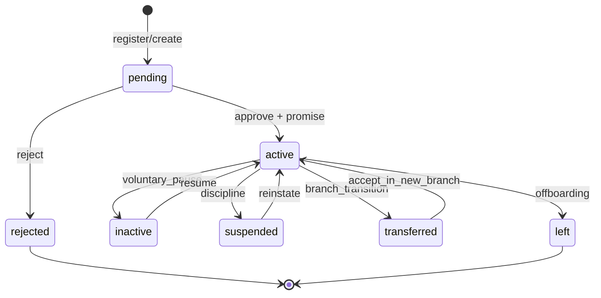

### SM-2 — Plan Approval (Project / Planning)

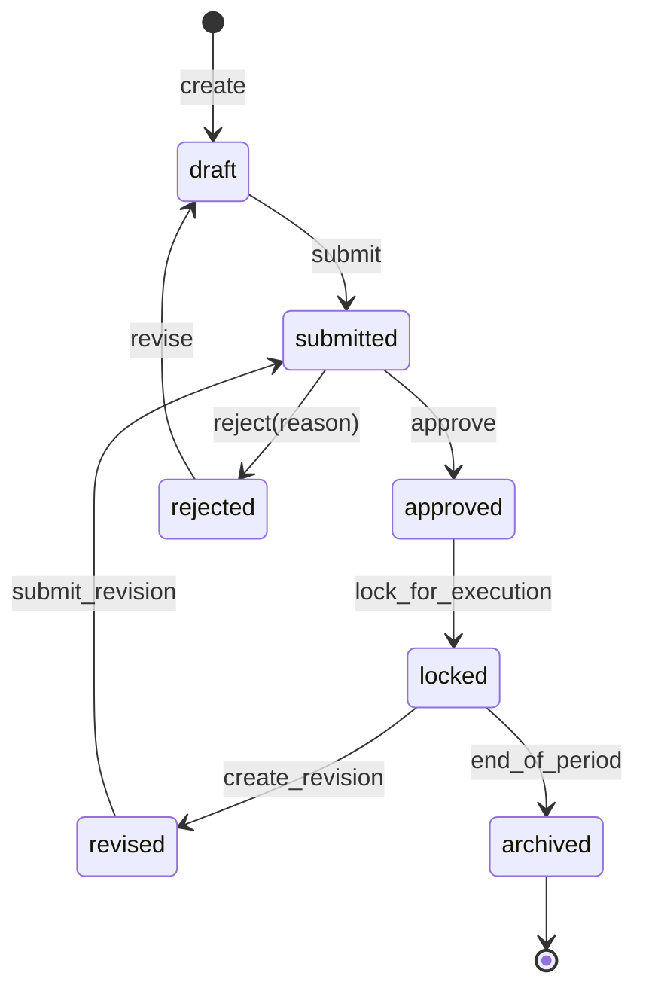

### SM-3 — Project Lifecycle

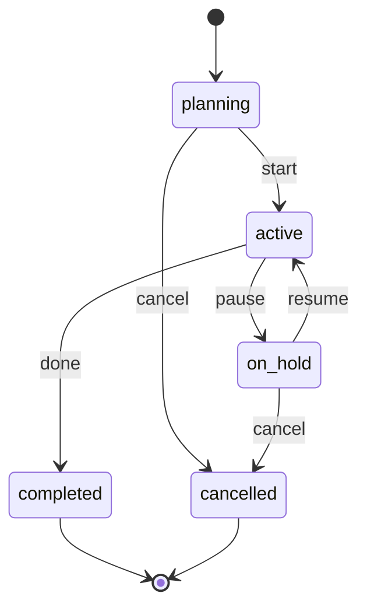

### SM-4 — Task Lifecycle

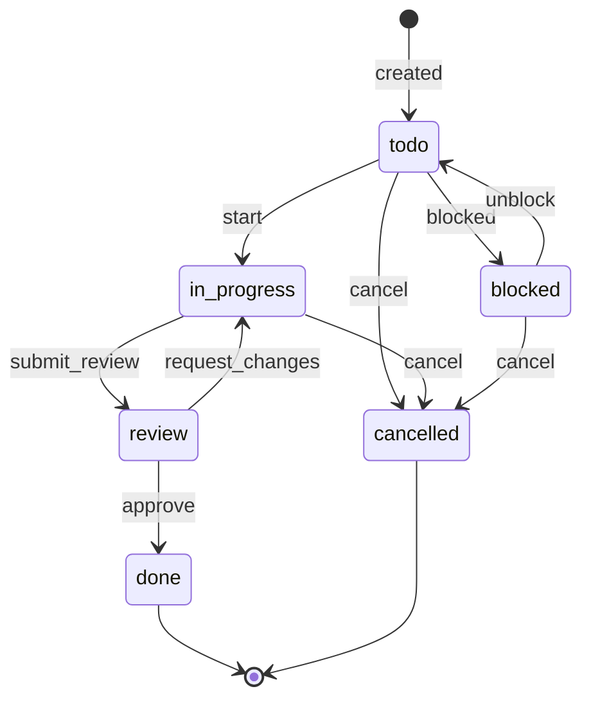

### SM-5 — Ticket / Request & Approval

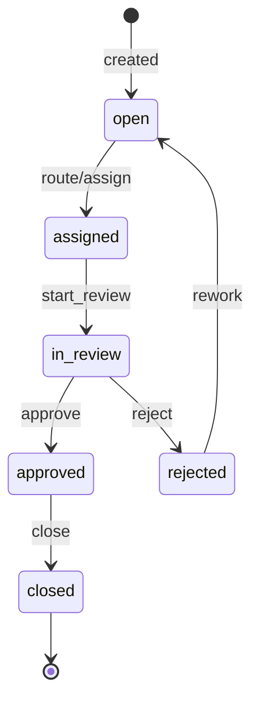

### SM-6 — Financial Transaction (Ledger-first)

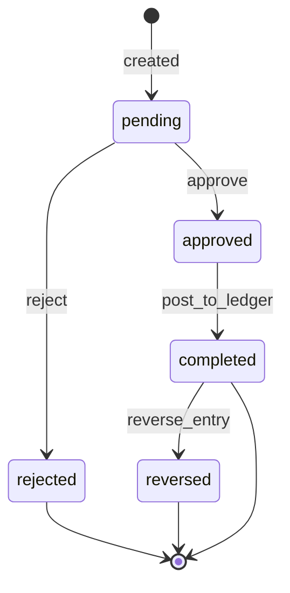

### SM-7 — Member Fee (Nguyệt liễm / Trại phí / ...)

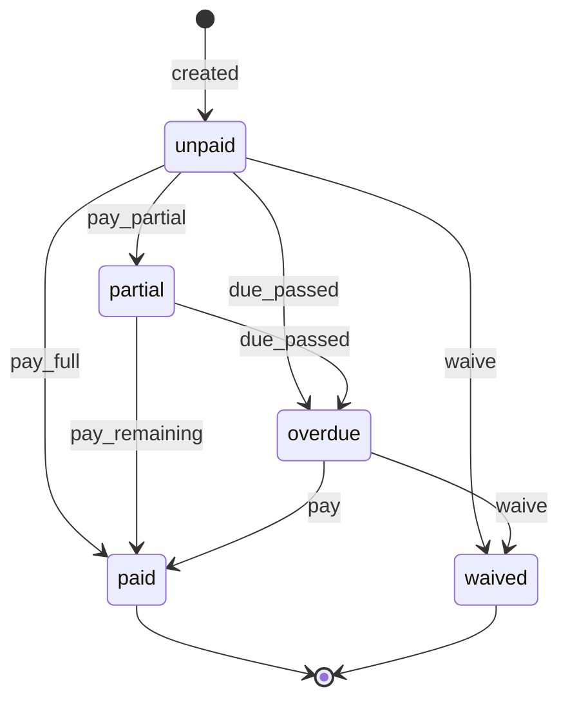

### SM-8 — Asset Loan (Checkout/Checkin)

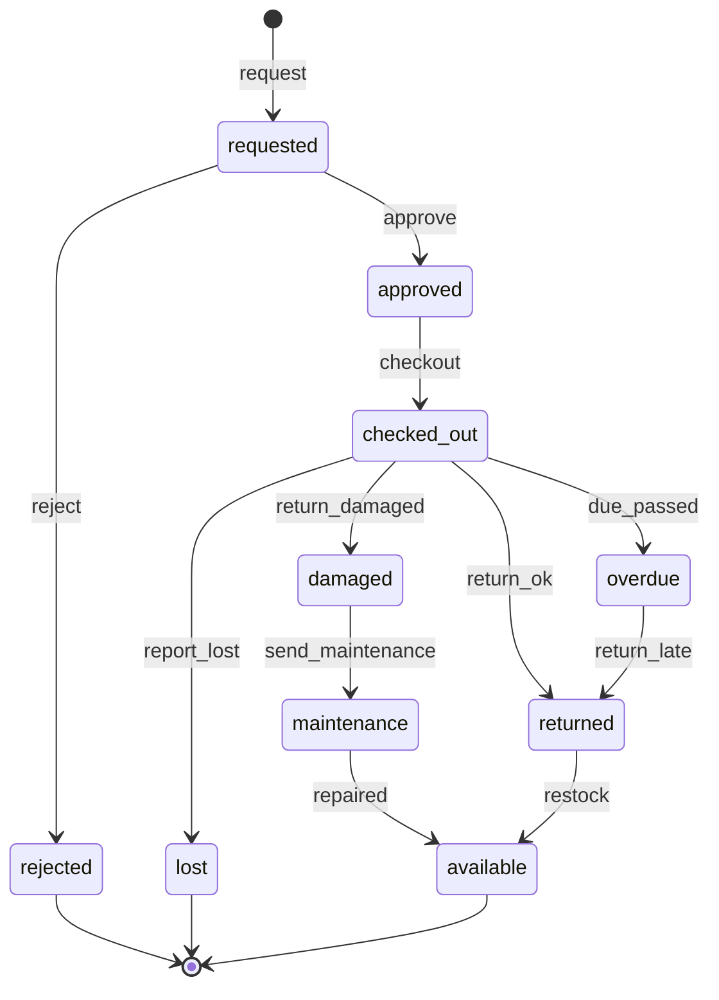

### SM-9 — Quiz Attempt (LMS)

```mermaid
stateDiagram-v2
  [*] --> not_started
  not_started --> in_progress: start
  in_progress --> submitted: submit
  submitted --> graded: auto_grade/manual_grade
  graded --> passed: score>=passing
  graded --> failed: score<passing
  failed --> in_progress: retry(if_allowed)
  failed --> locked: retries_exhausted
  passed --> [*]
  locked --> [*]
```

### SM-10 — Skill Progress (Scout Skillbook)

```mermaid
stateDiagram-v2
  [*] --> not_started
  not_started --> in_progress: start
  in_progress --> submitted: submit_evidence
  submitted --> verified: leader_verify
  verified --> awarded: award
  submitted --> in_progress: reject_and_rework
  awarded --> [*]
```

### SM-11 — Rank Progression (Scout)

```mermaid
stateDiagram-v2
  [*] --> in_progress
  in_progress --> eligible: auto_check
  eligible --> proposed: leader_submit
  proposed --> approved: council/ldt_approve
  approved --> ceremonied: ceremony_done
  ceremonied --> completed: finalize
  in_progress --> in_progress: continue_progress
  completed --> [*]
```

### SM-12 — Session (Buổi Sinh hoạt)

```mermaid
stateDiagram-v2
  [*] --> planned: create
  planned --> published: publish
  published --> running: start
  running --> debriefed: debrief
  debriefed --> archived: archive
  planned --> cancelled: cancel
  published --> cancelled: cancel
  cancelled --> [*]
  archived --> [*]
```

### SM-13 — Event/Camp

```mermaid
stateDiagram-v2
  [*] --> planning: create
  planning --> published: publish
  published --> registration_open: open_registration
  registration_open --> registration_closed: close_registration
  registration_closed --> confirmed: confirm_list + consent_done
  confirmed --> checked_in: event_day_checkin
  checked_in --> completed: checkout + complete
  completed --> reported: post_report
  planning --> cancelled: cancel
  published --> cancelled: cancel
  registration_open --> cancelled: cancel
  cancelled --> [*]
  reported --> [*]
```

### SM-14 — Cross-module Event Sync (conceptual)

```mermaid
flowchart TB
  A[State change in Module X] --> B[DB Transaction committed]
  B --> C[Domain Event written to core.domain_events]
  C --> D[Publish to Event Bus]
  D --> E[Consumers handle event]
  E --> F[Update projections: dashboards, leaderboard, exp]
  E --> G[Send notifications: in-app + Zalo]
  E --> H[Write audit log]
```

---

### SM-15 — Workflow Run (Process/SOP)

```mermaid
stateDiagram-v2
    [*] --> draft
    draft --> published : publish workflow
    published --> running : trigger matched/manual run
    running --> waiting : delay/human approval
    waiting --> running : resume
    running --> succeeded : all actions complete
    running --> failed : action timeout/error
    running --> cancelled : operator abort
    succeeded --> archived
    failed --> archived
    cancelled --> archived
```

## PHẦN X — CHECKLISTS (FULL)

### 10.0 Data Consistency Checklist

| #     | Checklist                                          | Owner      | DoD                                        |
| ----- | -------------------------------------------------- | ---------- | ------------------------------------------ |
| DC-01 | Mọi bảng có `org_id` + RLS enable                  | Backend/DB | Không query nào leak cross-org             |
| DC-02 | Canonical IDs: `person_id` (HRM) dùng xuyên module | Backend    | Không tạo “member_id” chồng chéo           |
| DC-03 | Transaction + Event: “1 DB TX + 1 Domain Event”    | Backend    | Event store có record cho mọi state change |
| DC-04 | Idempotency cho endpoints tạo/verify/award         | Backend    | Re-run request không tạo double            |
| DC-05 | Data ownership theo bounded context                | Tech Lead  | Không module nào write DB của module khác  |
| DC-06 | Migrations có version + rollback                   | DevOps     | Flyway/Liquibase/Prisma migrate chạy CI    |
| DC-07 | Seed data tối thiểu (Org demo)                     | Backend    | E2E smoke chạy được trên seed              |
| DC-08 | Referential integrity + indexes                    | DB         | EXPLAIN không full-scan các query chính    |

### 10.1 Error Handling Checklist

| #     | Checklist                                              | Owner          | DoD                                   |
| ----- | ------------------------------------------------------ | -------------- | ------------------------------------- |
| ER-01 | Error format chuẩn `{code,message,details,request_id}` | Backend        | Tất cả controllers dùng filter chung  |
| ER-02 | Request tracing: `X-Request-Id`                        | Backend/DevOps | Logs có request_id, user_id, org_id   |
| ER-03 | Retry + DLQ cho worker                                 | DevOps         | Pub/Sub DLQ/Dead-letter policy        |
| ER-04 | Timeout budgets (DB/API)                               | Backend        | timeouts rõ ràng, không treo          |
| ER-05 | Validation fail returns 400 w/ fields                  | Backend        | Zod/class-validator mapping           |
| ER-06 | File upload errors safe                                | Backend        | MIME sniff + size limit + safe delete |

### 10.2 Security Checklist (Child Safety = P0)

| #     | Checklist                                   | Owner           | DoD                                         |
| ----- | ------------------------------------------- | --------------- | ------------------------------------------- |
| SE-01 | Firebase/Identity verify token server-side  | Backend         | Reject invalid/expired tokens               |
| SE-02 | RBAC + scope (Org/Branch/Unit)              | Backend         | CASL policies test coverage                 |
| SE-03 | RLS enforced in DB                          | DB              | policies exist for all tables               |
| SE-04 | Audit log for sensitive actions             | Backend         | verify/award/approval/config changes logged |
| SE-05 | PII encryption at rest for sensitive fields | DB              | pgcrypto/KMS plan defined                   |
| SE-06 | Signed URLs for child media                 | Backend         | TTL enforced; no public bucket              |
| SE-07 | Content moderation (comments/uploads)       | Backend         | basic profanity + report/flag               |
| SE-08 | Notification quiet hours for <18            | Product/Backend | 22:00–07:00 default                         |
| SE-09 | Data retention & erasure flow               | Product/Backend | 90‑day retention + delete workflow          |

### 10.3 Performance Checklist

| #     | Checklist                               | Owner   | DoD                       |
| ----- | --------------------------------------- | ------- | ------------------------- |
| PF-01 | Cloud Run `max-instances` guardrail     | DevOps  | max set (cost control)    |
| PF-02 | Connection pool limit (Cloud SQL micro) | Backend | Prisma pool <= 5          |
| PF-03 | Hot paths cached (LRU TTL)              | Backend | cache hit ratio tracked   |
| PF-04 | Leaderboard in Redis ZSET               | Backend | query < 100ms for top 100 |
| PF-05 | Export jobs async (queue)               | Backend | no long request > 30s     |
| PF-06 | Index strategy for org_id filters       | DB      | p95 query time < 200ms    |

### 10.4 Testing Checklist

| #     | Checklist                        | Owner     | DoD                             |
| ----- | -------------------------------- | --------- | ------------------------------- |
| TS-01 | Unit tests for state transitions | Backend   | SM-1..SM-13 transitions covered |
| TS-02 | Contract tests for events        | Backend   | schema validated in CI          |
| TS-03 | API tests (Supertest)            | Backend   | basic CRUD per module           |
| TS-04 | E2E tests (Playwright)           | QA        | login + core journeys J1–J5     |
| TS-05 | Load test (k6)                   | DevOps    | p95 latency under target        |
| TS-06 | Security test (OWASP checks)     | DevSecOps | baseline scan ok                |

### 10.5 Go-Live Checklist

| #     | Checklist                                             | Owner           | DoD                                 |
| ----- | ----------------------------------------------------- | --------------- | ----------------------------------- |
| GL-01 | Billing budget ≤ 800.000 VND/tháng + alerts + Pub/Sub | DevOps          | 50/80/100/120% actions set          |
| GL-02 | Monitoring dashboards + alerts                        | DevOps          | error rate, latency, spend, DB conn |
| GL-03 | Backup + restore drill                                | DevOps          | restore works on staging            |
| GL-04 | Data import plan (members/assets)                     | Product/Backend | CSV import validated                |
| GL-05 | Training materials for Trưởng                         | Product         | 1h onboarding script + SOP          |
| GL-06 | Rollback plan                                         | DevOps          | previous revision deployable        |

---

### 10.6 Checklist-to-Roadmap Synchronization Matrix

| Checklist               | Roadmap WP tối thiểu phải cover      | Module / phần bị chặn nếu fail          |
| ----------------------- | ------------------------------------ | --------------------------------------- |
| Data consistency        | WP-1.2, 3.1, 3.2, 5.1, 6.1, 9.1, 9.2 | mọi module có state/status/write models |
| Error handling          | WP-0.4, 1.4, 4.2, 5.4, 7.1, 9.4      | UI shell, APIs, workers, notifications  |
| Security / Child safety | WP-1.1, 2.1, 2.4, 3.5, 7.1, 8.1, 9.6 | HRM, Scout, Files, Notifications, Auth  |
| Performance             | WP-0.3, 3.7, 4.2, 5.2, 6.3, 8.1      | shell, reward, arena, reports, finance  |
| Testing                 | WP-0.4 + tất cả WP nghiệp vụ         | toàn platform                           |
| Go-live                 | WP-7.3, 8.2, 9.7, 9.8                | release / production cutover            |

### 10.7 Checklist Execution Ownership

- **PM/BA**: xác nhận checklist nghiệp vụ, acceptance criteria, coverage theo module.
- **UX/UI**: xác nhận screen states, a11y, reduced motion, offline/low-cost mode.
- **Backend**: xác nhận OpenAPI, state machine, schema/RLS, events, workers, idempotency.
- **Frontend**: xác nhận routes, forms, data fetching, error boundaries, optimistic updates đúng contract.
- **QA**: xác nhận unit/integration/contract/e2e evidence và regression pack.
- **SRE/Security**: xác nhận secrets, logs, rate limits, backups, budget guardrails, canary, rollback.
- **CTO/LĐT sign-off**: chỉ ký khi checklist pass + manifest + release evidence đã có link rõ ràng.

## PHẦN XI — KIỂM SOÁT TÀI LIỆU

### 11.1 Lịch sử Phiên bản

| Phiên bản | Ngày           | Thay đổi                                                                                                                                                                                                                                                                                   |
| --------- | -------------- | ------------------------------------------------------------------------------------------------------------------------------------------------------------------------------------------------------------------------------------------------------------------------------------------ |
| v1.0      | 03/2026        | Bản gốc (công ty ngoài) — 10 modules, chỉ kỹ thuật                                                                                                                                                                                                                                         |
| v2.0      | 04/03/2026     | Hợp nhất + Budget 800.000 VND/tháng VND + Module 11+12 + State Machines + Checklists                                                                                                                                                                                                       |
| **v3.0**  | **05/03/2026** | **PRD hoàn chỉnh** — Mỗi module có lớp nghiệp vụ (tính năng, luồng, logic, user stories) TRƯỚC kỹ thuật. Module 11+12 sáp nhập vào Module 8. Roadmap Jira-structured (Story→Phase→WP→Milestone→Task). Child Safety Checklist. Tham chiếu nghiên cứu quốc tế (WOSM SPICES, SDT, IEEE 29148) |

### 11.2 Tài liệu Liên quan

| Tài liệu                                        | Mã số              |
| ----------------------------------------------- | ------------------ |
| Quy chế Tổ chức và Hoạt động DTNDD              | DTNDD-QC-001       |
| Thiện Tâm Kỳ Truyện — Quy tắc Thiết kế Nhiệm vụ | TTNDD-QUEST-001    |
| Nguyên lý Hướng Đạo 2017                        | HVN-NL-2017        |
| Phương pháp Hướng Đạo (WOSM)                    | WOSM-METHOD-001    |
| Nghiên cứu PRD Foundation (Deep Research)       | TTNDD-RESEARCH-001 |

---

> **📋 GHI CHÚ CUỐI TÀI LIỆU:**
>
> Tài liệu này là **tài liệu sống** — phải cập nhật khi có thay đổi kiến trúc hoặc business logic. Mọi thay đổi qua **Change Request (CR)** phê duyệt bởi LĐT và Tech Lead.
>
> **Ba nguyên tắc thiết kế xuyên suốt:**
>
> 1. **Business first, Tech second**: Hiểu "xây cái gì" trước "xây bằng gì"
> 2. **Child Safety = P0**: Mọi lỗ hổng an toàn trẻ em → fix ngay lập tức
> 3. **SPICES coverage**: Mọi tính năng phải map được vào ít nhất 1 chiều phát triển SPICES
>
> **Ngân sách**: ≤ 800.000 VND/tháng. Budget alerts 50%/80%/100%/120% với auto-shutdown.

---

**— Hết TTNDD_OPS v3.0 — Tài liệu Đặc tả Sản phẩm & Kỹ thuật Toàn diện —**

_"Cung Kiếm Trí Tuệ — Xây Nền Vững Chắc Cho Hành Trình Thiện Tâm"_

````

---


## PHỤ LỤC A — DATABASE SCHEMAS ĐẦY ĐỦ (All Modules)

> **Tất cả bảng đều có `org_id`** (multi-tenant) và **RLS enabled**. Schema dưới đây là source of truth cho Prisma migration.

### A.0 Schema Coverage Map

| Section | Module covered | Ghi chú |
|---|---|---|
| A.1 | Module 10 + Shared foundation | Org, IAM, tenant, audit, domain events, file refs |
| A.2 | Module 1 — HRM | canonical person/member/guardian/transfer |
| A.3 | Module 2 — Project/Planning | plans/projects/work tree |
| A.4 | Module 3 — Ticket/Approval | requests, approvals, history |
| A.5 | Module 4 — Finance | ledger, fees, sponsors, contributions |
| A.6 | Module 5 — Assets | inventory, loans, maintenance |
| A.7 | Module 6 — Process/SOP | workflow defs/runs + SOP versioning |
| A.8 | Module 7 — LMS | courses, quizzes, battles, progress |
| A.9 | Module 8 — Scout Core | ranks, skills, sessions, events, mentoring |
| A.10 | Module 9 — Reward Engine | exp, badges, penalties, redemptions |

### A.1 Core Tables (Nền tảng — Module 10 + Shared Foundation)

```sql
-- ============================================================
-- CORE: Multi-Tenant Foundation
-- ============================================================

CREATE TABLE organizations (
    id              UUID PRIMARY KEY DEFAULT gen_random_uuid(),
    slug            VARCHAR(100) UNIQUE NOT NULL,
    name            VARCHAR(255) NOT NULL,
    full_name       TEXT,
    logo_url        TEXT,
    settings        JSONB DEFAULT '{}',
    subscription_plan VARCHAR(50) DEFAULT 'basic',
    is_active       BOOLEAN DEFAULT TRUE,
    created_at      TIMESTAMPTZ DEFAULT NOW(),
    updated_at      TIMESTAMPTZ DEFAULT NOW()
);

CREATE TABLE branches (
    id              UUID PRIMARY KEY DEFAULT gen_random_uuid(),
    org_id          UUID NOT NULL REFERENCES organizations(id) ON DELETE CASCADE,
    code            VARCHAR(50) NOT NULL,
    name            VARCHAR(100) NOT NULL,
    min_age         INTEGER,
    max_age         INTEGER,
    color_theme     VARCHAR(50),
    narrative_name  VARCHAR(100),
    settings        JSONB DEFAULT '{}',
    UNIQUE(org_id, code)
);

CREATE TABLE units (
    id              UUID PRIMARY KEY DEFAULT gen_random_uuid(),
    org_id          UUID NOT NULL REFERENCES organizations(id),
    branch_id       UUID NOT NULL REFERENCES branches(id),
    name            VARCHAR(100) NOT NULL,
    totem_name      VARCHAR(100),
    unit_type       VARCHAR(50),
    parent_unit_id  UUID REFERENCES units(id),
    leader_user_id  UUID,
    created_at      TIMESTAMPTZ DEFAULT NOW()
);

CREATE TABLE users (
    id              UUID PRIMARY KEY DEFAULT gen_random_uuid(),
    firebase_uid    VARCHAR(128) UNIQUE NOT NULL,
    email           VARCHAR(255) UNIQUE,
    phone           VARCHAR(20),
    display_name    VARCHAR(255),
    avatar_url      TEXT,
    is_active       BOOLEAN DEFAULT TRUE,
    created_at      TIMESTAMPTZ DEFAULT NOW(),
    updated_at      TIMESTAMPTZ DEFAULT NOW()
);

CREATE TABLE org_members (
    id              UUID PRIMARY KEY DEFAULT gen_random_uuid(),
    org_id          UUID NOT NULL REFERENCES organizations(id) ON DELETE CASCADE,
    user_id         UUID NOT NULL REFERENCES users(id) ON DELETE CASCADE,
    role            VARCHAR(50) NOT NULL CHECK (role IN ('super_admin','admin','user','guest')),
    truong_level    VARCHAR(50),
    branch_id       UUID REFERENCES branches(id),
    unit_id         UUID REFERENCES units(id),
    member_code     VARCHAR(50),
    joined_date     DATE,
    status          VARCHAR(50) DEFAULT 'active',
    linked_member_id UUID,
    scout_name      VARCHAR(100),
    hero_name       VARCHAR(100),
    meta            JSONB DEFAULT '{}',
    created_at      TIMESTAMPTZ DEFAULT NOW(),
    UNIQUE(org_id, user_id)
);

-- Domain Events (Event Sourcing)
CREATE TABLE domain_events (
    id              UUID PRIMARY KEY DEFAULT gen_random_uuid(),
    org_id          UUID NOT NULL REFERENCES organizations(id),
    event_type      VARCHAR(200) NOT NULL,
    aggregate_id    UUID NOT NULL,
    aggregate_type  VARCHAR(100) NOT NULL,
    payload         JSONB NOT NULL,
    actor_user_id   UUID REFERENCES users(id),
    processed       BOOLEAN DEFAULT FALSE,
    processed_at    TIMESTAMPTZ,
    created_at      TIMESTAMPTZ DEFAULT NOW()
);

-- RLS Policies
ALTER TABLE organizations ENABLE ROW LEVEL SECURITY;
ALTER TABLE branches ENABLE ROW LEVEL SECURITY;
ALTER TABLE units ENABLE ROW LEVEL SECURITY;
ALTER TABLE org_members ENABLE ROW LEVEL SECURITY;

CREATE POLICY "org_isolation" ON org_members
    USING (org_id = current_setting('app.current_org_id')::uuid);

CREATE POLICY "user_own_data" ON org_members
    USING (
        org_id = current_setting('app.current_org_id')::uuid
        AND (
            current_setting('app.user_role') IN ('super_admin', 'admin')
            OR id = current_setting('app.current_member_id')::uuid
            OR id IN (
                SELECT linked_member_id FROM org_members
                WHERE id = current_setting('app.current_member_id')::uuid
            )
        )
    );
````

### A.2 Module 1 — HRM

```sql
CREATE TABLE member_profiles (
    id              UUID PRIMARY KEY DEFAULT gen_random_uuid(),
    org_id          UUID NOT NULL REFERENCES organizations(id),
    org_member_id   UUID UNIQUE NOT NULL REFERENCES org_members(id),
    full_name       VARCHAR(255) NOT NULL,
    birth_date      DATE,
    gender          VARCHAR(20),
    id_card         VARCHAR(50),
    address         TEXT,
    photo_url       TEXT,
    personal_phone  VARCHAR(20),
    personal_email  VARCHAR(255),
    zalo_id         VARCHAR(100),
    guardian_name   VARCHAR(255),
    guardian_phone  VARCHAR(20),
    guardian_relation VARCHAR(50),
    guardian_zalo   VARCHAR(100),
    promise_date    DATE,
    uniform_size    VARCHAR(20),
    health_notes    TEXT,
    emergency_contact TEXT,
    wood_badge_level VARCHAR(50),
    specializations  TEXT[],
    join_reason     TEXT,
    created_by      UUID REFERENCES users(id),
    created_at      TIMESTAMPTZ DEFAULT NOW(),
    updated_at      TIMESTAMPTZ DEFAULT NOW()
);

CREATE TABLE member_branch_history (
    id              UUID PRIMARY KEY DEFAULT gen_random_uuid(),
    org_id          UUID NOT NULL,
    org_member_id   UUID NOT NULL REFERENCES org_members(id),
    from_branch_id  UUID REFERENCES branches(id),
    to_branch_id    UUID REFERENCES branches(id),
    from_unit_id    UUID REFERENCES units(id),
    to_unit_id      UUID REFERENCES units(id),
    transition_date DATE NOT NULL,
    reason          TEXT,
    approved_by     UUID REFERENCES users(id),
    created_at      TIMESTAMPTZ DEFAULT NOW()
);

CREATE TABLE org_chart_nodes (
    id              UUID PRIMARY KEY DEFAULT gen_random_uuid(),
    org_id          UUID NOT NULL REFERENCES organizations(id),
    node_type       VARCHAR(50) NOT NULL,
    name            VARCHAR(255) NOT NULL,
    parent_node_id  UUID REFERENCES org_chart_nodes(id),
    org_member_id   UUID REFERENCES org_members(id),
    position_title  VARCHAR(100),
    display_order   INTEGER DEFAULT 0,
    metadata        JSONB DEFAULT '{}',
    created_at      TIMESTAMPTZ DEFAULT NOW()
);
```

### A.3 Module 2 — Project Management

```sql
CREATE TABLE projects (
    id UUID PRIMARY KEY DEFAULT gen_random_uuid(),
    org_id UUID NOT NULL REFERENCES organizations(id),
    title VARCHAR(500) NOT NULL, description TEXT,
    project_type VARCHAR(50), status VARCHAR(50) DEFAULT 'planning',
    source_plan_id UUID, objectives JSONB DEFAULT '[]', key_results JSONB DEFAULT '[]',
    owner_id UUID REFERENCES org_members(id),
    start_date DATE, end_date DATE, settings JSONB DEFAULT '{}',
    created_by UUID REFERENCES users(id),
    created_at TIMESTAMPTZ DEFAULT NOW(), updated_at TIMESTAMPTZ DEFAULT NOW()
);

CREATE TABLE project_phases (
    id UUID PRIMARY KEY DEFAULT gen_random_uuid(), org_id UUID NOT NULL,
    project_id UUID NOT NULL REFERENCES projects(id) ON DELETE CASCADE,
    title VARCHAR(255) NOT NULL, description TEXT, order_index INTEGER DEFAULT 0,
    status VARCHAR(50) DEFAULT 'not_started', start_date DATE, end_date DATE,
    created_at TIMESTAMPTZ DEFAULT NOW()
);

CREATE TABLE project_sprints (
    id UUID PRIMARY KEY DEFAULT gen_random_uuid(), org_id UUID NOT NULL,
    phase_id UUID NOT NULL REFERENCES project_phases(id) ON DELETE CASCADE,
    title VARCHAR(255) NOT NULL, goal TEXT, status VARCHAR(50) DEFAULT 'planned',
    start_date DATE, end_date DATE, created_at TIMESTAMPTZ DEFAULT NOW()
);

CREATE TABLE work_packages (
    id UUID PRIMARY KEY DEFAULT gen_random_uuid(), org_id UUID NOT NULL,
    sprint_id UUID REFERENCES project_sprints(id),
    phase_id UUID REFERENCES project_phases(id),
    project_id UUID NOT NULL REFERENCES projects(id),
    title VARCHAR(500) NOT NULL, description TEXT,
    status VARCHAR(50) DEFAULT 'todo',
    assignee_id UUID REFERENCES org_members(id),
    start_date DATE, due_date DATE,
    estimated_hours DECIMAL(6,2), actual_hours DECIMAL(6,2),
    progress INTEGER DEFAULT 0 CHECK (progress BETWEEN 0 AND 100),
    priority VARCHAR(20) DEFAULT 'medium', custom_fields JSONB DEFAULT '{}',
    created_at TIMESTAMPTZ DEFAULT NOW(), updated_at TIMESTAMPTZ DEFAULT NOW()
);

CREATE TABLE tasks (
    id UUID PRIMARY KEY DEFAULT gen_random_uuid(), org_id UUID NOT NULL,
    work_package_id UUID REFERENCES work_packages(id),
    project_id UUID NOT NULL REFERENCES projects(id),
    title VARCHAR(500) NOT NULL, description TEXT,
    status VARCHAR(50) DEFAULT 'todo', type VARCHAR(50) DEFAULT 'task',
    assignee_ids UUID[], reporter_id UUID REFERENCES org_members(id),
    start_date DATE, due_date DATE, story_points INTEGER,
    priority VARCHAR(20) DEFAULT 'medium', tags TEXT[],
    attachments JSONB DEFAULT '[]',
    parent_task_id UUID REFERENCES tasks(id),
    custom_fields JSONB DEFAULT '{}', position FLOAT DEFAULT 0,
    created_by UUID REFERENCES users(id),
    created_at TIMESTAMPTZ DEFAULT NOW(), updated_at TIMESTAMPTZ DEFAULT NOW()
);

CREATE TABLE plans (
    id UUID PRIMARY KEY DEFAULT gen_random_uuid(),
    org_id UUID NOT NULL REFERENCES organizations(id),
    title VARCHAR(500) NOT NULL, plan_type VARCHAR(50),
    section_I_description TEXT, section_II_objectives JSONB,
    section_III_outcomes JSONB, section_IV_activities JSONB,
    section_V_personnel JSONB, section_VI_content JSONB,
    section_VII_timeline JSONB, section_VIII_proposal TEXT,
    section_IX_budget JSONB,
    status VARCHAR(50) DEFAULT 'draft',
    submitted_by UUID REFERENCES org_members(id), submitted_at TIMESTAMPTZ,
    approved_by UUID REFERENCES org_members(id), approved_at TIMESTAMPTZ,
    rejection_reason TEXT,
    generated_project_id UUID REFERENCES projects(id),
    created_at TIMESTAMPTZ DEFAULT NOW(), updated_at TIMESTAMPTZ DEFAULT NOW()
);
```

### A.4 Module 3 — Tickets

```sql
CREATE TABLE tickets (
    id UUID PRIMARY KEY DEFAULT gen_random_uuid(), org_id UUID NOT NULL REFERENCES organizations(id),
    ticket_number VARCHAR(50) NOT NULL, title VARCHAR(500) NOT NULL, description TEXT,
    category VARCHAR(100), priority VARCHAR(20) DEFAULT 'medium', status VARCHAR(50) DEFAULT 'open',
    requester_id UUID NOT NULL REFERENCES org_members(id),
    assignee_id UUID REFERENCES org_members(id),
    attachments JSONB DEFAULT '[]', approval_notes TEXT, resolved_at TIMESTAMPTZ,
    due_date DATE, tags TEXT[], custom_fields JSONB DEFAULT '{}',
    created_at TIMESTAMPTZ DEFAULT NOW(), updated_at TIMESTAMPTZ DEFAULT NOW()
);

CREATE TABLE ticket_comments (
    id UUID PRIMARY KEY DEFAULT gen_random_uuid(), org_id UUID NOT NULL,
    ticket_id UUID NOT NULL REFERENCES tickets(id) ON DELETE CASCADE,
    author_id UUID NOT NULL REFERENCES org_members(id),
    content TEXT NOT NULL, attachments JSONB DEFAULT '[]',
    is_internal BOOLEAN DEFAULT FALSE, created_at TIMESTAMPTZ DEFAULT NOW()
);

CREATE TABLE ticket_status_history (
    id UUID PRIMARY KEY DEFAULT gen_random_uuid(),
    ticket_id UUID NOT NULL REFERENCES tickets(id),
    from_status VARCHAR(50), to_status VARCHAR(50) NOT NULL,
    changed_by UUID REFERENCES users(id), notes TEXT,
    created_at TIMESTAMPTZ DEFAULT NOW()
);
```

### A.5 Module 4 — Finance

```sql
CREATE TABLE financial_accounts (
    id UUID PRIMARY KEY DEFAULT gen_random_uuid(), org_id UUID NOT NULL REFERENCES organizations(id),
    name VARCHAR(255) NOT NULL, account_type VARCHAR(50),
    branch_id UUID REFERENCES branches(id),
    current_balance DECIMAL(15,2) DEFAULT 0, currency VARCHAR(10) DEFAULT 'VND',
    description TEXT, is_active BOOLEAN DEFAULT TRUE, created_at TIMESTAMPTZ DEFAULT NOW()
);

CREATE TABLE financial_transactions (
    id UUID PRIMARY KEY DEFAULT gen_random_uuid(), org_id UUID NOT NULL REFERENCES organizations(id),
    account_id UUID NOT NULL REFERENCES financial_accounts(id),
    transaction_type VARCHAR(20) NOT NULL, category VARCHAR(100),
    amount DECIMAL(15,2) NOT NULL, currency VARCHAR(10) DEFAULT 'VND',
    source_type VARCHAR(50), source_id UUID, description TEXT NOT NULL,
    recorded_by UUID NOT NULL REFERENCES org_members(id),
    approved_by UUID REFERENCES org_members(id), status VARCHAR(50) DEFAULT 'pending',
    receipt_urls TEXT[], reference_no VARCHAR(100), transaction_date DATE NOT NULL,
    created_at TIMESTAMPTZ DEFAULT NOW()
);

CREATE TABLE sponsors (
    id UUID PRIMARY KEY DEFAULT gen_random_uuid(), org_id UUID NOT NULL REFERENCES organizations(id),
    name VARCHAR(255) NOT NULL, contact_info JSONB DEFAULT '{}',
    sponsor_type VARCHAR(50), total_contributed DECIMAL(15,2) DEFAULT 0,
    is_active BOOLEAN DEFAULT TRUE, notes TEXT, created_at TIMESTAMPTZ DEFAULT NOW()
);

CREATE TABLE material_contributions (
    id UUID PRIMARY KEY DEFAULT gen_random_uuid(), org_id UUID NOT NULL REFERENCES organizations(id),
    contributor_type VARCHAR(50), contributor_id UUID,
    item_name VARCHAR(255) NOT NULL, quantity DECIMAL(10,2), unit VARCHAR(50),
    estimated_value DECIMAL(15,2), received_date DATE, description TEXT, photo_urls TEXT[],
    created_at TIMESTAMPTZ DEFAULT NOW()
);

CREATE TABLE member_fees (
    id UUID PRIMARY KEY DEFAULT gen_random_uuid(), org_id UUID NOT NULL,
    org_member_id UUID NOT NULL REFERENCES org_members(id),
    fee_type VARCHAR(50), fee_period VARCHAR(20),
    amount_due DECIMAL(15,2) NOT NULL, amount_paid DECIMAL(15,2) DEFAULT 0,
    due_date DATE, paid_date DATE, status VARCHAR(50) DEFAULT 'unpaid',
    transaction_id UUID REFERENCES financial_transactions(id), notes TEXT,
    created_at TIMESTAMPTZ DEFAULT NOW()
);
```

### A.6 Module 5 — Assets

```sql
CREATE TABLE asset_categories (
    id UUID PRIMARY KEY DEFAULT gen_random_uuid(), org_id UUID NOT NULL REFERENCES organizations(id),
    name VARCHAR(100) NOT NULL, description TEXT,
    owner_type VARCHAR(20), branch_id UUID REFERENCES branches(id),
    icon VARCHAR(50), created_at TIMESTAMPTZ DEFAULT NOW()
);

CREATE TABLE assets (
    id UUID PRIMARY KEY DEFAULT gen_random_uuid(), org_id UUID NOT NULL REFERENCES organizations(id),
    asset_code VARCHAR(100) UNIQUE NOT NULL, name VARCHAR(255) NOT NULL,
    category_id UUID NOT NULL REFERENCES asset_categories(id),
    owner_type VARCHAR(20) DEFAULT 'org', branch_id UUID REFERENCES branches(id),
    status VARCHAR(50) DEFAULT 'available', condition VARCHAR(50) DEFAULT 'good',
    quantity INTEGER DEFAULT 1, available_qty INTEGER DEFAULT 1, unit VARCHAR(50),
    purchase_date DATE, purchase_price DECIMAL(15,2), serial_number VARCHAR(100),
    location VARCHAR(255), photo_urls TEXT[], notes TEXT,
    managed_by UUID REFERENCES org_members(id), co_managed_by UUID REFERENCES org_members(id),
    created_at TIMESTAMPTZ DEFAULT NOW(), updated_at TIMESTAMPTZ DEFAULT NOW()
);

CREATE TABLE asset_loans (
    id UUID PRIMARY KEY DEFAULT gen_random_uuid(), org_id UUID NOT NULL,
    asset_id UUID NOT NULL REFERENCES assets(id), quantity INTEGER DEFAULT 1,
    borrower_id UUID NOT NULL REFERENCES org_members(id), purpose TEXT,
    status VARCHAR(50) DEFAULT 'pending',
    requested_at TIMESTAMPTZ DEFAULT NOW(), approved_at TIMESTAMPTZ,
    approved_by UUID REFERENCES org_members(id),
    expected_return DATE NOT NULL, actual_return DATE,
    condition_on_return VARCHAR(50), return_notes TEXT,
    created_at TIMESTAMPTZ DEFAULT NOW()
);
```

### A.7 Module 6 — Process / SOP

```sql
CREATE TABLE workflow_definitions (
    id UUID PRIMARY KEY DEFAULT gen_random_uuid(),
    org_id UUID NOT NULL REFERENCES organizations(id),
    workflow_code VARCHAR(100) NOT NULL,
    name VARCHAR(255) NOT NULL,
    description TEXT,
    status VARCHAR(30) NOT NULL DEFAULT 'draft',
    trigger_type VARCHAR(50) NOT NULL,
    trigger_config JSONB NOT NULL DEFAULT '{}',
    version_no INTEGER NOT NULL DEFAULT 1,
    published_at TIMESTAMPTZ,
    published_by UUID REFERENCES org_members(id),
    created_by UUID REFERENCES org_members(id),
    created_at TIMESTAMPTZ DEFAULT NOW(),
    updated_at TIMESTAMPTZ DEFAULT NOW(),
    UNIQUE(org_id, workflow_code, version_no)
);

CREATE TABLE workflow_nodes (
    id UUID PRIMARY KEY DEFAULT gen_random_uuid(),
    org_id UUID NOT NULL REFERENCES organizations(id),
    workflow_definition_id UUID NOT NULL REFERENCES workflow_definitions(id) ON DELETE CASCADE,
    node_key VARCHAR(100) NOT NULL,
    node_type VARCHAR(30) NOT NULL, -- trigger|condition|action|delay|approval
    label VARCHAR(255) NOT NULL,
    config JSONB NOT NULL DEFAULT '{}',
    position JSONB NOT NULL DEFAULT '{}',
    created_at TIMESTAMPTZ DEFAULT NOW(),
    UNIQUE(workflow_definition_id, node_key)
);

CREATE TABLE workflow_edges (
    id UUID PRIMARY KEY DEFAULT gen_random_uuid(),
    org_id UUID NOT NULL REFERENCES organizations(id),
    workflow_definition_id UUID NOT NULL REFERENCES workflow_definitions(id) ON DELETE CASCADE,
    source_node_key VARCHAR(100) NOT NULL,
    target_node_key VARCHAR(100) NOT NULL,
    edge_condition JSONB DEFAULT '{}',
    created_at TIMESTAMPTZ DEFAULT NOW()
);

CREATE TABLE workflow_runs (
    id UUID PRIMARY KEY DEFAULT gen_random_uuid(),
    org_id UUID NOT NULL REFERENCES organizations(id),
    workflow_definition_id UUID NOT NULL REFERENCES workflow_definitions(id),
    source_event_type VARCHAR(150),
    source_event_id UUID,
    status VARCHAR(30) NOT NULL DEFAULT 'running',
    context JSONB NOT NULL DEFAULT '{}',
    started_at TIMESTAMPTZ DEFAULT NOW(),
    finished_at TIMESTAMPTZ,
    initiated_by UUID REFERENCES org_members(id)
);

CREATE TABLE workflow_run_steps (
    id UUID PRIMARY KEY DEFAULT gen_random_uuid(),
    org_id UUID NOT NULL REFERENCES organizations(id),
    workflow_run_id UUID NOT NULL REFERENCES workflow_runs(id) ON DELETE CASCADE,
    node_key VARCHAR(100) NOT NULL,
    status VARCHAR(30) NOT NULL DEFAULT 'running',
    started_at TIMESTAMPTZ DEFAULT NOW(),
    finished_at TIMESTAMPTZ,
    input_payload JSONB NOT NULL DEFAULT '{}',
    output_payload JSONB NOT NULL DEFAULT '{}',
    error_payload JSONB
);

CREATE TABLE sop_documents (
    id UUID PRIMARY KEY DEFAULT gen_random_uuid(),
    org_id UUID NOT NULL REFERENCES organizations(id),
    document_code VARCHAR(100) NOT NULL,
    title VARCHAR(255) NOT NULL,
    category VARCHAR(100) NOT NULL,
    status VARCHAR(30) NOT NULL DEFAULT 'draft',
    current_version_id UUID,
    owner_id UUID REFERENCES org_members(id),
    created_at TIMESTAMPTZ DEFAULT NOW(),
    updated_at TIMESTAMPTZ DEFAULT NOW(),
    UNIQUE(org_id, document_code)
);

CREATE TABLE sop_versions (
    id UUID PRIMARY KEY DEFAULT gen_random_uuid(),
    org_id UUID NOT NULL REFERENCES organizations(id),
    sop_document_id UUID NOT NULL REFERENCES sop_documents(id) ON DELETE CASCADE,
    version_no INTEGER NOT NULL,
    title VARCHAR(255) NOT NULL,
    content JSONB NOT NULL DEFAULT '{}',
    summary TEXT,
    effective_from TIMESTAMPTZ,
    effective_to TIMESTAMPTZ,
    approved_by UUID REFERENCES org_members(id),
    approved_at TIMESTAMPTZ,
    created_by UUID REFERENCES org_members(id),
    created_at TIMESTAMPTZ DEFAULT NOW(),
    UNIQUE(sop_document_id, version_no)
);
```

### A.8 Module 7 — LMS

```sql
CREATE TABLE courses (
    id UUID PRIMARY KEY DEFAULT gen_random_uuid(), org_id UUID NOT NULL REFERENCES organizations(id),
    title VARCHAR(500) NOT NULL, description TEXT, cover_image_url TEXT,
    category VARCHAR(100), difficulty VARCHAR(20), target_branches UUID[],
    is_public BOOLEAN DEFAULT TRUE, exp_reward INTEGER DEFAULT 0, badge_id UUID,
    created_by UUID REFERENCES org_members(id), status VARCHAR(50) DEFAULT 'draft',
    total_duration INTEGER, created_at TIMESTAMPTZ DEFAULT NOW()
);

CREATE TABLE lessons (
    id UUID PRIMARY KEY DEFAULT gen_random_uuid(), org_id UUID NOT NULL,
    course_id UUID NOT NULL REFERENCES courses(id) ON DELETE CASCADE,
    title VARCHAR(500) NOT NULL, order_index INTEGER DEFAULT 0,
    lesson_type VARCHAR(50),
    content JSONB NOT NULL DEFAULT '{}',
    video_url TEXT, duration INTEGER, exp_reward INTEGER DEFAULT 0,
    is_required BOOLEAN DEFAULT TRUE, created_at TIMESTAMPTZ DEFAULT NOW()
);

CREATE TABLE quizzes (
    id UUID PRIMARY KEY DEFAULT gen_random_uuid(), org_id UUID NOT NULL REFERENCES organizations(id),
    title VARCHAR(500) NOT NULL, description TEXT,
    quiz_type VARCHAR(50), time_limit INTEGER, passing_score INTEGER DEFAULT 70,
    randomize_q BOOLEAN DEFAULT FALSE, max_retries INTEGER DEFAULT 3,
    course_id UUID REFERENCES courses(id),
    exp_reward INTEGER DEFAULT 0, badge_id UUID,
    created_by UUID REFERENCES org_members(id), created_at TIMESTAMPTZ DEFAULT NOW()
);

CREATE TABLE quiz_questions (
    id UUID PRIMARY KEY DEFAULT gen_random_uuid(), org_id UUID NOT NULL,
    quiz_id UUID NOT NULL REFERENCES quizzes(id) ON DELETE CASCADE,
    question_text TEXT NOT NULL, question_type VARCHAR(50),
    options JSONB NOT NULL, correct_answer JSONB, explanation TEXT,
    points INTEGER DEFAULT 10, time_limit INTEGER, media_url TEXT,
    order_index INTEGER DEFAULT 0, created_at TIMESTAMPTZ DEFAULT NOW()
);

CREATE TABLE quiz_battles (
    id UUID PRIMARY KEY DEFAULT gen_random_uuid(), org_id UUID NOT NULL,
    quiz_id UUID NOT NULL REFERENCES quizzes(id),
    host_id UUID NOT NULL REFERENCES org_members(id),
    game_code VARCHAR(10) UNIQUE NOT NULL, status VARCHAR(50) DEFAULT 'waiting',
    max_players INTEGER DEFAULT 30, current_question INTEGER DEFAULT 0,
    started_at TIMESTAMPTZ, ended_at TIMESTAMPTZ, results JSONB DEFAULT '{}',
    created_at TIMESTAMPTZ DEFAULT NOW()
);

CREATE TABLE member_course_progress (
    id UUID PRIMARY KEY DEFAULT gen_random_uuid(), org_id UUID NOT NULL,
    org_member_id UUID NOT NULL REFERENCES org_members(id),
    course_id UUID NOT NULL REFERENCES courses(id),
    status VARCHAR(50) DEFAULT 'not_started', progress_pct INTEGER DEFAULT 0,
    started_at TIMESTAMPTZ, completed_at TIMESTAMPTZ,
    score DECIMAL(5,2), exp_earned INTEGER DEFAULT 0,
    UNIQUE(org_member_id, course_id)
);
```

### A.9 Module 8 — Scout (8A: Rank/Skill, 8B: Sessions, 8C: Events, 8D: Spiritual, 8E: Mentoring)

```sql
-- 8A: Đẳng thứ & Kỹ năng
CREATE TABLE rank_definitions (
    id UUID PRIMARY KEY DEFAULT gen_random_uuid(), org_id UUID NOT NULL REFERENCES organizations(id),
    branch_id UUID NOT NULL REFERENCES branches(id),
    rank_code VARCHAR(100) NOT NULL, rank_name VARCHAR(255) NOT NULL,
    narrative_name VARCHAR(255), rank_order INTEGER NOT NULL,
    description TEXT, icon_url TEXT, badge_image_url TEXT, min_exp INTEGER DEFAULT 0,
    UNIQUE(org_id, branch_id, rank_code)
);

CREATE TABLE skill_groups (
    id UUID PRIMARY KEY DEFAULT gen_random_uuid(), org_id UUID NOT NULL REFERENCES organizations(id),
    branch_id UUID REFERENCES branches(id), name VARCHAR(255) NOT NULL,
    narrative_name VARCHAR(255), description TEXT, icon VARCHAR(100),
    color VARCHAR(20), order_index INTEGER DEFAULT 0
);

CREATE TABLE skills (
    id UUID PRIMARY KEY DEFAULT gen_random_uuid(), org_id UUID NOT NULL REFERENCES organizations(id),
    skill_group_id UUID NOT NULL REFERENCES skill_groups(id),
    branch_id UUID REFERENCES branches(id), rank_id UUID REFERENCES rank_definitions(id),
    skill_code VARCHAR(100) NOT NULL, name VARCHAR(255) NOT NULL,
    narrative_name VARCHAR(255), description TEXT,
    levels JSONB NOT NULL, max_level INTEGER DEFAULT 4, icon_url TEXT,
    is_required BOOLEAN DEFAULT FALSE,
    required_for_rank_id UUID REFERENCES rank_definitions(id),
    exp_per_level INTEGER DEFAULT 10, created_at TIMESTAMPTZ DEFAULT NOW()
);

CREATE TABLE member_skill_progress (
    id UUID PRIMARY KEY DEFAULT gen_random_uuid(), org_id UUID NOT NULL,
    org_member_id UUID NOT NULL REFERENCES org_members(id),
    skill_id UUID NOT NULL REFERENCES skills(id),
    current_level INTEGER DEFAULT 0, criteria_completed JSONB DEFAULT '{}',
    verified_levels JSONB DEFAULT '{}', completed_at TIMESTAMPTZ,
    UNIQUE(org_member_id, skill_id)
);

CREATE TABLE member_ranks (
    id UUID PRIMARY KEY DEFAULT gen_random_uuid(), org_id UUID NOT NULL,
    org_member_id UUID NOT NULL REFERENCES org_members(id),
    branch_id UUID NOT NULL REFERENCES branches(id),
    rank_id UUID NOT NULL REFERENCES rank_definitions(id),
    status VARCHAR(50) DEFAULT 'in_progress',
    started_at DATE, completed_at DATE,
    verified_by UUID REFERENCES org_members(id), ceremony_date DATE, notes TEXT,
    UNIQUE(org_member_id, branch_id, rank_id)
);

CREATE TABLE specialty_badge_definitions (
    id UUID PRIMARY KEY DEFAULT gen_random_uuid(), org_id UUID NOT NULL REFERENCES organizations(id),
    branch_id UUID REFERENCES branches(id), code VARCHAR(100) NOT NULL,
    name VARCHAR(255) NOT NULL, description TEXT, category VARCHAR(100),
    requirements JSONB NOT NULL, badge_image_url TEXT, exp_reward INTEGER DEFAULT 50
);

CREATE TABLE member_specialty_badges (
    id UUID PRIMARY KEY DEFAULT gen_random_uuid(), org_id UUID NOT NULL,
    org_member_id UUID NOT NULL REFERENCES org_members(id),
    specialty_badge_id UUID NOT NULL REFERENCES specialty_badge_definitions(id),
    status VARCHAR(50) DEFAULT 'in_progress', earned_date DATE,
    verified_by UUID REFERENCES org_members(id), notes TEXT,
    UNIQUE(org_member_id, specialty_badge_id)
);

CREATE TABLE habit_definitions (
    id UUID PRIMARY KEY DEFAULT gen_random_uuid(), org_id UUID NOT NULL,
    org_member_id UUID NOT NULL REFERENCES org_members(id),
    habit_name VARCHAR(255) NOT NULL, description TEXT, frequency VARCHAR(50),
    target_count INTEGER DEFAULT 1, exp_per_completion INTEGER DEFAULT 5,
    color VARCHAR(20), icon VARCHAR(50), is_active BOOLEAN DEFAULT TRUE,
    created_at TIMESTAMPTZ DEFAULT NOW()
);

CREATE TABLE habit_logs (
    id UUID PRIMARY KEY DEFAULT gen_random_uuid(), org_id UUID NOT NULL,
    habit_id UUID NOT NULL REFERENCES habit_definitions(id),
    org_member_id UUID NOT NULL REFERENCES org_members(id),
    logged_date DATE NOT NULL, completed BOOLEAN DEFAULT FALSE, notes TEXT,
    UNIQUE(habit_id, logged_date)
);

-- 8B: Sessions & Attendance
CREATE TABLE sessions (
    id UUID PRIMARY KEY DEFAULT gen_random_uuid(), org_id UUID NOT NULL REFERENCES organizations(id),
    branch_id UUID NOT NULL REFERENCES branches(id),
    title VARCHAR(500) NOT NULL, session_date DATE NOT NULL,
    start_time TIME, end_time TIME, location VARCHAR(255),
    session_type VARCHAR(50), theme VARCHAR(255),
    pillar_dao_duc TEXT, pillar_phuong_phap TEXT, pillar_giao_duc TEXT,
    lesson_plan JSONB, materials JSONB,
    debrief_notes TEXT,
    energy_rating INTEGER CHECK (energy_rating BETWEEN 1 AND 5),
    engagement_rating INTEGER CHECK (engagement_rating BETWEEN 1 AND 5),
    status VARCHAR(50) DEFAULT 'planned',
    created_by UUID REFERENCES org_members(id), exp_reward INTEGER DEFAULT 5,
    created_at TIMESTAMPTZ DEFAULT NOW(), updated_at TIMESTAMPTZ DEFAULT NOW()
);

CREATE TABLE session_attendance (
    id UUID PRIMARY KEY DEFAULT gen_random_uuid(), org_id UUID NOT NULL,
    session_id UUID NOT NULL REFERENCES sessions(id),
    org_member_id UUID NOT NULL REFERENCES org_members(id),
    check_in_time TIMESTAMPTZ, check_out_time TIMESTAMPTZ,
    status VARCHAR(50) DEFAULT 'present', excused_reason TEXT,
    noted_by UUID REFERENCES org_members(id),
    UNIQUE(session_id, org_member_id)
);

CREATE TABLE annual_programs (
    id UUID PRIMARY KEY DEFAULT gen_random_uuid(), org_id UUID NOT NULL,
    branch_id UUID NOT NULL REFERENCES branches(id), year INTEGER NOT NULL,
    title VARCHAR(255), monthly_themes JSONB, objectives JSONB,
    status VARCHAR(50) DEFAULT 'draft', approved_by UUID REFERENCES org_members(id),
    created_at TIMESTAMPTZ DEFAULT NOW(),
    UNIQUE(org_id, branch_id, year)
);

-- 8C: Events & Camps
CREATE TABLE events (
    id UUID PRIMARY KEY DEFAULT gen_random_uuid(), org_id UUID NOT NULL REFERENCES organizations(id),
    title VARCHAR(500) NOT NULL, event_type VARCHAR(50),
    start_date TIMESTAMPTZ NOT NULL, end_date TIMESTAMPTZ NOT NULL,
    location VARCHAR(255), location_coords POINT,
    max_participants INTEGER, target_branches UUID[],
    schedule JSONB, raci_matrix JSONB, risk_assessment JSONB,
    weather_backup TEXT, emergency_plan TEXT,
    first_aid_officer UUID REFERENCES org_members(id),
    budget JSONB, actual_cost DECIMAL(15,2),
    status VARCHAR(50) DEFAULT 'planning', registration_deadline DATE,
    exp_reward INTEGER DEFAULT 20,
    created_by UUID REFERENCES org_members(id),
    created_at TIMESTAMPTZ DEFAULT NOW(), updated_at TIMESTAMPTZ DEFAULT NOW()
);

CREATE TABLE event_registrations (
    id UUID PRIMARY KEY DEFAULT gen_random_uuid(), org_id UUID NOT NULL,
    event_id UUID NOT NULL REFERENCES events(id),
    org_member_id UUID NOT NULL REFERENCES org_members(id),
    status VARCHAR(50) DEFAULT 'registered',
    parent_consent BOOLEAN DEFAULT FALSE, consent_form_url TEXT, consent_signed_at TIMESTAMPTZ,
    medical_notes TEXT, allergies TEXT, medications TEXT,
    emergency_contact_name VARCHAR(255), emergency_contact_phone VARCHAR(50),
    dietary_restrictions TEXT,
    checked_in_at TIMESTAMPTZ, checked_out_at TIMESTAMPTZ,
    UNIQUE(event_id, org_member_id)
);

-- 8D: Spiritual & Evaluation
CREATE TABLE evaluations (
    id UUID PRIMARY KEY DEFAULT gen_random_uuid(), org_id UUID NOT NULL,
    org_member_id UUID NOT NULL REFERENCES org_members(id),
    evaluator_id UUID NOT NULL REFERENCES org_members(id),
    branch_id UUID NOT NULL REFERENCES branches(id),
    evaluation_type VARCHAR(50),
    score_dao_duc INTEGER CHECK (score_dao_duc BETWEEN 1 AND 5),
    score_ky_nang INTEGER CHECK (score_ky_nang BETWEEN 1 AND 5),
    score_the_chat INTEGER CHECK (score_the_chat BETWEEN 1 AND 5),
    score_lanh_dao INTEGER CHECK (score_lanh_dao BETWEEN 1 AND 5),
    score_phung_su INTEGER CHECK (score_phung_su BETWEEN 1 AND 5),
    strengths TEXT, areas_to_improve TEXT, recommendations TEXT,
    self_assessment JSONB, evaluation_date DATE NOT NULL,
    status VARCHAR(50) DEFAULT 'draft', created_at TIMESTAMPTZ DEFAULT NOW()
);

CREATE TABLE spiritual_logs (
    id UUID PRIMARY KEY DEFAULT gen_random_uuid(), org_id UUID NOT NULL,
    org_member_id UUID NOT NULL REFERENCES org_members(id),
    log_date DATE NOT NULL, log_type VARCHAR(50), duration_minutes INTEGER,
    notes TEXT, thanh_ngon_ref TEXT,
    emotion_before INTEGER CHECK (emotion_before BETWEEN 1 AND 5),
    emotion_after INTEGER CHECK (emotion_after BETWEEN 1 AND 5),
    exp_earned INTEGER DEFAULT 3,
    UNIQUE(org_member_id, log_date, log_type)
);

CREATE TABLE ngu_gioi_assessments (
    id UUID PRIMARY KEY DEFAULT gen_random_uuid(), org_id UUID NOT NULL,
    org_member_id UUID NOT NULL REFERENCES org_members(id),
    week_start DATE NOT NULL,
    bat_sat_sinh INTEGER CHECK (bat_sat_sinh BETWEEN 1 AND 5),
    bat_du_dao INTEGER CHECK (bat_du_dao BETWEEN 1 AND 5),
    bat_ta_dam INTEGER CHECK (bat_ta_dam BETWEEN 1 AND 5),
    bat_tuu_nhuc INTEGER CHECK (bat_tuu_nhuc BETWEEN 1 AND 5),
    bat_vong_ngu INTEGER CHECK (bat_vong_ngu BETWEEN 1 AND 5),
    reflection TEXT,
    UNIQUE(org_member_id, week_start)
);

-- 8E: Mentoring
CREATE TABLE mentoring_relationships (
    id UUID PRIMARY KEY DEFAULT gen_random_uuid(), org_id UUID NOT NULL,
    mentor_id UUID NOT NULL REFERENCES org_members(id),
    mentee_id UUID NOT NULL REFERENCES org_members(id),
    start_date DATE, status VARCHAR(50) DEFAULT 'active',
    UNIQUE(org_id, mentor_id, mentee_id)
);

CREATE TABLE mentoring_logs (
    id UUID PRIMARY KEY DEFAULT gen_random_uuid(), org_id UUID NOT NULL,
    relationship_id UUID NOT NULL REFERENCES mentoring_relationships(id),
    session_date DATE NOT NULL, topic VARCHAR(255),
    outcome TEXT, follow_up TEXT, created_at TIMESTAMPTZ DEFAULT NOW()
);
```

### A.10 Module 9 — Reward & Gamification

```sql
CREATE TABLE exp_configs (
    id UUID PRIMARY KEY DEFAULT gen_random_uuid(), org_id UUID NOT NULL REFERENCES organizations(id),
    event_type VARCHAR(200) NOT NULL, source_module VARCHAR(100) NOT NULL,
    action_name VARCHAR(255) NOT NULL, exp_amount INTEGER NOT NULL,
    max_per_day INTEGER DEFAULT -1, max_per_week INTEGER DEFAULT -1,
    is_active BOOLEAN DEFAULT TRUE, description TEXT,
    created_at TIMESTAMPTZ DEFAULT NOW(),
    UNIQUE(org_id, event_type)
);

CREATE TABLE exp_visual_configs (
    id UUID PRIMARY KEY DEFAULT gen_random_uuid(), org_id UUID NOT NULL,
    branch_id UUID NOT NULL REFERENCES branches(id),
    tier_1_name VARCHAR(50) DEFAULT 'Ngọc Xanh', tier_1_icon_url TEXT, tier_1_base_exp INTEGER DEFAULT 10,
    tier_2_name VARCHAR(50) DEFAULT 'Ngọc Vàng', tier_2_icon_url TEXT, tier_2_conversion INTEGER DEFAULT 10,
    tier_3_name VARCHAR(50) DEFAULT 'Ngọc Đỏ', tier_3_icon_url TEXT, tier_3_conversion INTEGER DEFAULT 10,
    tier_4_name VARCHAR(50) DEFAULT 'Ngọc Trắng', tier_4_icon_url TEXT, tier_4_conversion INTEGER DEFAULT 10,
    UNIQUE(org_id, branch_id)
);

CREATE TABLE exp_transactions (
    id UUID PRIMARY KEY DEFAULT gen_random_uuid(), org_id UUID NOT NULL,
    org_member_id UUID NOT NULL REFERENCES org_members(id),
    transaction_type VARCHAR(20) NOT NULL, exp_amount INTEGER NOT NULL,
    event_type VARCHAR(200), source_module VARCHAR(100), source_entity_id UUID,
    deduction_reason TEXT, deduction_item VARCHAR(100),
    correction_task TEXT, is_corrected BOOLEAN DEFAULT FALSE,
    corrected_at TIMESTAMPTZ, corrected_by UUID REFERENCES org_members(id),
    balance_after INTEGER, recorded_by UUID REFERENCES users(id),
    notes TEXT, created_at TIMESTAMPTZ DEFAULT NOW()
);

CREATE TABLE member_exp_summary (
    id UUID PRIMARY KEY DEFAULT gen_random_uuid(), org_id UUID NOT NULL,
    org_member_id UUID UNIQUE NOT NULL REFERENCES org_members(id),
    total_exp INTEGER DEFAULT 0, available_exp INTEGER DEFAULT 0,
    tier_1_count INTEGER DEFAULT 0, tier_2_count INTEGER DEFAULT 0,
    tier_3_count INTEGER DEFAULT 0, tier_4_count INTEGER DEFAULT 0,
    penalty_count INTEGER DEFAULT 0, last_updated TIMESTAMPTZ DEFAULT NOW()
);

CREATE TABLE badge_definitions (
    id UUID PRIMARY KEY DEFAULT gen_random_uuid(), org_id UUID NOT NULL REFERENCES organizations(id),
    badge_code VARCHAR(100) NOT NULL, name VARCHAR(255) NOT NULL,
    description TEXT, badge_type VARCHAR(50), image_url TEXT NOT NULL,
    rarity VARCHAR(20) DEFAULT 'common',
    trigger_event VARCHAR(200), trigger_config JSONB DEFAULT '{}',
    exp_reward INTEGER DEFAULT 0, is_auto_award BOOLEAN DEFAULT TRUE,
    UNIQUE(org_id, badge_code)
);

CREATE TABLE member_badges (
    id UUID PRIMARY KEY DEFAULT gen_random_uuid(), org_id UUID NOT NULL,
    org_member_id UUID NOT NULL REFERENCES org_members(id),
    badge_id UUID NOT NULL REFERENCES badge_definitions(id),
    earned_at TIMESTAMPTZ DEFAULT NOW(),
    source_event_id UUID REFERENCES domain_events(id), notes TEXT,
    UNIQUE(org_member_id, badge_id)
);

CREATE TABLE reward_items (
    id UUID PRIMARY KEY DEFAULT gen_random_uuid(), org_id UUID NOT NULL REFERENCES organizations(id),
    name VARCHAR(255) NOT NULL, description TEXT, cost_exp INTEGER NOT NULL,
    category VARCHAR(100), image_url TEXT,
    quantity_available INTEGER DEFAULT -1, is_active BOOLEAN DEFAULT TRUE,
    valid_until DATE, created_at TIMESTAMPTZ DEFAULT NOW()
);

CREATE TABLE reward_redemptions (
    id UUID PRIMARY KEY DEFAULT gen_random_uuid(), org_id UUID NOT NULL,
    org_member_id UUID NOT NULL REFERENCES org_members(id),
    reward_id UUID NOT NULL REFERENCES reward_items(id),
    exp_spent INTEGER NOT NULL, status VARCHAR(50) DEFAULT 'pending',
    approved_by UUID REFERENCES org_members(id), redeemed_at TIMESTAMPTZ DEFAULT NOW()
);

CREATE TABLE leaderboard_snapshots (
    id UUID PRIMARY KEY DEFAULT gen_random_uuid(), org_id UUID NOT NULL,
    scope VARCHAR(50) NOT NULL, scope_id UUID, period VARCHAR(50),
    snapshot_date DATE NOT NULL, rankings JSONB NOT NULL,
    created_at TIMESTAMPTZ DEFAULT NOW()
);
```

## PHỤ LỤC B — MODULE 8 (SCOUT CORE) IMPLEMENTATION CONTRACT

### B.0 TTNDD_OPS — Core App Engine Module Map + PRD (Module 8: Scout Core)

**Project:** Thanh Thiếu Niên Đại Đạo — Operations Platform (TTNDD_OPS)  
**Audience:** LDT‑DTNDD (nghiệp vụ), PM‑SDT + AI Agents (thiết kế/thi công)  
**Version:** v1.0 (Baseline)  
**Last updated:** 2026‑03‑05 (Asia/Ho_Chi_Minh)

---

#### 0) “Không được làm sai” — ràng buộc từ Quy chế DTNDD (nền tảng nghiệp vụ)

> Mọi quyết định kiến trúc & module đều phải đáp ứng các yêu cầu cốt lõi sau (trích Quy chế Tổ chức & Hoạt động ĐTNĐĐ, 04/2025):

- **Kênh chính thức vs kênh hỗ trợ:** thông tin quan trọng phải xác thực lại từ kênh chính thức; kênh hỗ trợ có thể là Facebook/Zalo.
- **CSDL thành viên tập trung + số hoá hồ sơ thành tích/khen thưởng/kỷ luật** để truy xuất và tổng hợp nhanh/chính xác.
- **Bảo mật & phân quyền truy cập**: chỉ người có thẩm quyền được xem dữ liệu trong phạm vi quản lý.
- **Chuyển đơn vị/ngành**: phải chuyển hồ sơ điện tử trên hệ thống, hồ sơ giấy sao lưu theo quy định.
- **Nghi thức chuyển ngành (“Cầu Trưởng Thành”)** là một “milestone” nghiệp vụ quan trọng: phải được hỗ trợ bằng checklist + gói bàn giao.

> Các điểm trên quyết định vì sao “Scout Core” phải là **data hub** (nguồn sự thật) của toàn hệ thống.

---

#### 1) Architecture Overview (AO) — quyết định kiến trúc

##### 1.1. Kiểu kiến trúc

**Modular Monolith + Event‑Driven nội bộ**

- Monolith để **giữ nhất quán dữ liệu OLTP** (ERP‑style).
- Modular để có “bounded context”, dễ mở rộng.
- Event‑Driven để tách xử lý async (nhắc việc, leaderboard, DWH sync…): dùng Pub/Sub khi cần.

**Nguồn tham khảo kỹ thuật (web):**

- Identity Platform Multi‑tenancy: https://docs.cloud.google.com/identity-platform/docs/multi-tenancy
- PostgreSQL Row Level Security + CREATE POLICY: https://www.postgresql.org/docs/current/ddl-rowsecurity.html , https://www.postgresql.org/docs/current/sql-createpolicy.html
- API Gateway + OpenAPI: https://docs.cloud.google.com/api-gateway/docs/openapi-overview
- Event‑Driven với Pub/Sub: https://docs.cloud.google.com/solutions/event-driven-architecture-pubsub
- Signed URLs (GCS): https://docs.cloud.google.com/storage/docs/access-control/signed-urls

##### 1.2. Multi‑tenant (Org) — “defense in depth”

- **Identity tenant**: mỗi Org là một tenant (silo users/config) trong Identity Platform.
- **Data tenant**: mọi record có `org_id` + **RLS** ở PostgreSQL (chặn cross‑Org ngay tại DB).
- **Scope tenant**: quyền theo Org/Ngành/Đội/Nhóm.

> Lưu ý: backend phải `SET LOCAL app.org_id`, `SET LOCAL app.user_id`, `SET LOCAL app.roles` cho mỗi request/transaction để RLS chạy đúng.

##### 1.3. GCP deployment baseline (khuyến nghị)

- **Cloud Run** (API + Web + workers)
- **Cloud SQL (PostgreSQL)** (OLTP)
- **Cloud Storage** (File evidence) + Signed URLs
- **API Gateway** (OpenAPI contract)
- **Pub/Sub** (domain events)
- **BigQuery** (DWH/reporting)
- **Secret Manager** (secrets)
- **Cloud Audit Logs + app audit** (truy vết)

---

#### 2) Core App Engine — Module Map (Bounded Contexts + schema chính)

##### 2.1. Canonical Core (bắt buộc có trước)

| BC    | Domain        | “Owner data”                                          | DB schema | Key entities                                             | Key events                                    |
| ----- | ------------- | ----------------------------------------------------- | --------- | -------------------------------------------------------- | --------------------------------------------- |
| BC‑00 | Tenant & IAM  | Auth, tenant mapping, RBAC/Scope                      | `iam.*`   | org, user, role, permission, user_role_scope             | `iam.user.created`, `iam.role.granted`        |
| BC‑01 | Org Structure | Liên đoàn/Ngành/Đội/Nhóm, org chart, assignment       | `org.*`   | unit, unit_assignment, election_record                   | `org.unit.created`, `org.assignment.changed`  |
| BC‑02 | HRM           | hồ sơ người, membership, guardian, transfer lifecycle | `hrm.*`   | person_profile, membership, guardian_link, transfer_case | `hrm.member.joined`, `hrm.member.transferred` |
| BC‑A0 | Audit         | bất biến truy vết                                     | `audit.*` | audit_log                                                | `audit.logged`                                |

##### 2.2. Business Modules (ERP modules)

| BC        | Module                    | DB schema     | Notes                                                                                      |
| --------- | ------------------------- | ------------- | ------------------------------------------------------------------------------------------ |
| BC‑03     | Project + Planning        | `pm.*`        | Clone Jira‑like hierarchy bằng tree work_items; tham chiếu “Work Packages” của OpenProject |
| BC‑04     | Ticket/Request + Approval | `ticket.*`    | Clone osTicket/Zammad pattern; loop approve/reject                                         |
| BC‑05     | Finance                   | `fin.*`       | Ledger‑first + in‑kind contributions                                                       |
| BC‑06     | Assets                    | `asset.*`     | Clone Snipe‑IT checkin/checkout                                                            |
| BC‑07     | Process & SOP             | `proc.*`      | workflow builder + SOP doc                                                                 |
| BC‑08     | LMS                       | `lms.*`       | course/quiz/badges (Moodle‑style)                                                          |
| **BC‑09** | **Scout Core (Module 8)** | **`scout.*`** | **Linh hồn: sổ đẳng thứ + tiến bộ + phụng sự + bàn giao**                                  |
| BC‑10     | Rewards/EXP               | `reward.*`    | exp ledger + badge rules + shop                                                            |
| BC‑11     | Org Config/System         | `cfg.*`       | module configs, metrics, theming                                                           |
| BC‑12     | Comms/Notification        | `msg.*`       | template + delivery logs (Zalo)                                                            |
| BC‑13     | File/Content              | `file.*`      | object references, signed URLs                                                             |

---

#### 3) PRD — Module 8 (Scout Core)

##### 3.1. Product statement

**Scout Core** là hệ thống “hành trình trưởng thành” cho Đoàn sinh:

- Tracking **đẳng thứ → domain → kỹ năng → tiêu chí đo lường → minh chứng → xác nhận**.
- Tổng hợp **tiến bộ – thành tựu – phụng sự – thói quen**.
- Hỗ trợ **bàn giao ngành/đơn vị** (handover package) & nghi thức “Cầu Trưởng Thành”.
- Là **data hub** cho Rewards/EXP, Ranking, Dashboard toàn Org.

##### 3.2. Goals & Success Metrics

- **G1 (Coverage):** 95% đoàn sinh có “hồ sơ tiến bộ số” sau 6 tháng rollout.
- **G2 (Handover):** 100% chuyển ngành/đơn vị có gói bàn giao được tạo & hoàn tất trong 7 ngày.
- **G3 (Engagement):** +30% hoàn thành kỹ năng/thử thách theo tháng sau 3 tháng.
- **G4 (Security):** 0 lỗi truy cập cross‑Org; 100% hành động nhạy cảm có audit.

##### 3.3. Personas & permissions

- **Super Admin (LĐT Org):** cấu hình chương trình đẳng thứ, domain, metric; xem toàn Org.
- **Admin/Trưởng:** xác nhận kỹ năng, duyệt thành tựu, quản lý ngành/đội/nhóm.
- **User/Đoàn sinh:** xem hành trình, nộp minh chứng, theo dõi “còn thiếu gì”.
- **Guest/Phụ huynh:** xem tiến bộ + lịch sử công nhận; nhận nhắc việc.

##### 3.4. Non‑Goals (v1)

- AI chấm điểm video tự động (phase sau).
- Arena realtime (thuộc LMS; phase sau).

---

#### 4) Scope (v1) — Epics, Features, Acceptance Criteria

##### Epic E1 — Skillbook (Sổ đẳng thứ) + Versioning

**FR**

1. Cấu trúc: Branch → Rank Tier → Domain → Skill → Criteria (≥4 criteria/skill).
2. Skill có trạng thái: `not_started → in_progress → submitted → verified → awarded`.
3. Versioning: mọi thay đổi “program structure” tạo **program_version**; dữ liệu progress giữ nguyên.
4. Đoàn sinh thấy “bậc hiện tại, đã đạt, còn thiếu, bậc kế tiếp”.

**AC**

- Kỹ năng chỉ “awarded” khi có `verifier_id` + đủ criteria.
- Cấu trúc thay đổi không làm mất lịch sử.

##### Epic E2 — Evidence submission & Verification workflow

**FR**

- Đoàn sinh nộp minh chứng (ảnh/video/file/link) → tạo case “submitted”.
- Trưởng duyệt/không duyệt (reject reasons); đoàn sinh có thể nộp lại.
- SLA nhắc việc theo config Org (msg module).

##### Epic E3 — Progress dashboards (cá nhân & trưởng)

**FR**

- Dashboard cá nhân: % domain, % bậc, streak habit, giờ phụng sự.
- Dashboard trưởng: aggregate theo ngành/đội/nhóm (6–8).
- Drill down đến từng em + lịch sử xác nhận.

##### Epic E4 — Achievements / Specialities / Awards

**FR**

- Catalog achievement_def (rarity, icon).
- Award history (nguồn: skill awarded / event / project / phụng sự).
- Xuất “chứng nhận” theo template Org.

##### Epic E5 — Habit tracking

**FR**

- Habit template theo ngành/bậc; cadence daily/weekly.
- Check‑in; streak; milestone.
- Liên kết “remediation” cho điểm trừ (phối hợp Rewards/EXP).

##### Epic E6 — Activity & Service log

**FR**

- Ghi nhận hoạt động: sinh hoạt, trại, phụng sự, dự án.
- Link project/work items, link attendance.
- Tổng hợp giờ phụng sự (service hours).

##### Epic E7 — Evaluation rubric

**FR**

- Rubric theo ngành/bậc: đạo đức, kỹ năng, hợp tác, phụng sự.
- Dữ liệu đầu vào từ nhiều module (Scout/LMS/PM/Ticket…).
- Xuất “Báo cáo phát triển cá nhân” (IDP report).

##### Epic E8 — Ranking / Leaderboard

**FR**

- Ranking theo: EXP, badges, giờ phụng sự, streak.
- Anti‑abuse: cap/period, suspicious flags.

##### Epic E9 — Handover & Graduation (Chuyển ngành/đơn vị)

**FR**

- Điều kiện chuyển ngành tạo `handover_case` + summary_json (progress highlights + recommendations).
- Checklist nghi thức “Cầu Trưởng Thành”.
- Chuyển quyền xác nhận từ trưởng ngành cũ → trưởng ngành mới (scope).

---

#### 5) UX Spec (MMORPG‑style) — Minimum screens (v1)

1. **Scout Profile Card**: stats/EXP/branch/rank + huy hiệu.
2. **Skill Map**: cây kỹ năng theo branch/rank/domain.
3. **Skill Detail**: criteria checklist + submit evidence.
4. **Verify Queue (Leader)**: list submitted; approve/reject; bulk actions.
5. **Progress Dashboard**: charts/percentages + group roll‑up.
6. **Handover Page**: “package” + checklist nghi thức.

---

#### 6) Data Model (LLD‑ready) — `scout.*` schema

##### 6.1. Program structure

- `scout.program_branch(id, org_id, code, name, order_no, is_active)`
- `scout.program_version(id, org_id, version_name, status, effective_from, effective_to, notes)`
- `scout.rank_tier(id, org_id, branch_id, code, name, order_no, version_id)`
- `scout.domain(id, org_id, rank_tier_id, code, name, description, order_no, version_id)`
- `scout.skill(id, org_id, domain_id, code, name, description, difficulty, evidence_required, order_no, version_id)`
- `scout.skill_criteria(id, org_id, skill_id, metric_type, target_value, unit, text, order_no, version_id)`

##### 6.2. Progress & verification

- `scout.scout_skill_progress(id, org_id, person_id, skill_id, status, started_at, submitted_at, verified_at, awarded_at)`
- `scout.skill_evidence(id, org_id, progress_id, file_object_id, url, note, captured_at)`
- `scout.skill_verification(id, org_id, progress_id, verifier_person_id, decision, comment, decided_at)`

##### 6.3. Achievements

- `scout.achievement_def(id, org_id, key, name, description, rarity, icon_file_object_id)`
- `scout.achievement_award(id, org_id, person_id, achievement_def_id, awarded_by_person_id, awarded_at, source_event_id)`

##### 6.4. Habit

- `scout.habit_def(id, org_id, key, name, cadence, scoring_rule_json, is_active)`
- `scout.habit_log(id, org_id, person_id, habit_def_id, log_date, status, note)`

##### 6.5. Activity & service

- `scout.activity_log(id, org_id, person_id, activity_type, project_id, work_item_id, hours, location, note, happened_at)`
- `scout.attendance(id, org_id, event_id, person_id, status, checkin_at, checkout_at)`

##### 6.6. Evaluation

- `scout.rubric_def(id, org_id, branch_id, version_id, name, scale_min, scale_max)`
- `scout.rubric_item(id, org_id, rubric_def_id, dimension, description, weight)`
- `scout.evaluation(id, org_id, person_id, evaluator_person_id, rubric_def_id, period_from, period_to, overall_note, created_at)`
- `scout.evaluation_score(id, org_id, evaluation_id, rubric_item_id, score, note)`

##### 6.7. Handover

- `scout.handover_case(id, org_id, person_id, from_branch_code, to_branch_code, status, summary_json, created_at, completed_at)`
- `scout.handover_ack(id, org_id, handover_case_id, from_leader_person_id, to_leader_person_id, acknowledged_at)`

> **File objects** được tham chiếu qua `file.object_ref` (BC‑13), dùng Signed URL để upload/download (GCS).

---

#### 7) Domain Events (contract) — phục vụ đồng bộ module khác

**Topic naming:** `ttndd.<org_id>.<domain>.<event>` (hoặc `ttndd.shared.<domain>.<event>` nếu multi‑tenant routing ở payload)

##### 7.1. Events publish từ Scout Core

- `scout.skill.submitted`
- `scout.skill.verified`
- `scout.skill.awarded`
- `scout.rank.completed`
- `scout.achievement.awarded`
- `scout.habit.streak.milestone`
- `scout.handover.initiated`
- `scout.handover.completed`

**Base envelope (JSON)**

```json
{
  "event_id": "uuid",
  "event_type": "scout.skill.awarded",
  "org_id": "uuid",
  "occurred_at": "2026-03-05T12:34:56Z",
  "actor": { "user_id": "uuid", "person_id": "uuid", "roles": ["LEADER"] },
  "entity": { "type": "scout_skill_progress", "id": "uuid" },
  "data": {}
}
```

---

#### 8) Flows (Mermaid)

##### 8.1. Submit evidence → verify → award → notify → reward

```mermaid
sequenceDiagram
  autonumber
  participant S as Scout (User)
  participant API as TTNDD_OPS API (Scout Core)
  participant FS as File Service (GCS Signed URL)
  participant L as Leader (Verifier)
  participant EV as Event Bus (Pub/Sub)
  participant RW as Rewards Service
  participant MSG as Notification Service

  S->>API: POST /scout/skills/{skillId}/progress:start
  API-->>S: progress_id

  S->>API: POST /files/signed-url (upload intent)
  API->>FS: Generate Signed URL
  FS-->>API: signed_url
  API-->>S: signed_url
  S->>FS: PUT file to signed_url
  S->>API: POST /scout/progress/{progressId}/evidence (file_object_id)

  S->>API: POST /scout/progress/{progressId}/submit
  API->>EV: Publish scout.skill.submitted
  EV->>MSG: notify Leader queue

  L->>API: POST /scout/progress/{progressId}/verify (approve/reject)
  API->>EV: Publish scout.skill.verified
  alt approved
    API->>EV: Publish scout.skill.awarded
    EV->>RW: apply exp/badge rules
    EV->>MSG: notify Scout + Parent
  else rejected
    EV->>MSG: notify Scout (rework)
  end
```

##### 8.2. Handover (chuyển ngành/đơn vị)

```mermaid
flowchart LR
  A[Eligibility rule hit] --> B[Create handover_case]
  B --> C[Generate summary_json + checklist]
  C --> D[Notify from_leader & to_leader]
  D --> E[Ack by both leaders]
  E --> F[Transfer verifier scope]
  F --> G[handover_completed event]
```

---

### B.1 PART B — API CONTRACT (OpenAPI 3.0)

> Dùng cho API Gateway + codegen.  
> Tham khảo: OpenAPI overview (API Gateway) + OASv3 extensions.
>
> - https://docs.cloud.google.com/api-gateway/docs/openapi-overview
> - https://docs.cloud.google.com/api-gateway/docs/oasv3-extensions

#### 9) API Conventions

##### 9.1. Auth & tenant resolution

- `Authorization: Bearer <JWT>`
- `X-Org-Id`: bắt buộc cho superadmin khi “switch Org”; optional với user thường (backend có thể tự suy ra).
- Backend **phải validate**: token ↔ org_id ↔ scope.

##### 9.2. Idempotency & tracing

- `Idempotency-Key` (optional) cho POST “award/verify/create”.
- `X-Request-Id` (optional) để trace logs.

##### 9.3. Pagination & filtering

- `page`, `page_size`, `sort`, `filter[...]`
- Response trả `meta: { page, page_size, total }`

---

#### 10) OpenAPI (YAML) — Scout Core (v1)

> **Ghi chú:** Đây là bản đầy đủ “đủ để AI Agent code” (controllers/services/DTOs/migrations).  
> Bạn có thể tách file sau này; hiện tại giữ chung trong MD theo yêu cầu.

```yaml
openapi: 3.0.3
info:
  title: TTNDD_OPS Scout Core API
  version: '1.0.0'
  description: >
    Scout Core (Module 8): Skillbook, Progress, Verification, Achievements, Habits,
    Activity/Service, Evaluation, Leaderboard, Handover.
servers:
  - url: https://api.ttnddops.example.com/v1
security:
  - bearerAuth: []

tags:
  - name: Program
  - name: Skillbook
  - name: Evidence
  - name: Verification
  - name: Achievements
  - name: Habits
  - name: Activities
  - name: Evaluation
  - name: Leaderboard
  - name: Handover
  - name: Admin

components:
  securitySchemes:
    bearerAuth:
      type: http
      scheme: bearer
      bearerFormat: JWT

  parameters:
    XOrgId:
      name: X-Org-Id
      in: header
      required: false
      schema: { type: string, format: uuid }
      description: Optional; required for superadmin org switching.
    IdempotencyKey:
      name: Idempotency-Key
      in: header
      required: false
      schema: { type: string, maxLength: 128 }

  schemas:
    ErrorResponse:
      type: object
      required: [code, message]
      properties:
        code: { type: string, example: 'SCOUT_403_FORBIDDEN' }
        message: { type: string }
        details: { type: object, additionalProperties: true }
        request_id: { type: string }

    PageMeta:
      type: object
      properties:
        page: { type: integer, minimum: 1 }
        page_size: { type: integer, minimum: 1, maximum: 200 }
        total: { type: integer, minimum: 0 }

    PagedResponse:
      type: object
      properties:
        meta: { $ref: '#/components/schemas/PageMeta' }
        data:
          type: array
          items: { type: object }

    ProgramBranch:
      type: object
      required: [id, code, name, order_no, is_active]
      properties:
        id: { type: string, format: uuid }
        code: { type: string, example: 'DONG' }
        name: { type: string, example: 'Ngành Đồng' }
        order_no: { type: integer }
        is_active: { type: boolean }

    ProgramVersion:
      type: object
      required: [id, version_name, status, effective_from]
      properties:
        id: { type: string, format: uuid }
        version_name: { type: string, example: '2026-Q1' }
        status: { type: string, enum: [DRAFT, ACTIVE, RETIRED] }
        effective_from: { type: string, format: date }
        effective_to: { type: string, format: date, nullable: true }
        notes: { type: string, nullable: true }

    RankTier:
      type: object
      required: [id, branch_id, code, name, order_no, version_id]
      properties:
        id: { type: string, format: uuid }
        branch_id: { type: string, format: uuid }
        code: { type: string, example: 'TANSINH' }
        name: { type: string, example: 'Tân Sinh' }
        order_no: { type: integer }
        version_id: { type: string, format: uuid }

    Domain:
      type: object
      required: [id, rank_tier_id, code, name, order_no, version_id]
      properties:
        id: { type: string, format: uuid }
        rank_tier_id: { type: string, format: uuid }
        code: { type: string, example: 'GIAOLY' }
        name: { type: string, example: 'Giáo lý Cao Đài' }
        description: { type: string, nullable: true }
        order_no: { type: integer }
        version_id: { type: string, format: uuid }

    Skill:
      type: object
      required: [id, domain_id, code, name, order_no, version_id, evidence_required]
      properties:
        id: { type: string, format: uuid }
        domain_id: { type: string, format: uuid }
        code: { type: string, example: 'GL-01' }
        name: { type: string }
        description: { type: string, nullable: true }
        difficulty: { type: integer, minimum: 1, maximum: 5, nullable: true }
        evidence_required: { type: boolean }
        order_no: { type: integer }
        version_id: { type: string, format: uuid }

    SkillCriteria:
      type: object
      required: [id, skill_id, metric_type, text, order_no, version_id]
      properties:
        id: { type: string, format: uuid }
        skill_id: { type: string, format: uuid }
        metric_type:
          type: string
          enum: [CHECKLIST, COUNT, DURATION_MINUTES, SCORE, TEXT_CONFIRM]
        target_value: { type: number, nullable: true }
        unit: { type: string, nullable: true }
        text: { type: string }
        order_no: { type: integer }
        version_id: { type: string, format: uuid }

    SkillMapNode:
      type: object
      properties:
        rank_tier: { $ref: '#/components/schemas/RankTier' }
        domains:
          type: array
          items:
            type: object
            properties:
              domain: { $ref: '#/components/schemas/Domain' }
              skills:
                type: array
                items: { $ref: '#/components/schemas/Skill' }

    ProgressStatus:
      type: string
      enum: [NOT_STARTED, IN_PROGRESS, SUBMITTED, VERIFIED, AWARDED]

    ScoutSkillProgress:
      type: object
      required: [id, person_id, skill_id, status]
      properties:
        id: { type: string, format: uuid }
        person_id: { type: string, format: uuid }
        skill_id: { type: string, format: uuid }
        status: { $ref: '#/components/schemas/ProgressStatus' }
        started_at: { type: string, format: date-time, nullable: true }
        submitted_at: { type: string, format: date-time, nullable: true }
        verified_at: { type: string, format: date-time, nullable: true }
        awarded_at: { type: string, format: date-time, nullable: true }

    EvidenceCreateRequest:
      type: object
      required: [file_object_id]
      properties:
        file_object_id: { type: string, format: uuid }
        url: { type: string, nullable: true }
        note: { type: string, nullable: true }
        captured_at: { type: string, format: date-time, nullable: true }

    Evidence:
      type: object
      required: [id, progress_id, file_object_id]
      properties:
        id: { type: string, format: uuid }
        progress_id: { type: string, format: uuid }
        file_object_id: { type: string, format: uuid }
        url: { type: string, nullable: true }
        note: { type: string, nullable: true }
        captured_at: { type: string, format: date-time, nullable: true }

    SubmitProgressRequest:
      type: object
      properties:
        note: { type: string, nullable: true }

    VerifyRequest:
      type: object
      required: [decision]
      properties:
        decision: { type: string, enum: [APPROVE, REJECT] }
        comment: { type: string, nullable: true }

    AchievementDef:
      type: object
      required: [id, key, name, rarity]
      properties:
        id: { type: string, format: uuid }
        key: { type: string }
        name: { type: string }
        description: { type: string, nullable: true }
        rarity: { type: string, enum: [COMMON, RARE, EPIC, LEGENDARY] }
        icon_file_object_id: { type: string, format: uuid, nullable: true }

    AchievementAward:
      type: object
      required: [id, person_id, achievement_def_id, awarded_at]
      properties:
        id: { type: string, format: uuid }
        person_id: { type: string, format: uuid }
        achievement_def_id: { type: string, format: uuid }
        awarded_by_person_id: { type: string, format: uuid, nullable: true }
        awarded_at: { type: string, format: date-time }
        source_event_id: { type: string, format: uuid, nullable: true }

    HabitDef:
      type: object
      required: [id, key, name, cadence, is_active]
      properties:
        id: { type: string, format: uuid }
        key: { type: string }
        name: { type: string }
        cadence: { type: string, enum: [DAILY, WEEKLY] }
        scoring_rule_json: { type: object, additionalProperties: true }
        is_active: { type: boolean }

    HabitLog:
      type: object
      required: [id, person_id, habit_def_id, log_date, status]
      properties:
        id: { type: string, format: uuid }
        person_id: { type: string, format: uuid }
        habit_def_id: { type: string, format: uuid }
        log_date: { type: string, format: date }
        status: { type: string, enum: [DONE, SKIPPED, MISSED] }
        note: { type: string, nullable: true }

    ActivityLog:
      type: object
      required: [id, person_id, activity_type, happened_at]
      properties:
        id: { type: string, format: uuid }
        person_id: { type: string, format: uuid }
        activity_type: { type: string, enum: [MEETING, CAMP, SERVICE, PROJECT, OTHER] }
        project_id: { type: string, format: uuid, nullable: true }
        work_item_id: { type: string, format: uuid, nullable: true }
        hours: { type: number, nullable: true }
        location: { type: string, nullable: true }
        note: { type: string, nullable: true }
        happened_at: { type: string, format: date-time }

    LeaderboardEntry:
      type: object
      required: [person_id, score, rank]
      properties:
        person_id: { type: string, format: uuid }
        score: { type: number }
        rank: { type: integer }

    HandoverCase:
      type: object
      required: [id, person_id, from_branch_code, to_branch_code, status, created_at]
      properties:
        id: { type: string, format: uuid }
        person_id: { type: string, format: uuid }
        from_branch_code: { type: string, example: 'DONG' }
        to_branch_code: { type: string, example: 'THIEU' }
        status: { type: string, enum: [DRAFT, IN_PROGRESS, ACKED, COMPLETED, CANCELLED] }
        summary_json: { type: object, additionalProperties: true, nullable: true }
        created_at: { type: string, format: date-time }
        completed_at: { type: string, format: date-time, nullable: true }

paths:
  /scout/program/branches:
    get:
      tags: [Program]
      summary: List program branches
      parameters: [{ $ref: '#/components/parameters/XOrgId' }]
      responses:
        '200':
          description: OK
          content:
            application/json:
              schema:
                type: object
                properties:
                  data:
                    type: array
                    items: { $ref: '#/components/schemas/ProgramBranch' }
        '401': { description: Unauthorized }
        '403': { description: Forbidden }

  /scout/program/versions:
    get:
      tags: [Program]
      summary: List program versions
      parameters: [{ $ref: '#/components/parameters/XOrgId' }]
      responses:
        '200':
          description: OK
          content:
            application/json:
              schema:
                type: object
                properties:
                  data:
                    type: array
                    items: { $ref: '#/components/schemas/ProgramVersion' }

    post:
      tags: [Admin, Program]
      summary: Create a program version (DRAFT)
      parameters:
        - { $ref: '#/components/parameters/XOrgId' }
        - { $ref: '#/components/parameters/IdempotencyKey' }
      requestBody:
        required: true
        content:
          application/json:
            schema:
              type: object
              required: [version_name, effective_from]
              properties:
                version_name: { type: string }
                effective_from: { type: string, format: date }
                notes: { type: string, nullable: true }
      responses:
        '201':
          description: Created
          content:
            application/json:
              schema: { $ref: '#/components/schemas/ProgramVersion' }

  /scout/skillmap:
    get:
      tags: [Skillbook]
      summary: Get skill map for a branch + active version
      parameters:
        - { $ref: '#/components/parameters/XOrgId' }
        - name: branch_code
          in: query
          required: true
          schema: { type: string, example: 'THIEU' }
      responses:
        '200':
          description: OK
          content:
            application/json:
              schema:
                type: object
                properties:
                  data:
                    type: array
                    items: { $ref: '#/components/schemas/SkillMapNode' }

  /scout/people/{personId}/progress:
    get:
      tags: [Skillbook]
      summary: Get progress overview for a person
      parameters:
        - { $ref: '#/components/parameters/XOrgId' }
        - name: personId
          in: path
          required: true
          schema: { type: string, format: uuid }
      responses:
        '200':
          description: OK
          content:
            application/json:
              schema:
                type: object
                properties:
                  data:
                    type: object
                    properties:
                      person_id: { type: string, format: uuid }
                      branch_code: { type: string }
                      rank_tier_code: { type: string }
                      overall_percent: { type: number }
                      domains:
                        type: array
                        items:
                          type: object
                          properties:
                            domain_id: { type: string, format: uuid }
                            percent: { type: number }
                      skills:
                        type: array
                        items: { $ref: '#/components/schemas/ScoutSkillProgress' }

  /scout/skills/{skillId}/progress:start:
    post:
      tags: [Skillbook]
      summary: Start a skill (create progress if missing)
      parameters:
        - { $ref: '#/components/parameters/XOrgId' }
        - { $ref: '#/components/parameters/IdempotencyKey' }
        - name: skillId
          in: path
          required: true
          schema: { type: string, format: uuid }
      requestBody:
        required: true
        content:
          application/json:
            schema:
              type: object
              required: [person_id]
              properties:
                person_id: { type: string, format: uuid }
      responses:
        '201':
          description: Created/OK
          content:
            application/json:
              schema: { $ref: '#/components/schemas/ScoutSkillProgress' }

  /scout/progress/{progressId}/evidence:
    post:
      tags: [Evidence]
      summary: Add evidence to a progress
      parameters:
        - { $ref: '#/components/parameters/XOrgId' }
        - { $ref: '#/components/parameters/IdempotencyKey' }
        - name: progressId
          in: path
          required: true
          schema: { type: string, format: uuid }
      requestBody:
        required: true
        content:
          application/json:
            schema: { $ref: '#/components/schemas/EvidenceCreateRequest' }
      responses:
        '201':
          description: Created
          content:
            application/json:
              schema: { $ref: '#/components/schemas/Evidence' }

    get:
      tags: [Evidence]
      summary: List evidence of a progress
      parameters:
        - { $ref: '#/components/parameters/XOrgId' }
        - name: progressId
          in: path
          required: true
          schema: { type: string, format: uuid }
      responses:
        '200':
          description: OK
          content:
            application/json:
              schema:
                type: object
                properties:
                  data:
                    type: array
                    items: { $ref: '#/components/schemas/Evidence' }

  /scout/progress/{progressId}/submit:
    post:
      tags: [Verification]
      summary: Submit a progress for verification
      parameters:
        - { $ref: '#/components/parameters/XOrgId' }
        - { $ref: '#/components/parameters/IdempotencyKey' }
        - name: progressId
          in: path
          required: true
          schema: { type: string, format: uuid }
      requestBody:
        required: false
        content:
          application/json:
            schema: { $ref: '#/components/schemas/SubmitProgressRequest' }
      responses:
        '200':
          description: OK
          content:
            application/json:
              schema: { $ref: '#/components/schemas/ScoutSkillProgress' }

  /scout/verify/queue:
    get:
      tags: [Verification]
      summary: Get leader verification queue (by scope)
      parameters:
        - { $ref: '#/components/parameters/XOrgId' }
        - name: status
          in: query
          required: false
          schema: { type: string, enum: [SUBMITTED] }
        - name: page
          in: query
          required: false
          schema: { type: integer, minimum: 1, default: 1 }
        - name: page_size
          in: query
          required: false
          schema: { type: integer, minimum: 1, maximum: 200, default: 50 }
      responses:
        '200':
          description: OK
          content:
            application/json:
              schema:
                allOf:
                  - { $ref: '#/components/schemas/PagedResponse' }

  /scout/progress/{progressId}/verify:
    post:
      tags: [Verification]
      summary: Approve or reject a submitted progress
      parameters:
        - { $ref: '#/components/parameters/XOrgId' }
        - { $ref: '#/components/parameters/IdempotencyKey' }
        - name: progressId
          in: path
          required: true
          schema: { type: string, format: uuid }
      requestBody:
        required: true
        content:
          application/json:
            schema: { $ref: '#/components/schemas/VerifyRequest' }
      responses:
        '200':
          description: OK
          content:
            application/json:
              schema: { $ref: '#/components/schemas/ScoutSkillProgress' }
        '409':
          description: Conflict (already verified/awarded)
          content:
            application/json:
              schema: { $ref: '#/components/schemas/ErrorResponse' }

  /scout/achievements/defs:
    get:
      tags: [Achievements]
      summary: List achievement definitions
      parameters: [{ $ref: '#/components/parameters/XOrgId' }]
      responses:
        '200':
          description: OK
          content:
            application/json:
              schema:
                type: object
                properties:
                  data:
                    type: array
                    items: { $ref: '#/components/schemas/AchievementDef' }

  /scout/people/{personId}/achievements:
    get:
      tags: [Achievements]
      summary: List achievements of a person
      parameters:
        - { $ref: '#/components/parameters/XOrgId' }
        - name: personId
          in: path
          required: true
          schema: { type: string, format: uuid }
      responses:
        '200':
          description: OK
          content:
            application/json:
              schema:
                type: object
                properties:
                  data:
                    type: array
                    items: { $ref: '#/components/schemas/AchievementAward' }

  /scout/habits/defs:
    get:
      tags: [Habits]
      summary: List habit definitions
      parameters: [{ $ref: '#/components/parameters/XOrgId' }]
      responses:
        '200':
          description: OK
          content:
            application/json:
              schema:
                type: object
                properties:
                  data:
                    type: array
                    items: { $ref: '#/components/schemas/HabitDef' }

  /scout/people/{personId}/habits/logs:
    get:
      tags: [Habits]
      summary: List habit logs
      parameters:
        - { $ref: '#/components/parameters/XOrgId' }
        - name: personId
          in: path
          required: true
          schema: { type: string, format: uuid }
        - name: from
          in: query
          required: false
          schema: { type: string, format: date }
        - name: to
          in: query
          required: false
          schema: { type: string, format: date }
      responses:
        '200':
          description: OK
          content:
            application/json:
              schema:
                type: object
                properties:
                  data:
                    type: array
                    items: { $ref: '#/components/schemas/HabitLog' }

    post:
      tags: [Habits]
      summary: Create a habit log (check-in)
      parameters:
        - { $ref: '#/components/parameters/XOrgId' }
        - { $ref: '#/components/parameters/IdempotencyKey' }
        - name: personId
          in: path
          required: true
          schema: { type: string, format: uuid }
      requestBody:
        required: true
        content:
          application/json:
            schema:
              type: object
              required: [habit_def_id, log_date, status]
              properties:
                habit_def_id: { type: string, format: uuid }
                log_date: { type: string, format: date }
                status: { type: string, enum: [DONE, SKIPPED, MISSED] }
                note: { type: string, nullable: true }
      responses:
        '201':
          description: Created
          content:
            application/json:
              schema: { $ref: '#/components/schemas/HabitLog' }

  /scout/people/{personId}/activities:
    get:
      tags: [Activities]
      summary: List activity/service logs
      parameters:
        - { $ref: '#/components/parameters/XOrgId' }
        - name: personId
          in: path
          required: true
          schema: { type: string, format: uuid }
        - name: from
          in: query
          required: false
          schema: { type: string, format: date }
        - name: to
          in: query
          required: false
          schema: { type: string, format: date }
      responses:
        '200':
          description: OK
          content:
            application/json:
              schema:
                type: object
                properties:
                  data:
                    type: array
                    items: { $ref: '#/components/schemas/ActivityLog' }

    post:
      tags: [Activities]
      summary: Create an activity/service log
      parameters:
        - { $ref: '#/components/parameters/XOrgId' }
        - { $ref: '#/components/parameters/IdempotencyKey' }
        - name: personId
          in: path
          required: true
          schema: { type: string, format: uuid }
      requestBody:
        required: true
        content:
          application/json:
            schema:
              type: object
              required: [activity_type, happened_at]
              properties:
                activity_type: { type: string, enum: [MEETING, CAMP, SERVICE, PROJECT, OTHER] }
                happened_at: { type: string, format: date-time }
                hours: { type: number, nullable: true }
                location: { type: string, nullable: true }
                note: { type: string, nullable: true }
                project_id: { type: string, format: uuid, nullable: true }
                work_item_id: { type: string, format: uuid, nullable: true }
      responses:
        '201':
          description: Created
          content:
            application/json:
              schema: { $ref: '#/components/schemas/ActivityLog' }

  /scout/leaderboard:
    get:
      tags: [Leaderboard]
      summary: Get leaderboard entries
      parameters:
        - { $ref: '#/components/parameters/XOrgId' }
        - name: metric
          in: query
          required: true
          schema: { type: string, enum: [EXP, BADGES, SERVICE_HOURS, STREAK] }
        - name: scope_type
          in: query
          required: false
          schema: { type: string, enum: [ORG, BRANCH, UNIT] }
        - name: scope_id
          in: query
          required: false
          schema: { type: string, format: uuid }
      responses:
        '200':
          description: OK
          content:
            application/json:
              schema:
                type: object
                properties:
                  data:
                    type: array
                    items: { $ref: '#/components/schemas/LeaderboardEntry' }

  /scout/handover:
    post:
      tags: [Handover]
      summary: Create handover case
      parameters:
        - { $ref: '#/components/parameters/XOrgId' }
        - { $ref: '#/components/parameters/IdempotencyKey' }
      requestBody:
        required: true
        content:
          application/json:
            schema:
              type: object
              required: [person_id, from_branch_code, to_branch_code]
              properties:
                person_id: { type: string, format: uuid }
                from_branch_code: { type: string }
                to_branch_code: { type: string }
      responses:
        '201':
          description: Created
          content:
            application/json:
              schema: { $ref: '#/components/schemas/HandoverCase' }

  /scout/handover/{handoverId}:
    get:
      tags: [Handover]
      summary: Get handover case detail
      parameters:
        - { $ref: '#/components/parameters/XOrgId' }
        - name: handoverId
          in: path
          required: true
          schema: { type: string, format: uuid }
      responses:
        '200':
          description: OK
          content:
            application/json:
              schema: { $ref: '#/components/schemas/HandoverCase' }

  /scout/handover/{handoverId}/ack:
    post:
      tags: [Handover]
      summary: Acknowledge handover (from/to leader)
      parameters:
        - { $ref: '#/components/parameters/XOrgId' }
        - { $ref: '#/components/parameters/IdempotencyKey' }
        - name: handoverId
          in: path
          required: true
          schema: { type: string, format: uuid }
      requestBody:
        required: true
        content:
          application/json:
            schema:
              type: object
              required: [role]
              properties:
                role: { type: string, enum: [FROM_LEADER, TO_LEADER] }
                note: { type: string, nullable: true }
      responses:
        '200':
          description: OK
          content:
            application/json:
              schema: { $ref: '#/components/schemas/HandoverCase' }
```

---

### B.2 PART C — DATABASE (MIGRATIONS + RLS)

> Mục tiêu: tạo `scout.*` schema, indexes, constraints, và RLS policy templates.  
> DB engine: PostgreSQL (Cloud SQL).  
> **Khuyến nghị**: dùng SQL migrations (Flyway/Liquibase) để đảm bảo RLS/Policies được apply chuẩn.

#### 11) SQL Migration — baseline (scout schema)

```sql
-- 00_extensions.sql
CREATE EXTENSION IF NOT EXISTS pgcrypto;

-- 01_schemas.sql
CREATE SCHEMA IF NOT EXISTS app;
CREATE SCHEMA IF NOT EXISTS scout;

-- 02_app_context.sql
-- These settings are set by the app per request/transaction:
--   SET LOCAL app.org_id   = '<uuid>';
--   SET LOCAL app.user_id  = '<uuid>';
--   SET LOCAL app.roles    = 'SUPER_ADMIN,ORG_ADMIN,LEADER,USER,GUEST';

CREATE OR REPLACE FUNCTION app.current_org_id()
RETURNS uuid
LANGUAGE sql
STABLE
AS $$
  SELECT nullif(current_setting('app.org_id', true), '')::uuid;
$$;

CREATE OR REPLACE FUNCTION app.current_user_id()
RETURNS uuid
LANGUAGE sql
STABLE
AS $$
  SELECT nullif(current_setting('app.user_id', true), '')::uuid;
$$;

CREATE OR REPLACE FUNCTION app.current_roles()
RETURNS text[]
LANGUAGE sql
STABLE
AS $$
  SELECT regexp_split_to_array(coalesce(current_setting('app.roles', true), ''), '\s*,\s*');
$$;

CREATE OR REPLACE FUNCTION app.has_any_role(required_roles text[])
RETURNS boolean
LANGUAGE sql
STABLE
AS $$
  SELECT EXISTS (
    SELECT 1 FROM unnest(app.current_roles()) r
    WHERE r = ANY(required_roles)
  );
$$;

-- 03_tables_program.sql
CREATE TABLE IF NOT EXISTS scout.program_branch (
  id uuid PRIMARY KEY DEFAULT gen_random_uuid(),
  org_id uuid NOT NULL,
  code text NOT NULL,
  name text NOT NULL,
  order_no int NOT NULL DEFAULT 0,
  is_active boolean NOT NULL DEFAULT true,
  created_at timestamptz NOT NULL DEFAULT now(),
  updated_at timestamptz NOT NULL DEFAULT now()
);

CREATE UNIQUE INDEX IF NOT EXISTS uq_branch_org_code ON scout.program_branch(org_id, code);

CREATE TABLE IF NOT EXISTS scout.program_version (
  id uuid PRIMARY KEY DEFAULT gen_random_uuid(),
  org_id uuid NOT NULL,
  version_name text NOT NULL,
  status text NOT NULL CHECK (status IN ('DRAFT','ACTIVE','RETIRED')),
  effective_from date NOT NULL,
  effective_to date NULL,
  notes text NULL,
  created_at timestamptz NOT NULL DEFAULT now(),
  updated_at timestamptz NOT NULL DEFAULT now()
);

CREATE UNIQUE INDEX IF NOT EXISTS uq_program_version_name ON scout.program_version(org_id, version_name);

CREATE TABLE IF NOT EXISTS scout.rank_tier (
  id uuid PRIMARY KEY DEFAULT gen_random_uuid(),
  org_id uuid NOT NULL,
  branch_id uuid NOT NULL REFERENCES scout.program_branch(id),
  code text NOT NULL,
  name text NOT NULL,
  order_no int NOT NULL DEFAULT 0,
  version_id uuid NOT NULL REFERENCES scout.program_version(id),
  created_at timestamptz NOT NULL DEFAULT now(),
  updated_at timestamptz NOT NULL DEFAULT now()
);

CREATE UNIQUE INDEX IF NOT EXISTS uq_rank_org_branch_code_ver
  ON scout.rank_tier(org_id, branch_id, code, version_id);

CREATE TABLE IF NOT EXISTS scout.domain (
  id uuid PRIMARY KEY DEFAULT gen_random_uuid(),
  org_id uuid NOT NULL,
  rank_tier_id uuid NOT NULL REFERENCES scout.rank_tier(id),
  code text NOT NULL,
  name text NOT NULL,
  description text NULL,
  order_no int NOT NULL DEFAULT 0,
  version_id uuid NOT NULL REFERENCES scout.program_version(id),
  created_at timestamptz NOT NULL DEFAULT now(),
  updated_at timestamptz NOT NULL DEFAULT now()
);

CREATE UNIQUE INDEX IF NOT EXISTS uq_domain_org_rank_code_ver
  ON scout.domain(org_id, rank_tier_id, code, version_id);

CREATE TABLE IF NOT EXISTS scout.skill (
  id uuid PRIMARY KEY DEFAULT gen_random_uuid(),
  org_id uuid NOT NULL,
  domain_id uuid NOT NULL REFERENCES scout.domain(id),
  code text NOT NULL,
  name text NOT NULL,
  description text NULL,
  difficulty int NULL CHECK (difficulty BETWEEN 1 AND 5),
  evidence_required boolean NOT NULL DEFAULT true,
  order_no int NOT NULL DEFAULT 0,
  version_id uuid NOT NULL REFERENCES scout.program_version(id),
  created_at timestamptz NOT NULL DEFAULT now(),
  updated_at timestamptz NOT NULL DEFAULT now()
);

CREATE UNIQUE INDEX IF NOT EXISTS uq_skill_org_domain_code_ver
  ON scout.skill(org_id, domain_id, code, version_id);

CREATE TABLE IF NOT EXISTS scout.skill_criteria (
  id uuid PRIMARY KEY DEFAULT gen_random_uuid(),
  org_id uuid NOT NULL,
  skill_id uuid NOT NULL REFERENCES scout.skill(id) ON DELETE CASCADE,
  metric_type text NOT NULL CHECK (metric_type IN ('CHECKLIST','COUNT','DURATION_MINUTES','SCORE','TEXT_CONFIRM')),
  target_value numeric NULL,
  unit text NULL,
  text text NOT NULL,
  order_no int NOT NULL DEFAULT 0,
  version_id uuid NOT NULL REFERENCES scout.program_version(id),
  created_at timestamptz NOT NULL DEFAULT now(),
  updated_at timestamptz NOT NULL DEFAULT now()
);

CREATE INDEX IF NOT EXISTS idx_criteria_skill ON scout.skill_criteria(skill_id);

-- 04_tables_progress.sql
-- NOTE: person_id references hrm.person_profile(id) in canonical core (BC-02).
CREATE TABLE IF NOT EXISTS scout.scout_skill_progress (
  id uuid PRIMARY KEY DEFAULT gen_random_uuid(),
  org_id uuid NOT NULL,
  person_id uuid NOT NULL,
  skill_id uuid NOT NULL REFERENCES scout.skill(id),
  status text NOT NULL CHECK (status IN ('NOT_STARTED','IN_PROGRESS','SUBMITTED','VERIFIED','AWARDED')),
  started_at timestamptz NULL,
  submitted_at timestamptz NULL,
  verified_at timestamptz NULL,
  awarded_at timestamptz NULL,
  created_at timestamptz NOT NULL DEFAULT now(),
  updated_at timestamptz NOT NULL DEFAULT now(),
  CONSTRAINT uq_progress_person_skill UNIQUE (org_id, person_id, skill_id)
);

CREATE INDEX IF NOT EXISTS idx_progress_person ON scout.scout_skill_progress(org_id, person_id);
CREATE INDEX IF NOT EXISTS idx_progress_skill ON scout.scout_skill_progress(org_id, skill_id);
CREATE INDEX IF NOT EXISTS idx_progress_status ON scout.scout_skill_progress(org_id, status);

-- NOTE: file_object_id references file.object_ref(id) in BC-13.
CREATE TABLE IF NOT EXISTS scout.skill_evidence (
  id uuid PRIMARY KEY DEFAULT gen_random_uuid(),
  org_id uuid NOT NULL,
  progress_id uuid NOT NULL REFERENCES scout.scout_skill_progress(id) ON DELETE CASCADE,
  file_object_id uuid NOT NULL,
  url text NULL,
  note text NULL,
  captured_at timestamptz NULL,
  created_at timestamptz NOT NULL DEFAULT now()
);

CREATE INDEX IF NOT EXISTS idx_evidence_progress ON scout.skill_evidence(progress_id);

CREATE TABLE IF NOT EXISTS scout.skill_verification (
  id uuid PRIMARY KEY DEFAULT gen_random_uuid(),
  org_id uuid NOT NULL,
  progress_id uuid NOT NULL REFERENCES scout.scout_skill_progress(id) ON DELETE CASCADE,
  verifier_person_id uuid NOT NULL,
  decision text NOT NULL CHECK (decision IN ('APPROVE','REJECT')),
  comment text NULL,
  decided_at timestamptz NOT NULL DEFAULT now()
);

CREATE UNIQUE INDEX IF NOT EXISTS uq_verification_progress ON scout.skill_verification(org_id, progress_id);

-- 05_tables_achievements.sql
CREATE TABLE IF NOT EXISTS scout.achievement_def (
  id uuid PRIMARY KEY DEFAULT gen_random_uuid(),
  org_id uuid NOT NULL,
  key text NOT NULL,
  name text NOT NULL,
  description text NULL,
  rarity text NOT NULL CHECK (rarity IN ('COMMON','RARE','EPIC','LEGENDARY')),
  icon_file_object_id uuid NULL,
  created_at timestamptz NOT NULL DEFAULT now(),
  updated_at timestamptz NOT NULL DEFAULT now()
);

CREATE UNIQUE INDEX IF NOT EXISTS uq_ach_def_org_key ON scout.achievement_def(org_id, key);

CREATE TABLE IF NOT EXISTS scout.achievement_award (
  id uuid PRIMARY KEY DEFAULT gen_random_uuid(),
  org_id uuid NOT NULL,
  person_id uuid NOT NULL,
  achievement_def_id uuid NOT NULL REFERENCES scout.achievement_def(id),
  awarded_by_person_id uuid NULL,
  awarded_at timestamptz NOT NULL DEFAULT now(),
  source_event_id uuid NULL,
  created_at timestamptz NOT NULL DEFAULT now()
);

CREATE INDEX IF NOT EXISTS idx_award_person ON scout.achievement_award(org_id, person_id);

-- 06_tables_habits.sql
CREATE TABLE IF NOT EXISTS scout.habit_def (
  id uuid PRIMARY KEY DEFAULT gen_random_uuid(),
  org_id uuid NOT NULL,
  key text NOT NULL,
  name text NOT NULL,
  cadence text NOT NULL CHECK (cadence IN ('DAILY','WEEKLY')),
  scoring_rule_json jsonb NOT NULL DEFAULT '{}'::jsonb,
  is_active boolean NOT NULL DEFAULT true,
  created_at timestamptz NOT NULL DEFAULT now(),
  updated_at timestamptz NOT NULL DEFAULT now()
);

CREATE UNIQUE INDEX IF NOT EXISTS uq_habit_def_org_key ON scout.habit_def(org_id, key);

CREATE TABLE IF NOT EXISTS scout.habit_log (
  id uuid PRIMARY KEY DEFAULT gen_random_uuid(),
  org_id uuid NOT NULL,
  person_id uuid NOT NULL,
  habit_def_id uuid NOT NULL REFERENCES scout.habit_def(id),
  log_date date NOT NULL,
  status text NOT NULL CHECK (status IN ('DONE','SKIPPED','MISSED')),
  note text NULL,
  created_at timestamptz NOT NULL DEFAULT now(),
  CONSTRAINT uq_habit_log UNIQUE (org_id, person_id, habit_def_id, log_date)
);

CREATE INDEX IF NOT EXISTS idx_habit_log_person_date ON scout.habit_log(org_id, person_id, log_date);

-- 07_tables_activities.sql
CREATE TABLE IF NOT EXISTS scout.activity_log (
  id uuid PRIMARY KEY DEFAULT gen_random_uuid(),
  org_id uuid NOT NULL,
  person_id uuid NOT NULL,
  activity_type text NOT NULL CHECK (activity_type IN ('MEETING','CAMP','SERVICE','PROJECT','OTHER')),
  project_id uuid NULL,
  work_item_id uuid NULL,
  hours numeric NULL,
  location text NULL,
  note text NULL,
  happened_at timestamptz NOT NULL,
  created_at timestamptz NOT NULL DEFAULT now()
);

CREATE INDEX IF NOT EXISTS idx_activity_person_time ON scout.activity_log(org_id, person_id, happened_at);

CREATE TABLE IF NOT EXISTS scout.attendance (
  id uuid PRIMARY KEY DEFAULT gen_random_uuid(),
  org_id uuid NOT NULL,
  event_id uuid NOT NULL,
  person_id uuid NOT NULL,
  status text NOT NULL CHECK (status IN ('INVITED','RSVP_YES','RSVP_NO','CHECKED_IN','NO_SHOW')),
  checkin_at timestamptz NULL,
  checkout_at timestamptz NULL,
  created_at timestamptz NOT NULL DEFAULT now(),
  CONSTRAINT uq_attendance UNIQUE (org_id, event_id, person_id)
);

-- 08_tables_evaluation.sql
CREATE TABLE IF NOT EXISTS scout.rubric_def (
  id uuid PRIMARY KEY DEFAULT gen_random_uuid(),
  org_id uuid NOT NULL,
  branch_id uuid NOT NULL REFERENCES scout.program_branch(id),
  version_id uuid NOT NULL REFERENCES scout.program_version(id),
  name text NOT NULL,
  scale_min int NOT NULL DEFAULT 1,
  scale_max int NOT NULL DEFAULT 5,
  created_at timestamptz NOT NULL DEFAULT now()
);

CREATE TABLE IF NOT EXISTS scout.rubric_item (
  id uuid PRIMARY KEY DEFAULT gen_random_uuid(),
  org_id uuid NOT NULL,
  rubric_def_id uuid NOT NULL REFERENCES scout.rubric_def(id) ON DELETE CASCADE,
  dimension text NOT NULL,
  description text NULL,
  weight numeric NOT NULL DEFAULT 1,
  created_at timestamptz NOT NULL DEFAULT now()
);

CREATE TABLE IF NOT EXISTS scout.evaluation (
  id uuid PRIMARY KEY DEFAULT gen_random_uuid(),
  org_id uuid NOT NULL,
  person_id uuid NOT NULL,
  evaluator_person_id uuid NOT NULL,
  rubric_def_id uuid NOT NULL REFERENCES scout.rubric_def(id),
  period_from date NOT NULL,
  period_to date NOT NULL,
  overall_note text NULL,
  created_at timestamptz NOT NULL DEFAULT now()
);

CREATE TABLE IF NOT EXISTS scout.evaluation_score (
  id uuid PRIMARY KEY DEFAULT gen_random_uuid(),
  org_id uuid NOT NULL,
  evaluation_id uuid NOT NULL REFERENCES scout.evaluation(id) ON DELETE CASCADE,
  rubric_item_id uuid NOT NULL REFERENCES scout.rubric_item(id),
  score int NOT NULL,
  note text NULL
);

-- 09_tables_handover.sql
CREATE TABLE IF NOT EXISTS scout.handover_case (
  id uuid PRIMARY KEY DEFAULT gen_random_uuid(),
  org_id uuid NOT NULL,
  person_id uuid NOT NULL,
  from_branch_code text NOT NULL,
  to_branch_code text NOT NULL,
  status text NOT NULL CHECK (status IN ('DRAFT','IN_PROGRESS','ACKED','COMPLETED','CANCELLED')),
  summary_json jsonb NULL,
  created_at timestamptz NOT NULL DEFAULT now(),
  completed_at timestamptz NULL
);

CREATE INDEX IF NOT EXISTS idx_handover_person ON scout.handover_case(org_id, person_id);

CREATE TABLE IF NOT EXISTS scout.handover_ack (
  id uuid PRIMARY KEY DEFAULT gen_random_uuid(),
  org_id uuid NOT NULL,
  handover_case_id uuid NOT NULL REFERENCES scout.handover_case(id) ON DELETE CASCADE,
  from_leader_person_id uuid NULL,
  to_leader_person_id uuid NULL,
  acknowledged_at timestamptz NOT NULL DEFAULT now()
);

CREATE UNIQUE INDEX IF NOT EXISTS uq_handover_ack_case ON scout.handover_ack(org_id, handover_case_id);
```

#### 12) RLS Policies — Org isolation + role‑based writes

```sql
-- 10_rls_enable.sql
ALTER TABLE scout.program_branch ENABLE ROW LEVEL SECURITY;
ALTER TABLE scout.program_version ENABLE ROW LEVEL SECURITY;
ALTER TABLE scout.rank_tier ENABLE ROW LEVEL SECURITY;
ALTER TABLE scout.domain ENABLE ROW LEVEL SECURITY;
ALTER TABLE scout.skill ENABLE ROW LEVEL SECURITY;
ALTER TABLE scout.skill_criteria ENABLE ROW LEVEL SECURITY;
ALTER TABLE scout.scout_skill_progress ENABLE ROW LEVEL SECURITY;
ALTER TABLE scout.skill_evidence ENABLE ROW LEVEL SECURITY;
ALTER TABLE scout.skill_verification ENABLE ROW LEVEL SECURITY;
ALTER TABLE scout.achievement_def ENABLE ROW LEVEL SECURITY;
ALTER TABLE scout.achievement_award ENABLE ROW LEVEL SECURITY;
ALTER TABLE scout.habit_def ENABLE ROW LEVEL SECURITY;
ALTER TABLE scout.habit_log ENABLE ROW LEVEL SECURITY;
ALTER TABLE scout.activity_log ENABLE ROW LEVEL SECURITY;
ALTER TABLE scout.attendance ENABLE ROW LEVEL SECURITY;
ALTER TABLE scout.rubric_def ENABLE ROW LEVEL SECURITY;
ALTER TABLE scout.rubric_item ENABLE ROW LEVEL SECURITY;
ALTER TABLE scout.evaluation ENABLE ROW LEVEL SECURITY;
ALTER TABLE scout.evaluation_score ENABLE ROW LEVEL SECURITY;
ALTER TABLE scout.handover_case ENABLE ROW LEVEL SECURITY;
ALTER TABLE scout.handover_ack ENABLE ROW LEVEL SECURITY;

-- 11_rls_policies.sql
-- READ: anyone within org (still requires app-level RBAC for sensitive pages)
DO $$
DECLARE
  t regclass;
BEGIN
  FOREACH t IN ARRAY ARRAY[
    'scout.program_branch'::regclass,
    'scout.program_version'::regclass,
    'scout.rank_tier'::regclass,
    'scout.domain'::regclass,
    'scout.skill'::regclass,
    'scout.skill_criteria'::regclass,
    'scout.scout_skill_progress'::regclass,
    'scout.skill_evidence'::regclass,
    'scout.skill_verification'::regclass,
    'scout.achievement_def'::regclass,
    'scout.achievement_award'::regclass,
    'scout.habit_def'::regclass,
    'scout.habit_log'::regclass,
    'scout.activity_log'::regclass,
    'scout.attendance'::regclass,
    'scout.rubric_def'::regclass,
    'scout.rubric_item'::regclass,
    'scout.evaluation'::regclass,
    'scout.evaluation_score'::regclass,
    'scout.handover_case'::regclass,
    'scout.handover_ack'::regclass
  ]
  LOOP
    EXECUTE format('DROP POLICY IF EXISTS p_org_read ON %s', t);
    EXECUTE format($p$
      CREATE POLICY p_org_read ON %s
      FOR SELECT
      USING (org_id = app.current_org_id())
    $p$, t);

    EXECUTE format('DROP POLICY IF EXISTS p_org_write ON %s', t);
    EXECUTE format($p$
      CREATE POLICY p_org_write ON %s
      FOR INSERT, UPDATE, DELETE
      USING (
        org_id = app.current_org_id()
        AND app.has_any_role(ARRAY['SUPER_ADMIN','ORG_ADMIN','LEADER'])
      )
      WITH CHECK (
        org_id = app.current_org_id()
        AND app.has_any_role(ARRAY['SUPER_ADMIN','ORG_ADMIN','LEADER'])
      )
    $p$, t);
  END LOOP;
END $$;

-- OPTIONAL hardening (phase 2):
-- - add policies limiting leader reads/writes to their scope (branch/unit)
--   by joining hrm.membership + org.unit scope tables.
-- - keep current policy as baseline to enforce org isolation at DB layer.
```

---

### B.3 PART D — IMPLEMENTATION PLAYBOOK (AI‑AGENT FRIENDLY)

#### 13) Repo & module layout (NestJS example)

```
apps/api/src/modules/scout/
  scout.module.ts
  controllers/
    program.controller.ts
    skillbook.controller.ts
    evidence.controller.ts
    verification.controller.ts
    achievements.controller.ts
    habits.controller.ts
    activities.controller.ts
    leaderboard.controller.ts
    handover.controller.ts
  services/
    program.service.ts
    skillbook.service.ts
    verification.service.ts
    handover.service.ts
  repos/
    program.repo.ts
    progress.repo.ts
  domain/
    events/
    policies/
    types/
  dto/
```

#### 14) “SET LOCAL” middleware (bắt buộc để RLS chạy đúng)

Pseudo‑code:

```ts
// on request start (per transaction / per db connection)
await db.tx(async (tx) => {
  await tx.none('SET LOCAL app.org_id = $1', [orgId]);
  await tx.none('SET LOCAL app.user_id = $1', [userId]);
  await tx.none('SET LOCAL app.roles = $1', [roles.join(',')]);
  // proceed with queries under RLS
});
```

#### 15) Worker subscriptions (Pub/Sub)

- Subscribe `scout.skill.awarded` → Rewards service applies rules.
- Subscribe `scout.skill.submitted` → Notification service pings verifier.

#### 16) File evidence upload (Signed URLs)

- API creates signed URL for a specific object path and TTL.
- Browser uploads directly to GCS with `PUT`.
- Client posts `file_object_id` back to Scout Core as evidence.

---

### B.4 PART E — BACKLOG (Jira‑style)

#### 17) Story → Phase → Sprint → Work Package → Task (Module 8)

##### Story S8‑0: Scout Core Foundation

- Phase 8.0: Program structure + versioning
  - Sprint 8.0.1
    - WP 8.0.1‑DB: Create `scout.*` schema & RLS
      - Task: apply migrations 00‑11
      - Task: seed minimal data (3 branches, rank tree, domain tree, sample criteria)
    - WP 8.0.1‑API: Read endpoints
      - Task: GET `/scout/program/branches`
      - Task: GET `/scout/skillmap`
      - Task: GET `/scout/config/version`
- Phase 8.0.2: Shared projections
  - Sprint 8.0.2
    - WP 8.0.2‑Projection
      - Task: member progress summary projection
      - Task: parent-safe read model
      - Task: leader verification counters

##### Story S8‑1: Skillbook, Evidence & Verification

- Phase 8.1: Progress + evidence + verification
  - Sprint 8.1.1
    - WP 8.1.1‑Progress
      - Task: `POST /skills/{id}/progress:start`
      - Task: recompute criteria completion
    - WP 8.1.1‑Evidence
      - Task: signed upload init
      - Task: `POST/GET /evidence`
      - Task: evidence privacy flags
  - Sprint 8.1.2
    - WP 8.1.2‑Verify
      - Task: submit for verification
      - Task: verification queue filters
      - Task: approve / reject with audit + event emit
      - Task: rank eligibility recompute

##### Story S8‑2: Sessions, Attendance & Annual Program

- Phase 8.2: Sessions core
  - Sprint 8.2.1
    - WP 8.2.1‑Session
      - Task: create/update session + lesson plan blocks
      - Task: bulk attendance API
      - Task: attendance alert cron
  - Sprint 8.2.2
    - WP 8.2.2‑Program
      - Task: annual program planner
      - Task: SPICES coverage widget
      - Task: session debrief logs

##### Story S8‑3: Events, Camp, Consent & HIRARC

- Phase 8.3: Events lifecycle
  - Sprint 8.3.1
    - WP 8.3.1‑EventCore
      - Task: create draft event
      - Task: registration/waitlist
      - Task: check-in/check-out
  - Sprint 8.3.2
    - WP 8.3.2‑Safety
      - Task: HIRARC scoring form
      - Task: guardian consent workflow
      - Task: 2-adult rule validator
      - Task: incident escalation hooks

##### Story S8‑4: Spiritual, Evaluation & Mentoring

- Phase 8.4: Spiritual and human development
  - Sprint 8.4.1
    - WP 8.4.1‑Spiritual
      - Task: spiritual log create/list
      - Task: Ngũ Giới self-assessment privacy rules
    - WP 8.4.1‑Evaluation
      - Task: self/leader evaluation forms
      - Task: radar chart read model
  - Sprint 8.4.2
    - WP 8.4.2‑Mentoring
      - Task: mentor relation CRUD
      - Task: mentoring logs + reminders

##### Story S8‑5: Handover, Analytics & Release Evidence

- Phase 8.5: Handover & production-readiness
  - Sprint 8.5.1
    - WP 8.5.1‑Handover
      - Task: handover_case generator
      - Task: create/detail/ack workflow
      - Task: publish transfer events
  - Sprint 8.5.2
    - WP 8.5.2‑Analytics
      - Task: progress aggregates
      - Task: leaderboard endpoints
      - Task: readiness manifest + e2e evidence links

### B.5 PART F — APPENDIX: External inspiration (feature references)

- OpenProject “Work packages”: https://www.openproject.org/docs/user-guide/work-packages/
- Moodle “Badges”: https://docs.moodle.org/en/Badges
- Zalo Official Account API docs: https://developers.zalo.me/docs/sdk/php-sdk/tai-lieu/official-account-api
- Snipe‑IT (asset checkin/checkout): https://snipeitapp.com/product
- GCP Docs: Cloud Run / Cloud SQL / PubSub / API Gateway / BigQuery / Secret Manager / Audit Logs (see links above)

---

#### 18) Definition of Done (DoD) — Scout Core v1

- API endpoints implemented per OpenAPI contract.
- DB migrations + RLS enabled and verified.
- Unit tests for: verification state transitions, idempotency, RLS isolation.
- Events emitted and consumed by stubs (Rewards/Msg) with contract tests.
- Audit logs recorded for verify/award/program config changes.
- Basic UI screens wired (web app) to demonstrate end‑to‑end flow.

---

## PHỤ LỤC C — MODULE-BY-MODULE ENGINEERING CONTRACT PACK (AI-Agent/Dev)

> **Mục tiêu**: Chuẩn hoá “hợp đồng kỹ thuật” cho _từng module_ theo một mẫu thống nhất:
> **Service list → API (OpenAPI) → Event catalog → Schema (DB) → Test cases → DoD**  
> Đây là “điểm neo” để team Product/Dev/AI Agent cùng nhìn một hướng: _Sản phẩm rõ trước, contract kỹ thuật rõ sau_.
>
> **Chuẩn tham chiếu**:
>
> - OpenAPI là “nguồn sự thật” mô tả surface của REST API. (OAS 3.0.3) https://spec.openapis.org/oas/v3.0.3.html
> - API Gateway (GCP) dùng OpenAPI để định nghĩa endpoints/auth/quota & backend integration. https://docs.cloud.google.com/api-gateway/docs/openapi-overview
> - Contract testing (consumer‑driven) giúp bảo vệ tích hợp API; có thể dùng Pact cho provider/consumer. https://pact.io/
> - PostgreSQL Row Level Security & CREATE POLICY để cô lập tenant. https://www.postgresql.org/docs/current/ddl-rowsecurity.html , https://www.postgresql.org/docs/current/sql-createpolicy.html

---

### 13.1 Quy ước Contract chung áp dụng cho TẤT CẢ modules (P0)

#### 13.1.1 REST Contract rules

- **OpenAPI 3.x** là single source of truth (SSOT):
  - Mọi endpoint phải có: request schema, response schema, error schema, auth scope, rate limit tags.
- **Response format** chuẩn:
  - `200/201`: `{ "data": <T|T[]>, "meta": {...optional} }`
  - Error: `{ "error": { "code": string, "message": string, "details"?: any, "request_id": string } }`
- **Idempotency**: mọi POST có nguy cơ double‑submit (verify/approve/award/charge/pay/export) phải hỗ trợ `Idempotency-Key`.
- **Pagination**: `page`, `page_size`, `sort`, `filter[...]`.

#### 13.1.2 Event Contract rules

- **Event envelope** (bắt buộc):

```json
{
  "event_id": "uuid",
  "event_type": "module.action.happened",
  "org_id": "uuid",
  "occurred_at": "ISO-8601",
  "actor": { "user_id": "uuid", "member_id": "uuid", "roles": ["admin"] },
  "entity": { "type": "table_or_aggregate", "id": "uuid" },
  "data": {}
}
```

- **Atomicity rule**: 1 state change = 1 DB transaction + 1 domain event.
- **Idempotent consumers**: xử lý event theo `event_id` (dedupe) để tránh double grant EXP/Badge.

#### 13.1.3 Data Contract rules (DB)

- Mọi bảng: `org_id` + timestamps + audit fields.
- **RLS enabled** cho mọi bảng multi‑tenant; app phải `SET LOCAL app.current_org_id` (hoặc `app.org_id`) mỗi request/transaction.
- **Audit**: các action nhạy cảm phải ghi before/after diff.

#### 13.1.4 Security & Child Safety gates (P0)

- Signed URL TTL cho ảnh/trẻ em; không public bucket.
- Role scopes: trưởng ngành chỉ xem ngành mình; phụ huynh chỉ xem dữ liệu con mình.
- Không chat riêng 1‑1 (nếu có messaging): mọi tương tác có audit trail.

#### 13.1.5 Testing layers (bắt buộc)

- **Unit tests** (Service): state machine transitions, calculators (EXP, caps), validators.
- **Integration tests** (API): Supertest chạy against test DB + RLS on.
- **Contract tests**: validate OpenAPI schema + (tuỳ chọn) Pact provider verification.
- **E2E smoke**: Playwright cho 3 journeys: login → view dashboard → perform 1 action/module.

---

### 13.2 Template Engineering Contract Pack (mẫu chuẩn để nhân bản)

#### 13.2.1 Module card (tối thiểu)

1. **Module boundary & responsibilities**
2. **Service list** (Controllers/Services/Repositories/Handlers/Crons)
3. **API Contract** (endpoints + permissions + idempotency)
4. **Event Catalog** (produces/consumes + payload fields)
5. **DB Schema** (tables + keys + constraints + indexes)
6. **State Machines** (states + transitions + guards)
7. **Test cases** (unit/integration/contract/e2e)
8. **SPICES tags & measurement hooks** (module tạo dữ liệu SPICES thế nào?)
9. **Cost impact guardrail** (tác động chi phí + kill-switch)
10. **Definition of Done** (code + doc + ops + budget)

---

### 13.3 Engineering Contract Packs — theo từng Module

> **Ghi chú**: các endpoint/schema dưới đây là “contract layer”. Chi tiết PRD vẫn nằm ở PHẦN III.

---

### MODULE 10 — ORG CONFIG & IAM (BC‑00)

#### (1) Service list

- `OrgController`, `BranchController`, `UnitController`, `UserAdminController`, `ModuleToggleController`, `IntegrationController`, `AuditController`
- Services:
  - `OrgService`, `BranchService`, `UnitService`, `UserService`, `RoleService`, `ModuleToggleService`, `SettingsService`
  - `AuditLogService`, `TenantBootstrapService`
- Repos: `OrgRepo`, `IamRepo`
- Handlers: `cfg.updated` (emit), `iam.role.granted` (emit)
- Crons: none (P0)

#### (2) API Contract (OpenAPI tags: Org, IAM)

**Endpoints (P0)**

- `GET/PUT /api/org/info`
- `GET/PUT /api/org/settings`
- `GET/POST/PUT /api/org/branches`
- `GET/POST/PUT /api/org/units`
- `GET/POST /api/org/users` (invite/create)
- `PUT /api/org/users/:id/role`
- `PUT /api/org/modules` (toggle)
- `GET /api/org/audit-log` (paginated filters)

**Permissions**

- super_admin: full
- admin: read + limited writes (units members)
- user/guest: read org public info only

**Idempotency**

- `POST /users` invite, `PUT /modules`, `PUT /settings`

#### (3) Event catalog

Produces:

- `cfg.updated {changed_keys[]}`
- `iam.role.granted {user_id, member_id, role, scope}`
- `org.branch.updated {branch_id}`
  Consumes: none

#### (4) DB Schema

Core tables: `organizations`, `branches`, `units`, `users`, `org_members`, `domain_events`, `audit_log`
Indexes (P0):

- `org_members(org_id, user_id)` unique
- `branches(org_id, code)` unique
- `units(org_id, branch_id, parent_unit_id)`

#### (5) Test cases

- RBAC: super_admin can toggle module; admin cannot toggle org-wide modules.
- RLS: orgA cannot read orgB branches (hard fail).
- Idempotency: re‑sending invite same key returns same result.

#### (6) DoD

- OpenAPI updated + codegen client
- Migrations applied + RLS verified
- Audit log for every write
- Budget guardrails unaffected (no always-on workers)

---

### MODULE 1 — HRM (BC‑01)

#### (1) Service list

Controllers:

- `MembersController`, `ProfilesController`, `OrgChartController`, `TransfersController`, `GuardiansController`, `ComplianceController`
  Services:
- `MemberLifecycleService`, `ProfileService`, `OrgChartService`, `TransferService`, `GuardianService`
- **Scout adaptation add-on**: `VolunteerAvailabilityService`, `BackgroundCheckService`, `YouthProtectionTrainingService`
  Repos: `HrmRepo`
  Handlers (emit):
- `hrm.member_joined`, `hrm.member_transferred`, `hrm.member_left`, `hrm.guardian_linked`

Crons:

- `checkAgeTransitions()` daily
- `backgroundCheckRenewalReminders()` weekly
- `yptTrainingExpiryReminders()` weekly

#### (2) API Contract

P0:

- `POST/GET /api/hrm/members`
- `GET/PUT /api/hrm/members/:id`
- `GET /api/hrm/org-chart`
- `POST /api/hrm/members/:id/transfer` (super_admin)
- `GET /api/hrm/members/:id/timeline` (aggregated read)
  P1 (safety/compliance):
- `GET/POST /api/hrm/compliance/background-check`
- `GET/POST /api/hrm/compliance/ypt-training`
- `GET/POST /api/hrm/availability`

#### (3) Event catalog

Produces:

- `hrm.member_joined {member_id, branch_id, unit_id}`
- `hrm.member_transferred {member_id, from_branch, to_branch}`
- `hrm.member_left {member_id, reason}`
- `hrm.guardian_linked {guardian_member_id, child_member_id}`
  Consumes:
- `reward.badge_awarded` (for timeline)
- `reward.exp_earned` (for profile summary)

#### (4) DB Schema deltas (so với v7)

Add tables/columns (P1) để đạt “HRM 14 phân hệ phụ + Scout adaptation”:

- `hrm.volunteer_availability (member_id, weekday_slots_json, updated_at)`
- `hrm.background_checks (member_id, status, issued_at, expires_at, provider, doc_file_id)`
- `hrm.ypt_trainings (member_id, course_name, completed_at, expires_at, certificate_file_id)`
- `hrm.emergency_contacts (member_id, name, phone, relationship)`
- `hrm.medical_profile (member_id, allergies, meds, conditions, diet, physician_contact_json)`

Indexes:

- `(org_id, member_id)` across all new tables

#### (5) Test cases

- Transfer: atomic update membership + publish event; Scout/Reward consume.
- Under‑18 creation requires guardian_link.
- Compliance expiry triggers notifications (dry-run test).

#### (6) DoD

- member lifecycle state machine tests pass
- transfer generates audit diff + event
- parent portal read-only verified

---

### MODULE 2 — PROJECT & PLANNING (BC‑02)

#### (1) Service list

Controllers:

- `PlanController`, `ProjectController`, `WorkItemController`, `BoardController`, `GanttController`, `WikiController`
  Services:
- `PlanTemplateService`, `PlanApprovalService`, `PlanToProjectGenerator`
- `ProjectService`, `WorkItemService`, `TimeTrackingService` (P1), `CostTrackingService` (P1)
  Repos: `PmRepo`
  Handlers:
- emits `pm.plan.approved`, `pm.task.completed`, `pm.project.completed`
  Crons:
- due date reminders daily

#### (2) API Contract

P0:

- Plans: `POST/GET /api/pm/plans`, `POST /:id/submit`, `POST /:id/approve`, `POST /:id/reject`
- Projects: `POST/GET /api/pm/projects`, `GET/PUT /:id`
- Work items: `POST/GET /api/pm/projects/:id/items`, `PATCH /items/:id/status`
- Views: `GET /api/pm/projects/:id/kanban`, `GET /:id/gantt`, `GET /:id/calendar`
  P1 (Plane/OpenProject parity):
- `GET/POST /api/pm/workspaces`, `GET/POST /api/pm/portfolios`, `GET/POST /api/pm/epics`
- `GET/POST /api/pm/wiki/pages`

#### (3) Event catalog

Produces:

- `pm.plan.approved {plan_id, project_id}`
- `pm.task.completed {task_id, assignee_ids, points}`
- `pm.project.completed {project_id}`
  Consumes:
- `hrm.member_transferred` (reassign tasks if needed)

#### (4) DB Schema (P0)

Existing: `plans`, `projects`, `project_phases`, `project_sprints`, `work_packages`, `tasks`
Add (P1):

- `pm.workspaces`, `pm.portfolios`, `pm.epics`, `pm.wiki_pages`

#### (5) Test cases

- Plan→Project generator determinism: same input yields same tree (idempotent).
- Kanban status transitions obey state machine.
- Task completion emits event once.

#### (6) DoD

- Kanban + backlog + gantt endpoints stable
- Generator covered by integration tests
- Budget: no always-on gantt worker; compute on-demand

---

### MODULE 3 — TICKET & APPROVAL (BC‑03)

#### (1) Service list

Controllers:

- `TicketController`, `ApprovalFlowController`, `AttachmentController`
  Services:
- `TicketService`, `TicketRoutingService`, `ApprovalFlowService`, `SlaService`
  Repos: `TicketRepo`
  Handlers:
- emits `ticket.submitted`, `ticket.approved`, `ticket.rejected`, `ticket.closed`

#### (2) API Contract

P0:

- `POST/GET /api/tickets`
- `GET/PUT /api/tickets/:id`
- `POST /api/tickets/:id/comments`
- `PATCH /api/tickets/:id/assign`
- `POST /api/tickets/:id/approve`, `POST /api/tickets/:id/reject`
  P1:
- approval templates: `GET/POST /api/approvals/templates`
- conditional routing: `POST /api/approvals/evaluate`

#### (3) Event catalog

Produces:

- `ticket.submitted {ticket_id, category, requester_id}`
- `ticket.approved/rejected {ticket_id, approver_id, reason?}`
  Consumes:
- `hrm.member_left` (close outstanding tickets)

#### (4) DB Schema

Existing: `tickets`, `ticket_comments`, `ticket_status_history`
Add P1:

- `ticket.approval_template`, `ticket.approval_step`, `ticket.approval_instance`

#### (5) Test cases

- Sequential vs parallel approvals
- Conditional approval based on amount thresholds
- Attachment scanning validation (mime/size)

#### (6) DoD

- Approval patterns covered
- Audit for transitions
- Zalo notify on state change (optional in low-cost mode)

---

### MODULE 4 — FINANCE (BC‑04)

#### (1) Service list

Controllers:

- `AccountsController`, `TransactionsController`, `FeesController`, `SponsorsController`, `ReportsController`
  Services:
- `LedgerService` (immutable), `TransactionApprovalService`, `FeeEngineService`, `BudgetService`, `CostCenterService`, `CampershipService`
  Crons:
- monthly fee generation
- overdue reminders
  Handlers:
- emits `fin.fee.paid`, `fin.fee.overdue`, `fin.txn.approved`

#### (2) API Contract

P0:

- `GET/POST /api/fin/accounts`
- `POST/GET /api/fin/transactions`, `POST /transactions/:id/approve`, `POST /transactions/:id/reverse`
- `GET/POST /api/fin/fees`, `POST /fees/batch-create`, `PUT /fees/:id/pay`
- `GET/POST /api/fin/sponsors`, `GET/POST /api/fin/in-kind`
- `GET /api/fin/reports/summary` (+ export flag)
  P1:
- `GET/POST /api/fin/cost-centers` (tree)
- `GET/POST /api/fin/budgets` (plan vs actual)

#### (3) Event catalog

Produces:

- `fin.fee.paid {member_id, amount, period}`
- `fin.fee.overdue {member_id, period}`
  Consumes:
- `hrm.member_left` (stop generating fees)

#### (4) DB Schema

Existing: `financial_accounts`, `financial_transactions`, `member_fees`, `sponsors`, `material_contributions`
Add P1:

- `fin.cost_centers (parent_id)`, `fin.budgets (cost_center_id, period, amount)`

#### (5) Test cases

- Ledger immutability (no update allowed)
- Reverse transaction correctness
- Fee overdue detection accuracy

#### (6) DoD

- Reports consistent & export guarded by budget kill-switch
- Audit: all approvals

---

### MODULE 5 — ASSETS (BC‑05)

#### (1) Service list

Controllers:

- `AssetsController`, `LoansController`, `MaintenanceController`, `QrController`
  Services:
- `AssetInventoryService`, `LoanWorkflowService`, `MaintenanceService`, `UniformIssueService`, `KitService`
  Handlers:
- emits `asset.loan.checked_out`, `asset.loan.returned`, `asset.damaged`

#### (2) API Contract

P0:

- `POST/GET /api/assets`, `GET/PUT /api/assets/:id`
- `POST /api/assets/:id/loan/request`
- `POST /api/assets/loans/:id/approve`
- `POST /api/assets/loans/:id/return`
  P1:
- `POST /api/assets/kits` (camp kits)
- `POST /api/assets/uniform/issue` (size/condition tracking)

#### (3) Event catalog

Produces:

- `asset.loan.checked_out {asset_id, borrower_id, qty}`
- `asset.loan.returned {asset_id, borrower_id, condition}`
  Consumes:
- `scout.event.created` (reserve assets for camp kits)

#### (4) DB Schema

Existing: `asset_categories`, `assets`, `asset_loans`
Add P1:

- `asset.kits`, `asset.kit_items`, `asset.uniform_issue`

#### (5) Test cases

- Quantity cannot go negative
- Overdue loan reminders
- QR lookup resolves correct asset

#### (6) DoD

- Loan state machine tested
- Asset history immutable

---

### MODULE 6 — PROCESS & SOP (BC‑06)

#### (1) Service list

Controllers:

- `WorkflowController`, `WorkflowRunController`, `SopController`
  Services:
- `WorkflowBuilderService`, `WorkflowExecutorService`, `SopVersioningService`
  Handlers:
- consumes “all events” via event bus hooks
  Crons:
- scheduled workflows (nightly/weekly)

#### (2) API Contract

P0:

- `POST/GET /api/proc/workflows`, `GET/PUT /workflows/:id`
- `POST /api/proc/workflows/:id/execute`
- `POST/GET /api/proc/sop`, `GET /api/proc/sop/:id/versions`

#### (3) Event catalog

Consumes:

- any event matching workflow triggers
  Produces:
- `proc.workflow.executed {workflow_id, run_id, result}`

#### (4) DB Schema

Tables:

- `proc.workflow_definitions (jsonb)`, `proc.workflow_runs`, `proc.sop_documents`, `proc.sop_versions`

#### (5) Test cases

- Deterministic executor for same inputs
- Safeguards: max depth, max runtime, rate limits

#### (6) DoD

- Workflow JSON schema validated
- Executor has timeout & retry policy

---

### MODULE 7 — LMS (BC‑07)

#### (1) Service list

Controllers:

- `CoursesController`, `LessonsController`, `QuizController`, `BattleController`, `AssignmentsController`
  Services:
- `CourseService`, `LessonService`, `QuizService`, `AttemptService`, `BattleArenaService`, `ProgressService`, `OfflinePackService` (P1)
  Handlers:
- emits `lms.lesson_completed`, `lms.quiz_passed`, `lms.battle_won`

#### (2) API Contract

P0:

- Courses: `POST/GET /api/lms/courses`, `GET/PUT /:id`
- Lessons: `GET /courses/:courseId/lessons/:id`, `POST /lessons/:id/complete`
- Quiz: `GET /api/lms/quizzes/:id`, `POST /quizzes/:id/attempt`
- Battle: `POST /api/lms/battles/create`, WS join/submit
  P1:
- Offline: `GET /api/lms/offline/packs?branch=...` (downloadable packs with TTL)

#### (3) Event catalog

Produces:

- `lms.lesson_completed {member_id, lesson_id}`
- `lms.quiz_passed {member_id, quiz_id, score}`
- `lms.battle_won {member_id, battle_id}`
  Consumes:
- `scout.skill.unlocked` (optional mapping)

#### (4) DB Schema

Existing: `courses`, `lessons`, `quizzes`, `quiz_questions`, `quiz_battles`, `member_course_progress`
Add P1:

- `lms.offline_packs`, `lms.offline_pack_items`

#### (5) Test cases

- Quiz grading correctness
- Battle room concurrency max 30
- XP caps for quiz

#### (6) DoD

- Offline mode behind kill-switch (budget + safety)
- WebSocket load tests

---

### MODULE 8 — SCOUT (BC‑08) — MEGA MODULE

> Module 8 đã có **PRD + schema + event catalog** rất sâu trong PHẦN III. Ở đây bổ sung “contract pack” để AI Agent code theo module boundary.

#### (1) Service list (5 sub-modules)

8A Skill/Rank:

- `RankDefinitionService`, `SkillProgressService`, `SpecialtyBadgeService`, `HabitService`
  8B Sessions:
- `SessionsService`, `AttendanceService`, `AnnualProgramService`
  8C Events/Camps:
- `EventsService`, `RegistrationService`, `RiskAssessmentService`, `ConsentService`
  8D Spiritual/Evaluation:
- `SpiritualLogService`, `NguGioiService`, `EvaluationService`
  8E Mentoring:
- `MentoringService`

#### (2) API Contract

- Reuse endpoint list trong PHẦN III / Module 8E.
- Quy tắc P0:
  - attendance bulk endpoint bắt buộc idempotency (double submit)
  - consent endpoints signed URL & audit
  - under‑18: enforce guardian consent gates

#### (3) Event catalog (produces)

- `scout.skill_level_completed`, `scout.rank_achieved`, `session.attendance_marked`, `events.event_completed`,
  `spiritual.meditation_logged`, `spiritual.ngu_gioi_assessed`, `scout.branch_transition` …

Consumes:

- `hrm.member_transferred` (handover)
- `lms.quiz_passed` (optional unlock)

#### (4) DB Schema

Source tables: `rank_definitions`, `skills`, `member_skill_progress`, `sessions`, `events`, `event_registrations`, `spiritual_logs`, `evaluations`, `mentoring_*`
Indexes: (org_id, member_id, date) for attendance/spiritual logs; (org_id, member_id, skill_id) unique.

#### (5) Test cases

- overnight event requires HIRARC + consent
- spiritual privacy: leader cannot read content
- rank eligibility cron deterministic

#### (6) DoD

- mega-module has internal package boundaries (`/scout/skill`, `/scout/session`, …)
- RLS + scope enforced
- emits events for reward engine

---

### MODULE 9 — REWARD ENGINE (BC‑09)

#### (1) Service list

- `EventSubscriberService` (subscribe to all events)
- `ExpEngineService`, `BadgeEngineService`, `LeaderboardService`, `PenaltyService`, `ShopService`, `PeerRecognitionService`
- Redis adapters: `CapCounterStore`, `LeaderboardStore`

#### (2) API Contract

P0:

- `GET/POST /api/rewards/exp-configs`
- `GET/POST /api/rewards/badges`
- `GET /api/rewards/leaderboard`
- `POST /api/rewards/penalties`, `POST /penalties/:id/correct`
- `GET/POST /api/rewards/store`, `POST /store/:id/redeem`

#### (3) Event catalog

Consumes: **ALL domain events**
Produces:

- `reward.exp_earned`, `reward.badge_awarded`, `reward.penalty_applied`, `reward.redemption.requested`

#### (4) DB Schema

- `exp_configs`, `exp_transactions` (immutable), `member_exp_summary`
- `badge_definitions`, `member_badges`
- `reward_items`, `reward_redemptions`
  Redis keys:
- `cap:daily:{org}:{member}:{event}:{yyyy-mm-dd}`
- `lb:{org}:{scope}:{scopeId}:{period}`

#### (5) Test cases

- cap enforcement (daily/weekly)
- ledger immutability
- dedupe: same event_id cannot generate 2 exp_txn

#### (6) DoD

- contract tests for all public endpoints
- load test leaderboard retrieval
- anti-abuse rules documented and tested

---

### MODULE 11 (COMMS/NOTIFICATION) — HẠ TẦNG DÙNG CHUNG (Cross‑cutting)

> Trong v7, phần Notification nằm rải rác. Engineering contract pack chốt luôn “shared service”.

#### Service list

- `NotificationService` (in-app, Zalo)
- `TemplateService`, `DeliveryLogService`, `PreferenceService`
- `BudgetGuardService` (kill-switch + low-cost mode)

#### API

- `GET /api/notifications/my`
- `POST /api/notifications/read`
- `GET/PUT /api/notifications/preferences`

#### Events consumed

- `*` (all events with notification rules)

#### DoD

- Night quiet hours enforcement (child safety)
- opt-in/out per parent

---

### 13.4 Contract Pack Output Artifacts (để AI Agent “build right away”)

Trong monorepo, tạo bộ artifacts sau (generated/hand-maintained):

- `/contracts/openapi/ttnddops.yaml` (single consolidated; tags per module)
- `/contracts/events/catalog.json` (event types + schema)
- `/contracts/db/migrations/*.sql` (Flyway or Prisma migrations)
- `/contracts/tests/contract/*` (OpenAPI schema validation + optional Pact)
- `/AGENTS.md` (coding conventions + branching + review checklist)

---

### 13.5 Definition of Done (DoD) — áp dụng toàn platform

Một module / capability / release chỉ được xem là DONE khi đồng thời thỏa:

1. **Product Done**: PRD, acceptance criteria, non-goals và business rules đã cập nhật đúng phiên bản.
2. **UI Done**: screen map, routes, loading/empty/error/success states, accessibility, reduced motion, mobile behavior đã có.
3. **API Done**: OpenAPI cập nhật, auth scope rõ, error schema rõ, idempotency đúng nơi cần, contract tests pass.
4. **State Done**: state machine/transition guards khớp FE + BE + DB enums + audit + events.
5. **DB Done**: migration review xong, RLS/policies pass, indexes/constraints đầy đủ, seed/demo data dùng được.
6. **Event Done**: producer/consumer contract rõ, idempotent, retry/poison/dead-letter behavior documented.
7. **Test Done**: unit + integration + contract + e2e smoke pass; failure cases có test.
8. **Ops Done**: log/metrics/budget flags/secrets/runbook/rollback notes có đủ.
9. **Evidence Done**: readiness manifest + screenshots + route list + API list + release evidence links có sẵn cho CTO review.
10. **Safety Done**: child-safety/privacy/compliance gates pass nếu module chạm dữ liệu trẻ em hoặc guardian.

### 13.6 Release Evidence Pack — artifacts bắt buộc trước pilot/staging/prod

Mỗi release candidate phải sinh ra một gói bằng chứng tối thiểu:

- `release-summary.md`: scope, stories/WPs đóng, known issues, rollback plan.
- `readiness-manifest.json`: module status, required routes, APIs, DB migrations, feature flags, owners.
- `openapi-diff.md`: thay đổi API so với release trước.
- `migration-report.md`: migrations applied, checksum, rollback guidance.
- `e2e-report/`: Playwright HTML report + video/screenshot failures.
- `contract-report.md`: OpenAPI lint, event catalog validation, state machine sync check.
- `cost-profile.md`: Cloud Run profile, feature flags nặng chi phí, budget posture.
- `security-check.md`: secrets, signed URLs, RLS, audit, quiet-hours, child safety checks.

### 13.7 Traceability Matrix — SSOT để truy vết từ Product → Code → Ops

| Artifact               | Source of truth                          | Bắt buộc map tới                                      |
| ---------------------- | ---------------------------------------- | ----------------------------------------------------- |
| PRD / Workflow         | PHẦN I + III                             | Screen map, OpenAPI, state machines, test cases       |
| UI Contract            | PHẦN V                                   | Route/component IDs, API calls, loading/error states  |
| OpenAPI                | `/contracts/openapi/*.yaml`              | controllers, DTOs, auth scopes, e2e routes            |
| State Machine Registry | `contracts/state-machines/*`             | DB enums, guards, events, UI transitions              |
| DB Schema / Migrations | `/contracts/db/migrations/*` + PHỤ LỤC A | repos/services, projections, seeds, rollback notes    |
| Event Catalog          | `/contracts/events/catalog.json`         | publishers, subscribers, reward/notification hooks    |
| Contract Pack          | PHỤ LỤC B/C                              | roadmap row IDs, readiness manifest, review checklist |
| Tests                  | `/contracts/tests/*` + app tests         | release gates, dashboard evidence                     |
| Release Evidence       | `/contracts/release/*` + artifacts       | CTO sign-off, pilot/prod approval                     |

### 13.8 Module Readiness Manifest — mẫu JSON/MD cho từng module

Trường bắt buộc:

- `module_code`, `module_name`, `owner`, `status` (`DRAFT|IN_PROGRESS|PLAYABLE|ACTIVE|BLOCKED`)
- `routes_required[]`, `apis_required[]`, `db_tables_required[]`, `events_required[]`
- `state_machines_required[]`, `seed_data_pack`, `e2e_tags[]`, `feature_flags[]`
- `budget_profile` (`LOW|MED|HIGH`), `child_safety_scope`, `rollback_notes_link`
- `known_gaps[]`, `blocking_issues[]`, `last_verified_at`, `verified_by`

### 13.9 CTO / Product / QA Handoff Checklist

- Đã có route list và screen list thực tế chưa?
- Đã có OpenAPI endpoint list và sample payloads chưa?
- Đã có migration file + seed data + rollback note chưa?
- Đã có state machine guard table và illegal-transition tests chưa?
- Đã có Playwright journeys mà CTO có thể bấm lại chưa?
- Đã có parent-safe / child-safe checks cho module liên quan chưa?
- Đã có budget profile và degraded mode notes chưa?
- Đã có known issues và release evidence links chưa?

### 13.10 Cutover, Hypercare & Final Closure Notes

- **Cutover**: seed master data, import sạch, smoke test 10 journeys quan trọng, enable feature flags theo môi trường.
- **Hypercare 2 tuần**: theo dõi incidents P0/P1/P2, ghi lỗi, patch nhanh, freeze scope mới.
- **Closure**: chỉ đóng epic/story khi release evidence pack, manifests, checklists và sign-off đã được archive.

---

**KẾT THÚC PHIÊN BẢN V7 CANONICAL**  
Bản V7 này được xem là bản master hợp nhất để Product, Dev, AI Agent, QA và CTO cùng bám một nguồn chuẩn duy nhất.
