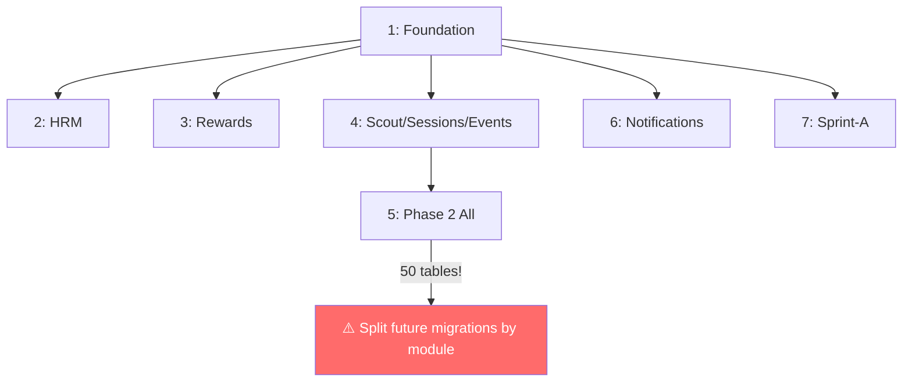

# T-0917: Migration + Rollback Notes — AI Agent Pack

> **Purpose:** AI agents know how to create, apply, and roll back DB migrations safely
> **Generated:** 2026-03-12 | **STORY-009 / WP-9.4 / M9.4**

---

## Migration File Registry

| # | Timestamp | Name | Tables | Size Risk |
|---|-----------|------|--------|-----------|
| 1 | 20260305110811 | `init_foundation_tables` | 8 | Low |
| 2 | 20260305112708 | `add_hrm_audit_models` | 5 | Low |
| 3 | 20260305113109 | `add_reward_engine_models` | 8 | Low |
| 4 | 20260305113435 | `add_scout_session_event_models` | 15 | Medium |
| 5 | 20260305114907 | `add_phase2_all_models` | 50 | ⚠️ HIGH |
| 6 | 20260305121858 | `add_notifications_models` | 4 | Low |
| 7 | 20260305164804 | `sprint_a_spices_file_system_import` | 12 | Medium |

**Location:** `apps/api/prisma/migrations/`
**Total:** 7 migrations → 60 tables

---

## Creating New Migrations

### Agent Recipe

```bash
# 1. Modify schema.prisma
# 2. Generate migration (DO NOT auto-apply in prod)
cd platform/apps/api
npx prisma migrate dev --name <descriptive_name>

# Naming convention:
#   add_{module}_{feature}        → new tables
#   alter_{table}_{change}        → column changes
#   idx_{table}_{columns}         → new indexes
#   drop_{table}_deprecated       → removing tables
```

### Migration Naming Rules
| Prefix | Usage | Example |
|--------|-------|---------|
| `add_` | New tables or columns | `add_scout_feedback_table` |
| `alter_` | Modify existing columns | `alter_events_add_max_age` |
| `idx_` | Add indexes | `idx_sessions_org_date` |
| `drop_` | Remove tables/columns | `drop_legacy_guardian_fields` |
| `fix_` | Fix constraint or data | `fix_member_exp_summary_fk` |

---

## Rollback Procedures

### Dev Environment
```bash
# Reset database completely (ONLY for dev)
npx prisma migrate reset --force

# This will:
# 1. Drop all tables
# 2. Re-apply all migrations in order
# 3. Run seed script (if exists)
```

### Production Rollback

> ⚠️ Prisma does NOT have built-in `migrate down`. Rollback requires manual SQL.

**Procedure:**
1. Create a new migration that reverses the changes
2. Name it `rollback_{original_name}`
3. Manually write the reverse SQL
4. Apply via `npx prisma migrate deploy`

**Critical Rules:**
- NEVER use `migrate reset` in production
- NEVER modify a migration file that has been applied
- ALWAYS test rollback SQL in staging first
- ALWAYS backup before migrate in production

---

## Schema Change Checklist (for AI Agents)

```markdown
Before modifying schema.prisma:
[ ] Check existing unique constraints — don't create duplicates
[ ] Add org_id to new models (RLS requirement)
[ ] Add @@index([orgId]) to every new model
[ ] Add created_at / updated_at timestamps
[ ] Use UUID for primary keys (gen_random_uuid)
[ ] Use String status fields (not enums) for SM compatibility
[ ] Run `npx prisma validate` before creating migration
[ ] Run `npx prisma generate` after migration
[ ] Update contracts/schemas/coverage-matrix.md
[ ] Update contracts/schemas/constraint-matrix.md
```

---

## Migration → Module Dependency Chain


