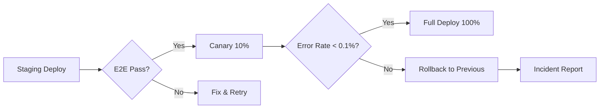

# T-0931→T-0935: Readiness Manifests, Release Evidence & CTO Handoff

> **Purpose:** Module-level readiness assessment, evidence packaging, and CTO sign-off trail
> **Generated:** 2026-03-12 | **STORY-009 / WP-9.7 / M9.7**

---

## Module Readiness Dashboard (T-0931)

| Module | Active | CRUD | SM | Events | RLS | E2E | Seed | **Ready** |
|--------|--------|------|-----|--------|-----|-----|------|-----------|
| M1 HRM | ✅ | ✅ | ✅ member-lifecycle | ✅ 7 events | 📋 doc only | ⚠️ stub | ⚠️ needed | 🟡 70% |
| M2 Projects | ✅ | ✅ | ⚠️ candidate | ✅ 4 events | 📋 doc only | ⚠️ required | ⚠️ needed | 🟡 50% |
| M3 Tickets | ✅ | ✅ | ⚠️ candidate | ✅ 4 events | 📋 doc only | ⚠️ required | — | 🟡 50% |
| M4 Finance | ✅ | ✅ | ⚠️ candidate | ✅ 4 events | 📋 doc only | ⚠️ required | ⚠️ needed | 🟡 50% |
| M5 Assets | ✅ | ✅ | ⚠️ candidate | ✅ 3 events | 📋 doc only | ⚠️ required | ⚠️ needed | 🟡 50% |
| M6 Process | ✅ | ⚠️ partial | ⚠️ candidate | ✅ 3 events | 📋 doc only | ⚠️ required | — | 🟠 40% |
| M7 LMS | ✅ | ✅ | ✅ 2 SMs | ✅ 5 events | 📋 doc only | ⚠️ required | ⚠️ needed | 🟡 60% |
| M8 Scout | ✅ | ✅ | ✅ 5 SMs | ✅ 19 events | 📋 doc only | ⚠️ stub | ⚠️ needed | 🟡 65% |
| M9 Rewards | ✅ | ✅ | ✅ redemption | ✅ 5 events | 📋 doc only | ⚠️ required | ⚠️ needed | 🟡 60% |
| M10 OrgConfig | ✅ | ✅ | — | ✅ 3 events | 📋 doc only | — | — | 🟡 55% |
| Notifications | ✅ | ✅ | — | ✅ 3 events | 📋 doc only | ⚠️ required | ⚠️ needed | 🟡 50% |
| File Storage | ✅ | ✅ | — | — | 📋 doc only | ⚠️ required | — | 🟡 55% |
| Child Safety | ✅ | ✅ | — | — | 📋 doc only | ⚠️ required | — | 🟡 50% |
| Data Import | ✅ | ✅ | — | — | 📋 doc only | ⚠️ required | — | 🟡 50% |

### Legend
- ✅ Implemented and verified
- ⚠️ Stub/required but not yet done
- 📋 Documented but not enforced at DB level
- 🟡 Partially ready (60-70%)
- 🟠 Low readiness (<50%)

---

## Release Evidence Bundle Format (T-0932)

Each release must include:

```
release-evidence/
├── {version}/
│   ├── api-diff.md              # OpenAPI diff from previous version
│   ├── migration-log.md         # New migrations applied
│   ├── e2e-results.json         # Playwright test results
│   ├── screenshots/             # UI verification screenshots
│   ├── ci-pipeline-log.txt      # GitHub Actions output
│   ├── deployment-log.txt       # Cloud Run deployment output
│   ├── readiness-snapshot.yaml  # Module readiness at release time
│   └── sign-off.md              # CTO/Lead sign-off
```

### Evidence Checklist per Release
```markdown
- [ ] All CI checks pass (lint, type-check, unit tests)
- [ ] E2E tests pass (Playwright)
- [ ] No P0 bugs open
- [ ] Migration applied successfully to staging
- [ ] OpenAPI spec regenerated and committed
- [ ] Readiness manifest updated
- [ ] CTO sign-off received
- [ ] Canary deployed (if applicable)
- [ ] Rollback plan documented
```

---

## CTO Review Dashboard (T-0933)

### Quick Links for CTO

| Resource | Path |
|----------|------|
| Module Readiness | `contracts/release/module-readiness.yaml` |
| Module Capabilities | `contracts/release/module-capabilities.yaml` |
| Checklist Sync | `contracts/release/checklist-sync.md` |
| State Machine Registry | `contracts/state-machines/` (15 files) |
| Schema Coverage | `contracts/schemas/coverage-matrix.md` |
| Scout Full Contract | `contracts/scout/` (5 files) |
| AI Agent Pack | `contracts/agent-pack/` (5 files) |
| Module Contract Packs | `contracts/modules/module-contract-packs.md` |
| Event Catalog | `contracts/events/catalog.json` (61 events) |

### Key Metrics for CTO

| Metric | Current | Target |
|--------|---------|--------|
| Prisma models | 63 | ~65 (enrichment pending) |
| API endpoints | 44 (Scout) + ~80 (others) | ~150 |
| State machines | 9 defined | 15+ (candidates identified) |
| E2E specs | 4 stubs | 20+ full specs |
| Domain events | 61 cataloged | 61 (complete) |
| RLS at DB level | 0 policies | ALL tables |
| Seed scripts | 1 (comprehensive) | 12 packs |

---

## Canary / Rollback Evidence (T-0934)

### Canary Deployment Protocol


### Rollback Evidence Required
| Item | Where | 
|------|-------|
| Previous working revision | Cloud Run revision history |
| Rollback migration SQL | `migrations/rollback_{name}/` |
| Incident timeline | `release-evidence/{version}/incident.md` |
| Root cause | `release-evidence/{version}/rca.md` |

---

## Final Handoff Pack (T-0935)

### CTO Handoff Document Structure

```markdown
# TTNDD_OPS Release Handoff — {Version}

## Executive Summary
- What's new in this release
- Key metrics and readiness

## Architecture Changes
- Schema changes (migration count)
- New modules or endpoints
- State machine updates

## Risk Assessment
- Known issues / tech debt
- Security status (RLS, auth)
- Performance concerns

## Evidence
- CI/CD pipeline results
- E2E test results
- Deployment logs
- Screenshots

## Sign-off
- PM: [name] [date]
- Lead Dev: [name] [date]
- CTO: [name] [date]
```

### Sign-off Trail
```yaml
sign_off:
  pm:
    name: "PM Agent"
    date: null
    status: pending
  lead_dev:
    name: null
    date: null
    status: pending
  cto:
    name: null
    date: null
    status: pending
```
