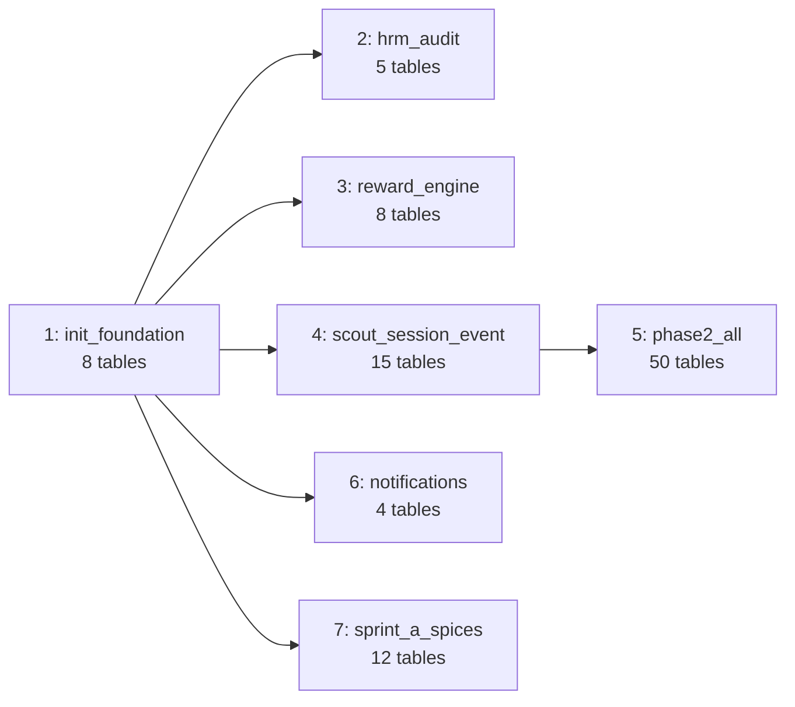

# T-0909: Migration File → Schema Row ID Mapping

> **Source:** `apps/api/prisma/migrations/` | 7 migration files
> **Generated:** 2026-03-12 | **STORY-009 / WP-9.2 / M9.2**

---

## Migration History

| # | Timestamp | Name | Tables Affected | Module Coverage |
|---|-----------|------|-----------------|-----------------|
| 1 | 20260305110811 | `init_foundation_tables` | organizations, branches, units, users, org_members, member_profiles, audit_logs, domain_events | M10 Core, M1 HRM (partial), Audit, Events |
| 2 | 20260305112708 | `add_hrm_audit_models` | guardian_links, child_data_access_logs, member_branch_history, org_chart_nodes, volunteer_availability | M1 HRM (complete) |
| 3 | 20260305113109 | `add_reward_engine_models` | exp_configs, exp_transactions, member_exp_summary, badge_definitions, member_badges, reward_items, reward_redemptions, leaderboard_snapshots | M9 Reward Engine |
| 4 | 20260305113435 | `add_scout_session_event_models` | program_versions, domains, skill_criteria, rank_definitions, skill_groups, skills, member_skill_progress, skill_evidence, skill_verifications, member_ranks, sessions, session_attendance, annual_programs, events, event_registrations | M8A Scout, M8B Sessions, M8C Events |
| 5 | 20260305114907 | `add_phase2_all_models` | courses, lessons, quizzes, quiz_questions, quiz_battles, member_course_progress, course_assignments, quiz_attempts, spiritual_logs, ngu_gioi_assessments, evaluations, mentoring_relationships, mentoring_logs, plans, plan_revisions, projects, project_phases, tasks, project_comments, task_dependencies, project_documents, time_entries, cost_entries, tickets, ticket_comments, ticket_status_history, ticket_routing_rules, ticket_sla_configs, ticket_attachments, approval_definitions, approval_requests, workflow_triggers, sop_documents, financial_accounts, financial_transactions, member_fees, fee_plans, fee_installments, sponsors, sponsor_contributions, asset_categories, assets, asset_custom_fields, asset_loans, kit_templates, kit_items, uniform_issues, maintenance_schedules, workflow_definitions, workflow_runs | M7 LMS, M8D Enrichment, M2 Projects, M3 Tickets, Approval, M4 Finance, M5 Assets, M6 Process |
| 6 | 20260305121858 | `add_notifications_models` | notifications, notification_preferences, notification_templates, notification_delivery_logs | Notifications |
| 7 | 20260305164804 | `sprint_a_spices_file_system_import` | habit_defs, habit_logs, achievement_defs, achievement_awards, activity_logs, file_object_refs, release_gate_reports, import_batches, transfer_cases, onboarding_templates, onboarding_progress, training_records | M8 Enrichment (V3), Files, Ops, Import, Transfer, Onboarding |

---

## Migration → Module Traceability

| Module | Migration # | Complete? |
|--------|------------|-----------|
| M10 Core | 1 | ✅ |
| M1 HRM | 1, 2 | ✅ |
| M9 Reward | 3 | ✅ |
| M8A Scout | 4 | ✅ |
| M8B Sessions | 4 | ✅ |
| M8C Events | 4 | ✅ |
| M7 LMS | 5 | ✅ |
| M8D Enrichment | 5, 7 | ✅ |
| M2 Projects | 5 | ✅ |
| M3 Tickets | 5 | ✅ |
| M4 Finance | 5 | ✅ |
| M5 Assets | 5 | ✅ |
| M6 Process | 5 | ✅ |
| Approval Engine | 5 | ✅ |
| Notifications | 6 | ✅ |
| Files / Storage | 7 | ✅ |
| Ops / Release | 7 | ✅ |
| Import | 7 | ✅ |
| Transfer | 7 | ✅ |
| Onboarding | 7 | ✅ |

**All 60 models have migration coverage across 7 files.**

---

## Migration Dependency Chain

> Migration 5 is the largest single migration (50 table creates/alters). Future migrations should be smaller, module-scoped.
