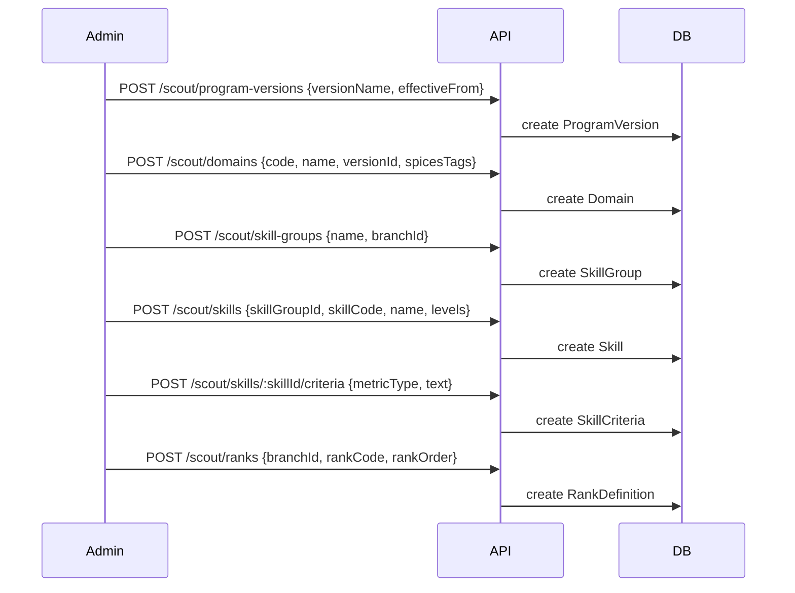
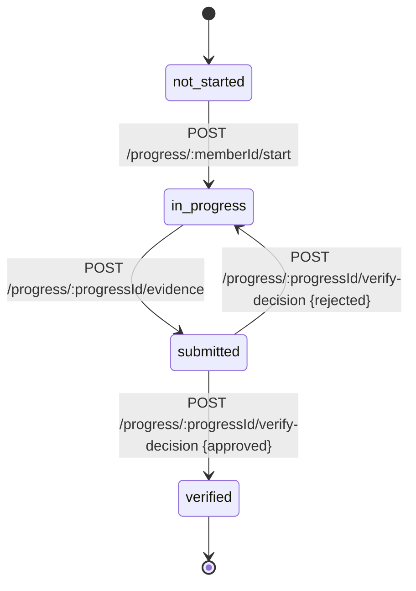
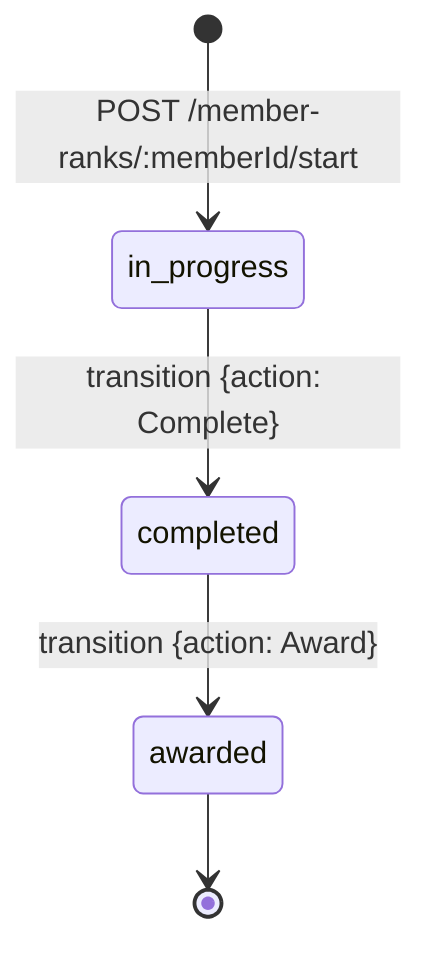
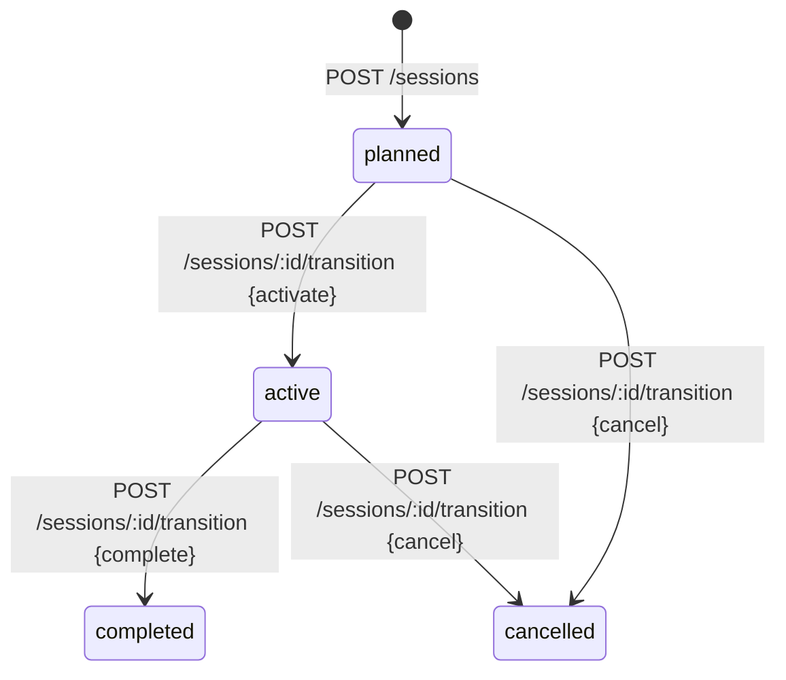
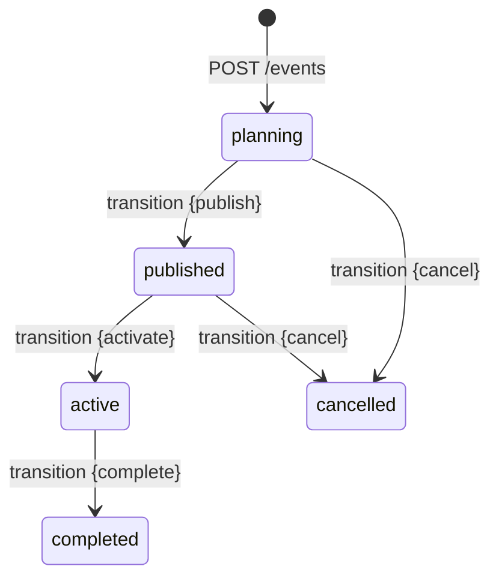
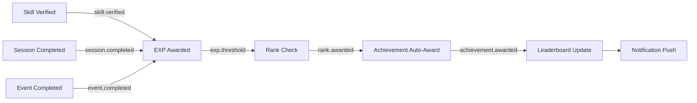

# T-0914: Scout Core AI-Agent Playbook per Flow

> **Purpose:** Provide AI agents with exact execution recipes for every Scout workflow
> **Generated:** 2026-03-12 | **STORY-009 / WP-9.3 / M9.3**

---

## Flow 1: Skill Tree Setup (Admin)

**Preconditions:** Organization + Branches must exist. Admin auth required.

**Agent Recipe:**
1. Fetch existing `program-versions` → choose or create
2. Create domains with SPICES tags → get `domainId`
3. Create skill groups → get `skillGroupId`
4. Create skills with level JSON → get `skillId`
5. Create criteria for each skill → finalize tree
6. Create rank definitions for each branch → skill tree complete

---

## Flow 2: Skill Progress (Member)

**Agent Recipe:**
1. `POST /scout/progress/:memberId/start` with `skillId` → creates MemberSkillProgress
2. Member uploads evidence via `POST /scout/progress/:progressId/evidence`
3. Admin reviews queue via `GET /scout/verify-queue`
4. Admin decides via `POST /scout/progress/:progressId/verify-decision`
5. On `approved`: SM transitions to `verified`, EXP awarded if configured
6. On `rejected`: returns to `in_progress`, member resubmits

---

## Flow 3: Rank Progression (Admin)

**Agent Recipe:**
1. `POST /scout/member-ranks/:memberId/start` with `branchId` + `rankId`
2. System checks: member has enough verified skills for this rank
3. `POST /scout/member-ranks/:memberId/transition` with `{action: "Complete"}`
4. Ceremony/badge award → `POST /scout/member-ranks/:memberId/transition` with `{action: "Award"}`
5. DomainEvent emitted: `rank.awarded` → Reward Engine listens

---

## Flow 4: Session Lifecycle (Admin)

**Agent Recipe:**
1. `POST /sessions` → creates with `planned` status
2. `PATCH /sessions/:id` → update lesson plan, materials
3. Day of session → `POST /sessions/:id/transition` {activate}
4. `POST /sessions/:id/attendance` → bulk mark attendance (idempotent)
5. After session → `PATCH /sessions/:id` with debrief notes + ratings
6. `POST /sessions/:id/transition` {complete} → triggers EXP for attendees

---

## Flow 5: Event/Camp Lifecycle (Admin)

**Agent Recipe:**
1. `POST /events` → creates with `planning` status
2. `PATCH /events/:id` → add schedule, RACI, risk assessment, safety
3. Safety checklist complete → `POST /events/:id/transition` {publish}
4. Members register: `POST /events/:id/register`
5. Parents consent: `POST /events/:id/consent`
6. Event day: admins check-in via `POST /events/:id/check-in/:memberId`
7. Post-event: update with `postEventReport` → transition {complete}

---

## Flow 6: Habit Tracking (Member)

**Agent Recipe:**
1. Admin creates habit: `POST /scout/habits` {key, name, cadence}
2. Member logs daily: `POST /scout/habits/:habitDefId/log` {personId, logDate, status}
3. Check streak: `GET /scout/habits/:personId/streak/:habitDefId`
4. Streak milestones → Achievement auto-award (if configured)

---

## Flow 7: Achievement Awards (Admin/System)

**Agent Recipe:**
1. Admin defines: `POST /scout/achievements` {key, name, rarity}
2. Manual award: `POST /scout/achievements/:defId/award` {personId, sourceEventId}
3. Auto-award: triggered by DomainEvent (streak milestone, rank awarded, etc.)
4. View awards: `GET /scout/achievements/:personId/awards`

---

## Cross-Flow Event Chain

