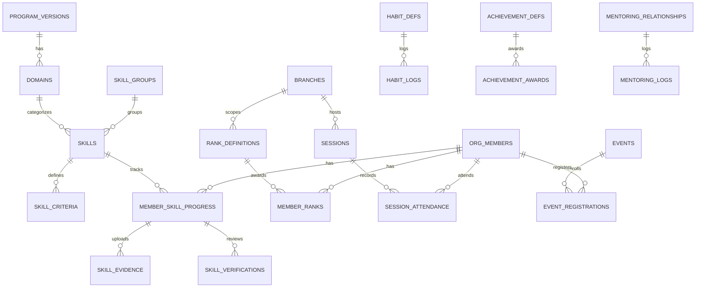

# T-0912: Scout Core SQL Migration Baseline & Projection Tables

> **Source:** `prisma/schema.prisma` L479–880 + L1064–1158 + migration files 4, 5, 7
> **Generated:** 2026-03-12 | **STORY-009 / WP-9.3 / M9.3**

---

## Sub-Module → Table Mapping

### 8A: Scout Core (15 tables)

| Table | Migration | PK | Multi-Tenant | Status SM |
|-------|-----------|----|--------------|-----------| 
| program_versions | #4 | UUID | org_id | program-version |
| domains | #4 | UUID | org_id | — |
| skill_criteria | #4 | UUID | org_id | — |
| rank_definitions | #4 | UUID | org_id | — |
| skill_groups | #4 | UUID | org_id | — |
| skills | #4 | UUID | org_id | — |
| member_skill_progress | #4 | UUID | org_id | skill-progress |
| skill_evidence | #4 | UUID | org_id | — |
| skill_verifications | #4 | UUID | org_id | — |
| member_ranks | #4 | UUID | org_id | rank-progression |
| habit_defs | #7 | UUID | org_id | — |
| habit_logs | #7 | UUID | org_id | — |
| achievement_defs | #7 | UUID | org_id | — |
| achievement_awards | #7 | UUID | org_id | — |
| activity_logs | #7 | UUID | org_id | — |

### 8B: Sessions & Attendance (3 tables)

| Table | Migration | PK | Multi-Tenant | Status SM |
|-------|-----------|----|--------------|-----------| 
| sessions | #4 | UUID | org_id | session-lifecycle |
| session_attendance | #4 | UUID | org_id | — |
| annual_programs | #4 | UUID | org_id | — (status field, no SM) |

### 8C: Events & Camps (2 tables)

| Table | Migration | PK | Multi-Tenant | Status SM |
|-------|-----------|----|--------------|-----------| 
| events | #4 | UUID | org_id | event-lifecycle |
| event_registrations | #4 | UUID | org_id | — |

### 8D: Enrichment (5 tables)

| Table | Migration | PK | Multi-Tenant | Status SM |
|-------|-----------|----|--------------|-----------| 
| spiritual_logs | #5 | UUID | org_id | — |
| ngu_gioi_assessments | #5 | UUID | org_id | — |
| evaluations | #5 | UUID | org_id | — (status, no SM) |
| mentoring_relationships | #5 | UUID | org_id | — (status, no SM) |
| mentoring_logs | #5 | UUID | org_id | — |

---

## Key Indexes (Scout-specific)

| Table | Index Columns | Purpose |
|-------|--------------|---------|
| member_skill_progress | (org_member_id, skill_id) UQ | One progress per member+skill |
| member_ranks | (org_member_id, branch_id, rank_id) UQ | One rank per path |
| habit_defs | (org_id, key) UQ | Unique habit key per org |
| habit_logs | (person_id, habit_def_id, log_date) UQ | One log per day |
| achievement_defs | (org_id, key) UQ | Unique achievement per org |
| session_attendance | (session_id, org_member_id) UQ | One record per session |
| annual_programs | (org_id, branch_id, year) UQ | One per branch/year |
| event_registrations | (event_id, org_member_id) UQ | One per member |
| sessions | (org_id, session_date) IDX | Date queries |
| events | (org_id, start_date) IDX | Date queries |
| spiritual_logs | (org_member_id, log_date, log_type) UQ | One per day/type |
| ngu_gioi_assessments | (org_member_id, week_start) UQ | Weekly assessment |
| evaluations | (org_id, org_member_id) IDX | Member evals |
| mentoring_relationships | (org_id, mentor_id, mentee_id) UQ | Unique pairing |

---

## Foreign Key Chain

---

## Projection Tables (Future Sprint)

> Tables needed but not yet in schema:

| Table | Purpose | Blocking Story |
|-------|---------|----------------|
| `skill_tree_snapshots` | Cached skill tree per version | S8-optimization |
| `rank_completion_snapshots` | Rank progress aggregation | S8-analytics |
| `attendance_summary` | Monthly/yearly attendance stats | S8-reporting |
| `event_feedback` | Post-event surveys | S8-feedback |
