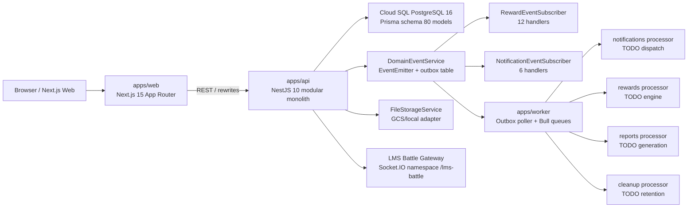
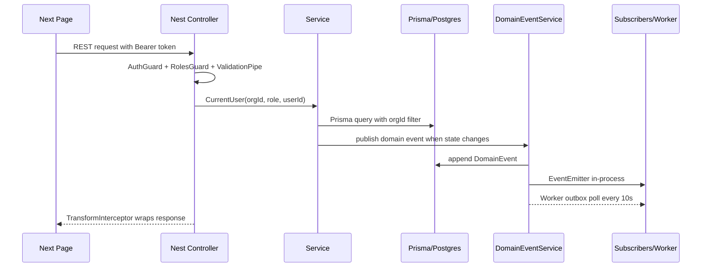

# TTNDD_Operations - PRD hiện trạng và roadmap cải tiến

> Report 1/3. Mục tiêu: review thật kỹ repo `hts2008/TTNDD_Operations`, đối chiếu bản remote GitHub với local PC, mô tả hệ thống là gì, đang có gì, đang build tới đâu, thiếu logic/dataflow ở đâu, và đề xuất hướng xử lý.

## 0. Metadata

| Mục                          | Giá trị                                                                                                                                                  |
| ------------------------------ | ----------------------------------------------------------------------------------------------------------------------------------------------------------- |
| Ngày audit                    | 2026-05-14                                                                                                                                                  |
| Workspace local                | `D:\0.APP\TTNDD_Ops\platform`                                                                                                                               |
| Remote                         | `https://github.com/hts2008/TTNDD_Operations.git`                                                                                                           |
| Local branch                   | `main`                                                                                                                                                      |
| Local HEAD                     | `84557a7 fix(ci): all 332 tests pass + contract lint fixed`                                                                                                 |
| Remote `origin/main` sau fetch | `a7e1d0c fix(ci): resolve lint errors and test runner failures`                                                                                             |
| Local vs remote                | Local đang ahead `origin/main` 1 commit; có 9 file CSV export untracked trong `apps/api/tmp/exports/`                                                     |
| Branch remote tham khảo      | `origin/claude/review-ttndd-repo-sUvWf` có 3 docs review cũ, nhưng docs đó chưa tồn tại trong local `main` và có vài nhận định đã stale |
| Phạm vi audit                | Read-only với source code; có tạo 3 report trong `docs/reviews/`; không sửa code ứng dụng                                                       |

## 1. Tóm tắt điều hành

TTNDD_Operations không chỉ là "vỏ UI", nhưng feedback "xài tới đâu lỗi data tới đó" là đúng ở tầng sản phẩm. Repo hiện tại là một monorepo full-stack TypeScript khá lớn: backend NestJS modular monolith có 19 module nghiệp vụ/hạ tầng, Prisma schema 80 model, 312 decorator route REST, 83 event constants, 18 listener `@OnEvent`, worker app, contract artifacts, CI/CD và 332 unit tests pass. Vì vậy nền móng kỹ thuật không rỗng.

Khoảng cách chính nằm ở lớp **kết nối vận hành thực tế**:

- Frontend nhiều page đã có nút, bảng, sidebar, subpage nhưng vẫn dùng mock/fallback demo hoặc gọi sai endpoint.
- API client FE chưa thống nhất base path/auth/error handling; có page dùng `api.ts`, page dùng raw `fetch('/api/v1/...')`, page dùng raw `fetch('/api/...')`.
- Một số route FE gọi endpoint không tồn tại hoặc không đúng namespace backend, ví dụ `/approvals/requests`, `/consent-templates` trong FE trong khi backend đang đặt dưới `/tickets/...`.
- Dashboard và HUD là bộ mặt sản phẩm nhưng đang hard-code `STATS`, `RECENT_ACTIVITIES`, `SPICES`, `MOCK_HUD`, `MOCK_QUESTS`.
- Worker đã có Bull/outbox skeleton nhưng processors chính vẫn TODO, tức là async engine chưa thật: reward auto-award, notification delivery, report/export background, cleanup/retention vẫn chưa chạy end-to-end.
- PostgreSQL RLS có file SQL đầy đủ nhưng không nằm trong migration list; chưa thấy runtime interceptor set `app.current_org_id`. Multi-tenant isolation thực tế vẫn phụ thuộc app-level query filter.
- WebSocket LMS Battle đọc `orgId/userId` từ query param và chưa verify JWT; frontend cũng chưa dùng Socket.IO client thật.
- Known-issues docs hiện stale: ví dụ HRM KI-002 nói parent portal API chưa có, nhưng local code đã có `ParentPortalController`; File Storage KI-002 nói chưa enforce size limit, nhưng service đã enforce 50MB.

Verdict: **backend-rich alpha, frontend integration partial, production-readiness chưa đạt**. Hệ thống đã qua "compile/test foundation", nhưng chưa qua "real workflow acceptance". Cần một phase "Make It Real" để gỡ mock, nối dataflow, chuẩn hóa API client/auth, và chứng minh các hành trình nghiệp vụ bằng E2E.

## 2. Evidence đã kiểm chứng

| Check                                   | Kết quả                                                                                      |
| --------------------------------------- | ------------------------------------------------------------------------------------------------ |
| `git fetch origin`                      | Thành công; phát hiện thêm branch remote review cũ                                        |
| `git status --short --branch`           | `main...origin/main [ahead 1]`; có CSV export untracked                                         |
| `pnpm --filter api test -- --runInBand` | PASS: 31 suites, 332 tests                                                                       |
| `pnpm build`                            | PASS ngoài sandbox: 7 packages build thành công; Next build tạo 33 static pages             |
| Metrics static                          | 24 controllers, 44 services, 25 module files, 80 Prisma models, 34 Next `page.tsx`, 48 TSX files |
| API route decorators                    | 312 `@Get/@Post/@Patch/@Delete/@Put` decorators                                                  |
| Event constants                         | 83 event string constants trong `packages/constants/src/events.ts`                               |
| Event subscribers                       | 18 real `@OnEvent(...)` handlers: 12 rewards + 6 notifications                                   |
| Tests tồn tại                       | 46 Playwright specs trong `tests/e2e`, 1 API e2e, 31 API unit specs                              |
| Contracts/docs                          | 56 docs/contracts files, 24 release-readiness artifacts                                          |

Build notes:

- Build pass có warning Next.js vì tồn tại thêm `apps/web/package-lock.json` bên cạnh root `pnpm-lock.yaml`.
- Web build đang `Skipping linting` theo `apps/web/next.config.ts` (`eslint.ignoreDuringBuilds=true`), nên build pass không đồng nghĩa lint FE sạch.
- Lệnh build trong sandbox fail do Turbo không ghi được log cache, sau đó pass khi chạy ngoài sandbox. Đây là vấn đề quyền môi trường, không phải lỗi code.

## 3. TTNDD_Operations là gì?

TTNDD_Operations là nền tảng quản lý và vận hành cho Đoàn Thiếu Nhi Đạo Đức / Thanh Thiếu Niên Đại Đạo. Product kết hợp ba lớp:

1. **ERP nhẹ cho tổ chức đoàn**: quản lý đoàn sinh, phụ huynh, trưởng, sinh hoạt, sự kiện, tài chính, tài sản, ticket, SOP, báo cáo.
2. **Nền tảng giáo dục Hướng Đạo + Cao Đài**: skill/chuyên hiệu, rank progression, spiritual log, Ngũ Giới, mentoring, LMS.
3. **Game hub MMORPG**: HUD, EXP, level, badge, quest panel, leaderboard, battle quiz, SPICES radar.

Mục tiêu business là thay thế vận hành rời rạc bằng Excel/Google Sheets/Zalo, đồng thời tạo trải nghiệm thú vị để đoàn sinh và phụ huynh thấy được tiến trình phát triển toàn diện.

## 4. Kiến trúc tổng quan

### Stack chính

| Layer     | Hiện trạng                                                                                                                                  |
| --------- | ----------------------------------------------------------------------------------------------------------------------------------------------- |
| Monorepo  | Turborepo + pnpm workspaces                                                                                                                     |
| Frontend  | Next.js 15, React 19, Tailwind 4, Zustand, TanStack Query dependency có nhưng chưa dùng nhất quán                                        |
| Backend   | NestJS 10, REST, Swagger, ValidationPipe, Firebase Admin, Prisma 5                                                                              |
| Worker    | Nest worker app, Bull queues, outbox consumer, health controller; processors còn TODO                                                          |
| Database  | PostgreSQL 16, Prisma schema 80 model, 10 migrations                                                                                            |
| Events    | `@ttndd/constants` event catalog + DomainEvent outbox + in-process subscribers                                                                  |
| Storage   | `FileStorageService` có signed upload/download URL, MIME allowlist, size limit 50MB                                                            |
| Auth      | Firebase Identity Platform / dev-token local, global AuthGuard + RolesGuard                                                                     |
| Contracts | OpenAPI JSON/types, events catalog, state-machine registry, release readiness YAML                                                              |
| Deploy    | Cloud Build YAML cho API/Web; GitHub CD tự động cho API, web deploy config riêng nhưng chưa thấy GitHub workflow tự động cho web |

## 5. Codebase đang có gì?

### 5.1 Top-level apps/packages

| Path                 | Vai trò                             | Nhận định                                                                                     |
| -------------------- | ------------------------------------ | -------------------------------------------------------------------------------------------------- |
| `apps/api`           | Backend NestJS                       | Phần giàu nhất của repo; module/controller/service/data model khá đầy đủ             |
| `apps/web`           | Next.js frontend                     | UI shell phong phú, nhiều route, nhưng data fetching phân mảnh và nhiều mock/fallback      |
| `apps/worker`        | Worker/async processing              | Có outbox poller và Bull queues; logic processors chưa triển khai thật                      |
| `packages/constants` | Event constants, roles, SPICES       | Có 83 event strings; là shared backbone                                                          |
| `packages/shared`    | Types, validators, api-client helper | Có type-safe client scaffold nhưng FE chưa dùng                                                |
| `packages/ui`        | Shared UI package                    | Hiện gần như placeholder (`export {}`), MMORPG UI vẫn nằm trong `apps/web/src/components` |
| `packages/tokens`    | Design tokens                        | Có tokens JSON/export; theme variants chưa được vận hành rõ                              |
| `contracts`          | SSoT contracts                       | Có OpenAPI, event catalog, DB appendix, state machines, release readiness                         |
| `docs`               | Audit/runbook/known issues           | Nhiều tài liệu hữu ích nhưng một số đã stale so với code HEAD                      |

### 5.2 Backend module map

| Module           | Backend hiện có                                                                    | Gaps chính                                                                                                         |
| ---------------- | ------------------------------------------------------------------------------------- | ------------------------------------------------------------------------------------------------------------------- |
| Auth/Core        | Login, `/auth/me`, global AuthGuard/RolesGuard, decorators, interceptors              | Production payload thiếu `memberId` trong `AuthService.resolveUser`; FE auth state không hydrate user sau reload |
| HRM              | Member lifecycle, guardians, compliance, org chart, parent portal controller          | Known issue stale; CSV validator/import chưa nối sâu; parent portal cần FE/user-permission hardening          |
| Org Config/IAM   | Organizations, branches, units, role/assignment/deactivate/reactivate                 | Branch merge, org archival/deactivation lifecycle còn thiếu                                                      |
| Dashboards       | Backend `/dashboards/org`, `/spices`, `/my`, reports/export/search                    | FE `/dashboard` không dùng backend, vẫn hard-code                                                               |
| Sessions         | REST session lifecycle, attendance, report                                            | FE `/sessions` 100% `MOCK_SESSIONS`                                                                                 |
| Events           | Create/list/update/transition/register/consent/check-in                               | FE cần kiểm chứng toàn flow; notify/calendar/waitlist còn chưa đủ                                       |
| Scout            | Skills/ranks/evidence/dashboard; rank progression service                             | Evidence vẫn URL/file-ref integration chưa khép kín; mentor assignment chuyên sâu chưa có                  |
| LMS              | Course/module/lesson/quiz/attempt/battle/offline pack/grading queue                   | `assignMentor` stub; WS no JWT; FE Battle chưa dùng Socket.IO; PWA offline chưa có                              |
| Rewards          | EXP, cap, penalties, leaderboard, peer recognition, shop, badge manual award          | Auto-award engine chưa có; level summary không có model riêng; worker reward processor TODO                    |
| Enrichment       | Spiritual logs, Ngũ Giới, evaluation, mentoring                                    | Dashboard analytics/streak/trend/evaluation-cycle còn thiếu                                                      |
| Projects/Plans   | Plan templates, plan/project/task lifecycle, versions endpoint, calendar/kanban       | `PlanVersion` table không có; Gantt/comment/@mention chưa đủ                                                  |
| Tickets/Approval | Ticket CRUD, transition, SLA, consent templates under `/tickets`, single approval     | FE `/approvals` gọi sai namespace; multi-step approval table chưa có                                             |
| Finance          | Accounts, transactions, fees, fee plans, sponsors, exports, projections               | Cost centers/fee plans/sponsors lÆ°u trong `Organization.settings` JSON; no double-entry                            |
| Assets           | Asset/category/loan/guardian accept/kit/maintenance/uniform/export                    | Photo upload integration chưa rõ; overdue/maintenance notifications chưa thật                                  |
| Process/SOP      | SOP lifecycle, workflow definitions/runs, graph executor, templates                   | Workflow-builder autosave TODO; delay/parallel execution chưa thật                                               |
| Child Safety     | Incident report/list/escalate/evidence/export, 2-adult validation, retention endpoint | Notification/timeline/retention cron chưa có                                                                      |
| Notifications    | Inbox, unread count, preferences, templates, event subscriber                         | Push/email/SMS/realtime delivery chưa thật; worker notification processor TODO                                   |
| File Storage     | Signed upload/download URL, list, soft-delete, MIME + size limit                      | Chưa có finalize/scan; chưa tích hợp vào Scout/Asset/LMS/SOP FE workflows                                    |
| Data Import      | Template, member import, history                                                      | Chỉ members; no progress tracking/dedup/background job                                                            |
| System           | Health/canary/probes/module health/seed/release gates                                 | External monitoring/retention vẫn chưa đủ; probes mostly in-process                                           |

## 6. Data model và dataflow

### 6.1 Data model

Repo có 80 Prisma models. Các nhóm data chính:

- Identity/org: `Organization`, `Branch`, `Unit`, `User`, `OrgMember`, `OrgChartNode`, `AuditLog`.
- HRM: `MemberProfile`, `GuardianLink`, `MemberBranchHistory`.
- Scout/reward: `RankDefinition`, `SkillGroup`, `Skill`, `MemberSkillProgress`, `MemberRank`, `SkillEvidence`, `ExpTransaction`, `MemberExpSummary`, `BadgeDefinition`, `MemberBadge`, `RewardItem`, `RewardRedemption`, `LeaderboardSnapshot`, `PeerRecognition`.
- Learning/events: `Session`, `SessionAttendance`, `AnnualProgram`, `Event`, `EventRegistration`, `Course`, `Lesson`, `Quiz`, `QuizAttempt`, `QuizBattle`, `MemberCourseProgress`.
- Operations: `Plan`, `Project`, `ProjectTask`, `Ticket`, `TicketComment`, `TicketStatusHistory`, `FinancialAccount`, `FinancialTransaction`, `MemberFee`, asset/process/notification/file/import/system models.

### 6.2 Dataflow phổ biến

Dataflow này có skeleton đúng, nhưng còn 3 điểm chưa đóng:

1. **RLS runtime context chưa có**: RLS SQL có `current_setting('app.current_org_id')`, nhưng chưa có migration và chưa thấy interceptor set context.
2. **Worker business logic chưa có**: events có thể được dispatch queue, nhưng processors không làm nghiệp vụ thật.
3. **FE contract không typed end-to-end**: FE không dùng OpenAPI generated types/client, nên dễ gọi sai endpoint.

## 7. FE/BE connection heatmap

| UI route                      | Tình trạng              | Ghi chú                                                                              |
| ----------------------------- | -------------------------- | ------------------------------------------------------------------------------------- |
| `/login`                      | Khá thật                | Gọi `POST /auth/login`; dev/prod auth có logic riêng                               |
| Layout HUD/Quest panel        | Mock                       | `MOCK_HUD`, `MOCK_QUESTS` trong dashboard layout                                      |
| `/dashboard`                  | Mock                       | `STATS`, `RECENT_ACTIVITIES`, `SPICES` hard-code dù backend dashboards có API       |
| `/members`                    | Thật một phần        | Raw fetch `/api/v1/hrm/members`; không dùng typed client/TanStack                   |
| `/members/[id]`               | Thật một phần        | Raw fetch character sheet; nhiều UI đã nối API                                   |
| `/members/compliance`         | Thật một phần        | Raw fetch compliance dashboard                                                        |
| `/parent-portal`              | Backend có, FE raw fetch  | Known issue doc stale; cần test auth/guardian matching                              |
| `/sessions`                   | Mock                       | `MOCK_SESSIONS`; nút tạo chưa gắn flow thật                                   |
| `/events`                     | Partial                    | Có route/backend, cần kiểm chứng register/consent/check-in end-to-end          |
| `/lms`, `/lms/[courseId]`     | Partial                    | REST có nhiều endpoint; mentor/offline/PWA chưa đủ                              |
| `/lms/battle/[code]`          | REST partial, no WS client | Backend WS no JWT; FE không thấy Socket.IO client                                  |
| `/scout`, `/skills`           | Partial/thật             | Skill/rank/evidence flow có BE; upload file chưa khép kín                         |
| `/rewards`, `/rewards/badges` | Partial/thật             | Manual API có; auto-award engine chưa có                                           |
| `/approvals`                  | Broken fallback            | FE gọi `/approvals/requests`; backend không có namespace này; fallback demo data  |
| `/consent-templates`          | Broken fallback            | FE gọi `/consent-templates`; backend đang là `/tickets/consent-templates`          |
| `/tickets`, `/tickets/[id]`   | Partial/thật             | Ticket APIs có; approval model còn single-level                                     |
| `/finance`                    | Partial                    | Gọi API nhưng cost center/sponsor/fee plan là JSON settings; exports TSV/CSV style |
| `/assets`                     | Partial                    | Dùng raw fetch; có silent catch; file photo integration chưa có                   |
| `/process/workflow-builder`   | UI shell partial           | TODO autosave actual API khi có definitionId                                         |
| `/settings/release`           | Mock                       | `MOCK_GATES`                                                                          |
| `/notifications`              | In-app partial             | DB inbox có; delivery/realtime chưa có                                             |

## 8. Top rủi ro hiện trạng

| #   | Rủi ro                                          | Mức  | Vì sao quan trọng                                                                               |
| --- | ------------------------------------------------- | ------ | ------------------------------------------------------------------------------------------------- |
| 1   | FE route gọi sai endpoint và fallback demo data | High   | Người dùng thấy dữ liệu giả, tưởng chức năng chạy nhưng không thay đổi DB |
| 2   | Dashboard/HUD mock                                | High   | Bộ mặt sản phẩm không phản ánh dữ liệu thật; mất niềm tin khi pilot          |
| 3   | Worker processors TODO                            | High   | Reward auto, notification delivery, reports, cleanup không hoạt động thật                 |
| 4   | RLS SQL không có migration/runtime context      | High   | Multi-tenant safety chỉ dựa vào app filter                                                   |
| 5   | LMS Battle WS không xác thực                  | High   | Có thể join/submit bằng query param giả                                                    |
| 6   | API client FE không chuẩn hóa                 | High   | Mỗi page tự fetch, lỗi auth/base path/error handling lặp lại                            |
| 7   | Auth store không hydrate user sau reload         | Medium | Sidebar/header/user-dependent flows có thể mất context dù token còn                        |
| 8   | Known-issues docs stale                           | Medium | Team có thể ưu tiên sai vì docs nói thiếu cái đã có hoặc ngược lại            |
| 9   | File storage API chưa tích hợp module         | Medium | Evidence/photo/lesson/SOP upload vẫn chưa thành workflow người dùng                        |
| 10  | CI contract drift chưa thật                    | Medium | CI validate JSON tồn tại/build API, nhưng chưa generate-and-diff OpenAPI/event catalog      |

## 9. Roadmap cải tiến đề xuất

### P0 - Make It Real (2 sprint)

Mục tiêu: người dùng pilot không còn gặp "vỏ UI" ở các route lõi.

1. Chuẩn hóa FE API client: base path `/api/v1`, auth token, 401/403/422 mapping, response wrapper, typed OpenAPI helper.
2. Hydrate auth user bằng `/auth/me` sau reload; production payload trả `memberId`.
3. Gỡ mock/fallback ở dashboard, HUD, sessions, approvals, consent templates, settings release.
4. Sửa endpoint mapping: `/approvals` dùng ticket approval API hoặc tạo namespace backend thật; `/consent-templates` dùng `/tickets/consent-templates`.
5. Dùng backend dashboards API cho `/dashboard` và HUD dùng rewards/scout/session query thật.
6. Add smoke E2E cho login -> dashboard -> members -> sessions -> tickets -> notifications.
7. Update stale known-issues docs để roadmap không lệch code.

### P1 - Secure & Async Foundation (2 sprint)

1. WebSocket JWT guard cho LMS Battle; FE dùng Socket.IO client thật.
2. RLS phase 1: migration + `TenantInterceptor` set `app.current_org_id`, `app.current_member_id`, `app.user_role`.
3. Implement worker processors tối thiểu: notifications, rewards, cleanup, reports.
4. Notification delivery: in-app queue + email/push provider abstraction, delivery logs.
5. Reward auto-award: evaluate `BadgeDefinition.triggerEvent/triggerConfig`, enqueue from event subscriber.
6. True contract drift gate: generate OpenAPI/event catalog/db appendix and diff in CI.

### P2 - Workflow Completeness (2-3 sprint)

1. File upload end-to-end: upload request -> direct upload -> finalize -> scan/status -> attach to Scout/Asset/LMS/SOP.
2. Data Import v2: background job, progress tracking, dedup, imports beyond members.
3. Sessions/Event full flows: create, publish, attendance/check-in, consent, notification, report.
4. Process executor: delay node real, auto-save graph, retry/stuck handling UX.
5. Parent Portal hardening: guardian matching, child progress aggregation, consent/fee/session views.

### P3 - Compliance & Accounting (2-3 sprint)

1. RLS full coverage for every tenant-scoped table.
2. Finance: `CostCenter`, `Sponsor`, `FeePlan` tables; optional double-entry ledger.
3. Tickets: `ApprovalRequest` + `ApprovalStep` for multi-step approvals and SLA timer job.
4. Dashboards: real SPICES drilldown, branch/unit filters, export to true XLSX.
5. Observability: Cloud Monitoring dashboards, alerting, restore drill evidence, web CD workflow.

## 10. Definition of Done cho phase tiếp theo

Một chức năng chỉ được coi là "dùng thật" khi đạt đủ:

- UI không dùng mock/fallback demo data.
- UI gọi endpoint backend đúng namespace và có error state rõ.
- Backend có validation, role guard, org isolation và audit/domain event nếu là state change.
- Data ghi/đọc được từ Prisma model thật hoặc quyết định JSON storage đã được ADR hóa.
- Có unit hoặc E2E cover happy path + lỗi chính.
- Contract OpenAPI/event catalog không drift.
- Known-issue tương ứng được đóng/cập nhật.
- Build + test pass, và nếu UI thì có manual smoke bằng browser hoặc Playwright.

## 11. Kết luận

Không nên viết lại từ đầu. Repo hiện có nhiều foundation tốt: backend module map rộng, schema và contracts đã khá hoàn chỉnh, build/test hiện pass. Việc cần làm là **kéo frontend/dataflow/worker lên ngang backend**, đóng các đường đứt đoạn khiến người dùng thấy lỗi data. Roadmap nên bắt đầu bằng P0 "Make It Real", không bắt đầu bằng thêm tính năng mới.
