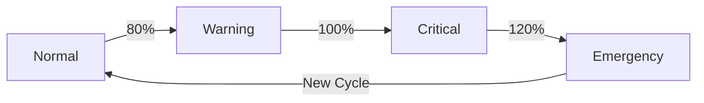

# Cost Degradation Policy — TTNDD_Ops

## Overview

Tiered feature degradation to protect budget cap of **800,000 VND/month**.

## Degradation Tiers



### Tier 1: Warning (80% = 640K VND)

**Trigger**: Budget alert at 80% threshold.

**Actions**:
- ❌ Disable optional modules:
  - `module.warehouse_sync` (BigQuery sync)
  - `module.parent_portal` (Parent Portal)
  - `feature.zalo_channel` (Zalo OA)
  - `feature.fcm_channel` (Push notifications)
  - `feature.email_channel` (Email service)
  - `feature.pdf_export` (PDF generation)
- ✅ Core modules remain active: HRM, Scout, LMS, Finance, Notifications

**API**: `POST /admin/cost/degrade {"level": "warning"}`

### Tier 2: Critical (100% = 800K VND)

**Trigger**: Budget alert at 100% threshold.

**Actions**:
- All Warning actions, plus:
- ⚠️ Alert admin immediately
- 📊 Review: can we wait for next billing cycle?
- 🔒 Consider scaling down Cloud Run instances

**API**: `POST /admin/cost/degrade {"level": "critical"}`

### Tier 3: Emergency (120% = 960K VND)

**Trigger**: Budget alert at 120% threshold.

**Actions**:
- 🚨 **Kill-switch**: Scale Cloud Run to 0 instances
- 📧 Notify all stakeholders
- 📋 Document incident for postmortem

**Manual command**:
```bash
gcloud run services update ttndd-api \
  --max-instances=0 \
  --region=asia-southeast1
```

## Recovery Procedure

When a new billing cycle starts OR budget is increased:

1. **Re-enable Cloud Run**:
```bash
gcloud run services update ttndd-api \
  --max-instances=3 \
  --region=asia-southeast1
```

2. **Re-enable all feature flags**:
```bash
curl -X POST https://api.ttndd.org/admin/cost/recover \
  -H "Authorization: Bearer $ADMIN_TOKEN"
```

3. **Verify health**: `GET /health/probes`

4. **Review spend**: GCP Console → Billing → Reports

## Feature Flag Mapping

| Flag Key | Module | Default | Disabled At |
|----------|--------|---------|-------------|
| `module.hrm` | HRM | ON | Never |
| `module.scout` | Scout | ON | Never |
| `module.lms` | LMS | ON | Never |
| `module.finance` | Finance | ON | Never |
| `module.warehouse_sync` | BigQuery | OFF | 80% |
| `module.parent_portal` | Parent | OFF | 80% |
| `feature.pdf_export` | PDF | ON | 80% |
| `feature.zalo_channel` | Zalo | OFF | 80% |
| `feature.fcm_channel` | FCM | OFF | 80% |
| `feature.email_channel` | Email | OFF | 80% |

## Monitoring

- Budget status: `GET /admin/cost/status`
- Feature flags: `GET /admin/feature-flags` (existing endpoint)
- Health probes: `GET /health/probes`
