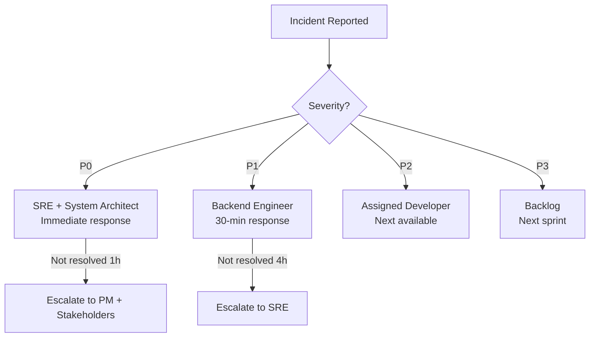

# Hypercare Triage Runbook — TTNDD_Ops

## Overview

**Hypercare period**: 2–4 weeks post-go-live. Dedicated support and monitoring.

## Incident Severity Definitions

| Severity | Description | Example | SLA Response | SLA Resolution |
|----------|-------------|---------|--------------|----------------|
| **P0 — Critical** | System down, data loss risk | API returns 500 for all users | 15 min | 2 hours |
| **P1 — Major** | Core feature broken | Attendance not saving | 30 min | 4 hours |
| **P2 — Moderate** | Non-core feature issue | PDF export fails | 2 hours | 1 business day |
| **P3 — Minor** | Cosmetic / UX issue | Button misaligned | 1 business day | Next sprint |

## Escalation Matrix

## Triage Workflow

### Step 1: Receive & Classify
1. Incident reported via: support email, in-app button, or direct message
2. Assign severity (P0–P3) based on impact and scope
3. Log in ticketing system with:
   - Reporter name
   - Description
   - Steps to reproduce
   - Screenshots (if available)
   - Assigned severity

### Step 2: Investigate
1. Check health probes: `GET /health/probes`
2. Check error logs: Cloud Run logs
3. Check recent deploys: any rollback needed?
4. Check budget status: `GET /admin/cost/status`

### Step 3: Resolve
| Action | When |
|--------|------|
| Rollback | New deploy caused regression |
| Hotfix | Single bug, clear fix |
| Workaround | Complex root cause, need time |
| Feature flag | Disable problematic feature |

### Step 4: Communicate
- Notify affected users of status
- Update ticket with resolution
- Document root cause for postmortem

## Daily Hypercare Checklist

- [ ] Review overnight error logs
- [ ] Check health probes all green
- [ ] Review new support tickets
- [ ] Check budget status (within thresholds?)
- [ ] 10-min standup with pilot Trưởng (if needed)
- [ ] Update hypercare dashboard

## End of Hypercare

Criteria to exit hypercare:
- [ ] < 2 P1+ incidents in last 7 days
- [ ] Error rate < 1% sustained
- [ ] Uptime > 99.5% for last 14 days
- [ ] Pilot Trưởng confirms satisfaction
- [ ] Budget within 100% threshold
- [ ] All P0/P1 tickets resolved

## Transition to BAU (Business As Usual)
1. Formal sign-off meeting
2. Transfer support to standard channels
3. Archive hypercare dashboard
4. Conduct postmortem review
5. Document lessons learned
